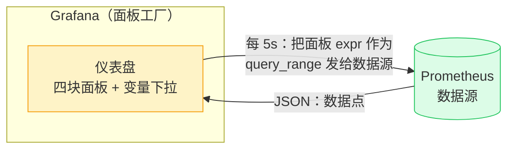
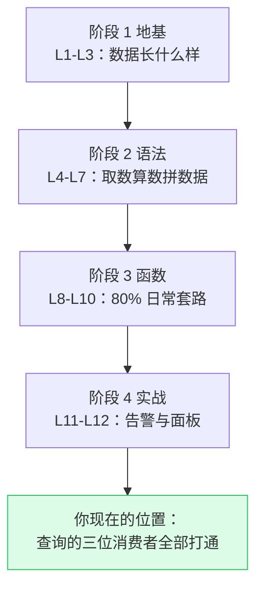

# L12 实战二：Grafana 面板套路与查询优化

> 阶段 4 · 实战应用 | 零基础 + 实操 | 预计 60 分钟

## 第一幕：告警响了，然后呢

L11 讲了告警怎么把人叫醒。但叫醒只是第一步——凌晨三点被电话叫醒的值班员，第一件事是打开什么？**面板**。告警说「P95 超标了」，面板回答「超了多少、从几点开始、还有谁一起超」。

回看 L1 架构图的三位消费者：你（临时查询）、告警（L11 供货）、Grafana（面板）——最后一位今天正式登场。L1 那时你点过 **Graph 标签页**，当时说「这就是后面 Grafana 面板的雏形」——那张支票今天兑现。

先说清面板和查询的本质区别，一句话：**查询是问一次，面板是把问句焊在屏幕上，每 5 秒自动重问**。

焊住的不是一句话，是三样东西：查询（expr）、展示规格（单位/图例/阈值线）、刷新策略（多久重问一次）。所以面板的成本 = 查询的成本 × 刷新频率——这就是为什么查询优化是本课的另一半：**一块坏查询的面板，是每 5 秒自动重播一次的负载**。

## 第二幕：解剖一块面板

### 四件套：expr、图例、单位、阈值线

拿全课程的主角——P95 流水线——做成一块面板，规格表长这样：

| 部件 | 值 | 出处 |
|------|------|------|
| 标题 | API P95 延迟（按路径） | 一眼看懂这块板讲什么 |
| expr | `histogram_quantile(0.95, sum by (le, path) (rate(demo_api_request_duration_seconds_bucket{job="demo"}[5m])))` | L10 三段流水线 |
| 图例 | `{{path}}` | 模板语法，和 L11 annotations 同款 |
| 单位 | seconds → **milliseconds** | L10 的 `0.052` 秒显示成 `52` 毫秒 |
| 阈值线 | 100ms 红色 | L11 定的 SLO 阈值，变成一条横线 |

每个部件都在回收旧账：图例 `{{path}}` 让三条曲线各有名字（聚合 `by (le, path)` 保留的 path 标签，此刻派上用场）；单位换算是 L10「秒太小、人读毫秒」的界面解法；阈值线是 L11「以水位为参照选出的 100ms」的可视化——水位带 51.8~54.2ms 在线下游，红线 100ms 在线上悬着，**安全边际 2 倍**这件事，画出来一眼就懂。

### 一块面板回答一个业务问题

面板的 expr 有条黄金法则：**图例里每一行都应该能回答「谁、怎么样了」**。对比两种写法：

```promql
rate(demo_api_request_duration_seconds_count[5m])        # 27 行：instance×method×path×status 全保留
sum by (path) (rate(demo_api_request_duration_seconds_count[5m]))   # 3 行：/api/foo、/api/bar、/api/nonexistent
```

27 行的版本图例是 `instance-1 GET /api/foo 200` 这样的技术标签拼接——面板上 27 条线纠缠成毛线团，没有任何一个业务问题被回答。3 行的版本每个图例就是一条业务结论。**聚合（L9）在面板上的身份：把序列压到人眼能读的维度**——和它在告警里的身份（降噪器）是同一个道理：不管下游是值班员还是曲线图，都只消费业务维度。

### 服务概览页：四块面板组装成岗哨

真实值班场景没有人盯单块面板——你打开的是一页仪表盘（dashboard）。给 demo 服务配一页最小可用的「服务概览」，四块面板，全部来自前课已验证的查询：

| 面板 | expr（均已实测） | 一眼回答 |
|------|------|------|
| 流量 | `sum(rate(demo_api_request_duration_seconds_count[5m]))` | 现在每秒多少请求（≈170，随流量呼吸波动） |
| 错误率 | L11 品鉴过的 5xx 规则 expr 去掉 `> 0.5`（`× 100` 保留） | 业务的坏掉比例（POST /api/foo ≈2.15%） |
| 延迟 | P95 流水线（本课主角） | 快不快 |
| 告警数 | `count(ALERTS{alertstate="firing"})` | 现在有几件事在烧（实测 1 小时内在 1~3 波动） |

第四块是 L11 伏笔的直接兑现：`ALERTS` 本身就是指标，告警数量自己也能上曲线——一条从 2 跳到 8 的折线，比任何单条告警都更早告诉你「事故开始了」。

### 健康度状态线：L6 思考题的答案

L6 留过一道思考题：画「服务健康度」曲线，用 `up == 1` 还是 `up == bool 1`？当时埋着，现在面板语境下揭晓答案：

**用 `up == bool 1`。** 区别在实例挂掉的那一刻（抓取失败，`up` 变 **0**——注意序列还在，L11 的 `up == 0` 防线正因此成立）：

- `up == 1`：比较过滤——值是 0 的序列不满足条件，从输出里被**删掉**，面板上这条线**直接消失/断开**。值班员要靠「找不到线」发现异常，眼睛扫一遍图例才能发现少了谁
- `up == bool 1`：全员保留、值改写——挂掉的实例值**掉到 0**，线**从 1 掉到 0**，眼睛天然捕捉下坠的线

L6 的「过滤器 vs 打分器」身份识别卡，在面板上的判据就是这个：**想让序列消失用过滤器，想让状态可见用打分器**。健康度面板要的是「掉下来给我看」。

### PromLens 与 Grafana 的分工

演练场（PromLens）是查询工作台：Table/Graph 视图、时间范围选择器，够你验证任何查询——但它不是面板工厂。Grafana 多出来的能力：单位换算与阈值线（上面的规格表里 PromLens 缺的那两件）、**变量下拉框**（页面顶部一个 `$path` 下拉，全体面板的 `{path="$path"}` 联动刷新——L5 匹配器的界面化）、仪表盘组装（四块面板拼成一页）、团队共享与权限。

边界说明：本课实操继续在演练场做（Graph 视图够用）；Grafana 的面板规格表是纸面交付物——规格表在手，装进 Grafana 只是填表题。想看真实 Grafana 长什么样，[play.grafana.org](https://play.grafana.org) 有官方演示站可参观（选读，不需要注册账号也能看）。



注意这张图里藏着第三幕的引线：**面板刷新 = 每个刷新周期把 expr 重新发给 Prometheus**。Grafana 自己不存任何监控数据，它只是个会定时重发的展示层——查询的成本，每次刷新都全额支付。

## 第三幕：事故现场——一条查询打爆服务器

大纲预告过的名场面。还原一次真实的事故链（本课全部实测，数字均为备课当场抓取，量级稳定）。

### 案发：忘了聚合就上图

P95 流水线三层结构 `rate → sum by → histogram_quantile`，新手最容易漏中间层，直接写：

```promql
rate(demo_api_request_duration_seconds_bucket[5m])    # 忘了 sum by 和 histogram_quantile
```

看起来「也能跑」：702 行序列，每行都是合法的速率值。切 Graph 上图，选择 6 小时范围。三笔账单同时到账（实测）：

| 查询 | 行数 | 返回数据点 | 耗时 |
|------|------|------|------|
| 忘聚合 @ 步长 60s | 702 | **253,422 点** | 2.6 秒 |
| 正确聚合 @ 步长 60s | 1 | 361 点 | 0.37 秒 |
| 忘聚合 @ 步长 15s | 702 | **1,011,582 点** | **11 秒** |

**百万数据点**：浏览器收下并绘制 101 万个点，标签页卡死十几秒；服务器端为这次查询读取了远超百万的原始样本。一块面板还配了 5 秒自动刷新——相当于每 5 秒重播一次这套流程，一晚上 6000 多次。再叠加几个用户同时打开这块面板，事故成立：**查询把服务器打爆了**。

### 成本第一定律：账单按厨房翻的菜算

为什么 702 行比 1 行（正确聚合）贵 30 倍以上？用 API 的 stats 参数看服务端账本（备课实测，`?stats=all`，数字为多轮运行的最大值）：

| 查询 | 输出行数 | 服务端耗时 | **读取样本数** | 引擎工作集峰值 |
|------|------|------|------|------|
| 裸查 `_bucket`（当前时刻） | 702 | 4.0ms | 702 | 702 |
| P95 流水线（当前时刻） | **1** | 7.2ms | **14,040** | 723 |
| 忘聚合 rate（当前时刻） | 702 | 7.2ms | 14,040 | 722 |

反直觉的地方来了：**输出 1 行的流水线，读的样本是输出 702 行裸查的 20 倍**。因为 rate 要为 702 条序列各展开 `[5m]` 窗口内的约 20 个原始点：702 × 20 = 14,040——输出只有 1 行，厨房翻了 14,040 盘菜。

这就是成本第一定律：**查询的成本不按你端走几行算，按厨房翻了多少菜（读取的样本数）算**。行数只决定账单的一小段（序列化与传输），样本读取才是大头。

把这条定律乘上面板的刷新机制，就是完整的事故公式（实测推演）：

> P95 流水线在 6h 范围、60s 步长下，服务端一次读取 **5,068,440 个样本**（361 个评估步 × 每步 14,040），服务端耗时 148ms。面板每 5 秒刷新一次 = 每分钟 12 次 = **每分钟 6,000 万+ 样本读取**。一块看着平平无奇的面板，一分钟给 Prometheus 记了六千万的账。

### 系统的保险丝：11,000 点上限

步长实验（P95 流水线，6h 范围，实测）：

| 步长 | 每序列点数 | 结果 |
|------|------|------|
| 300s | 73 | ✅ |
| 60s | 361 | ✅ |
| 15s | 1,441 | ✅ |
| 2s | 10,801 | ✅（贴近上限） |
| 1s | 21,601 | ❌ 400 报错 |

报错原文（实测）：`exceeded maximum resolution of 11,000 points per timeseries. Try decreasing the query resolution (?step=XX)`。这是 Prometheus 的保险丝：单序列点数超 11,000 直接拒绝，防止一个查询无限膨胀。Grafana 因此默认把步长设为「时间范围 ÷ 面板宽度」——面板像素就几百宽，步长自动够大，上限一般不会踩到；**但保险丝只挡点数，不挡样本读取**——百万样本的账单（702 行 × 每步 14,040）一点没少付，这就是为什么优化不能指望系统兜底。

### L2 的炸弹正式引爆：高基数

第三幕开头 702 行的查询只是**演示环境的小口径**。回看 L2 埋的那段话：「path 带用户 ID 时轻松冲到几十万。每条序列每 15 秒写一个样本，内存和查询耗时都会被打爆。历史上多次 Prometheus OOM 事故的根因就是某个标签基数失控」。

基数 = 一个标签的不同取值数。demo 的 path 只有 3 个取值，`_bucket` 全展开 27 × 26 = 702 行；某天有人把用户 ID 塞进 path，基数变 10 万，同样的查询就是**至少数百万行、每次读取上亿样本**——不是查询写得不好，是数据模型的标签设计在那一刻就埋了雷。高基数的第一道防线在打标签的时候（L2 的教训），第二道防线在查询出口（第四幕的聚合）。

## 第四幕：优化三件套

事故拆解完，三件工具依次进场。

### 第一件：窗口与步长的配合

两个旋钮，两个原则：

**原则一：rate 窗口 ≥ 4 倍抓取间隔**（L8 的规矩）。演示环境抓取间隔 15s，所以 `[5m]`（20 个点）起步。窗口太小的代价 L11 见过：`[1m]` 只有 4 个点，P95 曲线从尺子变成毛刺带。

**原则二：步长决定账单倍数**。range 查询 = 每个步长点把 expr 完整重算一遍。实测同一查询：instant 读 14,040 样本；6h@60s 读 5,068,440（361 步 × 14,040）；步长减半，步数翻倍，账单翻倍。**面板的成本 = 单步成本 × 步数**，缩放时间范围时步数自动变（Grafana 按范围÷宽度算步长），这就是为什么「默认步长」其实是个成本阀门。

（选读：Grafana 有个推荐值 `$__rate_interval`，它会按面板步长自动放大 rate 窗口，兼顾原则一与原则二。知道有这个东西即可，原理就是上面两条。）

### 第二件：预聚合（recording rules）

一块 P95 面板每 5 秒重算一遍流水线，十块面板每 5 秒重算十遍——同样的算式，能不能算一次存下来，大家读现成的？能，这就是 **recording rule**（预聚合规则）：

```yaml
groups:
  - name: demo-service-precompute
    interval: 15s
    rules:
      - record: demo:path_p95_latency_seconds:rate5m   # 先算好的新指标名
        expr: histogram_quantile(0.95, sum by (le, path) (rate(demo_api_request_duration_seconds_bucket{job="demo"}[5m])))
```

和 L11 的告警规则同一个 `groups → rules` 骨架，区别只在字段：`record`（新指标名）替代 `alert`，没有 `for`/`labels`/`annotations`。效果：Prometheus 每 15 秒跑一次 expr，把结果存成一条**名叫 `demo:path_p95_latency_seconds:rate5m` 的新序列**（命名惯例：`级别:名字:窗口`，冒号分段）。

之后所有面板、告警、同事的临时查询，直接查这条现成序列——**算一次，处处复用**。每 5 秒 506 万样本的账单，变成每 15 秒 14,040 样本（单步），面板侧变成读 1 行的裸查（成本表第一行那种，4ms 级）。

这不是什么新魔法——你已经见过系统自己用这招：L11 的 `ALERTS` 就是告警状态被合成的内置序列。演示环境没有预置 recording rules（备课实测，5 条全是 alerting），所以本课它走纸面；到真实环境它是大流量指标的标准操作。

### 第三件：聚合挡在高基数出口

查询出口的聚合（`sum by (path)`）把 27 条压成 3 条——它不减少厨房翻的菜（rate 还是读 540 样本），但把**行数与传输量**压住，更把面板图例从毛线团救回业务结论（第二幕的黄金法则）。对 `_bucket` 这种 702 行的基数大户，出口聚合是画图前的必经关卡。

配套的还有**基数审计**——用查询回答「哪个标签把序列数吹起来了」：

```promql
count(demo_api_request_duration_seconds_count)                 # 总量：27
count by (path) (demo_api_request_duration_seconds_count)      # path 的贡献：foo 12 / bar 12 / nonexistent 3
count by (instance) (demo_api_request_duration_seconds_count)  # instance 的贡献：3×9
```

同样的手法换到生产环境：`count by (path) (...)` 如果某天 path 的取值数从 3 涨到 5 万，审计查询当场指认肇事标签。**基数上涨是渐进的，审计要定期跑**——这是 L2「标签基数失控」的解药，也是查询优化里唯一一项「防患于打标签那一刻」的检查。

### 三件套的分工总表

| 工具 | 治什么 | 一句话 |
|------|------|------|
| 窗口/步长 | 单步成本 × 步数 | 窗口保下限（4×抓取间隔），步长保上限（别超密） |
| recording rules | 重复计算 | 算一次存成新序列，处处复用 |
| 出口聚合 | 行数与传输、图例可读 | 面板只消费业务维度；高基数在出口被挡住 |

## 第五幕（实操）：在演练场画一次面板

打开 **https://demo.promlens.com/**。本课实操主战场是 **Graph 标签页**（L1 之后一直用 Table，今天换边）。数值提示：流量类数字随环境呼吸波动，看量级与形态。

### 验证一：P95 面板上线

跑 P95 流水线（`by (le, path)` 版本），切 Graph，时间范围选 6 小时。看到的三条线（实测参考值）：`/api/foo` ≈28ms、`/api/bar` ≈60ms、`/api/nonexistent` 贴地 ≈0.1ms——L11 讲的「水位带」现在是三条会呼吸的曲线。对照规格表：如果这是 Grafana，你还会加单位换算和 100ms 阈值线（演练场没有这两件，纸面记住）。

### 验证二：事故现场亲历

跑忘聚合版本 `rate(demo_api_request_duration_seconds_bucket[5m])`，切 Graph。浏览器会明显卡顿（备课实测 101 万数据点、11 秒量级；演练场前端会自动放粗步长，实际体感更轻），图例列表爆炸式展开 700+ 行。**把卡顿本身当作教材**：这就是第三幕的账单，客户端这一段你刚亲手付了。跑完记得删掉查询，别让标签页一直卡着。

### 验证三：健康度状态线

对比跑 `up == bool 1` 与 `up == 1`（都切 Graph）：此刻全员健康，两组线看起来一样（都是 1 的水平线）。区别要想象某实例挂掉（`up` 变 0）的时刻——`up == 1` 的线会断掉消失，`up == bool 1` 的线会掉到 0。再跑裸 `up` 对比图例：bool 版结果的序列名不再是 `up`（指标名被丢弃，图例显示为表达式文本）——L6 的伏笔细节。

### 验证四：告警数量曲线

跑 `count(ALERTS{alertstate="firing"})`，切 Graph，范围 1 小时——一条在 1~3 之间跳的折线（实测形态：横跳、有台阶）。这就是「服务概览页」第四块面板：告警数量自己的曲线。

### 验证五：基数审计

跑第三幕三条 count 查询。用 `count by (path)` 的结果回答：如果明天有人给 path 加了用户 ID，这个查询的行数会怎么变？

### 本课实操任务

1. 完成验证一至五（验证二注意体感，验证三务必想象「挂掉那一刻」）
2. **纸面作业（核心交付物）**：为「demo 服务概览页」写完整的面板规格表——四块面板（流量/错误率/P95/告警数），每块包含：标题、expr、图例模板、单位、阈值线（该有的才加）、为什么。参考答案在本课末尾（先写再看）
3. 思考题：P95 面板刷新间隔 5s、时间范围 6h——用第三幕的数字（每步 14,040 样本、361 步）算一算这块面板一分钟读多少样本？如果配了 recording rule（15s 算一次）呢？
4. 思考题：把忘聚合查询的时间范围从 6h 缩到 15 分钟，事故会消失吗？（提示：账单的哪一段变小了、哪一段没变；702 行的图例还在吗）
5. 思考题：`$path` 变量下拉框选中 `/api/foo` 时，四块面板的 expr 各发生什么变化？为什么错误率面板还要加 `status=~"5.."`？

## 收束与全课程收官

本课心智模型五句话：

- **面板 = 焊在屏幕上的查询**：expr + 展示规格 + 刷新策略；刷新机制意味着每 5 秒全额重付查询成本
- **一块面板一个业务问题**：图例每行都是业务结论；聚合把序列压到人眼可读的维度；健康度线用 `up == bool 1`（掉下来可见）不用 `up == 1`（消失难察）
- **成本第一定律**：账单按读取的样本数算，不按输出行数算——实测 1 行输出的流水线读 14,040 样本，是 702 行裸查的 20 倍
- **事故公式**：样本读取 × 步数 × 刷新频率——实测单面板每分钟 6,000 万+ 样本；11,000 点保险丝只挡点数不挡账单
- **优化三件套**：窗口保下限步长保上限、recording rules 算一次处处复用、聚合与基数审计守出口——高基数的第一道防线在打标签那一刻（L2 兑现）

**三位消费者全部供货完毕**。十二课走完，你从一个没碰过 Prometheus 的读者，到此刻手里握着的东西：数据模型（指标/标签/序列/四种类型）、语法（向量/匹配器/运算符/向量匹配）、函数与聚合（rate 三兄弟/聚合全家桶/histogram_quantile）、生产件（告警规则、面板规格、成本账本）。L1 那次宕机场景里「凌晨三点」的人，现在有了自己的岗哨。



**后续路标**（课程外，按需取用）：Alertmanager（告警的分组/抑制/静默，L11 提过的下游第二道闸）、真实环境搭建（本地 Docker 起 Prometheus + Grafana，把本课程的纸面交付物全部落地）、Grafana 进阶（变量、告警可视化、仪表盘即代码）。查询语言层面，你已经站在日常生产需求的覆盖线上了。

📚 **官方文档**：[Grafana Prometheus 数据源](https://grafana.com/docs/grafana/latest/datasources/prometheus/)、[Recording rules](https://prometheus.io/docs/prometheus/latest/configuration/recording_rules/)、[查询性能基础](https://prometheus.io/docs/prometheus/latest/query/basics/)

### 纸面作业参考答案

| 面板 | 标题 | expr | 图例 | 单位 | 阈值线 | 为什么 |
|------|------|------|------|------|------|------|
| 流量 | API 总 QPS | `sum(rate(demo_api_request_duration_seconds_count{job="demo"}[5m]))` | 无（单序列） | req/s | 无 | 总量本身无「超标」概念，阈值留给错误率与延迟 |
| 错误率 | API 5xx 错误率 | `sum without (status, instance) (rate(demo_api_request_duration_seconds_count{job="demo",status=~"5.."}[5m])) / sum without (status, instance) (rate(demo_api_request_duration_seconds_count{job="demo"}[5m])) * 100` | `{{method}} {{path}}` | percent | 0.5% 黄线 | L11 阈值直接复用；窗口用 [5m] 而非告警的 [1m]（告警要快、面板要平滑，同一拆分的两面）；图例到 method×path 才能定位坏接口 |
| 延迟 | API P95 延迟 | `histogram_quantile(0.95, sum by (le, path) (rate(demo_api_request_duration_seconds_bucket{job="demo"}[5m])))` | `{{path}}` | milliseconds | 100ms 红线 | 全课主角；水位 52ms 配 100ms（L11 的 SLO） |
| 告警数 | 活跃告警数 | `count(ALERTS{alertstate="firing"})` | 无 | short | 无 | 数量突变（2→8）本身就是事故信号 |

对照自查点：流量面板是否多加了没意义的阈值（没有更好）；错误率是否保留了 `status=~"5.."` 与两侧 `without` 对齐（L7 的老规矩）；延迟面板单位是否换成了毫秒；每个图例是否都能读出业务结论。你写出的表与这张表的每一处差异，都是一节课的知识点在报警。

---

> ## 🎓 课程完成
>
> 十二课全部交付。把这页仪表盘装进真实的 Grafana、把告警规则提交进真实的 Prometheus，就是这门课的毕业设计。祝值班夜平安。

---

## 🧭 课程导航

⬅️ **上一课**：[L11 实战一：从查询到告警规则](../4-实战应用/lessons/lesson-11-实战一-从查询到告警规则.md)

📚 **返回目录**：[课程目录](../../02-课程目录.md)
