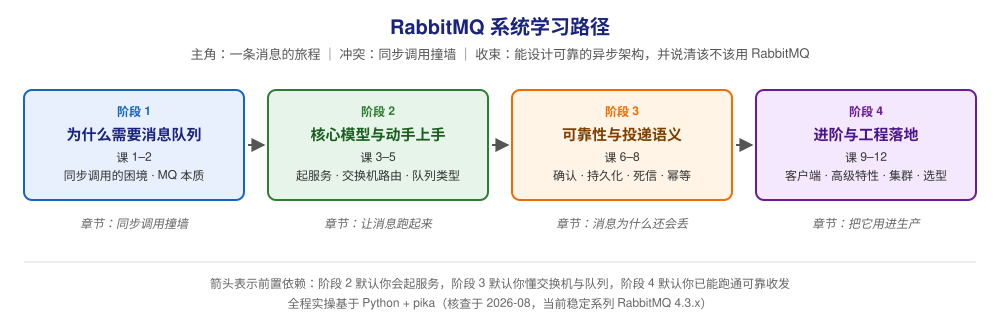

# RabbitMQ 系统学习 · 学习路径总览

> 本文件是活文档，随学习进度动态调整。阶段依赖图统一用 SVG。

## 🎯 学习目标

- **目标类型**：综合（理解概念为主 + 动手实操 + 决策参考）
- **目标说明**：从「为什么需要消息队列」出发，建立 RabbitMQ 的完整心智模型；每课能用 Python（pika）跑通可验证的实操；学完能说清在什么场景下该用、不该用 RabbitMQ，以及怎么把它可靠地用进生产。

> 学习目标是全局基准，决定各阶段/课的取舍与实操比重。目标变更时更新此处，并同步调整相关课。

## 故事主线

- **主角**：一条消息的旅程（从生产者发出，到被消费者确认的整个过程）
- **冲突**：服务之间直接同步调用，撞上了四堵墙——耦合、阻塞、峰值、丢失
- **收束**：学完后能基于 RabbitMQ 设计出「不丢、不重、扛得住」的异步架构，并判断这个场景到底该不该上消息队列

> 整个课程是这条故事线的展开，每个阶段是故事的一个"章节"，每课是章节中的一个"情节"。

## 学习路径图

> SVG 展示：4 个阶段、各阶段主题、阶段间前置依赖箭头。

## 阶段总览

### 阶段 1：为什么需要消息队列（章节：同步调用撞墙）

- **目标**：搞懂「为什么需要消息队列」，说清 RabbitMQ 的身世与定位，知道它擅长什么、不擅长什么
- **学习重点**：
  - 同步调用的四个真实痛点（耦合 / 阻塞 / 峰值 / 丢失）
  - 消息队列的四件事：异步、解耦、削峰、可靠
  - 引入 MQ 不是免费的：复杂度、一致性、延迟、运维
  - AMQP 的由来，以及 RabbitMQ 为什么用 Erlang 写
- **必须掌握**：能用自己的话解释「为什么不能直接同步调用」「RabbitMQ 是哪几个角色在协作」「什么情况下不该上 MQ」
- **对应课**：课 1（为什么需要消息队列）、课 2（RabbitMQ 是什么与起源定位）

### 阶段 2：核心模型与动手上手（章节：让消息跑起来）

- **目标**：亲手起一个 RabbitMQ，跑通「发—路由—收」全链路，说清交换机与队列的分工
- **学习重点**：
  - Docker 起服务 + Management UI + CLI 三件套
  - Exchange 与 Queue 为什么要分开（这是 RabbitMQ 最核心的设计）
  - fanout / direct / topic / headers 四种路由方式
  - classic / quorum / stream 三种队列类型的语义与成本边界
- **必须掌握**：能自己起服务并跑通一个 Python 收发 demo；能画出「生产者 → 交换机 → 队列 → 消费者」的数据流并解释 binding key 的作用
- **对应课**：课 3（起 RabbitMQ 与发第一条消息）、课 4（交换机与路由）、课 5（队列与消息的属性）

### 阶段 3：可靠性与投递语义（章节：消息为什么还会丢）

- **目标**：理解「不丢消息」究竟要靠哪几层保障，说清至少一次语义下重复从哪来、怎么防
- **学习重点**：
  - 消费者 ack / 发布者 confirm 两个确认机制，以及 prefetch 的吞吐权衡
  - 三层持久化（交换机、队列、消息）与「持久化不等于绝对不丢」
  - TTL 与死信队列：延迟、重试、兜底的三板斧
  - 至少一次语义 + 业务幂等 = 事实上的"不重不漏"
- **必须掌握**：能说清「为什么开了持久化仍可能丢消息」「为什么至少一次会导致重复、怎么幂等」「死信队列能解决什么问题」
- **对应课**：课 6（确认机制与预取）、课 7（持久化与死信）、课 8（交付语义与幂等）

### 阶段 4：进阶与工程落地（章节：把它用进生产）

- **目标**：写出生产级的生产者/消费者代码，理解高可用与流控机制，能做出选型与容量决策
- **学习重点**：
  - pika 的连接管理、心跳、异常恢复与生产/消费模板
  - 延迟消息、优先级队列、流控与内存/磁盘水位
  - 集群、quorum queue（Raft）与 streams，以及 4.x 起的网络分区新语义
  - 典型消息模式、横向选型对比、上线检查清单
- **必须掌握**：能写出带确认与幂等的完整生产/消费代码；能画出高可用拓扑；能回答「这个场景该不该用 RabbitMQ」
- **对应课**：课 9（Python 客户端工程实践）、课 10（高级特性）、课 11（集群与高可用）、课 12（架构落地与选型决策）

## 当前进度

- [x] 阶段 1：为什么需要消息队列（已完成，2026-08-31 课 1-2 全部完成）
- [ ] 阶段 2：核心模型与动手上手（未开始）
- [ ] 阶段 3：可靠性与投递语义（未开始）
- [ ] 阶段 4：进阶与工程落地（未开始）
