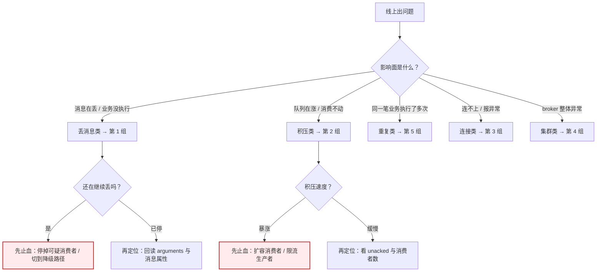

# 09 · 排障速查手册（QRH）

> **使用方式**：按**症状**倒查，不按知识点正序读。
> 每一行回答三件事：**可能是哪几类原因 → 先做什么止血 → 再怎么定位根因**。
>
> - 如果你现在**不慌**，想理解为什么 → 去 [08-实战经验.md](08-实战经验.md)
> - 如果你现在**要出方案** → 去 [10-场景解法库.md](10-场景解法库.md)
> - 如果你现在**线上在烧** → 就在这页，往下翻

---

## 🚨 0. 前三分钟：止血决策树

> **先止血，后定位。** 定位可以慢，止血不能等。
> 但请记住：**有些"止血动作"会破坏现场，做完就再也查不到根因了**——下面每一步都标了副作用。



### ⛔ 三个"看似止血、实则毁现场"的动作

排障时最容易犯的错，是**在还没搞清楚原因时就做了不可逆操作**。

| 动作 | 为什么危险 | 替代做法 |
|------|-----------|---------|
| **清空队列**（purge） | 证据没了。之后再也无法知道哪些消息丢了、为什么丢 | 先把消息**消费出来落盘存证**，再决定是否清理 |
| **`docker restart` 复现** | 优雅关机会把数据落盘，**制造假象**。课 7 实测：连 `durable=False` 的交换机都活过 restart，得出与生产相反的结论 | 要复现宕机用 `docker kill -s KILL`，并用「StartedAt 变化 + uptime 归零」硬校验 |
| **直接删队列重建** | 队列类型/参数改不了只能重建，但删之前没备份绑定关系，重建后路由全错 | 删之前先 `rabbitmqctl list_bindings` 存证 |

> 💡 顺序原则：**先存证，再动手；先降级，再修复；先止血，再定位。**

---

## 1️⃣ 丢消息类

### 症状 1.1：消费者崩溃后，队列空了

**可能原因（按概率排序）**

| # | 原因 | 关键判据 |
|---|------|----------|
| 1 | `auto_ack=True` | 代码里有 `auto_ack=True` → **就是这个**，不用再查 |
| 2 | 手动 ack 但业务逻辑吞掉异常后没 ack | 队列 `unacked` 数持续增长 |
| 3 | 消息未持久化，broker 重启 | 见症状 1.3 |

**先止血**

```bash
# 1. 立刻确认还有多少在途（不要只看 messages，要看 unacked）
rabbitmqctl list_queues name messages messages_ready messages_unacked consumers

# 2. 如果 unacked 不为 0，这些消息还没丢——停掉消费者，它们会重回 ready
#    （注意：停消费者不会丢消息，这是安全动作）
```

**再定位**

`auto_ack=True` 的后果比直觉严重得多。课 8 实测：

> 投递 100 条，业务回调**只执行 1 条**就崩溃 → 队列剩余 **0 条**。
> 多出的 99 条死在 pika 接收缓冲区里，**业务代码根本没见过它们**。

推论：**队列积压越多，一次崩溃损失越大。**

**修复**

```python
ch.basic_qos(prefetch_count=10)
ch.basic_consume(queue=Q, on_message_callback=on_message, auto_ack=False)
# 业务成功后 ch.basic_ack(...)
```

> ⚠️ **别踩这个坑**：`prefetch` 对 `auto_ack` **完全无效**（课 6 P0 实测）。
> 加 `prefetch_count=1` 后发 10 条，依然被一次全推走。
> 原因：prefetch 约束"未确认消息数"，auto_ack 下投递即确认，永远不存在未确认态。
> **加 prefetch 救不了 auto_ack，必须改确认模式。**

---

### 症状 1.2：生产者没报错，但消息没进队列

**可能原因**

| # | 原因 | 关键判据 |
|---|------|----------|
| 1 | 没开 confirm，且 quorum 失去多数派 → **返回 NACK 而非异常** | 课 11 实测：三节点停两个后发布返回 `NackError` |
| 2 | 不可路由（routing key 写错 / 没有 binding） | `rabbitmqctl list_bindings` 查不到对应绑定 |
| 3 | 消息超过 `max_message_size` | **不入队**，以 channel 级 406 返回（连接仍存活） |
| 4 | 触发了 `x-max-length`，最老的消息被挤掉 | 队列深度恒等于 max-length |

**先止血**

```bash
# 查绑定关系（原因 2 最快判据）
rabbitmqctl list_bindings source_name destination_name routing_key

# 查队列深度是否顶到上限（原因 4）
rabbitmqctl list_queues name messages arguments
```

**再定位**

- **确认是不是"根本没进去"**：开 confirm 后重发一次，看是否抛 `NackError`。
- **确认是不是"进去了又被挤掉"**：看队列深度是否恰好等于 `x-max-length`。

**修复**

```python
ch.confirm_delivery()                    # 原因 1：只有开了才知道
try:
    ch.basic_publish(exchange=EX, routing_key=RK, body=body,
                     properties=pika.BasicProperties(delivery_mode=2),
                     mandatory=True)     # 原因 2：不可路由时退回
except pika.exceptions.NackError:
    retry_or_persist_locally(body)       # 必须有补数路径
except pika.exceptions.UnroutableError:
    # mandatory 的退回是"异常 + 回调"双路通知（课 9 实测）
    conn.process_data_events(time_limit=1)   # 驱动事件循环才拿得到退回的消息体
```

> 💡 **confirm 的性能反对意见**：课 9 实测 100 条从 2.3ms 变 55.5ms（约 24 倍）。
> 但这是 **pika 同步适配器**的实现特征（逐条同步等 RTT，实测每条耗时 ÷ RTT ≈ 1.0），
> **不是协议本身的性质**。正确应对是换异步客户端，**不是关掉 confirm**。

---

### 症状 1.3：broker 重启后消息没了

**先止血**：先别重启第二次——重复重启会继续破坏现场。

**再定位**：按这个顺序查，每一步都有明确判据

```bash
# 步骤 1：确认消息是否曾持久化（关键看 messages_persistent 这一列）
rabbitmqctl list_queues name messages messages_persistent

# 步骤 2：确认队列是否 durable
rabbitmqctl list_queues name durable
```

判据表：

| `messages` | `messages_persistent` | 结论 |
|-----------|----------------------|------|
| N | **0** | 消息没设 `delivery_mode=2` → 症状 1.3-A |
| N | N | 持久化成功了，问题在别处 → 症状 1.3-B |

**症状 1.3-A：队列 durable 了，消息还是丢**

**队列持久化 ≠ 消息持久化。** 课 7 真实强制宕机对照：

| 配置 | 结果 |
|------|------|
| 队列 durable + `delivery_mode=2` | 消息存活 ✅ |
| 队列 durable + `delivery_mode=1` | **消息丢失** ❌ |

修复：三处都要 durable —— 交换机、队列、消息（`delivery_mode=2`）。

**症状 1.3-B：持久化开了，仍然丢 → 撞上了 fsync 窗口**

官方定性（How messages are stored / confirms.md）：
**classic 队列在发 publisher confirm 前不执行 fsync**——
"even durable messages that a publisher received a confirmation for, can technically be lost if the server crashes"；
**quorum 队列确认前已 fsync 到多数派**。

> ⚠️ **"没测出来"不等于"不存在"**：课 7 连做五版实验都测出零丢失，
> 最终发现**为使测量准确而等待统计追平的 3 秒，恰好覆盖了 200ms 的落盘窗口**。
> 测量行为本身消除了被测现象。

修复：需要强保证就换 **quorum**（协议层面保证）。这是选型问题，不是配置问题。

---

### 症状 1.4：消息进了死信队列

**先止血**：**不要慌，这通常是好事。**

> 死信队列里有消息 = 失败有出口。真正可怕的是失败消息**凭空消失**。

**再定位**：看 `x-death` 头里的 `reason` 字段，它直接告诉你失败类型

```python
# 消费死信队列，读取 x-death
x_death = props.headers.get('x-death', [])
print(x_death[-1]['reason'])   # ← 看这个
```

| `reason` | 含义 | 该怎么处理 |
|----------|------|-----------|
| `delivery_limit` | 重试次数耗尽 | ✅ 正常兜底。查业务为什么一直失败 |
| `rejected` | 客户端主动 `requeue=False` 送进来的 | ⚠️ 说明 `delivery-limit` **没生效**。查是不是用了 `nack` |
| `expired` | TTL 到期 | 查 TTL 配置；注意 TTL 是**惰性过期** |
| `maxlen` | 队列超长被挤掉 | 容量问题，不是消息本身的问题 |

> 🔍 **一个真实踩坑**（来自实战项目演练）：死信里混着 `reason=rejected` 的消息，
> 查下来是**上一轮演练的残留**（队列没清干净）。
> **做死信演练前务必用专属队列名并先 `queue_delete`**，否则你会对着陈旧数据得出错误结论。

---

## 2️⃣ 积压类

### 症状 2.1：队列深度持续上涨，消费跟不上

**先止血**（按顺序做，做完一样看效果）

```
1. 扩容消费者实例          ← 最快，但有上限（见下）
2. 调大 prefetch           ← 提高单消费者吞吐
3. 生产者限流              ← 保住 broker 不被压垮
4. 必要时降级：非关键队列暂停消费，把资源让给主链路
```

**再定位**：先分清是"消费慢"还是"根本没在消费"

```bash
rabbitmqctl list_queues name messages messages_ready messages_unacked consumers
```

| 现象 | 说明 | 下一步 |
|------|------|--------|
| `consumers = 0` | 消费者全掉了 | 转症状 3.x（连接类） |
| `unacked` 高、`ready` 低 | 消息都推出去了，但**没被 ack** → 消费端卡住 | 查消费者是不是卡在下游调用 |
| `ready` 高、`unacked` 低 | 推不出去 | 查 prefetch 是不是太小 |
| 两者都高 | 纯粹是生产 > 消费 | 扩消费者 + 调 prefetch |

**关于 prefetch 的取值**（课 6 实测单消费者吞吐）：

| prefetch | 吞吐（条/秒） | 什么时候用 |
|----------|--------------|-----------|
| 1 | 3,716 | 严格保序、不能接受重复 |
| 10 | 20,363 | **均衡，主链路推荐** |
| 50 | **31,721（峰值）** | 纯吞吐、无顺序要求 |
| 100 | 26,501 | 反而下降，不要盲目调大 |
| 不设 | 危险 | 一个消费者抢空队列 |

> ⚠️ **扩容不是万能的**：课 8 实测曾出现「4 消费者比 1 消费者慢 13 倍」的反常识结果。
> 但那是**测量误差**——600 条消息仅耗时 0.11 秒，总耗时被进程启动开销主导，根本没跑到吞吐瓶颈。
> **方法论：测出反常识结果时，先怀疑测量工具，换独立方法交叉验证。**

---

### 症状 2.2：消息卡在 unacked，一直不降

**可能原因**

| # | 原因 | 判据 |
|---|------|------|
| 1 | 消费者业务卡住（下游超时、死循环） | 进程还在，CPU/线程栈可查 |
| 2 | 消费者挂了但连接没断（半开连接） | 进程 zombine 或网络中断 |
| 3 | 消费耗时本就很长（分钟级任务） | 设计如此，需要调小 prefetch |

**先止血**

```bash
# 看是哪些连接持有未确认消息
rabbitmqctl list_consumers name ack_required prefetch_count active
```

**再定位**：原因 2（半开连接）最难查，因为它表现为"消费者看起来在线"

> ⚠️ **半开连接的感知时延**（课 9）：优雅断开（`rabbitmqctl close_all_connections`）
> 客户端**瞬时感知**；真实半开连接（收不到任何帧）需等 **2 × heartbeat**。
> 二者感知时延天差地别。
>
> 课 9 的半开连接感知时延**未能实测**（容器内无 `iptables`），
> 讲义中的 5/10/20/30/60 秒 → 10/20/40/60/120 秒是**按协议规则推算的理论值**。

**修复**：quorum 队列配 `x-consumer-timeout`（4.3 起，讲义未覆盖、实战项目实测补充）

```python
args = {'x-queue-type': 'quorum', 'x-consumer-timeout': 30000}  # 30 秒
# 效果：消费者取走消息后 30 秒内既不 ack 也不 reject → broker 主动取消该消费者，
#       消息退回队列且 redelivered=True
```

取值原则：**必须大于业务最大处理耗时**，留出余量。业务毫秒级给 30 秒是合理的。

---

## 3️⃣ 连接与异常类

### 症状 3.1：`PRECONDITION_FAILED - inequivalent arg`

**含义**：你在用**与现有队列不同的参数**重新声明同名队列。队列属性**不可改**。

**常见触发场景与判据**

| 报错里的关键词 | 原因 | 修复 |
|---------------|------|------|
| `durable` | 一处 `durable=True`、一处 `False` | 统一 |
| `type` | 队列类型不一致（classic ↔ quorum） | **不可原地改**，需新建队列 + 双写迁移 |
| `x-queue-type` | 同上 | 同上 |
| `x-delivery-limit` / `x-delayed-retry-*` | **给 classic 队列配了 quorum 专属参数**（406 拒绝） | 见下 ⚠️ |
| `x-max-priority` | **给 quorum 队列配了**（quorum 一律拒绝） | quorum 默认就有 0-31 优先级，去掉该参数 |
| `x-message-ttl` / `x-max-length` | 给 **stream** 队列配了（stream 不支持） | 去掉 |

> ⚠️ **`x-delivery-limit` 与 `x-delayed-retry-*` 是 quorum 专属**（实战项目实测新发现）。
> 给 classic 声明会直接报：
> `invalid arg 'x-delivery-limit' for queue 'notify.sms' ... of queue type rabbit_classic_queue`
>
> **这件事的工程含义比报错更严重**：选 classic 省下的资源（3.7 倍写吞吐、2.8-3.4 倍内存），
> 要用**代码复杂度**还回来——你必须自己实现重试计数（自维护 `x-app-retry-count` 头）。

> ⚠️ **另一类失效更隐蔽**：某些参数**写错值不报错、静默失效**
> （课 10 实测：`x-delayed-retry-type` 写成 `bogus_value` 无任何报错）。
> **判据：声明完用 `rabbitmqctl list_queues name arguments` 回读，确认参数真的在。不要相信"没报错"。**

---

### 症状 3.2：`Channel is closed` / 连接被断开

**分级判断**：这是最容易误判的一类，因为**不同错误码的严重程度完全不同**。

| 错误码 | 级别 | 含义 | 影响范围 |
|--------|------|------|----------|
| **541** `INTERNAL_ERROR` | **连接级** | 4.3 起 transient 非独占队列默认被拒 | **整个连接断开** |
| **406** `PRECONDITION_FAILED` | 信道级 | 参数不匹配 / 操作不允许 | 仅该信道关闭，连接存活 |
| **405** `RESOURCE_LOCKED` | 信道级 | 访问了其他连接持有的 exclusive 队列 | 仅该信道 |
| **403** `ACCESS_REFUSED` | 信道级 | 权限不足 / 操作默认交换机 | 仅该信道 |
| **404** `NOT_FOUND` | 信道级 | 队列不存在（或宿主节点已停） | 仅该信道 |

**先止血**：连接级错误（541）需要**重建连接**，不只是重建信道。

**再定位**：541 的典型触发

```python
ch.queue_declare(queue='x')     # durable=False + exclusive=False
# 4.3 上直接报 541 并断开整个连接
# 修复：ch.queue_declare(queue='x', durable=True)
```

> 课 5 实测复现并写入守护脚本 `l5-check-541.py`。
> 4.3.0（2026-04-23）起 `transient_nonexcl_queues` 推进为 `denied_by_default`。

---

### 症状 3.3：RPC 调用永远等不到响应，且无任何报错

**这是本文档里最危险的一条**——因为**全程静默**，无异常可查。

**根因**：Direct Reply-To 要求 RPC 客户端用**同一个连接和同一个信道**，
既从 `amq.rabbitmq.reply-to` 消费、又发布请求消息。

课 12 三组对照（判据是"响应是否真的到达"而**非**"有没有报错"）：

| 组 | 做法 | 结果 |
|----|------|------|
| A | **跨信道**（信道 1 消费 / 信道 2 发布） | **不报错，响应未到达** ⚠️ |
| B | 同信道，先发布后注册 | 异步 `406 fast reply consumer does not exist` |
| C | 同信道 + 先注册后发布 | ✅ 响应到达 |

**先止血**：给 RPC 客户端加**超时**——没有超时，静默丢失就永远表现为"卡住"。

**再定位与修复**

```python
# pika 的生成器式 consume() 是惰性的，必须 next() 预热才真正发出 basic.consume 帧
gen = ch.consume('amq.rabbitmq.reply-to', auto_ack=True, exclusive=True)
next(gen)                      # ← 预热，完成注册
ch.basic_publish(...)          # ← 注册完成后再发布
```

> 💡 **防复发**：把 RPC 客户端封装成一个类，把"同信道 + next() 预热"固化在构造函数里，
> 不给调用者犯错的空间。

---

## 4️⃣ 集群与 broker 类

### 症状 4.1：部分队列不可用，报 `NOT_FOUND - process is stopped by supervisor`

**判据**：课 11 实测——**classic 队列的宿主节点宕机后完全不可用**。

```
NOT_FOUND - queue 'xxx' in vhost '/' process is stopped by supervisor
```

**原因**：classic 队列**不复制**，数据只在 `node` 字段标识的那一个节点上。
4.0 移除镜像队列后，classic 就是**单点**。

**先止血**：恢复该节点；期间该队列不可用，需要业务侧降级。

**再定位**：**别用"能不能查到队列"判断它在哪个节点**——这是课 11 记录的一处真实误判：

> 集群中**所有节点都能看到队列元数据**（`list_queues` 在三个节点上都查得到），
> 但数据只在 `node` 字段标识的节点上。
> 正确做法是看 Management API 的 `node` 字段，**不是看能否查到**。

**修复**：需要高可用的队列改用 **quorum**（3 副本 Raft）。这需要重建队列。

---

### 症状 4.2：写入报 `NackError`，但集群看起来是好的

**判据**：课 11 实测的多数派语义——三节点多数派 = 2

| 存活节点 | 行为 |
|---------|------|
| 3 | ✅ 正常 |
| 2 | ✅ 可写 |
| **1** | ❌ **`NackError: 0 message(s) NACKed`** |

**关键**：**失败形态是 NACK 而非断连或异常**。
**不开 publisher confirms 则完全感知不到**——你会以为消息发出去了。

**先止血**：恢复节点到多数派（至少 2 个）。

**再定位**

```bash
# 4.3.5 已移除 quorum_status 命令，改用 Management API
curl -u learn:learn123 http://localhost:15681/api/queues/%2F/<queue-name>
# 看 leader / members / online 字段
```

**防复发**：这就是"必须开 confirm"最硬的一条理由。

---

### 症状 4.3：Prometheus 告警配了但从不触发

**判据**：课 12 P0 实测——**大量教程里的指标名在 4.3.5 上根本不存在**。

| ❌ 旧名（网上教程仍在用，端点里**不存在**） | ✅ 4.3.5 真实名 |
|---|---|
| `rabbitmq_node_mem_used` | `rabbitmq_process_resident_memory_bytes` |
| `rabbitmq_node_mem_limit` | `rabbitmq_resident_memory_limit_bytes` |
| `rabbitmq_node_disk_free` | `rabbitmq_disk_space_available_bytes` |
| `rabbitmq_node_disk_free_limit` | `rabbitmq_disk_space_available_limit_bytes` |

另有**告警专用**指标，直接是 0/1，配告警最省事：

- `rabbitmq_alarms_memory_used_watermark`
- `rabbitmq_alarms_free_disk_space_watermark`

**先止血**

```bash
# 直接抓端点，逐个核对你用的指标名是否存在
curl -s http://localhost:15692/metrics | grep <你要用的指标名>
```

**另一个高发错误**：内存高水位默认值

> **4.x 默认为 0.6，不是 3.x 的 0.4**（课 12 实测 `rabbitmqctl environment` 返回 `vm_memory_high_watermark, 0.6`）。
> 照抄老教程的 0.4 会把告警阈值配错。

---

## 5️⃣ 重复与顺序类

### 症状 5.1：同一笔业务被执行了多次

**先止血**：如果涉及资损（扣款、扣库存），**先停消费者**，再查。

**再定位**：关键是区分重复**来自哪一侧**，因为两侧的识别手段完全不同

```python
# 消费时打印这两个值
print(method.redelivered, props.message_id)
```

| `redelivered` 序列 | 重复来源 | 能否用 `redelivered` 识别 |
|-------------------|----------|--------------------------|
| `[False, True, True]` | **消费侧**（崩溃重投 / reject requeue） | ✅ 能 |
| **`[False, False]`** | **生产侧**（超时重发、连发两条同单号） | ❌ **不能** |

课 8 实测：生产侧重复时 broker **完全不知道**这两条是同一笔业务——
在它眼里就是两条独立消息。

**修复**：幂等键必须用**业务标识**，不能用 broker 给的投递标记

```python
def make_idempotency_key(order_id, step):
    return f"{order_id}:{step}"     # 业务单号 + 步骤名
```

三步式去重表，**第 3 步最容易写错**：

| 步骤 | 动作 | 说明 |
|------|------|------|
| 1 | `acquire()` | 已存在 → 处理过，**直接 ack 跳过** |
| 2 | `mark_done()` | 业务成功后标记 |
| 3 | **`release()`** | ⚠️ **业务失败必须释放**，否则消息永远被自己的锁挡住 |

> 🔥 **不 release 的后果**：这条消息的重试会**永远失败**，且看起来像是"消费成功了"。
> 这是一个极其隐蔽的死锁。

---

### 症状 5.2：消息乱序了

**先止血**：如果对业务有影响，先降 prefetch 到 1（牺牲吞吐换顺序）。

**再定位**：关键变量是**队列是否有积压**（课 8 实测）

| 场景 | 条件 | 结果 |
|------|------|------|
| A | `prefetch=1`，边消费边重投，**无积压** | 重投消息**插回原位**，顺序侥幸保持 |
| B | `prefetch=8`，客户端已有积压 | 重投消息被**挤到第 8 位**，顺序破坏 |

推论：**prefetch 越大 / 积压越多，失败重投对顺序的破坏越严重。**

**修复**：按你的真实需求选档

| 需求 | 方案 | 代价 |
|------|------|------|
| 严格全局顺序 | 单消费者 + `prefetch=1` + 不 requeue（失败直接死信） | 吞吐只有峰值的 11.7%，且失败不再重试 |
| 折中 | 按业务键（order_id）分队列，队列内保序 | 队列数增加 |
| 通常的最优解 | **不追求全局顺序**，改让业务容忍乱序（幂等 + 版本号/状态机） | 业务侧改造 |

> 💡 **优先级的一个反直觉事实**（课 10 实测）：**优先级只在有积压时生效**。
> 消费者空闲时（发一条取一条），发布 `[1,9,2,8,3]` → 取出仍是 `[1,9,2,8,3]`，优先级**完全不起作用**。
> 想靠优先级做"插队"，必须先有积压——而健康系统恰恰不该有积压。

---

## 📋 附：条件 - 动作速查表

> 一页表格版，适合打印或贴到值班手册里。

| 如果你看到 | 立刻做 | 然后查 |
|-----------|--------|--------|
| 消费者崩溃后队列空了 | 确认 `auto_ack` | 是不是 `auto_ack=True`（加 prefetch 救不了） |
| 生产者没报错但消息没了 | 开 confirm 重发一次 | 是否 `NackError`（多数派丢失）/ 是否不可路由 |
| `messages_persistent = 0` | 补 `delivery_mode=2` | 三处 durable 是否齐（交换机/队列/消息） |
| 死信里 `reason=rejected` | 检查是不是用了 `nack` | `delivery-limit` 是否真的生效 |
| 队列 `unacked` 高企 | 查消费者线程栈 | 是否卡在下游调用 / 是否半开连接 |
| `consumers = 0` | 检查消费者进程 | 连接类症状 3.x |
| `invalid arg 'x-delivery-limit'` | 该队列是 classic，去掉参数 | 改用 quorum 或自己实现重试计数 |
| `invalid arg 'x-max-priority'` | 该队列是 quorum，去掉参数 | quorum 默认就有 0-31 优先级 |
| 队列属性改不动 | **不可原地改** | 新建队列 + 双写迁移 |
| `NOT_FOUND process is stopped` | 恢复宿主节点 | 是不是 classic 队列（无副本） |
| 写入 `NackError` | 恢复节点到多数派（≥2） | 是否开了 confirm（否则平时感知不到） |
| RPC 无响应且无报错 | 加超时 | 是否跨了信道 / 是否漏了 `next()` 预热 |
| 告警从不触发 | 抓端点核对指标名 | 指标名是否为 4.3.5 真实名 |
| 业务重复执行 | 涉及资损先停消费者 | `redelivered` 序列 → 判断生产侧还是消费侧 |

---

## 🆘 升级出口：什么时候这不是 RabbitMQ 的问题

**排障的最后一步，是知道什么时候该停手。**

| 现象 | 说明问题不在 MQ | 该找谁 |
|------|----------------|--------|
| 消息正常投递、正常 ack，但业务结果不对 | MQ 的工作已经完成了 | **业务代码 / 数据层** |
| 消费者 CPU 打满 | broker 只是把消息推过去了，慢的是处理 | **应用性能** |
| 下游接口超时导致大量重试 | 根因在下游 | **下游服务** |
| 网络频繁抖动、连接反复断开 | 基础设施问题 | **网络 / 运维** |
| 磁盘写满导致 broker 拒绝写入 | 资源问题，不是配置问题 | **运维 / 容量** |

> 💡 **判据**：**如果消息正常到达消费者、被正常 ack，那么 RabbitMQ 的职责就结束了。**
> 剩下的问题是业务问题。不要在 MQ 配置里找业务 bug。

---

## 🧭 导航

- [返回课程目录](02-课程目录.md)
- [实战经验（不慌的时候读）](08-实战经验.md)
- [场景解法库（要出方案的时候读）](10-场景解法库.md)
- [回到实战项目 README](projects/订单履约消息系统/README.md)
