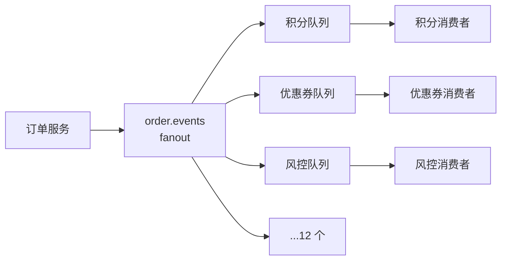

# 10 · 场景解法库：新需求来了怎么设计

> **这份文档是设计态的**，用法和前两份完全不同：
>
> 1. 先看**场景描述和约束**，确认和你的情况对得上
> 2. **合上答案，先自己想 2 分钟**——想出几个方案、你觉得哪个对、为什么
> 3. 再展开折叠块看解法，重点看**代价**和**不适用边界**
> 4. 最后看「递进路径」，知道下一步往哪走
>
> ⚠️ **不展开就看不到答案**，这是故意的。直接看答案你会觉得"我都懂"，
> 但真到自己设计时又会回到第一个想到的方案——**想的过程才是训练，答案只是校验**。

## 怎么用

| 场景 | 难度 | 核心权衡 | 涉及知识点 |
|------|------|---------|-----------|
| [场景 1：大促流量削峰](#场景-1大促流量削峰) | ⭐ | 吞吐 vs 一致性 | 课 1/6/10 |
| [场景 2：延迟任务](#场景-2订单-30-分钟未支付自动取消) | ⭐⭐ | 精度 vs 复杂度 | 课 7/10 |
| [场景 3：跨系统数据同步](#场景-3跨系统数据同步mysql--es) | ⭐⭐⭐ | 一致性 vs 侵入性 | 课 8/12 |
| [场景 4：VIP 优先处理](#场景-4vip-订单要优先处理) | ⭐⭐⭐ | 优先级 vs 高可用 | 课 5/10 |
| [场景 5：广播与多租户隔离](#场景-5一条事件要通知十几个下游系统) | ⭐⭐ | 耦合 vs 可观测 | 课 4/12 |
| [场景 6：大消息传输](#场景-6要传-50mb-的文件) | ⭐⭐ | 简单 vs 效率 | 课 5/12 |
| [场景 7：跨机房容灾](#场景-7跨机房容灾与异地多活) | ⭐⭐⭐⭐ | 一致性 vs 可用性 | 课 11/12 |
| [场景 8：消息既要可回放又要能消费删除](#场景-8既要能回放历史又要能消费删除) | ⭐⭐⭐ | 回放 vs 生态兼容 | 课 5/11 |

**推荐递进路径（按学习曲线，不是按编号）**

```
入门：场景 1（削峰）→ 场景 5（广播）
      ↓ 建立"MQ 能解决什么"的直觉
进阶：场景 2（延迟）→ 场景 6（大消息）
      ↓ 遇到 MQ 的能力边界，知道什么时候不该硬用
挑战：场景 4（优先级）→ 场景 3（数据同步）
      ↓ 真正的权衡：每个选项都有代价，且代价会连锁
高阶：场景 8（回放）→ 场景 7（异地多活）
      这两个的正确答案是"可能不该用 RabbitMQ"，或"要接受很大的代价"
```

---

## 场景 1：大促流量削峰

### 场景描述

电商大促，瞬时下单峰值 **5 万 QPS**，但下游库存系统**只能扛 5000 QPS**。
下单请求不能丢，用户要能拿到下单结果。

**约束**：

- 峰值持续 10 分钟，总量约 3000 万单
- 用户提交后**必须立刻知道"下单成功"还是"失败"**（不能一直转圈）
- 允许最终一致（库存扣减可以稍后完成）

### 🤔 先想 2 分钟

**问题 1**：用户要立刻拿到结果，但下游扛不住。这两件事怎么同时满足？

**问题 2**：队列积压 3000 万条会怎样？需要做什么准备？

**问题 3**：削峰之后，用户看到的"下单成功"到底是什么语义？

<details>
<summary><b>展开：3 个解法与权衡</b></summary>

#### 解法 A：全异步化 —— 入队即返回，下游慢慢消费

**做法**：所有下单请求写入队列立即返回，消费者按自己的节奏处理。

| 维度 | 评价 |
|------|------|
| 优点 | 最简单，吞吐最高，下游完全不受峰值冲击 |
| 缺点 | **用户拿不到真实结果**。返回的"成功"只代表"我收到你的请求了" |
| 适用 | 无用户等待的场景（批处理、内部系统） |
| 不适用 | ⚠️ **本场景不适用**——约束明确要求用户立刻知道成败 |

这是最常见的错误答案：**看到"削峰"就把所有东西异步化，忘了问"用户要不要等结果"**。

#### 解法 B：同步预校验 + 异步落库（推荐）

**做法**：

1. 同步阶段：只做**能扛住 5 万 QPS 的轻量校验**（参数合法性、用户状态、风控黑名单、库存**粗粒度预占**）
2. 同步返回：校验通过 → 立即返回"下单成功"；校验失败 → 立即返回失败
3. 异步阶段：真正的扣库存、创建订单、发货通知走消息队列，按 5000 QPS 消费

| 维度 | 评价 |
|------|------|
| 优点 | 用户立刻拿到结果；峰值被队列吸收 |
| 缺点 | 需要**两套逻辑**（同步校验 + 异步处理），且二者可能不一致 |
| 关键设计 | **库存粗粒度预占**是核心——用 Redis 原子递减做"票"，预占成功才返回成功 |
| 不适用 | 同步校验本身扛不住峰值的场景 |

**这是实战项目决策 1 的放大版**：判断依据永远是"这一步的结果用户要不要马上知道"，
而不是"技术上能不能异步"。

#### 解法 C：全异步 + 结果轮询/WebSocket 推送

**做法**：入队即返回"处理中"，前端轮询或服务端 WebSocket 推送最终结果。

| 维度 | 评价 |
|------|------|
| 优点 | 削峰彻底，且用户最终能拿到真实结果 |
| 缺点 | **复杂度陡增**：要维护请求 ID → 结果的映射、要处理推送失败、前端要写重试与兜底 |
| 不适用 | 用户对等待时间敏感的场景（下单就是典型） |

### ⚖️ 权衡要点

**选 B 之后必须回答的问题**：用户看到的"下单成功"是什么语义？

> 它真正的含义是：**"你的请求通过了校验，我会尽力处理"**。
> 后面的异步步骤仍然可能失败（库存实际不足、发货系统故障）。
>
> 所以你**必须**准备：
> 1. **兜底通知**：异步失败时通知用户（短信/站内信："很抱歉，您的订单因库存不足取消"）
> 2. **对账巡检**：扫出"已支付但未发货"的订单，人工或自动处理

**这正是消息队列的固有边界**：它提供最终一致，不提供强一致。这个不一致窗口**无法用 MQ 消除**。

### 3000 万条积压的准备工作

这是本场景最容易被忽略的工程问题：

| 项 | 说明 |
|----|------|
| 队列类型 | 用 classic（允许少量丢失以换吞吐），**不要用 quorum**——quorum 写代价约 3.7 倍 |
| 内存 | 消息会先落内存。3000 万条 × 1KB ≈ 30 GB，**远超默认内存水位** |
| 磁盘 | 消息会在内存压力下换页到磁盘，确保磁盘足够 |
| 消费能力 | 5000 QPS × 600 秒 = 300 万，**只消化了 1/10**。要么提高消费能力，要么延长消化时间 |

> ⚠️ **关键认知**：削峰**不会减少总工作量**，只改变时间分布。
> 如果消费能力长期低于生产能力，队列会无限增长——**削峰变成了堆积，不是解决**。
> 这时需要的是**扩容消费者**或**限流/降级**（直接拒绝部分请求），而不是调 MQ 参数。

### 🔗 知识点挂钩

- 课 1「同步调用四困境」+「引入 MQ 的代价」——削峰是 MQ 的经典价值，但代价是最终一致
- 课 6「预取与公平分发」——prefetch 决定单消费者吞吐，扩容消费者前先调它
- 课 10「流控与资源水位」——内存告警触发后 broker 会阻塞生产者，这是保护机制不是故障

</details>

---

## 场景 2：订单 30 分钟未支付自动取消

### 场景描述

用户下单后 30 分钟内未支付，自动取消订单并释放库存。

**约束**：

- 每天订单量约 100 万
- 取消要**及时**（超时后 1 分钟内生效可接受，1 小时不可接受）
- 允许少量误差，但不能漏取消

### 🤔 先想 2 分钟

**问题 1**：你第一个想到的方案是什么？（大概率是"给消息设 30 分钟 TTL，过期后进死信队列，消费死信队列执行取消"）

**问题 2**：这个方案有一个致命缺陷。课 7 实测过相关机制——想想是什么？

**问题 3**：如果订单在 5 分钟时就支付了，怎么取消这个"取消任务"？

<details>
<summary><b>展开：4 个解法与权衡</b></summary>

#### 解法 A：消息 TTL + 死信队列

**做法**：下单时发一条 TTL=30min 的消息到"待取消"队列，**不消费它**；
30 分钟后消息过期 → 进入死信队列 → 消费死信队列执行取消。

| 维度 | 评价 |
|------|------|
| 优点 | 天然分布式，无需额外组件；实现简单 |
| 缺点 | **有两个致命问题**（见下） |
| 不适用 | ⚠️ 混合不同延迟时长的场景 |

**致命问题 1：TTL 是惰性过期的**（课 7 四组对照实测）

> 只有消息**到达队首**时才被真正移除。
> 实测：A(10s TTL) 在前、B(1s TTL) 在后 → 3.3 秒后深度**仍为 2**（B 已过期但被 A 阻塞）；
> 用 `basic.get` 取走队首 A → B 一到队首**立即消失**。

**这意味着什么**：如果所有消息 TTL 都是 30 分钟，先发的先过期，问题不大。
但只要混入一条不同 TTL 的消息（或队列里有积压），**短 TTL 的会被长 TTL 堵住**。

**致命问题 2：取消时机不可控**

消息过期后还要等它被投递到死信交换机、再被消费。如果有积压，延迟会很长。

#### 解法 B：4.3 原生延迟重试（NOT suitable here）

> ⚠️ **注意：这是个陷阱选项**，列出它是因为它最容易被误用。

4.3 的 `x-delayed-retry-*` 是**重试机制**，不是**定时调度机制**：
它依赖于"消息被消费 → 失败 → reject → 退避"这条链路。

而本场景的消息**根本不该被消费**——它只是静静地等着过期。

| 维度 | 评价 |
|------|------|
| 不适用理由 | 语义不匹配。延迟重试解决的是"失败了稍后再试"，不是"到点执行某动作" |

#### 解法 C：延迟消息插件 `rabbitmq_delayed_message_exchange`

**做法**：安装插件，用 `x-delayed-type` 交换机，发布时设 `x-delay` 头。

| 维度 | 评价 |
|------|------|
| 优点 | **真正按消息级精确延迟**，不受队首阻塞影响；支持任意延迟时长混合 |
| 缺点 | **本环境未安装**（课 10 实测 `rabbitmq-plugins list` 中不存在该插件） |
| 关键限制 | ⚠️ 延迟消息存在**单节点的 Mnesia 表**里，**不跨集群复制**——该节点宕机，未到期的延迟消息**全部丢失**；软上限约 **10 万条**在途延迟消息/节点；延迟上限 `x-delay` 为 int32，约 **49 天** |
| 不适用 | 无法安装插件的环境；延迟消息不允许丢失的场景；在途延迟消息量超过十万级 |

> 📌 三条限制均有可溯源依据（社区插件文档与多篇 2026 年实测对比一致）：
> 插件把消息存在 Mnesia 表单节点、不复制；软上限约 100k in-flight；
> `x-delay` 最大 `2^32-1` 毫秒（约 49 天）。
> 另注意：4.x 起 Mnesia 正被 Khepri 取代（课 11 实测），
> **依赖 Mnesia 的插件存在长期迁移风险**——这也是不选它的一条理由。

#### 解法 D：业务层定时扫描（推荐用于本场景）

**做法**：订单表记 `created_at` 与 `status`，定时任务每分钟扫描
`status='未支付' AND created_at < now() - 30min` 的记录，批量取消。

| 维度 | 评价 |
|------|------|
| 优点 | **最可靠、最易理解、最易排查**。取消逻辑与订单状态在同一处，不存在"消息丢了但订单还在"的不一致 |
| 缺点 | 有扫描延迟（本场景 1 分钟可接受）；数据库有周期性查询压力（加索引可解） |
| 关键设计 | 支付成功时**直接改订单状态**即可，取消任务自然失效——**天然解决了"已支付怎么撤销取消"** |
| 不适用 | 要求秒级精度、或订单量极大导致扫描成为瓶颈的场景 |

### ⚖️ 权衡要点

**为什么反而是"最笨"的 D 成了推荐？**

因为本场景有一个被忽略的关键需求：**支付后要能撤销取消任务**。

- 解法 A：消息已在队列里，要撤销得**找到并删除那条特定消息**——RabbitMQ **不提供按内容查找/删除消息的能力**
- 解法 C：同样无法撤销已发布的延迟消息（插件也不提供删除）
- 解法 D：撤销就是改一个数据库字段，**零成本**

> 💡 **这是本场景最有价值的认知**：
> **"定时执行"和"可撤销的定时执行"是两个完全不同的需求。**
> 消息队列擅长前者，不擅长后者。
>
> 判据：**如果你的延迟任务需要中途取消，消息队列大概率不是好选择。**

### 决策表

| 你的情况 | 选哪个 |
|---------|-------|
| 延迟任务**不需要取消**、时长统一、精度要求不高 | A（TTL + DLX），注意所有消息 TTL 必须一致 |
| 延迟任务不需要取消、时长各异、需要精确 | C（延迟消息插件），前提是能装插件 |
| **延迟任务需要中途取消** | **D（定时扫描）** —— 别用 MQ |
| 延迟任务需要取消、但量极大 | 专业调度系统（如 XXL-Job / Airflow / Temporal） |

### 🔗 知识点挂钩

- 课 7「TTL 与死信队列」——惰性过期是本场景的核心陷阱，四组对照实测
- 课 10「延迟消息与延迟重试」——区分"定时调度"与"失败重试"两种语义
- 课 8「交付语义与幂等」——定时扫描天然会重复扫描，取消操作**必须幂等**

</details>

---

## 场景 3：跨系统数据同步（MySQL → ES）

### 场景描述

订单数据存在 MySQL，需要同步到 Elasticsearch 供搜索与运营查询。

**约束**：

- 数据最终一致即可（秒级延迟可接受）
- **不能丢数据**（少一条订单搜索不到，运营会投诉）
- 同步逻辑要能应对 ES 写入失败
- 理想情况下**不希望改业务代码**

### 🤔 先想 2 分钟

**问题 1**：同步的"触发点"放哪？业务代码里写？MySQL 触发器？还是另有办法？

**问题 2**：如果 ES 写入失败但 MySQL 已提交，消息也 ack 了，这条数据就永久丢了。怎么办？

**问题 3**：MySQL 的更新顺序和消息到达顺序不一致怎么办？（先改成 A 再改成 B，消息却先到 B 后到 A）

<details>
<summary><b>展开：4 个解法与权衡</b></summary>

#### 解法 A：业务代码双写

**做法**：业务代码在写 MySQL 后，同步发一条消息到 MQ，消费者写 ES。

| 维度 | 评价 |
|------|------|
| 优点 | 最简单直观 |
| 缺点 | ❌ **数据一致性无法保证**：写 MySQL 成功、发消息失败 → 永久不一致；两步骤无法原子（除非引入本地消息表） |
| 侵入性 | 高（要改每一处写 DB 的代码） |
| 不适用 | 对一致性有要求的场景 |

#### 解法 B：CDC（Change Data Capture）—— 订阅 binlog（推荐）

**做法**：用 Canal / Debezium 等工具订阅 MySQL binlog，把变更事件发到 MQ，消费者写 ES。

| 维度 | 评价 |
|------|------|
| 优点 | ✅ **零业务侵入**（业务代码完全不知道同步的存在）；✅ **不会丢**（binlog 是 MySQL 的完整变更日志）；✅ 顺序天然正确（binlog 有序） |
| 缺点 | 引入新组件（Canal/Debezium 要维护）；binlog 格式变更需要适配；DDL 变更要处理 |
| 关键设计 | 消费端必须**幂等**：binlog 事件可能重复投递（Canal 重启会重放） |
| 不适用 | 无法访问 binlog 的环境（如某些云数据库不开 binlog） |

**这是业界主流方案**，也是本场景的推荐解。理由：**它把"不丢数据"从"应用保证"降级为"MySQL 保证"**——
binlog 是 MySQL 自己写的，不会因为应用崩溃而丢失。

#### 解法 C：本地消息表 + 定时补偿

**做法**：

1. 业务代码在同一个**本地事务**里：写业务数据 + 写一条"待发送"消息到本地消息表
2. 独立的投递线程扫描消息表，发到 MQ，成功后标记"已发送"
3. 定时补偿：扫描长时间"待发送"的记录重发

| 维度 | 评价 |
|------|------|
| 优点 | ✅ **不丢数据**（本地事务保证业务数据与消息记录同时成功）；不依赖 binlog |
| 缺点 | 侵入业务（要在写 DB 的地方加逻辑）；消息表会膨胀，需要清理；有额外 DB 压力 |
| 不适用 | 完全不想改业务代码的场景 |

#### 解法 D：定时全量/增量扫描

**做法**：定时任务按 `updated_at` 扫描 MySQL，批量写入 ES。

| 维度 | 评价 |
|------|------|
| 优点 | 最简单，无侵入，天然幂等 |
| 缺点 | ❌ **删了的数据扫不到**（除非做软删除）；实时性差 |
| 不适用 | 需要捕获删除操作的场景（除非全部软删除） |

### ⚖️ 权衡要点

**问题 2 的答案：ack 时机决定一切**

```python
# ❌ 错：先 ack 再写 ES → ES 失败则永久丢失
ch.basic_ack(delivery_tag=tag)
write_to_es(data)

# ✅ 对：先写 ES 再 ack → ES 失败则消息重投
write_to_es(data)
ch.basic_ack(delivery_tag=tag)
```

这是故障模式 3 的延伸：**ack 的位置就是"责任转移"的位置**。
ack 早了，你就替下游承担了它失败的责任。

**问题 3 的答案：顺序问题怎么处理**

即使 binlog 有序，MQ 层仍可能乱序（多消费者并发、失败重投）。

三种应对，按代价从小到大：

| 方案 | 做法 | 代价 |
|------|------|------|
| **版本号/时间戳** | 消息带 `updated_at`，ES 写入时只接受更新的版本 | 最小，推荐 |
| 按主键分队列 | 同一条记录的变更进同一队列，队列内保序 | 队列数 = 分区数 |
| 单消费者 | 全局串行 | 吞吐极低，不推荐 |

> 💡 **最实用的其实是第一种**：**让下游容忍乱序，而不是让上游保证顺序**。
> 用 `updated_at` 做乐观锁，乱序到达的旧版本直接丢弃。

### 决策表

| 你的情况 | 选哪个 |
|---------|-------|
| 能访问 binlog、不想改业务代码 | **B（CDC）** |
| 不能访问 binlog、可以改业务代码 | C（本地消息表） |
| 数据量小、实时性要求低、能软删除 | D（定时扫描） |
| 只是想先跑起来看效果 | A，但要清楚它的一致性风险 |

### 🔗 知识点挂钩

- 课 8「重复来源与幂等设计」——CDC 必然重复投递，幂等是必需项
- 课 8「顺序性」——prefetch 越大、积压越多，重投对顺序破坏越严重
- 课 6「消费者确认」——ack 时机 = 责任转移点

</details>

---

## 场景 4：VIP 订单要优先处理

### 场景描述

订单分 VIP 和普通两档，VIP 订单量占 5%，但要求**优先处理**。
主链路已经因为高可用需求选了 **quorum 队列**。

**约束**：

- 高可用是硬需求（不能为了优先级放弃 quorum）
- VIP 队列的积压消化速度要**明显快于**普通队列
- 优先级效果要**可预测、可监控**（业务方会问"VIP 到底快多少"）

### 🤔 先想 2 分钟

**问题 1**：给 quorum 队列加 `x-max-priority` 会怎样？（课 10 实测过）

**问题 2**：如果改用 classic 队列换取优先级支持，代价是什么？

**问题 3**："VIP 优先"在什么情况下才真正有意义？

<details>
<summary><b>展开：4 个解法与权衡</b></summary>

#### 解法 A：改用 classic 队列 + `x-max-priority`

| 维度 | 评价 |
|------|------|
| 优点 | 直接支持优先级，配置简单 |
| 缺点 | ❌ **放弃高可用**——classic 不复制，宿主宕机即不可用（课 11 实测报 `NOT_FOUND process is stopped by supervisor`） |
| 不适用 | ⚠️ **本场景不适用**：高可用是硬约束。为了次要特性推翻核心决策是本末倒置 |

#### 解法 B：quorum 的 0-31 原生优先级

**关键事实**（课 10 实测）：quorum 队列**不需要** `x-max-priority`——
它**始终提供完整的 0-31 优先级**。给 quorum 传 `x-max-priority` 会被**一律拒绝**
（实测 1/2/3/5/8/10/16/31/32/33/64/255 共 12 个取值全部报 `PRECONDITION_FAILED`）。

官方原文：*"Quorum queues always provide the full 0-31 priority range. There is no opt-in argument."*

| 维度 | 评价 |
|------|------|
| 优点 | 零配置，quorum 天然支持 |
| 缺点 | ⚠️ **优先级只在有积压时生效**（见下） |
| 不适用 | 需要"VIP 绝对插到最前"的强保证场景 |

> 🔥 **这个方案最大的坑**（课 10 实测）：
> **消费者空闲时（发一条取一条），优先级完全不起作用**——
> 发布优先级 `[1,9,2,8,3]` → 取出**仍是** `[1,9,2,8,3]`，与发布顺序完全一致。
>
> 而"VIP 优先"这个需求，恰恰只在**系统积压时**才有意义
> （不积压的时候谁都是秒处理）。所以这个方案在本场景下……**其实是可行的**，
> 但你要接受它是"软优先级"。

#### 解法 C：拆双队列 + 消费者加权（实战项目的选择）

**做法**：拆成 `order.vip` 与 `order.normal` 两个队列，
VIP 配 3 个消费者、Normal 配 1 个。

| 维度 | 评价 |
|------|------|
| 优点 | ✅ 不依赖优先级特性，**任何队列类型可用**；✅ 可为不同队列配**独立的重试策略与死信队列**（不同 SLA 不同配置）；✅ 效果**可预测**（3:1 配比下 VIP 消化速度约为普通 3 倍） |
| 缺点 | 队列数翻倍，消费者数增加；优先级粒度只有两档；资源配比是静态的 |
| 关键设计 | **兜底路由**：Normal 消费者发现 VIP 消息时转投 VIP 队列（防止生产者路由判断写错） |
| 不适用 | 优先级档位多且动态变化的场景 |

#### 解法 D：业务层优先级调度

**做法**：消息进普通队列，消费者取一批后按优先级排序处理。

| 维度 | 评价 |
|------|------|
| 优点 | 无需改拓扑 |
| 缺点 | ❌ **只对已在缓冲区的消息有效**——积压时缓冲区只是队列的一小部分，优先级几乎无效 |
| 不适用 | ⚠️ 本场景不适用：**在最需要优先级的积压场景下失效** |

### ⚖️ 权衡要点

**B 和 C 怎么选？** 这是本场景真正的决策点：

| 判据 | 选 B（原生优先级） | 选 C（拆队列加权） |
|------|-------------------|-------------------|
| 优先级档位 | 多档（0-31 细分） | 只有 2-3 档 |
| 效果可预测性 | 受消息分布影响，难以给承诺 | ✅ **可预测、可调整、可监控** |
| 是否需要差异化 SLA | 单队列，共用一套配置 | ✅ **可配不同重试策略、不同 DLX** |
| 运维复杂度 | 低（单队列） | 高（队列数翻倍） |

> 💡 **实战项目选 C 的核心理由不是技术，是可沟通性**：
> 业务方问"VIP 到底快多少"时，你可以回答"**约 3 倍**"——这个倍数**可测量、可调整、可写进 SLA**。
> 而优先级队列的行为受消息分布影响，你给不出确定的承诺。
>
> **工程里，"能给确定的承诺"往往比"技术上更优"更重要。**

### 🔗 知识点挂钩

- 课 5「队列类型三分」——quorum 的优先级特性与 classic 完全不同
- 课 10「优先级队列」——只在有积压时生效；quorum 拒绝 `x-max-priority`
- 课 11「复制型队列」——classic 宿主机宕机即不可用，这是不能改回 classic 的硬理由

</details>

---

## 场景 5：一条事件要通知十几个下游系统

### 场景描述

订单状态变更（已支付/已发货/已完成），需要通知 **12 个下游系统**：
积分、优惠券、推荐、风控、物流、财务、数据仓……

**约束**：

- 下游系统**会不断增加**，不能每加一个就改上游代码
- 某个下游挂了**不能影响其他下游**
- 要能知道"哪个下游收到了、哪个没收到"
- 各下游处理速度差异很大（快的毫秒级，慢的分钟级）

### 🤔 先想 2 分钟

**问题 1**：用 fanout 广播给所有下游，各下游各建一个队列——问题在哪？

**问题 2**：某个下游连续失败，会怎样？怎么隔离？

**问题 3**：怎么知道某个下游落后了多少？

<details>
<summary><b>展开：3 个解法与权衡</b></summary>

#### 解法 A：fanout 广播 + 每下游一队列（推荐）

**做法**：订单服务发到 fanout 交换机，每个下游系统**自己声明并绑定**自己的队列。



| 维度 | 评价 |
|------|------|
| 优点 | ✅ **加下游零成本**——新系统自己建队列绑定，上游代码不动；✅ **天然隔离**——某下游积压/挂掉只影响自己的队列；✅ 各下游可按自己速度消费 |
| 缺点 | 队列数多（12 个），监控配置量大；上游不知道有谁在订阅 |
| 关键设计 | 每个下游队列**必须配独立的 DLX 与 delivery-limit**，否则一个坏消息会在它的队列里无限循环 |
| 不适用 | 需要"上游确认所有下游都收到"的强一致场景 |

#### 解法 B：topic 交换机 + routing key

**做法**：用 `order.paid` / `order.shipped` 等 routing key，
下游按自己关心的事件类型绑定。

| 维度 | 评价 |
|------|------|
| 优点 | ✅ 比 fanout 更精细——下游可以只订阅自己关心的事件类型；扩展性与 A 相当 |
| 缺点 | 需要约定 routing key 规范（且规范一旦定下难改） |
| 不适用 | 下游需要全量事件的场景（那就退化成 fanout） |

> 💡 **实践中的选择**：**topic 几乎是默认更优的选择**。
> 它和 fanout 工作量一样，但保留了按事件类型过滤的能力。
> 用 `order.#` 绑定就等于 fanout——**fanout 是 topic 的特例，先上 topic 不吃亏**。

#### 解法 C：上游维护下游列表，逐个发送

**做法**：订单服务代码里维护一个下游列表，循环调用每个下游的接口或发消息。

| 维度 | 评价 |
|------|------|
| 缺点 | ❌ **每加一个下游都要改上游代码并重新上线**；❌ **一个下游慢会拖慢整个循环**；❌ 一个下游抛异常会中断后续所有下游 |
| 不适用 | ⚠️ **强烈不推荐**——这是对 MQ 用法的根本性误解，把广播做成了串行调用 |

### ⚖️ 权衡要点

**问题 2 的答案：失败隔离必须靠队列隔离**

关键点：**每个下游队列都要有自己的死信与重试策略**。

```python
# 每个下游队列独立配置，互不影响
for name in DOWNSTREAMS:
    ch.queue_declare(
        queue=f'order.events.{name}',
        durable=True,
        arguments={'x-queue-type': 'quorum',
                   'x-delivery-limit': 3,
                   'x-dead-letter-exchange': f'dlx.{name}',   # ← 独立 DLX
                   'x-delayed-retry-min': 1000,
                   'x-delayed-retry-max': 30000})
```

如果共用一个队列、一个消费者内部分发到 12 个下游，
那么一个下游持续失败会**阻塞其他 11 个**——这是解法 C 的变体，同样是错的。

**问题 3 的答案：可观测性靠两条**

1. **队列深度**：`rabbitmq_queue_messages_ready`——每个下游队列单独看，落后的一目了然
2. **死信深度**：不为 0 说明有下游在持续失败

> ⚠️ **per-object metrics 的开销**（课 12 实测记录）：要按队列明细就得开
> `prometheus.return_per_object_metrics = true`。官方实测 8 万队列会产生约
> **190 万条指标、98 MB 响应、58 秒耗时**。12 个队列没问题，但别在生产长期开这个开关。

### 🔗 知识点挂钩

- 课 4「交换机与路由」——fanout / topic / 默认交换机的语义差异
- 课 12「典型消息模式」——发布订阅模式：每个订阅者收到完整一份
- 课 10「延迟重试」——每个下游队列独立配置是隔离的关键

</details>

---

## 场景 6：要传 50MB 的文件

### 场景描述

需要把用户上传的**视频文件（平均 50MB）**通过消息队列传给转码服务。

**约束**：

- 文件大小 10MB - 500MB
- 不能丢（丢了用户要重新上传）
- 转码服务可能有多个实例，要能并行处理

### 🤔 先想 2 分钟

**问题 1**：直接把 50MB 塞进消息体，行不行？硬上限是多少？

**问题 2**：如果不行，文件数据应该走哪条路？消息里放什么？

**问题 3**：课 12 的容量实测有一个反直觉结论——消息大 1000 倍，吞吐只掉 4.2 倍。这对本场景意味着什么？

<details>
<summary><b>展开：3 个解法与权衡</b></summary>

#### 解法 A：直接塞进消息体

**判据**：`max_message_size` 默认 **16 MiB**（课 5 实测环境值 16,777,216 B）。
**50MB 直接超限。**

超限时的行为（课 5 实测，三点都反直觉）：

1. `basic_publish` **不立刻抛异常**（AMQP 异步）
2. 超限消息**从未入队**（队列深度 = 0）
3. 以 **channel 级 406** 返回（`message size ... is larger than configured max size`），**连接仍存活**

| 维度 | 评价 |
|------|------|
| 不适用理由 | ❌ 超过硬上限；即便调大上限，也会严重拖垮 broker |

**为什么不调大上限就直接用**：课 12 容量实测给出答案——

| 消息大小 | 条/秒 | 带宽 |
|---------|-------|------|
| 1 KB | 456.1 | 0.45 MB/s |
| 10 KB | 402.6 | 3.93 MB/s |
| 100 KB | 329.7 | 32.19 MB/s |
| 1 MB | 107.7 | **107.70 MB/s** |

消息大 **1000 倍**，条/秒只掉 **4.2 倍**，但**带宽涨 242 倍**。
结论：**瓶颈在每条消息的固定开销**（Raft 复制 + fsync + 网络往返），与大小基本无关。

**推论（反直觉但重要）**：**把大消息拆碎通常更慢**——
你为每条碎片多付了一次完整的固定开销。

#### 解法 B：claim-check 模式（推荐）

**做法**：

1. 文件**直接上传到对象存储**（S3 / COS / MinIO）
2. 消息里只放**引用**：`{"bucket": "...", "key": "...", "size": ..., "checksum": "..."}`
3. 消费者收到消息后，用引用去对象存储下载文件

| 维度 | 评价 |
|------|------|
| 优点 | ✅ 消息体恒定小（几百字节），broker 压力极小；✅ 对象存储天生适合大文件（分片、断点续传、CDN） |
| 缺点 | 引入对象存储依赖；需要处理"消息到了但文件还没上传完"的时序问题 |
| 关键设计 | ① **先传文件、后发消息**（顺序不能反）；② 消息带 `checksum`，消费时校验；③ 对象存储设**生命周期规则**清理孤儿文件 |
| 不适用 | 没有对象存储、且文件很小的场景 |

**这是业界标准做法**（AWS / Azure 的官方文档都这么推荐），也是本场景的推荐解。

#### 解法 C：分片传输

**做法**：把 50MB 切成 50 个 1MB 分片，每片一条消息，消费者收集齐后组装。

| 维度 | 评价 |
|------|------|
| 优点 | 单条消息不超限；可以并行处理分片 |
| 缺点 | ❌ **复杂度极高**：要处理分片丢失、乱序、重复、部分失败、组装超时；❌ 吞吐反而更差（多付 50 次固定开销） |
| 不适用 | ⚠️ **几乎不该用**——它解决的是"没有对象存储"这个前提问题，而对象存储现在几乎没有成本 |

### ⚖️ 权衡要点

**判据：什么时候可以直接塞消息体？**

| 消息大小 | 建议 |
|---------|------|
| < 100 KB | 直接塞，没问题 |
| 100 KB - 1 MB | 可以考虑直接塞，但要关注带宽（1MB 时已到 107 MB/s） |
| **> 1 MB** | **走 claim-check** |
| > 16 MiB | **不可能直接塞**，硬上限 |

**本场景的另一个隐藏需求**：转码服务多实例并行。

注意——**这和消息大小是两回事**。claim-check 之后消息只有几百字节，
多实例并行消费这些小消息完全没问题，用普通的工作队列模式即可
（课 12 实测：12 条任务分给 3 个速度不同的 worker，分配 7:3:2，快的拿得多）。

### 🔗 知识点挂钩

- 课 5「消息的属性」——`max_message_size` 硬上限与超限行为（channel 406，连接存活）
- 课 12「容量规划」——消息大 1000 倍吞吐只掉 4.2 倍，瓶颈是固定开销
- 课 12「典型消息模式」——工作队列：竞争消费，每条只被一个 worker 处理

</details>

---

## 场景 7：跨机房容灾与异地多活

### 场景描述

系统在**两个机房**（北京、上海）部署，要求：

- 单机房整体故障（断电、网络中断）时，另一机房能接管
- 日常两个机房**都对外提供服务**（不是冷备）
- 数据尽量不丢

**约束**：

- 机房间网络延迟 **30ms**，且**可能中断**
- 两个机房都有写请求（用户在北京和上海都在下单）
- RTO（恢复时间目标）< 5 分钟

### 🤔 先想 2 分钟

**问题 1**：把 quorum 队列的 3 个副本分布在两个机房（比如北京 2 个、上海 1 个），可行吗？会出现什么问题？

**问题 2**：如果机房间网络中断（脑裂），两个机房都认为自己是主，都会继续写入——会发生什么？

**问题 3**：Shovel 和 Federation 都是跨机房同步工具，它们的语义有什么区别？

<details>
<summary><b>展开：3 个解法与权衡</b></summary>

> ⚠️ **先说结论：本场景的正确答案是"别用 RabbitMQ 做真正的异地多活"，
> 或者接受很大的代价。** 这不是 RabbitMQ 的设计目标。

#### 解法 A：跨机房部署单一集群（quorum 副本跨机房）

**做法**：一个集群，3 个 quorum 副本分布在两个机房（北京 2 + 上海 1）。

| 维度 | 评价 |
|------|------|
| 优点 | 数据强一致（Raft 保证）；无需应用层处理同步 |
| 缺点 | ❌ **致命**：每次写入都要跨机房同步到多数派。北京写要等上海确认 → **延迟 30ms+**，吞吐大幅下降 |
> 📌 **官方 Distributed RabbitMQ 文档的核心判据**（可溯源，建议直接引用给同事）：
>
> - 集群的设计前提是 **"reasonably reliable" 的网络连接 + "LAN-like latency"**
>   （原文：*"The design of clustering assumes that network connections are reasonably reliable
>   and provides a LAN-like latency."*）
> - Federation / Shovel 则可以跑在 **不可靠的 WAN 链路**上
>   （原文：*"Brokers can be connected via unreliable WAN links"* vs 集群的
>   *"must be connected via reasonably reliable LAN links"*）
> - CAP 取向不同：**集群偏 CP（一致性 + 分区容错），Federation/Shovel 偏 AP（可用性 + 分区容错）**
>
> 换句话说：**把集群跨机房部署，是在用要求 LAN 的机制跑 WAN**——这是原理层面的错配，不是配置能救的。

**更致命的**：❌ **脑裂风险**：网络中断时，机房 A（2 副本）能选出 leader 继续写；机房 B（1 副本）不够多数派，**完全不可用**。若反过来（A 1 副本、B 2 副本），则 A 不可用
| 不适用 | ⚠️ **强烈不推荐**——跨机房部署单一集群是分布式系统的经典反模式 |

> 💡 **核心问题**：Raft 的多数派语义要求"大多数节点可达"，
> 而跨机房网络是**不可靠**的。这两件事天然冲突。
> 你得到的不是"高可用"，而是"网络一抖就整体不可用"。

#### 解法 B：Federation / Shovel 跨机房同步（两机房各自独立集群）

**做法**：每个机房部署**独立集群**，用 Federation 或 Shovel 在两机房间同步消息。

**先分清两者语义**（课 11 实测）：

| 工具 | 语义 | 实测证据 |
|------|------|---------|
| **Shovel** | **move**（搬走） | 源队列深度 **0**，目标队列深度 **5** |
| **Federation** | **copy**（复制） | 上游深度 **5**，下游深度 **5**，两边都在 |

| 维度 | 评价 |
|------|------|
| 优点 | ✅ 机房间解耦——网络中断时各机房继续独立工作，恢复后自动补同步；✅ 不需要共享 Erlang cookie（靠 AMQP URI 连接） |
| 缺点 | ❌ **最终一致，不是强一致**：同步有延迟，两机房数据会短暂不一致；❌ **双写冲突无解**——两个机房都改同一条订单，同步过来时谁覆盖谁？ |
| 关键陷阱 | ⚠️ **Federation 两端队列必须同名**（课 11 实测踩坑）：两端异名时链路 `status=running` 但下游**拉到 0 条**。教训：**状态正常 ≠ 数据到达** |
| 不适用 | 需要强一致或双写冲突可自动解决的场景 |

#### 解法 C：业务层做单元化（唯一能真正做多活的方案）

**做法**：**按用户维度切分**，北京用户的所有请求只走北京机房，上海用户只走上海机房
（"单元化架构" / Cell-based Architecture）。

| 维度 | 评价 |
|------|------|
| 优点 | ✅ **从根本上消除双写冲突**——同一条数据只在一个机房被写；✅ 机房故障时，把该机房的用户流量切到另一机房即可 |
| 缺点 | ❌ **改造量极大**：网关要按用户路由、数据层要按用户分片、跨单元调用要特殊处理；❌ 需要流量调度能力（DNS / GSLB） |
| 不适用 | 中小型系统——改造成本远超收益 |

### ⚖️ 权衡要点

**本场景最需要理解的一句话**：

> **"异地多活"不是消息队列能解决的问题，它是整个架构的问题。**
>
> RabbitMQ 能提供的只是"机房间的消息搬运"（Federation/Shovel），
> 而多活真正的难点——**双写冲突、流量切分、数据分片**——都在业务层和数据层。

**现实中的取舍建议**：

| 你的真实需求 | 建议方案 |
|-------------|---------|
| 只要"机房挂了不丢数据" | **同城双中心 + 同步/半同步复制**，或定期备份 + Federation 到备机房 |
| 要"机房挂了能快速恢复服务"（冷备/温备） | Federation 同步 + 流量切换预案（RTO 分钟级，接受秒级数据丢失） |
| 要"两个机房同时对外服务"（真多活） | **业务层单元化改造**（解法 C），MQ 只做单元内通信 |
| 要"两个机房同时写同一份数据且强一致" | ⚠️ 这超出了 RabbitMQ 的能力范围，需要分布式数据库（如 TiDB / Spanner） |

> 📌 **诚实的边界说明**：本环境**未能实测跨站点 Shovel/Federation**（课 11 记录：
> 上游容器两次搭建失败，分别在 docker 网络隔离与文件权限上卡住）。
> 上述 move/copy 语义是在**集群内部两节点间**实测确认的，机制成立，
> 但**跨信任边界的真实行为（尤其网络中断后的恢复）未经验证**。
> 生产实施前请务必在自己环境做故障注入测试。

### 🔗 知识点挂钩

- 课 11「故障与网络分区」——4.3 起 Khepri 取代 Mnesia，旧的 `pause_minority` / `autoheal` 分区策略**已移除**
- 课 11「Federation 与 Shovel」——move vs copy 语义、同名队列陷阱
- 课 12「选型对比」——需要强一致跨地域时，Kafka 的 KRaft 或分布式数据库是更合适的选择

</details>

---

## 场景 8：既要能回放历史，又要能消费删除

### 场景描述

业务有两个**互相矛盾**的需求：

1. **实时消费**：订单事件要被实时处理（扣库存、发货），处理完就不需要了
2. **历史回放**：数据分析团队要能**随时从头重放**过去 7 天的所有订单事件（比如改了分析逻辑要重算）

**约束**：

- 7 天数据量约 5000 万条
- 回放不能影响实时链路
- 允许回放是异步的、慢的

### 🤔 先想 2 分钟

**问题 1**：为什么一个队列做不到这两件事？（想想"消费后删除"这个模型）

**问题 2**：如果用 stream 队列，会遇到什么限制？（课 5 实测过三点）

**问题 3**：业界通常怎么解决这个矛盾？

<details>
<summary><b>展开：4 个解法与权衡</b></summary>

#### 解法 A：双队列 —— 实时队列 + stream 队列

**做法**：生产者发两遍（或用一个 fanout 交换机同时绑到两个队列）：

- 一个 **quorum 队列**做实时消费（消费后删除）
- 一个 **stream 队列**做历史留存（可回放）

| 维度 | 评价 |
|------|------|
| 优点 | ✅ 两个需求都满足，且互相隔离（回放不影响实时） |
| 缺点 | 写两遍（吞吐代价）；stream 的限制多（见下） |
| 关键设计 | 用 fanout 交换机，生产者只发一次，由 broker 复制到两个队列 |

> ⚠️ **stream 队列的三个硬限制**（课 5 实测）：

| 限制 | 实测报错 |
|------|---------|
| 不支持 `x-message-ttl` / `x-max-length` | `invalid arg ... of queue type rabbit_stream_queue` |
| 不支持 auto-delete | `invalid property 'auto-delete'` |
| **不支持 AMQP `basic.get`** | `NOT_IMPLEMENTED - basic.get not supported by stream queues` |

第三条最要命：stream **必须用 stream 协议（端口 5552）+ 专门的客户端**（如 Python 的 rstream），
**不能用普通的 AMQP 消费者**。这意味着你的实时链路工具链和回放工具链是两套。

#### 解法 B：全用 stream 队列

**做法**：所有事件都进 stream，实时消费者用 stream 协议消费（带 offset），
分析团队也用 stream 协议从头读。

| 维度 | 评价 |
|------|------|
| 优点 | 单一存储，不存在两份数据不一致 |
| 缺点 | ❌ **实时链路也必须改用 stream 协议**——所有现有代码要重写；❌ stream 不支持很多 AMQP 特性（优先级、TTL、死信等生态能力受限） |
| 不适用 | 实时链路已经基于 AMQP 建好、或需要用到 AMQP 生态特性的场景 |

#### 解法 C：MQ 只做实时，历史走专门的事件存储（推荐）

**做法**：

- RabbitMQ：只负责实时分发（quorum 队列，消费后删除）
- 历史留存：消费者在处理的同时，把事件**写入专门的存储**——
  Kafka / 数据湖（S3 + Parquet）/ 时序库 / OLAP（ClickHouse / Doris）

| 维度 | 评价 |
|------|------|
| 优点 | ✅ **各司其职**——RabbitMQ 做它擅长的可靠分发，历史存储做它擅长的海量回放；✅ 分析团队的工具链（Spark / Flink / SQL）可以直接用 |
| 缺点 | 引入新组件；有"MQ 消费成功但写历史存储失败"的一致性问题（要处理） |
| 关键设计 | 写入历史存储失败**不要阻塞实时链路**——可以记日志后异步补偿，实时业务的优先级更高 |
| 不适用 | 数据量极小、不值得引入新组件的场景 |

#### 解法 D：全用 Kafka

**做法**：既然需要回放，直接换 Kafka（天生支持多消费者组、按 offset 回放、数据按 retention 保留）。

| 维度 | 评价 |
|------|------|
| 优点 | ✅ **回放是 Kafka 的原生能力**，不需要额外组件；✅ 多消费者组天然隔离 |
| 缺点 | ❌ **要换掉整个消息系统**；❌ Kafka 的模型差异大——没有消息级 ack/confirm、没有死信队列、没有复杂的路由 |
| 不适用 | 已经深度依赖 RabbitMQ 特性（复杂路由、消息级重试、死信）的系统 |

### ⚖️ 权衡要点

**为什么一个队列做不到？**

因为这两个需求对应**两种根本不同的消费模型**：

| 模型 | 消费后 | 典型实现 |
|------|-------|---------|
| **队列（Queue）** | **删除** | RabbitMQ 的 classic / quorum |
| **日志（Log）** | **保留** | Kafka / RabbitMQ stream / Pulsar |

这不是配置问题，是**模型问题**。你不能靠调参数把队列变成日志。

**决策表**

| 你的情况 | 选哪个 |
|---------|-------|
| 已有 RabbitMQ，回放需求是新增的、量不大 | A（双队列，加一个 stream） |
| 已有 RabbitMQ，回放量大且要接分析工具 | **C（历史走专门存储）** |
| 全新系统，回放是核心需求 | D（直接选 Kafka） |
| 全新系统，既要复杂路由又要回放 | C（RabbitMQ 做路由 + Kafka/数据湖做留存） |

> 💡 **最容易被忽略的一点**：回放需求往往**一开始没有，后来才出现**。
> 所以设计初期就应该问一句："**这些消息以后会不会需要重放？**"
> 如果会，一开始就预留一个"事件出口"（哪怕只是把事件同时写一份到对象存储），
> 比事后改造的成本低一个数量级。

### 🔗 知识点挂钩

- 课 5「队列类型三分」——classic / quorum / stream 的模型差异；stream 的三个硬限制
- 课 12「选型对比」——RabbitMQ 4.3.5 vs Kafka 4.3 的定位分野：Kafka 4.0 起 ZooKeeper 已移除、KRaft 为唯一模式
- 课 1「引入 MQ 的代价」——每引入一个组件都有运维与认知成本，能少一个是一个

</details>

---

## 📌 全场景速查：什么时候不该用 RabbitMQ

这是整个场景库最想传达的一张表。**知道边界，比知道怎么用它更重要。**

| 如果你的核心需求是 | 该用什么 | 为什么 RabbitMQ 不合适 |
|------------------|---------|----------------------|
| 海量日志/埋点采集（百万 QPS+） | Kafka / Pulsar | 队列消费即删，模型不匹配；吞吐不是设计目标 |
| 长期保留 + 反复回放历史 | Kafka / 数据湖 | stream 队列能回放，但生态与工具链受限（不支持 AMQP basic.get） |
| 定时调度且需要中途取消 | 调度系统（XXL-Job / Temporal） | MQ 无法删除已发布的特定消息 |
| 跨地域强一致多活 | 分布式数据库（TiDB / Spanner） | Raft 多数派与跨机房不可靠网络天然冲突 |
| 大文件传输（> 1MB） | 对象存储 + claim-check | 消息越大越浪费；16 MiB 是硬上限 |
| 强一致分布式事务 | 事务框架 / TCC | MQ 只提供最终一致 |
| 简单的请求-响应调用 | HTTP / gRPC | 引入 MQ 反而增加延迟与复杂度 |

---

## 🧭 导航

- [返回课程目录](02-课程目录.md)
- [实战经验（理解为什么）](08-实战经验.md)
- [排障速查手册（线上在烧）](09-排障速查手册.md)
- [回到实战项目 README](projects/订单履约消息系统/README.md)
