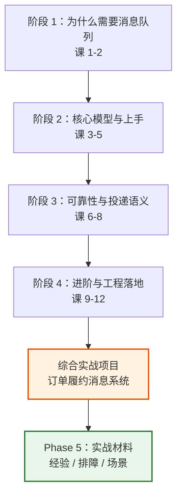

# RabbitMQ 系统学习 · 课程手册

> 这是整个课程体系的**总索引**。
> 如果你是从头开始 → 直接从「学习路径」往下走。
> 如果你是回来查东西 → 用「按问题找材料」定位。

## 这门课想让你带走什么

一句话：**建立 RabbitMQ 的完整心智模型，并知道它的边界在哪。**

具体说，学完之后你应该能：

1. 说清楚"什么时候该用 MQ、什么时候不该"（而不是"大家都在用"）
2. 拿到一个业务需求，能设计出可靠的消息链路（不丢、不重、失败有出口）
3. 线上出问题时，能在几分钟内判断是**哪一类**问题并止血
4. 知道 RabbitMQ 的能力边界——**哪些需求它解决不了，该换什么**

---

## 学习路径

四个阶段，从"为什么"到"怎么用"到"生产怎么落地"。



| 阶段 | 课 | 主题 | 解决什么问题 |
|------|-----|------|-------------|
| 1 | [课 1](stages/1-为什么需要消息队列/lessons/lesson-01-为什么需要消息队列.md) · [课 2](stages/1-为什么需要消息队列/lessons/lesson-02-RabbitMQ是什么与起源定位.md) | 为什么需要消息队列 / 是什么与起源定位 | 建立动机：MQ 解决什么问题、代价是什么 |
| 2 | [课 3](stages/2-核心模型与上手/lessons/lesson-03-起RabbitMQ与发第一条消息.md) · [课 4](stages/2-核心模型与上手/lessons/lesson-04-交换机与路由.md) · [课 5](stages/2-核心模型与上手/lessons/lesson-05-队列与消息的属性.md) | 起服务 / 交换机与路由 / 队列与消息属性 | 能把消息发出去、收回来，理解 AMQP 模型 |
| 3 | [课 6](stages/3-可靠性与投递语义/lessons/lesson-06-确认机制与预取.md) · [课 7](stages/3-可靠性与投递语义/lessons/lesson-07-持久化与死信.md) · [课 8](stages/3-可靠性与投递语义/lessons/lesson-08-交付语义与幂等.md) | 确认与预取 / 持久化与死信 / 交付语义与幂等 | **可靠性的核心**：不丢、不重、失败有出口 |
| 4 | [课 9](stages/4-进阶与工程落地/lessons/lesson-09-Python客户端工程实践.md) · [课 10](stages/4-进阶与工程落地/lessons/lesson-10-高级特性.md) · [课 11](stages/4-进阶与工程落地/lessons/lesson-11-集群与高可用.md) · [课 12](stages/4-进阶与工程落地/lessons/lesson-12-架构落地与选型决策.md) | Python 工程实践 / 高级特性 / 集群与高可用 / 架构落地与选型 | 从"会用"到"生产可用"，以及该不该用它 |

---

## 按问题找材料

| 你现在的问题是 | 直接去 |
|---------------|--------|
| 我需要理解某个概念 | [阶段讲义](#学习路径) 对应课时 |
| 我想看看完整系统怎么搭 | [综合实战项目](projects/订单履约消息系统/README.md) |
| 我担心踩坑，想提前知道 | [08-实战经验.md](08-实战经验.md) |
| **线上出问题了，要马上止血** | [09-排障速查手册.md](09-排障速查手册.md) |
| 有个新需求，不知道怎么设计 | [10-场景解法库.md](10-场景解法库.md) |
| 我要向别人解释为什么选 RabbitMQ | [课 12：选型对比](stages/4-进阶与工程落地/lessons/lesson-12-架构落地与选型决策.md) |

---

## 综合实战项目

### [订单履约消息系统](projects/订单履约消息系统/README.md)

一句话需求：下单后异步驱动「扣库存 → 通知发货 → 发短信」，要求**消息不丢、业务不重复执行、失败能自动重试并最终有兜底**，且**单个节点宕机不影响整体可用**。

**为什么值得做**：12 课里每课只验证**单个**知识点。但真实系统中它们**同时**起作用——
开了 confirm 还要想清楚重试几次、选了 quorum 就得接受它不支持 `x-max-priority`、做了幂等还要分清重复来自生产侧还是消费侧。
这些**交叉点**才是工程里真正咬人的地方。

| 产物 | 内容 |
|------|------|
| [README](projects/订单履约消息系统/README.md) | 需求 + 25+1 项知识点地图 + 运行方式 |
| [设计决策](projects/订单履约消息系统/设计决策.md) | 5 个真权衡点，每个含候选对比/选择/理由/代价/何时改选 |
| [反例对照](projects/订单履约消息系统/反例对照.md) | 一个"能跑但很糟"的版本 + 6 处致命差异 |
| [验收清单](projects/订单履约消息系统/验收清单.md) | A-G 七组，其中 B6/D5/D6 三项**必须手工验证** |
| `实现/` | 12 个 Python 模块，全部实跑通过 |

**验收状态**：15/15 自动检查通过；3 项手工演练全通过（强制宕机零丢失、重试退避递增、死信 `reason=delivery_limit`）。

---

## Phase 5：三份实战材料

三份材料**互补而非重叠**，区别在于**使用时机**：

| 产物 | 回答的问题 | 什么时候用 | 形态 |
|------|-----------|-----------|------|
| [08-实战经验.md](08-实战经验.md) | 会踩什么坑、为什么会踩 | 坐着读，学原理 | 学习态：适用边界 + 8 个故障模式 + 落地 Checklist |
| [09-排障速查手册.md](09-排障速查手册.md) | 出错了怎么止血 | 崩了翻，要答案 | 使用态：按症状倒查 + 先止血后定位 + 条件-动作表 |
| [10-场景解法库.md](10-场景解法库.md) | 新要求来了怎么设计 | 主动想，做权衡 | 设计态：8 场景 × 3-4 解法 + 折叠先想后看 |

### 三份材料里最该记住的几条

**来自实战经验**：

- **失败重试用 `reject`，不用 `nack`**——4.3 起两者不等价，`nack` 不推进 `delivery-count`，
  会导致延迟恒定、**永不进死信**的无限循环
- **`auto_ack=True` 下崩溃丢的不止一条**——实测 100 条只执行 1 条就崩溃，队列剩余 0 条；
  且 `prefetch` 对 `auto_ack` **完全无效**，加多少都救不了
- **`x-delivery-limit` 与 `x-delayed-retry-*` 是 quorum 专属**——classic 声明即报 406
- **测量行为本身可能消除被测现象**——`docker restart` 是优雅关机，会得出与生产相反的结论

**来自排障手册**：

- **先止血，后定位**；但**先存证，再动手**——清空队列、restart 复现、删队列重建这三个动作会毁掉现场
- **如果消息正常到达消费者并被正常 ack，RabbitMQ 的职责就结束了**——剩下的是业务问题

**来自场景库**：

- **"定时执行"和"可撤销的定时执行"是两个需求**——MQ 擅长前者，不擅长后者
- **异地多活不是 MQ 能解决的问题**——官方明说集群要求 LAN 级延迟，跨机房要用 Federation/Shovel
- **把大消息拆碎通常更慢**——瓶颈是每条消息的固定开销，不是大小

---

## 实验环境

所有"实测"结论均来自这套环境，**版本不同则结论可能不同**：

| 项 | 值 |
|----|-----|
| RabbitMQ | 4.3.5（三节点集群 rmq1/rmq2/rmq3） |
| Erlang | 27.3.4.16 |
| 客户端 | Python 3 + pika 1.4.4（**WSL 内运行**，Windows 侧 pika 不可用） |
| 端口 | AMQP 5681/5682/5683；UI 15681/15682/15683 |
| 元数据后端 | Khepri（Raft）——4.3 起唯一受支持 |

> ⚠️ **跨客户端警告**：本课程用 Python + pika。凡涉及"客户端协商行为"的结论
> （心跳协商、confirm 的异步性、生成器式 `consume()` 的惰性注册），
> **换语言换客户端都要重新验证**——pika 是社区客户端，行为与官方客户端不同。

---

## 📁 完整文件清单

```
rabbitmq/
├── final-课程手册.md          ← 本文件（总索引）
├── 00-学习档案.md             进度、评审记录、事实核查记录
├── 00-评审清单.md             双视角评审的强制检查点
├── 01-学习路径总览.md
├── 02-课程目录.md
├── 08-实战经验.md             Phase 5 · 学习态
├── 09-排障速查手册.md          Phase 5 · 使用态
├── 10-场景解法库.md            Phase 5 · 设计态
├── stages/                    4 阶段 12 课讲义 + 阶段概览 + SVG
│   ├── 1-为什么需要消息队列/
│   ├── 2-核心模型与上手/
│   ├── 3-可靠性与投递语义/
│   └── 4-进阶与工程落地/
├── projects/订单履约消息系统/   结课综合实战项目
│   ├── README.md / 设计决策.md / 反例对照.md / 验收清单.md
│   └── 实现/（12 个 Python 模块）
├── playground/                各课实验脚本（l5-*/l6-*/.../p3-*）
└── assets/
```

---

## 🧭 导航

- [课程目录](02-课程目录.md)
- [学习档案（断点续学看这里）](00-学习档案.md)
- [实战项目](projects/订单履约消息系统/README.md)
- [实战经验](08-实战经验.md) · [排障速查手册](09-排障速查手册.md) · [场景解法库](10-场景解法库.md)
