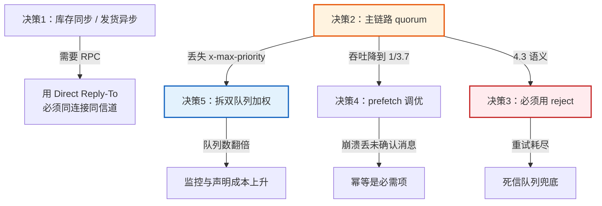

# 设计决策：5 个真权衡点

> 判定「真权衡」的标准：**换个人来可能选另一个方案，且也有道理**。
> 每个决策写清五件事：候选方案对比 → 最终选择 → 选择理由 → 为此付出的代价 → 什么情况下该改选另一个。

> **事实核查（核查于 2026-09）**：本文件涉及的机制行为均已用 RabbitMQ 4.3.5 三节点集群实测，
> 并与官方文档交叉印证。关键印证点：
> - `x-delivery-limit` 与 `x-delayed-retry-*` **仅适用于 quorum 队列**，classic 队列声明时直接报
>   `PRECONDITION_FAILED`（实测 + WSO2/官方 AMQP 客户端 API 文档互相印证：这些参数"only applies to
>   QUORUM queue types, is ignored for CLASSIC and STREAM queues"）
> - 4.3 起 `delivery-count` **只在真失败时递增**：官方表载明 `basic.nack` → acquired-count ✅ /
>   delivery-count ❌，`basic.reject` → 两者都 ✅（与决策 3 的实测完全一致）
> - 延迟公式 `min(min_delay × delivery_count, max_delay)`，官方原文一致

---

## 决策 1：哪些步骤上 MQ，哪些不上

### 候选方案对比

| 方案 | 做法 | 优点 | 缺点 |
|------|------|------|------|
| A. 全上 MQ | 下单、扣库存、发货、发短信全部异步化 | 解耦最彻底、吞吐最高 | 用户点完"提交订单"看不到结果；库存结果要异步回传，前端得轮询 |
| B. 全不上 MQ | 四步同步串行 | 最简单、强一致 | 任一步慢/挂，整个下单失败；短信这种非关键操作会拖死主流程 |
| **C. 按「是否需要用户等待结果」切分** | 扣库存同步（要结果），发货/短信异步 | 用户能立刻知道"下单成功/库存不足" | 需要区分同步/异步两套错误处理 |

### 最终选择

**方案 C**：扣库存走**同步 RPC**（Direct Reply-To），拿到结果立即返回用户；发货与短信走**异步消息**。

### 选择理由

这是课 1「同步调用四困境」与课 12「典型消息模式」的交叉点。判断依据不是"技术手段先不先进"，而是**这一步的结果用户要不要马上知道**：

- **扣库存**：用户必须立刻知道成功还是失败。做成异步，前端要么轮询要么 WebSocket，复杂度反而更高——这是典型的"为了用 MQ 而用 MQ"。
- **发货通知 / 短信**：用户不需要立刻知道，且这两步失败不该让下单失败。做成异步，主流程响应更快，且下游挂了不影响下单。

### 为此付出的代价

1. **两套错误模型**：同步部分要处理超时与 RPC 异常，异步部分要处理重试与死信。代码量增加，且开发者要同时理解两种模式。
2. **库存已扣、发货失败的不一致窗口**：扣库存成功后下单已返回成功，但发货消息可能最终进死信——**业务上需要一个"订单已支付但未发货"的对账巡检**。这是异步化必然带来的最终一致性问题，无法用消息系统本身解决。

### 什么情况下该改选另一个

- 如果是**内部批处理系统**（无用户等待），选 A，全异步吞吐最高。
- 如果**四个步骤都要求强一致**（如金融转账），选 B 或引入分布式事务/补偿机制——**消息队列解决不了强一致**，这时硬上 MQ 是错的。

---

## 决策 2：主链路用 quorum 还是 classic 队列

### 候选方案对比

| 方案 | 可靠性 | 吞吐（课 7 实测） | 空队列内存（课 5 实测） | 接受 x-max-priority | 元数据 |
|------|--------|------------------|------------------------|---------------------|--------|
| classic（非复制） | 宿主宕机即不可用 | 500 条 **0.245s**（基准） | 13,984 B | ✅ 接受（0-255） | 数据在单节点 |
| **quorum（Raft 3 副本）** | confirm 前已 fsync 到多数派 | 500 条 **0.903s**（约 3.7 倍耗时） | 39,492→47,412 B（**持续上涨**） | ❌ **一律拒绝** | 复制到 3 节点 |

### 最终选择

**主链路（订单、库存、发货）用 quorum；旁路通知（短信）用 classic。**

### 选择理由

1. **可靠性是本项目的硬性非功能约束**（"任一节点宕机系统继续可用"）。课 11 实测：classic 队列宿主宕机后报错 `NOT_FOUND - process is stopped by supervisor`；quorum 队列 0.07s 完成选举、已确认消息零丢失。**classic 在这个约束下直接出局**。
2. **confirm 的语义强度不同**：课 7 官方定性——classic 在发 confirm 前**不执行 fsync**，quorum 确认前**已 fsync 到多数派**。既然本项目开了 publisher confirm，用 quorum 才能让"已确认"真正等于"已落盘"。
3. **短信用 classic 是刻意的**：短信丢了用户顶多收不到通知，不值得为它付 3.7 倍写代价和 3 倍内存。这是**按数据价值分级**，不是一刀切。

### 为此付出的代价

1. **写吞吐降到约 1/3.7**：500 条从 0.245s 变成 0.903s。订单量极大时需要更多节点或批量发布。
2. **内存开销约 2.8-3.4 倍且持续增长**：空 quorum 队列也在涨（Raft 日志与状态机开销）。队列数量多时这笔账很可观。
3. **丢失 x-max-priority 能力**：quorum 一律拒绝该参数（课 10 实测 12 个取值全被拒）——直接导致**决策 5** 的连锁问题。
4. **运维复杂度上升**：要理解 Raft 多数派、关注副本同步状态，不能像 classic 那样"能连上就能用"。

### 什么情况下该改选另一个

- 如果这是**日志采集 / 埋点上报**类场景（允许丢失、吞吐优先）→ 选 classic，quorum 的代价换不来对等的收益。
- 如果**需要严格优先级**且不能改设计 → classic，但你就得自己解决高可用（或者接受单点）。
- 如果**需要回放历史消息** → 都不选，用 stream（本项目不需要，故未采用）。

---

## 决策 3：重试语义用 reject 还是 nack

> 这是本项目**最容易被忽略、后果最严重**的决策。课 10 发现了 nack/reject 在 4.3 不再等价，本项目实测把它推到了完整链路上。

### 候选方案对比

用 quorum + DLX + `x-delivery-limit=3` + `x-delayed-retry-*`(min 1000ms / max 4000ms) 实测（`p3-probe-retry3.py`）：

| 客户端动作 | delivery-count 变化 | 实测重试间隔 | 是否触发死信 | 最终结局 |
|-----------|---------------------|-------------|-------------|---------|
| `nack(requeue=True)` | **恒为 None（不涨）** | 1.04 / 1.05 / 1.05 / 1.05 / 1.05s（**恒定**） | ❌ 否 | **无限重试死循环** |
| **`reject(requeue=True)`** | 1 → 2 → 3（**递增**） | **1.04 / 2.09 / 3.02s**（递增） | ✅ 是 | 超限后转死信 |

死信中的 `x-death` 记录：`{'count': 1, 'reason': 'delivery_limit', 'queue': 'p3.probe4.reject', ...}`

> ⚠️ **版本提示**：quorum 队列的 `delivery-limit` 默认值与语义在 4.x 内部变过——
> 4.0 起默认 20，而 **4.3 起计数依据从 acquired-count 改为 delivery-count**，
> 意味着默认值虽仍是 20，但"哪些动作会把它耗光"完全不同（4.3 起 `nack` 不再计数）。
> **不要照抄任何教程里的这个数字**，在你自己的版本上用
> `rabbitmqctl list_queues name arguments` 确认。本项目显式设为 3。

### 选择理由

两个机制都只看 `delivery-count`，**不看** `x-acquired-count`：

- 延迟公式：`min(min_delay × delivery_count, max_delay)`
- 死信阈值：`x-delivery-limit` 对比 `delivery_count`

而 `delivery-count` **只在"投递失败"时才涨**。4.3 的语义是：`nack` = "我取过但没失败"，`reject` = "这条真的失败了"。用 `nack` 重试，计数器永远不动 → 延迟恒为最小值 → 永远够不到 delivery-limit → **消息在队列里无限循环，永不进死信**。

这个失败形态极其阴险：**系统看起来在正常工作**（消息在被消费、日志在打重试），实际上那条坏消息会永远转下去，直到有人去看队列深度才发现。

### 为此付出的代价

1. **丢失了 `nack` 的批量语义**：`nack` 支持 `multiple=True` 批量拒绝，`reject` 不支持。批量失败场景需要逐条 reject。
2. **语义理解成本**：团队里每个人都要知道"重试用 reject 不用 nack"，否则一个人写错就埋一个死循环。这个约束必须写进代码规范 + Code Review 清单。
3. **4.3 版本绑定**：这个区分是 4.3 才明确的。迁移到老版本（3.x）时两者等价，行为会变。

### 什么情况下该改选另一个

**几乎不该改选。** 唯一例外：如果你要表达的是"这条消息我**暂时**处理不了、请稍后重新排队，但**不计入失败次数**"（比如依赖的下游限流了、要退避但不想耗尽重试预算）——这时 `nack(requeue=True)` 的"不涨计数"恰恰是你想要的。但你必须同时有另一条兜底路径（如消息自带的过期时间），否则就是死循环。

---

## 决策 4：prefetch 设多少

### 候选方案对比

课 6 实测数据（单消费者吞吐）：

| prefetch | 吞吐（条/秒） | 特点 |
|----------|--------------|------|
| 1 | 3,716 | 最公平，最慢 |
| 10 | 20,363 | 均衡 |
| 50 | **31,721（峰值）** | 吞吐最优 |
| 100 | 26,501 | 反而下降 |
| 不设（无上限） | 数千~0（auto_ack 下全部推空） | **危险** |

另有两个硬约束：
- **prefetch 对 `auto_ack=True` 完全无效**（课 6 P0 实测）：投递即确认，永不存在未确认态，限制无处施加。
- **prefetch 影响失败重投对顺序的破坏程度**（课 8 实测）：prefetch=1 无积压时重投能插回原位；prefetch=8 有积压时被挤到第 8 位。

### 最终选择

**主链路（库存、发货）设 `prefetch=10`；短信（旁路、量大、无顺序要求）设 `prefetch=50`。**

### 选择理由

1. **不设 prefetch 是绝对不可接受的**：课 6 实测，不设时先连上的消费者会把队列抢空（6 条全被 C2 拿走、C1 得 0 条），且课 8 证明了更严重的后果——`auto_ack` + 无 prefetch 时，业务回调只执行 1 条就崩溃会**丢失全部 100 条**（多出的 99 条死在 pika 接收缓冲区里，业务代码根本没见过）。
2. **不选 1**：prefetch=1 吞吐只有峰值的 11.7%，对订单链路太慢。
3. **选 10 而非 50**：主链路对**顺序和失败影响范围**更敏感——prefetch 越大，崩溃时丢失的未确认消息越多、重投对顺序的破坏越严重。10 的吞吐已是 prefetch=1 的 5.5 倍，够用。
4. **短信选 50**：它无顺序要求、量大、单条处理快，值得为吞吐让渡，且丢了影响小。

### 为此付出的代价

1. **放弃了约 3 倍吞吐**（31,721 → 20,363 条/秒）。若订单量增长到瓶颈，需要增加消费者实例而非单纯调大 prefetch。
2. **崩溃时最多丢 10 条未确认消息**（prefetch=1 时只丢 1 条）。这是用"少量可能的重复/回退"换吞吐的必然结果，由**幂等**（决策之外但已实现）兜底。
3. **两个不同的值增加配置复杂度**：要在文档里说清为什么两个数不一样，否则后人会"统一一下"。

### 什么情况下该改选另一个

- **严格要求顺序 + 不能接受任何重复** → prefetch=1，并接受吞吐代价。
- **纯吞吐场景（数据同步、日志转发）** → 50，甚至更高。
- **处理耗时极长（分钟级）的任务** → 用较小的 prefetch（1-3），避免大量消息长期停留在 unacked 状态，影响监控判断与故障恢复。

---

## 决策 5：quorum 不支持优先级，订单 VIP 怎么办

> 这是**决策 2 的连锁代价**——选了 quorum 就丢了 `x-max-priority`。

### 候选方案对比

课 10 实测：quorum 队列传 `x-max-priority`（取值 1/2/3/5/8/10/16/31/32/33/64/255）**全部被拒**，报 `PRECONDITION_FAILED`。官方原文：quorum 队列**始终提供完整 0-31 优先级**，无需 opt-in；`x-max-priority` 仅适用于 classic 且对 quorum 被忽略。

| 方案 | 做法 | 优点 | 缺点 |
|------|------|------|------|
| A. 改用 classic 队列 | 换回 classic 以换取 x-max-priority | 直接支持优先级 | **放弃高可用**（决策 2 的全部理由推翻），退回单点 |
| B. 多队列 + 消费者加权 | VIP 队列配 3 个消费者、普通队列配 1 个 | 不依赖优先级特性，任何队列类型可用；还可对不同队列配不同 DLX/重试策略 | 队列数翻倍；要自己实现加权消费；优先级是"软"的 |
| **C. 业务层排序** | 消息进普通队列，消费者取一批后按优先级排序处理 | 无需改拓扑 | 只对已在缓冲区的消息有效，积压时无效；破坏"先进先出"直觉 |
| D. 放弃优先级 | 所有订单一视同仁 | 最简单 | 业务不接受（VIP 是明确需求） |

### 最终选择

**方案 B：拆成 `order.fulfill.vip` 与 `order.fulfill.normal` 两个队列，用消费者数量加权（VIP 3 个消费者、Normal 1 个）。**

### 选择理由

1. **不能为了一个次要特性推翻核心决策**：高可用（决策 2）是硬约束，VIP 加速是优化项。用 A 等于为了芝麻丢西瓜。
2. **B 是唯一同时满足"quorum 高可用"与"VIP 优先"的方案**，且附带好处：VIP 队列可以配更激进的重试策略和独立的死信队列——**不同 SLA 用不同配置**，这在单队列 + 优先级方案里做不到。
3. **C 在积压时无效**：课 10 实测——优先级只在**有积压时**生效；消费者空闲时（发一条取一条）优先级完全不起作用（发布 [1,9,2,8,3] 取出仍是 [1,9,2,8,3]）。真正的 VIP 需求恰恰发生在系统积压时，C 在最关键的场景失效。
4. **B 的"软优先级"其实更可控**：3:1 的消费者配比下，VIP 队列的积压消化速度约为普通的 3 倍，这个倍数是**可预测、可调整、可监控**的；而优先级队列的行为受消息分布影响，难以给出确定承诺。

### 为此付出的代价

1. **队列数与消费者数增加**：2 个队列 + 4 个消费者（3 VIP + 1 Normal），比单队列方案多一套声明、绑定、监控配置。
2. **优先级粒度变粗**：只有两档（VIP / Normal），做不到 0-31 的细粒度。若将来要分更多档，队列会继续膨胀。
3. **生产者要判断路由**：发消息前得先知道这是不是 VIP 订单，多一层判断逻辑，且这个判断错了会导致 VIP 进普通队列（**需要一个兜底：Normal 消费者发现 VIP 消息时转投 VIP 队列**）。
4. **资源配比是静态的**：3:1 写死在部署配置里。流量结构变化（比如 VIP 单子暴涨）时需要人工调整，不能自动适应。

### 什么情况下该改选另一个

- **不需要高可用** → 方案 A（classic + x-max-priority），最简单直接。
- **优先级档位多且动态变化** → 方案 C 或考虑在业务层做优先级调度（把队列当纯缓冲区，调度逻辑上移到业务服务）。
- **VIP 量极大、与普通订单不是一个量级** → 应该拆成**独立的服务**而非独立队列，因为它们的 SLA、资源、甚至部署环境都该隔离。

---

## 决策之间的连锁关系

这 5 个决策不是独立的，改一个会牵动其他：

**最关键的一条连锁**：决策 2（选 quorum）→ 触发决策 5（优先级方案重设计）→ 队列数翻倍 → 监控与运维成本上升。**选型的代价往往不是单点，而是连锁反应**——这是本项目最想传达的工程认知。

---

## 附：一个容易被忽略的第六个决策——死信策略

严格说它不算独立权衡，但**漏掉它会让前面的死信设计出现漏洞**，故补在这里。

quorum 队列死信化时有一个专属参数 `x-dead-letter-strategy`（官方 AMQP 客户端 API 文档有载，classic 队列忽略此参数）：

| 取值 | 行为 | 风险 |
|------|------|------|
| `at-most-once`（**默认**） | 先从源队列删除，再发往 DLX | 死信化途中 broker 挂了 → **消息丢失**（但不会重复） |
| `at-least-once` | 先发往 DLX，成功后再从源队列删 | 死信化失败重试 → **DLX 里可能出现重复**（但不会丢） |

**本项目沿用默认 `at-most-once`**，理由：死信队列本身已是"最后兜底"，
且我们的消费者全部做了幂等（不会因重复出问题），
因此优先避免"源队列与死信队列里都没有"的彻底丢失。

**什么时候该改选 `at-least-once`**：当死信消息本身**不允许丢失**（如资金相关），
且下游能处理重复时。反过来，如果你的死信处理链路**没有幂等**，
默认策略反而是更安全的选择——重复会让你困惑，丢失则让你无从查起。

> ⚠️ 置信度说明：本项依据官方文档的参数语义说明，**未在本环境做故障注入实测**
> （要稳定复现"死信化途中断电"很困难）。列出它是为了让读者知道这个开关存在，
> 不要误以为死信化是原子的。

## 🧭 导航

- [返回 README](./README.md)
- [查看反例对照](./反例对照.md)
- [查看验收清单](./验收清单.md)
- [返回课程目录](../../02-课程目录.md)
