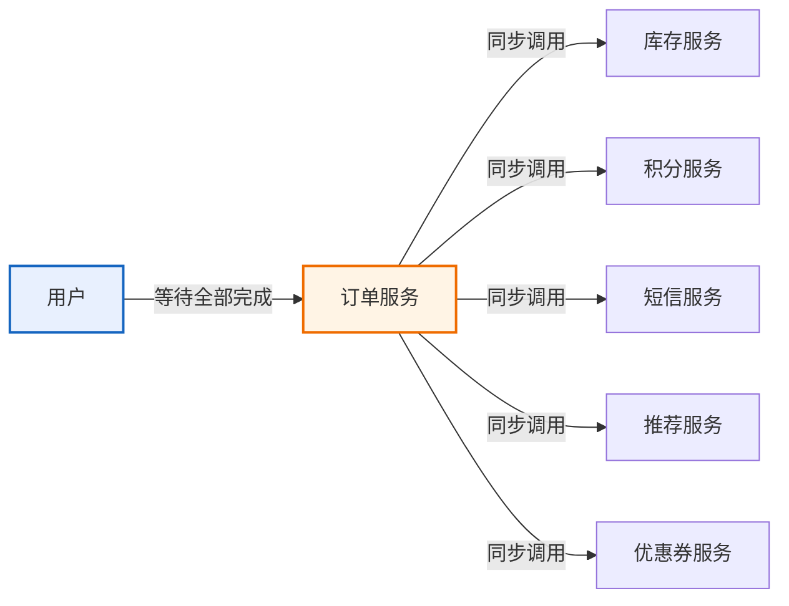
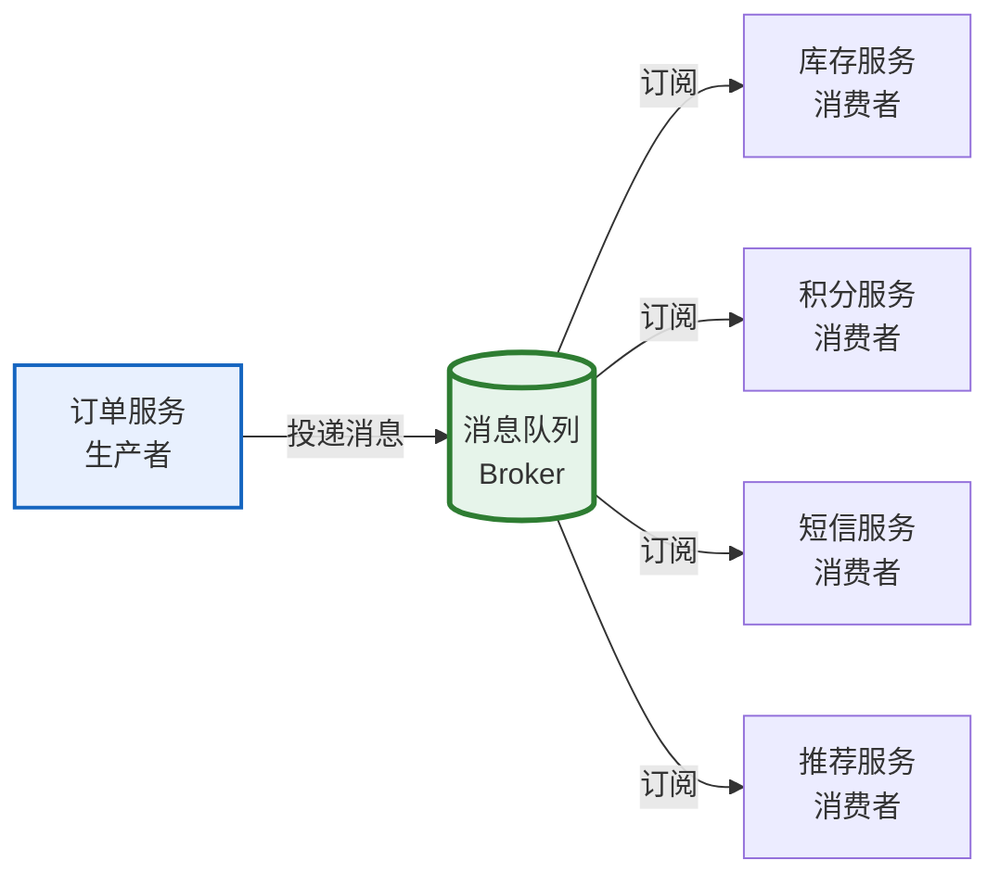
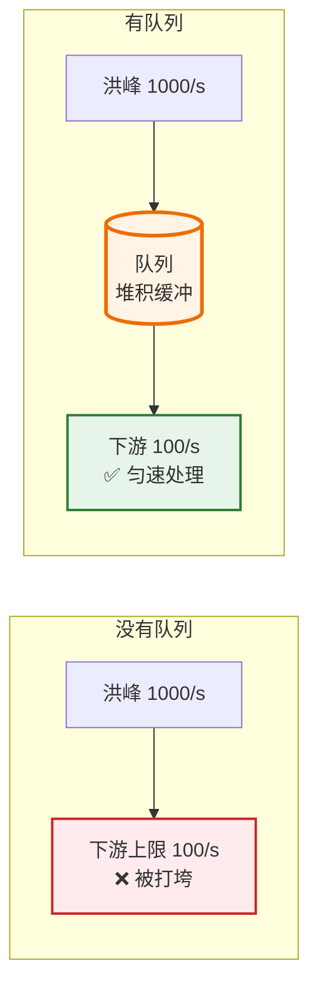
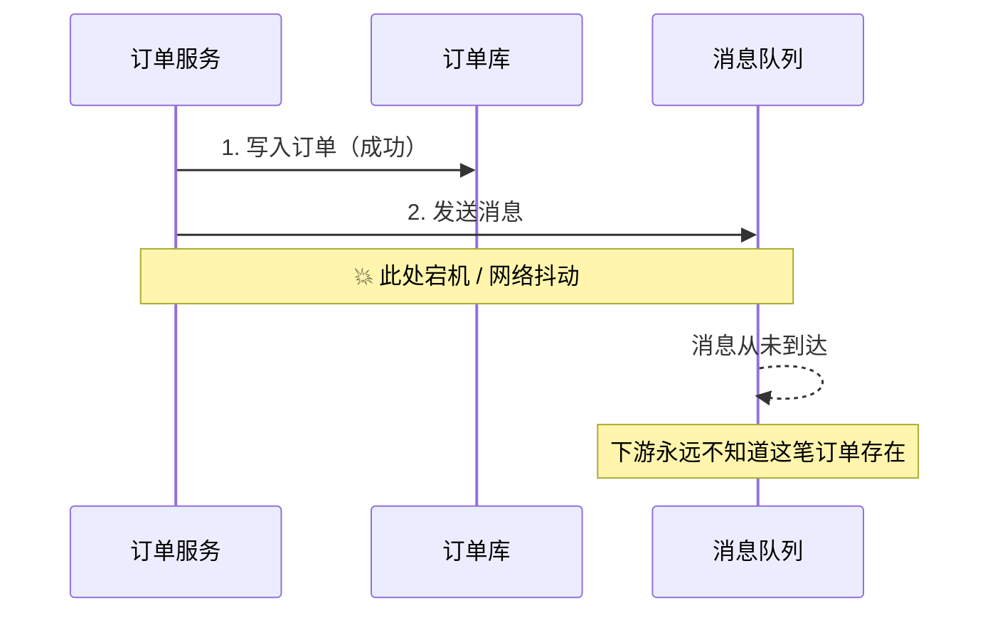
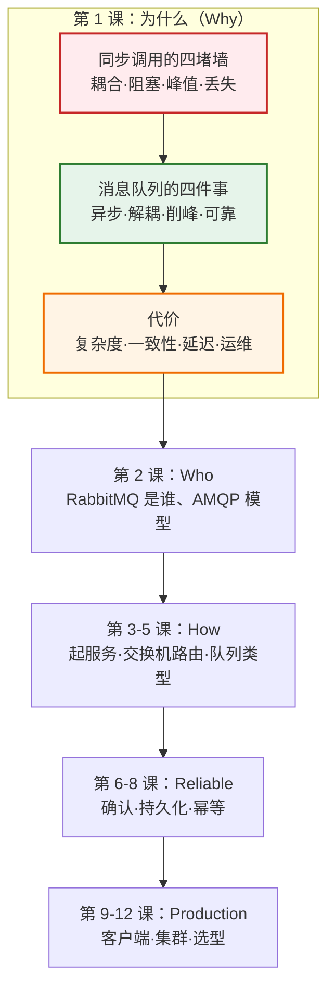
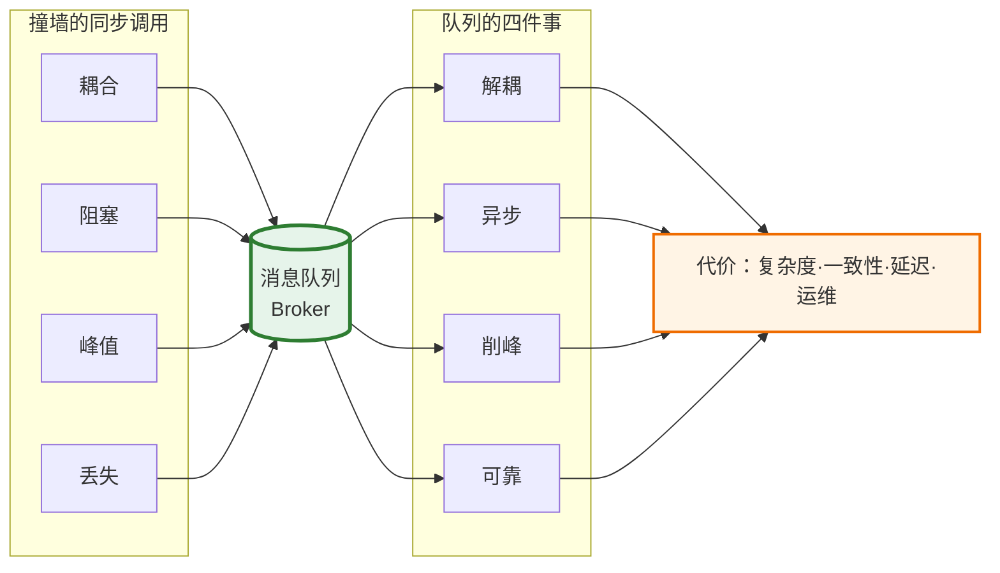

# 第 1 课：为什么需要消息队列

> 所属阶段：阶段 1《为什么需要消息队列》｜ 水平：零基础 ｜ 本课知识点：同步调用的四个困境、消息队列的本质、引入 MQ 的代价
> 故事情节：主角（一条消息）还没出生——我们先看没有它的时候，系统是怎么一步步撞墙的
> 版本口径：RabbitMQ 4.3.x（核查于 2026-08，官方文档当前版本为 4.3.5）

## 🎯 本课目标

- 举出服务之间直接同步调用会遇到的四类真实故障场景
- 说清消息队列做的四件事（异步、解耦、削峰、可靠）各自对应解决哪个困境
- 说出引入消息队列的代价，能判断一个小系统此刻是否值得引入

---

## 第一幕：起源与场景引入

**消息队列这个想法，比 RabbitMQ 老得多。** 在开源消息中间件出现之前，银行、电信这类"消息绝对不能丢"的行业，早就花大价钱在用商业消息中间件（IBM MQ、TIBCO 等）；互联网公司后来遇到的耦合、峰值、丢失问题，它们几十年前就遇到过。开源消息队列做的事情，本质上就是把这套"把调用变成消息"的思路，用廉价、通用、跨语言的方式带给所有人。
（行业史泛述，未逐项核实具体年份，置信度：中）

现在回到我们自己身上。假设你在做一个电商的**下单接口**，代码大概是这个形状：

```python
def create_order(user_id, items):
    order = order_db.save(...)          # 1. 写订单库
    inventory_client.deduct(items)      # 2. 调库存服务：扣库存
    points_client.add(user_id, 10)      # 3. 调积分服务：加积分
    sms_client.send(user_id, "下单成功")  # 4. 调短信服务：发通知
    recommend_client.refresh(user_id)   # 5. 调推荐服务：更新画像
    return order
```

上线第一天，一切正常，接口 120ms 返回，老板很满意。

> 🎬 **场景**：一个"下单后要联动五个下游服务"的接口，最初跑得好好的，然后开始出事。

---

## 第二幕：认知冲突

第一周，短信服务商挂了。用户点"提交订单"，转圈 30 秒，最后弹出"下单失败"。

**可是订单明明已经写进数据库了。** 用户在 App 上看到失败，又点了一次——于是下了两单、扣了两次库存。

你连夜加了 try-except，短信失败就吞掉异常。第二周大促，流量是平时的 20 倍，推荐服务先扛不住开始超时，拖着整个下单接口一起慢，最后整条链路雪崩，**连下单都下不了**。

第三周产品说："下单成功后再发张优惠券吧。"你叹了口气，又去改 `create_order`，加了一行 `coupon_client.grant(...)`。**每加一个下游，就要改一次核心下单代码、重新发布一次。**

第四周客服找上门：有用户说下单成功了但积分没加。你查日志，发现是那次发版时积分服务重启，请求丢了。**没有重试、没有记录、无从查起。**

> ❓ **问题**：这四件事看起来是四个不同的故障，但它们其实都源于同一个设计假设——**"下单必须等所有下游都干完活才算完"**。这个假设真的成立吗？

---

## 第三幕：层层揭示

### 知识点 1：同步调用的四个困境

> 本知识点关键点：强耦合 / 阻塞等待 / 峰值压垮 / 失败即丢失

#### 一句话定义

同步调用指的是调用方发出请求后**一直等着**被调方干完活、返回结果才继续往下走；这种"面对面等结果"的方式在分布式系统里会系统性地产出四类问题。

#### 直觉建立（类比）

想象一家快餐店。

最原始的做法是：顾客点完单，收银员**亲自**去炸薯条、打可乐、装汉堡，全部做完才把餐递给顾客，再服务下一位。队伍排到门口，而后面的厨师闲着。

现实中的快餐店不是这样的：收银员只做一件事——**把小票贴到出餐口的架子上**，然后立刻对下一位顾客说"请稍等，叫号取餐"。炸薯条的、打可乐的、装汉堡的，各看各的小票，各干各的活。

那张小票，就是消息；那个出餐口的架子，就是队列。

> 💡 **类比的边界**：餐厅的小票丢了就丢了，最多客人抱怨一句。消息队列不是这样——它有**持久化**（小票写进账本）和**确认机制**（做完才把小票撕掉），这是企业级消息中间件和普通缓冲区的关键区别，后面第 6、7 课会专门讲。

#### 核心原理

把第二幕的四个故障抽象出来，正好是四堵墙：



| 困境 | 在第二幕里的表现 | 本质问题 |
|------|------------------|----------|
| **强耦合** | 每加一个下游，都要改 `create_order` 并重新发版 | 调用方必须知道每一个被调用方的存在和接口 |
| **阻塞等待** | 短信服务慢，用户就多等 30 秒 | 响应时间 = 所有下游耗时之和，被最慢的一环决定 |
| **峰值压垮** | 大促时推荐服务超时，拖垮整条链路 | 下游没有缓冲，瞬时流量直接砸在处理能力上 |
| **失败即丢失** | 积分服务重启，那次请求凭空消失 | 调用失败后没有留痕，无法重试、无法对账 |

**关键点在于：这四个问题的严重程度，都由"最弱、最慢、最不重要的那个下游"决定。** 发短信不重要，但它能把下单这个最核心的动作拖死——这显然不合理。

#### 示例演示

不需要任何框架，用几行 Python 就能感受到"阻塞等待"的代价：

```python
import time

def call(name, cost):
    time.sleep(cost)          # 模拟一次网络调用
    print(f"  {name} 完成，耗时 {cost*1000:.0f} ms")

start = time.perf_counter()
call("写订单库", 0.02)
call("扣库存",   0.05)
call("加积分",   0.03)
call("发短信",   0.30)   # 第三方短信，最慢
call("更新画像", 0.08)
print(f"用户总共等待 {(time.perf_counter()-start)*1000:.0f} ms")
```

```text
# 预期输出：
#   写订单库 完成，耗时 20 ms
#   扣库存 完成，耗时 50 ms
#   加积分 完成，耗时 30 ms
#   发短信 完成，耗时 300 ms
#   更新画像 完成，耗时 80 ms
#   用户总共等待 490 ms
```

真正属于"下单"这件事的只有前两步，加起来 70ms；剩下的 420ms 都是用户在为一个**通知**买单。

#### 常见误区

1. **"加个线程池并发调用不就行了？"** 并发能压掉等待时间（490ms → 300ms），但解决不了另外三件事：新加下游还是要改代码（耦合）、大促时并发量翻倍更压垮下游（峰值）、失败了依然没留痕（丢失）。并发是优化，不是架构改造。

#### 一句话记住

**同步调用的病根是：让最不重要的下游，决定了最重要动作的成败与快慢。**

---

### 知识点 2：消息队列的本质

> 本知识点关键点：异步化 / 解耦 / 削峰填谷 / 可靠投递

#### 一句话定义

消息队列是在调用方和被调用方之间插入的一个**负责暂存和转发消息的中间件**：调用方把"要做的事"包装成消息丢进去就返回，被调用方按自己的节奏取走处理。

#### 直觉建立（类比）

还是那家快餐店。架子（队列）带来的改变不止一个：

- 收银员不用盯着后厨 → **异步**
- 后厨新来一个"做冰淇淋"的岗位，收银员完全不用改工作方式 → **解耦**
- 中午突然涌进 100 人，小票在架子上排着，后厨按自己的速度做，没人被压垮 → **削峰**
- 小票没做完就不撕，掉地上了还能捡起来 → **可靠**

**这四个词，就是消息队列全部的价值主张。**

> 💡 **类比的边界**：真实系统里"出餐口"是一台独立的服务器（broker），它会持久化消息、会给回执、能在多个消费者之间分发——它比一块木板复杂得多，也可靠得多。

#### 核心原理

引入队列后，拓扑从"星型调用"变成"总线型"：



> 📖 **术语**：**Broker**（中间件进程）就是那台专门负责"收消息、存消息、发消息"的服务程序 —— RabbitMQ 本身就是一个 broker。发消息的一方叫**生产者（Producer）**，收消息的一方叫**消费者（Consumer）**。三方都不需要知道彼此的 IP。

四个困境是这样被拆掉的：

| 困境 | 队列的解法 | 具体机制 |
|------|-----------|----------|
| 阻塞等待 | **异步化** | 生产者只负责把消息送到 broker（毫秒级），不等消费结果 |
| 强耦合 | **解耦** | 生产者只认识 broker 和"订单已创建"这个事件，不认识任何下游；新增消费者零改动 |
| 峰值压垮 | **削峰填谷** | 队列是缓冲区，洪峰先堆在队列里，消费者按固定速率消费 |
| 失败即丢失 | **可靠投递** | 消息持久化 + 消费确认：处理完才删除，失败可重投 |

**注意这里发生了一个根本性的转变**：调用从"命令"（你去扣库存）变成了"事实"（订单已创建）。下游不是被指使去做事，而是**订阅自己关心的事实，自行决定做什么**。这就是为什么这种模式常被称为事件驱动。

削峰的直观效果：



#### 示例演示

先不用 RabbitMQ（它要第 3 课才装），用 Python 标准库的 `queue` 就能把"削峰"看清楚：

```python
"""削峰演示：同一个流量洪峰，直接处理 vs 先入队再处理。"""
import queue
import threading
import time

TOTAL = 500           # 瞬时涌入的请求数
PROCESS_EACH = 0.002  # 下游处理一个请求要 2ms（即上限 500/s）

def sync_way():
    """方案 A：请求进来就地处理，处理不完就一直卡着。"""
    start = time.perf_counter()
    for _ in range(TOTAL):
        time.sleep(PROCESS_EACH)
    return (time.perf_counter() - start) * 1000

def async_way():
    """方案 B：请求进来只做一件事——丢进队列，立刻返回。"""
    q = queue.Queue()
    done, peak = 0, 0

    def consumer():
        nonlocal done
        while True:
            item = q.get()
            if item is None:
                break
            time.sleep(PROCESS_EACH)   # 按自己的节奏处理
            done += 1

    worker = threading.Thread(target=consumer, daemon=True)
    worker.start()

    start = time.perf_counter()
    for i in range(TOTAL):
        q.put(f"order-{i}")
        peak = max(peak, q.qsize())    # 记录队列最高水位
    admit = (time.perf_counter() - start) * 1000

    q.put(None)          # 通知消费者收工
    worker.join()
    return admit, peak, done

if __name__ == "__main__":
    t_sync = sync_way()
    admit, peak, done = async_way()
    print(f"方案 A 就地处理：调用方等待 {t_sync:>7.0f} ms（全部处理完才返回）")
    print(f"方案 B 入队即返：调用方等待 {admit:>7.1f} ms，队列最高水位 {peak}，后台最终处理 {done} 个")
```

```text
# 预期输出（具体数字随机器浮动）：
#   方案 A 就地处理：调用方等待    1190 ms（全部处理完才返回）
#   方案 B 入队即返：调用方等待      3.2 ms，队列最高水位 498，后台最终处理 500 个
```

**重点看两个数字**：调用方感知的耗时从 1190ms 降到 3ms；而队列吃下了 498 的堆积。

但**总处理时间并没有变快**——500 个请求仍然要用约 1 秒才能处理完。消息队列改变的是**谁在等**，不是**活儿变少了**。

#### 常见误区

1. **"上了 MQ 系统就变快了。"** 恰恰相反：单条消息端到端的延迟通常会**增加**（多了一跳网络 + 入队出队开销）。MQ 换来的是响应时间可控、下游不被打垮，不是"算得更快"。
2. **"队列能无限堆积，不用担心。"** 队列是缓冲不是黑洞。持续入大于出，队列只会越来越长，最终撑爆内存或磁盘——所以第 10 课要讲流控与水位告警。
3. **"消息存进队列就安全了。"** 默认配置下 broker 重启消息就没了。持久化要三个开关一起开，而且开了也不是 100% 不丢（第 7 课细讲）。

#### 官方文档

- AMQP 0-9-1 模型详解（官方对生产者/交换机/队列/消费者的权威定义）：https://www.rabbitmq.com/tutorials/amqp-concepts

#### 一句话记住

**消息队列把"我命令你现在做"改成"我把这件事放进去了，你按自己的节奏来"——异步、解耦、削峰、可靠，四件事一并完成。**

---

### 知识点 3：引入 MQ 的代价

> 本知识点关键点：复杂度上升 / 一致性变难 / 延迟增加 / 多一个要运维的组件

#### 一句话定义

消息队列不是白给的：它用"系统复杂度上升、一致性变难、端到端延迟增加、多一个需要运维的组件"这四项成本，换取上面那四项收益。

#### 直觉建立（类比）

城市为了缓解堵车修了一条高架桥。车确实不堵了，但你从此多了一件麻烦事：**要养护一条高架**。要定期巡检（监控）、要处理桥面结冰（流控与告警）、出了事故要封闭车道（节点故障）、还得有人会修（运维能力）。

如果这条路上每天只过十辆车，修高架就是纯亏。

#### 核心原理

| 代价 | 具体表现 | 你在第二幕里会遇到的新问题 |
|------|----------|---------------------------|
| **复杂度上升** | 多了一个部署单元、一套客户端、一堆配置项；调用链从"看得见的调用"变成"看不见的消息流转" | 排查问题时要回答"消息到底卡在哪一环"，比看调用栈难得多 |
| **一致性变难** | 生产者写库和发消息是两步操作，无法放在同一个本地事务里 | 订单写库成功但消息没发出去 → 库存永远不扣；或反过来重复扣 |
| **延迟增加** | 消息多了一跳网络 + 入队出队 | 原本 20ms 能完成的动作，现在可能要 50ms 才被消费到 |
| **运维负担** | broker 要部署、监控、扩容、升级、备份 | 磁盘满了、队列积压了、连接数爆了，都是新的故障面 |

其中**一致性**是最容易踩的坑。看这个时序：



这个"写库成功但消息没发出去"的经典难题，业界一般用**本地消息表 / 事务消息 / Outbox 模式**来解决，核心思路都是：把"要发的消息"先和业务数据写进同一个本地事务，再由一个后台任务可靠地投出去。这属于进阶话题，本课程的收束课（第 12 课）会回到这里。

#### 示例演示

把代价量化一下——同样是上面那个削峰场景，方案 B 多付出了什么：

| 维度 | 方案 A（同步） | 方案 B（引入 MQ） |
|------|---------------|-------------------|
| 响应时间 | 慢（1190ms） | 快（3ms） |
| 端到端完成时间 | 1190ms | 1190ms + 入队出队开销（略慢） |
| 需要部署的组件 | 0 个 | 1 个 broker（要高可用就得 3 节点起） |
| 需要监控的对象 | 无 | 队列长度、消费速率、连接数、磁盘/内存水位 |
| 一致性 | 本地事务即可 | 需要处理"写库与发消息"的原子性问题 |
| 问题排查 | 看调用栈 | 看消息轨迹，需要额外埋点与工具 |

**判断口诀**：如果你的系统**单体部署、日均请求量不大、下游只有一两个、且没有异步需求**——上 MQ 就是自找麻烦。反过来，只要你命中了第二幕里那四堵墙的任意一堵，代价就是值得付的。

#### 常见误区

1. **"反正 MQ 是标配，先上了再说。"** 这是最贵的误区。一个日活几百的内部系统引入 MQ，收益接近于零，但从此多了一个半夜会挂的组件。
2. **"用 Redis 的 list 当队列就行了，不用上 MQ。"** 简单场景确实可以，但你要自己实现 ack、重试、持久化、死信、监控……这些正是消息中间件的价值所在。判断是否够用，就看你能不能接受"进程重启丢消息"。

#### 一句话记住

**MQ 是用"复杂度 + 一致性 + 延迟 + 运维"换"异步 + 解耦 + 削峰 + 可靠"；四堵墙一堵都没撞上，就别急着修高架。**

---

## 第四幕：实操验证

把第三幕的 `削峰演示.py` 存下来跑一遍（纯标准库，无需安装任何东西）：

```bash
python 削峰演示.py
```

```text
# 预期输出（数字随机器浮动）：
#   方案 A 就地处理：调用方等待    1190 ms（全部处理完才返回）
#   方案 B 入队即返：调用方等待      3.2 ms，队列最高水位 498，后台最终处理 500 个
```

再做一个小实验：把 `TOTAL` 改成 `5000` 重新跑。你会发现方案 A 的等待时间线性涨到十几秒（**用户早就关掉页面了**），而方案 B 的入队耗时几乎不变——**队列把用户和下游彻底隔离开了。** 这就是削峰的真实含义。

> ✅ **回扣场景**：回到第二幕那个下单接口。如果"发短信""加积分""更新画像"这三件事改成投递消息，用户感知的下单耗时就从 490ms 降到约 70ms（只保留写库和扣库存）；短信服务挂了也只影响短信，订单照常创建，消息堆在队列里等服务恢复；产品要加"发优惠券"，只需要新写一个消费者订阅"订单已创建"事件，`create_order` 一行都不用改。

---

## 第五幕：体系收束



> 📍 **全局定位**：本课回答的是**"为什么"**——为什么需要消息中间件这个东西。它是整条学习路径的地基：后面所有的机制（交换机路由、确认、持久化、幂等），本质上都是在兑现本课提出的那四个承诺。
> 🔗 **下一步**：第 2 课回答**"是谁"**——既然要引入消息队列，RabbitMQ 是什么来头？AMQP 协议为什么存在？它的四个核心角色分别是干什么的？然后第 3 课我们就把它跑起来。

---

## 🐞 常见误区

1. **"MQ 让系统变快"** → 单条消息端到端延迟通常**增加**；MQ 优化的是响应时间与抗压能力，不是处理速度。
2. **"队列能无限堆积"** → 队列是缓冲不是黑洞，持续入大于出会撑爆资源，必须监控队列长度。
3. **"消息进队列就安全了"** → 默认不持久化，broker 重启即丢；持久化需要三个开关一起开，且仍非 100% 不丢。
4. **"MQ 是标配，先上再说"** → 没撞上四堵墙就上 MQ，等于花钱买了一个半夜会挂的组件。
5. **"异步就是多线程"** → 多线程只解决"等不等"的问题，解决不了耦合、峰值与丢失。

## 一图总结



## 📋 本课速查卡

| 我想… | 记住这句 |
|-------|----------|
| 说清为什么需要 MQ | 同步调用的病根：**最不重要的下游，决定了最重要动作的成败与快慢** |
| 说清 MQ 做了什么 | 把"我命令你现在做"改成"我把这件事放进去了，你按自己的节奏来"——**异步、解耦、削峰、可靠** |
| 判断该不该上 MQ | 撞上耦合/阻塞/峰值/丢失**任意一堵墙**就值得；一堵都没撞上就别修高架 |
| 反驳"MQ 让系统变快" | 端到端延迟通常**增加**，MQ 换的是响应时间可控与下游不被打垮 |
| 立刻动手验证 | `python 削峰演示.py`，对比方案 A 与方案 B 的调用方等待时间 |

## 课后小测

**Q1**：下单接口同步调用五个下游，其中"发短信"耗时 300ms 且经常超时。引入消息队列后，最直接的改善是什么？

- A. 短信发送变得更快了
- B. 下单接口的响应时间不再受短信服务影响
- C. 短信一定不会丢失了
- D. 系统总处理时间变短了

<details><summary>答案与解析</summary>

**答案：B**。消息队列让"发短信"变成异步，订单服务投递消息后立即返回，不再等待短信服务。注意 A、C、D 都不成立：短信本身不会变快（A），消息默认不持久化仍可能丢（C），总处理时间不变甚至略增（D）。

</details>

**Q2**：关于消息队列的"削峰"，下列说法正确的是？

- A. 削峰能让下游的处理能力上限提高
- B. 削峰是把超出下游处理能力的请求先堆在队列里，让下游按自己的速率消费
- C. 削峰意味着超出能力部分的请求会被直接丢弃
- D. 削峰可以让队列无限堆积而不出问题

<details><summary>答案与解析</summary>

**答案：B**。队列是缓冲区，不改变下游的处理上限（A 错），不丢弃消息（C 错），也不能无限堆积——持续入大于出会撑爆内存/磁盘（D 错）。

</details>

**Q3**：以下哪种情况**最不应该**引入消息队列？

- A. 核心链路依赖五个下游，其中一个经常超时导致主流程失败
- B. 大促时瞬时流量是日常的 20 倍，下游直接被打垮
- C. 单体内部系统，日均请求数百次，下游只有一个，无异步需求
- D. 需要保证"下单成功但通知失败"这类请求可重试、可追踪

<details><summary>答案与解析</summary>

**答案：C**。A、B、D 分别命中阻塞/峰值/丢失三堵墙，正是 MQ 的用武之地。C 一项都没命中，引入 MQ 只会增加复杂度和运维负担。

</details>

## 📚 官方文档

- RabbitMQ 官方文档（当前版本 4.3.5）：https://www.rabbitmq.com/docs/
- AMQP 0-9-1 模型详解（交换机/队列/绑定的官方解释）：https://www.rabbitmq.com/tutorials/amqp-concepts

## 🚀 下一批接力提示词

> 学完本批后，**复制下面这段文字发给 AI**，即可无缝进入下一批（无需重新描述上下文）：

```
继续学 RabbitMQ。我的学习档案在 rabbitmq/00-学习档案.md，
刚学完阶段 1《为什么需要消息队列》的课《为什么需要消息队列》知识点 同步调用的四个困境、消息队列的本质、引入 MQ 的代价，
请按大纲继续讲解下一批知识点。
```
