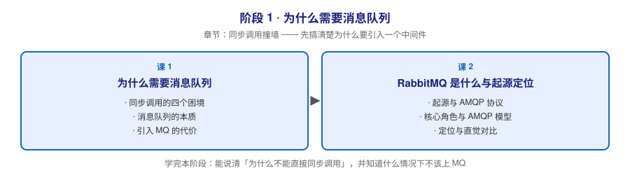

# 阶段 1：为什么需要消息队列

> 所属课程：RabbitMQ 系统学习 ｜ 故事章节：**同步调用撞墙** ｜ 下一阶段：[阶段 2](../2-核心模型与上手/overview.md)

## 🎯 本阶段目标

- 能说清服务之间直接同步调用会撞上哪四堵墙，以及消息队列分别用什么办法拆掉它们
- 能说清 RabbitMQ 的身世（AMQP 是怎么来的、为什么用 Erlang 写）和它在消息中间件里的定位
- 能判断「什么情况下不该引入消息队列」——这一条比会用更重要

## 📍 学习重点

- **同步调用的困境**：耦合、阻塞、峰值压垮、失败即丢失，这四件事是所有消息队列存在的理由
- **消息队列的本质**：异步化、解耦、削峰填谷、可靠投递——四个词背后各自对应什么机制
- **引入 MQ 的代价**：复杂度上升、一致性变难、延迟增加、多一个要运维的组件
- **AMQP 与 RabbitMQ 的起源**：协议先行、实现后至，这是 RabbitMQ 跨语言能力强的根源
- **定位与对比**：RabbitMQ 是「智能 broker + 哑消费者」，和 Kafka 的「哑 broker + 智能消费者」是两种世界观

## ✅ 必须掌握的知识点

| 知识点 | 所属课 | 学完应能 |
|--------|--------|----------|
| 同步调用的四个困境 | 课 1 | 举出同步调用在耦合/阻塞/峰值/丢失四个方面的具体失败场景 |
| 消息队列的本质 | 课 1 | 用一句话说清 MQ 做了哪四件事，各自解决哪个困境 |
| 引入 MQ 的代价 | 课 1 | 说出至少 3 条引入 MQ 后新增的成本，判断小系统是否值得上 |
| 起源与 AMQP 协议 | 课 2 | 说清 AMQP 为何诞生、RabbitMQ 诞生的年份与公司归属变迁 |
| 核心角色与 AMQP 模型 | 课 2 | 画出「生产者 → 交换机 → 队列 → 消费者」并解释连接与信道的关系 |
| 定位与直觉对比 | 课 2 | 说出 RabbitMQ 与 Kafka 在设计哲学上的核心差异及各自适用场景 |

## 🗺️ 本阶段路径图

## 本阶段产出

- [ ] `lessons/lesson-01-为什么需要消息队列.md`
- [ ] `lessons/lesson-02-RabbitMQ是什么与起源定位.md`
