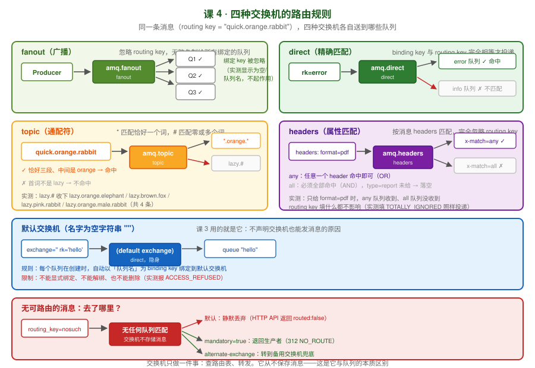

# 第 4 课：交换机与路由

> 所属阶段：阶段 2《核心模型与动手上手》｜ 水平：零基础 ｜ 本课知识点：交换机为什么存在、fanout 与 direct、topic 与 headers、默认交换机
> 故事情节：主角走到岔路口——一条消息要发给谁，由谁说了算？答案是交换机
> 版本口径：RabbitMQ 4.3.x（核查于 2026-08）｜ **本课所有路由行为与消息计数均在本机实测运行过**（RabbitMQ 4.3.5 + pika 1.4.4）

## 🎯 本课目标

- 解释「交换机不存消息」以及 binding / routing key 在路由中的作用
- 用代码演示 fanout 广播与 direct 精确匹配，说清多消费者时的轮询分发
- 用 `*` 与 `#` 写出 topic 匹配规则，说清默认交换机（空名字）的直连行为

> ✅ **本课是阶段 2 的核心。** 阶段概览里写着：「Exchange 与 Queue 分离」是 RabbitMQ 最核心的设计决策，也是它路由能力远超同类产品的原因。今天就把这层拆开。

---

## 第一幕：起源与场景引入

第 3 课我们跑通了最小闭环：Python 发一条消息进 `hello` 队列，另一个 Python 把它取出来。

但你可能没注意到，那节课有个地方**很奇怪**：

```python
channel.basic_publish(
    exchange='',        # ← 交换机是空的！
    routing_key='hello',
    body='Hello RabbitMQ!'
)
```

**交换机填了空字符串，消息照样到了队列。** 而你连一个交换机都没声明过。

我当时告诉你：「留空就是走默认交换机，下节课讲」。现在到了兑现的时候。

更真正的问题是这个：**第 1 课里那个"每加一个下游就要改一次核心代码"的困境，交换机能解决吗？**

回想一下第 1 课的场景：下单之后要扣库存、发短信、加积分。不用 MQ 时，核心代码里得挨个调用这三个服务，每加一个就改一次。

用了 MQ，如果只是「发到某个队列」，那也只是把"挨个调用"换成了"挨个发到不同队列"——**核心代码还是得知道有哪些下游**。

**真正解决这个问题的，是交换机。**

> 🎬 **场景**：消息已经能跑通了，但它只会走一条固定的路。今天要让它学会"分流"——一条消息进去，按规则流到多个目的地，而发送方完全不关心有谁在听。

---

## 第二幕：认知冲突

你开始动手实现一个需求：**订单创建后，要同时通知库存服务和通知服务**。

你很自然地写了两个队列，然后发了两条消息：

```python
channel.basic_publish(exchange='', routing_key='order_stock', body=order)
channel.basic_publish(exchange='', routing_key='order_notify', body=order)
```

跑通了。但几天后，产品说要加一个「积分服务」，还加一个「风控服务」。你得回来改这段代码，加两次 `basic_publish`。

**这不就是第 1 课那个困境的翻版吗？** 换了 MQ，核心代码照样要知道所有下游。

你隐约觉得哪里不对，于是去查文档，看到这样一句话：

> **交换机不存储消息。** 如果消息无法路由到任何队列，它会被丢弃。

这让你更困惑了：

1. 不存储消息？那它是什么，**一根管子**？
2. 消息**被丢弃**？！那我发出去的东西就这么没了，**连个报错都没有**？

你决定做个实验：把消息发到一个「没有任何队列绑定」的交换机上。

```python
channel.exchange_declare(exchange='t_noroute', exchange_type='fanout', durable=True)
channel.basic_publish(exchange='t_noroute', routing_key='whatever', body='我无人接收')
```

**程序正常返回，没有任何异常。** 消息就像掉进了黑洞。

用 HTTP API 再试一次，才看到一行冰冷的输出：

```json
{"routed":false}
```

> ❓ **问题**：为什么一个"转发消息"的组件要设计成不存储任何东西？**消息被静默丢弃这种危险行为，为什么是默认行为？** 以及——**交换机到底凭什么决定一条消息该去哪？**

---

## 第三幕：层层揭示

> 🧭 **本课三个知识点，一条主线**：交换机为什么这么设计 → 前两种怎么用 → 后两种 + 默认交换机。
>
> | 知识点 | 你会拿到的关键结论 |
> |--------|-------------------|
> | 1. 交换机为什么存在 | 交换机**只查路由表、只转发、不存储**；消息不可路由默认丢弃 |
> | 2. fanout 与 direct | 广播 vs 精确匹配；多消费者**轮询分发**（实测 3/3 拆分） |
> | 3. topic / headers / 默认交换机 | `*` 与 `#` 的规则；headers 忽略 routing key；默认交换机**不能显式绑定** |

### 知识点 1：交换机为什么存在

> 本知识点关键点：Exchange 与 Queue 分离的设计动机 / binding 与 routing key / 交换机不存储消息 / 无可路由消息的去向

#### 一句话定义

**交换机（Exchange）是消息的"路由分发器"**：它接收生产者发来的消息，查自己维护的绑定规则表，决定把消息投到哪些队列——**它自己一条消息都不存**。

#### 直觉建立（类比）

**把交换机想成邮局分拣中心的分拣台。**

分拣台上有个工人，面前贴着一张**规则表**：

| 目的地（binding key） | 投递到哪个格子（队列） |
|----------------------|----------------------|
| `error` | 告警格子 |
| `info` | 日志格子 |
| `*.orange.*` | 橙色彩格子 |

包裹（消息）送进来，工人**只看包裹上的地址标签（routing key）**，查表，然后扔进对应的格子。

**关键类比点**：

- 分拣工人**手上不留包裹**——查完表立刻扔出去。**这就是"交换机不存储消息"**。
- 如果地址标签不在规则表里，工人**直接把包裹扔进废纸篓**——**这就是"无可路由则丢弃"**。
- 分拣工人**不关心格子里堆了多少包裹、有没有人来取**。那是格子（队列）的事。

> 💡 **类比的边界**：真实分拣中心会有个"无法投递"暂存区慢慢处理；**RabbitMQ 默认没有**——直接丢，连日志都不打。这是它最反直觉的设计之一，下面会讲怎么补救。

#### 核心原理

**① Exchange 与 Queue 为什么分离（本课最重要的设计动机）**

回到第二幕的困境。如果生产者直接把消息发到队列，那它必须知道所有下游队列的名字——**加一个下游就改一次代码**。

交换机的引入，**在中间插了一层间接**：

```
没有交换机：  生产者 → 队列A、队列B、队列C      （生产者要知道所有队列）
有交换机：    生产者 → 交换机 → 队列A、B、C      （生产者只知道交换机）
```

**生产者只认识交换机，路由规则由绑定（binding）单独维护。** 加一个下游？加一条绑定就行，**生产者的代码一行都不用改**。

这就是第 1 课"解耦"诉求的真正落地方式。

> 🔑 **一句话总结这个设计**：**交换机让"谁发的"和"谁收的"彻底解耦。** 生产者不知道有几个消费者，消费者也不知道消息是谁发的。

**② binding 与 routing key（两个最容易混淆的概念）**

| 概念 | 是谁的属性 | 谁设置 | 类比 |
|------|-----------|--------|------|
| **routing key**（路由键） | **消息**的属性 | 生产者发消息时给 | 包裹上的**地址标签** |
| **binding key**（绑定键） | **绑定关系**的属性 | 绑定队列到交换机时给 | 规则表里的**匹配模式** |

**路由的本质就是：拿消息的 routing key，去和每条 binding 的 binding key 做匹配，匹配成功就投递。**

```python
# 建立绑定：队列 d_error 以 binding key "error" 绑到交换机 t_direct
channel.queue_bind(exchange='t_direct', queue='d_error', routing_key='error')

# 发消息：routing key "error" 与上表的 "error" 匹配 → 投进 d_error
channel.basic_publish(exchange='t_direct', routing_key='error', body='出错了')
```

> ⚠️ **术语提醒**：pika 里绑定用的是 `queue_bind(exchange=..., queue=..., routing_key=...)`——**参数名叫 routing_key，但它设定的是 binding key**。这是个容易绕晕的命名，记住"绑定时设的是规则，发送时给的是标签"。

**③ 交换机不存储消息（实测验证）**

这不是一句口号，我实测确认过：

```bash
docker exec rabbitmq-learn rabbitmqctl list_exchanges name messages
# Error (argument validation): Info key(s) messages are not supported
```

**`rabbitmqctl list_exchanges` 根本不支持 `messages` 这一列**——因为交换机压根没有"消息数"这个概念。对比一下队列：

```bash
docker exec rabbitmq-learn rabbitmqctl list_queues name messages
# name    messages     ← 队列有消息数
```

> 💡 **这是个很实用的判别技巧**：想知道某个东西存不存消息，看 `rabbitmqctl` 给不给你查 `messages`。

**④ 无可路由消息的去向（第二幕的谜底）**

实测：发到没有绑定任何队列的交换机，**程序正常返回，无异常，消息消失**。HTTP API 返回：

```json
{"routed":false}
```

**为什么默认是丢弃？** 因为对 AMQP 的设计者来说，**交换机是"尽力而为"的转发器**——它的职责是转发，不是保管。消息进不进得去队列是路由规则的事，交换机不为此负责。

**但"静默丢弃"在生产环境是危险的**，所以 RabbitMQ 提供了三个补救手段（**全部实测通过**）：

| 手段 | 做法 | 实测结果 |
|------|------|----------|
| **① 设置 `mandatory=True`** | 不可路由时把消息**退回**生产者 | 收到 `code=312 text=NO_ROUTE` |
| **② 备份交换机 AE** | 给交换机配 `alternate-exchange`，不可路由时转给它 | 消息确实落进了备用队列 |
| **③ 开启 firehose / trace** | 调试期追踪所有流经的消息 | 见下方提示 |

**手段 ①：mandatory 退回**

```python
def on_return(ch, method, properties, body):
    print(f"消息被退回: {body.decode()} | code={method.reply_code} {method.reply_text}")

channel.add_on_return_callback(on_return)
channel.basic_publish(exchange='t_nr2', routing_key='nobody',
                      body='无人接收的消息', mandatory=True)
# 输出：消息被退回: 无人接收的消息 | code=312 NO_ROUTE
```

> ⚠️ **实测踩到的细节**：pika 的 `BlockingChannel` 上，**`add_on_return_callback` 不会在 `basic_publish` 返回时立刻触发**——它要等下一次网络往返。我第一次测试时"什么都没发生"，补了一次同步交互（比如 `queue_declare`）或 `connection.sleep()` 后才收到退回。**这是 pika 独有的坑，其他语言客户端行为可能不同。**

**手段 ②：备份交换机（Alternate Exchange）**

```python
# 1. 先建一个 fanout 交换机 + 一个兜底队列
channel.exchange_declare(exchange='ae_fanout', exchange_type='fanout', durable=True)
channel.queue_declare(queue='unrouted_holder', durable=True)
channel.queue_bind(exchange='ae_fanout', queue='unrouted_holder')

# 2. 主交换机通过 arguments 指向它
channel.exchange_declare(exchange='t_ae', exchange_type='direct', durable=True,
                         arguments={'alternate-exchange': 'ae_fanout'})

# 3. 只绑定 orange，发 black 就会被 AE 兜住
channel.queue_bind(exchange='t_ae', queue='ae_orange', routing_key='orange')
channel.basic_publish(exchange='t_ae', routing_key='black', body='无人要的消息')
```

实测结果：

```bash
docker exec rabbitmq-learn rabbitmqctl list_queues name messages
# name              messages
# unrouted_holder   1        ← 被 AE 兜住了，没丢
# ae_orange         1        ← 正常消息
```

> 💡 **AE 是生产环境的推荐做法**：它比 `mandatory` 更可靠——**`mandatory` 依赖生产者在线并及时处理退回**，而 AE 把消息留在 broker 里，等你从容处理。课 7 讲死信队列时会再见到这个"兜底"思路。
>
> 🔬 **两者同时配置会怎样？（实测）**：给交换机同时配上 AE 和 `mandatory=True`，发一条不可路由的消息——结果是**消息进了 AE 的兜底队列，且 `mandatory` 没有触发退回**。也就是说 **AE 优先级更高**：消息能转发出去就不算"不可路由"，`mandatory` 自然不报警。**这个组合是安全的，兜底更可靠。**

**⑤ 交换机的属性**

声明交换机时可以设置：

| 参数 | 作用 |
|------|------|
| `exchange` | 名字 |
| `exchange_type` | `fanout` / `direct` / `topic` / `headers` |
| `durable` | 重启后是否还在（**建议 True**） |
| `auto_delete` | 最后一个绑定解绑后自动删除 |
| `internal` | 是否只允许交换机之间转发，不接受生产者直发 |
| `arguments` | 扩展参数，如 `alternate-exchange` |

> ⚠️ **和队列一样，交换机的属性也是创建后不可改的。**
>
> **但注意：删除交换机没有 `rabbitmqctl delete_exchange` 这条命令！**（我实测时撞到了这个报错，很多教程也写错了）：
>
> ```bash
> docker exec rabbitmq-learn rabbitmqctl delete_exchange t_direct
> # Command 'delete_exchange' not found.
> # Did you mean 'delete_queue'?
> ```
>
> `rabbitmqctl` 只有 `delete_queue` / `delete_user` / `delete_vhost`，**没有删除交换机的子命令**。实测可用的两种删法：
>
> ```bash
> # 方式 A：HTTP API（推荐，实测返回 204）
> curl -s -u learn:learn123 -X DELETE http://localhost:15672/api/exchanges/%2F/t_direct
>
> # 方式 B：rabbitmqadmin（注意是 --name 参数，不是 name= 形式）
> rabbitmqadmin delete exchange --name t_direct --non-interactive
> ```
>
> > 💡 第二种我实测时又踩了一次坑：写成 `delete exchange name=t_fanout` 会报 `unexpected argument`，**必须用 `--name` 选项形式**。`rabbitmqadmin` 2.x 的删除类子命令统一用选项传参。
>
> ```python
> channel.exchange_declare(exchange='rv_ex', exchange_type='direct', durable=True)
> channel.exchange_declare(exchange='rv_ex', exchange_type='fanout', durable=True)
> # (406, "PRECONDITION_FAILED - inequivalent arg 'type' for exchange 'rv_ex'
> #        in vhost '/': received 'fanout' but current is 'direct'")
> ```
>
> 注意报错里的 **406 `PRECONDITION_FAILED` + `inequivalent arg`** ——和课 3 队列那个坑是同一个错误家族，**记住这个模式**：声明时参数与现存不一致，就报这个错。

#### 示例演示：四种交换机总览

先看看 RabbitMQ 内置了哪些（**7 个，课 3 见过**）：

```bash
docker exec rabbitmq-learn rabbitmqctl list_exchanges name type
# name                type
#                     direct        ← 默认交换机（空名字）
# amq.direct          direct
# amq.fanout          fanout
# amq.headers         headers
# amq.match           headers       ← 也是 headers，历史别名
# amq.rabbitmq.log    topic
# amq.rabbitmq.trace  topic
# amq.topic           topic
```

**交换机类型全表**（本课的主线）：

| 类型 | 匹配规则 | 典型场景 |
|------|---------|---------|
| **fanout** | **忽略** routing key，广播给所有绑定队列 | 一条消息触发多个下游 |
| **direct** | binding key 与 routing key **完全相等** | 按级别/类别精确分发 |
| **topic** | 按 `.` 分词，用 `*` `#` **通配符**匹配 | 多维度的灵活订阅 |
| **headers** | 按消息 **headers 属性**匹配，忽略 routing key | 复杂的多条件路由（**很少用**） |

#### 常见误区

| ❌ 误区 | ✅ 正解 |
|--------|--------|
| 以为交换机像队列一样会暂存消息 | **交换机一条都不存**，`list_exchanges` 连 `messages` 列都不支持 |
| 以为 routing key 和 binding key 是同一个东西 | **routing key 是消息的属性**（生产者给），**binding key 是绑定的属性**（绑定时设） |
| 认为消息发不出去会报错 | **默认静默丢弃**，程序无异常；要兜底用 `mandatory` 或 AE |
| 以为加下游就得改生产者代码 | **加一条绑定即可**，这正是 Exchange/Queue 分离的价值 |
| 交换机属性配错了想改参数 | **创建后不可改**，需删除重建（注意**没有 `delete_exchange` 命令**，用 HTTP API 或 `rabbitmqadmin delete exchange --name`） |

#### 一句话记住

**交换机只查路由表、只转发、不存消息；routing key 是消息的地址标签，binding key 是绑定的匹配规则；匹配不上默认丢弃，用 mandatory 或 AE 兜底。**

#### 📚 官方文档

- 交换机与路由：[Exchanges and Exchange Types](https://www.rabbitmq.com/tutorials/amqp-concepts#exchanges)
- 备份交换机：[Alternate Exchanges](https://www.rabbitmq.com/docs/ae)
- `mandatory` 与不可路由消息：[Publisher confirms and mandatory](https://www.rabbitmq.com/docs/publishers#unroutable)

---

### 知识点 2：fanout 与 direct

> 本知识点关键点：广播语义 / 精确匹配 / 多消费者轮询分发 / 多绑定同一 routing key

#### 一句话定义

**fanout 是"广播"**——忽略 routing key，把消息复制给所有绑定的队列；**direct 是"精确匹配"**——只有 binding key 与 routing key 完全相等才投递。

#### 直觉建立（类比）

**fanout = 公司全员邮件。** 你发一封，所有订阅了这个邮件组的人都收到。你**不能**指定"只发给张三"——要么全发，要么不发。

**direct = 快递柜按手机号投递。** 包裹上写着手机号（routing key），柜子格口也标着手机号（binding key），**必须完全一致**才能塞进去。

> 💡 **类比的边界**：全员邮件里，收件人能看到彼此；**fanout 的队列之间完全不知道对方存在**。这是好事——一个队列挂掉不影响其他队列收消息。

#### 核心原理

**① fanout：广播**

```python
channel.exchange_declare(exchange='t_fanout', exchange_type='fanout', durable=True)

# 三个队列都绑定上去，注意 fanout 的 binding key 会被忽略
for q in ['f_q1', 'f_q2', 'f_q3']:
    channel.queue_declare(queue=q, durable=True)
    channel.queue_bind(exchange='t_fanout', queue=q)

# 故意用个奇怪的 routing key
channel.basic_publish(exchange='t_fanout', routing_key='IGNORED_BY_FANOUT', body='广播消息')
```

实测结果：

```bash
docker exec rabbitmq-learn rabbitmqctl list_queues name messages
# name    messages
# f_q3    1
# f_q1    1
# f_q2    1          ← 三个队列各收到一份
```

**routing key 填了 `'IGNORED_BY_FANOUT'`，三个队列照样都收到了一份。** 这就是"忽略 routing key"。

再看看绑定表里长什么样（实测）：

```bash
docker exec rabbitmq-learn rabbitmqctl list_bindings source_name destination_name routing_key
# source_name    destination_name    routing_key
# t_fanout       f_q3                f_q3
# t_fanout       f_q2                f_q2
# t_fanout       f_q1                f_q1
```

> 💡 **注意这里的 routing_key 列**：pika 的 `queue_bind` 不传 `routing_key` 时，**它默认填的是队列名**——所以你看 `f_q1` 的绑定 key 是 `f_q1`。**但 fanout 根本不看这一列**，填什么都不影响。这个"默认值"在其他交换机类型上会有实际意义（见下）。

**② direct：精确匹配**

```python
channel.exchange_declare(exchange='t_direct', exchange_type='direct', durable=True)

channel.queue_declare(queue='d_error', durable=True)
channel.queue_bind(exchange='t_direct', queue='d_error', routing_key='error')

# 同一个队列可以绑定多个 binding key
channel.queue_declare(queue='d_all', durable=True)
for k in ['error', 'info', 'warning']:
    channel.queue_bind(exchange='t_direct', queue='d_all', routing_key=k)

# 发三条
for rk in ['error', 'info', 'debug']:
    channel.basic_publish(exchange='t_direct', routing_key=rk, body=f'消息-{rk}')
```

实测结果：

```bash
docker exec rabbitmq-learn rabbitmqctl list_queues name messages
# name        messages
# d_error     1        ← 只有 error
# d_all       2        ← error + info
# （debug 无人接收，被丢弃）
```

**逐条分析**：

| routing key | d_error（绑 error） | d_all（绑 error/info/warning） |
|-------------|-------------------|------------------------------|
| `error` | ✅ 命中 | ✅ 命中 |
| `info` | ❌ | ✅ 命中 |
| `debug` | ❌ | ❌ **被丢弃** |

> 💡 **direct 的一个队列绑多个 key，是最常见的用法**——比如日志系统里"告警队列只收 error，归档队列全收"。**这比建多个交换机划算得多。**

**③ 多消费者轮询分发（Round-Robin）**

这是本课第二个核心概念，也是**最容易产生误解**的地方。

**场景**：一个队列里有 6 条消息，两个消费者同时消费。**每条消息只会被其中一个消费者拿到**，RabbitMQ 在消费者之间轮流分发。

**实测（先启动两个消费者，再发 6 条）**：

```
[C1] 已就绪，等待消息          [C2] 已就绪，等待消息
[C1] 收到: 任务1               [C2] 收到: 任务0
[C1] 收到: 任务3               [C2] 收到: 任务2
[C1] 收到: 任务5               [C2] 收到: 任务4
[C1] 共收到 3 条               [C2] 共收到 3 条
```

**完美的 3/3 均分。**

> 🔑 **关键结论**：**一条消息只会被投递给一个消费者**。这是**队列**层面的行为，与交换机类型无关。哪怕是 fanout 广播到 3 个队列，**每个队列内部的消息仍然只被它的某一个消费者拿走**。
>
> 这就是「**竞争消费者模式**」（Competing Consumers）——多个消费者抢同一个队列，天然实现负载均衡。

**⚠️ 但是——我第一次测试时翻车了**

我最早写的测试是「**先发 6 条消息，再启动 2 个消费者**」，结果：

```
[C2] 收到: 任务0
[C2] 收到: 任务1
[C2] 收到: 任务2
[C2] 收到: 任务3
[C2] 收到: 任务4
[C2] 收到: 任务5
[C1] 共收到 0 条     ← 一条都没拿到！
[C2] 共收到 6 条     ← 全被 C2 抢走了
```

**为什么？** 因为 C2 先启动，此时队列里已经堆了 6 条消息，**C2 一口气把它们全取走了**，等 C1 启动时队列已经空了。

根因是 **prefetch（预取）默认值无上限**。实测确认：

```bash
docker exec rabbitmq-learn rabbitmqctl environment | grep prefetch
#       {default_consumer_prefetch,{false,0}},
```

`{false, 0}` 表示**未启用限制**——消费者会尽可能多地把消息抓到本地缓冲区。

**解法是设置 `basic_qos(prefetch_count=N)`**，这是课 6 的主角，这里先给你看效果（实测 `prefetch_count=1`）：

```python
channel.basic_qos(prefetch_count=1)   # 一次只拿一条，处理完再拿下一条
channel.basic_consume(queue='rr3', on_message_callback=cb, auto_ack=True)
```

实测结果（同样是 3/3 均分，但这一次**即使消费者启动有先后也更公平**）：

```
[C1] 收到: 任务0     [C2] 收到: 任务1
[C1] 收到: 任务2     [C2] 收到: 任务3
[C1] 收到: 任务4     [C2] 收到: 任务5
```

> 💡 **本课先记住结论**：**轮询分发是队列的行为，prefetch 决定它均不均匀。** 完整的解释（为什么 prefetch 会影响公平性、该设多少）在**课 6《确认机制与预取》**。

#### 示例演示：用 fanout 解决第二幕的困境

回到开头的难题：**订单创建后要同时通知库存、通知、积分、风控，而且不能每加一个就改代码。**

用 fanout，生产者只需要**一行**：

```python
# 生产者：只认识交换机，完全不知道有几个下游
channel.exchange_declare(exchange='order_created', exchange_type='fanout', durable=True)
channel.basic_publish(exchange='order_created', routing_key='', body=order_json)
```

下游各自声明自己的队列并绑定（**这段代码在各下游服务里，不在核心代码里**）：

```python
# 库存服务
channel.queue_declare(queue='stock_service', durable=True)
channel.queue_bind(exchange='order_created', queue='stock_service')

# 后面新加的积分服务 / 风控服务，写法完全一样，核心代码零改动
channel.queue_declare(queue='points_service', durable=True)
channel.queue_bind(exchange='order_created', queue='points_service')
```

**这就是第 1 课那个困境的答案。** 加一个下游 = 加一段"声明队列 + 绑定"的代码在**它自己的服务里**，核心下单代码一行都不用动。

#### 常见误区

| ❌ 误区 | ✅ 正解 |
|--------|--------|
| 以为 fanout 会看 routing key | **fanout 完全忽略 routing key**，绑定时不传 key 也照样广播 |
| 以为一条消息会被多个消费者都收到 | **一条消息只给一个消费者**；想让多个服务都收到，用 fanout 复制到**多个队列** |
| 队列里堆好消息再启多个消费者，期待均分 | **prefetch 默认无上限**，先启的会抢空；要均分得先启消费者或设 `prefetch_count` |
| 以为 `queue_bind` 的 `routing_key` 参数总是有意义 | **fanout 忽略它**；direct/topic 才看它。pika 默认填队列名 |
| 以为 direct 一个队列只能绑一个 key | **可以绑多个**，这是日志分级的标准做法 |
| 路由没匹配上，以为消息在交换机里等着 | **交换机不存消息，直接丢弃**（用 mandatory 或 AE 补救） |

#### 一句话记住

**fanout 复制给所有队列、direct 精确匹配 key；一条消息只会被一个消费者拿走，均不均匀看 prefetch。**

#### 📚 官方文档

- fanout：https://www.rabbitmq.com/tutorials/tutorial-three-python
- direct：https://www.rabbitmq.com/tutorials/tutorial-four-python
- 消费者预取：https://www.rabbitmq.com/docs/consumer-prefetch

---

### 知识点 3：topic 与 headers、默认交换机

> 本知识点关键点：`*` 匹配一个词 / `#` 匹配零或多个词 / headers 的 x-match / 默认交换机按队列名直连

#### 一句话定义

**topic 用通配符按"词"匹配** routing key（`*` 恰好一个词，`#` 零或多个词）；**headers 匹配消息的属性而非 routing key**；**默认交换机**是预置的、名字为空字符串的 direct 交换机，**每个队列都自动以队列名绑定到它**。

#### 直觉建立（类比）

**topic = 按"多级标签"订阅新闻。**

假设新闻的标签是 `地区.类型.紧急度`，比如 `china.sports.urgent`。

- `*.sports.*` = "**任何地区**的体育新闻，**任何紧急度**"——`*` 占一个位置
- `china.#` = "中国的**任何**新闻"——`#` 吃掉后面所有层级

**headers = 按包裹属性筛选，不看地址。**

不看收件地址，而是看包裹上贴的属性标签："fragile=易碎"、"weight=heavy"。规则写成"易碎 **且** 重"（all）或"易碎 **或** 重"（any）。

**默认交换机 = 邮局的"按门牌号直投"。**

不用建规则表——**每个信箱（队列）自动以自己的门牌号（队列名）登记在案**，包裹上写哪个门牌号就进哪个信箱。

#### 核心原理

**① topic：通配符匹配**

**规则（分两层看）**：

1. routing key 按 `.` 分成若干**词（word）**，如 `quick.orange.rabbit` 是 3 个词
2. binding key 也按 `.` 分词，其中两个通配符有特殊含义：

| 通配符 | 含义 | 示例 |
|--------|------|------|
| `*` | 匹配**恰好一个**词 | `*.orange.*` 匹配 3 个词且中间是 orange |
| `#` | 匹配**零个或多个**词 | `lazy.#` 匹配以 lazy 开头的任意层数 |

**实测验证**（绑定 `*.orange.*` 和 `lazy.#`，发 8 条消息）：

```python
channel.queue_bind(exchange='t_topic', queue='t_star', routing_key='*.orange.*')
channel.queue_bind(exchange='t_topic', queue='t_hash', routing_key='lazy.#')

tests = ['quick.orange.rabbit', 'lazy.orange.elephant', 'quick.orange.fox',
         'lazy.brown.fox', 'lazy.pink.rabbit', 'quick.brown.fox',
         'orange', 'lazy.orange.male.rabbit']
for rk in tests:
    channel.basic_publish(exchange='t_topic', routing_key=rk, body=rk)
```

实测结果：

```bash
docker exec rabbitmq-learn rabbitmqctl list_queues name messages
# name        messages
# t_hash      4      ← lazy.# 收到 4 条
# t_star      3      ← *.orange.* 收到 3 条
```

**逐条拆解（这是理解 topic 最关键的一张表）**：

| routing key | 词数 | `*.orange.*` | `lazy.#` | 说明 |
|-------------|------|--------------|----------|------|
| `quick.orange.rabbit` | 3 | ✅ | ❌ | 三词、中间 orange |
| `lazy.orange.elephant` | 3 | ✅ | ✅ | **两个都命中！** 单词数够 + lazy 开头 |
| `quick.orange.fox` | 3 | ✅ | ❌ | 三词、中间 orange |
| `lazy.brown.fox` | 3 | ❌ | ✅ | lazy 开头即可 |
| `lazy.pink.rabbit` | 3 | ❌ | ✅ | lazy 开头即可 |
| `quick.brown.fox` | 3 | ❌ | ❌ | **无匹配 → 被丢弃** |
| `orange` | 1 | ❌ | ❌ | **只有一个词，`*` 需要恰好一个但这里缺两段** |
| `lazy.orange.male.rabbit` | 4 | ❌ | ✅ | **`#` 可以吃多个词，这是它和 `*` 的核心区别** |

> 🔑 **四个必记结论**（全部实测确认）：
> 1. **`lazy.orange.elephant` 同时命中两个队列**——一条消息可以进多个队列，这是 topic 的价值所在
> 2. **`#` 能吃多个词**（`lazy.orange.male.rabbit` 4 个词照样命中），`*` 只能吃一个
> 3. **单词数不够就不匹配**（`orange` 只有一个词，两个绑定都落空）
> 4. **`#` 还能匹配"零个词"**：实测单独发一个 `lazy`（后面没有任何词），`lazy.#` **照样命中**

> 💡 **实用技巧**：`binding key = '#'` 表示"匹配所有消息"，**效果等同于 fanout**。实测用 `#` 绑定两个队列，发送 `anything.at.all`（多词）和 `singleword`（单词），**两个队列各收到 2 条**。区别在于 topic 更灵活，将来可以加更精确的绑定。

**② headers：按属性匹配（很少用）**

headers 交换机**完全忽略 routing key**，只看消息的 `headers` 属性。

```python
channel.exchange_declare(exchange='t_headers', exchange_type='headers', durable=True)

# x-match=all：所有 header 都必须匹配（AND）
channel.queue_bind(exchange='t_headers', queue='h_all',
                   arguments={'x-match': 'all', 'format': 'pdf', 'type': 'report'})

# x-match=any：任意一个 header 匹配即可（OR）
channel.queue_bind(exchange='t_headers', queue='h_any',
                   arguments={'x-match': 'any', 'format': 'pdf', 'type': 'report'})
```

**`x-match` 的取值**：

| x-match | 语义 | 类比 |
|---------|------|------|
| `all` | 所有键值对都匹配（**AND**） | 且 |
| `any` | 任意一个键值对匹配（**OR**） | 或 |
| （不写） | **默认是 `all`** | ⚠️ 容易踩坑 |

**实测结果**（发三条不同 headers 的消息）：

| 发送的 headers | `h_all`(all) | `h_any`(any) |
|----------------|--------------|--------------|
| `format=pdf, type=report` | ✅ | ✅ |
| `format=pdf, type=log` | ❌ | ✅（format 命中） |
| `format=txt, type=log` | ❌ | ❌ **被丢弃** |

```bash
docker exec rabbitmq-learn rabbitmqctl list_queues name messages
# name    messages
# h_any   2
# h_all   1
```

**再验证一次"忽略 routing key"**（实测）：带上 `routing_key='TOTALLY_IGNORED'` 再发一条 `format=pdf, type=report`，`h_all` 和 `h_any` **都增加了一条**——说明 routing key 填什么都无所谓。

> ⚠️ **为什么官方说"很少用"**：headers 的性能不如 direct/topic（要逐条比对属性），而且 **routing key 的方案通常更直观、更好调试**。官方文档的原话是 headers 交换机"**在实际中很少使用**"。**本课你只需要知道它存在、知道 x-match 的语义即可，真正要用时再回来查。**

**③ 默认交换机（Default Exchange）——课 3 谜底揭晓**

回到第一幕那个问题：`exchange=''` 为什么能工作？

**默认交换机**是一个预置的、名字为**空字符串**的 **direct** 交换机。它有两条特殊规则：

**规则 1：每个队列在创建时，自动以"队列名"为 binding key 绑定到默认交换机**

实测（声明队列 `defq` 后立刻查绑定）：

```bash
docker exec rabbitmq-learn rabbitmqctl list_bindings source_name destination_name routing_key
# source_name    destination_name    routing_key
#                defq               defq
#                ↑ 空 = 默认交换机     ↑ binding key = 队列名
```

**你声明队列的那一刻，绑定就自动建好了。** 所以 `exchange='' + routing_key='hello'` 能直达 `hello` 队列——因为存在一条 `<empty> → hello (key: hello)` 的绑定。

**规则 2：默认交换机不能被显式绑定、解绑或删除**

实测：

```python
channel.queue_bind(exchange='', queue='defq2', routing_key='custom_key')
# (403, 'ACCESS_REFUSED - operation not permitted on the default exchange')
```

**绑定关系是系统自动维护的，你动不了。**

**默认交换机的定位**：

| 特性 | 说明 |
|------|------|
| 名字 | 空字符串 `''`（UI 里显示为**空白行**） |
| 类型 | **direct** |
| 绑定 | 自动，key = 队列名，不可手动改 |
| 能否删除 | ❌ 不能 |
| 适用场景 | **简单的点对点投递**，即"发到某个指定队列" |

> 💡 **什么时候该用默认交换机，什么时候该自己建？**
> - **就用默认交换机**：一对一、队列名固定、不需要灵活路由（比如课 3 的 Hello World、以及任务队列）
> - **自己建交换机**：需要广播、需要按 key 分发、需要多个下游——**也就是绝大多数真实业务场景**

**④ 四种交换机对比总表**

| 类型 | 匹配依据 | 看 routing key？ | 典型场景 | 使用频率 |
|------|---------|-----------------|---------|---------|
| **默认** | 队列名精确相等 | ✅（= 队列名） | 简单点对点 | 高 |
| **fanout** | 不看，广播 | ❌ | 一条消息触发多个下游 | 高 |
| **direct** | key 完全相等 | ✅ | 按类别/级别分发 | **最高** |
| **topic** | 按词通配符 | ✅ | 多维度灵活订阅 | 高 |
| **headers** | 消息 headers 属性 | ❌ | 复杂多条件路由 | **低** |

#### 示例演示：四种交换机在同一张图里



**图里的关键看点**（全部来自实测）：

- **fanout**：一条消息复制进 3 个队列，routing key 被忽略
- **direct**：`error` 只进 error 队列，info 队列落空
- **topic**：`quick.orange.rabbit` 命中 `*.orange.*`，但不命中 `lazy.#`
- **headers**：只给 `format=pdf` 时，`any` 收、`all` 不收
- **默认交换机**：自动绑定，且**不能显式绑定**（ACCESS_REFUSED）
- **无可路由**：默认丢弃，可选 `mandatory` 退回或 AE 兜底

#### 常见误区

| ❌ 误区 | ✅ 正解 |
|--------|--------|
| 以为 `*` 能匹配多个词 | **`*` 恰好一个词**，多个词要用 `#` |
| 以为 `#` 至少要匹配一个词 | **`#` 可以匹配零个词**，`lazy.#` 能匹配裸的 `lazy` |
| 以为 topic 里一条消息只进一个队列 | **可以进多个**（实测 `lazy.orange.elephant` 进了两个队列） |
| headers 绑定不写 `x-match` | **默认是 `all`**，不写可能一条都收不到 |
| 用 headers 做主要路由 | **官方不推荐**，性能与可读性都不如 topic |
| 想手动绑定默认交换机 | **不允许**，报 `ACCESS_REFUSED`；它自动按队列名绑定 |
| 认为默认交换机只能用于 Hello World | **点对点任务队列用它完全合理**，别为了"规范"过度设计 |
| topic 的 `#` 和 shell 通配符搞混 | AMQP 的 `*` `#` **只在按 `.` 分词的边界上生效**，不是子串匹配 |

#### 一句话记住

**topic 用 `*` 一词、`#` 多词按点分词匹配，headers 看属性不看 key（默认 x-match=all），默认交换机自动按队列名直连、不可手动绑定。**

#### 📚 官方文档

- topic：https://www.rabbitmq.com/tutorials/tutorial-five-python
- 交换机类型完整说明：https://www.rabbitmq.com/tutorials/amqp-concepts#exchange-topic
- headers 交换机：https://www.rabbitmq.com/tutorials/amqp-concepts#exchange-headers
- 默认交换机：https://www.rabbitmq.com/tutorials/amqp-concepts#exchange-default

---

## 第五幕：体系收束

### 本课在全局中的位置

第 1 课提出的问题，到今天才算真正被回答：

| 第 1 课的困境 | 交换机给出的答案 |
|--------------|-----------------|
| 每加一个下游就要改一次核心代码 | **fanout 广播**：新增下游只需在它自己服务里加一条绑定，**核心代码零改动** |
| 同步调用导致任一环节故障就全链路失败 | 消息先进队列，**下游挂了不影响生产者** |
| 流量高峰把服务打垮 | 队列削峰（**消费者按能力消费，课 6 讲 prefetch**） |

**而"交换机不存消息"这个看似缺陷的设计，恰恰是它高吞吐的原因**——只查表转发，不做任何持久化动作。消息的"保管"职责全部交给队列。

### 完整的数据流已经闭环

```
生产者                     交换机                        队列              消费者
  │                          │                            │                 │
  │  basic_publish           │                            │                 │
  │  exchange='order'        │                            │                 │
  │  routing_key='x'         │                            │                 │
  ├─────────────────────────>│                            │                 │
  │                          │  查绑定表（binding）        │                 │
  │                          │  拿 rk 匹配 binding key    │                 │
  │                          ├───────────────────────────>│  消息在此停留    │
  │                          │  可复制到多个队列           │                 │
  │                          │                            ├────────────────>│ 推送
  │                          │                            │  一条只给一个    │ 消费者
  │                          │  ❗ 不匹配 = 丢弃           │                 │
```

**三个角色的职责边界**（这与课 2 的 AMQP 模型完全对应）：

| 角色 | 存消息？ | 核心职责 |
|------|---------|---------|
| **交换机** | ❌ **不存** | 查路由表、转发 |
| **队列** | ✅ 存 | 保管消息，直到被消费 |
| **绑定** | — | 定义匹配规则（路由表本身） |

### 你现在会了什么

- ✅ 说清「交换机不存消息」以及为什么这是好设计
- ✅ 用 fanout 做广播、用 direct 做精确匹配，并解释多消费者轮询分发
- ✅ 用 `*` / `#` 写出 topic 匹配规则，知道 headers 的 `x-match` 语义
- ✅ 解释默认交换机为什么能让 `exchange=''` 工作，以及它的限制
- ✅ 知道消息不可路由时的三种补救：`mandatory` / AE / trace

### 接下来学什么，以及为什么

今天我们一直把**队列当成一个黑盒子**——消息进去、消息出来，中间发生了什么没深究。

但回想课 3 踩过的那个坑：为什么 4.3 默认禁止"非持久化"队列？我当时说"**消息是否持久化由 `delivery_mode` 决定，这是课 5 的内容**"。

**这个伏笔马上要兑现了。** 队列还有一堆属性需要搞清楚：

- `durable` 到底保证什么？**保证队列在重启后还在，但不保证消息不丢**
- 消息要真正不丢，还得设 `delivery_mode=2`——**这是第二层开关**
- `exclusive`（排他）和 `auto_delete`（自动删除）分别什么语义？
- 还有 **classic / quorum / stream 三种队列类型**——它们的差别比属性更大，**选错了会直接影响数据安全**

> 🚀 **埋个伏笔**：课 3 你声明的 `hello` 队列，类型是 `classic`（`list_queues` 里 `type` 那一列）。**但 4.x 里 classic 队列已经不再支持复制了**——想要高可用就得用 quorum 队列，而 quorum 有一些重要限制（比如不支持某些特性）。这个选型决策，就在课 5。

---

## 🐞 本课踩坑清单

| # | 坑 | 现象 | 解法 |
|---|-----|------|------|
| 1 | 消息不可路由被静默丢弃 | 程序无异常，消息消失 | 用 `mandatory=True` 或 `alternate-exchange` 兜底 |
| 2 | pika 的 return 回调不立即触发 | `mandatory=True` 却收不到退回 | 需等下一次网络往返：`connection.sleep()` 或补一次同步调用 |
| 3 | 先发消息再启消费者，负载不均 | 先启的消费者抢走全部 6 条 | 设 `basic_qos(prefetch_count=N)`，或先启消费者 |
| 4 | headers 不写 `x-match` | 一条消息都收不到 | **默认是 `all`**，明确写出 `x-match` |
| 5 | 手动绑定默认交换机 | `ACCESS_REFUSED - operation not permitted` | **不允许**，默认交换机自动按队列名绑定 |
| 6 | 交换机属性创建后不可改 | 报 `PRECONDITION_FAILED - inequivalent arg` | 删除重建（**无 `delete_exchange` 命令**，用 HTTP API 或 `rabbitmqadmin delete exchange --name`） |

---

## 📋 命令与规则速查卡

```bash
# ===== 交换机 =====
rabbitmqctl list_exchanges name type
rabbitmqctl list_bindings source_name destination_name routing_key

# ⚠️ 删除交换机：没有 rabbitmqctl delete_exchange 这条命令！用下面两种：
#   方式 A（HTTP API，返回 204）
curl -s -u learn:learn123 -X DELETE http://localhost:15672/api/exchanges/%2F/<name>
#   方式 B（rabbitmqadmin，注意是 --name 选项，写 name=xxx 会报 unexpected argument）
rabbitmqadmin delete exchange --name <name> --non-interactive

# ===== 查路由是否命中（HTTP API，最实用！）=====
curl -s -u learn:learn123 -H "Content-Type: application/json" \
  -X POST http://localhost:15672/api/exchanges/%2F/<exchange>/publish \
  -d '{"properties":{},"routing_key":"<rk>","payload":"test","payload_encoding":"string"}'
# {"routed":true}  = 有队列命中
# {"routed":false} = 无队列命中，消息被丢弃！
```

**路由规则速查**：

| 类型 | 规则 | routing key 示例 | binding key 示例 |
|------|------|-----------------|-----------------|
| fanout | 忽略 key，广播 | 任意 | 任意（可省略） |
| direct | 完全相等 | `error` | `error` |
| topic | 按 `.` 分词通配 | `quick.orange.rabbit` | `*.orange.*` / `lazy.#` |
| headers | 匹配 headers 属性 | 忽略 | `x-match` + 键值对 |
| 默认 | 队列名相等 | `hello` | 自动 = 队列名 |

**topic 通配符**：

| 符号 | 匹配 | 示例 |
|------|------|------|
| `*` | 恰好 **1** 个词 | `*.orange.*` ← 3 词且中间是 orange |
| `#` | **0 或多个**词 | `lazy.#` ← 以 lazy 开头的任意层数 |

---

## 课后小测

**Q1**：你用 fanout 交换机发了一条消息，routing key 填 `'error'`，但绑定的 binding key 是 `'info'`。消息会怎样？

- A. 不会投递，因为 key 不匹配
- B. 会投递到绑定了 `'info'` 的队列，因为 fanout 忽略 routing key
- C. 会被丢弃
- D. 会报路由错误

<details><summary>答案与解析</summary>

**答案：B**。**fanout 交换机完全忽略 routing key**——实测我故意用 `routing_key='IGNORED_BY_FANOUT'` 发送，三个绑定的队列照样各收到一份。

fanout 的语义是"复制给所有绑定的队列"，binding key 那一列它根本不看。A/C/D 都是把 direct 的规则套到了 fanout 上。
</details>

**Q2**：绑定 `lazy.#`，以下哪些 routing key 会命中？（多选）

- A. `lazy`
- B. `lazy.orange`
- C. `lazy.orange.male.rabbit`
- D. `quick.lazy.rabbit`

<details><summary>答案与解析</summary>

**答案：A、B、C**。

`#` 匹配**零个或多个词**。A 是零个（只有 `lazy` 本身），B 是一个，C 是三个——**都命中**。

D 不命中：`lazy` 不是首词，`lazy.#` 要求以 `lazy` 开头。实测 8 条消息里，`lazy.#` 收下了 `lazy.orange.elephant`、`lazy.brown.fox`、`lazy.pink.rabbit`、`lazy.orange.male.rabbit` 共 4 条。

**这正是 `#` 与 `*`（恰好一个词）的核心区别。**
</details>

**Q3**：你给 headers 交换机绑定队列时写了 `arguments={'format':'pdf','type':'report'}`，**没有写 `x-match`**。发送 headers 为 `{'format':'pdf','type':'log'}` 的消息，结果如何？

- A. 收到，因为 format 命中了
- B. 收不到，因为 `x-match` 默认是 `all`，要求全部命中
- C. 报错，因为必须写 x-match
- D. 随机，取决于版本

<details><summary>答案与解析</summary>

**答案：B**。**`x-match` 不写时默认是 `all`**（AND），要求所有键值都匹配。`type` 期望 `report` 但实际是 `log`，所以不命中。

实测对照：同样这条消息，`x-match=any` 的队列**收到了**（format 命中即可），`x-match=all` 的队列**没收到**。这也是本课踩坑清单第 4 条。
</details>

**Q4**：关于默认交换机，以下说法正确的是？

- A. 它是一个名字为空字符串的 fanout 交换机
- B. 每个队列创建时自动以队列名为 binding key 绑定到它
- C. 你可以手动把队列绑定到它并自定义 binding key
- D. 它不能用于生产环境

<details><summary>答案与解析</summary>

**答案：B**。

A 错——默认交换机是 **direct** 类型，不是 fanout。

B 对——实测 `list_bindings` 显示 `<空> → defq (key: defq)`，声明队列时绑定就自动建好了。这正是课 3 `exchange='' + routing_key='hello'` 能工作的原因。

C 错——实测手动绑定报 `(403, 'ACCESS_REFUSED - operation not permitted on the default exchange')`，**默认交换机不允许显式绑定、解绑或删除**。

D 错——点对点任务队列用默认交换机完全合理，只是不适合需要广播/灵活路由的场景。
</details>

**Q5**（进阶）：给交换机**同时**配置了 `alternate-exchange` 和 `mandatory=True`，发一条不可路由的消息。会发生什么？

- A. 消息被丢弃，两个机制都不生效
- B. 消息转到 AE 的兜底队列，`mandatory` 不触发退回
- C. 消息被退回给生产者，AE 不生效
- D. 消息同时进 AE 队列并被退回（两份）

<details><summary>答案与解析</summary>

**答案：B**。实测结果：消息落进了 AE 的兜底队列，**且没有触发 `mandatory` 退回**。

原因是**优先级**——只要消息能被 AE 转发出去，它就不再算"不可路由"，`mandatory` 自然不会报警。

这个组合其实是**生产环境推荐的稳妥做法**：AE 保证消息不丢，mandatory 作为 AE 也失效时的最后一道保险（比如 AE 本身也没绑定队列）。D 是常见误解——**AMQP 不会把同一条消息既投递又退回**。
</details>

**Q6**：生产者用 `mandatory=True` 发了一条不可路由的消息，但**没有收到任何退回通知**。最可能的原因是？

- A. `mandatory` 参数在 4.x 已被移除
- B. pika 的 BlockingChannel 需要下一次网络往返才会触发 return 回调
- C. 消息实际上成功投递了
- D. 需要先开启 AE

<details><summary>答案与解析</summary>

**答案：B**。这是我在备课实测中真实踩到的坑：`basic_publish` 正常返回、没有异常，但 `on_return` 回调**没有立刻触发**。补了一次同步交互（如 `queue_declare`）或 `connection.sleep()` 之后，才收到 `code=312 NO_ROUTE` 的退回。

A 错——`mandatory` 在 4.3 完全有效。C 错——HTTP API 验证过是 `{"routed":false}`，确实没投递。D 错——AE 是另一种独立的补救机制，不开启 AE 时 `mandatory` 照样工作。
</details>

---

## 📚 官方文档

- RabbitMQ 官方文档（当前 4.3.5）：https://www.rabbitmq.com/docs/
- AMQP 概念（含交换机详解）：https://www.rabbitmq.com/tutorials/amqp-concepts
- 教程 3 fanout：https://www.rabbitmq.com/tutorials/tutorial-three-python
- 教程 4 direct：https://www.rabbitmq.com/tutorials/tutorial-four-python
- 教程 5 topic：https://www.rabbitmq.com/tutorials/tutorial-five-python
- 备份交换机 AE：https://www.rabbitmq.com/docs/ae
- 消费者预取：https://www.rabbitmq.com/docs/consumer-prefetch

---

## 🚀 下一批接力提示词

> 学完本课后，**复制下面这段文字发给 AI**，即可无缝进入下一课（无需重新描述上下文）：

```
继续学 RabbitMQ。我的学习档案在 rabbitmq/00-学习档案.md，
刚学完阶段 2《核心模型与上手》的课 4《交换机与路由》知识点 交换机为什么存在、fanout 与 direct、topic 与 headers、默认交换机，
请按大纲继续讲解下一课 课 5《队列与消息的属性》的知识点。
```

## 🧭 课程导航

⬅️ **上一课**：[课 3 · 起 RabbitMQ 与发第一条消息](lesson-03-起RabbitMQ与发第一条消息.md)

➡️ **下一课**：[课 5 · 队列与消息的属性](lesson-05-队列与消息的属性.md)

🎯 **返回目录**：[课程目录](../../02-课程目录.md)