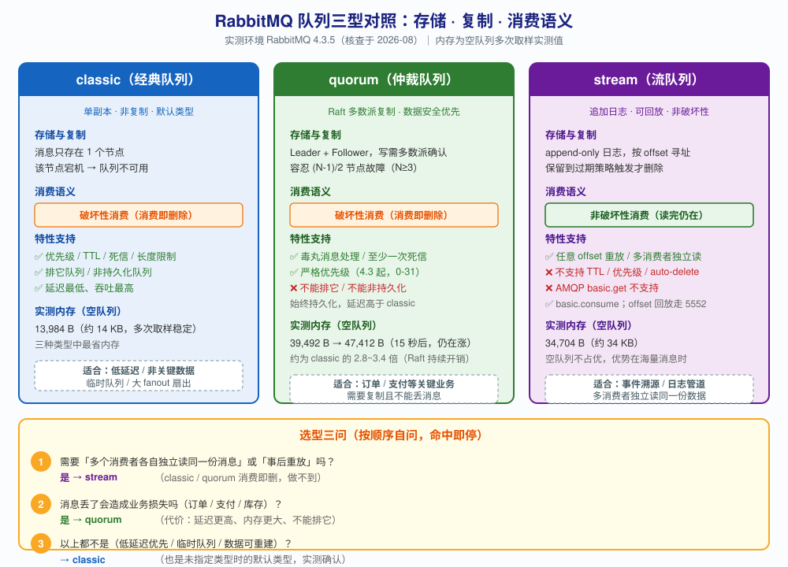

# 第 5 课：队列与消息的属性

> 所属阶段：阶段 2《核心模型与动手上手》｜ 水平：零基础 ｜ 本课知识点：队列的属性、消息的属性、队列类型三分
> 故事情节：主角走进仓库——消息在队列里怎么存放、能放多久，以及这个仓库有哪几种形态
> 版本口径：RabbitMQ 4.3.x（核查于 2026-08）｜ **本课所有队列行为、属性值与报错均在本机实测运行过**（RabbitMQ 4.3.5 + pika 1.4.4）

## 🎯 本课目标

- 说清 `durable` / `exclusive` / `auto-delete` 三个队列属性的语义与组合后果，知道 4.3 起哪两种组合被禁
- 设置 `delivery_mode=2` 让消息持久化，能读写消息属性，知道消息大小上限与超限后果
- 在 classic / quorum / stream 三种队列类型之间做出选型，说出各自成本边界

> ✅ **阶段 2 收官课。** 前两课解决了"消息怎么发出去、发给谁"，本课解决"消息存哪儿、存成什么样、存多久"。学完这三课，RabbitMQ 的核心模型就完整了。

---

## 第一幕：起源与场景引入

回顾一下我们已经会写的代码。

第 3 课，你写下了人生第一个 RabbitMQ 程序，然后**连接被 broker 掐断了**：

```python
channel.queue_declare(queue='hello')
# ConnectionClosedByBroker: (541, 'INTERNAL_ERROR - Feature `transient_nonexcl_queues`
# is deprecated. By default, this feature is not permitted anymore...')
```

第 3 课给你的解法是**加上 `durable=True`**：

```python
channel.queue_declare(queue='hello', durable=True)
ch.basic_publish(exchange='', routing_key='hello', body='Hello RabbitMQ!')
```

第 4 课我们沿用了这个写法，一路跑通了 fanout / direct / topic 各种路由。

**但有个问题我到第 3 课结束时都没真正讲清楚：`durable=True` 到底"持久"了什么？**

你可能以为它表示"消息不会丢"。**这是个非常普遍的误解，而且它会在生产上咬你。**

> 🎬 **场景**：你接手了一个订单系统。下单后要扣库存、发短信、加积分。用第 4 课学的 direct 交换机，你搭好了路由，一切跑得很顺。
>
> 你记得第 3 课的教训，每个队列都老老实实写了 `durable=True`。
>
> 直到有一天，运维重启了 RabbitMQ。重启后你发现——**队列还在，但里面的 2000 条待处理订单全没了。**
>
> 你不服气："我明明加了 `durable=True` 啊！"

**问题出在哪？**

答案是：**`durable` 保的是"队列"这个容器，不是里面的"消息"。** 这是两个独立的开关：

- **队列**（容器）：重启后还在不在 → 由 `durable` 决定
- **消息**（内容）：重启后还在不在 → 由消息的 `delivery_mode` 决定

你只打开了第一个。这是本课最重要的一个认知。

而且还有一个你迟早会撞上的问题：**这个"容器"其实有三种形态**（classic / quorum / stream），它们的存储方式、可靠性、能用的特性完全不同。选错了，轻则性能拉垮，重则数据丢失。

---

## 第二幕：认知冲突

我们来复现一下。先按第 3 课教的、加上 `durable=True`：

```python
channel.queue_declare(queue='order_queue', durable=True)
ch.basic_publish(exchange='', routing_key='order_queue', body='order-001')
```

然后重启 RabbitMQ。**消息没了。**

你懵了："我加了 `durable=True`，为什么还是丢？"

> ❓ **问题**：队列明明声明成"持久化"了，消息为什么照样丢？

**这就是本课要揭开的第一个冲突：队列持久化和消息持久化是两个独立的开关，只打开其中一个没有意义。**

（顺便澄清一个可能的疑问：如果你**不**加 `durable=True`，在 4.3 上会怎样？答案是**根本创建不了队列**——直接报 `541` 并断开连接，这是第 3 课已经踩过的坑。所以本课讨论的前提是"队列已经 durable 了"，我们往前走一步：**容器保住了，内容怎么办？**）

再往下挖，你会发现更多让人困惑的现象：

- 为什么有的队列在最后一个消费者断开后**自动消失**，有的却永远留着？
- 为什么你给消息设了 `delivery_mode`，取出来读却是 `None`？
- 为什么你给队列设置了 TTL，在 stream 类型上却报 **`invalid arg`**？

这些现象背后，是三个层次的东西：**队列属性**（本课知识点 1）、**消息属性**（知识点 2）、**队列类型**（知识点 3）。它们互相独立，又互相制约。

> 💡 **本课四个坑预告**（第三幕会逐个拆开，先给你一张地图，免得中途迷路）：
>
> | # | 坑 | 一句话 |
> |---|-----|--------|
> | 1 | 队列持久化 ≠ 消息持久化 | 两个开关，都得开 |
> | 2 | 4.3 起 transient 非独占队列被禁 | 报错 541，**还会断开整个连接** |
> | 3 | 消息属性不设时不等于 delivery_mode=1 | 实测回传 `None` |
> | 4 | 队列类型一旦创建不可改 | 改类型报 inequivalent，只能删了重建 |

---

## 第三幕：层层揭示

### 知识点 1：队列的属性

> 本知识点关键点：name / durable / exclusive / auto-delete / arguments / 4.3 起对 transient 非独占队列的限制

#### 一句话定义

队列属性是声明队列时的一组开关，决定**这个容器本身的生命周期**——重启后还在不在、谁能用、没人用时是否自动清理。

#### 直觉建立（类比）

把队列想象成**公司里的储物柜**：

- **`durable`（持久化）**：这个柜子是**钉在墙上的**还是**纸壳箱**。钉墙上的，公司装修（重启）后还在；纸壳箱，装修完就没了。
- **`exclusive`（排它）**：这个柜子**只配了一把钥匙，归你一个人**。别人来开，锁死了开不了。你离职（连接断开），柜子直接清走。
- **`auto-delete`（自动删除）**：这个柜子**最后一个人用完走了，保洁就把它推走**。注意——得是"有人用过再走"，没人用过它不会自己消失。
- **`arguments`（扩展参数）**：柜子上的**额外标签**——"最多放 3 件"、"放进去的东西 60 秒后自动清理"、"贴了加急标签的优先取"。

> 💡 **类比的边界**：储物柜是实体，一个柜子只有一个；而 RabbitMQ 的队列可以被**多个消费者同时消费**（第 4 课已实测轮询分发）。另外 `exclusive` 的真实粒度是**连接级**而非"人"级——同一个连接里的多个信道可以共享它，这一点类比说不清，下面会实测。

#### 核心原理

**属性一：`durable`（持久化）**

决定**队列本身**（元数据）在 broker 重启后是否还存在。

- `durable=True` → 队列定义写入磁盘，重启后队列还在
- `durable=False` → 队列只存在于内存，重启后消失

> ⚠️ **最关键的一句话**：`durable` 只管**队列这个容器**，**完全不管里面的消息**。消息的持久化由消息的 `delivery_mode` 单独控制（知识点 2）。这就是第二幕那个"队列还在但消息没了"的原因。

**属性二：`exclusive`（排它）**

声明这个队列**只属于当前连接**。实测确认两个要点：

1. **其他连接访问 → 报 405**。实测报错原文：
   ```
   ChannelClosedByBroker: (405, "RESOURCE_LOCKED - cannot obtain exclusive access
   to locked queue 'l5_excl_q2' in vhost '/'. It could be originally declared on
   another connection or the exclusive property value does not match...")
   ```
2. **是"连接级"独占，不是"信道级"**。实测：同一连接开的第二个信道，对这个队列做 `passive` 声明**是成功的**。换一个连接才被拒。

3. **连接断开后队列自动删除**（无论 `durable` 是什么）。实测：A 连接创建后关闭，C 连接可以重新声明同名排它队列，说明原来那个已经没了。

**属性三：`auto-delete`（自动删除）**

当**最后一个消费者断开**后删除队列。这里有个极易误解的细节，我做了三组对照实验：

| 场景 | 结果 | 实测依据 |
|------|------|----------|
| 声明后**从未有过**消费者 | 队列**保留** | `l5_ad_never 存在? True` |
| 有过消费者，最后一个断开 | 队列**删除** | `l5_ad_q 存在? False` |
| 对照组：非 auto-delete 队列 | 队列**保留** | `l5_noad_q 存在? True` |

**关键认知**：`auto-delete` 的触发条件是"**曾经有过消费者 + 最后一个消费者断开**"，不是"声明后没人用就删"。刚声明完从没被消费过的队列会一直留着。

想让"没人用就自动删"，要用 `arguments` 里的 **`x-expires`**（下面会讲）。

**属性四：`arguments`（扩展参数）**

这是一组键值对，用来设置队列的扩展行为。实测过的四个常用参数：

| 参数 | 作用 | 实测结果 |
|------|------|----------|
| `x-max-length` | 队列最多存 N 条消息，超出后默认丢弃**最老的** | 发 5 条、限制 3 → 剩 `m3/m4/m5`（m1、m2 被丢） |
| `x-message-ttl` | 队列中消息的存活毫秒数 | 设 1500ms → 0.5 秒后在、2.5 秒后清空 |
| `x-max-priority` | 开启优先级，数字越大越先出 | 发 `low-1(p1), low-2(p1), high-1(p9)` → 取出顺序 `high-1, low-1, low-2` |
| `x-expires` | 队列**空闲**（无消费者、无操作）多久后自动删除自身 | 设 2000ms → 3.5 秒后队列报 404 消失 |

**属性不可改**（与第 4 课交换机同理）：队列一旦创建，属性就固定了。实测改类型与改 `durable` 都报 `inequivalent`：

```
inequivalent arg 'x-queue-type' for queue 'l5_classic' in vhost '/':
    received 'quorum' but current is 'classic'
inequivalent arg 'durable' for queue 'l5_classic' in vhost '/':
    received 'false' but current is 'true'
```

> 想改只能删了重建。删除队列用 `rabbitmqctl delete_queue` 或 HTTP API。

**🚨 4.3 的重大限制：transient 非独占队列被禁**

这是本课最容易踩的坑。**从 4.3.0（2026-04-23）起，`durable=False` + `exclusive=False` 的组合默认被拒绝**。

实测报错：

```
ConnectionClosedByBroker: (541, "INTERNAL_ERROR - Feature `transient_nonexcl_queues`
is deprecated. By default, this feature is not permitted anymore. The feature will
be removed from a future major RabbitMQ version...")
```

有三个细节必须知道：

1. **错误码是 541 而非 406**，且它关闭的是**整个连接**，不只是信道。实测：触发后同连接的后续操作全部报 `ChannelWrongStateError`。这也是我第一次写实验脚本时"后面几个实验莫名全挂"的原因。
2. **quorum 与 stream 类型同样受此限制**（它们本来就要求持久化）。
3. 官方给了三条替代路径：用 **`durable` 队列** / 用 **`exclusive`（排它）队列** / 用**带 TTL 的 durable 队列**。

> 迁移期可以用 `deprecated_features.permit.transient_nonexcl_queues = true` 临时放行，但官方明确说**这只是过渡，未来大版本会彻底移除**。别依赖它。

#### 示例演示

下面这段代码把四种属性组合跑一遍（**注意：每个实验用独立连接**，避免 541 关连接污染后续）：

```python
import pika

CR = pika.PlainCredentials('learn', 'learn123')
CP = pika.ConnectionParameters(host='localhost', port=5672, credentials=CR)

def new_ch():
    c = pika.BlockingConnection(CP)
    return c, c.channel()

# ===== 实验 1：4.3 拒绝 transient 非独占 =====
c1, ch1 = new_ch()
try:
    ch1.queue_declare(queue='demo_trans', durable=False, exclusive=False)
except Exception as e:
    print(f"被拒绝: code={e.reply_code}")     # 541
print(f"连接是否已关闭? {not c1.is_open}")    # True ← 整个连接被断

# ===== 实验 2：exclusive 是连接级独占 =====
cA, chA = new_ch()
chA.queue_declare(queue='demo_excl', durable=True, exclusive=True)

cB, chB = new_ch()
try:
    chB.queue_declare(queue='demo_excl', durable=True, exclusive=True)
except Exception as e:
    print(f"另一连接被拒: code={e.reply_code}")  # 405 RESOURCE_LOCKED

# 同连接的另一个信道：可以
chA2 = cA.channel()
chA2.queue_declare(queue='demo_excl', durable=True, exclusive=True, passive=True)
print("同连接另一信道：可访问 → exclusive 是连接级独占")
```

#### 常见误区

1. **"`durable=True` 消息就不会丢了"**：错得最普遍的一个。`durable` 只保队列不保消息。消息的持久化要单独设 `delivery_mode=2`（知识点 2）。两个都设才安全——本课重启实验会证明这一点。

2. **"`auto-delete=True` 的队列没人用就会自动删"**：错。触发条件是"**曾有过消费者**且最后一个断开"。从没被消费过的 auto-delete 队列会一直存在（实测 `l5_ad_never 存在? True`）。想要"空闲即删"请用 `x-expires`。

3. **"`exclusive` 队列是信道独占"**：错，是**连接级**独占。同一连接的多个信道可以共享它；跨连接才被拒。

4. **"改不了就再声明一次覆盖"**：错。属性不可改，重复声明不同参数会报 `inequivalent arg`，只能删了重建。

5. **"4.3 里 `durable=False` 加 `exclusive=True` 也不行"**：错，这个组合是**允许的**。被禁的只有"非持久化 **且** 非排它"这个组合——排它队列的生命周期本来就跟着连接走，不需要持久化。

#### 一句话记住

**`durable` 管队列在不在、`delivery_mode` 管消息在不在，两个开关各管一半；`exclusive` 是连接级的私人柜、`auto-delete` 要"有人用过再走"才删；4.3 起"非持久化 + 非排它"这个组合被禁，报错 541 且会断开整个连接。**

#### 官方文档

- RabbitMQ Queues 指南：https://www.rabbitmq.com/docs/queues
- 队列属性（durable / exclusive / auto-delete）：https://www.rabbitmq.com/docs/queues#properties
- 队列参数与 TTL / 长度限制：https://www.rabbitmq.com/docs/ttl 、https://www.rabbitmq.com/docs/maxlength
- 优先级队列：https://www.rabbitmq.com/docs/priority
- 已弃用特性清单（transient_nonexcl_queues）：https://www.rabbitmq.com/docs/deprecated-features

---

### 知识点 2：消息的属性

> 本知识点关键点：delivery_mode 持久化标记 / headers 与 properties / message_id 与 timestamp / 消息大小限制

#### 一句话定义

消息属性是随每条消息一起发送的元数据（含持久化标记、自定义头、时间戳等），**它不随队列走，而是跟着消息本身走**。

#### 直觉建立（类比）

队列属性是**柜子本身的规格**（钉墙上还是纸壳箱），消息属性是**每件包裹上的快递单**。

快递单上有：

- **`delivery_mode`**："易碎/贵重，请入库保管"（2）还是"随便放地上"（1）
- **`headers`**：你自己填的**备注栏**——"订单号 A1001""重试次数 0"
- **`message_id` / `correlation_id`**：包裹编号 / 关联单号（ RPC 里靠它把响应对回请求）
- **`timestamp`**：寄件时间
- **`expiration`**："超过 60 秒没人取就销毁"（消息级 TTL）
- **`user_id`**：寄件人签名（**会被校验，不能冒充**）

> 💡 **类比的边界**：快递单是纸质的、跟着包裹走；而 RabbitMQ 的消息属性虽然跟着消息走，但 **`delivery_mode=2` 只在队列也是 `durable` 时才有意义**——把贵重包裹（持久化消息）放进纸壳箱（非持久化队列），重启后一样全丢。另外，AMQP 的属性是**预定义的固定字段集**，不像快递单能随便加栏目；想加自定义字段得用 `headers` 这个"备注栏"。

#### 核心原理

**属性一：`delivery_mode`（持久化标记）—— 本课第二重要的东西**

| 值 | 含义 | 重启后 |
|----|------|--------|
| `1` | 非持久化（只尽量留在内存） | 消息**丢失** |
| `2` | 持久化（写入磁盘） | 消息**保留**（前提是队列也 durable） |

**实测的完整结论**（我重启了容器验证，不是推测）：

| 队列 | 消息 | 重启前 | 重启后 | 结论 |
|------|------|--------|--------|------|
| `durable=True` | `delivery_mode=2` | 1 条 | **1 条** | ✅ 存活 |
| `durable=True` | `delivery_mode=1` | 1 条 | **0 条** | ❌ 丢失 |

> 这就是第一幕里"队列还在但消息没了"的完整答案：**队列 durable 只保住了容器，消息因为 `delivery_mode` 没设而丢了。**

> ⚠️ **第三个坑（很隐蔽）**：**完全不设置 `properties` 时，`delivery_mode` 不是 1，而是"未设置"**。
>
> 实测：不传 `properties` 发送消息，再取出来读 `delivery_mode`，得到的是 **`None`**（服务端没回传这个字段），而不是 `1` 或 `2`。
>
> 这有什么后果？很多老教程说"默认是非持久化"，于是你会以为不设等于 `delivery_mode=1`。但实际行为是：**这个字段根本没被设置**，其最终持久化行为取决于队列实现与内存压力——**不要依赖默认值**。要持久化就显式写 `delivery_mode=2`。

**属性二：properties 与 headers 的区别**

这是新手最容易混的一对：

| | `properties` | `headers` |
|---|-------------|-----------|
| 是什么 | AMQP **协议预定义**的字段集 | 放在 properties **里面**的一个**自由字典** |
| 谁定义字段名 | AMQP 规范定死（14 个字段） | **你自己随便定** |
| 典型字段 | `delivery_mode` / `message_id` / `timestamp` / `expiration` / `priority` / `reply_to` | `{'order_id': 'A1001', 'trace': 'abc-123'}` |
| 类比 | 快递单上的**印刷栏目** | 快递单上的**手写备注** |

**层级关系是：`headers` 是 `properties` 的一个字段**。写代码时它们都在 `pika.BasicProperties(...)` 里传，但概念上要分清——预定义字段是协议定的，`headers` 是你自己的扩展空间。

完整实测：发送时设置的 13 个属性，接收时**原样读回**，包括 `headers` 里的三个自定义键值：

```
delivery_mode      = 2
content_type       = application/json
headers            = {'order_id': 'A1001', 'retry': 0, 'trace': 'abc-123'}
message_id         = msg-0001
correlation_id     = corr-0001
timestamp          = 1788168638
expiration         = 60000
user_id            = learn
priority           = 5
reply_to           = l5_reply_q
type               = order.created
```

**属性三：`user_id` 会被校验（不能冒充）**

实测：以 `learn` 用户连接，却在消息里写 `user_id='admin'`，被 broker 当场拒绝：

```
ChannelClosedByBroker: (406, "PRECONDITION_FAILED - user_id property set to 'admin'
but authenticated user was 'learn'")
```

这是一个**安全特性**：防止消息伪造发送者身份。

**属性四：消息大小限制**

- 环境实测上限：`max_message_size = 16777216` 字节 = **16 MiB**
- 超限的**确切行为**（实测，注意三点）：
  1. `basic_publish` 调用**不会立刻抛异常**（AMQP 是异步的）
  2. 超限消息**从未进入队列**（检查队列深度 = 0）
  3. 错误以 **channel 级 406** 返回，**连接仍然存活**（实测 `连接是否存活? True`），且该 channel 被关闭后需要用新 channel 才能继续操作

```
PRECONDITION_FAILED - message size 16777217 is larger than configured max size 16777216
```

对照：5 MiB 消息可以**正常收发**（实测取出长度 `5242880` 字节）。

> 实践建议：RabbitMQ 不是为传大文件设计的。**消息体保持小（KB 级）**，大 payload 存对象存储，消息里只放引用（如 `{"file": "s3://bucket/abc.pdf"}`）。

#### 示例演示

```python
import pika, json, time

CR = pika.PlainCredentials('learn', 'learn123')
c = pika.BlockingConnection(
    pika.ConnectionParameters(host='localhost', port=5672, credentials=CR))
ch = c.channel()

# 队列也要 durable —— 两个开关一起开
ch.queue_declare(queue='order_queue', durable=True)

props = pika.BasicProperties(
    delivery_mode=2,                 # ← 消息持久化（关键！）
    content_type='application/json',
    headers={'order_id': 'A1001', 'retry': 0},   # 自定义头
    message_id='msg-0001',           # 消息唯一标识（幂等用）
    correlation_id='corr-0001',      # RPC 关联响应
    timestamp=int(time.time()),
    expiration='60000',              # 消息级 TTL 60 秒
)

ch.basic_publish(exchange='', routing_key='order_queue',
                 body=json.dumps({'sku': 'BOOK-001', 'qty': 2}),
                 properties=props)

# 接收端读取
m, h, b = ch.basic_get(queue='order_queue', auto_ack=True)
print(h.delivery_mode)   # 2
print(h.headers)         # {'order_id': 'A1001', 'retry': 0}
print(h.message_id)      # msg-0001
```

#### 常见误区

1. **"队列设了 `durable=True`，消息就安全了"**：本课的头号误区，已在上面用重启实验证伪。必须**队列 durable + 消息 `delivery_mode=2`** 两个都开。

2. **"不设 `delivery_mode` 就是非持久化（=1）"**：实测是 **`None`**（字段未设置）。不要依赖默认值，要持久化就显式写 2。

3. **"`headers` 和 `properties` 是并列的两套东西"**：不是。`headers` 是 properties 的**一个字段**。properties 是预定义字段集，headers 是其中那个给你自由发挥的字典。

4. **"消息大点没关系，反正能发出去"**：超限消息会**静默丢弃**（不进队列），且只在后续操作时才暴露 406 错误。如果没开发布者确认（第 6 课），你可能根本不知道消息丢了。

5. **"持久化消息绝对不会丢"**：这是**过度承诺**。`delivery_mode=2` 表示"写入磁盘"，但从"broker 收到"到"真正 fsync 落盘"之间仍有窗口（本课不讲，第 7 课《持久化与死信》会展开"持久化的真实程度"）。**要真正不丢，还需要发布者确认**（第 6 课）。

#### 一句话记住

**队列 `durable` 保容器、消息 `delivery_mode=2` 保内容，两个都开才安全；`headers` 是 properties 里的自定义字典；不设属性时 `delivery_mode` 是 `None` 不是 1；消息上限 16 MiB，超限静默丢弃并以 channel 级 406 暴露。**

#### 官方文档

- 消息属性与 `delivery_mode`：https://www.rabbitmq.com/docs/publishers#message-properties
- 持久化（含消息持久化）：https://www.rabbitmq.com/docs/persistence-conf
- 消息大小限制：https://www.rabbitmq.com/docs/maxlength 、https://www.rabbitmq.com/docs/networking#frame-max

---

### 知识点 3：队列类型三分

> 本知识点关键点：classic 轻量非复制 / quorum 基于 Raft 的数据安全优先 / stream 日志型可回放 / 选型与成本边界

#### 一句话定义

RabbitMQ 4.x 有三种队列**实现类型**（`x-queue-type`），它们在**存储方式、是否复制、消费后是否删除**这三点上根本不同——这是比属性更底层的选择。

#### 直觉建立（类比）

三种队列 = 三种**信息载体**：

| 类型 | 类比 | 读完还在吗 |
|------|------|-----------|
| **classic** | **便签纸**——写完贴墙上，谁撕走就没了 | ❌ 读完即撕 |
| **quorum** | **带保险柜的便签纸**——先复印三份锁进不同保险柜，再让人撕 | ❌ 读完即撕（但撕之前有多份副本） |
| **stream** | **图书馆的期刊**——所有人都能来翻阅，**你看完它还在架子上**，明天还能重看 | ✅ 读完仍在 |

> 💡 **类比的边界**：期刊有"过刊下架"（stream 有保留策略，到期删除），不是永久保留。另外 stream 的"多人同时看"不是简单的一本书多人翻——它是**每人拿着自己的书签（offset）各自往前读**，互不干扰。这是它与"多个消费者抢同一队列"最本质的差别：后者是**竞争消费**（一条消息只给一个人），stream 是**各自独立读全量**。

#### 核心原理

**关键前提：类型是"实现"，不是"属性"**

`x-queue-type` 与 `durable`/`exclusive`/`auto-delete` 是**两组不同维度**的东西：

- **类型**（classic / quorum / stream）→ 决定**内部怎么存、要不要复制、消费后删不删**
- **属性**（durable 等）→ 决定**生命周期与访问控制**

两者**互相制约**（比如 quorum 不能排它），但概念上要分开。

**类型一：classic（经典队列）—— 轻量、非复制**

- 默认类型。实测：不指定 `--type` 声明队列，得到的就是 `classic`
- 自 4.0 起**不再支持镜像**（镜像队列 4.0 已移除），单副本，节点宕机则该节点上的队列不可用
- **特性最全**：优先级、TTL、死信、长度限制、排它、非持久化全都支持
- **延迟最低、吞吐最高**，内存占用最小
- 实测空队列内存：**≈ 13,984 B（约 14 KB）**

> ⚠️ 4.3 起 classic 队列的 v1 存储实现已移除，统一为 v2；`x-queue-mode` / `x-queue-version=1` 参数会失败。

**类型二：quorum（仲裁队列）—— 数据安全优先**

- 基于 **Raft 共识算法**，多副本复制，写操作需**多数派确认**
- **始终持久化**，不能非持久化、不能排它（实测均报 `invalid property`）
- 独有的高级特性：**毒丸消息处理**（默认重投 20 次后死信）、**至少一次死信**、**延迟重试**、**消费者超时**
- 4.3 起支持**严格优先级**（0-31 级，无需 `x-max-priority` 参数）
- 代价：延迟更高、内存更大。实测**空队列**内存：**39,492 B**，且 15 秒后涨到 **47,412 B**（Raft 日志与状态机在运行，空队列也在持续产生开销），是 classic（13,984 B）的 **2.8~3.4 倍**
- 常规 AMQP 读写与 classic 无差别（实测发送/取出均正常）

**类型三：stream（流队列）—— 日志型、可回放**

- **append-only 日志**，按 offset 寻址，**非破坏性消费**（读完不删）
- 实测回放验证（用 stream 原生协议，连读三轮）：

  ```
  已发布 3 条: msg-1 / msg-2 / msg-3
  [第1轮] 读到: ['msg-1','msg-2','msg-3', ...]
  [第2轮] 读到: ['msg-1','msg-2','msg-3', ...]
  [第3轮] 读到: ['msg-1','msg-2','msg-3', ...]
  ✅ 三轮都能从头读到 → 消息消费后不删除，可任意重放
  ```

- **限制最多**（实测全部被拒）：
  - ❌ 不支持 `x-message-ttl`、`x-max-length`（报 `invalid arg ... of queue type rabbit_stream_queue`）
  - ❌ 不支持 `auto-delete`（报 `invalid property 'auto-delete'`）
  - ❌ **不支持 AMQP 的 `basic.get`**（报 `NOT_IMPLEMENTED - basic.get not supported by stream queues`）
  - ❌ 不支持优先级、死信
- **必须用 stream 协议消费**（端口 **5552**，默认未启用插件，需 `rabbitmq-plugins enable rabbitmq_stream`）
- 实测**空队列**内存：**34,704 B**（约 34 KB），注意它比 classic 大不少——stream 的内存优势体现在**大量消息**时（消息存段文件、不常驻内存），空队列时反而不占优

> 💡 **本课环境提示**：课 3 起的 `rabbitmq-learn` 容器**没有开启 stream 插件**，也**没有把 5552 端口映射到宿主机**。我为本课额外启用了插件（`rabbitmq-plugins enable rabbitmq_stream`）。stream 的实操需要共享容器网络的 sidecar 容器才能连上 5552——这在 `playground/l5-stream-sidecar.sh` 里有可复现的脚本。**classic 与 quorum 用普通 AMQP（5672）即可，不受影响。**

#### 示例演示

```bash
# 三种类型的声明（rabbitmqadmin v2 语法，注意是 --name / --type 选项）
rabbitmqadmin declare queue --name q_classic --type classic --durable true
rabbitmqadmin declare queue --name q_quorum  --type quorum  --durable true
rabbitmqadmin declare queue --name q_stream  --type stream  --durable true

# 查看类型
rabbitmqctl list_queues name type durable messages
# name       type     durable  messages
# q_classic  classic  true     0
# q_quorum   quorum   true     0
# q_stream   stream   true     0

# 限制实测：stream 拒绝 TTL
rabbitmqadmin declare queue --name bad --type stream \
  --arguments '{"x-queue-type":"stream","x-message-ttl":60000}'
# → PRECONDITION_FAILED - invalid arg 'x-message-ttl' ... of queue type rabbit_stream_queue
```

```python
# Python 声明三种类型
ch.queue_declare(queue='q_classic', durable=True,
                 arguments={'x-queue-type': 'classic'})
ch.queue_declare(queue='q_quorum',  durable=True,
                 arguments={'x-queue-type': 'quorum'})
ch.queue_declare(queue='q_stream',  durable=True,
                 arguments={'x-queue-type': 'stream'})   # 消费需用 5552 端口
```

#### 常见误区

1. **"队列类型可以改"**：不能。实测改类型报 `inequivalent arg 'x-queue-type'`，只能删了重建。而且类型**也不能通过 policy 修改**——必须用 vhost 默认值或节点配置 `default_queue_type` 来改新建队列的默认类型。

2. **"quorum 比 classic 好，所以都应该用 quorum"**：错。实测空队列内存：classic **13,984 B**、quorum **39,492 B**（15 秒后涨到 **47,412 B**，Raft 持续开销），是 classic 的 **2.8~3.4 倍**，延迟也更高。官方文档明确列出**不该用 quorum** 的场景：临时/排它队列、要求最低延迟、数据可丢、超长堆积（500 万条以上）、大规模 fanout。

3. **"stream 就是能存很多消息的队列"**：错得比较深。stream 的**本质区别是消费语义**（非破坏性 + offset 寻址），不是容量。而且它**特性最少**——TTL、优先级、死信、长度限制全不支持。把 stream 当普通队列用会处处碰壁。

4. **"stream 用 AMQP 就能消费"**：实测报 `NOT_IMPLEMENTED - basic.get not supported by stream queues`。必须用 stream 协议（5552）与对应客户端（如 Python 的 `rstream`）。

5. **"classic 队列在 4.x 已经过时该淘汰了"**：错。官方明确说**非复制的 classic 队列持续受支持并继续开发**，被移除的只是它的**镜像**功能。默认类型实测仍是 classic。

#### 一句话记住

**classic 是默认、最省资源（13,984 B）、特性最全但会丢；quorum 是 Raft 多副本、数据安全优先、内存 2.8~3.4 倍代价；stream 是日志型、读完不删可回放、但特性最少且必须用 5552 专用协议。**

#### 官方文档

- 队列类型总览：https://www.rabbitmq.com/docs/queues#types
- Classic Queues：https://www.rabbitmq.com/docs/classic-queues
- Quorum Queues（含"何时不该用"）：https://www.rabbitmq.com/docs/quorum-queues
- Streams：https://www.rabbitmq.com/docs/streams
- Stream 插件与协议：https://www.rabbitmq.com/docs/stream

---

## 第四幕：实操验证

回到第一幕的场景：**重启后队列还在、消息没了**。现在把两个开关都打开，重做一次完整验证。

### 验证 1：两个开关都开，重启后消息存活

```python
import pika

CR = pika.PlainCredentials('learn', 'learn123')
c = pika.BlockingConnection(
    pika.ConnectionParameters(host='localhost', port=5672, credentials=CR))
ch = c.channel()

# 开关一：队列持久化
ch.queue_declare(queue='survive_durable', durable=True)
# 开关二：消息持久化
ch.basic_publish(exchange='', routing_key='survive_durable',
                 body='PERSISTENT-MSG',
                 properties=pika.BasicProperties(delivery_mode=2))

# 对照组：队列持久化，但消息不持久化
ch.queue_declare(queue='survive_transient', durable=True)
ch.basic_publish(exchange='', routing_key='survive_transient',
                 body='TRANSIENT-MSG',
                 properties=pika.BasicProperties(delivery_mode=1))
```

```bash
# 重启前
rabbitmqctl list_queues name messages
# survive_durable    1
# survive_transient  1

docker restart rabbitmq-learn

# 重启后
rabbitmqctl list_queues name messages
# survive_durable    1     ← ✅ 两个开关都开，消息存活
# survive_transient  0     ← ❌ 只开队列开关，消息丢失
```

> ✅ **回扣场景**：这就是第一幕"队列还在但 2000 条订单没了"的根因与解法。**队列 `durable=True` 只保住了容器，消息必须单独设 `delivery_mode=2`。** 两个开关各管一半，缺一不可。

### 验证 2：一键跑完本课全部实测

我把备课过程中的所有实验固化成了一个脚本，共 **30 项检查，全部通过**：

```bash
bash /mnt/d/projects/learning/rabbitmq/playground/l5-verify.sh
```

涵盖：三种类型声明、默认类型判定、quorum/stream 的非持久化限制、属性不可改、541 错误、exclusive 连接级独占、auto-delete 三种时机、消息属性读写、user_id 校验、大小限制、arguments 四个参数。

> 重启验证较慢（需重启容器），单独放在 `playground/l5-restart.sh`，需要时手动跑。

---

## 第五幕：体系收束

### 📍 全局定位

阶段 2《核心模型与上手》到这里就收官了。这三课搭起了 RabbitMQ 的**完整核心模型**：

| 课 | 解决什么 | 核心认知 |
|----|---------|---------|
| 课 3 | 怎么起服务、发第一条消息 | 端到端跑通最小闭环 |
| 课 4 | 消息发给谁 | **交换机不存消息**，路由由 binding/routing key 决定 |
| 课 5（本课） | 消息存哪儿、存成什么样 | **队列持久化与消息持久化是两个开关**；队列有三种类型 |

**现在你已经能回答**：一条消息从生产到消费，经过了哪些环节、每个环节负责什么、消息存在哪里、会不会丢。

### 一张图看全本课



> 图中内存数值为本机单节点实测（RabbitMQ 4.3.5，空队列），选型三问按顺序自问、命中即停。

### 🔗 下一步

但请注意——**你现在知道的"持久化"还是不完整的**。

本课只证明了"`delivery_mode=2` 的消息在重启后还在"。但还有几个关键问题没解决：

1. **生产者怎么知道消息真的到了 broker？** 如果网络断了，你发出去的消息可能根本没到——`delivery_mode=2` 救不了没送到的消息。→ **第 6 课：发布者确认**
2. **消费者拿到消息后崩了怎么办？** 消息已经从队列删掉了，但业务没处理完。→ **第 6 课：消费者确认与预取**
3. **`delivery_mode=2` 到底有多可靠？** 从"broker 收到"到"真正写入磁盘"之间还有窗口。→ **第 7 课：持久化的真实程度**
4. **处理失败的消息怎么办？** 重试几次后该去哪？→ **第 7 课：TTL 与死信队列**

**阶段 3《可靠性与交付保证》** 就是回答这些问题的。这也是从"会用 RabbitMQ"走向"敢在生产用 RabbitMQ"的分水岭——**本课的持久化只是第一层保险，还远不是全部**。

---

## 🐞 常见误区（本课汇总）

1. **队列 `durable=True` 消息就不会丢** → 错。消息持久化要单独设 `delivery_mode=2`，两个开关各管一半。（重启实验已证伪）

2. **不设 `delivery_mode` 就是非持久化** → 错。实测回传 **`None`**（字段未设置），不是 `1`。要持久化就显式写 2。

3. **`auto-delete=True` 的队列没人用就自动删** → 错。触发条件是"**曾有过消费者**且最后一个断开"。从没消费过的会一直留着。想要"空闲即删"用 `x-expires`。

4. **`exclusive` 是信道级独占** → 错。是**连接级**独占，同连接的多个信道可以共享，跨连接才报 405。

5. **4.3 里非持久化队列全被禁了** → 错。被禁的只是"**非持久化 且 非排它**"组合。非持久化 + 排它仍然允许。

6. **超限消息会报发送失败** → 错。`basic_publish` 不立刻抛异常，消息**静默丢弃**，后续操作才暴露 channel 级 406。

7. **quorum 更好所以都该用** → 错。实测内存是 classic 的 **2.8~3.4 倍**（13,984 B vs 39,492~47,412 B），延迟更高。临时队列、最低延迟、可丢数据等场景不该用。

8. **stream 就是容量大的普通队列** → 错。本质区别是**非破坏性消费**，且特性最少（TTL/优先级/死信/长度限制全不支持），还**不能用 AMQP 消费**。

9. **队列类型能改 / 能用 policy 改** → 都不能。只能删了重建，或通过 `default_queue_type` 配置改新建队列的默认值。

10. **classic 在 4.x 已被淘汰** → 错。官方持续支持非复制 classic 队列，被移除的只是它的**镜像**功能。默认类型实测仍是 classic。

---

## 一图总结


> 本课核心：容器（队列属性）与内容（消息属性）是两套开关，容器还有三种形态。**两个开关都开才安全，三种类型按"要回放 / 不能丢 / 要快"来选。**

## 课后小测

**Q1**：队列声明为 `durable=True`，消息发送时**没有**设置 `properties`。重启 RabbitMQ 后会发生什么？

- A. 队列和消息都在
- B. 队列在，消息丢失
- C. 队列和消息都丢失
- D. 队列丢失，消息在

<details><summary>答案与解析</summary>

**答案：B**。`durable=True` 只保住**队列这个容器**，消息的持久化由 `delivery_mode` 单独控制。不设 `properties` 时 `delivery_mode` 实测回传 `None`（字段未设置），消息不保证持久化。

实测对照：队列 durable + `delivery_mode=2` → 重启后 1 条；队列 durable + `delivery_mode=1` → 重启后 0 条。
</details>

**Q2**：关于 `auto-delete=True` 的队列，下列说法正确的是？

- A. 声明后如果一直没人消费，会自动删除
- B. 只有"曾经有过消费者、且最后一个消费者断开"时才删除
- C. 只要队列里没有消息就删除
- D. 连接断开就删除

<details><summary>答案与解析</summary>

**答案：B**。实测三组对照：从未有过消费者 → 队列**保留**（`l5_ad_never 存在? True`）；有过消费者且最后断开 → 队列**删除**（`l5_ad_q 存在? False`）；非 auto-delete 对照组 → 保留。

D 是 `exclusive` 的行为（连接断开即删），别混淆。A 描述的"空闲即删"是 `x-expires` 的能力。
</details>

**Q3**：在 4.3 中声明 `durable=False, exclusive=False` 的队列会怎样？

- A. 成功创建，重启后消失
- B. 报 406 参数错误，只关闭当前信道
- C. 报 541 INTERNAL_ERROR，且**整个连接被断开**
- D. 自动转为 durable 队列

<details><summary>答案与解析</summary>

**答案：C**。这是 4.3.0 起的新限制：非持久化 + 非排它队列默认被拒，错误码 **541** 而非 406，且**关闭整个连接**（实测触发后同连接后续操作全报 `ChannelWrongStateError`）。

这个组合是允许的：`durable=False, exclusive=True`（排它队列生命周期跟连接走，不需要持久化）。注意 **B 错在"只关闭信道"**——这是它与 406 类错误的关键差别，也是本课实验脚本必须"每个实验独立连接"的原因。
</details>

**Q4**：`headers` 和 `properties` 的关系是？

- A. 两套并列的独立机制
- B. `headers` 是 `properties` 中的一个字段，用于放自定义键值
- C. `properties` 是 `headers` 里的一个特殊键
- D. `headers` 只用于路由，`properties` 只用于持久化

<details><summary>答案与解析</summary>

**答案：B**。`properties` 是 AMQP 协议**预定义**的字段集（`delivery_mode`、`message_id`、`timestamp` 等），`headers` 是其中**一个字段**，类型是自由字典，给你放自定义数据（如 `{'order_id': 'A1001'}`）。

D 也错——`headers` 确实可用于 headers 交换机的路由（第 4 课），但它同时也能携带任意业务元数据，不是只能用于路由。
</details>

**Q5**（多选）：哪些场景**不适合**用 quorum 队列？

- A. 订单、支付等关键业务，不能丢消息
- B. RPC 的临时响应队列
- C. 堆积超过 500 万条的消息积压
- D. 要求最低延迟的行情推送

<details><summary>答案与解析</summary>

**答案：B、C、D**。官方文档明确列出不该用 quorum 的场景：临时/排它队列（B）、超长堆积 5M+（C，应改用 stream）、最低延迟要求（D）。另外"大规模 fanout"也建议用 stream。

A 恰恰是 quorum 的**典型适用场景**。注意 quorum 的内存开销：实测空队列 classic 13,984 B，quorum 39,492 B（15 秒后 47,412 B），约 **2.8~3.4 倍**。
</details>

**Q6**：关于 stream 队列，下列说法**错误**的是？

- A. 消息消费后不会被删除，可以重复读取
- B. 可以用 AMQP 协议的 `basic.get` 来消费
- C. 不支持 `x-message-ttl` 和 `x-max-length`
- D. 需要启用 stream 插件，并用 5552 端口的专用协议

<details><summary>答案与解析</summary>

**答案：B**。实测：对 stream 队列执行 `basic.get` 会报 `NOT_IMPLEMENTED - basic.get not supported by stream queues`。stream **必须**用 stream 协议（端口 5552）和对应客户端（Python 用 `rstream`）消费。

A 是 stream 的核心特性（实测连读三轮都能读到全部消息）；C 实测确认为 `invalid arg ... of queue type rabbit_stream_queue`；D 需要 `rabbitmq-plugins enable rabbitmq_stream`。
</details>

**Q7**：消息体超过 16 MiB 时会发生什么？

- A. `basic_publish` 立即抛出异常
- B. 消息被截断后存入队列
- C. 消息**静默丢弃**（从未入队），后续操作暴露 channel 级 406 错误，连接仍存活
- D. 整个连接被 broker 断开

<details><summary>答案与解析</summary>

**答案：C**。实测三点：① `basic_publish` 调用**不立刻抛异常**（AMQP 异步）；② 队列深度检查为 0，消息**从未入队**；③ 错误以 **channel 级 406** 返回，`连接是否存活? True`。

D 是"transient 非独占队列"（541）的行为，两者错误级别不同，别混淆。5 MiB 消息可正常收发（实测取出 5,242,880 字节）。
</details>

---

## 🐛 本课踩坑清单

| # | 坑 | 现象 | 解法 |
|---|-----|------|------|
| 1 | 只设队列 durable | 重启后队列在、消息丢 | **同时**设 `delivery_mode=2` |
| 2 | 4.3 禁 transient 非独占 | `541 INTERNAL_ERROR` + **连接被断开** | 用 durable 队列 / 排它队列 / 带 TTL 的 durable 队列 |
| 3 | 不设 properties 时 delivery_mode | 回传 `None`，不是 1 | 要持久化就显式写 `delivery_mode=2` |
| 4 | auto-delete 时机误解 | 以为"没人用就删"，实际要"曾消费 + 最后断开" | 想要"空闲即删"用 `x-expires` |
| 5 | exclusive 粒度误解 | 以为是信道级 | 实为**连接级**，同连接多信道可共享 |
| 6 | 队列属性/类型不可改 | `inequivalent arg` | 删了重建；类型还需注意不能靠 policy 改 |
| 7 | 消息超限 | 静默丢弃，异步暴露 406 | 消息保持 KB 级，大 payload 放对象存储 |
| 8 | stream 用 AMQP 消费 | `NOT_IMPLEMENTED - basic.get` | 用 stream 协议 5552 + `rstream` 客户端 |
| 9 | stream 设 TTL/长度限制 | `invalid arg ... rabbit_stream_queue` | stream 用保留策略（retention）而非 TTL |
| 10 | user_id 冒充 | `406 PRECONDITION_FAILED ... authenticated user was` | `user_id` 必须填当前认证用户 |

---

## 📋 命令与属性速查卡

```bash
# ===== 队列类型 =====
rabbitmqctl list_queues name type durable exclusive auto_delete messages
rabbitmqadmin declare queue --name <q> --type classic|quorum|stream --durable true
# 注意：rabbitmqadmin v2 用 --name / --type 选项；写 name=xxx 会报 unexpected argument
# 注意：没有 --exclusive 选项，排它队列只能用客户端库创建

# ===== 队列属性不可改，要改只能删了重建 =====
rabbitmqctl delete_queue <name>
curl -s -u U:P -X DELETE http://localhost:15672/api/queues/%2F/<name>
# ⚠️ 交换机同理：没有 rabbitmqctl delete_exchange 命令（课 4 已实测）

# ===== stream 插件（默认未启用）=====
rabbitmq-plugins enable rabbitmq_stream rabbitmq_stream_management
# 端口 5552（stream 协议），需映射到宿主机才能从外部连

# ===== 常用 arguments =====
# x-max-length    队列最大消息数（超出丢最老的）
# x-message-ttl   消息存活毫秒数
# x-max-priority  开启优先级（数字越大越先出）
# x-expires       队列空闲毫秒数后自动删除
```

**持久化对照表**（本课最重要的一张表）：

| 队列 durable | 消息 delivery_mode | 重启后队列 | 重启后消息 |
|:---:|:---:|:---:|:---:|
| ✅ True | 2（持久化） | 在 | **在** ✅ |
| ✅ True | 1 / 不设 | 在 | **丢** ❌ |
| ❌ False | 任意 | **丢** | 丢 |

**类型选型三问**（按顺序自问，命中即停）：

| 顺序 | 问题 | 命中 → |
|:---:|------|:---:|
| 1 | 需要多消费者**各自独立读**同一份消息，或**事后重放**？ | **stream** |
| 2 | 消息丢了造成业务损失（订单/支付/库存）？ | **quorum** |
| 3 | 都不是（低延迟优先 / 临时队列 / 数据可重建）？ | **classic** |

**三种类型能力对照**（实测）：

| 能力 | classic | quorum | stream |
|------|:---:|:---:|:---:|
| 复制 | ❌ 单副本 | ✅ Raft | ✅ |
| 消费后删除 | ✅ 删 | ✅ 删 | ❌ **保留** |
| TTL / 长度限制 | ✅ | ✅ | ❌ |
| 优先级 | ✅（需 x-max-priority） | ✅（4.3 严格 0-31） | ❌ |
| 排它 / 非持久化 | ✅ | ❌ | ❌ |
| auto-delete | ✅ | ❌ | ❌ |
| AMQP 消费 | ✅ | ✅ | ❌（需 5552） |
| 空队列内存（实测） | 13,984 B | 39,492→47,412 B | 34,704 B |

---

## 🚀 下一批接力提示词

> 🎉 **阶段 2《核心模型与上手》已完成**（课 3 / 4 / 5 全部学完）。
>
> 学完本课后，**复制下面这段文字发给 AI**，即可无缝进入阶段 3：

```
继续学 RabbitMQ。我的学习档案在 rabbitmq/00-学习档案.md，
刚学完阶段 2《核心模型与上手》的课 5《队列与消息的属性》知识点 队列的属性、消息的属性、队列类型三分，
请按大纲继续讲解下一批知识点（阶段 3 课 6《确认机制与预取》）。
```

## 🧭 课程导航

⬅️ **上一课**：[课 4：交换机与路由](lesson-04-交换机与路由.md)

➡️ **下一课**：[课 6：确认机制与预取](../../3-可靠性与投递语义/lessons/lesson-06-确认机制与预取.md)

📚 **返回目录**：[课程目录](../../02-课程目录.md)
