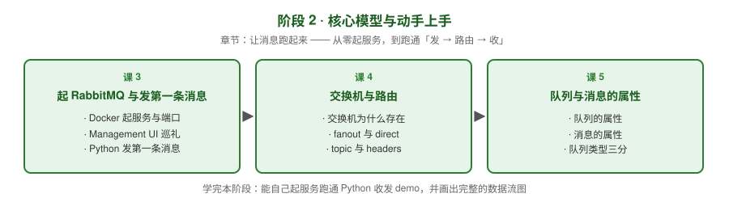

# 阶段 2：核心模型与动手上手

> 所属课程：RabbitMQ 系统学习 ｜ 故事章节：**让消息跑起来** ｜ 上一阶段：[阶段 1](../1-为什么需要消息队列/overview.md) ｜ 下一阶段：[阶段 3](../3-可靠性与投递语义/overview.md)

## 🎯 本阶段目标

- 能用 Docker 起一个 RabbitMQ，用 Management UI 和 CLI 观察它内部发生了什么
- 能用 Python（pika）跑通「发 → 路由 → 收」的完整链路
- 能说清交换机与队列为什么要分开设计，以及四种交换机各自的路由规则
- 能区分 classic / quorum / stream 三种队列类型，知道默认该选哪个

## 📍 学习重点

- **Exchange 与 Queue 分离**：这是 RabbitMQ 最核心的设计决策，也是它路由能力远超同类产品的原因
- **四种交换机**：fanout（广播）、direct（精确匹配）、topic（通配符）、headers（属性匹配），以及隐身的默认交换机
- **队列与消息的属性**：durable / exclusive / auto-delete、delivery_mode 持久化，这些开关直接决定可靠性
- **队列类型三分**：classic（轻量非复制）、quorum（Raft 复制、数据安全优先）、stream（日志型、可回放）
- **动手贯穿**：本阶段每课都有可运行命令或 Python 代码，不跑等于没学

## ✅ 必须掌握的知识点

| 知识点 | 所属课 | 学完应能 |
|--------|--------|----------|
| Docker 起服务与端口 | 课 3 | 一条命令起服务，说清 5672 与 15672 分别干什么、默认账号的限制 |
| Management UI 巡礼 | 课 3 | 在管理界面找到队列/交换机/绑定，手动发一条测试消息 |
| Python 发第一条消息 | 课 3 | 写出 pika 的最小收发程序并跑通 |
| CLI 常用命令 | 课 3 | 用 rabbitmqctl / rabbitmqadmin 查看队列、交换机、绑定与节点状态 |
| 交换机为什么存在 | 课 4 | 解释「交换机不存消息」以及 binding / routing key 的作用 |
| fanout 与 direct | 课 4 | 用代码演示广播与精确匹配，说清多消费者时的轮询分发 |
| topic 与 headers、默认交换机 | 课 4 | 用 `*` 与 `#` 写出匹配规则，说清默认交换机 `` 的直连行为 |
| 队列的属性 | 课 5 | 说清 durable / exclusive / auto-delete 各自的语义与组合后果 |
| 消息的属性 | 课 5 | 设置 delivery_mode=2 让消息持久化，并读取消息属性 |
| 队列类型三分 | 课 5 | 在 classic / quorum / stream 之间做出选型，说出各自的成本边界 |

## 🗺️ 本阶段路径图

## 本阶段产出

- [x] `lessons/lesson-03-起RabbitMQ与发第一条消息.md`
- [x] `lessons/lesson-04-交换机与路由.md`
- [x] `lessons/lesson-05-队列与消息的属性.md`

> ✅ **阶段 2 已完成**（2026-08-31）。下一阶段：[阶段 3《可靠性与投递语义》](../3-可靠性与投递语义/overview.md)
