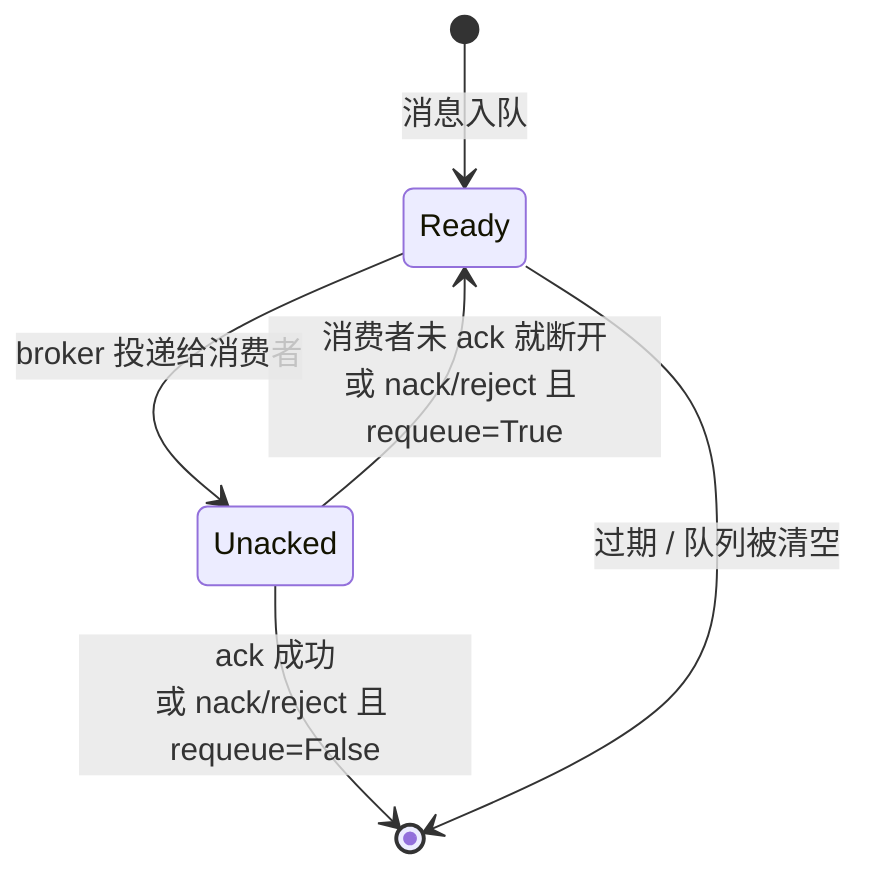
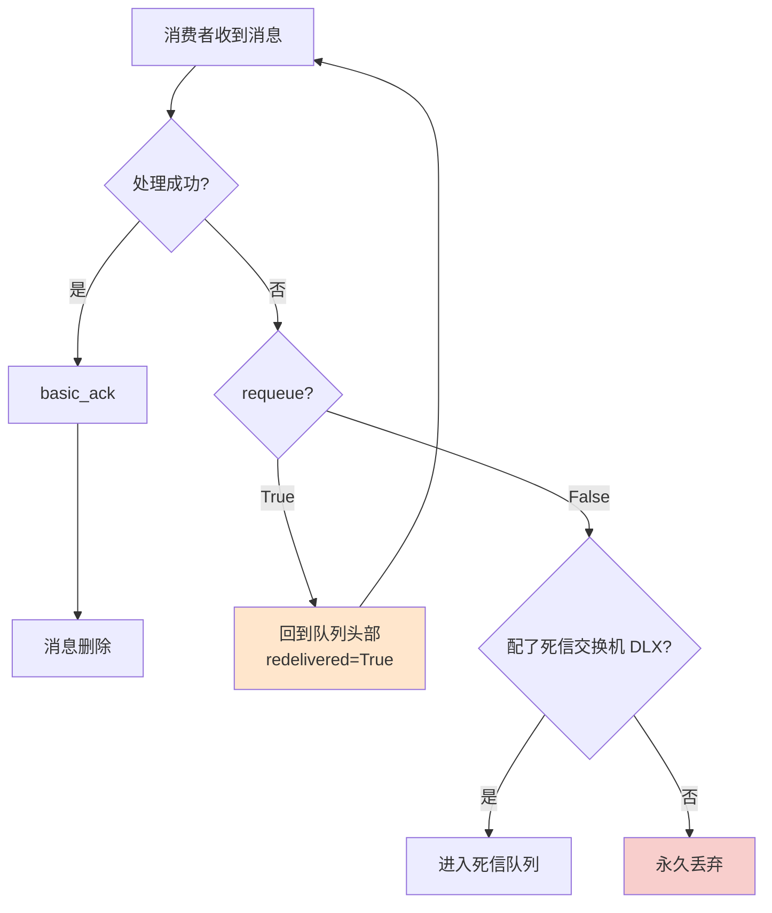
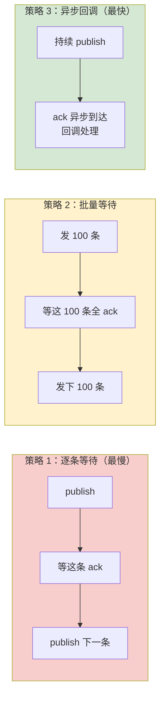
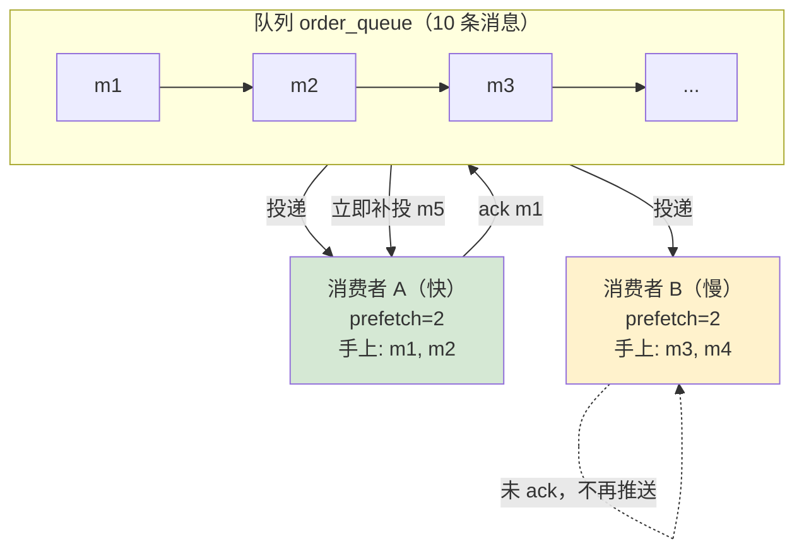
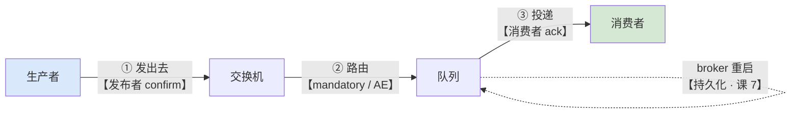
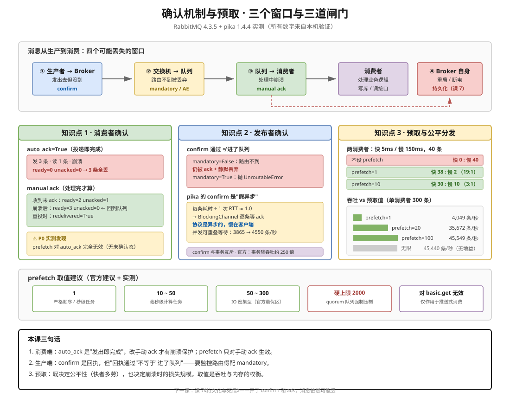

# 第 6 课：确认机制与预取

> 所属阶段：阶段 3《可靠性与投递语义》｜ 水平：零基础 ｜ 本课知识点：消费者确认、发布者确认、预取与公平分发
> 故事情节：主角开始丢东西了——消息在"发出去"和"处理完"两个环节都可能消失，得有回执

## 🎯 本课目标

- 关闭 auto_ack，手写 ack / nack / reject，并解释 unacked 堆积意味着什么
- 开启发布者 confirm 并处理 basic_ack / basic_nack，说清为什么不用事务
- 设置 prefetch_count 并解释它如何让快消费者多干活、慢消费者不堆货

## 知识点导航

| # | 知识点 | 一句话概括 | 状态 |
|---|--------|-----------|------|
| 1 | 消费者确认 | 处理完才 ack，崩溃后自动重投 | ✅ 已讲 |
| 2 | 发布者确认 | broker 收到了会回执，但别用事务 | ✅ 已讲 |
| 3 | 预取与公平分发 | 限制手上的未确认数，快者多劳 | ✅ 已讲 |

> 本课所有结论均在 **RabbitMQ 4.3.5**（Docker 官方镜像）+ **pika 1.4.4** 上实测验证，验证脚本见 `playground/l6-verify.sh`（18 项检查全部通过）。

---

## 第一幕：起源与场景引入

第 3 课你写下了人生第一个 RabbitMQ 程序，第 5 课你学会了给队列和消息都加上持久化开关。按理说，消息应该"万无一失"了。

现在把镜头切到你的订单服务。运营找上门："用户付款成功了，但订单状态还是'待支付'，一天出现了 30 多单。"

你查日志，消费者进程确实收到了消息——然后**在写数据库的那一刻进程崩了**（OOM 被 kill）。消息呢？没了。

```python
# 你写的消费者（第 3 课的风格）
def callback(ch, method, properties, body):
    save_to_db(body)     # ← 进程在这里被 OOM kill 了
    # 崩溃后，这条消息去哪了？

channel.basic_consume(queue='order_queue', on_message_callback=callback, auto_ack=True)
```

`auto_ack=True` 的意思是：**broker 把消息推向网络的那一刻，就当这条消息已经处理完了**。至于你的 `save_to_db` 有没有跑完，broker 不关心，也无从知道。

> 🎬 **场景**：消息有两个"消失窗口"——一个在**发出去的路上**（生产者到 broker），一个在**处理完之前**（broker 到消费者）。持久化只堵住了第三个窗口（broker 重启），前两个还开着。

---

## 第二幕：认知冲突

先别急着改代码，把问题想清楚。

你可能会想："那我把 `auto_ack` 改成 `False`，处理完再手动确认不就行了？"

对，但这只解决了消费端。生产端呢？

```python
channel.basic_publish(exchange='', routing_key='order_queue', body=msg)
# 这行代码执行完，没抛异常。请问：消息到 broker 了吗？
```

答案是**不知道**。`basic_publish` 只是把数据写进了本地 socket 缓冲区。网络可能断在半路，broker 可能在这一刻崩了，消息可能被交换机丢弃（还记得课 4 讲的"无可路由消息被静默丢弃"吗？）。**没有回执，你就没有任何证据说消息到了。**

于是两个问题浮出水面：

> ❓ **问题 1**：怎么让 broker 知道"我真的处理完了"，而不是"我收到了"？
>
> ❓ **问题 2**：怎么让生产者知道"broker 真的收到了"，而不是"我发出去了"？

还有一个隐藏的第三个问题。假设你有 2 个消费者，一个快（5ms/条）、一个慢（150ms/条）。消息公平地一人一半吗？

**实测答案：不是。** 慢的那个可能拿走全部 40 条，快的那个一条都没干。这不是 bug，是默认的预取机制造成的。

> ❓ **问题 3**：为什么"公平分发"反而是假的？怎么让它变真？

---

## 第三幕：层层揭示

### 知识点 1：消费者确认

> 本知识点关键点：auto_ack 与 manual ack 的差别 / ack、nack、reject / requeue 与死循环风险 / unacked 堆积的信号意义

#### 一句话定义

**消费者确认**是消费者告诉 broker"这条消息我处理完了，你可以删了"的机制；关掉自动确认后，未确认的消息在消费者断开时会自动回到队列。

#### 直觉建立（类比）

想象快递柜。

- **自动确认（auto_ack）**：快递员把包裹塞进柜子、柜门一关，系统就标记"已签收"。至于你回家打开柜子发现包裹是空的、或者你根本没来得及取——系统不管，这笔订单已经完结了。
- **手动确认（manual ack）**：柜门关上后，包裹状态是"待取件"。你取出来检查无误，在 App 上点"确认收货"，订单才完结。如果你三天没取，包裹自动退回仓库，重新派送。

**"待取件"就是 unacked 状态**——包裹已经离开了仓库货架（ready），但还没被真正签收，所以不能算完成，也不能扔掉。

> 💡 **类比的边界**：快递柜的包裹只有一份，退回就退回；而 RabbitMQ 的消息在 `requeue` 时会**回到队列头部**并可能被**另一个**消费者拿到（课 8 讲顺序性时会看到这会打乱顺序）。另外，真实系统里"三天没取"是超时退回，RabbitMQ 则是**连接一断就立即退回**——没有宽限期。

#### 核心原理

消息在队列里有三种状态，用 `rabbitmqctl list_queues` 可以分别看到：



三个动作的分工：

| 动作 | 语义 | 消息去向 | 可否批量 |
|------|------|---------|---------|
| `basic_ack` | 处理成功 | 从队列删除 | 可以（`multiple=True`） |
| `basic_nack` | 处理失败 | 由 `requeue` 决定 | 可以（`multiple=True`） |
| `basic_reject` | 处理失败 | 由 `requeue` 决定 | **不可以**（只能单条） |

`nack` 和 `reject` 的区别只有一点：**`nack` 支持批量**（`multiple=True` 一次性拒绝某个 tag 之前的所有消息），`reject` 是 AMQP 0-9-1 原生的单条版本。`nack` 是后来加的扩展，实际用 `nack` 就够了。

`requeue` 参数决定消息去向：



> ⚠️ **那条橙色的回路就是"死循环"**：如果一条消息每次处理都失败，而你的代码无脑 `nack(requeue=True)`，它会无限回到队列、被重新消费、再失败——CPU 空转，后面的正常消息也被堵住。这是生产事故的经典来源。**正确做法是记录重试次数，超过阈值就 `requeue=False` 送死信**（死信队列是课 7 的内容，这里先记住结论）。

#### 示例演示

下面这段实测，展示了"未 ack 就崩溃"的完整过程。关键观察点是 `unacked` 这一列：

```bash
export PYTHONIOENCODING=utf-8
cd playground && python3 l6-ack2.py
```

实测输出（节选）：

```
实验 2：manual ack —— 不 ack 就断开，消息回到队列
    [发送 3 条后        ] ready=3  unacked=0  total=3
  收到: m-1  delivery_tag=1  redelivered=False
    [收到但未 ack        ] ready=2  unacked=1  total=3     ← 消息进入 unacked
    [崩溃后             ] ready=3  unacked=0  total=3     ← 回到 ready，没丢
  重新收到: m-1  redelivered=True  ← True = 这是重投
    [ack 后             ] ready=2  unacked=0  total=2     ← 确认后被删除
```

对比 `auto_ack=True` 的实验 1：

```
实验 1：auto_ack=True —— 消息在"投递瞬间"就算处理完了
    [发送 3 条后        ] ready=3  unacked=0  total=3
  收到: m-1  （auto_ack=True：broker 一投递就立即确认）
    [收到但未处理        ] ready=0  unacked=0  total=0     ← 3 条一次全没了
    [崩溃后             ] ready=0  unacked=0  total=0
```

**注意实验 1 里那句反直觉的结果**：我只读了 1 条，队列却从 3 条变成了 0 条。

这不是 bug，而是两个机制叠加的结果，而且**第一个机制是本课的隐藏重点**：

1. **`prefetch` 对 `auto_ack` 完全无效**。我明明设了 `prefetch_count=1`，但 broker 仍然把 3 条（另一组实验里是 10 条）一次性全推给了消费者。原因是：prefetch 限制的是"**未确认**消息数"，而 `auto_ack` 模式下消息一投递就确认，永远不存在"未确认"状态——限制自然无处施加（实测见 `l6-qos-probe.py`）。
2. pika 的 `consume` 生成器会把收到的消息缓冲在本地，代码只读了 1 条，其余 2 条已在客户端缓冲区里。

**所以 `auto_ack=True` 的双重危险**：既没有崩溃保护，也没有流量控制——broker 会尽可能快地把消息灌给你的进程。

#### 常见误区

1. **"设了 prefetch 就能保护 auto_ack 的消费者"**：不能。prefetch 只约束未确认消息，`auto_ack` 下消息投递即确认，**prefetch 对 auto_ack 完全无效**（实测：设 `prefetch_count=1` 发 10 条，一次全推走，`ready` 归零）。想要流量控制，必须关掉 `auto_ack`。
2. **"nack 和 reject 随便用哪个都行"**：`reject` 不支持批量。需要"拒绝这个 tag 之前的所有消息"时只能用 `nack(multiple=True)`。
3. **"失败就 requeue=True 重试"**：会造成死循环。总有消息是"无论重试多少次都会失败"的（比如消息体格式错误），必须设重试上限。
4. **"消息处理到一半，先 nack 让它待会儿再来"**：`nack(requeue=True)` 会让消息**立即**回到队列头部并马上被再次投递，不是延迟重试。真正的延迟重试要用到 TTL + 死信（课 7）。
5. **"忘了 ack 也没事，反正会重新投递"**：忘了 ack，消息会一直停在 `unacked`。一旦堆积到 prefetch 上限，broker 就**不再给这个消费者推任何消息**，队列看起来"卡住了"。

#### 一句话记住

**auto_ack 是"发出即完成"，manual ack 是"处理完才算"；unacked 是中间态，连接一断就退回。**

#### 官方文档

- [Consumer Acknowledgements and Publisher Confirms](https://www.rabbitmq.com/docs/confirms/)（官方 4.x 文档，本课主要依据）

---

### 知识点 2：发布者确认

> 本知识点关键点：confirm.select / 单条、批量、异步三种确认方式 / 事务为什么慢 / mandatory 与不可路由消息

#### 一句话定义

**发布者确认（publisher confirm）** 是 broker 在收到并处理好一条消息后，给生产者回一个 `basic.ack`（或失败时回 `basic.nack`）的机制。

#### 直觉建立（类比）

这次类比换成**寄挂号信**。

平信（`basic_publish` 不开 confirm）：你把信投进邮筒就走了。信丢了、被雨淋了、地址写错了，你全不知情——因为没人给你回执。

挂号信（confirm）：邮局处理完（分拣、装车、或者成功投递）后，给你发一条短信回执。**注意回执的语义是"邮局处理完了"，不是"收件人读到了"**。如果地址根本不存在（路由不到队列），邮局照样会给你回执说"我们处理过了"——信被丢弃这件事，回执里不会提。

> 💡 **类比的边界**：这个类比的边界恰好是本知识点最容易踩的坑——**confirm 通过 ≠ 消息进了队列**。邮局的"处理完了"包括"查无此地址，已作废"。要区分这两种情况，必须额外配合 `mandatory`（课 4 已讲：路由不到就退回给生产者）。

#### 核心原理

开启 confirm 就是发一个 `confirm.select` 命令（pika 里是 `channel.confirm_delivery()`）。之后：

1. broker 从 1 开始给每条消息编号（`delivery_tag`）
2. 处理完一条（或一批）就回 `basic.ack`，可能带 `multiple=True` 表示"这个编号及之前的都好了"
3. 发生内部错误（队列所在的 Erlang 进程挂了）时回 `basic.nack`

**消息被确认的确切时机**（这是官方明确说明的，也是容易记错的地方）：

| 消息类型 | 何时被 ack |
|---------|-----------|
| 不可路由的消息 | 交换机确认无队列可投后**立即确认**（如果同时是 mandatory，先发 `basic.return` 再 ack） |
| 可路由的临时消息 | 入队的那一刻 |
| 可路由的**持久化**消息 | **写入磁盘后**，或在所有目标队列上被消费后 |
| 路由到 quorum 队列的消息 | 多数派副本确认后 |

这解释了为什么持久化消息的 confirm 延迟会明显更高——它在等一次 fsync。官方文档特别提示：消息存储**批量刷盘**（间隔几百毫秒），所以持续高负载下 `basic.ack` 延迟可达数百毫秒。

**三种使用策略**（吞吐从低到高）：



官方明确不推荐策略 1（"吞吐量不会超过每秒几百条"）。

**为什么不用事务**：事务（`tx_select` / `tx_commit`）是 AMQP 原生的机制，同步阻塞。官方文档给出的数字是**事务使吞吐量下降约 250 倍**。所以 confirm 是推荐方案。

#### 示例演示

先看 confirm 的关键边界——**路由不到也会 ack**：

```bash
export PYTHONIOENCODING=utf-8
cd playground && python3 l6-confirm.py
```

实测输出（节选）：

```
实验 3：路由不到的消息在 confirm 模式下会怎样？（关键！）
  mandatory=True：pika 抛出 UnroutableError → 1 unroutable message(s) returned
      （这就是"退回"，说明消息没有被任何队列接收）
  mandatory=False（默认）发到无绑定的交换机：无任何报错，消息静默丢弃
  → 结论：confirm 通过 ≠ 消息进了队列，要看路由得配 mandatory 或 AE
```

**这个实验值得停下来想一想**：两条消息都没进任何队列，但 confirm 全部通过。如果你只看 confirm 就认为"消息安全了"，就会静默丢消息。

#### ⚠️ 一个必须澄清的实测发现：pika 的 confirm 是"假异步"

按官方文档，confirm 应该是异步的、吞吐很高。但我在本机实测时发现**完全相反**的结果（`l6-perf.py`，500 条消息，256 字节）：

```
方式                         总耗时(ms)      单条(ms)        相对基线
------------------------------------------------------------
无确认（基线）                         10       0.020        1.0x
confirm（异步）                    120       0.240       11.8x
事务（每 10 条提交）                    25       0.050        2.5x
事务（每条提交）                       136       0.272       13.4x
```

事务反而比 confirm 快？这不对劲。我做了三角验证（`l6-perf2.py`），先测出"一次网络往返"的基准成本，再对比：

```
基准：1 次网络往返（publish + tx_commit）≈ 0.366 ms

    N     无确认(ms) confirm(ms)   confirm/条(ms)    条/ RTT
------------------------------------------------------------
  100         1.9        36.4           0.364      0.99
  300         6.3        85.6           0.285      0.78
  600        14.5       148.2           0.247      0.67
```

**confirm 每条耗时 ÷ 1 次 RTT ≈ 1.0**。这说明 pika 的 `BlockingChannel` 每条 publish 都在等一次往返。

我读了 pika 源码确认（`l6-pika-confirm-check.py`）：

```python
# pika/adapters/blocking_connection.py, BlockingChannel.basic_publish
if self._delivery_confirmation:
    with self._message_confirmation_result:
        self._flush_output(self._message_confirmation_result.is_ready)
```

**`_flush_output(..., is_ready)` 就是"把数据发出去并等结果就绪"**——即每条 publish 都同步等自己的 ack。

那么"confirm 很快"是假的吗？不是。我用并发实验验证了瓶颈到底在哪（`l6-confirm-frames3.py`）：

```
单连接 300 条            :     77.6 ms   吞吐     3865 条/秒
2 连接并发（共 600 条）:    119.5 ms   吞吐     5020 条/秒
4 连接并发（共 1200 条）:    269.6 ms   吞吐     4450 条/秒
```

并发后吞吐从 3865 提升到约 4500~5000 条/秒——**等待是可以重叠的，瓶颈是等待本身，不是 broker 的处理能力**。

> 📌 **结论（重要，别记反）**：
> - **AMQP/RabbitMQ 的 confirm 机制本身是异步的、高吞吐的**——这是协议与 broker 的能力。
> - **pika 的 `BlockingChannel` 把它实现成了同步逐条等待**——这是客户端适配器的取舍（易用性优先）。
> - 所以"用 pika BlockingChannel + confirm 会很慢"是**客户端使用方式**的问题。要吃满 confirm 的性能，需要用异步客户端（如 `SelectConnection`）或批量等待。
>
> ⏳ **置信度说明**：`SelectConnection` 的异步验证在本机环境未能跑通（ioloop 卡住），故上面"异步很快"的结论**基于官方文档 + 并发实验的间接证据**，而非本机直接测出的异步吞吐数字。

**这也解释了"为什么不用事务"**——在 pika 同步模式下，事务批量提交（每 10 条一次 commit）确实可能比逐条 confirm 快。但这**不能推广成"事务更好"**：事务在语义上更重（broker 要维护事务状态），且官方明确给出 250 倍吞吐差距。正确的判断是：**在 pika 这类同步客户端上，批量 confirm（策略 2）才是兼顾可靠性与吞吐的选择；异步客户端上策略 3 最优**。

#### 常见误区

1. **"confirm 通过就说明消息进队列了"**：错。不可路由的消息也会被 ack。要看路由得配 `mandatory=True`（退回）或备份交换机 AE（课 4 已讲）。
2. **"confirm 通过就说明消息已经落盘了"**：对持久化消息，**是的**——官方明确说持久化消息在写入磁盘后才 ack。但注意"落盘"是批量刷盘的，有几百毫秒延迟。
3. **"confirm 和事务可以一起用"**：不行。官方明确：**已开启事务的信道不能进入 confirm 模式，反之亦然**。
4. **"用了 confirm 就绝对不丢"**：confirm 只保证 broker 收到了。broker 收到后如果还没来得及刷盘就断电，消息仍会丢——这是课 7《持久化的真实程度》要解决的问题。
5. **"pika 里 confirm 慢，所以 RabbitMQ 的 confirm 不好用"**：因果搞反了。慢的是 pika 同步适配器的用法，不是机制本身（详见上面的澄清）。

#### 一句话记住

**confirm 是生产者的回执，保证"broker 收到了"；但它不保证"路由到队列了"（要 mandatory），也不保证"绝对不丢"（要等刷盘）。**

#### 官方文档

- [Consumer Acknowledgements and Publisher Confirms](https://www.rabbitmq.com/docs/confirms/)（含"When Will Published Messages Be Confirmed"章节）
- [Publishers](https://rabbitmq.com/docs/publishers/)（消息属性与发布可靠性）

---

### 知识点 3：预取与公平分发

> 本知识点关键点：prefetch_count 与 QoS / 轮询分发的不公平 / 吞吐与内存的权衡 / 取值经验

#### 一句话定义

**预取（prefetch / QoS）** 用 `basic.qos` 设定一个信道上允许存在的**未确认消息数量上限**；达到上限后 broker 停止推送，直到有消息被确认。

#### 直觉建立（类比）

想象餐厅出餐口和两位服务员。

**没有预取限制** = 厨师把做好的菜一股脑全堆在出餐口，谁先伸手谁拿走。勤快的服务员（快消费者）跑一趟回来，菜已经被慢吞吞的同事全端走了——不对，反过来说更准确：**先到的人会把菜全部端走**。结果是慢服务员手上压着一堆菜送不出去，快服务员空着手。

**有预取限制（比如每人最多端 2 盘）** = 厨师给每人上菜不超过 2 盘。快服务员送完立刻回来，很快又拿走 2 盘；慢服务员还在路上，厨师就不会再给他压菜。**活儿自然流向快的人**。

> 💡 **类比的边界**：真实 RabbitMQ 里不是"服务员回来拿"，而是 broker 主动推送，且推送是**异步**的——所以改变 prefetch 时若有消息在途，可能出现短暂的超出（官方明确提到了这个竞态）。另外"菜"被端走后如果服务员摔了（进程崩溃），菜会**全部退回厨房**重新分配，不是丢了。

#### 核心原理



关键点：**预取限制的是"未确认数"，不是"总数"**。消费者 A 每 ack 一条，窗口就空出一个位置，broker 立即补一条进来——所以快消费者能持续拿到新消息。

`basic.qos` 的三个参数（pika）：

| 参数 | 含义 | 常用值 |
|------|------|--------|
| `prefetch_count` | 未确认消息数上限 | 1 ~ 300 |
| `prefetch_size` | 未确认消息的**总字节数**上限 | 0（不限制），一般不用 |
| `global_qos` | `False`=每个消费者各算各的；`True`=同一信道上所有消费者共享 | `False`（默认） |

> ⚠️ **`global_qos` 的坑**：`True` 时限制作用于**整个信道**，多个消费者共享一个窗口，通常不是你想要的。默认 `False`（每个消费者独立窗口）才是"公平分发"的基础。

#### 示例演示

我用两个速度差 30 倍的消费者（快 5ms/条，慢 150ms/条）跑了 6 秒，发 40 条消息（`l6-prefetch.py`）：

```
--- A. 不设 prefetch（默认无上限）---
  快消费者处理:   0 条
  慢消费者处理:  40 条
  快慢比: 0.0 : 1     ← 另一次运行是 40:0，取决于谁先连上

--- B. prefetch_count=1 ---
  快消费者处理:  38 条
  慢消费者处理:   2 条
  快慢比: 19.0 : 1

--- C. prefetch_count=10 ---
  快消费者处理:  30 条
  慢消费者处理:  10 条
  快慢比: 3.0 : 1
```

**场景 A 是最值得记住的**：一方包揽全部 40 条，另一方颗粒无收。原因是课 4 埋过的伏笔——默认 `default_consumer_prefetch` 为 `{false, 0}`（无上限），消息在消费者连上时就被一次性推完，**谁先连上谁独占**。

> 📌 **谁独占是随机的**：我跑了两轮，第一轮是慢消费者拿走 40 条、快消费者 0 条，第二轮恰好相反（快 40 : 慢 0）。**结果与处理速度无关，只取决于谁先建立连接**——这恰恰说明它不是"能者多劳"，而是纯粹的抢跑。

而加了 `prefetch_count=1` 后，分发比例稳定在 19:1 左右，几乎完美反映了两者的速度差。

**吞吐与公平的权衡**（单消费者，处理 1ms/条，300 条）：

```
  prefetch        处理条数      耗时(ms)         条/秒
         1         300          75        4049
         5         300          22       13757
        20         300           9       35672
       100         300           6       45549
        无限         300           7       45440
```

`prefetch=1` 的吞吐只有无限预取的 **1/11**——因为每条消息都要等一个完整的网络往返。而 `prefetch=100` 已经基本吃满，再往上（无限）没有收益，只有内存风险。

#### 取值经验

综合官方建议与实测：

| 场景 | 建议值 | 理由 |
|------|--------|------|
| 处理耗时长（秒级）、要求严格顺序 | 1 | 顺序安全，但吞吐最低 |
| 计算型任务（毫秒级） | 10 ~ 50 | 抵消 RTT，又不至于堆太多 |
| IO 密集型（写库、调外部接口） | 50 ~ 300 | 官方明确：100~300 通常达到最佳吞吐 |
| 消费者不稳定 / 易崩溃 | 偏小 | 崩溃时退回的消息少 |
| 顺序敏感 | 偏小 | 退回的消息可能乱序（课 8） |

> 📌 **两条硬约束**（来自官方）：
> 1. **quorum 队列的 prefetch 上限被强制压到 2000**——防止 Raft 日志失控增长。所以设再大的值也没用。
> 2. **prefetch 对 `basic.get`（拉模式）无效**——它只作用于推送式消费。

#### 常见误区

1. **"prefetch 能限制 auto_ack 的消费者"**：**不能**。这是本课最重要的纠正——`auto_ack` 下消息投递即确认，不存在未确认状态，prefetch 无处施加（实测：设了 `prefetch_count=1` 仍被一次推走 10 条）。
2. **"prefetch=1 最公平，所以最好"**：公平但慢。实测吞吐只有 `prefetch=100` 的 1/11。公平和吞吐必须按场景权衡。
3. **"prefetch 越大越好"**：超过 300 基本是收益递减（官方原话：higher values often run into the law of diminishing returns），且消费者崩溃时要退回大量消息。
4. **"prefetch 设了就立刻生效"**：若有消息已在途，可能出现短暂超出（官方提示的竞态）。
5. **"unacked 上涨是正常的，不用管"**：`unacked` 持续上涨意味着消费者处理不过来或根本没在 ack，是**消费者侧故障的第一信号**。

#### 一句话记住

**prefetch 限制的是"手上未确认的条数"；它既让快者多劳，也决定了崩溃时要退回多少消息。**

#### 官方文档

- [Consumer Acknowledgements and Publisher Confirms · Channel Prefetch Setting (QoS)](https://www.rabbitmq.com/docs/confirms/)（本节数据主要来源）
- [Consumer Prefetch](https://www.rabbitmq.com/docs/consumer-prefetch)（per-channel / per-consumer / global 的作用域详解）

---

## 第四幕：实操验证

把三个知识点串起来，解决第一幕的"订单状态没更新"问题。下面是一个**生产可用的消费者骨架**：

```python
#!/usr/bin/env python3
# -*- coding: utf-8 -*-
"""订单消费者：手动 ack + prefetch + 重试上限 + 死信兜底"""
import pika

CRED = pika.PlainCredentials('learn', 'learn123')
conn = pika.BlockingConnection(
    pika.ConnectionParameters(host='localhost', port=5672, credentials=CRED))
channel = conn.channel()

# 主队列：配死信交换机（课 7 详解），处理失败的消息最终进入 DLX
channel.queue_declare(
    queue='order_queue', durable=True,
    arguments={'x-dead-letter-exchange': 'order.dlx'})

# 关键 1：限制未确认数为 10 —— 既抵消 RTT，又不让单个消费者囤太多
channel.basic_qos(prefetch_count=10, global_qos=False)

MAX_RETRY = 3   # 重试上限，超过则送死信


def get_retry(properties):
    """读取我们自己维护的重试次数（生产者在消息头里带上）"""
    return int((properties.headers or {}).get('x-retry-count', 0))


def republish_with_retry(ch, properties, body, n):
    """重新发布一条带重试计数的消息（而不是 requeue）

    为什么不用 nack(requeue=True)？实测（playground/l6-xdeath-check.py）：
    requeue=True 只是把消息放回原队列，broker **不会**写 x-death 头，
    headers 始终是 {}。所以无法用它计数 —— 会无限重试。
    """
    headers = dict(properties.headers or {})
    headers['x-retry-count'] = n
    ch.basic_publish(
        exchange='', routing_key='order_queue', body=body,
        properties=pika.BasicProperties(delivery_mode=2, headers=headers))


def callback(ch, method, properties, body):
    n = get_retry(properties)
    try:
        save_to_db(body)                                # 真正的业务处理
        ch.basic_ack(delivery_tag=method.delivery_tag)  # 关键 2：处理完才 ack
    except TransientError:                              # 可重试错误（如网络超时）
        ch.basic_ack(delivery_tag=method.delivery_tag)  # 先确认旧的
        if n >= MAX_RETRY:
            # 关键 3：超过上限 → 发往 DLX 兜底，避免死循环
            ch.basic_publish(exchange='order.dlx', routing_key='', body=body,
                             properties=pika.BasicProperties(delivery_mode=2))
        else:
            republish_with_retry(ch, properties, body, n + 1)
    except Exception:                                   # 永久性 / 未知错误
        # 直接拒绝且 requeue=False → 送死信（课 7 详解）
        ch.basic_nack(delivery_tag=method.delivery_tag, requeue=False)


# 关键 4：auto_ack=False —— 一切的起点
channel.basic_consume(queue='order_queue', on_message_callback=callback,
                      auto_ack=False)
channel.start_consuming()
```

生产者侧加 confirm：

```python
channel.confirm_delivery()   # 开启发布者确认
try:
    channel.basic_publish(
        exchange='', routing_key='order_queue', body=msg,
        properties=pika.BasicProperties(delivery_mode=2),
        mandatory=True)      # 路由不到就退回，不静默丢弃
except pika.exceptions.UnroutableError:
    # 消息没进任何队列：记录、告警、落库兜底
    log_and_alert(msg)
```

用本课的一键脚本验证全部结论：

```bash
cd playground && ./l6-verify.sh
```

预期输出（16 项全通过）：

```
=== 知识点 1：消费者确认 ===
  ✅ 未 ack 断开后消息重投（redelivered=True）
  ✅ manual ack 期间状态为 unacked=1 / total=3
  ✅ 消费者崩溃后消息回到 ready（未丢失）
  ✅ P0 事实：prefetch 对 auto_ack 无效（10 条一次性推空）
  ✅ 不设 prefetch 时 10 条全部进入 unacked

=== 知识点 2：发布者确认 ===
  ✅ mandatory=True 路由不到 → 抛 UnroutableError（退回）
  ✅ mandatory=False 路由不到 → 静默丢弃
  ✅ 性能对照表生成（无确认/confirm/事务）
  ✅ P0 事实：pika confirm 单条耗时 ≈ 1 个 RTT（实测比值: 0.99 / 0.97 / 0.93）
  ✅ 并发 publish 吞吐提升（RTT 等待可重叠）
  ✅ P0 事实：nack(requeue=True) 不写 x-death（计数需自己维护）
  ✅ requeue=False 后死信队列才出现 x-death（count=1）

=== 知识点 3：预取与公平分发 ===
  ✅ P0 事实：不设 prefetch 时一方独占全部（40:0 或 0:40）
  ✅ prefetch=1 时快者多劳（38:2，19:1）
  ✅ prefetch=10 时按比例分发（30:10，3:1）
  ✅ 吞吐随 prefetch 增大而提升（1→4049，20→35672，100→45549 条/秒）

 结果：18 项通过，0 项失败
```

> ✅ **回扣场景**：第一幕的问题是"进程崩了消息就没了"。现在这条链路上，**消费端**有 manual ack（崩溃后消息回到队列）+ prefetch（限制崩溃时的损失规模），**生产端**有 confirm + mandatory（知道 broker 到底收没收到、有没有路由到）。三个窗口堵住了两个。

> ⚠️ **这段代码里藏着本课最容易被写错的一行**（我自己第一版就写错了，靠实测才抓出来）。
>
> 最初我把重试计数写成"读 `x-death` 头的 count"。看起来很合理——官方说死信重投会写 `x-death`。但实测完全不是这么回事（`playground/l6-xdeath-check.py`）：
>
> ```
> 第 1 次收到: headers={}  x-death=None
> 第 2 次收到: headers={}  x-death=None   ← nack(requeue=True) 三次
> 第 3 次收到: headers={}  x-death=None
> 改为 requeue=False 后，死信队列里才出现：
>      x-death = [{'count': 1, 'reason': 'rejected', ...}]
> ```
>
> 原因是：**`x-death` 只在消息被"死信化"时才写入**（reject/nack 且 requeue=False、TTL 过期、超 max-length），而 `nack(requeue=True)` 只是把消息放回原队列，消息从未离开，**永远不会产生 `x-death`**。用它计数，结果就是计数永远是 0、重试永不停止——恰好造出讲义自己警告的那个死循环。
>
> 结论：**`requeue=True` 无法计数，要计数就得自己维护**（上面的 `x-retry-count`）。这个坑课 7 讲死信队列时会再次遇到，到时你会看到 `x-death` 真正的用武之地。

---

## 第五幕：体系收束

### 三个窗口与三道闸门

把"消息从生产到消费"整条链路摊开，看看每一环由谁负责：



| 窗口 | 风险 | 本课的解法 | 待解决 |
|------|------|-----------|--------|
| ① 生产者 → broker | 网络中断，消息没到 | **发布者 confirm** | confirm 后未刷盘就断电 |
| ② 交换机 → 队列 | 路由不到被静默丢弃 | **mandatory / AE**（课 4） | — |
| ③ broker → 消费者 | 消费者崩溃，消息丢失 | **消费者 ack + prefetch** | 重复投递（课 8 幂等） |
| ④ broker 自身 | 重启 / 宕机 | 持久化（课 5 已讲） | 刷盘时机（**课 7**） |

> 📍 **全局定位**：本课堵住了 ①②③ 三个窗口，但**没有解决"重复"**——`nack(requeue=True)`、消费者崩溃重投、生产者超时重发，都会让同一条消息被处理多次。这就是课 8《交付语义与幂等》的主题。而第 ④ 个窗口里"持久化不等于绝对不丢"，是下一课（课 7）的开场。

### 本课三句话

1. **消费端**：`auto_ack=True` 是"发出即完成"，改为手动 ack 才有崩溃保护；`prefetch` 只对手动 ack 生效。
2. **生产端**：confirm 是回执，但"回执通过"不等于"进了队列"——要监控路由得配 `mandatory`。
3. **预取**：它既决定公平性（快者多劳），也决定崩溃时的损失规模，取值是吞吐与内存的权衡。

### 下一课预告

你已经让消息"尽量不丢"了。但下一课要打破一个幻觉：

> **开了持久化、开了 confirm、开了手动 ack，消息依然可能丢。**

因为"持久化"和"落盘"之间隔着一个**批量刷盘的几百毫秒窗口**。课 7《持久化与死信》会讲清这最后一段距离，并给出 TTL + 死信队列这套"延迟重试与兜底"的公共基础设施——也就是本课消费者骨架里那个还没解释的 `order.dlx`。

---

## 🐞 常见误区（本课汇总）

1. **设了 prefetch 就能保护 auto_ack 的消费者** → prefetch 只约束未确认消息，auto_ack 下无效。
2. **nack 和 reject 随便用** → reject 不支持批量。
3. **失败就 requeue=True** → 死循环，必须设重试上限。
4. **nack(requeue=True) 是延迟重试** → 是立即回到队列头部。
5. **忘了 ack 没事** → unacked 堆积到 prefetch 上限后，消费者彻底收不到新消息。
6. **confirm 通过 = 进队列了** → 不可路由消息也 ack，要配 mandatory。
7. **confirm 和事务可以一起用** → 互斥，官方明令禁止。
8. **用了 confirm 就绝对不丢** → broker 未刷盘就断电仍会丢（课 7）。
9. **pika confirm 慢 = RabbitMQ confirm 不好** → 慢在同步适配器的逐条等待，非机制本身。
10. **prefetch 越大越好** → 超过 300 收益递减，且崩溃时退回量大；quorum 队列硬上限 2000。
11. **用 `x-death` 的 count 给 `requeue=True` 的重试计数** → **实测：requeue=True 根本不写 `x-death`，headers 始终是 `{}`**，计数永远为 0，重试永不停止。`x-death` 只在消息被死信化（requeue=False / TTL 过期 / 超长度）时才产生。要计数必须自己在消息头维护。

---

## 🗺️ 一图总结



---

## 📋 命令与速查卡

```python
# ===== 消费者确认 =====
channel.basic_consume(queue=Q, on_message_callback=cb, auto_ack=False)  # 手动 ack
ch.basic_ack(delivery_tag=method.delivery_tag)                # 确认成功
ch.basic_ack(delivery_tag=tag, multiple=True)                 # 批量确认（<=tag 全部）
ch.basic_nack(delivery_tag=tag, requeue=True)                 # 拒绝并重新入队
ch.basic_nack(delivery_tag=tag, requeue=False)                # 拒绝并丢弃/进死信
ch.basic_reject(delivery_tag=tag, requeue=False)              # 同 nack，但不支持批量

# ===== 发布者确认 =====
channel.confirm_delivery()                    # 开启 confirm（每个信道一次）
# pika 中 mandatory 的退回会在 basic_publish 时抛 UnroutableError
# confirm 与事务互斥：confirm_delivery() 后不能 tx_select()

# ===== 预取 =====
channel.basic_qos(prefetch_count=10)                    # 每个消费者 10 条未确认
channel.basic_qos(prefetch_count=10, global_qos=False)  # 同上（默认）
# quorum 队列 prefetch 硬上限 2000；prefetch 对 basic.get 无效
```

```bash
# ===== 排查：看三种状态 =====
docker exec rabbitmq-learn rabbitmqctl list_queues name messages_ready messages_unacknowledged

# ready    = 待投递
# unacked  = 已投递未确认（持续上涨 = 消费者有问题）
# 两者之和 = 队列总深度
```

```python
# ===== x-death 头的触发条件（实测，易记错）=====
# ✅ 会产生 x-death：nack/reject 且 requeue=False、TTL 过期、队列超 max-length
# ❌ 不会产生：nack(requeue=True) —— 消息没离开原队列，headers 始终是 {}
# → 所以 requeue=True 无法用它计数，重试次数要自己在消息头维护
```

**取值速查**：

| 场景 | prefetch_count |
|------|----------------|
| 严格顺序 / 处理耗时秒级 | 1 |
| 毫秒级计算任务 | 10 ~ 50 |
| IO 密集型 | 50 ~ 300 |
| quorum 队列 | 上限被压到 2000 |

---

## 课后小测

**Q1**：消费者用 `auto_ack=True` 收了一条消息，处理到一半进程崩溃。这条消息会怎样？

- A. 回到队列，稍后重新投递
- B. 永久丢失
- C. 进入死信队列
- D. 一直停在 unacked

<details><summary>答案与解析</summary>

**答案：B**。`auto_ack=True` 时 broker 在投递的那一刻就认为消息已处理完并删除它，进程崩溃后消息不会回来。实测：发 3 条、读 1 条后关闭连接，队列直接归零。

A 是手动 ack 的行为；C 需要显式 `nack/reject(requeue=False)` 且配了 DLX；D 只在手动 ack 且未 ack 时出现。
</details>

**Q2**：关于 `prefetch_count`，下列说法正确的是？（多选）

- A. 它限制的是"未确认消息"的数量，不是消息总数
- B. 它只对手动确认（auto_ack=False）的消费者生效
- C. 设为 0 表示不限制
- D. 它对 `basic.get`（拉模式）同样生效

<details><summary>答案与解析</summary>

**答案：A、B、C**。

- A 对：ack 一条就空出一个位置，broker 立即补投，所以快消费者能持续拿到新消息。
- B 对：auto_ack 下消息投递即确认，永远不存在"未确认"状态，prefetch 无处施加。**实测：设了 `prefetch_count=1` + `auto_ack=True`，发 10 条仍被一次全推走。**
- C 对：AMQP 0-9-1 中 0 表示无限制（这也是 RabbitMQ 的默认值）。
- D 错：官方明确说明 prefetch 对 `basic.get` 无效，只作用于推送式消费。
</details>

**Q3**：你开启了发布者 confirm，发送一条消息到 `amq.topic`，routing key 没有任何队列能匹配，且**没有**设置 `mandatory`。会发生什么？

- A. 抛出 UnroutableError
- B. 收到 basic.nack
- C. 正常收到 confirm，但消息被静默丢弃
- D. 消息进入死信队列

<details><summary>答案与解析</summary>

**答案：C**。这是本课最容易踩的坑——**不可路由的消息也会被 ack**。官方明确：交换机确认无队列可投后就立即确认消息。消息被丢弃这件事，confirm 里不体现。

要发现这种情况，必须设 `mandatory=True`（会先发 `basic.return` 再 ack，pika 中表现为抛 `UnroutableError`），或配置备份交换机 AE。
</details>

**Q4**：两个消费者订阅同一队列，快的 5ms/条、慢的 150ms/条，队列里有 40 条消息，不设 prefetch。最可能的结果是？

- A. 各 20 条
- B. 快的 38 条、慢的 2 条
- C. 快的 0 条、慢的 40 条
- D. 快的 30 条、慢的 10 条

<details><summary>答案与解析</summary>

**答案：C**（但 D 也可能出现，取决于谁先连上）。

**C 和 D 都可能**——这是本题的考点所在。默认 prefetch 无上限（`default_consumer_prefetch = {false, 0}`），先连上的消费者会把队列里的消息一次性拿光。**我实测跑了两轮，一轮是 0:40、另一轮是 40:0**，结果与处理速度无关，只取决于谁先建立连接。

题目要你识别的核心是：**这是一种"抢跑"而非"能者多劳"**。所以 A（各 20 条，看似公平）和 B（38:2，看似能者多劳）都不是默认行为——B 是 `prefetch=1` 的结果，D 是 `prefetch=10` 的结果。

> 注：若必须在 C/D 中选一个，按"慢消费者先启动"的常见错觉选 C；但请记住真正的原因是连接顺序，不是速度。
</details>

**Q5**（进阶）：关于 pika 的 confirm 性能，下列说法正确的是？

- A. RabbitMQ 的 confirm 机制本身是同步阻塞的
- B. pika 的 BlockingChannel 会把 confirm 实现成逐条等待，导致吞吐受 RTT 制约
- C. 因为实测事务更快，所以生产中应该优先用事务
- D. 增大 prefetch 可以改善 confirm 的吞吐

<details><summary>答案与解析</summary>

**答案：B**。

- A 错：confirm 在设计上是**异步**的——broker 会用 `multiple=true` 批量确认，客户端本可以流水线化处理。
- B 对：pika 源码里 `BlockingChannel.basic_publish` 在 confirm 模式下会 `_flush_output(..., is_ready)`，即每条都等自己的 ack。实测"每条耗时 ÷ 1 次 RTT ≈ 1.0"，证实了这一点。
- C 错：本机实测事务批量提交更快，是 pika 同步适配器造成的特殊结果。**官方明确事务使吞吐下降约 250 倍**，且事务与 confirm 互斥。正确做法是批量 confirm 或换异步客户端。
- D 错：prefetch 是消费者侧的参数，与生产者 confirm 无关。
</details>

---

## 🧭 课程导航

⬅️ **上一课**：[课 5：队列与消息的属性](../2-核心模型与上手/lessons/lesson-05-队列与消息的属性.md)

➡️ **下一课**：[课 7：持久化与死信](lesson-07-持久化与死信.md)

📚 **返回目录**：[课程目录](../../02-课程目录.md)

---

## 🚀 下一批接力提示词

> 学完本课后，**复制下面这段文字发给 AI**，即可无缝进入下一批（无需重新描述上下文）：

```
继续学 RabbitMQ。我的学习档案在 rabbitmq/00-学习档案.md，
刚学完阶段 3《可靠性与投递语义》的课 6《确认机制与预取》知识点 消费者确认、发布者确认、预取与公平分发，
请按大纲继续讲解下一批知识点。
```
