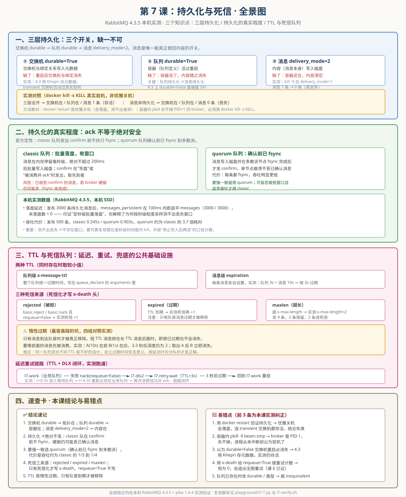

# 第 7 课：持久化与死信

> 所属阶段：阶段 3《可靠性与投递语义》｜ 水平：零基础 ｜ 本课知识点：三层持久化、持久化的真实程度、TTL 与死信队列
> 故事情节：主角想要"永生"——我们给消息加上持久化，却发现它依然会丢，于是追问到底丢在哪
> 上一课：[课 6 确认机制与预取](lesson-06-确认机制与预取.md) ｜ 下一课：课 8《交付语义与幂等》

## 🎯 本课目标

- 同时设置交换机、队列、消息三层的持久化开关，说清缺一层的后果
- 解释为什么持久化消息在 broker 宕机时仍可能丢一小段
- 配置 TTL + 死信交换机，实现一条"失败后延迟重试"的链路

---

## 第一幕：重启之后，订单没了

上一课我们堵住了两个洞：消费者确认保证"处理完才删"，发布者确认保证"broker 收到了"。

但还有一个更根本的问题没解决：**broker 自己挂了怎么办？**

设想这个场景。你是电商系统的开发，订单服务把"支付成功"消息发给 RabbitMQ，库存服务慢慢消费。一切正常。然后运维同学敲下 `docker restart rabbitmq`——可能是升级，可能是机器迁移，也可能是不小心。

重启之后，你打开管理界面，发现：

- 交换机还在
- 队列还在
- 但队列里那 3000 条待处理的订单消息，**一条都不剩**

库存服务连线后开始消费空队列。财务对账时发现，有 3000 笔订单付了钱却没扣库存。

诡异的是：**容器完好无损，只有内容消失了。**

**这就是持久化要解决的问题。**

持久化（Persistence）这个词听起来很绝对——"持久"嘛，不就是"永久保存"吗？但这恰恰是 RabbitMQ 里最容易被误解的一个词。这一课我们会看到：**持久化不是一个开关，而是三个；而且三个都开了，也未必等于"绝对不丢"。**

先剧透本课的核心张力：

- **第一层**：交换机、队列、消息三个开关各管各的，管错层等于没设
- **第二层**：三个都开了，"持久化"依然不等于"绝对不丢"——写盘和刷盘之间有时间差
- **第三层**：既然消息会失败、会过期、会卡住，那就需要一套兜底机制——这就是 TTL 与死信队列

> 💡 **预告一个贯穿全课的提醒**：这一课我做的几次实验都"翻车"过——不是 RabbitMQ 有问题，而是**我的测量方法有问题**。你会看到我用了三版才找到正确的宕机方式。这些翻车过程我都保留了下来，因为它们比直接给结论更有价值：验证持久化这件事，方法错了就会得出完全相反的结论。

---

## 第二幕：认知冲突

好，那就照着最常见的教程，给队列加上持久化：

```python
# 队列持久化 —— 教程说这样就安全了
channel.queue_declare(queue='order_queue', durable=True)

# 然后照常发消息
channel.basic_publish(
    exchange='order',
    routing_key='pay',
    body='订单1001已支付'
)
```

重启，再看队列——**消息没了。**

但仔细看：**队列本身还在，交换机也在，只有消息不见了。**

这就是第一个反直觉的地方：**"队列持久化"这四个字，根本不是在说消息。**

你补上消息那一层再试：

```python
channel.queue_declare(queue='order_queue', durable=True)
channel.basic_publish(
    exchange='order',
    routing_key='pay',
    body='订单1001已支付',
    properties=pika.BasicProperties(delivery_mode=2)   # ← 补上这一层
)
```

重启，消息活下来了。

好，第一个问题解决了。但紧接着你会撞上第二件更奇怪的事。

你想验证"交换机不持久化会怎样"，于是故意把它设成 `durable=False`：

```python
channel.exchange_declare(exchange='order', exchange_type='direct', durable=False)
```

重启后——**交换机居然还在**，绑定关系完好，消息也还在。

可官方文档白纸黑字写着：

> "Durable exchanges survive broker restart, transient exchanges do not."
> （持久化交换机活过重启，临时交换机活不过。）

你测出来它活了。**是文档错了，还是你测错了？**

于是两个问题摆在面前：

- **问题一**：交换机、队列、消息这三层，到底各自负责什么？缺哪一层会丢什么？（第二个现象说明：教科书的说法，在你的版本上可能已经变了）
- **问题二**：三层全开了，就真的"绝对不丢"吗？
- **问题三**：如果消息注定会失败、会过期、会卡住，该怎么兜底？

下面逐层拆开。

---

## 第三幕：层层揭示

### 知识点 1：三层持久化

#### 一句话定义

RabbitMQ 的持久化是**三个独立开关**：交换机持久化、队列持久化、消息持久化。三者管的东西完全不同，**缺任何一层，消息都救不回来**。

#### 直觉建立：货运的三样东西

把消息系统想象成货运：

| 货运概念 | RabbitMQ 对应 | 管的是什么 | 不持久化会怎样 |
|---------|--------------|-----------|--------------|
| **仓库地址簿** | 交换机 + 绑定关系 | 货物该送到哪个仓库 | 地址簿丢了，货不知道往哪送 |
| **仓库建筑** | 队列 | 存放货物的容器 | 仓库塌了，里面的货全没 |
| **货物本身** | 消息 | 真正要送的东西 | 货没了，仓库再结实也没用 |

关键洞察：**这三样东西的"存活"是相互独立的**。

- 仓库（队列）结实，但货（消息）是泡沫做的 → 重启后仓库还在，货化了
- 货（消息）结实，但仓库（队列）是纸糊的 → 重启后仓库塌了，货一起没
- 仓库和货都结实，但地址簿（交换机）丢了 → 新货送不进来，老货还在库里吃灰

所以必须三层都设。

#### 核心原理：三层分别管什么

**第一层：交换机持久化（`durable=True`）**

管的是**交换机定义和绑定关系**。交换机本身不存消息（课 4 已验证：交换机没有"消息数"这一列），它只是一张路由表。

```python
channel.exchange_declare(exchange='order', exchange_type='direct', durable=True)
```

**第二层：队列持久化（`durable=True`）**

管的是**队列的定义**。注意：队列定义持久化 ≠ 队列里的消息持久化。

```python
channel.queue_declare(queue='order_queue', durable=True)
```

> 💡 **课 3 / 课 5 已踩过的坑**：在 RabbitMQ 4.3 上，`durable=False` 且非排他的队列**直接报 541 错误并断开连接**（`transient_nonexcl_queues` 自 4.3.0 起 `denied_by_default`）。也就是说，现在你想建一个非持久化队列都建不了。这是官方在推着你用持久化。

**第三层：消息持久化（`delivery_mode=2`）**

管的是**消息内容本身**。

```python
channel.basic_publish(
    exchange='order',
    routing_key='pay',
    body='订单1001',
    properties=pika.BasicProperties(delivery_mode=2)  # 1=非持久化, 2=持久化
)
```

只有这一层，才真正决定"消息内容会不会写进磁盘"。

#### 示例演示：三层的实测对照

我们在本机（RabbitMQ 4.3.5）做了三组对照，然后**强制宕机**：

```python
# A 组：三层全开
exchange_declare(exchange='l7.ex.all',  durable=True)
queue_declare(queue='l7.q.all',         durable=True)
basic_publish(..., properties=BasicProperties(delivery_mode=2))

# D 组：交换机+队列持久化，但消息不持久化
exchange_declare(exchange='l7.ex.rmsg', durable=True)
queue_declare(queue='l7.q.rmsg',        durable=True)
basic_publish(..., properties=BasicProperties(delivery_mode=1))
```

实测输出（真实宕机后）：

```
【A 三层全开】exchange.durable=True  queue.durable=True  delivery_mode=2
  重启后：交换机存在=True  队列存在=True  队列消息数=1      ← 活下来了

【D 消息非持久化】exchange.durable=True  queue.durable=True  delivery_mode=1
  重启后：交换机存在=True  队列存在=True  队列消息数=0      ← 消息没了
```

**结论**：交换机和队列都在，但消息没了。证明"队列持久化 ≠ 消息持久化"。

#### 🐞 常见误区：验证持久化时，你的"重启"可能是假的

这是本课**最重要的一个坑**，直接影响你能否验证出正确结论。

我第一次做这个实验时，用 `docker restart rabbitmq-learn`，结果三组配置**全部存活**，包括本该消失的非持久化交换机。当时我以为"哦，持久化其实很宽容"。

这是错的。原因：

**`docker restart` 是优雅关机（SIGTERM）**，broker 收到信号后会在退出前把内存里的元数据全部落盘。连 `durable=False` 的交换机都被写进去了。测出来的"全部存活"是关机保护的结果，不是持久化的能力。

第二次我改用容器内 `pkill -9 -f beam.smp`，想模拟硬断电。结果**依然全部存活**。

原因更隐蔽：**broker 在容器内是 PID 1，而 Linux 不允许 `kill -9` 杀掉 PID 1**。进程根本没死。我查容器 uptime 才发现——94 秒连续未中断，压根没宕机。

正确的做法是 `docker kill -s KILL`，直接杀容器主进程：

```bash
# ✅ 正确：真实强制宕机，不给落盘机会
docker kill -s KILL rabbitmq-learn
docker start rabbitmq-learn
```

**判断宕机是否真实发生的硬指标**：容器 `StartedAt` 变化 + `uptime` 归零重算。实测中 uptime 从 125 秒 → 12 秒，确认真实重启。

> 🎯 **一句话记住**：测持久化必须用 `docker kill -s KILL`，用 `docker restart` 测出来的结论是假的；验证时务必检查 uptime 确认真宕机了。

#### 一个反直觉的实测发现：4.3 上 transient 交换机也会存活

修正了宕机方法后，我又发现一件事：**`durable=False` 的交换机，在真实宕机后依然存在**。

这跟官方文档的说法不一样。官方 AMQP concepts 文档写的是：

> "Exchanges can be durable or transient. Durable exchanges survive broker restart, transient exchanges do not (they have to be redeclared when broker comes back online)."

为了确认这不是我的实验误差，我做了干净的最小化复现——只声明两个交换机，不带任何队列、绑定、消息：

```
已声明：l7.mini.transient(durable=False) 与 l7.mini.durable(durable=True)
l7.mini.durable	true
l7.mini.transient	false

# docker kill -s KILL → docker start

l7.mini.durable	true      ← 在
l7.mini.transient	false  ← 也在！
```

两个都活下来了。用 HTTP API 复核，`durable=False` 明明白白写在属性里，绑定关系也完好。

**为什么？** 查 `rabbitmqctl status` 找到了答案：

```
{khepri, ...}
{khepri_mnesia_migration, []}
```

**4.3 用 Khepri 作为元数据存储**（基于 Raft 的复制日志），所有元数据变更都进 Raft 日志并落盘，**不再区分 durable 与否**。官方 Exchanges 文档里其实留了一句伏笔：

> "Further in the 4.x series, support for transient (non-durable) entities will be removed when Khepri becomes the only supported metadata store"

也就是说：**在 4.3 上，"交换机是否持久化"这个开关实际上已经不太起作用了**。实测行为与文档的历史描述出现了版本差异。

> ⏳ **置信度说明**：这一条是本机 4.3.5 实测 + 官方文档伏笔句共同支撑的，但**不同版本行为可能不同**（3.x 上 transient 交换机确实会消失）。如果你的环境是 3.x 或早期 4.x，请以自己实测为准。教学上仍然建议**一律设 `durable=True`**——这是无害且面向未来的做法。

#### 📚 官方文档

- [RabbitMQ · Exchanges](https://www.rabbitmq.com/docs/exchanges)（含 transient 实体的未来移除说明）
- [RabbitMQ · Queues](https://www.rabbitmq.com/docs/queues)
- [RabbitMQ · AMQP 0-9-1 Model Explained](https://www.rabbitmq.com/tutorials/amqp-concepts)

---

### 知识点 2：持久化的真实程度

#### 一句话定义

`delivery_mode=2` **不等于"绝对不丢"**。它保证的是"broker 会尽快把消息写进磁盘"，而从"收到消息"到"真正 fsync 落盘"之间存在时间差，这段窗口内的消息在硬崩溃时仍会丢。

#### 直觉建立：写日记与存档

想象你在写日记：

- **写进内存** = 你脑子里想好了这句话
- **写进页缓存** = 你用钢笔写在了纸上（字已经在了）
- **fsync 落盘** = 你把这一页拍了照存进保险柜

区别在于：如果这时房子着火（硬崩溃），"脑子里想的"肯定没了；"纸上写的"会被烧毁；只有"保险柜里的照片"能活下来。

RabbitMQ 的 `delivery_mode=2` 保证的是"会写进纸上并尽快拍照"，而不是"按下笔尖的瞬间就已在保险柜里"。

更关键的是：**RabbitMQ 是批量拍照的**。它不是写完一条就拍一张（那样太慢），而是攒一小批、或者每隔很短的时间统一拍一次。这个"攒"的时间，就是丢失窗口。

#### 核心原理：confirm、写盘、fsync 的时序

官方文档把这件事讲得很清楚。三个时间点：

```
T0  消息到达 broker，进入内存缓冲
T1  消息被写入磁盘文件（进入操作系统页缓存）   ← 可能已发 confirm
T2  调用 fsync()，数据真正刷入物理磁盘         ← 真正安全
```

**classic 队列**在 T1 就会发 confirm（或在消息被消费并 ack 时发，取先到者），**但不保证 T2 已完成**。官方原文：

> "fsync is not performed before publisher confirms are sent. Therefore, even durable messages that a publisher received a confirmation for, can technically be lost if the server crashes."
>
> （发送发布者确认前并不执行 fsync。因此，即使是发布者已收到确认的持久消息，如果服务器崩溃，从技术上讲也可能会丢失。）

**quorum 队列**不同：它在确认前已经 fsync 到多数派节点。官方原文：

> "if the publisher received a confirmation, this means the message had already been written to disk and fsync-ed on the quorum of nodes"
>
> （如果发布者收到了确认，这意味着消息已写入磁盘并在多数派节点上完成 fsync。）

#### 示例演示：本机实测的落盘延迟与吞吐代价

先看 classic 队列的落盘速度。发布 3000 条持久化消息，然后立刻采样 `messages_persistent`：

```
发布 3000 条耗时 1.396s（pika 逐条同步 confirm）
发布返回后立即采样：
  t=+   0ms  messages= 3000  persistent= 3000  未落盘=   0
  t=+ 100ms  messages= 3000  persistent= 3000  未落盘=   0
  → 第 100ms 已全部落盘
```

**100 毫秒内就追平了**。这印证了官方文档里"消息在内存停留毫秒级，绝对不超过 200ms"的说法。

再看 quorum 队列的代价——每条都要 fsync：

```
500 条耗时：classic=0.245s  quorum=0.903s  比值=3.68x
```

**quorum 约为 classic 的 3.7 倍耗时**。这就是"强一致"的价格。

#### 🐞 常见误区：测不出丢失，不等于不存在窗口

这里要坦白讲一段我自己的失败经历，因为它很有教育意义。

我想用实验证明"持久化消息会丢"，于是设计了"高频发布中途 kill -9"的方案。结果连做四版，**全部测出零丢失**：

| 版本 | 做法 | 结果 | 问题 |
|------|------|------|------|
| v1 | 发布 20000 条后 kill | 零丢失 | 发布结束时 fsync 早已完成，窗口已过 |
| v2 | 发布中 kill（逐条 confirm） | 零丢失（ack 10541 / 存活 10541） | pika 逐条同步等 ack，节奏太慢，给了充足落盘时间 |
| v3 | 批量 200 条后统一确认 | **负数**（-88） | 客户端记账滞后于实际入队数，计数口径错误 |
| v4 | 改用 broker 权威计数 | **负数**（-159） | 队列统计是异步的，kill 前读到的是几秒前的旧值 |
| v5 | 先 SIGSTOP 暂停发布再读 | 零丢失（12298 / 12298） | 等统计追平的 3 秒，远超 200ms 落盘窗口 |

**最终结论：零丢失是真实的，但它不能证明"持久化绝对安全"。**

原因就在这里：**为了让测量准确（等统计追平），我不得不等待 3 秒，而这 3 秒恰好覆盖了 200ms 的落盘窗口**。测量行为本身消除了被测现象——这是实验设计里很经典的陷阱。

要真正捕获这个窗口，需要在毫秒级时间窗内 kill，并且不能用异步统计做基准。这在本机（SSD、低延迟）上很难稳定复现。

> 🎯 **怎么讲才诚实**：教学上应该说的是——**官方明确定性 classic 队列存在 fsync 窗口，本机实测没能稳定复现它（因为落盘太快），但"没测出来"不等于"不存在"**。如果你需要强保证，用 quorum 队列，那是协议层面保证的，不依赖运气。

#### 队列类型选择建议

| 场景 | 推荐 | 理由 |
|------|------|------|
| 订单、支付、账务 | **quorum** | 确认前已 fsync 到多数派，硬崩溃不丢已确认消息 |
| 日志、埋点、实时监控 | classic + `delivery_mode=2` | 吞吐优先，极短窗口可容忍 |
| 海量堆积（百万级） | classic + lazy 模式，或 stream | 内存友好 |
| 需要回放、多读 | stream | 消费后不删除 |

> 💡 **与课 5 的衔接**：课 5 我们学过三种队列类型的内存占用（classic 13,984 B / quorum 39,492 B / stream 34,704 B）。这里补上了可靠性维度的差异——quorum 内存更贵，换来的是 fsync 保证。

#### 📚 官方文档

- [RabbitMQ · How messages are stored](https://www.rabbitmq.com/blog/2025/01/17/how-are-the-messages-stored)（含 fsync 与 confirm 关系的权威说明）
- [RabbitMQ · Publisher Confirms](https://www.rabbitmq.com/docs/confirms)
- [RabbitMQ · Quorum Queues](https://www.rabbitmq.com/docs/quorum-queues)

---

### 知识点 3：TTL 与死信队列

#### 一句话定义

TTL（Time-To-Live）是消息的"保质期"，死信队列（Dead Letter Queue）是过期/失败消息的"回收站"。二者组合，构成了延迟、重试、兜底三种能力的公共基础设施。

#### 直觉建立：快递柜与退件中心

把队列想象成快递柜：

- **TTL** = 快递柜的免费保管时长。超过 24 小时没人取，包裹就会被取出
- **死信队列** = 退件中心。被取出的包裹不是直接扔掉，而是送到退件中心，等你来处理

这两个机制单独看都很简单，但组合起来能实现很多有用的东西：

- 包裹超时未取 → 自动退件（**超时订单自动关闭**）
- 派送失败 → 送到退件中心 → 过 3 小时再试一次（**延迟重试**）
- 退件中心满了 → 人工介入（**兜底告警**）

#### 核心原理一：两种 TTL，取较小值

**队列级 TTL**：整个队列统一，写在 `arguments` 里。

```python
channel.queue_declare(
    queue='order_queue',
    durable=True,
    arguments={'x-message-ttl': 60000}  # 60 秒，单位毫秒
)
```

**消息级 TTL**：每条消息各自设置。

```python
channel.basic_publish(
    exchange='',
    routing_key='order_queue',
    body='订单1001',
    properties=pika.BasicProperties(
        delivery_mode=2,
        expiration='10000'  # 10 秒，注意是字符串
    )
)
```

**两者同时存在时，取较小值**。实测：

```
队列 TTL=3s；发两条：A(expiration=10s) 与 B(expiration=1s)
  t=0.5s  队列深度 = 2
  t=4.5s  队列深度 = 0    ← A 按队列级 3s 过期，而非自己的 10s
```

> ⚠️ `expiration` 必须是**字符串**（`'10000'`），写成整数 `10000` 会被拒绝。

#### 核心原理二：三种死信来源

消息在三种情况下会变成"死信"（dead-lettered）：

| 来源 | 触发条件 | 典型场景 |
|------|---------|---------|
| **rejected** | 消费者 `basic.reject` / `basic.nack` 且 `requeue=False` | 处理失败，不想立刻重试 |
| **expired** | 消息 TTL 到期 | 超时未处理 |
| **maxlen** | 队列超过 `x-max-length` 或 `x-max-length-bytes` | 队列积压过久，丢弃最老的 |

配置死信交换机（DLX）：

```python
channel.queue_declare(
    queue='order_queue',
    durable=True,
    arguments={
        'x-dead-letter-exchange': 'order.dlx',           # 死信往哪送
        'x-dead-letter-routing-key': 'dead'              # 可选：改写 routing key
    }
)
```

> 💡 不指定 `x-dead-letter-routing-key` 时，死信**沿用原 routing key**。

实测三种来源（死信队列累计计数）：

```
A. rejected：nack(requeue=False) → 源队列 0，死信队列 1     ✅
B. expired：消息 TTL=1.5s，3 秒后 → 源队列 0，死信队列 2   ✅
C. maxlen：x-max-length=2，发 4 条 → 源队列保留 2，死信 4   ✅
```

#### 🐞 常见误区：TTL 是"惰性过期"，只有队首到期才被移除

这是 TTL 最反直觉的一点，也是生产上最常见的坑。

RabbitMQ **不保证**过期消息会被立即删除。真正移除只发生在消息**到达队首**时。如果一条 1 秒 TTL 的消息排在一条 10 秒 TTL 的消息后面，即使它早就过期了，也不会消失——它得排队等着。

我做了四组对照来证实：

```
对照 1：单条(1s TTL，它自己就是队首)
  t=0.3s  深度=1
  t=1.8s  深度=0     ← 到期即消失 ✅

对照 2：先 A(10s) 后 B(1s)，B 排在后面
  t=0.3s  深度=2
  t=1.8s  深度=2     ← B 已过期，但被 A 挡住 ❌
  t=3.3s  深度=2     ← 仍然在

对照 3：用 basic.get 取走队首 A
  取出 A 后 深度=0   ← B 一到队首立刻消失 ✅

对照 4：先 B(1s) 后 A(10s)，短的在队首
  t=1.8s  深度=1     ← B 在队首，正常过期 ✅
```

**推论**：**同一个队列里不要混用不同的 TTL**。混用的结果是所有消息实际上都按"队首那条"的节奏过期，短 TTL 完全失效。

正确做法是**按延迟时长分队列**：3 秒重试一个队列、30 秒重试一个队列、5 分钟重试一个队列。

#### 核心原理三：x-death 头 —— 死信的"病历"

消息被死信化时，broker 会在消息头里写入 `x-death`，记录它的"死亡经历"。实测：

```python
x-death = [{
  'count': 1,
  'reason': 'rejected',
  'queue': 'l7.src.reject',
  'time': datetime.datetime(2026, 8, 31, 10, 57, 15),
  'exchange': '',
  'routing-keys': ['l7.src.reject']
}]
```

字段含义：

| 字段 | 含义 |
|------|------|
| `queue` | 在哪条队列上"死"的 |
| `reason` | 死因：`rejected` / `expired` / `maxlen` |
| `count` | 在这条队列上因为该原因死了几次 |
| `time` | 第一次死亡时间 |
| `exchange` / `routing-keys` | 死信时的路由信息 |

`x-death` 是一个**数组**，消息每经历一次死信就追加一条。延迟重试跑完一轮后，实测拿到的是两条记录：

```python
x-death = [
  {'count': 1, 'reason': 'expired',  'queue': 'l7.retry.wait', ...},  # 在等待队列过期
  {'count': 1, 'reason': 'rejected', 'queue': 'l7.work',       ...}   # 在业务队列被拒
]
```

这就是一份完整的"病历"：先被拒，然后过期，现在回到业务队列。

> ⚠️ **课 6 的关键结论回顾**：`nack(requeue=True)` **完全不写** `x-death`（实测连续三次 requeue，headers 始终是 `{}`）。`x-death` 只在消息**被死信化**时才产生。所以**不能用 `x-death` 给 `requeue=True` 的重试计数**——计数恒为 0，会造出无限重试的死循环。要给重试计数，必须自己维护一个 header（课 6 第四幕的做法）。

#### 📚 官方文档

- [RabbitMQ · Time-To-Live and Expiration](https://www.rabbitmq.com/docs/ttl)
- [RabbitMQ · Dead Lettering](https://www.rabbitmq.com/docs/dlx)

---

## 第四幕：实操验证

回到第一幕的场景：订单消息在重启后消失。现在我们把三层的持久化都配上，再用死信队列做兜底，看它能不能扛住。

### 步骤 1：建立带死信兜底的持久化链路

```python
# -*- coding: utf-8 -*-
"""
订单处理链路：三层持久化 + 死信兜底
对应知识点：三层持久化（交换机/队列/消息）、DLX 配置
"""
import pika

conn = pika.BlockingConnection(
    pika.ConnectionParameters(host='127.0.0.1', port=5672,
                              credentials=pika.PlainCredentials('learn', 'learn123')))
ch = conn.channel()

# ── 死信交换机与死信队列（兜底用）──
ch.exchange_declare(exchange='order.dlx', exchange_type='direct', durable=True)  # ① 交换机持久化
ch.queue_declare(queue='order.dead', durable=True)                                # ② 队列持久化
ch.queue_bind(exchange='order.dlx', queue='order.dead', routing_key='dead')

# ── 业务队列：三层持久化 + 死信配置 ──
ch.exchange_declare(exchange='order', exchange_type='direct', durable=True)       # ①
ch.queue_declare(                                                                  # ②
    queue='order_queue',
    durable=True,
    arguments={'x-dead-letter-exchange': 'order.dlx',      # 死信送到 order.dlx
               'x-dead-letter-routing-key': 'dead'}
)
ch.queue_bind(exchange='order', queue='order_queue', routing_key='pay')

# ── 发布：消息持久化 ──
ch.confirm_delivery()   # 注意：pika 用 confirm_delivery，不是 confirm_select
ch.basic_publish(
    exchange='order',
    routing_key='pay',
    body='订单1001已支付',
    properties=pika.BasicProperties(delivery_mode=2)        # ③ 消息持久化
)
print('订单消息已发布（三层持久化已开启）')
conn.close()
```

### 步骤 2：真实宕机，验证消息存活

```bash
# ❌ 错误示范：优雅关机，会落盘，测不出差异
docker restart rabbitmq-learn

# ✅ 正确：强制宕机，不给落盘机会
docker kill -s KILL rabbitmq-learn
docker start rabbitmq-learn

# 验证是否真宕机（uptime 应重置）
docker exec rabbitmq-learn rabbitmqctl status | grep -A1 Uptime
```

实测结果：

```
【A 三层全开】exchange.durable=True  queue.durable=True  delivery_mode=2
  重启前：交换机存在=True  队列消息数=1
  宕机后：交换机存在=True  队列存在=True  队列消息数=1      ← ✅ 活下来了

【D 消息非持久化】exchange.durable=True  queue.durable=True  delivery_mode=1
  重启前：交换机存在=True  队列消息数=1
  宕机后：交换机存在=True  队列存在=True  队列消息数=0      ← ❌ 消息没了
```

**回扣第一幕**：那 3000 条丢失的订单消息，正是因为只设了队列 `durable=True`、漏了 `delivery_mode=2`——所以队列容器活下来了，内容却空了。现在补上消息那一层，重启后一条不少。

### 步骤 3：延迟重试链路（TTL + DLX 闭环）

这是本课最实用的一段。失败的消息不立刻重试，而是"先去等 3 秒再回来"。

```python
# -*- coding: utf-8 -*-
"""
延迟重试链路：失败 → 等待队列(TTL) → 自动重回业务队列
对应知识点：TTL、DLX、x-death
"""
import pika

conn = pika.BlockingConnection(
    pika.ConnectionParameters(host='127.0.0.1', port=5672,
                              credentials=pika.PlainCredentials('learn', 'learn123')))
ch = conn.channel()

# 死信交换机（direct，便于用 routing key 区分去向）
ch.exchange_declare(exchange='l7.dlx2', exchange_type='direct', durable=True)

# 业务队列：失败后死信到 l7.dlx2，routing key = retry
ch.queue_declare(
    queue='l7.work',
    durable=True,
    arguments={'x-dead-letter-exchange': 'l7.dlx2',
               'x-dead-letter-routing-key': 'retry'}
)

# 等待队列：TTL 3 秒，过期后死信回默认交换机 → 直接回到业务队列
ch.queue_declare(
    queue='l7.retry.wait',
    durable=True,
    arguments={'x-message-ttl': 3000,
               'x-dead-letter-exchange': '',            # 空 = 默认交换机
               'x-dead-letter-routing-key': 'l7.work'}  # 回到业务队列
)
ch.queue_bind(exchange='l7.dlx2', queue='l7.retry.wait', routing_key='retry')

conn.close()
```

实测输出（完整闭环）：

```
t=0.0s  发布 order-1001 → l7.work，深度=1
t=0.3s  消费失败，nack(requeue=False) → 消息进入 l7.retry.wait
t=0.8s  l7.work=0（期望 0）  l7.retry.wait=1（期望 1，等待 3 秒）
t=4.3s  l7.work=1（期望 1 ← 3 秒 TTL 到期后重新投递）  l7.retry.wait=0（期望 0）
t=4.6s  再次消费：body=order-1001
        x-death=[{expired, l7.retry.wait}, {rejected, l7.work}]
        ack 成功，重试链路闭环
```

> 🎯 **关键设计点**：等待队列的 `x-dead-letter-exchange` 设为空字符串 `''`（默认交换机），`x-dead-letter-routing-key` 设为业务队列名 `l7.work`。这样消息过期后就会通过默认交换机直接回到业务队列——不需要额外的交换机。

### 步骤 4：一键验证脚本

```bash
# 跑完整验证（覆盖三个知识点的核心断言）
bash playground/l7-verify.sh

# 守护本课三条硬事实（防止版本升级后结论被推翻）
python playground/l7-guard-facts.py
# 含宕机的完整守护（会重启容器）
python playground/l7-guard-facts.py --with-crash

# 单独验证持久化与落盘延迟
python playground/l7-verify-persist.py

# 单独验证 TTL 与死信
python playground/l7-ttl-dlx.py

# 验证惰性过期（四组对照）
python playground/l7-ttl-lazy.py
```

实测汇总（4 项断言全部通过）：

```
✅ PASS  delivery_mode=2 的消息计入 messages_persistent  (实际=1, 期望=1)
✅ PASS  classic 队列发布返回后已基本落盘（persistent 接近总数）  (实际=3000, 要求 ge 3000)
✅ PASS  队首消息到期后被移除  (实际=0, 期望=0)
✅ PASS  被队首阻塞的过期消息不被移除  (实际=2, 期望=2)
  汇总：PASS=4  FAIL=0
```

---

## 第五幕：体系收束

### 本课在全局中的位置

回到阶段 3 的四个丢失窗口：

| 窗口 | 堵住它的机制 | 在哪一课 |
|------|------------|---------|
| ① 生产者 → broker | 发布者 confirm | 课 6 |
| ② 交换机 → 队列 | mandatory / AE | 课 4 |
| ③ 队列 → 消费者 | 消费者 ack | 课 6 |
| ④ **broker 自身** | **三层持久化 + quorum** | **本课（课 7）** |

课 6 堵的是"传输途中"的丢失，本课堵的是"存下来之后"的丢失。**到这一课为止，四个窗口全部堵上了。**

但请注意——堵上不等于消除。

### 一个必须诚实交代的遗留问题

我们来看现在的完整链路：

1. 生产者开 confirm，确保 broker 收到了 ✅
2. 三层持久化 + quorum，确保 broker 存住了 ✅
3. 消费者关 auto_ack，确保处理完才删 ✅

看起来完美。但考虑这个场景：

**消费者处理完了业务逻辑（库存已扣），正准备发 ack，网络断了。**

broker 没收到 ack，认为消息没被处理，于是**重新投递**。另一个消费者（或重连后的同一个）又收到这条消息，**又扣了一次库存**。

这就是"至少一次"（at-least-once）语义：**消息不会丢，但可能重复。**

RabbitMQ **只保证至少一次**。它做不到"恰好一次"。这不是 RabbitMQ 的缺陷，而是分布式系统的本质困难——broker 无法区分"消费者没发 ack"和"消费者发了 ack 但丢包了"。

**所以，"不重复"这件事必须由业务侧自己兜住**——这就是**幂等**（Idempotent），下一课（课 8）的主题。

> 🎯 **伏笔**：本课学的死信队列和 `x-death` 头，在下一课会派上用场——它们是设计重试链路时识别"这条消息已经失败过几次"的关键依据。而课 6 那个"requeue=True 不写 x-death"的发现，会直接影响重试计数的实现方式。

### 现在你会了什么

- ✅ 说清交换机、队列、消息三层持久化各自管什么，缺一层丢什么
- ✅ 用 `docker kill -s KILL` 正确验证持久化（而不是被 `docker restart` 骗过去）
- ✅ 解释为什么 `delivery_mode=2` 不等于绝对不丢，以及 classic 与 quorum 的取舍
- ✅ 配置 TTL + DLX，实现延迟重试与死信兜底
- ✅ 知道 TTL 是惰性过期，以及为什么不能在同一队列混用不同 TTL

---

## 📊 一图总结



> 图含：三层持久化对照、persist 的真实程度（classic vs quorum 实测）、TTL 与死信三来源、惰性过期、速查卡。

---

## 🚀 下一批接力提示词

> 学完本批后，**复制下面这段文字发给 AI**，即可无缝进入下一批（无需重新描述上下文）：

```
继续学 RabbitMQ。我的学习档案在 rabbitmq/00-学习档案.md，
刚学完阶段 3《可靠性与投递语义》的课 7《持久化与死信》知识点 三层持久化、持久化的真实程度、TTL 与死信队列，
请按大纲继续讲解下一批知识点（阶段 3 课 8《交付语义与幂等》）。
```

---

---

## 📌 课末速查卡

| 操作 | 代码 / 命令 |
|------|------------|
| 交换机持久化 | `exchange_declare(..., durable=True)` |
| 队列持久化 | `queue_declare(..., durable=True)` |
| 消息持久化 | `BasicProperties(delivery_mode=2)` |
| 开 confirm | `ch.confirm_delivery()`（pika **不是** `confirm_select`） |
| 队列级 TTL | `arguments={'x-message-ttl': 60000}`（毫秒，整数） |
| 消息级 TTL | `BasicProperties(expiration='10000')`（**字符串**） |
| 死信交换机 | `arguments={'x-dead-letter-exchange': 'xxx.dlx'}` |
| 死信 routing key | `arguments={'x-dead-letter-routing-key': 'dead'}`（可选） |
| 队列最大长度 | `arguments={'x-max-length': 1000}` |
| **真实宕机验证** | `docker kill -s KILL <ct> && docker start <ct>` |
| 确认宕机真实发生 | `rabbitmqctl status \| grep -A1 Uptime`（uptime 应重置） |
| 看持久化消息数 | `rabbitmqctl list_queues name messages messages_persistent` |
| 删交换机 | `rabbitmqadmin delete exchange --name <n>`（无 `rabbitmqctl delete_exchange`） |

> ⚠️ 取队列统计的踩坑：Management API 的单队列接口**不含** `messages` 字段，加 `?columns=` 也不支持；实测 `rabbitmqctl list_queues name messages messages_persistent` 才是可靠来源。

---

## 🐞 本课误区表

| # | 误区 | 真相 |
|---|------|------|
| 1 | 用 `docker restart` 验证持久化 | 优雅关机会落盘，连 transient 交换机都存活，结论失真。必须用 `docker kill -s KILL` |
| 2 | 容器内 `pkill -9 beam.smp` 能模拟宕机 | broker 是容器 PID 1，Linux 不允许 kill -9 杀 PID 1，进程从未中断 |
| 3 | `durable=False` 交换机重启必消失 | 4.3 用 Khepri 存元数据（Raft 日志），实测 transient 交换机**仍存活** |
| 4 | 队列持久化 = 消息持久化 | 完全两回事。队列持久化管容器，消息持久化管内容，两者都要设 |
| 5 | `delivery_mode=2` = 绝对不丢 | classic 队列在发 confirm 前不 fsync，硬崩仍可能丢已确认消息。要强保证用 quorum |
| 6 | 用 `x-death` 给 `requeue=True` 重试计数 | `requeue=True` **不写** `x-death`（课 6 实测），计数恒为 0 → 无限重试 |
| 7 | TTL 到期消息会立即消失 | 惰性过期：只有队首消息到期才被移除，后面的会被前面的阻塞 |
| 8 | 同一队列混用不同 TTL | 短 TTL 会被长 TTL 阻塞而失效。应按延迟时长分队列 |
| 9 | `expiration` 写整数 | 必须是字符串 `'10000'`，写整数会被拒绝 |
| 10 | 队列已存在时改 durable / 类型 | 报 `inequivalent arg`，属性不可改，只能新建队列再迁移 |

---

## 📚 官方文档汇总

| 知识点 | 链接 |
|--------|------|
| 三层持久化 · Exchanges | https://www.rabbitmq.com/docs/exchanges |
| 三层持久化 · Queues | https://www.rabbitmq.com/docs/queues |
| AMQP 0-9-1 模型（含 durable 定义） | https://www.rabbitmq.com/tutorials/amqp-concepts |
| 消息存储与 fsync | https://www.rabbitmq.com/blog/2025/01/17/how-are-the-messages-stored |
| 发布者确认 | https://www.rabbitmq.com/docs/confirms |
| Quorum 队列 | https://www.rabbitmq.com/docs/quorum-queues |
| TTL 与过期 | https://www.rabbitmq.com/docs/ttl |
| 死信交换机 | https://www.rabbitmq.com/docs/dlx |

---

## ✅ 小测（5 题）

<details>
<summary>点击展开答案</summary>

**Q1（单选）** 队列设了 `durable=True`，但消息用 `delivery_mode=1` 发布。broker 硬宕机后重启，结果是？

A. 队列在，消息也在
B. 队列在，消息没了
C. 队列没了，消息也没了
D. 队列没了，但消息被转到死信队列

**答案：B**。队列持久化管的是"容器"，消息持久化管的是"内容"。实测：交换机在、队列在、消息数 1 → 0。

---

**Q2（单选）** 想验证持久化配置是否生效，正确的做法是？

A. `docker restart rabbitmq-learn`
B. `docker exec rabbitmq-learn pkill -9 -f beam.smp`
C. `docker kill -s KILL rabbitmq-learn` 然后 `docker start`
D. 在管理界面点"重启"

**答案：C**。A 是优雅关机（会落盘，测不出差异）；B 中 broker 是 PID 1，`kill -9` 杀不掉，进程从未中断。用 C 后还应检查 uptime 确认真的重启了。

---

**Q3（多选）** 关于 `delivery_mode=2`，以下哪些说法正确？

A. 它保证消息绝对不会丢
B. classic 队列在发送 confirm 前不执行 fsync，硬崩可能丢已确认消息
C. quorum 队列在确认前已 fsync 到多数派节点
D. quorum 队列的吞吐通常比 classic 高

**答案：B、C**。A 错（官方明确定性 classic 存在 fsync 窗口）；D 错，实测 quorum 耗时约为 classic 的 3.7 倍。

---

**Q4（单选）** 队列 `x-message-ttl=3000`，消息 A 设 `expiration='10000'`，消息 B 设 `expiration='1000'`，B 排在 A 后面。发布 2 秒后，队列深度是？

A. 0
B. 1
C. 2
D. 不确定

**答案：C**。① 队列级与消息级 TTL 取较小值，A 按 3s 算；② TTL 是惰性过期——B 虽然 1 秒就到期了，但它排在 A 后面，只有到达队首才会被移除。2 秒时 A 未到期，B 被阻塞，所以两条都还在。

---

**Q5（多选）** 关于 `x-death` 头，以下哪些说法正确？

A. `nack(requeue=True)` 会写 `x-death`
B. 消息被死信化（rejected / expired / maxlen）时才会写 `x-death`
C. 可以用 `x-death` 的 count 给 `requeue=True` 的重试计数
D. `x-death` 是数组，消息每经历一次死信就追加一条

**答案：B、D**。A 错、C 错——课 6 实测证明 `requeue=True` 完全不写 `x-death`（headers 恒为 `{}`），用它计数会恒为 0，造出无限重试死循环。

</details>

---

## 🧭 课程导航

- ⬅️ 上一课：[课 6 确认机制与预取](lesson-06-确认机制与预取.md)
- ➡️ 下一课：课 8《交付语义与幂等》（未编写）
- 🏠 返回：[课程目录](../../../02-课程目录.md) ｜ [阶段 3 概览](../overview.md)
