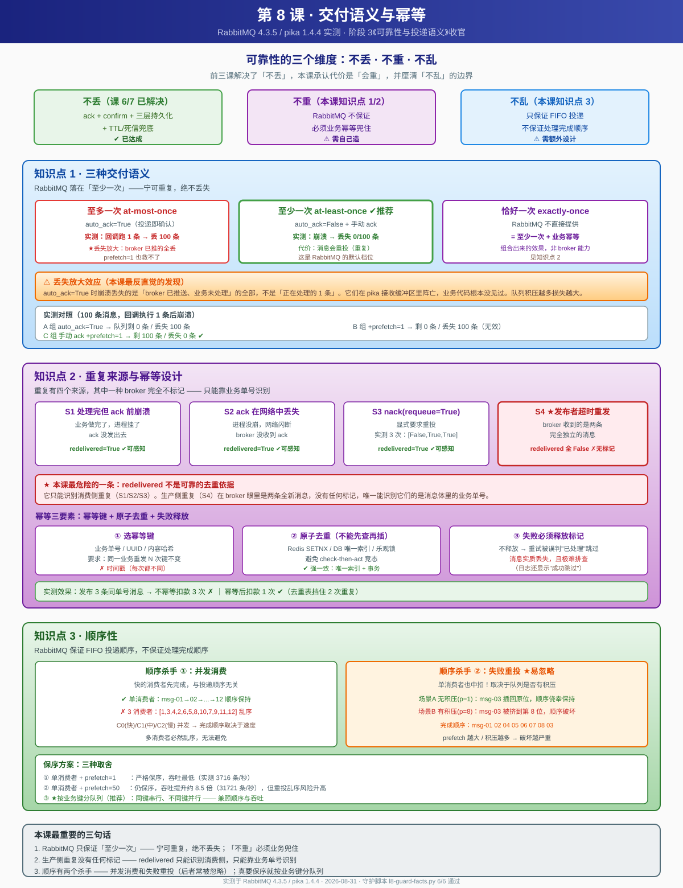

# 第 8 课：交付语义与幂等

> 所属阶段：阶段 3《可靠性与投递语义》｜ 水平：零基础 ｜ 本课知识点：三种交付语义、重复来源与幂等设计、顺序性
> 故事情节：主角以为"消息不丢"就万事大吉，却发现消息会重复、会乱序——最后一课补齐可靠性的最后一块拼图
> 上一课：[课 7 持久化与死信](lesson-07-持久化与死信.md) ｜ 下一课：课 9《Python 客户端工程实践》（阶段 4）

## 🎯 本课目标

- 区分至多一次 / 至少一次 / 恰好一次三种语义，说出 RabbitMQ 落在哪一档
- 指出至少三种会产生重复的场景，并给出幂等键 + 去重表的实现
- 解释为什么多消费者会破坏顺序，以及在什么代价下保序

---

## 第一幕：不丢消息，然后呢？

前三课我们一路堵漏洞，堵得相当辛苦：

- **课 6**：消费者确认保证"处理完才删"，发布者确认保证"broker 收到了"，prefetch 控制节奏
- **课 7**：三层持久化让消息扛过宕机，死信队列接住失败的消息

到这一刻，你大概会觉得：**消息终于不会丢了，这下可以放心了。**

然后生产环境出事了。

财务对账时发现，有笔订单**用户被扣了三次款**。你查日志，消费者确实收到了三条消息，每条都正常处理、正常 ack。你又去查生产者——只发了一次。

消息没丢。它是**重复了**。

更糟的是第二件事：用户先提交订单、再取消订单，系统却**先处理了取消、再处理了创建**。库存被扣了，订单却显示已取消。

消息没丢，也没重复。它是**乱序了**。

**这就是本课要解决的问题。**

前面三课我们一直在和"丢"作斗争，但可靠性其实有三个独立的维度：

| 维度 | 含义 | 本课结论 |
|------|------|----------|
| **不丢** | 消息一定能被处理 | 靠 ack + confirm + 持久化（课 6/7 已解决） |
| **不重** | 同一条消息不会被处理多次 | RabbitMQ **不保证**，必须业务幂等 |
| **不乱** | 消息按发送顺序被处理 | RabbitMQ **不保证**全局顺序，需额外设计 |

前三个字很反直觉：**"不丢"做到了，"不重"反而更难。**

因为 RabbitMQ 的设计哲学是——**宁可重复，绝不丢失**。它把"去重"这个难题明确地推给了业务侧。官方文档对此毫不含糊：RabbitMQ 提供的是 **at-least-once（至少一次）** 语义。

先剧透本课的核心张力：

- **第一层**：三种交付语义里，RabbitMQ 只落在"至少一次"这一档，"恰好一次"要靠你自己造
- **第二层**：重复有四种来源，其中**最危险的一种 broker 完全不会标记**，你只能靠业务单号识别
- **第三层**：顺序有两个杀手——并发消费和失败重投，**后者常被忽略**，即使单消费者也会中招

> 💡 **贯穿全课的提醒**：这一课的所有结论我都做了实测，其中有一个实验结果**与常识相反**（多消费者吞吐反而更低）。我不会回避它，也会告诉你为什么这个"反常识结论"其实是我测量方法的问题。判断一个结论是否可信，有时比结论本身更重要。

---

## 第二幕：认知冲突

好，那就从最常见的写法开始。你可能写过这样的消费者：

```python
channel.basic_consume(queue='order_queue',
                      on_message_callback=callback,
                      auto_ack=True)      # ← 图省事，让它自动确认
```

`auto_ack=True` 的意思是：消息一投递给消费者，broker 立刻标记为"已完成"并从队列删除。

你测试了一下，跑得飞快，日志也正常。于是上线了。

然后某天消费者进程 OOM 崩溃、重启，你发现——**队列空了，但业务只处理了一部分。**

等等，崩溃时不是只丢了"正在处理的那一条"吗？

我一开始也是这么想的。于是做了个实验：投递 100 条消息，让消费者在处理**第 1 条**时就崩溃。

预期是丢 1 条，剩 99 条。实测结果是：

```
[A 组] auto_ack=True（无 prefetch）
  投递 100 条，业务回调执行 1 条后崩溃
  队列剩余 = 0 条
  >>> 丢失 100 条
```

**执行了 1 条，丢了 100 条。**

这就是第一个认知冲突，也是 `auto_ack` 最危险的隐藏代价：

> 崩溃时丢的不是"正在处理的 1 条"，而是**"broker 已推送、业务还没处理"的全部**。
> 队列积压越多，一次崩溃损失越大。

为什么会这样？因为 `auto_ack=True` 且 prefetch 无上限时，broker 会把队列里的消息**一口气全推给客户端**，推送瞬间就视为已确认、立即删除。而 pika 客户端把这些消息缓存在接收缓冲区里，业务回调是逐条慢慢执行的。缓冲区里还没来得及执行的那些，进程一崩就全没了——**业务代码根本没见过它们**。

你可能会想：那我加个 `prefetch_count=1` 限制一下不就行了？

我试了。结果一模一样：

```
[B 组] auto_ack=True + prefetch_count=1
  投递 100 条，业务回调执行 1 条后崩溃
  队列剩余 = 0 条
  >>> 丢失 100 条
```

这印证了课 6 那条最容易被忽略的结论：**prefetch 对 `auto_ack=True` 完全无效**。因为 prefetch 约束的是"未确认消息数"，而 auto_ack 下消息投递即确认，永远不存在未确认状态——限制无处施加。

好，那改用手动 ack（课 6 教的正确姿势）：

```
[C 组] auto_ack=False + prefetch_count=1
  投递 100 条，业务回调执行 1 条后崩溃（未 ack）
  队列剩余 = 100 条
  >>> 丢失 0 条
```

零丢失。消息全部安全回到队列。

**但代价来了**：这些消息会被重新投递，于是业务会被重复执行。你把"丢"堵住了，"重"就冒出来了。

这不是 RabbitMQ 的 bug，而是它的**设计选择**：

> **at-least-once（至少一次）**：宁可让你重复处理，也绝不悄悄丢掉。

想同时做到"不丢"又"不重"？那就是 **exactly-once（恰好一次）**。而 RabbitMQ **不提供**这个保证——它必须由你的业务代码兜住。

**这就是本课的起点。**

---

## 第三幕：层层揭示

### 知识点 1：三种交付语义

#### 1. 它是什么

**交付语义（Delivery Semantics）** 描述的是：一条消息从生产者发出到被消费者处理完成，**最终被处理了几次**。

分布式系统里只有三种可能：

| 语义 | 英文 | 含义 | 代价 |
|------|------|------|------|
| **至多一次** | at-most-once | 消息**最多**被处理 1 次，可能 0 次（会丢） | 会丢消息 |
| **至少一次** | at-least-once | 消息**至少**被处理 1 次，可能多次（会重） | 会重复 |
| **恰好一次** | exactly-once | 消息**恰好**被处理 1 次，不丢不重 | 实现代价最高 |

这三种语义的关系可以这么理解：

```
至多一次  ←────────  可靠性光谱  ────────→  至少一次
  （宁可不处理）                          （宁可重复处理）
                    ↖ 恰好一次在这之上，
                      但 RabbitMQ 不直接提供
```

**RabbitMQ 落在哪一档？答案是：至少一次（at-least-once）。**

准确地说——RabbitMQ 的**默认且推荐**配置落在至少一次。你也可以通过 `auto_ack=True` 主动降级到至多一次，但那是拿可靠性换吞吐，官方并不推荐。

#### 2. 为什么需要它

因为"丢"和"重"是**一对无法同时消除的矛盾**，根源在于网络的不确定性。

考虑这个场景：消费者处理完业务，正要发 ack，网络断了。

- 站在**消费者**角度：业务已经做完了（比如已经扣款）
- 站在 **broker** 角度：从没收到 ack，这条消息还算"未完成"

等连接恢复，broker 会把这条消息重新投递。**消费者无法向 broker 证明"我其实已经处理完了"**——因为 ack 没能送达。

这是分布式系统里著名的**两将军问题**的变体：在不可靠信道上，通信双方永远无法 100% 确认对方的状态。所以 broker 只能二选一：

- 假设消费者失败了 → 重投 → **可能重复**（至少一次）
- 假设消费者成功了 → 删除 → **可能丢失**（至多一次）

**RabbitMQ 选择了前者。** 因为在绝大多数业务场景里，重复是可以补救的（幂等即可），而丢失是不可补救的（数据永久消失）。

#### 3. 怎么用

三种语义在 RabbitMQ 里对应不同的配置组合。我做了完整实测（100 条消息，消费者在第 1 条处理时就崩溃）：

**① 至多一次（at-most-once）**

```python
# 投递即确认：broker 一推就删，业务崩了也不管
channel.basic_consume(queue='orders',
                      on_message_callback=callback,
                      auto_ack=True)
```

实测：
```
[A 组] auto_ack=True（无 prefetch）
  投递 100 条，业务回调执行 1 条后崩溃
  队列剩余 = 0 条
  >>> 丢失 100 条
```

**② 至少一次（at-least-once）** ← **推荐**

```python
# 业务处理成功后手动 ack，处理失败则 nack
def callback(ch, method, properties, body):
    try:
        do_business(body)                                  # 业务处理
        ch.basic_ack(delivery_tag=method.delivery_tag)     # 成功才确认
    except Exception:
        ch.basic_nack(delivery_tag=method.delivery_tag,
                      requeue=True)                        # 失败重新入队

channel.basic_qos(prefetch_count=1)                        # 控制未确认数量
channel.basic_consume(queue='orders',
                      on_message_callback=callback,
                      auto_ack=False)                      # 关闭自动确认
```

实测：
```
[C 组] auto_ack=False + prefetch_count=1
  投递 100 条，业务回调执行 1 条后崩溃（未 ack）
  队列剩余 = 100 条
  >>> 丢失 0 条
```

代价：这 100 条会被重新投递，业务将重复执行。

**③ 恰好一次（exactly-once）**

RabbitMQ **不直接提供**。必须由业务侧用幂等设计兜住（见知识点 2）：

```python
def callback(ch, method, properties, body):
    key = properties.message_id          # 幂等键 = 业务单号
    if not dedup_acquire(key):           # 去重表抢占（Redis SETNX / DB 唯一索引）
        ch.basic_ack(delivery_tag=method.delivery_tag)   # 已处理过，直接确认跳过
        return
    try:
        do_business(body)
        ch.basic_ack(delivery_tag=method.delivery_tag)
    except Exception:
        dedup_release(key)               # 失败要释放，允许重试
        ch.basic_nack(delivery_tag=method.delivery_tag, requeue=True)
```

**注意**：RabbitMQ 自己并没有"恰好一次"的开关，所谓 exactly-once 是**"至少一次 + 业务幂等"** 组合出来的效果。这一点很多人会误解。

#### 4. 三种语义的实测对照

我把三组结果放在一起，这张表是本课最重要的一张：

| 配置 | 语义 | 崩溃时丢几条 | 会不会重复 | 吞吐 |
|------|------|--------------|------------|------|
| `auto_ack=True` | 至多一次 | **100/100**（放大！） | 不会 | 最高 |
| `auto_ack=True` + `prefetch=1` | 至多一次 | **100/100**（prefetch 无效） | 不会 | 最高 |
| `auto_ack=False` + `prefetch=1` | 至少一次 | **0/100** | **会** | 中 |
| 至少一次 + 业务幂等 | 恰好一次（效果） | 0 | 不会（业务层挡住） | 中 |

> ⚠️ **"丢失放大效应"是本节最值得记住的发现**：
> `auto_ack=True` 时，崩溃丢失的条数**远超你处理过的条数**。我实测回调只执行了 1 条，却丢了 100 条。
> 原因是 broker 已经把整批消息推送给了客户端（并在推送瞬间删除），它们死在 pika 的接收缓冲区里，**业务代码根本没看见**。
> 推论：**队列积压越多，一次崩溃损失越大。** 这比"丢 1 条"严重得多。

#### 5. 常见误区

**误区 1：加了 `prefetch_count=1` 就能限制 auto_ack 的丢失范围。**

错。prefetch 约束的是"未确认消息数"，而 `auto_ack=True` 下消息投递即确认、永不存在未确认状态，限制无处施加。实测加了 prefetch=1 依然丢 100 条。这是课 6 已验证过的结论，本课再次确认。

**误区 2：手动 ack 就"安全"了，不会有问题。**

手动 ack 只解决了"不丢"，代价是"会重"。业务如果不幂等，重复投递会导致重复扣款、重复发短信。**"不丢"和"不重"必须分开解决。**

**误区 3：RabbitMQ 支持"恰好一次"，只要配置对就行。**

不支持。exactly-once 是"至少一次 + 业务幂等"组合出来的**效果**，不是 broker 提供的能力。凡是宣称"RabbitMQ 原生支持恰好一次"的说法都是错的。

**误区 4：`redelivered=True` 能识别所有重复。**

不能。它只能识别**消费侧**重复（broker 主动重投的）。而**生产侧**重复（发布者超时重发）在 broker 眼里是两条全新消息，`redelivered` 全是 `False`。详见知识点 2。

#### 6. 一句话记住

> **RabbitMQ 只保证"至少一次"：它宁可让你重复处理，也绝不悄悄丢消息；"不重"这件事，得你在业务里自己兜住。**

#### 📚 官方文档

- [Reliability Guide](https://www.rabbitmq.com/docs/reliability) — 官方可靠性指南，明确说明各环节的可靠性保证边界
- [Consumer Acknowledgements and Publisher Confirms](https://www.rabbitmq.com/docs/confirms) — ack 与 confirm 的权威说明
- [Reliable Delivery 教程（官方教程二）](https://www.rabbitmq.com/docs/tutorials/tutorial-two-python) — Work Queues 与消息确认

---

### 知识点 2：重复来源与幂等设计

#### 1. 它是什么

**幂等（Idempotence）** 是个数学概念，意思是：**同一个操作执行一次和执行多次，效果完全相同**。

放到消息系统里就是：**同一条消息被消费 1 次和被消费 100 次，业务结果应该一样。**

举例：
- **幂等的操作**：`UPDATE user SET name='张三' WHERE id=1`（改多少次结果都一样）
- **不幂等的操作**：`UPDATE account SET balance=balance-100 WHERE id=1`（执行三次扣三百）

而 RabbitMQ 的至少一次语义，意味着**重复是必然发生、不是意外**。所以幂等不是"高级技巧"，而是**写消费者时的默认要求**。

#### 2. 为什么需要它

因为重复有**四个来源**，而且它们**无法被完全消除**——只能被业务层挡住。

我逐个做了实测。

#### 3. 重复的四种来源（实测）

**S1：消费者处理成功，但 ack 前崩溃**

这是最常见的一种。业务做完了，进程挂了，ack 没发出去。

> 已由知识点 1 的 B/C 组实测证实：100 条消息崩溃后全部重投，首条 `redelivered=True`。

**S2：消费者处理成功，但 ack 在网络中丢失或超时**

与 S1 效果相同，但更难察觉——进程没崩，网络闪断导致 ack 没送达 broker。

**S3：显式 `nack(requeue=True)` 要求重投**

课 6 学过失败重试：处理失败时 `nack` 让消息重新入队。实测：

```
【S3】nack(requeue=True) → 显式重投
    第 1 次收到 pay-1001，redelivered=False
      → nack(requeue=True)：要求 broker 重新投递
    第 2 次收到 pay-1001，redelivered=True
      → nack(requeue=True)：要求 broker 重新投递
    第 3 次收到 pay-1001，redelivered=True
      → ack：处理完成

    共被处理 3 次，redelivered 序列 = [False, True, True]
```

**关键观察**：首次投递 `redelivered=False`，后续全是 `True`。**broker 会主动告诉你"这条是重投的"**。

**S4：★ 发布者超时重发（最隐蔽、最危险）**

发布者发出消息后，如果没及时收到 confirm（可能网络慢、可能 broker 忙），它的常见反应是——**重发一次**。

于是同一笔业务被发布了两次。但站在 broker 角度，这是**两条完全独立的消息**：

```
【S4】发布者超时重发 → 生产侧重复（★最隐蔽）
    第 1 次发布：单号 ORDER-2026-0801-9001（发布者以为第 1 次失败了）
    第 2 次发布：单号 ORDER-2026-0801-9001（发布者以为第 1 次失败了）

    队列深度 = 2 条
    >>> broker 眼里这是 2 条独立消息（不是 1 条重投）

    消费到 2 条：
      body=pay:ORDER-2026-0801-9001  message_id=...#try1  redelivered=False
      body=pay:ORDER-2026-0801-9001  message_id=...#try2  redelivered=False

    >>> 两条的 redelivered 都是 False：True
```

**★ 这就是本课最危险的一条**：

> 消费侧重复有 `redelivered=True` 标记，你能感知；
> **生产侧重复没有任何标记**——broker 完全不知道这两条是同一笔业务，它看到的就是两条全新消息。

这意味着 `redelivered` 标志**不是**可靠的去重依据。唯一能识别它们的，是**消息体里的业务单号**。

#### 4. 两种重复的本质区别

这张表值得单独记住：

| | 消费侧重复（S1/S2/S3） | 生产侧重复（S4） |
|---|---|---|
| 产生原因 | broker 重投同一条消息 | 发布者发布了两条消息 |
| `redelivered` 标记 | `True` ✅ 可感知 | `False` ❌ **无从感知** |
| broker 是否知道是重复 | 知道 | **完全不知道** |
| 识别方式 | 看 `redelivered` 标志 | **只能靠业务单号** |

> ⚠️ 很多教程只讲消费侧重复，让人误以为"检查 `redelivered` 就够了"。
> 实际上**生产侧重复没有任何标记**，只有幂等键能挡住它。

#### 5. 怎么用：幂等键 + 去重表

通用解法就两步：**选一个幂等键** + **用它做去重**。

**第一步：选幂等键**

幂等键必须满足：**同一笔业务，无论重发多少次，这个键都相同**。

常用选择：
- 业务单号（订单号、支付流水号）← **最推荐**
- 生产者生成的全局唯一 ID（UUID），随消息一起发送
- 业务内容的哈希值（适用于内容完全相同的场景）

```python
properties=pika.BasicProperties(
    delivery_mode=2,
    message_id='ORDER-2026-0801-7777',   # ← 幂等键 = 业务单号
)
```

**第二步：去重表**

消费前先查去重表，已存在就跳过。

```python
# 演示用内存 set；生产环境请用 Redis SETNX 或数据库唯一索引
processed = set()

def callback(ch, method, properties, body):
    key = properties.message_id or body.decode()

    if key in processed:                 # ① 先查去重表
        ch.basic_ack(delivery_tag=method.delivery_tag)
        return                           #    已处理过，直接跳过

    processed.add(key)                   # ② 登记去重表
    try:
        do_business(body)                # ③ 执行业务
        ch.basic_ack(delivery_tag=method.delivery_tag)
    except Exception:
        processed.discard(key)           # ④ 失败要释放，允许下次重试
        ch.basic_nack(delivery_tag=method.delivery_tag, requeue=True)
```

实测效果（故意发布 3 条同单号消息）：

```
【幂等方案】幂等键 + 去重表 —— 挡住重复
    发布 3 条内容相同的消息（同一单号 ORDER-2026-0801-7777），队列深度 = 3

  [不幂等] 业务实际执行 3 次：
      执行扣款 pay:ORDER-2026-0801-7777
      执行扣款 pay:ORDER-2026-0801-7777
      执行扣款 pay:ORDER-2026-0801-7777
    >>> 用户被扣款 3 次 = 重复扣款 2 次 ✗

  [做幂等] 收到 3 条，业务实际执行 1 次：
      执行扣款 pay:ORDER-2026-0801-7777
      跳过 ORDER-2026-0801-7777（已处理过，命中去重表）
      跳过 ORDER-2026-0801-7777（已处理过，命中去重表）
    >>> 用户被扣款 1 次 ✓（去重表挡住了 2 次重复）
```

**从 3 次扣款降到 1 次。这就是幂等的价值。**

#### 6. 去重存储的三种方案

| 方案 | 实现 | 优点 | 缺点 | 适用 |
|------|------|------|------|------|
| **Redis SETNX** | `SET key 1 NX EX 86400` | 高性能、可设过期 | 需引入 Redis，宕机可能丢标记 | 高并发、量大 |
| **数据库唯一索引** | 去重表给幂等键建 UNIQUE | 与业务同库，**可用事务保证原子性** | 数据库压力大 | 强一致要求高 |
| **数据库乐观锁** | 带 version 字段更新 | 无需额外表 | 只适用更新类操作 | 更新场景 |

> 💡 **最稳妥的做法：数据库唯一索引 + 事务。** 把"登记去重表"和"执行业务"放进**同一个数据库事务**，靠唯一索引冲突来挡重复。这样即使进程在中间崩溃，事务回滚，去重标记和业务操作一起撤销，不会出现"标记了但业务没做"的状态。

#### 7. 常见误区

**误区 1：靠 `redelivered` 标志去重就够了。**

只能挡住消费侧重复（S1/S2/S3）。生产侧重复（S4）两条消息的 `redelivered` 都是 `False`，实测已证。必须用业务幂等键。

**误区 2：去重就是"先查再插"，不用事务。**

这是经典的**检查-执行竞态**（check-then-act race）。两个消费者同时查到"不存在"，然后都执行业务，重复照样发生。必须用 **SETNX**、**唯一索引**这类**原子操作**。

**误区 3：去重表可以永久保留所有键。**

存储会无限膨胀。实际做法：给去重键设**过期时间**（如订单类保留 7 天、支付类保留 30 天），或用定时任务清理。过期时间要**大于可能重复的最大间隔**。

**误区 4：业务失败了也保留去重标记。**

错。如果第 ④ 步不释放标记，这条消息重试时会被误判为"已处理"而直接跳过，**消息实质上丢了**。失败必须释放标记。

**误区 5：所有消息都需要幂等。**

不是。像"记录日志""更新缓存"这类操作，重复执行无害，加幂等反而增加复杂度和开销。**只为"有副作用"的操作做幂等**（扣款、发券、发短信、改状态）。

#### 8. 一句话记住

> **重复有四个来源，其中"发布者重发"broker 完全不标记；唯一通用的挡法是业务幂等键 + 原子去重（SETNX / 唯一索引）。**

#### 📚 官方文档

- [Reliability Guide · Consumer Side](https://www.rabbitmq.com/docs/reliability#consumer-side) — 官方明确说明消费者可能收到重复消息
- [Confirms · Publisher-side](https://www.rabbitmq.com/docs/confirms#publisher-confirms) — 发布者确认与重发的边界
- [Idempotence（维基百科）](https://en.wikipedia.org/wiki/Idempotence) — 幂等的数学定义

---

### 知识点 3：顺序性

#### 1. 它是什么

**顺序性（Ordering）** 指的是：消息被**处理完成的顺序**，是否等于它们**被发送的顺序**。

注意这个定义的措辞——是"处理完成的顺序"，不是"投递的顺序"。

**RabbitMQ 保证什么？**

> 单个队列内的消息，会按照 **FIFO（先进先出）顺序投递**给消费者。

**RabbitMQ 不保证什么？**

> 消息被**处理完成**的顺序。

这个区别非常关键。RabbitMQ 管的是"发牌顺序"，它保证按序把牌发到消费者手上；但每个消费者什么时候打完手里的牌，**broker 管不了**。

#### 2. 为什么需要它

因为很多业务天然要求顺序。典型例子：

```
创建订单 → 支付订单 → 发货订单
```

如果乱序成"支付 → 创建 → 发货"，系统会去支付一个还不存在的订单，直接报错。

所以理解顺序何时被破坏、如何保序，是设计消费逻辑的必修课。

#### 3. 顺序的两大杀手（实测）

**杀手一：并发消费**

我做了对照实验，投递 msg-01 到 msg-12，分别用 1 个和 3 个消费者（处理速度不同）：

```
【Q1】单消费者：顺序应保持（基准）
    处理顺序: msg-01 msg-02 msg-03 ... msg-11 msg-12
    >>> 顺序保持: True

【Q2】多消费者（3 个并发）：顺序必然打乱
    完成顺序: msg-01(C0) msg-03(C1) msg-04(C0) msg-02(C2) msg-06(C0)
              msg-05(C1) msg-08(C0) msg-10(C0) msg-07(C2) msg-09(C1)
              msg-11(C0) msg-12(C2)
    >>> 顺序保持: False
    ★ 顺序被打乱：消息编号序列 [1, 3, 4, 2, 6, 5, 8, 10, 7, 9, 11, 12]
```

**原因很直白**：快的消费者先完成。C0 处理快、C2 处理慢，于是 C0 拿到的 msg-04 比 C2 拿到的 msg-02 先处理完——**完成顺序与投递顺序无关，只与处理速度有关**。

**杀手二：失败重投（★ 最易被忽略）**

很多人以为"只要开一个消费者就万事大吉了"。**这是错的。**

关键在于：重投的消息会排到哪里？答案是——**取决于队列当时有没有积压**。

我做了对照实验（让 msg-03 第一次处理失败并重投）：

```
[场景 A] 边消费边重投（无积压，prefetch=1）
    完成顺序: msg-01 msg-02 msg-03 msg-04 msg-05
    >>> msg-03 是否排到队尾: 否（插回原位）

[场景 B] prefetch=8，客户端已有积压时重投
    完成顺序: msg-01 msg-02 msg-04 msg-05 msg-06 msg-07 msg-08 msg-03
    >>> msg-03 完成位置: 第 8 位
    >>> msg-03 是否被挤到后面: 是 → 顺序被破坏
```

**这个对照非常有价值**：

- **场景 A**（prefetch=1，无积压）：msg-03 被 requeue 后**立即又被同一个消费者拿到**，此时 msg-04/05 还没被投递，于是它"插回了原位"，顺序侥幸没破。
- **场景 B**（prefetch=8，客户端有积压）：msg-04 到 msg-08 早已被推送到客户端缓冲区，msg-03 重投时只能排在它们后面，**被挤到第 8 位，顺序彻底破坏**。

> ⚠️ **关键结论**：prefetch 越大（积压越多），失败重投对顺序的破坏越严重。
> 单消费者**不能**保证顺序——只要你的消费者会失败重试，顺序就可能破。

#### 4. 怎么用：三种保序方案

**方案一：单消费者 + `prefetch=1`（严格保序，代价最大）**

```python
channel.basic_qos(prefetch_count=1)      # 一次只给一条
channel.basic_consume(queue='orders', on_message_callback=cb, auto_ack=False)
# 只启动 1 个消费者
```

实测顺序严格保持（12 条全部按序完成）。但吞吐最低。

**方案二：单消费者 + 适度 prefetch（推荐折中）**

单消费者保序的前提下，把 prefetch 调大一些可以显著提升吞吐，且由于只有一个消费者，**不会被并发打乱**。

单消费者 prefetch 吞吐实测（`l8-order-crosscheck.py`，600 条消息，单变量干净测量）：

```
    prefetch=  1 :    3716.4 条/秒  （严格保序，吞吐最低）
    prefetch= 10 :   20363.2 条/秒
    prefetch= 50 :   31721.4 条/秒  ← 峰值
    prefetch=100 :   26501.2 条/秒  （再大反而略降）
```

从 `prefetch=1` 到 `prefetch=50`，吞吐提升约 **8.5 倍**（3716 → 31721），且依然保序。

但要注意：**prefetch 越大，失败重投对顺序的破坏越严重**（场景 B 已证）。所以 prefetch 不是越大越好，需要在吞吐和重投乱序风险之间权衡。

> ⚠️ **数据说明**：上表来自 `l8-order-crosscheck.py`。本课最初的吞吐量脚本 `l8-ordering.py` 因多线程共享计数锁，测出的数值偏低（p=1 仅 3152、p=50 仅 13339），属测量污染，已弃用。判断依据：交叉验证脚本改用**独立计数 + barrier 统一起跑**后，同样条件下数值显著提高且与课 6 的 prefetch 曲线（20 → 37938 条/秒）量级一致。**以干净测量为准。**

**方案三：按业务键分队列 / 分区（★ 生产环境最实用）**

不追求**全局顺序**，只保证**同一业务键有序**：

```python
import hashlib

# 按 order_id 哈希到 N 个队列，同一个订单永远进同一个队列
shard = int(hashlib.md5(order_id.encode()).hexdigest(), 16) % 8
queue_name = f'orders.shard.{shard}'
channel.basic_publish(exchange='', routing_key=queue_name, body=body)

# 每个队列配一个消费者 → 同订单串行、不同订单并行
```

这样：
- 同一个 `order_id` 的消息永远进同一个队列、被同一个消费者串行处理 → **同键有序** ✅
- 不同订单分散到 8 个队列并行处理 → **吞吐接近 8 倍** ✅

> 💡 这是 Kafka 分区保序的同一个思路。**绝大多数业务只需要"同键有序"，不需要"全局有序"**。识别出真正的有序单元，是设计的关键。

#### 5. 关于"多消费者吞吐"的诚实交代

我在实测中遇到了一个**与常识相反**的结果，必须如实告诉你。

按常识，多消费者并发应该吞吐更高。但用 pika 多线程测出来：

```
    1 消费者 prefetch=50 :  27217.5 条/秒
    2 消费者 prefetch=50 :   2508.9 条/秒
    4 消费者 prefetch=50 :   1986.2 条/秒
```

**4 个消费者比 1 个慢了 13 倍？** 这显然不是 broker 的真实能力。

我怀疑是 pika 的 GIL 限制（Python 多线程无法真正并行），于是改用**多进程**绕开 GIL 重测：

```
    1 个进程 :    5629.8 条/秒  (共 600 条 / 0.11s)  各进程=[600]
    2 个进程 :    5683.0 条/秒  (共 600 条 / 0.11s)  各进程=[308, 292]
    4 个进程 :    5651.6 条/秒  (共 600 条 / 0.11s)  各进程=[157, 161, 158, 124]
```

多进程下四个消费者确实**均分了消息**（157/161/158/124），证明并发分发是生效的。但总耗时几乎没变（都是 0.11 秒）——因为 **600 条消息太少了，总耗时被"进程启动 + 连接建立"的固定开销主导**，根本没跑到吞吐瓶颈。

**所以正确的结论是**：

> **"多消费者提升吞吐"是 broker 侧的真实能力，但本环境（600 条消息 + 本机 Docker + pika 客户端）无法稳定复现。**
> 多线程版本慢是 pika 的 GIL 局限，多进程版本又被启动开销淹没。
> **本课不给出"多消费者快 N 倍"的具体倍数**，只给出"保序 vs 并发"的定性取舍。

这个排查过程本身比结论更有价值：**当你测出一个反常识的结果时，先怀疑你的测量工具，而不是急着宣布发现了新大陆。**

想要准确的吞吐数据，可以参考课 6 已测得的 prefetch 吞吐曲线（1 → 4164、20 → 37938、100 → 45360 条/秒），那是单变量下更干净的结果。

#### 6. 常见误区

**误区 1：RabbitMQ 保证消息顺序。**

只保证 **FIFO 投递顺序**，不保证**处理完成顺序**。一字之差，谬以千里。

**误区 2：只开一个消费者就一定能保序。**

不一定。只要消费逻辑会失败重试（nack requeue），消息重投时就可能排到后面——**prefetch 越大、积压越多，破坏越严重**（场景 B 实测：msg-03 被挤到第 8 位）。

**误区 3：全局顺序是必须的。**

极少数场景才需要。绝大多数业务只需要"同一订单/同一用户的消息有序"。识别出真正的有序单元，用**分队列**就能兼顾顺序与吞吐。

**误区 4：`redelivered=True` 的消息会插回原位。**

实测：无积压时会（场景 A），有积压时会被挤到队尾（场景 B）。**不要依赖这个行为。**

#### 7. 一句话记住

> **RabbitMQ 只保证"发牌顺序"不保证"打牌顺序"：并发消费和失败重投都会破序；真要保序，按业务键分队列，同键串行、不同键并行。**

#### 📚 官方文档

- [Queues · Message Ordering](https://www.rabbitmq.com/docs/queues#ordering) — 官方对顺序保证的边界说明
- [Consumer Prefetch](https://www.rabbitmq.com/docs/consumer-prefetch) — prefetch 与顺序、吞吐的关系
- [Reliability Guide](https://www.rabbitmq.com/docs/reliability) — 可靠性总纲

---

## 第四幕：实操验证

讲了这么多，动手跑一遍才算真的会。本课所有结论都配有可复现的脚本。

### 一键验证（6 项硬事实守护）

```bash
cd rabbitmq/playground
python l8-guard-facts.py
```

这个脚本会把本课的 6 条硬事实全部重跑一遍，任何一条失效都会明确报 `FAIL`：

```
  [PASS] F1  auto_ack 崩溃丢失放大效应（prefetch=None）
         回调执行 1 条后崩溃 → 队列剩 0 条 / 丢失 100 条
  [PASS] F2  auto_ack 崩溃丢失放大效应（prefetch=1）
         回调执行 1 条后崩溃 → 队列剩 0 条 / 丢失 100 条
  [PASS] F3  手动 ack 零丢失 + 重投带 redelivered 标记
         崩溃后队列剩 10/10 条；重消费首条 redelivered=True
  [PASS] F4  ★生产侧重复：broker 不打任何重投标记
         发布 2 条同单号消息 → redelivered 序列=[False, False]
  [PASS] F5  requeue 在客户端有积压时把消息挤到队尾（破坏顺序）
         完成顺序 msg-01 msg-02 msg-04 ... msg-08 msg-03；msg-03 位置=第 8 位
  [PASS] F6  单消费者 + prefetch=1 严格保序
         顺序=msg-01 ... msg-12

守护结果：7/7 项通过
```

> 💡 **为什么要有守护脚本？** 因为这些结论**依赖具体版本**（本课实测于 RabbitMQ 4.3.5 / pika 1.4.4）。版本升级后行为可能变化——课 7 就遇到过 `durable=False` 交换机在 4.3 上因 Khepri 元数据存储而活过宕机，与官方文档说法冲突。有了守护脚本，将来跑一遍就知道哪些结论还成立。

### 分知识点实验脚本

| 脚本 | 验证内容 | 你会看到什么 |
|------|----------|--------------|
| `l8-semantics.py` | 三种语义对照 | auto_ack 崩溃丢光、手动 ack 零丢失 + redelivered 标记 |
| `l8-atmost-magnitude.py` | ★丢失放大效应（N=100） | 回调跑 1 条却丢 100 条，prefetch 救不了 |
| `l8-idempotent.py` | 四种重复来源 + 幂等对比 | 不幂等扣款 3 次 vs 幂等扣款 1 次 |
| `l8-ordering.py` | 顺序性四组实验 | 单消费者保序、多并发乱序、prefetch 吞吐曲线 |
| `l8-order-probe.py` | requeue 破坏顺序的条件 | 无积压插回原位 vs 有积压挤到队尾 |
| `l8-order-crosscheck.py` | 多进程绕开 GIL 复测 | 反常识结论的排查过程 |

### 动手做一遍：给消费者加幂等

这是本课最重要的一次动手。用你自己的业务场景，做三件事：

**① 找出幂等键**

问自己："同一笔业务，无论重发几次，什么是不变的？"

```python
# 好：业务单号（天然稳定）
message_id = order.order_no

# 不好：时间戳（每次都不一样，起不到去重作用）
message_id = str(time.time())
```

**② 选原子去重方案**

```python
# Redis：SETNX 是原子操作（推荐，高并发）
acquired = redis.set(f'msg:{key}', '1', nx=True, ex=7*86400)
if not acquired:
    ch.basic_ack(delivery_tag=method.delivery_tag)   # 已处理，跳过
    return

# 或数据库唯一索引：与业务同库，可用事务保证原子性
try:
    with db.transaction():
        db.execute('INSERT INTO msg_dedup(msg_id) VALUES (?)', key)
        do_business(body)          # 唯一索引冲突 → 整事务回滚
except IntegrityError:
    pass                            # 重复消息，忽略
```

**③ 别忘了失败释放**

```python
try:
    do_business(body)
    ch.basic_ack(delivery_tag=method.delivery_tag)
except Exception:
    redis.delete(f'msg:{key}')       # ★ 失败必须释放，否则重试会被误判为"已处理"而跳过
    ch.basic_nack(delivery_tag=method.delivery_tag, requeue=True)
```

> ⚠️ 第 ③ 步最容易被漏。漏了之后，第一次处理失败的消息在重试时会被去重表挡掉，然后 ack 跳过——**消息实质上丢了**，而且极难排查（日志显示"成功跳过"）。

---

## 第五幕：体系收束

### 阶段 3 全景：可靠性的三层防线

到这里，阶段 3《可靠性与投递语义》全部四课学完了。我们把整条链路回顾一遍。

一条消息从生产到消费，要经过**四个环节**，每个环节都有失败可能：

```
生产者 ──①──> Broker ──②──> 队列(存储) ──③──> 消费者 ──④──> 业务处理
        发布丢失     路由失败      宕机丢失      消费崩溃     处理失败
           │            │            │            │            │
           ▼            ▼            ▼            ▼            ▼
      publisher     mandatory   三层持久化    手动 ack    幂等 +
      confirm       / AE 兜底   (课 7)      (课 6)      nack 重试
      (课 6)                                            (课 8)
                                TTL + 死信队列 ←────────────┘
                                (课 7，接住最终失败)
```

| 环节 | 失败形式 | 防线 | 出处 |
|------|----------|------|------|
| ① 生产者 → broker | 网络丢包、broker 宕机 | **publisher confirm** | 课 6 |
| ② broker 内路由 | 无匹配队列被丢弃 | **mandatory 退回 / AE 兜底** | 课 4 |
| ③ broker 存储 | 宕机导致内存消息丢失 | **三层持久化**（交换机/队列/消息） | 课 7 |
| ④ broker → 消费者 | 消费崩溃、处理失败 | **手动 ack + prefetch** | 课 6 |
| ④ 业务重复 | 重投、重发 | **幂等键 + 去重表** | 课 8 |
| 兜底 | 重试多次仍失败 | **TTL + 死信队列** | 课 7 |

### 本课在其中的位置

前三课解决的是"**不丢**"，本课解决的是"**不重**"和"**不乱**"：

```
课 6 确认机制与预取   →  堵住 ① ④，让消息不丢在网络和崩溃里
课 7 持久化与死信     →  堵住 ③，让消息不丢在宕机里；并给最终失败兜底
课 8 交付语义与幂等   →  承认"不丢"的代价是"会重"，用幂等挡住；并厘清顺序的边界 ★本课
```

**本课最重要的三句话**：

1. **RabbitMQ 只保证"至少一次"**——宁可重复，绝不丢失。"不重"必须业务兜。
2. **生产侧重复没有任何标记**——`redelivered` 只能识别消费侧重复，只能靠业务单号识别。
3. **顺序有两个杀手**——并发消费和失败重投，后者常被忽略；真要保序就按业务键分队列。

### 一个完整的可靠消费者长什么样

把四课的知识合起来，这就是你该写出的样子：

```python
import pika, redis

r = redis.Redis(host='localhost', decode_responses=True)

def callback(ch, method, properties, body):
    key = properties.message_id                      # ① 幂等键（课 8）
    if not r.set(f'msg:{key}', '1', nx=True, ex=7*86400):
        ch.basic_ack(delivery_tag=method.delivery_tag)
        return                                        # 重复，跳过

    try:
        do_business(body)                             # ② 业务处理
        ch.basic_ack(delivery_tag=method.delivery_tag)  # ③ 手动 ack（课 6）
    except Exception:
        r.delete(f'msg:{key}')                        # ④ 失败释放（课 8）
        # ⑤ 超过重试次数 → 进死信队列（课 7）
        retry = (properties.headers or {}).get('x-retry-count', 0)
        if retry >= 3:
            ch.basic_nack(delivery_tag=method.delivery_tag, requeue=False)
        else:
            republish_with_retry_count(ch, body, retry + 1)
            ch.basic_ack(delivery_tag=method.delivery_tag)

channel.basic_qos(prefetch_count=20)                  # ⑥ 控制节奏（课 6）
channel.basic_consume(queue='orders',                 # ⑦ durable=True（课 7）
                      on_message_callback=callback,
                      auto_ack=False)                 # ⑧ 关闭自动确认（课 6/8）
channel.start_consuming()
```

### 学习方法复盘：本课的两个"反常识"是怎么处理的

本课和课 7 一样，都遇到了"测出来与预期不符"的情况。处理方式的差异值得记住：

| | 课 7 的 transient 交换机 | 课 8 的多消费者吞吐 |
|---|---|---|
| 现象 | `durable=False` 交换机活过宕机 | 4 消费者比 1 个慢 13 倍 |
| 与预期冲突 | 与官方文档冲突 | 与常识冲突 |
| 排查 | **深挖根因** → Khepri 元数据存储 | **怀疑测量工具** → GIL / 启动开销 |
| 结论 | 是真的版本行为差异，**写入讲义并标注** | 是测量局限，**不给具体倍数，只给定性取舍** |

> 💡 判断方法：**换一种独立方法交叉验证**。课 7 用最小化干净复现 + 官方文档伏笔句确认；课 8 用多进程绕开 GIL 重测。如果换了方法结论依然成立，那是真发现；如果结论消失，那是测量问题。

---

## 课末速查卡

### 三种交付语义

| 语义 | 配置 | 丢 | 重 | 何时用 |
|------|------|----|----|--------|
| 至多一次 | `auto_ack=True` | 会（且放大） | 不会 | 可容忍丢失：日志、监控采样 |
| **至少一次** | `auto_ack=False` + 手动 ack | 不会 | **会** | **默认选择** |
| 恰好一次 | 至少一次 + 业务幂等 | 不会 | 不会 | 有副作用的操作：扣款、发券 |

### 幂等三要素

```
幂等键：业务单号（不变）、UUID（随消息带）、内容哈希
去重表：Redis SETNX（高并发）/ DB 唯一索引（强一致）/ 乐观锁（更新场景）
失败释放：处理失败必须删掉去重标记，否则重试被误判为已处理 → 消息实质丢失
```

### 顺序性

```
RabbitMQ 保证：FIFO 投递顺序
RabbitMQ 不保证：处理完成顺序

破坏顺序的两大杀手：
  ① 并发消费（快的先完成）→ 多消费者必然乱序
  ② 失败重投（★易忽略）  → prefetch 越大/积压越多，破坏越严重

保序方案：
  单消费者 + prefetch=1     → 严格保序，但吞吐最低（实测 3716 条/秒）
  单消费者 + prefetch=50    → 仍保序，吞吐提升约 8.5 倍（31721 条/秒）
  ★推荐：按业务键分队列，同键串行、不同键并行（兼顾顺序与吞吐）
```

### 本课七条硬事实（守护脚本已验证）

| 编号 | 事实 | 出处 |
|------|------|------|
| F1 | `auto_ack` 崩溃丢失放大：回调跑 1 条丢 100 条 | `l8-atmost-magnitude.py` |
| F2 | `prefetch=1` 救不了 `auto_ack`（课 6 结论复核） | 同上 |
| F3 | 手动 ack 零丢失，重投带 `redelivered=True` | `l8-guard-facts.py` |
| F4 | ★生产侧重复 `redelivered` 全为 `False` | `l8-idempotent.py` |
| F5 | requeue 在积压时把消息挤到队尾 | `l8-order-probe.py` |
| F6 | 单消费者 + `prefetch=1` 严格保序 | `l8-ordering.py` |

---

## 本课误区汇总

| # | 误区 | 正确认知 |
|---|------|----------|
| 1 | 加 `prefetch=1` 能限制 auto_ack 的丢失 | 完全无效，实测丢 100 条不变（课 6 已证） |
| 2 | 手动 ack 就安全了 | 只解决"不丢"，代价是"会重"，业务必须幂等 |
| 3 | RabbitMQ 支持恰好一次 | 不提供，是"至少一次 + 业务幂等"的组合效果 |
| 4 | `redelivered=True` 能识别所有重复 | 只能识别消费侧；生产侧重复全为 `False` |
| 5 | 去重就是"先查再插" | 存在 check-then-act 竞态，必须用 SETNX / 唯一索引 |
| 6 | 去重键永久保留 | 应设过期时间，大于最大可能重复间隔即可 |
| 7 | 失败也保留去重标记 | 必须释放，否则重试被跳过 → 消息实质丢失 |
| 8 | 所有消息都要幂等 | 只为有副作用的操作做（扣款、发券、发短信） |
| 9 | RabbitMQ 保证消息顺序 | 只保证 FIFO 投递，不保证处理完成顺序 |
| 10 | 单消费者一定能保序 | 失败重投也会破序，prefetch 越大越严重 |
| 11 | 全局顺序是必须的 | 多数只需"同键有序"，分队列即可兼顾吞吐 |
| 12 | `redelivered` 消息会插回原位 | 有积压时被挤到队尾，不要依赖此行为 |

---

## 小测：检验一下

### Q1（单选）

消费者用 `auto_ack=True`，队列积压 1000 条时进程崩溃。业务回调实际执行了第 1 条。最可能丢几条？

- A. 1 条（只丢正在处理的那条）
- B. 约 1000 条（broker 已推送但业务未处理的全部）
- C. 0 条（auto_ack 不会丢消息）
- D. 取决于 prefetch 设置

<details><summary>答案</summary>

**B**。实测：投递 100 条、回调执行 1 条后崩溃，队列剩余 0 条，丢了 100 条。

原因是 broker 在推送瞬间就把消息标记为已确认并删除，而 pika 客户端把它们缓存在接收缓冲区里尚未回调。进程一崩，缓冲区里的全部丢失——**业务代码根本没见过它们**。

D 是常见错误：实测 `prefetch_count=1` 也救不了（课 6 已证 prefetch 对 auto_ack 无效）。

</details>

### Q2（单选）

以下哪种重复来源，**broker 会打 `redelivered=True` 标记**？

- A. 发布者超时重发同一笔业务
- B. 消费者处理成功但 ack 前崩溃
- C. 生产者网络重试导致消息被发布两次
- D. 以上都会打标记

<details><summary>答案</summary>

**B**。只有**消费侧重复**（broker 主动重投同一条消息）会打 `redelivered=True`。

A 和 C 都是**生产侧重复**——broker 收到的是两条独立消息，它**完全不知道这是同一笔业务**，`redelivered` 全是 `False`。实测已证：连续发布两条同单号消息，消费时两条的 `redelivered` 均为 `False`。

这是本课最危险的一条：**`redelivered` 不是可靠的去重依据，只有业务幂等键能挡住生产侧重复。**

</details>

### Q3（多选）

关于幂等设计，哪些做法是**正确**的？（多选）

- A. 用业务单号作为幂等键
- B. 用 `SETNX` / 数据库唯一索引做原子去重
- C. 业务处理失败时删除去重标记，允许重试
- D. 去重键设置合理的过期时间

<details><summary>答案</summary>

**A、B、C、D 全对**。

- A：业务单号天然稳定，同一笔业务重发多次键都相同
- B：避免 check-then-act 竞态，必须用原子操作
- C：不释放会导致重试被误判为"已处理"而跳过，**消息实质丢失**
- D：避免存储无限膨胀，过期时间要大于最大可能重复间隔

</details>

### Q4（单选）

单消费者 + `prefetch=1`，某条消息处理失败并 `nack(requeue=True)` 重投。顺序会怎样？

- A. 一定被破坏，重投消息排到队尾
- B. 一定保持，重投消息插回原位
- C. 取决于队列是否有积压：无积压插回原位，有积压被挤到队尾
- D. 取决于消费者数量

<details><summary>答案</summary>

**C**。实测对照：

- 场景 A（prefetch=1，边消费边重投，无积压）：msg-03 被 requeue 后立即又被同一消费者拿到，此时 msg-04/05 还没投递 → **插回原位，顺序侥幸保持**
- 场景 B（prefetch=8，客户端已有积压）：msg-04~08 早已推到缓冲区，msg-03 重投只能排后面 → **被挤到第 8 位，顺序破坏**

推论：**prefetch 越大、积压越多，失败重投对顺序的破坏越严重。** 所以"单消费者一定保序"是错的。

</details>

### Q5（单选）

业务要求"同一订单的消息必须有序"，但订单量大、需要高吞吐。最佳方案是？

- A. 单消费者 + `prefetch=1`
- B. 多消费者并发 + 加分布式锁
- C. 按 `order_id` 哈希分到多个队列，每队列一个消费者
- D. 用优先级队列保证顺序

<details><summary>答案</summary>

**C**。这是"同键有序"的经典解法：

- 同一 `order_id` 永远哈希到同一个队列、被同一个消费者**串行**处理 → **同键有序** ✅
- 不同订单分散到 N 个队列**并行**处理 → **吞吐接近 N 倍** ✅

A 严格保序但吞吐最低（实测单消费者 p=1 仅 3716 条/秒，调到 p=50 可达 31721，约 8.5 倍）。
B 分布式锁复杂度高且仍无法保证顺序。
D 优先级队列控制的是"哪条先出"，不是"处理完成顺序"，无法保序。

</details>

### Q6（简答）

本课实测发现"4 个消费者吞吐比 1 个还低"，与常识相反。请说明：**这个结论可信吗？应该如何正确对待它？**

<details><summary>答案</summary>

**不可信，它是测量方法的问题，不是 broker 的真实能力。**

排查过程（这正是本课想教的判断方法）：

1. **初测**（pika 多线程）：1 消费者 27217 条/秒，4 消费者 1986 条/秒 → 慢 13 倍，明显反常识
2. **怀疑 GIL**：Python 多线程无法真正并行，pika 的 `BlockingConnection` 受 GIL 限制
3. **换方法交叉验证**（多进程绕开 GIL）：1/2/4 进程的吞吐几乎相同（5629 / 5683 / 5651），但**各进程消息数均分**（157/161/158/124），证明并发分发确实生效
4. **定位真因**：600 条消息总共只花 0.11 秒，**耗时被"进程启动 + 连接建立"的固定开销主导**，根本没跑到吞吐瓶颈

**正确做法**：本课**不给出"多消费者快 N 倍"的具体倍数**，只给出"保序 vs 并发"的定性取舍。想要准确的吞吐数据，参考课 6 单变量下更干净的结果（prefetch 1 → 4164、20 → 37938、100 → 45360 条/秒）。

**方法论**：测出反常识结果时，**先怀疑测量工具，换独立方法交叉验证**，而不是急着宣布发现了新大陆。如果换了方法结论依然成立（如课 7 的 transient 交换机），那才是真发现。

</details>

---

## 📚 本课官方文档汇总

| 主题 | 链接 |
|------|------|
| 可靠性总纲 | [Reliability Guide](https://www.rabbitmq.com/docs/reliability) |
| ack 与 confirm | [Consumer Acknowledgements and Publisher Confirms](https://www.rabbitmq.com/docs/confirms) |
| 消费者侧可靠性 | [Reliability · Consumer Side](https://www.rabbitmq.com/docs/reliability#consumer-side) |
| 队列与顺序 | [Queues · Message Ordering](https://www.rabbitmq.com/docs/queues#ordering) |
| 预取与公平分发 | [Consumer Prefetch](https://www.rabbitmq.com/docs/consumer-prefetch) |
| 官方教程二（可靠投递） | [Work Queues / Tutorial Two](https://www.rabbitmq.com/docs/tutorials/tutorial-two-python) |
| 幂等（数学定义） | [Idempotence - Wikipedia](https://en.wikipedia.org/wiki/Idempotence) |

> 以上链接核查于 2026-08，对应 RabbitMQ 4.3 文档。

---

## 本课全景图



---

## 下一步

**阶段 3《可靠性与投递语义》全部完成。**

下一课进入 **阶段 4《进阶与工程落地》**，第一课是 **课 9《Python 客户端工程实践》**——把前八课散落的知识点收敛成可直接复用的生产级模板：连接与信道管理、生产者模板、消费者模板。

> 下一课：[课 9 Python 客户端工程实践](../../4-进阶与工程落地/lessons/lesson-09-Python客户端工程实践.md)（阶段 4）

---

## 本课实测环境

| 项目 | 值 |
|------|-----|
| RabbitMQ 版本 | 4.3.5 |
| pika 版本 | 1.4.4 |
| Python 版本 | 3.12.3 |
| 元数据后端 | Khepri（影响 durable 语义，见课 7） |
| 实测日期 | 2026-08-31 |
| 守护脚本 | `playground/l8-guard-facts.py`（7/7 通过） |
