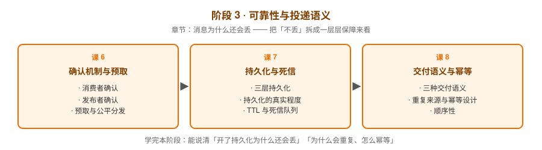

# 阶段 3：可靠性与投递语义

> 所属课程：RabbitMQ 系统学习 ｜ 故事章节：**消息为什么还会丢** ｜ 上一阶段：[阶段 2](../2-核心模型与上手/overview.md) ｜ 下一阶段：[阶段 4](../4-进阶与工程落地/overview.md)

## 🎯 本阶段目标

- 能说清「不丢消息」需要哪几层保障共同生效，以及为什么开了持久化仍可能丢
- 能正确使用消费者 ack、发布者 confirm、prefetch 三件套，并理解它们之间的权衡
- 能说清至少一次语义下重复从哪来，并设计出幂等的消费逻辑
- 能用 TTL + 死信队列实现延迟、重试与兜底

## 📍 学习重点

- **两个确认机制**：消费者 ack 保证"处理完才删"，发布者 confirm 保证"broker 收到了"——两条链路都要堵住
- **prefetch 是权衡**：预取值同时决定吞吐、内存占用和分发公平性，没有万能值
- **三层持久化**：交换机、队列、消息三个开关缺一不可，但持久化不等于绝对不丢（刷盘时机是关键）
- **死信队列**：消息过期、被拒、队列超长都会进死信——它是延迟、重试、兜底的公共基础设施
- **幂等是必修课**：RabbitMQ 只保证至少一次，"不重"必须由业务侧自己兜住

## ✅ 必须掌握的知识点

| 知识点 | 所属课 | 学完应能 |
|--------|--------|----------|
| 消费者确认 | 课 6 | 关闭 auto_ack，手写 ack / nack / reject，并解释 unacked 堆积意味着什么 |
| 发布者确认 | 课 6 | 开启 confirm 并处理 basic_ack / basic_nack，说清为什么不用事务 |
| 预取与公平分发 | 课 6 | 设置 prefetch_count 并解释它如何让快消费者多干活 |
| 三层持久化 | 课 7 | 同时设置 exchange/queue/message 的持久化开关，缺一层会怎样 |
| 持久化的真实程度 | 课 7 | 解释为什么持久化消息在 broker 宕机时仍可能丢一小段 |
| TTL 与死信队列 | 课 7 | 配置 TTL + DLX，实现一条"失败后延迟重试"的链路 |
| 三种交付语义 | 课 8 | 区分至多一次 / 至少一次 / 恰好一次，说出 RabbitMQ 落在哪一档 |
| 重复来源与幂等设计 | 课 8 | 指出至少三种会产生重复的场景，并给出幂等键 + 去重表的实现 |
| 顺序性 | 课 8 | 解释为什么多消费者会破坏顺序，以及在什么代价下保序 |

## 🗺️ 本阶段路径图

## 本阶段产出

- [x] `lessons/lesson-06-确认机制与预取.md`
- [x] `lessons/lesson-07-持久化与死信.md`
- [x] `lessons/lesson-08-交付语义与幂等.md`
