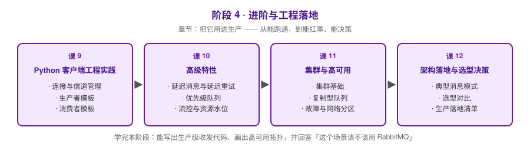

# 阶段 4：进阶与工程落地

> 所属课程：RabbitMQ 系统学习 ｜ 故事章节：**把它用进生产** ｜ 上一阶段：[阶段 3](../3-可靠性与投递语义/overview.md)

## 🎯 本阶段目标

- 能写出带确认、异常恢复和优雅关闭的生产级 Python 生产者/消费者代码
- 能用对延迟消息、优先级队列，并理解流控与内存/磁盘水位触发后的行为
- 能设计 RabbitMQ 集群拓扑，说清 quorum queue 与 stream 的高可用机制
- 能在 RabbitMQ / Kafka / RocketMQ / Redis Stream 之间做出选型，并给出上线检查清单

## 📍 学习重点

- **工程实践**：连接与信道的生命周期、心跳、断线重连，这些才是线上事故的常见来源
- **高级特性**：延迟消息（TTL+DLX 与插件两条路）、优先级队列的适用边界、流控与告警水位
- **高可用**：4.x 时代的知识必须更新——镜像队列已在 4.0 移除，分区策略在 4.3 随 Mnesia 一起退场
- **决策清单**：这是本课程的收束——「该不该用 RabbitMQ」比「怎么用」更难回答

## ✅ 必须掌握的知识点

| 知识点 | 所属课 | 学完应能 |
|--------|--------|----------|
| 连接与信道管理 | 课 9 | 说清 Connection 与 Channel 的关系，配置心跳并实现断线重连 |
| 生产者模板 | 课 9 | 写出 confirm + mandatory + persistent 三件套齐备的生产者 |
| 消费者模板 | 课 9 | 写出手动 ack + prefetch + 失败重试 + 优雅关闭的消费者 |
| 延迟消息与延迟重试 | 课 10 | 用 TTL+DLX 实现延迟队列，并知道 4.3 quorum 队列的原生延迟重试 |
| 优先级队列 | 课 10 | 配置 x-max-priority 并说清它对顺序和吞吐的影响 |
| 流控与资源水位 | 课 10 | 解释内存高水位与磁盘告警触发后发布者会发生什么 |
| 集群基础 | 课 11 | 说清集群 / Federation / Shovel 三种扩展方式各自解决什么问题 |
| 复制型队列 | 课 11 | 解释 quorum queue 的 Raft 复制，并说清镜像队列为何被移除 |
| 故障与网络分区 | 课 11 | 说清 4.3 起「多数派可用」的新语义以及旧分区策略为什么失效 |
| 典型消息模式 | 课 12 | 画出工作队列、发布订阅、RPC 三种拓扑并说明各自适用场景 |
| 选型对比 | 课 12 | 在 Kafka / RocketMQ / Redis Stream 之间给出有依据的选择 |
| 生产落地清单 | 课 12 | 列出容量规划、监控指标、常见坑，并判断某场景是否该上 RabbitMQ |

## 🗺️ 本阶段路径图

## 本阶段产出

- [ ] `lessons/lesson-09-Python客户端工程实践.md`
- [ ] `lessons/lesson-10-高级特性.md`
- [ ] `lessons/lesson-11-集群与高可用.md`
- [ ] `lessons/lesson-12-架构落地与选型决策.md`
