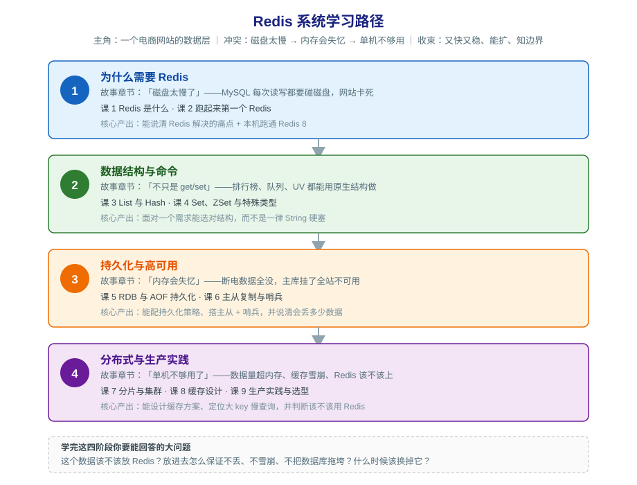

# Redis 学习路径总览

> 本文件是活文档，随学习进度动态调整。阶段依赖图统一用 SVG。

## 🎯 学习目标

- **目标类型**：理解概念 + 动手实操 + 应试认证 + 决策参考（四项全要）
- **目标说明**：从零基础出发，既能说清 Redis 每个机制为什么这样设计，也能在本机跑通全部实操；既能应对 Redis 相关面试考点，也能独立判断"这个业务该不该用 Redis、用了该怎么配、出问题怎么查"。

> 学习目标是全局基准：四项全要意味着**每课都要加大实操比重**（可照做的命令 + 预期输出）、**每课都要有考点与小测**、**每课都要回到"什么时候不该这么做"的边界**。目标变更时更新此处并同步调整相关课。

## 故事主线

- **主角**：一个电商网站的数据层
- **冲突**：MySQL 每次读写都要碰磁盘，网站扛不住读压力 → 换成内存后断电就失忆 → 单机内存不够、单机挂了全站停摆 → 缓存用得不对照样把数据库打崩
- **收束**：学完能回答"这个数据该不该放 Redis？放进去怎么保证不丢、不雪崩、不拖垮数据库？什么时候该换掉它？"

> 整个课程是这条故事线的展开，每个阶段是故事的一个"章节"。

## 学习路径图

> SVG 展示 4 个阶段、各阶段主题与阶段间前置依赖。阶段 1 是全部基础，阶段 2 在会用之后再讲结构，阶段 3 解决"内存会失忆"，阶段 4 解决"单机不够用"并回到决策。

## 阶段总览

### 阶段 1：为什么需要 Redis（预计 1 周）

- **目标**：说清 Redis 解决什么痛点，并在本机把 Redis 跑起来做基本读写
- **学习重点**：
  - Redis 的诞生动机：MySQL 磁盘 IO 瓶颈催生了内存数据结构服务器（起源事实已联网核查）
  - Redis 的三重身份：缓存 / 数据库 / 消息中间件，以及"它不是数据库替代品"这条边界
  - 本机环境搭建：WSL + 官方源装 Redis 8，用 redis-cli 做第一次读写
  - key 设计与危险命令：`KEYS` 为什么会把生产环境跑挂
- **必须掌握**：能说清"什么场景下 Redis 比 MySQL 快、快在哪一步"；能独立安装 Redis 并完成 SET/GET/EXPIRE/INCR 操作；能说出至少 3 种不该用 Redis 的场景
- **对应课**：课 1《Redis 是什么》、课 2《跑起来第一个 Redis》

### 阶段 2：数据结构与命令（预计 1-2 周）

- **目标**：面对一个业务需求能选对数据结构，而不是一律用 String 硬塞
- **学习重点**：
  - List 的双向操作与阻塞弹出，以及它当消息队列用的三个硬伤
  - Hash 存对象 vs String 存 JSON 的取舍（内存、灵活性、部分读写）
  - Set 的交并差与去重能力，ZSet 的 score 排序与跳表双结构
  - 特殊类型：Bitmap 签到、HyperLogLog 的 UV 统计与误差边界、Geo 附近的人
- **必须掌握**：能给"排行榜 / 共同关注 / 签到 / 秒杀队列"各选一个结构并说明理由；能说清 ZSet 为什么查询快
- **对应课**：课 3《List 与 Hash》、课 4《Set、ZSet 与特殊类型》

### 阶段 3：持久化与高可用（预计 1-2 周）

- **目标**：能配持久化策略、搭起主从 + 哨兵，并**准确说出这套配置会丢多少数据**
- **学习重点**：
  - RDB 的 fork + 写时复制机制，快照之间的数据丢失窗口
  - AOF 写后日志与三种刷盘策略，AOF 重写如何瘦身
  - 混合持久化与"纯缓存场景干脆关掉持久化"的决策
  - 主从复制的全量/增量同步、复制积压缓冲区，读写分离带来的不一致
  - 哨兵的监控/通知/故障转移，以及它解决不了的脑裂与异步复制丢数据
- **必须掌握**：能对比 RDB 与 AOF 并给出选型；能搭一主两从三哨兵；能说清"哨兵切换时可能丢多少数据、为什么"
- **对应课**：课 5《RDB 与 AOF 持久化》、课 6《主从复制与哨兵》

### 阶段 4：分布式与生产实践（预计 2 周）

- **目标**：能设计一套缓存方案、能定位大 key 与慢查询、能判断该不该用 Redis
- **学习重点**：
  - 哈希槽分片：16384 个槽、CRC16 取模，以及为什么不用一致性哈希
  - 集群伸缩与重定向，多 key 操作和 Lua 在集群下的限制
  - 缓存穿透 / 击穿 / 雪崩的成因与对应手段
  - 缓存与数据库一致性：Cache Aside、先更库还是先删缓存、延迟双删的真相
  - 8 种内存淘汰策略怎么选，过期键的惰性 + 定期删除
  - 性能诊断：慢查询日志、大 key、热 key
  - 安全基线：不暴露公网、高危命令与 ACL
  - 生态与选型：许可证变迁（BSD → SSPL/RSAL → AGPL）、Valkey、Memcached、Dragonfly
- **必须掌握**：能画出一套缓存架构并说清每个参数的理由；能给出 Redis / Memcached / Valkey / 不用缓存 的决策条件
- **对应课**：课 7《分片与集群》、课 8《缓存设计》、课 9《生产实践与选型》

## 当前进度

- [x] 阶段 1：为什么需要 Redis（已完成 2026-08-31，2 课 / 6 知识点，双视角评审 P0=0）
- [x] 阶段 2：数据结构与命令（已完成 2026-09-01，2 课 / 6 知识点，双视角评审 P0=0）
- [x] 阶段 3：持久化与高可用（已完成 2026-09-01，2 课 / 6 知识点，双视角评审 P0=0）
- [x] 阶段 4：分布式与生产实践（已完成 2026-09-01，3 课 / 9 知识点，双视角评审 P0=0）

## 收尾产物

- [x] 结课实战项目《电商大促数据层》（Phase 3，2026-09-02，评审 P0=0）
- [x] 实战经验 / 排障速查手册 / 场景解法库（Phase 5，2026-09-02，评审 P0=0）
- [x] [课程手册汇总](final-课程手册.md)（Phase 4，2026-09-02，评审 P0=0）
- [ ] 知识点对齐 · 选择题（Phase 6，可选，仅用户要求时触发）
