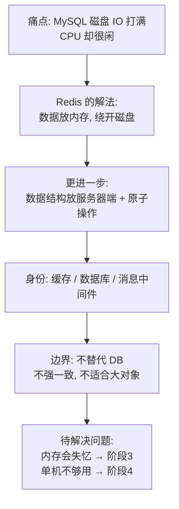
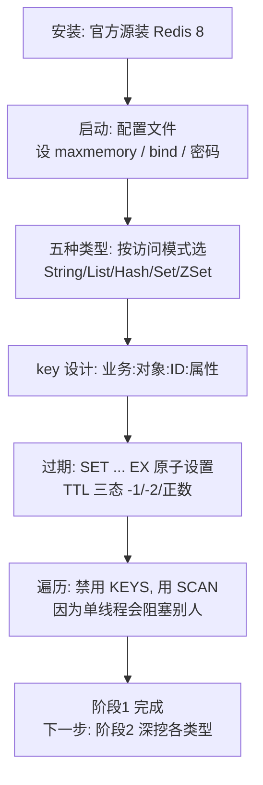
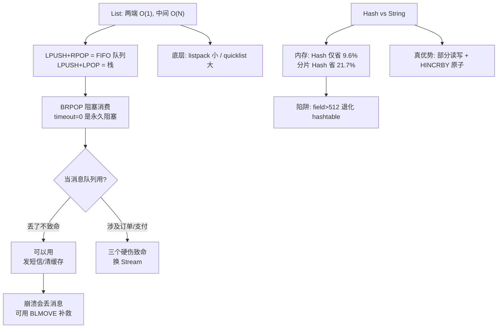
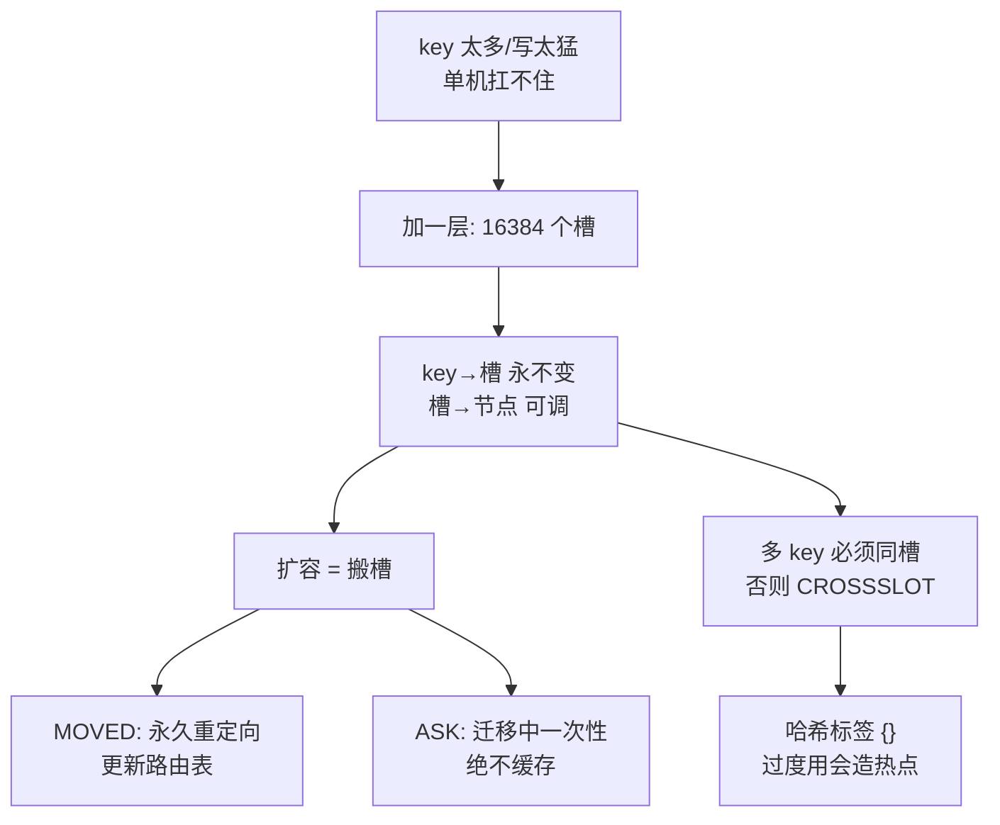

# Redis 系统学习 · 课程手册

> 本手册是 4 阶段 9 课的**汇总索引**，不是全文重印。每课保留「核心结论 + 关键实测数字 + 一图总结 + 高频误区」，想看完整推导与命令输出，点课名进原文。
>
> 生成日期：2026-09-02 ｜ 实验环境：WSL Ubuntu 24.04 + Redis **8.10.1** + Python 3.12

## 怎么读这份手册

| 你现在的处境 | 从这里开始 |
|---|---|
| 想快速回忆某课讲了什么 | 按阶段翻到对应课，看「核心结论」+「关键数字」 |
| 忘了某个机制为什么这样设计 | 看该课的「一图总结」，再点进原文 |
| 要上线 Redis，想查该配什么 | 直接跳到 [决策清单](#决策清单该不该用--怎么配) 与 [08-实战经验.md](08-实战经验.md) |
| 线上出问题了 | 直接跳到 [09-排障速查手册.md](09-排障速查手册.md)，别读这份 |
| 要面试 / 考试 | 直接跳到 [考点速记](#考点速记) |
| 想动手练 | 直接跳到 [综合实战项目](#综合实战项目电商大促数据层) |

## 🎯 学习目标（四项全要）

本课程的全局基准——四项全要意味着**每课都加大实操比重**（可照做的命令 + 预期输出）、**每课都有考点与小测**、**每课都回到"什么时候不该这么做"的边界**。

- **理解概念**：说清 Redis 每个机制为什么这样设计
- **动手实操**：在本机跑通全部实操，产出可照做的步骤
- **应试认证**：应对 Redis 相关面试考点（→ [考点速记](#考点速记)）
- **决策参考**：独立判断"这个业务该不该用 Redis、用了该怎么配、出问题怎么查"（→ [决策清单](#决策清单该不该用--怎么配)）

## 故事主线

- **主角**：一个电商网站的数据层
- **冲突**：MySQL 每次读写都要碰磁盘，网站扛不住读压力 → 换成内存后断电就失忆 → 单机内存不够、单机挂了全站停摆 → 缓存用得不对照样把数据库打崩
- **收束**：学完能回答"这个数据该不该放 Redis？放进去怎么保证不丢、不雪崩、不拖垮数据库？什么时候该换掉它？"

> 四个阶段是这条故事线的四个章节，每章节解决前一个章节遗留的问题。

---

## 🗺️ 全阶段总览


> 完整版见 [01-学习路径总览.md](01-学习路径总览.md)。

| 阶段 | 章节立意 | 目标 | 必须掌握 | 课 |
|------|---------|------|---------|-----|
| **1 · 为什么需要 Redis**<br>（1 周） | 磁盘太慢了 | 说清 Redis 解决什么痛点，并在本机跑起来做基本读写 | 能说清"什么场景下 Redis 比 MySQL 快、快在哪一步"；能独立安装 Redis 并完成 SET/GET/EXPIRE/INCR；能说出至少 3 种不该用 Redis 的场景 | 课 1、课 2 |
| **2 · 数据结构与命令**<br>（1-2 周） | 不只是 get/set | 面对业务需求能选对结构，而不是一律用 String 硬塞 | 能给"排行榜 / 共同关注 / 签到 / 秒杀队列"各选一个结构并说明理由；能说清 ZSet 为什么查询快 | 课 3、课 4 |
| **3 · 持久化与高可用**<br>（1-2 周） | 内存会失忆 | 能配持久化策略、搭起主从 + 哨兵，并**准确说出这套配置会丢多少数据** | 能对比 RDB 与 AOF 并给出选型；能搭一主两从三哨兵；能说清"哨兵切换时可能丢多少数据、为什么" | 课 5、课 6 |
| **4 · 分布式与生产实践**<br>（2 周） | 单机不够用了 | 能设计一套缓存方案、能定位大 key 与慢查询、能判断该不该用 Redis | 能画出一套缓存架构并说清每个参数的理由；能给出 Redis / Memcached / Valkey / 不用缓存 的决策条件 | 课 7、课 8、课 9 |

**阶段依赖**：阶段 1 是全部基础 → 阶段 2 在会用之后再讲结构 → 阶段 3 解决"内存会失忆" → 阶段 4 解决"单机不够用"并回到决策。

---

# 阶段 1：为什么需要 Redis

> 故事章节：「磁盘太慢了」——MySQL 每次读写都要碰磁盘，网站卡死
> 完整概览：[stages/1-为什么需要Redis/overview.md](stages/1-为什么需要Redis/overview.md)

## 🎯 阶段目标

- 说清 Redis 是为解决什么问题而诞生的，以及它快在哪一步
- 在本机（WSL）装好 Redis 8 并完成第一次读写
- 建立边界感：知道什么场景不该用 Redis

## 学习重点

- **诞生动机**：Redis 不是凭空设计的，是 antirez 在做实时日志分析 LLOOGG 时被 MySQL 的磁盘 IO 逼出来的。理解动机才能理解它为什么长这样。
- **数据结构服务器**：Redis 的关键创新不是"内存"，而是**把数据结构搬到服务器端**——你要的不是取回数据再算，而是让服务器直接对 list / set / zset 做原子操作。
- **三重身份**：它同时能当缓存、数据库、消息中间件，但每个身份都有前提和代价。
- **边界感**：不替代关系型数据库、不保证强一致、不适合大对象。这一条比"怎么用"更重要。


## 必须掌握的知识点

| 知识点 | 所属课 | 学完应能 |
|--------|--------|----------|
| Redis 的诞生动机 | 课 1 | 复述 LLOOGG 的故事，说清"磁盘 IO 是瓶颈"这件事 |
| 内存数据结构服务器 | 课 1 | 解释为什么 Redis 不只是 KV 缓存 |
| Redis 不是什么 | 课 1 | 列出至少 3 种不该用 Redis 的场景 |
| 安装与启动 | 课 2 | 独立用官方源装好 Redis 8 并连上 |
| 五种基础类型与通用命令 | 课 2 | 对五种类型各做一次读写 |
| key 设计与过期 | 课 2 | 设计合理的 key 命名，说清 `KEYS` 为什么不能在生产跑 |

---

## 课 1：Redis 是什么

📖 原文：[lesson-01-Redis是什么.md](stages/1-为什么需要Redis/lessons/lesson-01-Redis是什么.md) ｜ 完成于 2026-08-31，评审 P0=0

### 核心结论

1. **Redis 快在"数据在内存 + 绕开磁盘 IO"**，不是在"C 语言写的"。内存随机访问约 100 纳秒，SSD 约 100 微秒，机械硬盘约 10 毫秒——**走一次磁盘的时间够内存做上千到十万次访问**。
2. **真正的创新是"数据结构在服务器端"**。Memcached 风格：取出整个点赞列表 → 应用里判断是否已点赞 → 整体写回，并发下后写覆盖先写，会丢赞；Redis 风格：`SADD` 在服务器端完成去重，返回 1 是新增、0 是已存在，**天然幂等**。
3. **边界比用法更值钱**：不替代关系型数据库（没有 join、没有二级索引）、不保证强一致（主从异步复制）、不适合大对象（内存成本高）。

### 关键数字

| 数字 | 含义 |
|------|------|
| 100 ns / 100 μs / 10 ms | 内存 / SSD / 机械硬盘的随机访问耗时量级 |

### 一图总结



### 高频误区

1. "Redis 快是因为 C 语言写的" → 决定性因素是**数据在内存中 + 绕开磁盘 IO**，语言只是加分项。
2. "Redis 单线程所以性能低" → 单线程执行换来的是**无锁、原子、可预测**；网络 I/O 自 6.0 起可多线程。
3. "Redis 有事务，所以能保证一致性" → Redis 事务**不支持回滚**，且主从复制是异步的。
4. "Redis 能取代 MySQL" → 它是旁路加速层，不是主存储替代品。

---

## 课 2：跑起来第一个 Redis

📖 原文：[lesson-02-跑起来第一个Redis.md](stages/1-为什么需要Redis/lessons/lesson-02-跑起来第一个Redis.md) ｜ 完成于 2026-08-31，评审 P0=0

### 核心结论

1. **用官方源装，别用系统源**——系统源常是 EOL 版本。装完用配置文件启动，用 `shutdown` 干净关闭（**永远不要用 `kill -9`**，等于拔电源）。
2. **五种类型按访问模式选**，不是一律 `SET` + JSON：String（整体读写）、List（两端）、Hash（部分读写）、Set（去重/集合运算）、ZSet（排名）。
3. **`KEYS` 在生产被禁用的真正原因是"阻塞"而非"自身慢"**——它是单线程系统里的一根钉子，把所有其他命令钉在后面等。
4. **TTL 三态**：`-1` 是永不过期，`-2` 是不存在（已过期），正数是剩余秒数。别把 `-1` 当出错。

### 关键数字

| 数字 | 含义 |
|------|------|
| 0.37 s / 239 ms | 100 万 key 下 `KEYS` 自身耗时 / 它让**其他命令**最长等待的时间 |
| 3.42 s | `SCAN` 遍历同样 100 万 key 的总耗时（**比 KEYS 更长**） |
| -1 / -2 | TTL 的"永不过期" / "不存在" |

> `SCAN` 的价值是**不阻塞**，不是更快。它必须循环到游标返回 `0` 才算遍历完，中途空结果不代表结束；遍历期间有写入时**可能返回重复 key**，应用层要去重。

### 一图总结



### 高频误区

1. "关 Redis 用 kill 最快" → `kill -9` 可能损坏数据文件，永远用 `shutdown`。
2. "反正是缓存，`maxmemory` 不用设" → 默认不限制，会吃光机器内存被 OOM kill。
3. "什么都存 String + JSON 最灵活" → 改字段要整体读写、并发丢更新、排序要本地算。
4. "`KEYS` 慢一点而已，偶尔用没事" → 问题是**阻塞**别人，实测能让其他命令等 239 ms。
5. "`SCAN` 比 `KEYS` 快" → 不一定更快（实测总耗时更长），它的价值是**不阻塞**。

---

# 阶段 2：数据结构与命令

> 故事章节：「不只是 get/set」——排行榜、队列、共同关注、UV 都能用原生结构做
> 完整概览：[stages/2-数据结构与命令/overview.md](stages/2-数据结构与命令/overview.md)

## 🎯 阶段目标

- 面对一个业务需求能选对数据结构，而不是一律用 String 硬塞
- 理解每种结构底层的实现选择，以及这个选择带来的能力边界
- 知道哪些"看起来能用 Redis 做"的事其实不该做（如 List 当消息队列）

## 学习重点

- **List 的双向与阻塞**：`BRPOP` 能阻塞等待，让 List 看起来很像队列——但它**没有消费确认**，消费者崩了消息就丢了。这是理解 Stream 存在意义的前提。
- **Hash vs String 存对象**：不是简单的"哪个省内存"，而是内存 / 部分读写 / 灵活性的三角取舍，还要考虑 ziplist 编码的临界值。
- **ZSet 的双结构**：同一个 ZSet 同时维护哈希表与跳表，这是它既能按成员 O(1) 查、又能按分数范围查的原因。
- **概率与位运算**：HyperLogLog 用约 12 KB 统计上亿 UV，代价是 0.81% 的标准误差——**用精度换空间**。


## 必须掌握的知识点

| 知识点 | 所属课 | 学完应能 |
|--------|--------|----------|
| List 双向操作与阻塞弹出 | 课 3 | 用 LPUSH/RPOP 与 BRPOP 写出一个可用的队列 demo |
| List 当消息队列的三个硬伤 | 课 3 | 说清为什么不推荐，以及什么场景可以凑合用 |
| Hash 存对象 vs String 存 JSON | 课 3 | 给出选型判断条件，而非一律选某个 |
| Set 交并差与去重 | 课 4 | 实现共同关注、点赞去重、抽奖 |
| ZSet 跳表 + 哈希表双结构 | 课 4 | 解释为什么两种操作都快 |
| Bitmap / HyperLogLog / Geo | 课 4 | 说出各适用什么场景、误差或限制在哪 |

---

## 课 3：List 与 Hash

📖 原文：[lesson-03-List与Hash.md](stages/2-数据结构与命令/lessons/lesson-03-List与Hash.md) ｜ 完成于 2026-08-31，评审 P0=0

### 核心结论

1. **队列是 `LPUSH`+`RPOP`，栈是 `LPUSH`+`LPOP`**。`BRPOP key 0` 的 `0` 是**永久阻塞**，不是立刻返回。
2. **List 当消息队列的三个硬伤**：没有消费确认（`RPOP` 返回就永久删除，消费者崩溃无找回）、没有广播（每条消息只被一个消费者拿走）、没有重试机制。涉及订单支付必须换 **Stream**（`XACK` + PEL），或至少用 `BLMOVE` 做可靠队列。
3. **Hash vs String 的真实差距只有 9.6%**，"省 5 倍"说的是 listpack 编码 vs 普通编码，不是 Hash vs String。Hash 的真正优势是**部分读写 + `HINCRBY` 原子增减**。
4. **底层是 listpack（小）/ quicklist（大）**，不是简单的双向链表。

### 关键数字

| 数字 | 含义 |
|------|------|
| **9.6%** | Hash 比 String+JSON 省的内存（分片 Hash 省 21.7%） |
| **512** | Hash field 数阈值，超过会**不可逆**退化为 hashtable |
| 0.0126 ms / 138 MB | 500 万元素 List 的 `LINDEX` 耗时 / 占用内存 |
| 30 倍 | 500 万元素下 `LINDEX` 相对小 List 的增长倍数（仍可忽略） |

> 真正让你不敢用大 List 的是**内存**和 `LRANGE 0 -1` 撑爆缓冲区，不是索引延迟。

### 一图总结



### 高频误区

1. "BRPOP timeout=0 是立刻返回" → 0 表示**永久阻塞**，生产应设有限值并循环重试。
2. "List 底层就是双向链表" → Redis 7+ 小 List 用 listpack（连续内存），大 List 才转 quicklist。
3. "LINDEX 是 O(N) 所以很慢" → 理论没错但常数极小，500 万元素仅 0.0126 ms。
4. "多消费者 BRPOP 同一 List，每个都能收到全部消息" → 是分摊不是广播。
5. "用 BRPOPLPUSH 做可靠队列" → 自 Redis 6.2 已**废弃**，请用 `BLMOVE ... RIGHT LEFT`。

---

## 课 4：Set、ZSet 与特殊类型

📖 原文：[lesson-04-Set、ZSet与特殊类型.md](stages/2-数据结构与命令/lessons/lesson-04-Set、ZSet与特殊类型.md) ｜ 完成于 2026-09-01，评审 P0=0

### 核心结论

1. **Set 有三种编码**（不是两种）：`intset`（整数 ≤512）、`listpack`（字符串 ≤128 且每个 ≤64 字节）、`hashtable`。
2. **ZSet 不是"排序的 Set"，而是跳表 + 哈希表双结构**——所以既能按成员 O(1) 查，又能按分数范围查，代价是内存是 Set 的数倍（89 B vs 32 B/成员）。
3. **`SINTER` 的参数顺序不影响性能**（Redis 内部自动按基数排序，用最小集合做基准），但 `SDIFF` 的顺序**影响结果**（A-B ≠ B-A）。
4. **HyperLogLog 用 12 KB 统计上亿 UV，标准误差 0.81%**，是典型的"用精度换空间"。

### 选型决策树

```
需要去重 / 计数 / 判断存在性
│
├─ 需要取出具体成员？
│   └─ 是 → Set（唯一选择，可取成员、可 SISMEMBER）
│
└─ 只要数量，不要成员
    │
    ├─ 必须 100% 精确？
    │   ├─ 是 → ID 是否连续密集（自增ID、连续日期）？
    │   │        ├─ 是 → Bitmap（省 99.6%）
    │   │        └─ 否 → 回到 Set（稀疏 ID 用 Bitmap 会爆炸）
    │   │
    │   └─ 否（能接受 ±0.81% 误差）→ HyperLogLog（省 99.96%）
    │
    └─ 还要排序 / 取 TopN？→ ZSet
```

### 五种结构总对照表

| 结构 | 有序? | 可重? | 核心能力 | 典型场景 | 内存代价 |
|------|-------|-------|---------|---------|---------|
| **List** | 插入序 | 是 | 两端 O(1) | 队列、栈、时间线 | 低（8.9 B/元素） |
| **Hash** | 否 | 字段唯一 | 部分读写 | 对象存储 | 低（紧凑编码） |
| **Set** | 否 | 否 | O(1) 去重 + 集合运算 | 标签、共同好友 | 中（32 B/成员） |
| **ZSet** | 分数序 | 成员唯一 | 排名 + 范围查询 | 排行榜、延迟队列 | **高（89 B/成员）** |
| **Bitmap** | 位序 | - | 极致空间 | 连续 ID 签到 | **极低（1 bit/元素）** |
| **HLL** | 否 | - | 12 KB 计数 | DAU/UV 统计 | **固定 12 KB** |
| **Geo** | 空间 | 成员唯一 | 附近搜索 | LBS | 同 ZSet |

### 关键数字

| 数字 | 含义 |
|------|------|
| **512** | `set-max-intset-entries`，整数 Set 编码阈值 |
| **128** | `set-max-listpack-entries` / `zset-max-listpack-entries` |
| **5934x** | 同等数据下 `SUNION` 比 `SINTER` 慢的倍数（实测） |
| **0.81%** | HyperLogLog 标准误差（= 1.04/√16384） |
| **12 KB** | HyperLogLog 内存上限（16384 寄存器 × 6 bit） |

> ⚠️ 补充（Phase 5 实测订正）：ZSet 跨过 128 阈值从 listpack 转 skiplist 时，本机实测（Redis 8.10.1）128 个成员占 1721 字节，129 个占 11821 字节——**总内存跳变 6.87 倍**。这是数量级差异，容量规划须按转换后的口径估算。

### 高频误区

1. "SINTER 要把小集合放前面才快" → **错**。实测 0.0525 ms vs 0.0520 ms，几乎相同。
2. "Set 底层就是 intset 和 hashtable 两种" → 不完整，Redis 7.0+ 有三种。
3. "ZSet 就是排序的 Set" → 不准确，是**跳表 + 哈希表双结构**。
4. "Bitmap 一定比 Set 省内存" → 只在 ID 连续密集时成立；稀疏 ID 用 Bitmap 会更费。

---

# 阶段 3：持久化与高可用

> 故事章节：「内存会失忆」——断电数据全没，主库挂了全站停摆
> 完整概览：[stages/3-持久化与高可用/overview.md](stages/3-持久化与高可用/overview.md)

## 🎯 阶段目标

- 配置一套合理的持久化策略，并**准确说出这套配置会丢多少数据**
- 搭起一主两从 + 三哨兵，理解故障转移时发生了什么
- 建立对"高可用不等于不丢数据"的正确预期

## 学习重点

- **RDB 的 fork 与写时复制**：`BGSAVE` 靠 fork 子进程写快照，父子进程共享内存页，写时才复制——所以**快照期间内存可能涨到接近两倍**。
- **AOF 的写后日志**：先执行命令再写日志，不会阻塞当前命令，但可能丢最后一条。三种刷盘策略对应三种丢失窗口。
- **持久化不是免费的**：纯缓存场景下持久化反而是负担，该关就关。这个决策比参数调优更重要。
- **异步复制是丢数据的根源**：主库写成功就返回，还没传给从库就挂了，这部分数据永久丢失。哨兵解决的是"服务可用性"，**不解决"数据不丢失"**。


## 必须掌握的知识点

| 知识点 | 所属课 | 学完应能 |
|--------|--------|----------|
| RDB fork 与写时复制 | 课 5 | 解释为什么 BGSAVE 时内存会涨，以及丢多少数据 |
| AOF 写后日志与刷盘策略 | 课 5 | 对比 always / everysec / no，给出选型理由 |
| 持久化选型决策 | 课 5 | 判断某场景该用 RDB、AOF、混合还是干脆关掉 |
| 全量与增量复制 | 课 6 | 说清复制积压缓冲区的作用与断连后的行为 |
| 哨兵故障转移 | 课 6 | 搭三哨兵，说清为什么三个才安全 |
| 哨兵解决不了的丢数据 | 课 6 | 解释异步复制与脑裂，说出最坏情况丢多少 |

---

## 课 5：RDB 与 AOF 持久化

📖 原文：[lesson-05-RDB与AOF持久化.md](stages/3-持久化与高可用/lessons/lesson-05-RDB与AOF持久化.md) ｜ 完成于 2026-09-01，评审 P0=0

### 核心结论

1. **"BGSAVE 不阻塞"是不准确的**——`fork()` 那一瞬间主线程**完全阻塞**（要复制页表）。准确说法是"只在 fork 瞬间阻塞，之后主线程继续服务"。
2. **COW 只复制被修改的页**，所以"内存必然翻倍"是错的：实测不写入 1.00x（完全不涨）、持续写入 2.15x、高强度写入 3.37x。
3. **AOF 记的是命令不是数据**，写后日志的顺序决定了"不阻塞当前命令，但可能丢最后一条"。
4. **开启 AOF ≠ 不丢数据**：默认 `everysec` 的丢失窗口约 1 秒，只有 `always` 才零丢失，代价是 43 倍性能损失。
5. **如果配置文件里没开 `appendonly`，重启时 AOF 会被完全忽略**（本课实测踩过这个坑）。

### 四种方案的量化对比（30 万 key 实测）

| 方案 | 磁盘占用 | 启动速度 | 丢失窗口 | 适用场景 |
|------|---------|---------|---------|---------|
| **关闭持久化** | 0 | **10 ms** | **全部丢失** | 纯缓存，数据可重建 |
| **RDB** | 6.94 MB | 133 ms | 快照间隔（分钟级） | 备份、可容忍丢失 |
| **纯 AOF** | 13.71 MB | 226 ms | 1 秒（everysec） | 需要低丢失，但不用混合 |
| **混合（推荐）** | **6.94 MB** | **131 ms** | **1 秒（everysec）** | 绝大多数生产场景 |

> **混合持久化是最优解**：同时拿到 RDB 的体积/速度优势和 AOF 的低丢失窗口。

### 持久化选型决策树

```
先问：这份数据丢了会怎样？
│
├─ 丢了无所谓（纯缓存，能从 DB 重建）
│   └─ ✅ 关闭持久化
│       save ""  /  appendonly no
│       → 省掉 fork 开销、COW 内存风险、磁盘 I/O
│
├─ 丢了很麻烦，但可以接受几分钟
│   └─ ✅ RDB
│       save 900 1  /  appendonly no
│       → 适合做「备份」，加载快、文件小
│
└─ 丢了会造成业务损失
    └─ ✅ 混合持久化（RDB + AOF）
        appendonly yes
        aof-use-rdb-preamble yes
        appendfsync everysec     （默认，平衡）
        │
        └─ 能接受 43 倍性能下降换零丢失？
            └─ appendfsync always
               （仅限金融/交易等极少数场景）
```

> **铁律：纯缓存就该关掉持久化。** 这是本课最重要的决策，比任何参数调优都重要——
> 数据能从数据库重建时，持久化只是白白承担 fork 阻塞、COW 内存翻倍、磁盘 I/O 的代价。

### 关键数字

| 数字 | 含义 |
|------|------|
| **1.00x / 2.15x / 3.37x** | BGSAVE 期间不写入 / 持续写入 / 高强度写入的物理内存放大（实测） |
| **43 倍** | `appendfsync always` 相对 `no` 的性能损失 |
| **512 倍** | THP 把单次 COW 复制量从 4 KB 放大到 2 MB |
| **1 秒** | `everysec` 的丢失窗口 |
| **131 ms vs 226 ms** | 混合持久化 vs 纯 AOF 的启动耗时（30 万 key） |

### 持久化在全局中的位置

```
阶段 1：为什么需要 Redis（慢）
    ↓
阶段 2：数据结构与命令（怎么用）
    ↓
阶段 3：持久化与高可用 ← 课 5 在这里
    ├─ 课 5：RDB 与 AOF   （单机数据不丢）
    └─ 课 6：主从复制与哨兵（机器挂了服务不停）
    ↓
阶段 4：分布式与生产实践（不够用）
```

### 高频误区

1. "BGSAVE 完全不阻塞主线程" → `fork()` 瞬间完全阻塞，几十 GB 时可达几百毫秒甚至 1 秒。
2. "BGSAVE 时内存会涨到两倍" → 准确说法是"修改越多涨得越多，最坏接近两倍甚至更多"。
3. "开启了 AOF 就不会丢数据" → 默认丢失窗口约 1 秒。
4. "AOF 存的是数据" → 存的是**命令**，所以要靠 AOF 重写瘦身。

---

## 课 6：主从复制与哨兵

📖 原文：[lesson-06-主从复制与哨兵.md](stages/3-持久化与高可用/lessons/lesson-06-主从复制与哨兵.md) ｜ 完成于 2026-09-01，评审 P0=0

### 核心结论

1. **课 5 的 COW 在复制场景完整复现了一次**——从库全量同步时主库也要 `BGSAVE`，同样有 fork 阻塞与 COW 放大。差异在于**复制场景的 fork 更容易被触发**（从库重启、backlog 撑爆都会触发全量复制），所以调大 backlog = 减少 fork 次数。
2. **三者分工不能互相替代**：持久化解决"进程重启后数据还在"，复制解决"机器挂了数据还在"，哨兵解决"机器挂了服务不停"。
3. **哨兵不能突破单机内存限制**——无论挂多少个从库，每个都是主库的**完整副本**。数据量超单机内存就必须上集群。
4. **异步复制必然丢数据**：主库写成功就返回，还没传给从库就挂了，这部分永久丢失。哨兵解决的是可用性，不是数据不丢。

### 防丢数据的三个手段对比

| 维度 | `min-replicas-to-write` | `WAIT` 命令 | 什么都不做（默认） |
|------|------------------------|------------|------------------|
| 作用层 | 服务端（主库配置） | 客户端（每次调用） | - |
| 触发 | 从库不足时拒绝写入 | 阻塞等待 N 个从库确认 | - |
| 粒度 | 全局，一刀切 | **可精确到每条命令** | - |
| 失败表现 | 返回 `NOREPLICAS` 错误 | 超时返回实际确认数 | 静默接受 |
| 代价 | 从库全挂时完全不可写 | 每条命令增加一次往返延迟 | 可能丢数据 |
| 保证强度 | 收窄风险窗口 | 收窄风险窗口 | 无 |

> 两者都只是**收窄风险窗口**，不是逐条写入的法定人数确认（官方文档：*bound risk rather than prove a per-write quorum commit*）。

**怎么选**：

| 情况 | 建议 |
|------|------|
| 丢了无所谓（缓存） | 保持默认异步复制，最快；不需要 `min-replicas`，不需要 `WAIT` |
| 丢了要紧，可接受极小概率 | `min-replicas-to-write 1` + `min-replicas-max-lag 10`——防止"从库全挂还继续写"这种最糟情况 |
| 关键数据必须尽力保住 | 在**关键写入后**加 `WAIT`（如 `SET order:1001 paid; WAIT 1 1000`）。只给关键操作加，不要全量加 |

### 关键数字

| 数字 | 含义 |
|------|------|
| **7.06 秒** | 本机实测故障转移总耗时（down-after=5s + 切换 2s） |
| **1 MB / 0.05 秒** | 默认 backlog 大小，满载写入下的容忍断线时间 |
| **5 秒** | `repl-diskless-sync-delay` 默认等待（Redis 8，攒从库共享 fork） |
| **3 / 2** | 3 个哨兵、quorum=2，可容忍 1 个哨兵故障 |
| **3 秒** | `min-replicas-max-lag` 默认值（但 `to-write=0` 时不生效） |

### 持久化与复制的分工

```
持久化（课 5）：把数据写到磁盘
   → 解决：进程重启后数据还在

复制（课 6）：把数据传到另一台机器
   → 解决：机器挂了数据还在

哨兵（课 6）：自动切换主库
   → 解决：机器挂了服务不停
```

### 高频误区

1. "哨兵能保证不丢数据" → 不能，异步复制决定了必然丢最后几秒的写入。
2. "从库越多越安全" → 每个从库都是完整副本，解决不了单机内存上限。
3. "`min-replicas-max-lag` 配了就生效" → `min-replicas-to-write=0` 时不生效。

---

# 阶段 4：分布式与生产实践

> 故事章节：「单机不够用了」——数据量超内存、缓存雪崩、Redis 到底该不该上
> 完整概览：[stages/4-分布式与生产实践/overview.md](stages/4-分布式与生产实践/overview.md)

## 🎯 阶段目标

- 能设计一套完整的缓存方案并说清每个参数为什么这样定
- 能定位大 key、热 key 与慢查询
- 能判断"这个业务该不该用 Redis"，以及不用 Redis 时该用什么

## 学习重点

- **哈希槽而非一致性哈希**：16384 个固定槽，这个设计选择决定了伸缩、重定向与多 key 操作的全部行为。
- **三种缓存故障不是一回事**：穿透（查不存在的数据）、击穿（单个热点 key 过期）、雪崩（大批 key 同时过期）成因不同，解法也不同。
- **一致性的真相**：Cache Aside 是事实标准，但"先更新数据库还是先删缓存"没有完美答案——**延迟双删也不保证一致**。
- **淘汰策略要按业务选**：`allkeys-lru` 不是万能答案，当 Redis 一部分 key 不能丢时，它就错了。
- **生态已分裂**：2024 年许可证变更、Valkey 分叉、2025 年 AGPL 三许可。选型前必须先知道"你说的 Redis 是哪个 Redis"。


## 必须掌握的知识点

| 知识点 | 所属课 | 学完应能 |
|--------|--------|----------|
| 哈希槽与 CRC16 | 课 7 | 解释槽分配，说清为什么不用一致性哈希 |
| 集群伸缩与重定向 | 课 7 | 区分 MOVED 与 ASK，说清扩容时数据怎么搬 |
| 集群下的多 key 与 Lua 限制 | 课 7 | 用 hash tag 解决跨槽问题，说清限制 |
| 穿透 / 击穿 / 雪崩 | 课 8 | 三种故障分别给解法，不混淆 |
| 缓存与数据库一致性 | 课 8 | 说清 Cache Aside 与延迟双删的局限 |
| 内存淘汰与过期策略 | 课 8 | 按业务选出淘汰策略并说明理由 |
| 性能诊断 | 课 9 | 用慢查询日志与大 key 扫描定位问题 |
| 安全与运维基线 | 课 9 | 列出上线前必做的安全与监控项 |
| 生态与选型 | 课 9 | 给出 Redis / Valkey / Memcached / 不用缓存 的决策条件 |

---

## 课 7：分片与集群

📖 原文：[lesson-07-分片与集群.md](stages/4-分布式与生产实践/lessons/lesson-07-分片与集群.md) ｜ 完成于 2026-09-01，评审 P0=0

### 核心结论

1. **Redis 不把 key 直接映射到节点，中间插了一层固定 16384 个槽**。`key → 槽` 永不变化，`槽 → 节点` 可随时调整——这是能在线扩缩容的根本原因。
2. **MOVED 与 ASK 完全不同**：MOVED 是永久重定向，客户端应更新路由表；ASK 只在迁移中出现，是一次性的，**不能**更新路由表，且执行前要发 `ASKING`。缓存 ASK 的目标节点是经典客户端 bug。
3. **Lua 脚本有两道检查**：路由层查 `KEYS[]` 是否跨槽，执行层查脚本内访问的 key 是否归本节点。`numkeys=0` 时脚本发到连接节点，会出现"连对节点能跑、连错节点报错"的迷惑行为——**所有 key 必须写进 `KEYS[]`**。
4. **`--pipe` 批量导入在集群下会静默丢数据**：实测 1878/3000 失败，退出码还是 0。

### 关键数字

| 数字 | 含义 |
|------|------|
| **16384** | 哈希槽数（**不是 65536**），只取 CRC16 低 14 位 |
| **2 KB** | 16384 bit 槽位图的大小，可塞进一个以太网帧避免 IP 分片（65536 则需 8 KB） |
| **20/20** | 手写 CRC16-XMODEM 与 `CLUSTER KEYSLOT` 的吻合度（实测） |
| **531 倍** | 分组 `--pipe` 比逐条 `-c` 导入快的倍数（实测） |
| **62%** | 客户端不缓存路由表时，需要两次往返的请求比例 |

### 决策参考：什么时候用集群

| 场景 | 建议 |
|------|------|
| 数据量 < 单机内存，写 QPS 不高 | **不要上集群**，主从 + 哨兵够用，运维简单得多 |
| 数据量超过单机内存 | 必须分片，用集群或客户端分片 |
| 写 QPS 打满单主库 | 用集群分摊写入 |
| 强依赖跨 key 事务，且无法用哈希标签改造 | 慎用集群，考虑业务侧拆分 |
| 需要多数据库（SELECT） | **不能用集群**（集群只有 db 0） |

### 一图总结



### 高频误区

1. "集群能解决容量问题，也能解决所有性能问题" → **跨槽多 key 操作做不了**。
2. "哈希标签随便用" → 按大租户打标签 = 制造一个打不散的热点。
3. "MOVED 和 ASK 处理成一样就行" → 完全不同，缓存 ASK 会导致迁移期间路由错乱。
4. "Lua 里硬编码 key，测试能跑通就没问题" → `numkeys=0` 时行为取决于连到哪个节点。
5. "槽数是 65536 吧，CRC16 是 16 位的" → 是 16384，原因在心跳包大小。

---

## 课 8：缓存设计

📖 原文：[lesson-08-缓存设计.md](stages/4-分布式与生产实践/lessons/lesson-08-缓存设计.md) ｜ 完成于 2026-09-01，评审 P0=0

### 核心结论

1. **穿透 / 击穿 / 雪崩成因不同，必须分清**：穿透是"数据根本不存在"（解法是拦住），击穿是"单个热点 key 过期"（解法是控制重建并发），雪崩是"大批 key 同时失效"（解法是打散 + 兜底）。
2. **缓存空值只挡得住重复 id**——实测 2000 次随机攻击下仍穿透 1999 次；布隆过滤器只穿透 3 次。布隆的误差是**单向**的：说"不存在"**一定**不存在（假阴性为 0），说"存在"可能有误判——这个方向性正是它能防穿透的原因。
3. **Cache Aside（先更新 DB，再删缓存）会自愈**；"先删缓存再更新 DB"窗口更长且**不自愈**（旧值被回填）。延迟双删是兜底不是保证，真正的兜底是 TTL + 删除重试 + binlog 订阅。
4. **`volatile-*` 在无 key 设 TTL 时会退化为 `noeviction`**，这是最常见的线上事故点之一。
5. **过期删除（惰性 + 定期）与内存淘汰（8 种策略）是两套机制**。

### 关键数字

| 数字 | 含义 |
|------|------|
| **1999 / 2000 vs 3** | 随机 id 攻击下：缓存空值穿透次数 vs 布隆过滤器穿透次数 |
| **0.056%** | 布隆过滤器实测误判率（声明 0.1%），假阴性 0%，每 id 仅 2.24 字节 |
| **114 → 1** | 击穿时无防护的 DB 查询次数 vs 加互斥锁/逻辑过期后 |
| **189 → 27 次/秒** | 雪崩时统一 TTL vs 随机 TTL 的 DB 峰值（**降 7 倍**） |
| **15 vs 1921** | 批量冲刷场景下 LRU vs LFU 的存活 key 数（LFU 抗污染强得多） |
| **1998 vs 2000** | 稳定负载下 LRU vs LFU（几乎无差异） |

> 最后一组数字是选型的关键：**LRU 不比 LFU 差，选型的依据是你的访问模式，不是谁更"高级"。**

### 缓存方案设计清单

上线一个缓存方案前，逐条过一遍：

| # | 检查项 | 依据 |
|---|--------|------|
| 1 | 有没有参数校验 + 限流（最外层）？ | 最便宜的防护 |
| 2 | 不存在的数据怎么防？随机 id 攻击考虑过吗？ | 空值挡不住随机 id |
| 3 | 热点 key 的重建并发控制了吗？ | 互斥锁 / 逻辑过期 |
| 4 | TTL 加随机抖动了吗？ | 实测峰值降 7 倍 |
| 5 | Redis 挂了怎么办？有本地缓存兜底吗？ | 宕机是持续满载 |
| 6 | 写顺序是"先更新 DB 再删缓存"吗？ | 能自愈的那种 |
| 7 | 删除失败有重试吗？ | 否则只能等 TTL |
| 8 | 所有缓存 key 都设了 TTL 吗？ | TTL 是最后兜底 |
| 9 | `maxmemory` 设了吗？ | 默认是 0（不限制） |
| 10 | `maxmemory-policy` 改了吗？ | 默认 `noeviction` 会让写失败 |
| 11 | 用 `volatile-*` 的话，确认有 key 设 TTL 吗？ | 否则退化为 noeviction |
| 12 | 监控命中率和 `evicted_keys` 了吗？ | 判断缓存是否太小 |

### 高频误区

1. "缓存空值能防穿透" → 只能防重复 id，随机 id 攻击下实测仍穿透 1999/2000。
2. "布隆过滤器有误差，所以不保险" → 误差是**单向**的，误判只是多查一次库。
3. "击穿就用互斥锁" → 秒杀级并发下几万个线程阻塞在锁上比打 DB 更危险。
4. "延迟双删能保证一致" → 依赖"回填早于第二次删除"这个假设，是降低概率不是保证。
5. "`volatile-lru` 会自动淘汰" → 只在有 key 设了 TTL 时成立。
6. "过期 key 到点就消失" → 定期删除是抽样式的、有 CPU 预算的，实测 10 万个 key 里 1000 个过期，5 秒只回收了 15 个。
7. "命中率高就说明缓存健康" → 还要看 `evicted_keys`，命中率低 + 淘汰数高 = 缓存太小。

---

## 课 9：生产实践与选型

📖 原文：[lesson-09-生产实践与选型.md](stages/4-分布式与生产实践/lessons/lesson-09-生产实践与选型.md) ｜ 完成于 2026-09-01，评审 P0=0

### 核心结论

1. **性能诊断四层模型**：整体指标 → 命令维度（`commandstats`）→ 单条命令（`SLOWLOG`）→ 具体 key。**不要跳层**。
2. **SLOWLOG 不含网络时间**——所以慢日志干净不代表没问题。
3. **大 key 的危害不是"占内存"，是"删除时的长停顿"**——`DEL` 一个大 key 会造成百毫秒级**全服务**停顿。生产应默认用 `UNLINK`，或配 `lazyfree-lazy-user-del yes`。
4. **默认配置等于裸奔**（`user default on nopass +@all`）。ACL 是唯一推荐的鉴权方式，但 **`+@read` 会连 `KEYS` 一起给出**，必须显式 `-keys`。配完必须用真实连接验证，不能靠推理。
5. **选型的关键不是"Redis 有多快"，而是识别不该用 Redis 的信号**：按字段筛选、数据量超内存、无热点、需要强事务。

### 关键数字

| 数字 | 含义 |
|------|------|
| **37 ms vs 1501 ms** | SLOWLOG 记的耗时 vs 客户端实测（差 40 倍，证明慢日志不含网络） |
| **113.66 ms vs 0.61 ms** | 大 key 删除阻塞 vs 拆分后（**185.7 倍**）；`UNLINK` 降到 0.45 ms |
| **3.5 倍** | 换官方 `redis-benchmark` 后 io-threads=4 比 =1 快的倍数（CPU 44.5→78.1） |
| **10 / 9990** | `FT.CREATE` 返回 OK 时立刻查的命中数 / 真值（索引还在异步构建） |
| **20.2%** | Hash 分桶比独立 String 省的内存 |
| **177 倍 / +195.7%** | 索引查询比全量扫描快的倍数 / 额外占的内存 |
| **9.99%** | 10 万条订单按 `amount > 9000` 筛选的命中率——**命中 10% 却要传输 100% 数据**（耗时 0.26 s） |

### 选型决策树

```
                    需要缓存/高速存取吗？
                    ├── 否 → 不用 Redis
                    └── 是
                        │
                        需要复杂数据结构/持久化/发布订阅吗？
                        ├── 否（纯 KV 缓存）
                        │   └── Memcached 或 Redis 均可
                        │       （极简场景 Memcached 内存效率更好）
                        └── 是
                            │
                            有 AGPL 合规顾虑吗？
                            ├── 有 → Valkey（BSD 3）
                            └── 无
                                │
                                需要 Redis 8 独占能力吗？
                                （Query Engine / JSON / TimeSeries / 向量集）
                                ├── 是 → Redis 8
                                └── 否 → Redis 或 Valkey 皆可
                                        （看云厂商托管与团队经验）

⚠️ 任何时候，出现以下信号就该重新评估：
   - 需要按 value 字段做条件筛选（改用数据库或 Query Engine）
   - 数据量超过内存预算
   - 需要强事务或多表关联
   - 没有热点（缓存无收益）
```

### 三个必须记住的"测量陷阱"

1. **用错误客户端压测**：Python 单连接跑不到 2 万 ops/s，压不满服务端，会得出"io-threads 是负优化"的错误结论。
2. **只看聚合不看时间轴**：把尖峰平均掉了。
3. **把"命令返回成功"当成"操作已完成"**：`FT.CREATE` 返回 OK 时索引还在后台建，立刻查会得到静默的错误结果。

### 阶段 4 收官：从"会用"到"会判断"

- **课 7（分片与集群）**：数据量超单机时怎么横向扩展——**代价是多 key 操作受限、运维复杂度上升**
- **课 8（缓存设计）**：加缓存后会出现哪些故障——**代价是一致性只能做到"最终"，且没有完美方案**
- **课 9（生产实践与选型）**：出事后怎么查、上线前怎么配、最根本的要不要用——**代价是引入一整套运维与判断的负担**

贯穿三课的立场一致：**Redis 的每个能力都有代价，工程能力体现在说清代价并做出取舍**，而不是背下"最佳实践"清单。

### 一句话总结

> Redis 不难用，难的是判断什么时候不该用，以及出问题时知道该看哪里。

---

# 综合实战项目：电商大促数据层

📁 项目根目录：[projects/电商大促数据层/README.md](projects/电商大促数据层/README.md)
⏱ 预计耗时：3-4 小时 ｜ 环境：WSL Ubuntu 24.04 + Redis 8.10.1 + Python 3.12（纯标准库，无需装包）

> 本手册只做**索引与决策摘要**，完整代码与推导见项目目录。

## 🎯 一句话需求

给一个电商网站搭一套能扛住大促流量的数据层：商品详情走缓存扛读、秒杀库存不超卖、销量实时排行，并且**出问题能查、不该看的看不到**。

## ✅ 目标与非功能约束

**功能目标**：① 商品详情走缓存，防住穿透 / 击穿 / 雪崩；② 秒杀 500 并发抢 100 件不超卖且支持一人一单；③ 实时销量排行榜与当日统计；④ 自带诊断能力（慢查询、大 key、命中率、内存）。

**非功能约束**（实际做了 4 项，门槛要求 ≥2）

| 约束 | 具体指标 | 怎么验证 |
|------|---------|---------|
| 性能 | 商品查询 P50 < 5ms（数据库 20ms） | `main.py` 第一幕，实测提速在 **110~170 倍**区间波动（见下方说明） |
| 正确性 | 秒杀不超卖：成功数 + 剩余库存 = 初始库存 | `main.py` 第四幕账目对平校验 |
| 安全 | 应用账号无法执行 KEYS / FLUSHALL / DEBUG / SHUTDOWN，且只能碰业务 key 前缀 | `main.py` 第六幕逐条验证 |
| 可维护性 | 诊断不能比业务更耗资源（大 key 扫描带采样上限） | `diagnostics.py` 的 `sample` 参数 |

## 🗺️ 覆盖知识点地图（20 个，跨 4 阶段）

| # | 知识点 | 阶段 / 课 | 本项目用在何处 |
|---|--------|-----------|---------------|
| 1 | key 设计与过期 | 1 · 课 2 | `cache:good:{id}` 统一命名 |
| 2 | Hash 存对象 vs String 存 JSON | 2 · 课 3 | 商品用 Hash 存，支持只改 price |
| 3 | Hash 原子字段增减 | 2 · 课 3 | `DailyStats` 用 HINCRBY |
| 4 | ZSet 跳表 + 哈希表双结构 | 2 · 课 4 | 排行榜 `rank:sales`，TopN 用 ZREVRANGE |
| 5 | Set 去重 | 2 · 课 4 | 秒杀一人一单 `inventory:buyers:{gid}` |
| 6 | 持久化选型 | 3 · 课 5 | 主库开 AOF everysec + RDB 快照 |
| 7 | 全量与增量复制 | 3 · 课 6 | 7201 主 + 7202 从，实测复制握手 |
| 8 | 从库只读 | 3 · 课 6 | 第七幕验证从库写入被拒 |
| 9 | 集群下 Lua 的 key 限制 | 4 · 课 7 | 两个 Lua 脚本都只用 1-2 个 key，天然同槽 |
| 10 | Lua 原子性 | 4 · 课 7 | 扣库存「判断+扣减」一步完成 |
| 11 | 缓存穿透 | 4 · 课 8 | 空值标记 `cache:empty:{gid}` |
| 12 | 缓存击穿 | 4 · 课 8 | 互斥锁，30 并发只回源 1 次 |
| 13 | 缓存雪崩 | 4 · 课 8 | TTL 加 0~120 秒随机抖动 |
| 14 | 缓存与数据库一致性 | 4 · 课 8 | Cache Aside + 演示脏数据反面 |
| 15 | 内存淘汰策略 | 4 · 课 8 | 主库 `allkeys-lru` |
| 16 | 性能诊断四层模型 | 4 · 课 9 | `diagnostics.py` 整体→命令→慢查询→具体 key |
| 17 | 慢查询日志 | 4 · 课 9 | 说明「慢查询为空 ≠ 用户不慢」 |
| 18 | 大 key / 热 key | 4 · 课 9 | 含 LFU 未启用时的正确应对 |
| 19 | 安全与运维基线（ACL） | 4 · 课 9 | 三个角色账号 + default off |
| 20 | 生态与选型（含许可证变迁） | 4 · 课 9 | 见 [设计决策.md](projects/电商大促数据层/设计决策.md) 决策 6 |

**跨阶段校验**：覆盖 4 个阶段（门槛 ≥3）✅

## ⚖️ 设计决策摘要（6 个权衡点）

| # | 决策点 | 最终选择 | 一句话理由 | 什么时候改选 |
|---|--------|---------|-----------|-------------|
| 1 | Cache Aside vs Write Through / Write Behind | **Cache Aside** | 实现简单、只在读时回填，写路径最短 | 写多读少且要求强一致 → Write Through |
| 2 | 删缓存 vs 更新缓存 | **删缓存** | 删除没有"值"、不会乱序，代价恒定 | 读极热且重建代价极高 → 更新缓存 + 版本号 |
| 3 | Lua 返回值约定 | **无歧义负数**（`-1` 不存在 / `-2` 库存不足 / `-3` 已购买） | `0` 同时表示"扣完剩 0"和"售罄"，业务处理完全不同却无法区分 | 沿用旧约定时须在调用方严格区分 |
| 4 | 多线程连接模型 | **每线程独立连接** | RESP 是请求-响应严格配对的流式协议，共用连接会串位 | 连接数成为瓶颈 → 连接池 |
| 5 | ACL 收紧程度 | **三角色 + 关闭 default** | 应用账号不该能改账号、不该能跑危险命令 | 运维流程未就绪 → 先收紧但保留 default |
| 6 | 用哪个 Redis 发行版 | **Redis 8.10.1（AGPLv3 条款）** | 自用不对外提供、不修改源码时 AGPLv3 无实质约束，功能最全 | 对外提供 Redis 服务 / 法务否决 → Valkey |

> 完整的"候选方案对比 → 选择 → 理由 → 代价 → 什么时候改选"五段式论证，见 [设计决策.md](projects/电商大促数据层/设计决策.md)。

## 🚀 运行方式（Windows PowerShell）

```powershell
$env:WSLENV=""; & "C:\Windows\System32\bash.exe" -c "bash /mnt/d/projects/learning/redis/playground/prep-final-project-start.sh"
$env:WSLENV=""; & "C:\Windows\System32\bash.exe" -c "bash /mnt/d/projects/learning/redis/playground/prep-final-project-rebuild.sh"
$env:WSLENV=""; & "C:\Windows\System32\bash.exe" -c "cd /mnt/d/projects/learning/redis/projects/电商大促数据层/实现 && python3 main.py"
```

> 两个脚本都要执行且顺序不能反——第一个起实例，第二个建 ACL 角色账号，只跑第一个会因权限不足失败。

> ⚠️ **关于提速倍数**：项目 README 与早期记录里写的"提速约 110 倍"是**单次实测值，不是稳定指标**。
> 本机多次运行分别得到 110 / 129 / 167 倍——因为它是"数据库 20 ms 模拟延迟 ÷ Redis 实际耗时"的比值，
> 而 Redis 侧只有 0.1 ms 量级，机器负载的微小波动就会被放大成倍数的大幅变化。
> **看数量级（百倍）即可。** 相对稳定的约束是：缓存侧单次查询 **P50 < 5 ms**（实测约 0.12 ms）。

## 📁 目录说明

| 路径 | 内容 |
|------|------|
| [设计决策.md](projects/电商大促数据层/设计决策.md) | 6 个权衡点的完整论证 + 本轮实测 7 个踩坑清单 |
| [反例对照.md](projects/电商大促数据层/反例对照.md) | 5 组"能跑但很糟"的写法 + 逐条对比 |
| `实现/redislib.py` | RESP2 客户端 + 安全基线连接入口 |
| `实现/cache_layer.py` | 缓存层：Cache Aside + 穿透/击穿/雪崩防护 |
| `实现/inventory.py` | 库存与排行榜：Lua 原子扣减 + ZSet |
| `实现/diagnostics.py` | 诊断层：四层模型的可观测工具 |
| `实现/main.py` | 主程序，串起七幕演示 |
| [验收清单.md](projects/电商大促数据层/验收清单.md) | 自测项，逐项勾选 |

### 反例一览（"能跑但很糟"的 5 种写法）

| # | 反例 | 为什么糟 |
|---|------|---------|
| 1 | String 存 JSON | 改字段要整体读写、并发丢更新、排序要本地算 |
| 2 | 三步扣库存（读 → 判断 → 写） | 并发下必然超卖，不具备原子性 |
| 3 | `KEYS` 前缀统计 | 单线程阻塞全实例，生产禁用 |
| 4 | 更新缓存而非删除 | 并发下旧值覆盖新值，且不一致窗口更长 |
| 5 | 默认配置上生产 | `user default on nopass +@all` 等于裸奔 |

---

# 考点速记

> 学习目标含「应试认证」，故本节汇总高频考点与易混点。所有数字均为本课程本机实测或官方文档数据。

## 高频考点清单

| 考点 | 一句话答案 | 出处 |
|------|-----------|------|
| Redis 为什么快 | 数据在内存 + 绕开磁盘 IO；单线程执行换来无锁、原子、可预测 | 课 1 |
| 单线程是否性能低 | 不低。命令执行单线程，网络 I/O 自 6.0 起可多线程；瓶颈通常是网络 | 课 1 |
| Redis 事务能否保证一致性 | 不能。事务不支持回滚，且主从异步复制会丢数据 | 课 1 |
| `KEYS` 为什么禁用 | 问题是**阻塞**不是自身慢。100 万 key 下让其他命令等 239 ms | 课 2 |
| `SCAN` 比 `KEYS` 快吗 | 不一定（3.42 s vs 0.37 s）。价值是**不阻塞** | 课 2 |
| TTL 返回 -1 / -2 | -1 = 永不过期，-2 = 不存在 | 课 2 |
| `BRPOP key 0` 的 0 | **永久阻塞**，不是立刻返回 | 课 3 |
| List 当队列的硬伤 | 无消费确认、无广播、无重试 → 换 Stream | 课 3 |
| Hash vs String 省多少 | 仅 9.6%（分片 21.7%）。"省 5 倍"说的是编码差异 | 课 3 |
| Hash field 超多少退化 | 512，且**不可逆** | 课 3 |
| ZSet 为什么两种查询都快 | 跳表 + 哈希表**双结构**，代价是内存高（89 B/成员） | 课 4 |
| HLL 误差与内存 | 0.81% 标准误差，固定 12 KB | 课 4 |
| `SINTER` 参数顺序影响性能吗 | 不影响（内部按基数排序）。但 `SDIFF` 顺序影响**结果** | 课 4 |
| BGSAVE 是否阻塞 | fork 瞬间**完全阻塞**，之后不阻塞 | 课 5 |
| BGSAVE 内存必然翻倍吗 | 否。实测 1.00x / 2.15x / 3.37x（不写入/持续写/高强度写） | 课 5 |
| AOF 丢失窗口 | `everysec` 约 1 秒；`always` 零丢失但 43 倍性能损失 | 课 5 |
| 哈希槽为什么是 16384 | 心跳槽位图 2 KB 可塞进一个以太网帧；65536 需 8 KB 会 IP 分片 | 课 7 |
| MOVED vs ASK | MOVED 永久重定向可更新路由表；ASK 迁移中一次性，**不可缓存** | 课 7 |
| 穿透 / 击穿 / 雪崩区别 | 不存在的数据 / 单个热点 key 过期 / 大批 key 同时失效 | 课 8 |
| 布隆过滤器误差方向 | 说"不存在"**一定**不存在；说"存在"可能误判 | 课 8 |
| Cache Aside 为什么删缓存 | 删除没有"值"、不会乱序、代价恒定 | 课 8 |
| `volatile-*` 的陷阱 | 无 key 设 TTL 时退化为 `noeviction`，写请求直接 OOM | 课 8 |
| SLOWLOG 包含网络时间吗 | **不包含**，所以慢日志干净 ≠ 没问题 | 课 9 |
| 大 key 的真正危害 | 删除/过期瞬间的**不可中断阻塞**（113.66 ms vs 0.61 ms） | 课 9 |
| `+@read` 的坑 | 默认**包含 KEYS**，必须显式 `-keys` | 课 9 |

## 易混点对照表

| 易混对 | A | B | 区分关键 |
|--------|---|---|---------|
| 穿透 vs 击穿 | 查**不存在**的数据，缓存永远填不上 | 单个**热点** key 过期的瞬间 | 数据存不存在 |
| 击穿 vs 雪崩 | 一个 key | 大批 key | 规模 |
| 缓存空值 vs 布隆 | 挡重复 id（随机攻击穿透 1999/2000） | 挡随机 id（只穿透 3 次） | 攻击是否为随机 id |
| 互斥锁 vs 逻辑过期 | 阻塞等待，一致性好 | 返回旧值，性能好 | 能否接受旧数据 |
| LRU vs LFU | 按最近访问，抗污染弱（15） | 按访问频次，抗污染强（1921） | 是否有批量冲刷 |
| 稳定负载下 LRU vs LFU | 1998 | 2000 | **几乎无差异**，别迷信 LFU |
| RDB vs AOF | 快照，体积小、恢复快，丢数据多 | 命令日志，丢数据少，体积大、恢复慢 | 丢失窗口 vs 恢复速度 |
| 持久化 vs 复制 vs 哨兵 | 进程重启后数据还在 | 机器挂了数据还在 | 机器挂了服务不停 | 解决的是哪个故障 |
| MOVED vs ASK | 永久，更新路由表 | 一次性，绝不缓存，执行前发 `ASKING` | 是否处于迁移中 |
| List vs Stream | 无 ACK，崩了丢消息 | 有 `XACK` + PEL | 消息丢得起吗 |
| `DEL` vs `UNLINK` | 同步释放，阻塞 | 后台异步释放 | 是否是大 key |
| `volatile-*` vs `allkeys-*` | 只淘汰设了 TTL 的 key | 淘汰全部 key | 是否所有 key 都能丢 |
| Redis 事务 vs Lua | 不支持回滚，弱原子 | 真正的原子执行 | 需要中间状态判断吗 |

---

# 决策清单：该不该用 / 怎么配

> 学习目标含「决策参考」，故本节给出选型与配置的判断条件。

## 一、该不该用 Redis：先找"不该用"的信号

命中**任意一条**就该重新考虑（完整版见 [08-实战经验.md](08-实战经验.md) 的适用边界）：

| 信号 | 为什么是红灯 | 替代方案 |
|------|-------------|---------|
| 需要**按字段筛选** | Redis 无法在服务端过滤，只能全量取回客户端算。实测 10 万条订单命中 9990（9.99%），**命中 10% 却要传输 100% 数据**（0.26 s） | 走索引的数据库 / RediSearch |
| 数据量**超过内存** | 内存成本高，且超出后要么 OOM 要么淘汰 | 分库分表 / 其他存储 |
| **没有热点**，访问均匀 | 缓存命中率上不去，纯属增加一层延迟 | 直接优化数据库索引 |
| 需要**强事务 / 强一致** | Redis 事务不支持回滚，主从异步复制会丢数据 | 关系型数据库 |
| 需要 **join / 二级索引** | Redis 没有 | 关系型数据库 / 搜索引擎 |
| **大对象**（如大 JSON、文件） | 内存成本高，且大 value 会拖慢网络与删除 | 对象存储 |
| 缓存**收益 < 运维成本** | 引入一致性、雪崩、穿透一整套负担 | 不用缓存，先优化 SQL |

## 二、选型决策条件

| 条件 | 推荐 |
|------|------|
| 数据量 < 单机内存，写 QPS 不高 | **主从 + 哨兵**，不要上集群 |
| 数据量超单机内存 / 写 QPS 打满单主 | Redis Cluster |
| 强依赖跨 key 事务且无法用哈希标签改造 | 慎用集群，考虑业务侧拆分 |
| 需要多数据库（SELECT） | **不能用集群**（只有 db 0） |
| 纯 KV 缓存、多线程吞吐优先、不需要复杂结构 | 可评估 Memcached / Dragonfly |
| 自用、需要完整功能 | Redis 8（**AGPLv3 条款**，自用无实质约束） |
| **把 Redis 作为服务对外售卖** | 必须 Valkey（RSALv2/SSPLv1 直接禁止这种用法） |
| 法务对 SSPL/AGPL 一律否决 | Valkey |
| 没运维、有预算 | 云托管（先确认提供的是 Redis 还是 Valkey 引擎） |

> 📌 许可证事实核查于 2026-09，完整表格见 [设计决策.md](projects/电商大促数据层/设计决策.md) 决策 6。要点：**7.2.4 是最后一个 BSD 版本**；8.0 于 2025-05-01 加入 AGPLv3 形成三许可；**Redis 8.0 将于 2026-12-01 停止支持**；Valkey 当前 9.1.1 保持 BSD。

## 三、上线配置基线

逐条确认（完整 Checklist 见 [08-实战经验.md](08-实战经验.md)）：

- [ ] `maxmemory` 已设（默认 0 = 不限制，会吃光机器内存被 OOM kill）
- [ ] `maxmemory-policy` 已改（默认 `noeviction`，会让写请求失败）
- [ ] 用 `volatile-*` 的话，确认有 key 设了 TTL（否则退化为 noeviction）
- [ ] 已配置 ACL 分角色账号，并**关闭或收紧 default**
- [ ] ACL 显式 `-keys`（`+@read` 默认包含 KEYS）
- [ ] 不暴露公网，已设 `bind` 与密码
- [ ] 持久化策略已按业务选定（纯缓存场景可考虑关闭）
- [ ] 用 `volatile-*` 之外的场景确认所有缓存 key 都设了 TTL
- [ ] 已监控命中率、`evicted_keys`、`master_link_status`、`latest_fork_usec`
- [ ] 已对 ZSet / Hash / Set 做过单 key 大小巡检（编码转换会让内存产生数量级跳变，实测 ZSet 跨 128 阈值达 **6.87 倍**）
- [ ] 生产默认用 `UNLINK`，或已配 `lazyfree-lazy-user-del yes`
- [ ] 已演练过 Redis 宕机时的降级路径（本地缓存 / 熔断）

## 四、出问题时

- **学习态**（想懂为什么会崩）→ [08-实战经验.md](08-实战经验.md)：9 个五段式故障模式 + 落地 Checklist + 真实事故复盘
- **使用态**（线上崩了，只要动作）→ [09-排障速查手册.md](09-排障速查手册.md)：11 个症状条目，按症状倒查
- **设计态**（新要求来了怎么设计）→ [10-场景解法库.md](10-场景解法库.md)：6 个高难度场景，先想后看

---

# 全部产物索引

| 产物 | 说明 |
|------|------|
| [00-学习档案.md](00-学习档案.md) | 学习者画像 + 知识点级进度表 + 大纲调整记录 + 评审记录 |
| [00-评审清单.md](00-评审清单.md) | 评审强制检查点（未勾选 = 未评审） |
| [01-学习路径总览.md](01-学习路径总览.md) | 学习目标 + 全阶段总览 + 故事主线 |
| [02-课程目录.md](02-课程目录.md) | 书本式课程目录 |
| [final-课程手册.md](final-课程手册.md) | 本手册 |
| [08-实战经验.md](08-实战经验.md) | 学习态：适用边界 / 9 个故障模式 / 落地 Checklist |
| [09-排障速查手册.md](09-排障速查手册.md) | 使用态：11 个症状条目，按症状倒查 |
| [10-场景解法库.md](10-场景解法库.md) | 设计态：6 个场景，先想后看 |
| [projects/电商大促数据层/](projects/电商大促数据层/README.md) | 结课综合实战项目 |

> 📅 生成于 2026-09-02 ｜ 实验环境版本号均已标注于正文，时效敏感内容（许可证 / 版本 / EOL）联网核查于 2026-09。
