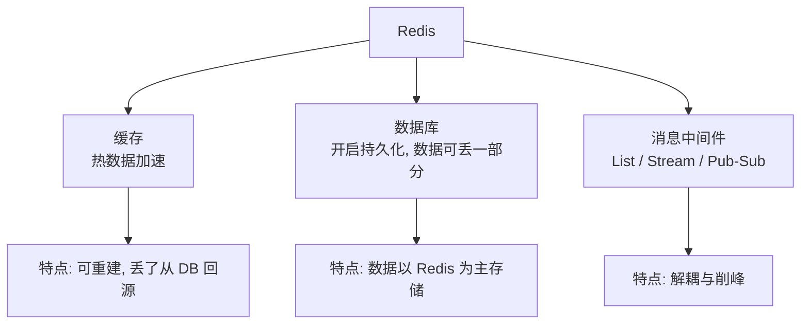
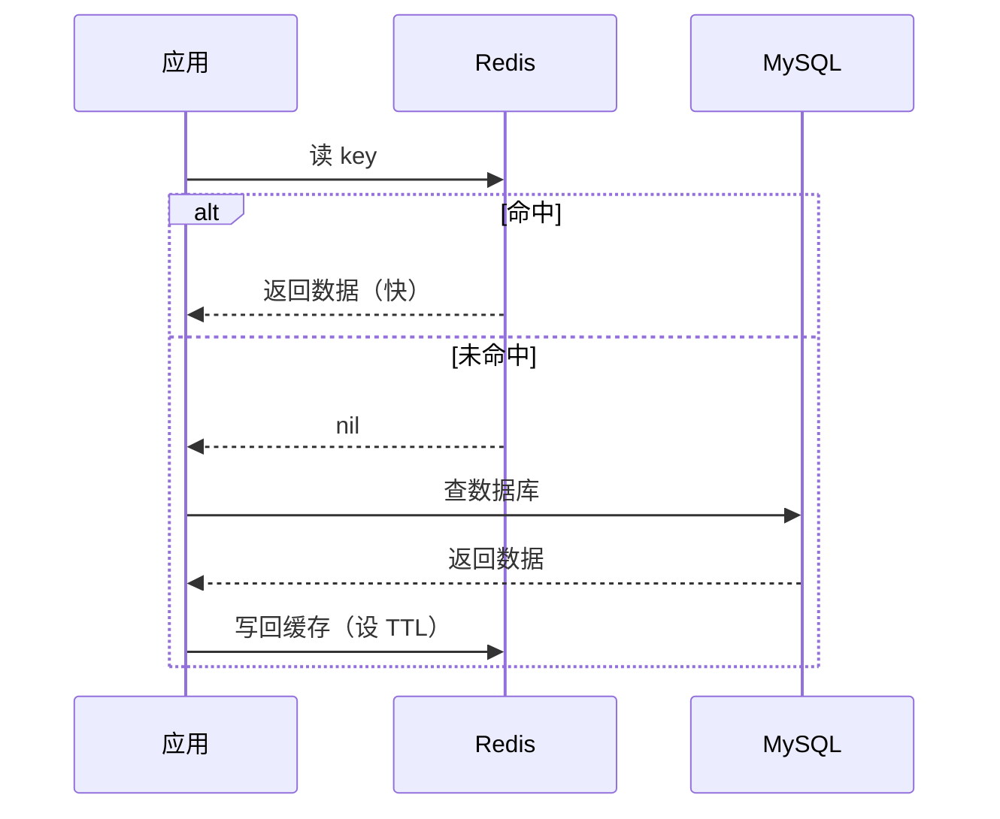
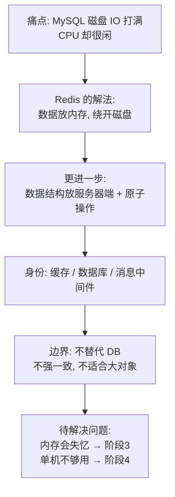

# 第 1 课：Redis 是什么

> 所属阶段：阶段 1《为什么需要 Redis》｜ 水平：零基础 ｜ 本课知识点：Redis 的诞生动机、内存数据结构服务器、Redis 不是什么
> 故事情节：一个电商网站的数据层第一次感受到"慢"——用户抱怨列表页要转 3 秒，DBA 说 MySQL 已经到极限了

## 🎯 本课目标

- 复述 Redis 诞生的真实故事，说清它到底解决了什么痛点
- 解释"内存数据结构服务器"这句话的含义，以及它为什么比"内存缓存"更准确
- 列出至少 3 种不该用 Redis 的场景，并说明原因

---

## 第一幕：起源与场景引入

> 🏛️ **起源**（核查于 2026-08）：Redis 由意大利程序员 **Salvatore Sanfilippo**（网名 **antirez**）于 **2009 年**创建。起因是他和朋友在 2007 年做了一个网站访客行为分析工具 **LLOOGG**——它要为每个网站保存最新的 1 万条浏览记录并实时展示。用 MySQL 存这些"不断推入、不断弹出"的列表时，每次操作都要碰磁盘，网站越来越慢。因为当时 LLOOGG 还没盈利，antirez 没钱升级服务器，于是干脆自己写了一个**把列表放在内存里**的原型（最初用 Tcl 写成，名叫 LMDB，即 LLOOGG Memory Database），验证有效后用 C 重写并加上持久化，这就是 Redis。名字 Redis = **REmote DIctionary Server**（远程字典服务器）。默认端口 **6379** 来自手机九宫格键盘上 6379 对应的 "MERZ"——antirez 和朋友用来调侃一位意大利模特的口头禅。

想象你接手了一个电商网站。上线初期一切正常，用户量涨起来之后，客服开始收到投诉：

> "商品详情页要转 3 秒才出来。"  
> "我点了个赞，刷新之后又没了。"  
> "排行榜每次都要等半天。"

你去找 DBA，DBA 说：MySQL 的 CPU 才 30%，但**磁盘 IO 已经打满了**。你们一起看了下，发现这个网站 90% 的请求都在做同一件事——反复读同一批热点数据（热门商品、首页分类、用户会话）。

> 🎬 **场景**：一个读多写少的电商网站，MySQL 磁盘 IO 打满，但 CPU 还很空闲。

---

## 第二幕：认知冲突

这时候你面前有三条路：

1. **加机器、上 SSD**：能缓解，但热点数据还是那几个，每次读还是要走一遍磁盘寻址。
2. **在应用里加个本地缓存（比如 HashMap）**：快是快了，但应用有多台，各自缓存一份，**数据不一致**；应用重启，缓存全没。
3. **换个思路**：如果这些热点数据**根本不住在磁盘上呢**？

第三条路引出两个必须回答的问题：

> ❓ **问题 1**：内存比磁盘快几个数量级，但**断电就没了**——一个断电就失忆的存储，凭什么拿来存业务数据？
>
> ❓ **问题 2**：如果只是把数据放内存，那用 Memcached 不就好了？为什么 2009 年之后还需要一个新的东西？

第二个问题才是 Redis 存在的真正理由。

---

## 第三幕：层层揭示

### 知识点 1：Redis 的诞生动机——瓶颈在磁盘，不在 CPU

> 本知识点关键点：LLOOGG 的列表困境 / 磁盘 IO 与内存的速度差 / 穷出来的设计

#### 一句话定义

Redis 诞生的直接原因是：**有一类数据访问的瓶颈在磁盘 IO，而这类数据小、热、结构简单，完全没必要每次都去碰磁盘。**

#### 直觉建立（类比）

把数据库想成**图书馆的闭架书库**：你要一本书，得填单子，管理员走进库房，在架子上找到，再拿出来给你。这个"走进库房找"的过程就是磁盘 IO——慢，但能存很多书。

而 Redis 是**你办公桌上摊开的那几本书**：伸手就拿到，快得多，但桌面只能放有限几本，而且下班锁门（断电）后明天来，桌子可能被收拾过。

真正的区别在于：**不是所有书都值得放桌上，但被反复翻的那几本放桌上，能省掉 90% 的跑腿。**

> 💡 **类比的边界**：桌面下班会被收拾（断电丢数据），但 Redis 有持久化机制可以"每晚把桌面拍照存档"，下次开机恢复。所以它不是纯粹失忆——是**可配置地选择记多少、多久记一次**。这一点后面阶段 3 会展开。

#### 核心原理

antirez 面对的 LLOOGG 是一个**纯列表操作**的负载：每个网站一个列表，新记录从一头推进去，超过 1 万条就从另一头弹出来。用 MySQL 做这件事，每条记录都要走一次磁盘写、一次磁盘读。

他做的取舍非常明确：

| 维度 | MySQL 的做法 | Redis 的做法 |
|------|-------------|-------------|
| 数据主居所 | 磁盘 | 内存 |
| 读写路径 | 每次都碰磁盘 | 直接操作内存中的数据结构 |
| 持久化 | 默认保证 | 可选（RDB 快照 / AOF 日志） |
| 数据模型 | 表、行、SQL | 服务器端的数据结构（list/set/zset…） |

关键点在于：**Redis 不是"让 MySQL 变快"，而是换了一个数据存放的位置与访问方式**。内存的随机访问比磁盘快几个数量级，这才是那个"3 秒变 30 毫秒"的来源。

#### 示例演示

先直观感受一下这个速度差有多大（数字是量级示意，不同硬件差异很大）：

```bash
# 内存随机访问：约 100 纳秒量级
# SSD 随机访问：约 100 微秒量级
# 机械硬盘随机访问：约 10 毫秒量级
# 也就是说，走一次磁盘的时间，够内存做上千到十万次访问
```

#### 常见误区

1. **"Redis 快是因为它是 C 写的"**：C 是加分项，但**决定性因素是数据在内存里**。同样的 C 程序如果每次都读写磁盘，一样快不起来。
2. **"Redis 会取代 MySQL"**：不会。Redis 解决的是"热数据快速访问"，MySQL 解决的是"海量数据的可靠存储与复杂查询"。它们是配合关系，不是替代关系。

#### 一句话记住

**Redis 快的根本原因不是它用什么语言写的，而是它把数据放在了内存里、并且让你直接操作数据结构，绕开了磁盘 IO 这个瓶颈。**

#### 官方文档

- [Redis 官方介绍](https://redis.io/docs/latest/)

---

### 知识点 2：内存数据结构服务器——不只是缓存，是把数据结构搬到服务器端

> 本知识点关键点：Memcached 的局限 / 服务器端数据结构 / 原子操作 / 三种身份

#### 一句话定义

Redis 是一个**内存中的数据结构服务器**：它把 list、set、sorted set 这些数据结构放在服务器端，让你通过网络直接对这些结构做原子操作，而不只是存取字符串。

#### 直觉建立（类比）

Memcached 像一个**带编号的储物柜**：你报编号，它给你一个包裹；你不打开包裹，就不知道里面是什么；想改包裹里的一件东西，得整个拿出来、改完、整个放回去。

Redis 像一个**有各种容器的工作台**：你可以直接对它说"在这个列表左边加一项""帮我看看这两个集合有哪些共同成员""把这个有序集合里分数最高的十个给我"。**操作在服务器端完成，只把结果传回来。**

> 💡 **类比的边界**：工作台更灵活，但也意味着你不能像储物柜那样简单粗暴地堆东西——每种容器有它的容量特性和操作代价。比如有序集合为了支持排序，内存开销比普通集合大。

#### 核心原理

这是 Redis 区别于 Memcached 的核心，也是它 2009 年之后还能崛起的原因：

**1. 数据结构在服务器端**

Memcached 的值本质上是不透明的字节串。要做"排行榜"，你得把整个榜单取回来、在应用里排序、再写回去——这中间还有并发问题。

Redis 原生提供 sorted set（ZSet）：

```bash
# 排行榜：加分数、取前十名，都在服务器端完成
ZADD leaderboard 100 "player:1"
ZADD leaderboard 230 "player:2"
ZREVRANGE leaderboard 0 9 WITHSCORES
```

**2. 操作是原子的**

`INCR`、`LPUSH`、`ZADD` 这些命令在 Redis 里是**单线程执行、天然原子**的。多个客户端同时对同一个 key 做 `INCR`，不需要你在应用层加锁，结果也不会错。

这一点价值巨大：计数、限流、分布式锁这些场景，在 Memcached 里要额外处理并发，在 Redis 里一个命令就够。

**3. 三种身份，取决于怎么用**



同一个 Redis，配不配持久化、当不当作唯一数据源，决定了它是缓存还是数据库。**这个定位必须在设计阶段就想清楚**，因为它决定了持久化策略、淘汰策略、容量规划的全部选择。

#### 示例演示

对比一下"点赞去重"这个需求，两种做法的差异：

```bash
# Memcached 风格：值是不透明的字符串，得整体读写
# 1) 取出整个点赞列表  2) 应用里判断是否已点赞  3) 追加后整体写回
# 问题：并发下两个请求同时取到旧值，后写的覆盖先写的 → 丢赞

# Redis 风格：SADD 在服务器端完成去重，返回 1 表示新增、0 表示已存在
SADD like:article:1001 user:88
# 返回 (integer) 1 → 新增成功
SADD like:article:1001 user:88
# 返回 (integer) 0 → 已点过，天然幂等
```

注意 `SADD` 的返回值让"是否新增"这个判断也变得可靠——这是服务器端数据结构带来的额外收益。

#### 常见误区

1. **"Redis 就是 Memcached 的升级版"**：不准确。Memcached 是多核多线程的简单 KV 缓存，Redis 是单线程执行 + 丰富数据结构的服务器。在纯 KV 缓存场景，Memcached 的多核利用率反而更高（阶段 4 的选型课会展开）。
2. **"既然有丰富结构，那就都用 ZSet 存"**：每种结构有内存与性能代价，选型要匹配访问模式，不是越"高级"越好。

#### 一句话记住

**Redis 的革命性不在于"把数据放内存"，而在于"把数据结构放到服务器端并让操作原子化"——你要的是结果，不是把数据搬回本地自己算。**

#### 官方文档

- [Redis 数据类型介绍](https://redis.io/docs/latest/develop/data-types/)

---

### 知识点 3：Redis 不是什么——边界感比用法更值钱

> 本知识点关键点：不替代关系型数据库 / 不保证强一致 / 不适合大对象 / 单线程的含义

#### 一句话定义

Redis 是一个**有明确定位和明确边界**的工具：它擅长小而热的数据、需要原子操作或特殊结构的场景；它不擅长海量冷数据、强一致事务、复杂查询。

#### 直觉建立（类比）

Redis 是**厨房里的微波炉**：热个菜、解冻、加热牛奶，快得离谱，专业对口。但你不会用它炖三个小时的汤，也不会用它取代整个厨房。

> 💡 **类比的边界**：微波炉确实能"做熟食物"，就像 Redis 确实能"存数据"。问题不在于能不能，而在于**是不是最合适、代价是不是可接受**。

#### 核心原理

**1. 不替代关系型数据库**

Redis 没有 SQL、没有 join、没有二级索引（Redis 8 内置了查询引擎，但适用面有限）、没有事务回滚。数据模型是"为快速访问而组织"，不是"为任意查询而组织"。

典型分工是 **Redis 做旁路缓存**：



**2. 不保证强一致**

Redis 的主从复制是**异步**的：主库写成功就返回客户端，数据稍后才异步传给从库。如果主库在这之间宕机，那部分数据就永久丢了。**哨兵解决的是"服务还能用"，不解决"数据不丢"**（阶段 3 会详细拆解）。

**3. 不适合大对象与大数据量**

内存在成本上远高于磁盘。把 500GB 的冷数据塞进 Redis，成本会高出一个量级。另外，Redis 单条 value 虽然理论上限是 512MB，但实际生产中**大 key（比如几 MB 的 value）会严重阻塞单线程、引发网络拥塞**，是明确要避免的。

**4. "单线程"到底指什么**

这是一个高频误解，值得单独说清：

| 版本 | 模型 |
|------|------|
| Redis 6.0 之前 | 完全单线程处理命令 |
| Redis 6.0 起 | **命令执行仍是单线程**，但网络 I/O 读写可多线程（`io-threads`） |
| Redis 8.x | 同上，命令执行核心仍保持单线程 |

所以"单线程"指的是**命令执行**，这正是原子性的来源——同一时刻只有一个命令在跑，不需要锁。代价是：**一个慢命令会阻塞后面所有命令**，这就是 `KEYS *` 在生产环境被禁用的原因（下节课会实测）。

> 🧩 **容易卡住的一点**：既然命令执行是单线程，那 `BGSAVE` 持久化、AOF 刷盘这些活儿谁干？答案是 **Redis 会有后台线程/子进程**处理这些"不碰数据结构的杂活"（fork 子进程写 RDB、后台线程刷 AOF 等）。准确的说法是：**所有对数据结构的读写命令都在同一个主线程里串行执行**，而持久化这类辅助任务由后台线程或子进程承担，不参与命令排队。阶段 3 会详细拆解这部分。

#### 示例演示

几个"不该用 Redis"的判断：

| 场景 | 为什么不适合 | 该用什么 |
|------|-------------|---------|
| 存 500GB 历史订单明细 | 内存成本高一个量级，且访问频率低 | MySQL / 数仓 / 对象存储 |
| 银行账户转账（强一致） | 异步复制会丢数据，无跨 key 事务回滚 | 关系型数据库事务 |
| 多条件组合查询（如"北京、25-30 岁、男"） | 无 join 与二级索引，只能在应用里拼 | Elasticsearch / 关系型数据库 |
| 存 10MB 的图片二进制 | 大 key 阻塞单线程，网络拥塞 | 对象存储（COS/S3） |
| 只存 50KB 配置、一周改一次 | 为一个不痛的痛点引入一套运维依赖 | 配置文件 / 配置中心 |

#### 常见误区

1. **"Redis 有事务，所以能保证一致性"**：Redis 的事务（`MULTI`/`EXEC`）**不支持回滚**——队列里某条命令失败，其余命令照常执行。它保证的是"不被打断地执行一批命令"，不是关系型数据库那种 ACID 事务。
2. **"Redis 单线程所以只能用一个核，性能差"**：单线程避免了锁竞争和上下文切换，在内存访问场景下反而极快；瓶颈通常在**网络 I/O**而不是 CPU。真需要多核时，正确做法是**起多个实例或上集群**（阶段 4）。

#### 一句话记住

**Redis 是热数据、原子操作、特殊结构场景的利器；把它当主数据库、当强一致存储、当大对象仓库，都是用错了地方。**

---

## 第四幕：实操验证

现在回到第一幕那个"MySQL 磁盘 IO 打满"的电商网站。我们不做复杂改造，只用两分钟验证一件事：**同样的读写，在内存里到底有多快**。

### 环境准备

本课程实操统一在 WSL（Ubuntu 24.04）中进行，Redis 版本 **8.10.1**（核查于 2026-08，官方源安装）。

> 💡 为什么用 **6399** 而不是默认的 6379：6379 留给系统服务，课程实例统一跑在 6399，避免和可能已在运行的服务冲突，也便于随时启停、保持环境干净。

```bash
# 确认版本
redis-server --version
# 预期输出：Redis server v=8.10.1 ...

# 启动一个课程专用实例（端口 6399，关掉持久化，干净起步）
mkdir -p /tmp/redis-course && cd /tmp/redis-course
redis-server --port 6399 --daemonize yes --save '' --appendonly no
```

### 验证 1：内存读写 vs 磁盘文件读写

```bash
# 向 Redis 写 10000 次并读取
redis-benchmark -p 6399 -t set,get -n 10000 -q
# 预期输出（示例，数字随机器而异）：
# SET: 98039.22 requests per second
# GET: 102040.82 requests per second
```

十万量级 QPS——这是内存访问的水平。作为对照，同样的 10000 次操作如果每次都落盘（每条都 `fsync`），通常要慢几个数量级。

### 验证 2：服务器端原子操作 vs 应用层读改写

这是第二幕"为什么需要 Redis"的直接证据。开两个终端同时对一个计数器加 1 各 10000 次：

```bash
# 终端 A 和终端 B 同时执行：
redis-cli -p 6399 del counter
for i in $(seq 1 10000); do redis-cli -p 6399 incr counter > /dev/null; done
redis-cli -p 6399 get counter
# 预期输出：20000（精确，不会丢）
```

`INCR` 在服务器端原子执行，两个客户端加起来正好 20000。**换成"读出来 → 加 1 → 写回去"三步，并发下必然丢数据**，这就是服务器端数据结构的价值。

### 验证 3：一条命令解决排行榜

如果只用 `SET`/`GET`（Memcached 风格），做排行榜要把整个榜单取回本地排序再写回。用 ZSet：

```bash
redis-cli -p 6399 zadd leaderboard 100 "player:1" 230 "player:2" 175 "player:3"
redis-cli -p 6399 zrevrange leaderboard 0 1 withscores
# 预期输出：
# 1) "player:2"
# 2) "230"
# 3) "player:3"
# 4) "175"
```

> ✅ **回扣场景**：回到那个"商品详情页转 3 秒"的网站——把热门商品数据放进 Redis 后，读取从"走磁盘"变成"走内存"，这就是提速的来源；而点赞、排行这类需要原子性或排序的操作，用 Redis 的原生结构做，比在应用层拼装既简单又正确。第一幕的问题有了答案。

```bash
# 收尾：关闭实例
redis-cli -p 6399 shutdown nosave
```

---

## 第五幕：体系收束

> 📍 **全局定位**：本课是整个课程的"为什么"。后面三个阶段都建立在这个判断上——因为 Redis 快在内存（阶段 1），所以它的数据结构值得学（阶段 2）；因为内存会失忆，所以需要持久化与高可用（阶段 3）；因为单机有上限、缓存用错会出事，所以需要分片与生产实践（阶段 4）。

**现在你会了什么**：
- 能说清 Redis 诞生的真实动因（LLOOGG 的列表困境 → 内存数据结构服务器）
- 能解释它和 Memcached 的本质差异（服务器端数据结构 + 原子操作）
- 能列出至少 5 种不该用 Redis 的场景

> 🔗 **下一步**：概念和故事都清楚了，但你还没有真正跑起来它。下一课《跑起来第一个 Redis》会带你装好环境、连上实例、把五种基础类型各练一遍，并告诉你 `KEYS` 这个命令为什么在生产环境被禁用。

---

## 🐞 常见误区

1. **"Redis 快是因为 C 语言写的"** → 决定性因素是**数据在内存中 + 绕开磁盘 IO**，语言只是加分项。
2. **"Redis 单线程所以性能低"** → 单线程执行换来的是**无锁、原子、可预测**；网络 I/O 自 6.0 起可多线程。瓶颈通常是网络而非 CPU。
3. **"Redis 有事务，所以能保证一致性"** → Redis 事务**不支持回滚**，且主从复制是异步的，主库宕机会丢数据。
4. **"Redis 能取代 MySQL"** → 它是旁路加速层，不是主存储替代品；没有 join、没有二级索引、内存成本高。
5. **"反正数据在内存，断电就没了，学持久化没意义"** → 持久化是**可选且可配置**的，正因如此才需要理解它的取舍（阶段 3 展开）。

## 一图总结



## 课后小测

**Q1**：Redis 之所以快，最根本的原因是？
- A. 它是用 C 语言写的
- B. 它使用了更高效的数据结构算法
- C. 数据主要在内存中操作，绕开了磁盘 IO
- D. 它支持多线程并发处理命令

<details><summary>答案与解析</summary>

**答案：C**。C 语言和数据结构都是加分项，但决定性因素是**数据常驻内存、避免磁盘 IO**。D 是错的：Redis 的命令执行始终是单线程，多线程只用于网络 I/O（6.0+）。

</details>

**Q2**：关于 Redis 与 Memcached 的差异，下列说法正确的是？
- A. Memcached 支持的数据结构比 Redis 更丰富
- B. Redis 把数据结构放在服务器端，操作可原子完成；Memcached 的值是不透明字符串
- C. Redis 是多线程执行命令的，Memcached 是单线程的
- D. 两者都原生支持排行榜这类有序结构

<details><summary>答案与解析</summary>

**答案：B**。这正是 Redis 崛起的核心原因。A 说反了；C 说反了（Redis 命令执行单线程）；D 错误，Memcached 只有简单 KV，没有有序结构。

</details>

**Q3**：以下哪种场景**不适合**用 Redis？
- A. 热门商品详情页的缓存
- B. 文章点赞数统计（需要原子自增）
- C. 500GB 的历史订单明细存储与多维组合查询
- D. 实时排行榜

<details><summary>答案与解析</summary>

**答案：C**。海量冷数据 + 复杂组合查询是关系型数据库或搜索引擎的活儿；放 Redis 里内存成本高一个量级，且没有 join 与二级索引支持。A、B、D 都是 Redis 的典型场景。

</details>

**Q4**：关于 Redis 的"单线程"，下列说法正确的是？
- A. 整个 Redis 进程只有一个线程，什么都是单线程
- B. 命令执行是单线程（因此天然原子），但网络 I/O 自 6.0 起可多线程
- C. Redis 8 已经改成多线程执行命令了
- D. 单线程意味着 Redis 只能利用一个 CPU 核，无法扩展

<details><summary>答案与解析</summary>

**答案：B**。A 太绝对（后台线程、I/O 线程都存在）；C 错误，命令执行核心仍单线程；D 错误，可通过多实例或集群扩展（阶段 4）。

</details>

## 🚀 下一批接力提示词

> 学完本课，**复制下面这段文字发给 AI**，即可无缝进入下一批（无需重新描述上下文）：

```
继续学 Redis。我的学习档案在 redis/00-学习档案.md，
刚学完阶段 1《为什么需要 Redis》的课《Redis 是什么》知识点「Redis 的诞生动机、内存数据结构服务器、Redis 不是什么」，
请按大纲继续讲解下一课《跑起来第一个 Redis》的知识点：安装与启动、五种基础类型与通用命令、key 设计与过期。
```

## 🧭 课程导航

➡️ **下一课**：[课 2：跑起来第一个 Redis](lesson-02-跑起来第一个Redis.md)

📚 **返回目录**：[课程目录](../../02-课程目录.md)
