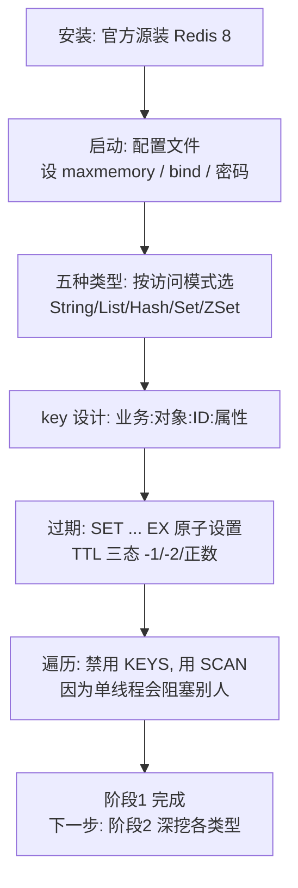

# 第 2 课：跑起来第一个 Redis

> 所属阶段：阶段 1《为什么需要 Redis》｜ 水平：零基础 ｜ 本课知识点：安装与启动、五种基础类型与通用命令、key 设计与过期
> 故事情节：电商网站的工程师决定"那就用 Redis 吧"——但装好之后，他发现第一个要解决的问题不是"怎么用"，而是"别把生产环境搞挂"

## 🎯 本课目标

- 独立在本机（WSL）装好 Redis 8 并连上实例，能启动、能查看状态、能干净地关掉
- 对五种基础类型各做一次读写，并知道 `TYPE` 查出来的五种类型各自适合什么
- 设计合理的 key 命名，正确使用 TTL，并**用实测数据说清为什么 `KEYS` 在生产环境被禁用**

---

## 第一幕：起源与场景引入

> 🏛️ **起源**：Redis 的运维习惯不是凭空来的，是被事故喂出来的。`KEYS` 命令从第一版就存在，它的语义是"遍历全部 key 并一次性返回"——在早期大家数据量都不大时，这是个顺手好用的命令。直到有一天，有人在一个有上千万 key 的生产实例上敲下 `KEYS user:*`，整个 Redis 卡住几秒，上游所有请求超时，网站雪崩。这类事故反复发生之后，社区形成了一条不成文的铁律：**生产环境禁用 `KEYS`，用 `SCAN` 代替**。今天 Redis 官方文档里 `KEYS` 页面顶部就挂着醒目警告。本课第四幕会用你自己机器上的实测数据，把这条铁律变成你能亲眼看到的事实。

承接上一课：电商网站决定用 Redis 缓解 MySQL 的压力。工程师领到任务，兴冲冲地去装 Redis。装好、连上、敲下第一个 `SET`——一切顺利。

然后他写了这行代码，准备上线：

```bash
KEYS order:*
```

> 🎬 **场景**：一个刚装好的 Redis，和一个"看起来没什么问题"的命令。这个命令会在上线后把整个网站拖垮。本课要做的，就是让你在安全的地方亲手踩一次这个坑。

---

## 第二幕：认知冲突

装好 Redis 之后，你会面对三个看似简单、实则处处是坑的问题：

> ❓ **问题 1**：Redis 有五种基础类型，但**我该用哪个**？看起来什么都能用 `SET`/`GET` 搞定——那为什么还要有另外四种？

> ❓ **问题 2**：key 不就是个名字吗，随便起不行吗？为什么大家都在讲"key 设计规范"？

> ❓ **问题 3**：`KEYS` 明明很好用，一敲就把想要的 key 全列出来了。**它到底危险在哪？** 如果只是"慢一点"，为什么会被全面禁用？

第三个问题的答案，会颠覆你对"慢"的理解。

---

## 第三幕：层层揭示

### 知识点 1：安装与启动——先把环境握在自己手里

> 本知识点关键点：官方源 vs 系统源的版本陷阱 / 三种启动方式 / 配置文件的关键项 / 干净地关闭

#### 一句话定义

安装 Redis 的核心不是"装上"，而是**装对版本、用对方式启动、知道怎么干净地关掉它**。

#### 直觉建立（类比）

装 Redis 有点像**买一台咖啡机**：超市里那种"万能适配"的（系统 apt 源）能用，但可能是几年前的老型号；官方旗舰店（官方源）才是最新款，功能和安全更新都在。而"启动方式"就像选择用一次性胶囊还是自己磨豆——**临时测试用快捷方式，长期运行必须用配置文件**。

> 💡 **类比的边界**：咖啡机买错最多是难喝；Redis 版本装错可能意味着你学了一堆已经废弃的知识。7.0 线已经停止维护，官方源装的是 8.10.1。

#### 核心原理

**1. 版本陷阱：系统源里的 Redis 是旧的**

很多 Linux 发行版的自带源里，Redis 停留在 7.0.x（甚至 6.x），而这些主线版本**已经停止维护**。正确做法是添加 Redis 官方 apt 源。

**2. 三种启动方式，三种用途**

| 方式 | 命令 | 适用场景 |
|------|------|----------|
| 前台启动 | `redis-server` | 调试、看日志（Ctrl+C 即停） |
| 后台启动（命令行参数） | `redis-server --port 6399 --daemonize yes` | 临时测试、课程练习 |
| 后台启动（配置文件） | `redis-server /etc/redis/redis.conf` | **生产环境唯一正确方式** |

为什么生产必须用配置文件？因为**命令行参数无法被运维工具统一管理**，而且配置项的默认值往往是为"小数据量测试"设计的（比如 `maxmemory` 默认不限制——这在生产上是灾难）。

**3. 配置文件里最该先改的四项**

| 配置项 | 默认值 | 生产建议 | 原因 |
|--------|--------|----------|------|
| `bind` | 可能监听所有网卡 | 明确指定内网 IP | 暴露公网是 Redis 被入侵的头号原因 |
| `requirepass` | 空 | 设置强密码 | 同上 |
| `maxmemory` | 0（不限制） | 设为物理内存的 60-70% | 不限制会撑爆内存被 OOM kill |
| `appendonly` | no | 按业务决定 | 阶段 3 展开 |

#### 示例演示

以下命令均在本机 WSL（Ubuntu 24.04）实测通过，Redis 版本 **8.10.1**（核查于 2026-08）。

```bash
# 1. 添加官方源（仅首次需要）
curl -fsSL https://packages.redis.io/gpg | sudo gpg --dearmor -o /usr/share/keyrings/redis-archive-keyring.gpg
echo "deb [signed-by=/usr/share/keyrings/redis-archive-keyring.gpg] https://packages.redis.io/deb noble main" \
  | sudo tee /etc/apt/sources.list.d/redis.list
sudo apt-get update && sudo apt-get install -y redis-server

# 2. 验证版本
redis-server --version
# 预期输出：Redis server v=8.10.1 ...

# 3. 启动课程实例（端口 6399，关掉持久化，干净起步）
mkdir -p /tmp/redis-course && cd /tmp/redis-course
redis-server --port 6399 --daemonize yes --save '' --appendonly no
```

> 💡 **为什么课程用 6399**：6379 留给系统服务，课程实例统一跑 6399，避免冲突，也便于随时启停、保持环境干净。
>
> ⚠️ 启动时你可能看到 `WARNING Memory overcommit must be enabled!` 警告，这在 WSL 下很常见，不影响课程实操。

```bash
# 4. 连通性检查 —— 永远的第一步
redis-cli -p 6399 ping
# 预期输出：PONG

# 5. 看服务器状态
redis-cli -p 6399 info server | grep -E "redis_version|uptime_in_seconds"
# 预期输出：
# redis_version:8.10.1
# uptime_in_seconds:12

# 6. 干净地关闭（会用配置文件里指定的方式保存数据，nosave 表示不保存）
redis-cli -p 6399 shutdown nosave
```

> 🔑 **为什么 `shutdown` 而不是 `kill`**：`shutdown` 会让 Redis 走正常的关闭流程（该持久化的先持久化）。直接 `kill -9` 相当于拔电源——数据可能损坏，恢复时 Redis 会拒绝启动。

#### 常见误区

1. **"装上就能用，不用管版本"**：系统源可能是 EOL 版本，学到的行为和最新版不同。
2. **用 `kill -9` 关 Redis**：这是"拔电源"，可能导致数据文件损坏。永远用 `shutdown`。
3. **不设 `maxmemory` 就上生产**：默认不限制内存，业务增长时会把机器内存吃光，被系统 OOM kill。

#### 一句话记住

**装对版本（官方源）、启动用配置文件（生产）、关闭用 `shutdown`（干净）——这三件事比会多少命令都重要。**

#### 官方文档

- [Redis 安装指南](https://redis.io/docs/latest/operate/oss_and_stack/install/install-redis/)
- [redis.conf 配置说明](https://redis.io/docs/latest/operate/oss_and_stack/management/config/)

---

### 知识点 2：五种基础类型与通用命令——选对结构，而不是一律 SET

> 本知识点关键点：五种类型的适用场景 / 通用命令 / TYPE 与 OBJECT ENCODING

#### 一句话定义

Redis 提供五种基础数据结构，每种对应一类访问模式：**选错结构，就要在应用层写更多代码、冒更多的并发风险。**

#### 直觉建立（类比）

五种类型就像**五种容器**：

| 类型 | 容器 | 装什么 | 典型场景 |
|------|------|--------|----------|
| String | 一个小盒子 | 单个值（字符串/数字/二进制） | 缓存、计数器、分布式锁 |
| List | 一根管子 | 有序、可重复的元素 | 队列、最新列表、消息流 |
| Hash | 一张表格 | 字段-值对的集合 | 对象存储（用户信息、购物车） |
| Set | 一个袋子 | 无序、**不重复**的元素 | 标签、去重、共同好友 |
| ZSet | 带分数的排行板 | 不重复元素 + 分数 | 排行榜、延迟队列、优先级 |

> 💡 **类比的边界**：容器有各自的容量代价。ZSet 因为要维护排序，内存开销明显大于 Set——**能表达得更多，代价也更大**。

#### 核心原理

**为什么不能一律用 String？**

表面上看，任何数据都能序列化成 JSON 塞进 String。问题是：

- **改一个字段要整体读写**：用户信息存成 `SET user:1001 '{"name":"张三","age":28,"city":"北京"}'`，改个 age 要把整个 JSON 取回来、解析、改、序列化、写回。用 Hash 则一条 `HSET user:1001 age 29` 搞定。
- **并发下会丢更新**：两个请求同时读到旧 JSON、各自改、先后写回，后写的覆盖先写的。Hash 的 `HINCRBY` 是原子的。
- **排序要在本地做**：排行榜用 String 存，得把整个榜单取回本地排序。ZSet 在服务器端排好，只返回你要的前十名。

**通用命令（对任何类型都适用）**

| 命令 | 作用 | 要点 |
|------|------|------|
| `TYPE key` | 查看类型 | 返回 string/list/hash/set/zset |
| `EXISTS key` | 是否存在 | 存在返回 1，不存在返回 0 |
| `DEL key` | 删除 | 返回删除的个数 |
| `TTL key` | 查看剩余过期时间 | **见知识点 3，三态含义必须记牢** |
| `EXPIRE key 秒` | 设置过期 | 返回 1 成功，0 表示 key 不存在 |
| `DBSIZE` | 当前库 key 总数 | O(1)，可以放心用 |
| `OBJECT ENCODING key` | 查看底层编码 | 同一个类型可能有多种内部实现 |

#### 示例演示

以下是本课备课时的真实输出（Redis 8.10.1，WSL）：

```bash
# ===== String =====
redis-cli -p 6399 set product:1001:name "机械键盘"
# OK
redis-cli -p 6399 get product:1001:name
# "机械键盘"
redis-cli -p 6399 set stock:1001 100
redis-cli -p 6399 incr stock:1001        # (integer) 101
redis-cli -p 6399 decrby stock:1001 5    # (integer) 96

# ===== List =====
redis-cli -p 6399 rpush queue:orders "order:1" "order:2" "order:3"
# (integer) 3
redis-cli -p 6399 lpop queue:orders      # "order:1"
redis-cli -p 6399 lrange queue:orders 0 -1
# 1) "order:2"  2) "order:3"

# ===== Hash =====
redis-cli -p 6399 hset user:1001 name "张三" age 28 city "北京"
# (integer) 3
redis-cli -p 6399 hget user:1001 name    # "张三"
redis-cli -p 6399 hgetall user:1001
# 1) "name" 2) "张三" 3) "age" 4) "28" 5) "city" 6) "北京"

# ===== Set（注意重复添加被忽略）=====
redis-cli -p 6399 sadd tags:1001 "电子" "外设" "促销"
# (integer) 3
redis-cli -p 6399 sadd tags:1001 "电子"   # (integer) 0 ← 已存在，没加进去
redis-cli -p 6399 sismember tags:1001 "外设"  # (integer) 1

# ===== ZSet =====
redis-cli -p 6399 zadd rank:daily 1200 "player:a" 950 "player:b" 1600 "player:c"
# (integer) 3
redis-cli -p 6399 zrevrange rank:daily 0 -1 withscores
# 1) "player:c" 2) "1600" 3) "player:a" 4) "1200" 5) "player:b" 6) "950"

# ===== 通用命令 =====
redis-cli -p 6399 type user:1001         # hash
redis-cli -p 6399 type rank:daily        # zset
redis-cli -p 6399 exists notexist:key    # (integer) 0
redis-cli -p 6399 dbsize                 # (integer) 6
```

底层编码（为阶段 2 埋个伏笔，现在只需知道它存在）：

```bash
redis-cli -p 6399 object encoding product:1001:name   # embstr（短字符串）
redis-cli -p 6399 object encoding stock:1001          # int（纯数字，直接存整数）
redis-cli -p 6399 object encoding user:1001           # listpack（小 hash 的紧凑编码）
```

**同样的 `list` 或 `hash`，底层编码可能完全不同**——这是 Redis 为了省内存做的自动优化，具体规则阶段 2 会展开。

#### 常见误区

1. **"什么都序列化成 JSON 存 String 就行"**：改字段要整体读写、并发下丢更新、排序要本地算——三个问题你都得在应用层自己解决。
2. **"`EXISTS` 返回 0 就是 key 不存在"**：对，但要注意**过期的 key 也会被当作不存在**（返回 0）。
3. **"Set 和 List 差不多，都能存多个"**：Set **不允许重复**且**无序**，List 允许重复且有序。用途完全不同。

#### 一句话记住

**五种类型对应五种访问模式：能用原生结构表达的需求，就不要在应用层拼装——拼装的代价是代码量、并发风险和网络往返。**

#### 官方文档

- [Redis 数据类型](https://redis.io/docs/latest/develop/data-types/)
- [Redis 命令参考](https://redis.io/docs/latest/commands/)

---

### 知识点 3：key 设计与过期——这里藏着生产事故

> 本知识点关键点：命名规范 / TTL 三态 / KEYS 的真实危险（实测） / SCAN 的正确用法

#### 一句话定义

key 设计的核心是**让 key 自解释、可管理、可批量操作**；过期机制的核心是**让缓存能自动失效，而不是永远占着内存**；而 `KEYS` 的故事告诉我们：**Redis 的"慢"从来不是它自己慢，而是它让别人等。**

#### 直觉建立（类比）

key 命名像**给文件起名**：

- ❌ `data1.txt`、`aaa`、`临时文件` —— 半年后你自己都看不懂
- ✅ `2026Q1-财务报表-终版.xlsx` —— 见名知义，还能按前缀批量查找

Redis 没有表、没有 schema，**key 就是唯一的结构信息**。命名乱了，等于把所有数据扔进一个没有标签的仓库。

> 💡 **类比的边界**：文件系统有目录层级，Redis 的 key 是**扁平的命名空间**——那些冒号只是字符串的一部分，不是真正的层级。所谓的"目录感"完全靠命名约定维持。

#### 核心原理

**1. key 命名规范**

业界通行的约定是 `业务:对象:ID:属性`：

```bash
user:1001              # 用户 1001
user:1001:profile      # 用户 1001 的资料
order:2026:10086       # 2026 年的订单 10086
product:1001:stock     # 商品 1001 的库存
```

遵循三条原则：

| 原则 | 说明 | 反例 |
|------|------|------|
| 见名知义 | 从 key 能看出业务含义 | `k1`、`tmp`、`data` |
| 避免过长 | key 本身也占内存 | `com:company:department:team:project:module:user:1001:profile:name` |
| 统一前缀 | 便于按前缀批量管理和迁移 | 同一业务一会儿 `user:` 一会儿 `usr:` |

> ⚠️ key 虽然是扁平的，但**前缀统一**非常重要：它能让 `SCAN MATCH` 高效筛选，也能让运维一眼看出这个 key 属于哪个业务。

**2. TTL 的三态——必须记牢**

```bash
redis-cli -p 6399 ttl product:1001:name   # -1 → 存在，且永不过期
redis-cli -p 6399 ttl notexist:key        # -2 → key 不存在（或已过期）
redis-cli -p 6399 ttl some:key            # 正数 → 剩余秒数
```

| 返回值 | 含义 |
|--------|------|
| `-1` | 存在，但**没有设置过期时间**（永不过期） |
| `-2` | **不存在**（包括已过期的） |
| `>0` | 剩余生存秒数 |

设置过期的两种常用方式：

```bash
redis-cli -p 6399 expire product:1001:name 60      # 对已存在的 key 设置 60 秒
redis-cli -p 6399 set sms:code:13800138000 "8848" ex 300   # 写入时直接设 300 秒（原子，推荐）
```

> 🔑 **为什么推荐 `SET ... EX` 而不是 `SET` + `EXPIRE`**：后者是两条命令，如果中间进程崩了，就会留下一个**永不过期的 key**（内存泄漏）。`SET ... EX` 是原子的，要么都成、要么都不成。

取消过期用 `PERSIST`，删除用 `DEL`：

```bash
redis-cli -p 6399 persist product:1001:name   # (integer) 1 → 成功，TTL 变回 -1
redis-cli -p 6399 del sms:code:13800138000    # (integer) 1 → 删除成功
```

**3. `KEYS` 为什么被禁用——这是本课最重要的一段**

`KEYS pattern` 会**遍历整个 keyspace，把所有匹配的 key 一次性返回**。它的危险不在"它自己跑多久"，而在于：**Redis 命令执行是单线程的（第 1 课讲过），`KEYS` 跑的这段时间里，其他所有命令都在排队等着。**

用真实数据说话。以下是在 100 万个 key 的实例上的实测结果（备课实测，WSL，Redis 8.10.1）：

| 操作 | 自己耗时 | 期间其他命令被阻塞的**最大延迟** |
|------|---------|---------------------------|
| 空闲基准 | — | **4 ms** |
| `KEYS biz:item:*` | 0.37 秒 | **239 ms** ⚠️ |
| `SCAN ... COUNT 1000` 遍历完 | 3.42 秒 | **4 ms** ✅ |

看懂这张表，你就懂了 `KEYS` 的全部问题：

- `KEYS` 自己只跑了 **0.37 秒**——看起来"挺快"。
- 但这 0.37 秒里，**其他命令最长等了 239 毫秒**。对线上服务来说，200+ 毫秒的延迟意味着大量请求超时、重试、雪崩。
- `SCAN` 总耗时更长（3.42 秒），但它是**分批游标遍历**，每次只扫一小部分就让出主线程，所以**其他命令的最大延迟仍是 4ms，和空闲时一模一样**。

`KEYS` 还有**第二个常被忽略的危险**：它会把匹配的 key **全部攒在内存里一次性返回**。在千万级 key 的实例上，`KEYS *` 的响应可能高达**数百 MB**，既撑爆 Redis 自己的输出缓冲区，也撑爆客户端内存。`SCAN` 则每批只返回一点点，内存占用恒定。

> 🔑 **一句话记住这个对比**：`KEYS` 是"我一次干完，你们全部等着"；`SCAN` 是"我干一小会儿就歇一下，你们随时插队"。**在单线程系统里，"让不让别人插队"比"自己快不快"重要得多。**

`SCAN` 的正确用法：

```bash
# 游标从 0 开始，每次返回「下一批游标」+「本批 key」
redis-cli -p 6399 scan 0 match "biz:item:*" count 1000
# 返回类似：
# 1) "17234"        ← 下一批的游标
# 2) 1) "biz:item:123"
#    2) "biz:item:456"
#    ...

# 用返回的新游标继续，直到游标回到 "0" 表示遍历结束
redis-cli -p 6399 scan 17234 match "biz:item:*" count 1000
```

> 🔁 **关键：游标回到 `0` 才算遍历结束。** 上面只是第一批，必须拿返回的游标反复调用，直到返回 `0`——中途返回空列表**不代表结束**。
>
> ```bash
> # 客户端循环伪代码（各语言客户端都封装了 scan_iter 之类的方法）
> cursor = 0
> while True:
>     cursor, keys = redis.scan(cursor, match="biz:item:*", count=1000)
>     process(keys)
>     if cursor == 0:      # 游标回到 0，遍历完成
>         break
> ```
>
> redis-cli 下最简单的做法是直接用内置模式，它帮你跑完整个循环：
>
> ```bash
> redis-cli -p 6399 --scan --pattern "biz:item:*"
> ```

`SCAN` 的三个注意事项：

- **必须循环到游标为 0**：只跑一次不会遍历完，中途空结果也不代表结束。
- **可能返回重复 key**：遍历过程中如果有写入，同一个 key 可能出现在多批结果里。**应用层要去重**，别假设它不重复。
- **`COUNT` 是"参考值"不是"保证值"**：它只是建议每次扫描的量，实际返回多少不一定；`MATCH` 是**先取后过滤**，所以稀疏 pattern 下很多批可能返回空。

**4. 生产环境怎么处理"禁止 KEYS"**

最实际的办法是**用配置禁掉它**。在 `redis.conf` 里：

```conf
rename-command KEYS ""
rename-command FLUSHALL ""
rename-command FLUSHDB ""
```

这样执行 `KEYS` 会报 "unknown command"，从根上杜绝误操作。

> ⚠️ **时代提示**：`rename-command` 是传统做法，自 Redis 6.2 起官方已将其标记为 **deprecated**，推荐用 **ACL**（访问控制列表）做更细粒度的管控：
>
> ```bash
> # 用 ACL 禁止 default 用户执行 KEYS（无需重启，ACL SAVE 持久化）
> redis-cli -p 6399 ACL SETUSER default -KEYS
> # 执行效果：
> redis-cli -p 6399 keys "*"
> # (error) NOPERM this user has no permissions to run the 'keys' command
> ```
>
> 两种方式都有效：`rename-command` 简单粗暴、需重启；`ACL` 可按用户精细授权、动态生效。ACL 的详细用法在阶段 4《生产实践与选型》的安全基线部分展开。

#### 示例演示

亲手复现这个实验（约 1 分钟，会造 100 万个 key，课后记得清理）：

```bash
# 1. 造 100 万个 key
redis-cli -p 6399 eval "local i=0 while i < 1000000 do i = i + 1 redis.call('set', 'biz:item:'..i, string.rep('v', 50)) end return i" 0
redis-cli -p 6399 dbsize    # (integer) 1000000

# 2. 感受 KEYS 的阻塞：开两个终端
#    终端 A：执行 KEYS
redis-cli -p 6399 keys "biz:item:*" > /dev/null
#    终端 B（在 A 执行的同时）：连续 PING，观察延迟飙升
redis-cli -p 6399 --latency

# 3. 换成 SCAN，再观察终端 B 的延迟——几乎不变
redis-cli -p 6399 scan 0 match "biz:item:*" count 1000

# 4. 清理
redis-cli -p 6399 flushall
```

> 📌 如果你不想造 100 万 key，完整脚本已备好：`playground/prep-lesson-02-blocking.sh`，它会造数据、测两组延迟、打印对比表格，最后自动清理。

#### 常见误区

1. **"`KEYS` 只是慢一点，偶尔用一次没关系"**：错。问题不是慢，是**阻塞**。哪怕 0.37 秒，也足以让依赖它的服务集体超时。
2. **"`SCAN` 更快"**：不一定。实测 `SCAN` 总耗时（3.42 秒）反而比 `KEYS`（0.37 秒）长。**它的价值是不阻塞别人，不是自己更快。**
3. **"`SCAN` 结果一定不重复、一定完整"**：遍历中有写入时可能重复；如果遍历期间 key 被删除，也可能漏掉。需要完整快照的场景不能依赖 `SCAN`。
4. **"设了 TTL 的 key 到点就精确删除"**：不是。Redis 用**惰性删除 + 定期删除**结合，过期 key 可能在过期后还占着内存一小会儿（阶段 4 会详细拆解）。

#### 一句话记住

**key 要自解释；过期要原子设置（`SET ... EX`）；遍历永远用 `SCAN`——因为 Redis 单线程的特性决定了，让其他命令等 200ms 比自己多跑 3 秒严重得多。**

#### 官方文档

- [KEYS 命令（含官方警告）](https://redis.io/docs/latest/commands/keys/)
- [SCAN 命令](https://redis.io/docs/latest/commands/scan/)
- [EXPIRE 命令](https://redis.io/docs/latest/commands/expire/)

---

## 第四幕：实操验证

回到第一幕：那个准备上线 `KEYS order:*` 的工程师。现在我们亲手验证这个决定有多危险，并给出正确做法。

### 准备环境

> 📌 这里用命令行参数快速启动，仅供课程练习。回顾知识点 1：**生产环境务必用配置文件启动**，因为 `maxmemory`、`bind`、`requirepass` 这些关键项必须显式设定。

```bash
mkdir -p /tmp/redis-course && cd /tmp/redis-course
redis-server --port 6399 --daemonize yes --save '' --appendonly no
redis-cli -p 6399 ping     # 预期：PONG
```

### 验证 1：五种类型各练一遍

按知识点 2 的示例逐条执行，重点观察两个细节：

```bash
# Set 的重复添加被忽略（返回 0）——这是去重的依据
redis-cli -p 6399 sadd tags:demo "a" "b"
# (integer) 2
redis-cli -p 6399 sadd tags:demo "a"
# (integer) 0   ← 关键：返回 0 表示没新增

# ZSet 在服务器端排好序，只返回你要的前几名
redis-cli -p 6399 zadd rank:demo 100 "p1" 300 "p2" 200 "p3"
redis-cli -p 6399 zrevrange rank:demo 0 1 withscores
# 1) "p2" 2) "300" 3) "p3" 4) "200"
```

### 验证 2：TTL 三态与原子过期

```bash
redis-cli -p 6399 set k1 v1              # 不设过期
redis-cli -p 6399 ttl k1                 # -1 → 永不过期
redis-cli -p 6399 set k2 v2 ex 30        # 原子设置 30 秒
redis-cli -p 6399 ttl k2                 # 30（或接近 30）
redis-cli -p 6399 ttl notexist           # -2 → 不存在
```

### 验证 3：KEYS 的阻塞（本课核心实验）

```bash
# 造 100 万 key（约 15 秒）
redis-cli -p 6399 eval "local i=0 while i < 1000000 do i = i + 1 redis.call('set', 'biz:item:'..i, string.rep('v', 50)) end return i" 0

# 开两个终端：
#   终端 A：redis-cli -p 6399 --latency        ← 观察实时延迟
#   终端 B：redis-cli -p 6399 keys "biz:item:*" > /dev/null
# 你会看到终端 A 的延迟从 ~0.2ms 飙到数百毫秒

# 再把终端 B 换成 SCAN，重看终端 A —— 延迟几乎不动
redis-cli -p 6399 scan 0 match "biz:item:*" count 1000
```

实测结果（备课实测，Redis 8.10.1，100 万 key）：

| 操作 | 自身耗时 | 其他命令被阻塞的最大延迟 |
|------|---------|----------------------|
| 空闲基准 | — | 4 ms |
| `KEYS biz:item:*` | 0.37 秒 | **239 ms** |
| `SCAN` 遍历 | 3.42 秒 | 4 ms |

> ✅ **回扣场景**：回到第一幕那个工程师——`KEYS order:*` 在他的开发环境（几百个 key）上跑得好好的，一上线面对几十万个 key 就会把整个 Redis 堵住几百毫秒，上游请求集体超时。改成 `SCAN` 之后，同样的遍历任务，其他命令的延迟纹丝不动。**第一幕的坑，你现在亲手踩过一遍了。**

```bash
# 收尾
redis-cli -p 6399 flushall
redis-cli -p 6399 shutdown nosave
```

---

## 第五幕：体系收束

> 📍 **全局定位**：本课完成了阶段 1 的"从知道到做到"。课 1 回答"为什么需要 Redis"，本课让你真正拥有了一个能操作的 Redis，并建立了第一条**生产直觉**：在单线程系统里，一个命令的代价不只看它自己跑多久，还要看它让别人等了多久。这条直觉会贯穿后面三个阶段——阶段 2 讲大 key 为什么危险、阶段 3 讲 fork 为什么会卡、阶段 4 讲慢查询怎么定位，背后的道理都是同一个。

**现在你会了什么**：
- 能用官方源装好 Redis 8，用配置文件启动，用 `shutdown` 干净关闭
- 能对五种基础类型各做读写，并用 `TYPE` / `OBJECT ENCODING` 观察它们
- 能设计自解释的 key、用 `SET ... EX` 原子设过期、说出 TTL 三态含义
- 能用实测数据解释为什么生产禁用 `KEYS`，并会用 `SCAN` 替代

> 🔗 **下一步**：五种类型你都摸过了，但 List、Hash、Set、ZSet 各自的内部机制和真实适用场景还没展开。下一阶段《数据结构与命令》会逐个深挖——先讲 List 与 Hash，包括 List 为什么**不适合**当消息队列。

---

## 🐞 常见误区

1. **"用系统自带的 apt 装 Redis 就行"** → 系统源常是 EOL 版本，官方源才是新版。
2. **"关 Redis 用 kill 最快"** → `kill -9` 等于拔电源，可能损坏数据文件，永远用 `shutdown`。
3. **"反正是缓存，`maxmemory` 不用设"** → 默认不限制，会吃光机器内存被 OOM kill。
4. **"什么都存 String + JSON 最灵活"** → 改字段要整体读写、并发丢更新、排序要本地算。
5. **"`KEYS` 慢一点而已，偶尔用没事"** → 问题是**阻塞**别人，实测 100 万 key 下能让其他命令等 239ms。
6. **"`SCAN` 比 `KEYS` 快"** → 不一定更快（实测总耗时更长），它的价值是**不阻塞**。
7. **"TTL 返回 -1 是出错"** → `-1` 是"永不过期"，`-2` 才是"不存在"，别搞反。

## 一图总结



## 课后小测

**Q1**：在 100 万个 key 的实例上（本课实测数据），关于 `KEYS` 和 `SCAN` 下列说法正确的是？
- A. `KEYS` 更快，所以应该在数据量大时使用
- B. `SCAN` 总耗时更短，所以用它替代 `KEYS`
- C. `KEYS` 自身耗时 0.37 秒不算长，但它让其他命令最长等待了 239 毫秒；`SCAN` 虽慢但不阻塞别人
- D. `SCAN` 保证不会返回重复的 key

<details><summary>答案与解析</summary>

**答案：C**。这正是本课的核心结论：`KEYS` 的问题是**阻塞**而非自身慢。B 错在 `SCAN` 总耗时反而更长（3.42 秒 vs 0.37 秒）；D 错在遍历期间有写入时 `SCAN` **可能返回重复 key**，应用层要去重。

补充两个要点：`KEYS` 还有第二个危险——把结果全部攒在内存里一次性返回，千万级 key 下响应可达数百 MB，撑爆输出缓冲区与客户端内存；另外 `SCAN` **必须循环到游标返回 0** 才算遍历完，中途空结果不代表结束。

</details>

**Q2**：执行 `TTL mykey` 返回 `-1`，表示什么？
- A. key 不存在
- B. key 存在，但没有设置过期时间
- C. key 已过期
- D. 命令执行出错

<details><summary>答案与解析</summary>

**答案：B**。三态必须记牢：`-1` = 存在且永不过期；`-2` = 不存在（含已过期）；正数 = 剩余秒数。C 和 A 都对应 `-2`。

</details>

**Q3**：给用户手机验证码设置 5 分钟过期，推荐的做法是？
- A. `SET code:138 "8848"` 然后 `EXPIRE code:138 300`
- B. `SET code:138 "8848" EX 300`
- C. `SET code:138 "8848"`，过期靠应用层定时删除
- D. `SET code:138 "8848"` 然后 `PERSIST code:138`

<details><summary>答案与解析</summary>

**答案：B**。`SET ... EX` 是**原子**的：要么写入+过期都成功，要么都失败。A 的两条命令之间若进程崩溃，会留下一个永不过期的 key（内存泄漏）。C 增加应用层复杂度；D 的 `PERSIST` 是**取消**过期，方向反了。

</details>

**Q4**：关于关闭 Redis，下列做法正确的是？
- A. `kill -9 <pid>` 最快最有效
- B. 直接关掉终端窗口
- C. `redis-cli shutdown nosave`，让 Redis 走正常关闭流程
- D. 拔电源

<details><summary>答案与解析</summary>

**答案：C**。`shutdown` 会触发正常的关闭流程。`kill -9` 相当于拔电源，可能导致持久化文件损坏，下次 Redis 拒绝启动。（注：`nosave` 表示本次不保存数据，适合课程练习；生产环境按持久化配置决定是否保存。）

</details>

**Q5**：商品库存需要频繁扣减，最合适的类型是？
- A. String，存 JSON
- B. Hash
- C. String，用 `INCR`/`DECRBY` 原子操作
- D. List

<details><summary>答案与解析</summary>

**答案：C**。库存是单纯的数值，String + `INCR`/`DECRBY` 在服务器端原子完成，天然避免并发超卖。A 引入 JSON 解析与整体读写；B 的 Hash 适合对象（多字段），单一数值没必要；D 的 List 完全不匹配。

</details>

## 🚀 下一批接力提示词

> 学完本课，**复制下面这段文字发给 AI**，即可无缝进入下一批（无需重新描述上下文）：

```
继续学 Redis。我的学习档案在 redis/00-学习档案.md，
刚学完阶段 1《为什么需要 Redis》的课《跑起来第一个 Redis》知识点「安装与启动、五种基础类型与通用命令、key 设计与过期」，
请按大纲继续讲解阶段 2《数据结构与命令》的课 3《List 与 Hash》的知识点：List 双向操作与阻塞弹出、List 当消息队列的三个硬伤、Hash 存对象 vs String 存 JSON。
```

## 🧭 课程导航

⬅️ **上一课**：[课 1：Redis 是什么](lesson-01-Redis是什么.md)

➡️ **下一阶段**：[阶段 2：数据结构与命令](../../2-数据结构与命令/overview.md)

📚 **返回目录**：[课程目录](../../02-课程目录.md)
