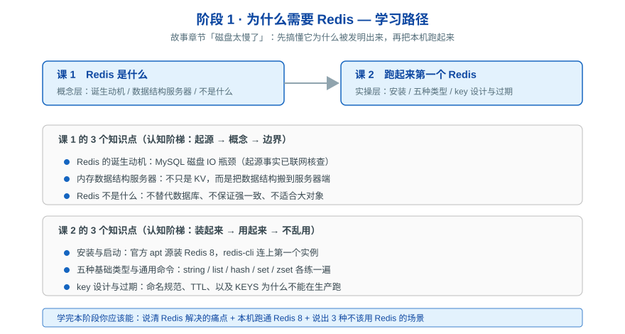

# 阶段 1：为什么需要 Redis

> 所属课程：Redis 系统学习 ｜ 故事章节：「磁盘太慢了」——MySQL 每次读写都要碰磁盘，网站卡死

## 🎯 本阶段目标

- 说清 Redis 是为解决什么问题而诞生的，以及它快在哪一步
- 在本机（WSL）装好 Redis 8 并完成第一次读写
- 建立边界感：知道什么场景不该用 Redis

## 📍 学习重点

- **诞生动机**：Redis 不是凭空设计的，是 antirez 在做实时日志分析 LLOOGG 时被 MySQL 的磁盘 IO 逼出来的。理解动机才能理解它为什么长这样。
- **数据结构服务器**：Redis 的关键创新不是"内存"，而是**把数据结构搬到服务器端**——你要的不是取回数据再算，而是让服务器直接对 list / set / zset 做原子操作。
- **三重身份**：它同时能当缓存、数据库、消息中间件，但每个身份都有前提和代价。
- **边界感**：不替代关系型数据库、不保证强一致、不适合大对象。这一条比"怎么用"更重要。

## ✅ 必须掌握的知识点

| 知识点 | 所属课 | 学完应能 |
|--------|--------|----------|
| Redis 的诞生动机 | 课 1 | 复述 LLOOGG 的故事，说清"磁盘 IO 是瓶颈"这件事 |
| 内存数据结构服务器 | 课 1 | 解释为什么 Redis 不只是 KV 缓存 |
| Redis 不是什么 | 课 1 | 列出至少 3 种不该用 Redis 的场景 |
| 安装与启动 | 课 2 | 独立用官方源装好 Redis 8 并连上 |
| 五种基础类型与通用命令 | 课 2 | 对五种类型各做一次读写 |
| key 设计与过期 | 课 2 | 设计合理的 key 命名，说清 `KEYS` 为什么不能在生产跑 |

## 🗺️ 本阶段路径图

## 本阶段产出

- [x] [课 1《Redis 是什么》](lessons/lesson-01-Redis是什么.md)（2026-08-31，评审 P0=0）
- [x] [课 2《跑起来第一个 Redis》](lessons/lesson-02-跑起来第一个Redis.md)（2026-08-31，评审 P0=0）

---

➡️ **下一阶段**：[阶段 2：数据结构与命令](../2-数据结构与命令/overview.md)

📚 **返回目录**：[课程目录](../../02-课程目录.md)
