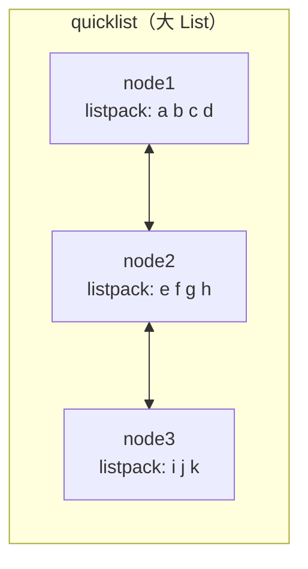
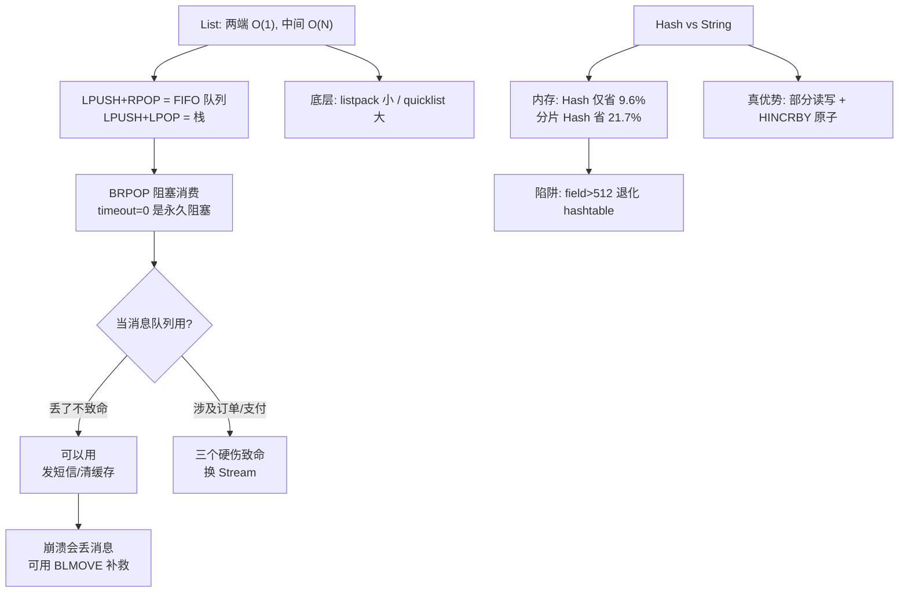

# 第 3 课：List 与 Hash

> 所属阶段：阶段 2《数据结构与命令》｜ 上一课：[课 2：跑起来第一个 Redis](../1-为什么需要Redis/lessons/lesson-02-跑起来第一个Redis.md) ｜ 本课知识点：List 双向操作与阻塞弹出、List 当消息队列的三个硬伤、Hash 存对象 vs String 存 JSON
> 故事情节：电商网站用 Redis 跑通了缓存，接着想把「下单后发短信」这类慢活异步化——最自然的想法是用 List 当队列。这个想法能跑，但会在某次消费者崩溃时丢掉订单

## 🎯 本课目标

- 掌握 List 的双向操作与 `BRPOP` 阻塞弹出，能写出一个可用的任务队列 demo
- 说清 List 当消息队列的**三个硬伤**，知道什么场景能凑合用、什么场景必须用 Stream
- 面对「对象怎么存」能给出**选型判断条件**，而不是一律选 Hash 或一律选 String

---

## 第一幕：起源与场景引入

> 🏛️ **起源**：Redis 的作者 antirez 在 2009 年做 LLOOGG 时，需要的是「实时列表」——最新访问记录要能快速追加、快速截取。所以 List 从一开始就被设计成**两端操作 O(1)** 的结构。而 `BLPOP`/`BRPOP` 这组阻塞命令，是社区在把它当队列用之后才补上的：**数据结构本身没变，是用法把它推成了队列**。理解这一点很重要——List 从来不是为消息队列设计的，它的三个硬伤都源于此。

承接上一课：电商网站的缓存跑通了，MySQL 压力降下来了。但工程师发现一个新问题——用户下单后要发短信、要更新积分、要通知仓库，**这些慢活都堵在下单接口里**，用户点了"提交订单"要等三秒才有反应。

工程师说：把这些慢活丢进队列，后台慢慢处理。

他看了眼 Redis，List 不是有 `LPUSH` 和 `RPOP` 吗？一端进、一端出，这不就是队列？还自带 `BRPOP` 能阻塞等待，连轮询都省了。

> 🎬 **场景**：两行命令搭出一个队列，测试环境跑得飞快。上线一周后，一次消费者进程崩溃，导致 300 多个订单的短信没发出去，且**没有任何办法找回**。本课要讲的就是：这个队列为什么能用，以及它会在什么时候辜负你。

---

## 第二幕：认知冲突

> ❓ **问题 1**：`BRPOP` 能阻塞等待、能多消费者竞争——这不就是消息队列的全部吗？**它还缺什么？**

> ❓ **问题 2**：大家都说"存对象要用 Hash，比 String 省内存"。但实测下来，Hash 只比 String+JSON 省了 **9.6%**——远没有传说中的"省 5 倍"。**是实测错了，还是这个说法本身有前提？**

> ❓ **问题 3**：List 按下标访问中间元素是 O(N)，所以很慢。但实测 500 万元素的 List，`LINDEX` 中间元素只要 **4.6 毫秒**。**"O(N) 很慢"这句话，在 Redis 里到底该怎么理解？**

第二个和第三个问题的答案，都会推翻你刚建立的常识。

---

## 第三幕：层层揭示

### 知识点 1：List 双向操作与阻塞弹出

> 本知识点关键点：两端 O(1) 的队列/栈模型 / BRPOP 阻塞与唤醒 / timeout=0 的坑 / 底层 listpack→quicklist

#### 一句话定义

List 是一组**有序、可重复**的字符串元素，支持从两端以 O(1) 复杂度插入和弹出；`BRPOP`/`BLPOP` 让消费者在队列为空时**阻塞等待**而非空轮询。

#### 直觉建立（类比）

List 像一根**两头都开口的管子**：

- 从左端（`LPUSH`）塞进去，从右端（`RPOP`）拿出来 → **队列 FIFO**（先进先出）
- 从左端塞进去，从左端（`LPOP`）拿出来 → **栈 LIFO**（后进先出）
- 两头都快，都是 O(1)；**中间慢**，按下标访问要 O(N)

> 💡 **类比的边界**：管子中间的东西你也能掏出来（`LINDEX`、`LINSERT`），但得从某一头一路摸过去，元素越多越久。

#### 核心原理

**1. 队列与栈：命令组合决定语义**

| 模型 | 写入 | 读取 | 语义 |
|------|------|------|------|
| 队列 FIFO | `LPUSH` | `RPOP` | 先进先出（推荐组合） |
| 队列 FIFO | `RPUSH` | `LPOP` | 先进先出（等价组合） |
| 栈 LIFO | `LPUSH` | `LPOP` | 后进先出 |

> ⚠️ 务必成对使用：`LPUSH` 配 `RPOP`，`RPUSH` 配 `LPOP`。如果 `RPUSH` 配 `RPOP`（都操作同一端），得到的是**栈**而不是队列——这是初学者最常见的错误，且在小数据量下不易察觉。

**2. 阻塞弹出：`BRPOP` 解决空轮询**

用 `RPOP` 消费空队列会立刻返回 nil，消费者只能写 `while(true)` 疯狂轮询——**CPU 白烧，Redis 也被无效请求淹没**。

`BRPOP key timeout` 的行为是：

- 队列非空 → **立刻**弹出并返回（和 `RPOP` 一样）
- 队列为空 → **挂起连接**，直到有元素被推入，或超时
- 超时仍无数据 → 返回 nil

**3. 三个必须知道的命令细节**

| 命令 | 作用 | 复杂度 |
|------|------|--------|
| `LPUSH` / `RPUSH` | 从左/右端插入（可多个） | O(1) 或 O(N) 个 |
| `LPOP` / `RPOP` | 从左/右端弹出（Redis 6.2+ 支持指定个数） | O(1) 或 O(N) 个 |
| `BRPOP` / `BLPOP` | 阻塞版弹出，`timeout=0` 表示**永久阻塞** | O(1) |
| `LLEN` | 元素个数 | **O(1)**（内部维护了计数） |
| `LRANGE key start stop` | 取区间元素 | O(S+N) |
| `LINDEX key index` | 按下标取元素 | **O(N)** |
| `LTRIM key start stop` | 只保留区间内的元素 | O(N) |

> 🔑 **`timeout=0` 是永久阻塞，不是"立刻返回"**。客户端会一直挂着，如果连接被防火墙或代理悄悄断开，客户端可能永远收不到通知。**生产环境建议设一个有限值（如 30 秒）并循环重试**，让连接有机会被健康检查。

**4. 底层结构：listpack → quicklist（这里纠正一个常见误解）**

很多资料说"List 是双向链表"，这在 Redis 3.2 之前是对的，现在是错的。Redis 7/8 的实际结构是**两层**：

- **小 List**（默认 ≤ 8KB）：整体编码为 **listpack** —— 一块**连续紧凑的内存**，所有元素挨着放，没有指针开销
- **大 List**（超过阈值）：编码转为 **quicklist** —— 一个双向链表，**每个节点内部是一个 listpack**



这样设计是为了兼顾两端：连续内存省空间（listpack），但单个 listpack 太大时插入删除会触发大量内存搬移，所以拆成多个节点用链表串起来（quicklist）。用 `list-max-listpack-size` 控制每节点大小（`-2` 表示每节点 8KB）。

实测验证（本机 Redis 8.10.1）：

```bash
redis-cli -p 6399 rpush q a b c
redis-cli -p 6399 object encoding q     # listpack  ← 小 List，整块紧凑内存
# 元素超过 8KB 后
redis-cli -p 6399 object encoding bigq   # quicklist ← 大 List，链表+listpack
```

**"LINDEX 到底慢不慢？"——把这件事一次说清**

这条容易混淆，我们拆成三层看：

1. **理论复杂度：O(N)**。元素越多，定位中间元素遍历得越久。这是对的。
2. **实际常数：极小**。quicklist 不是"一个元素一个节点"的朴素链表，它先按节点跳跃（500 万元素只有约 600 个节点），再在节点内的连续内存里定位。实测 500 万元素访问中间只要 **4.6 毫秒**。
3. **真正的代价：不是慢，是占内存**。实测同一个 List：10 万元素占 2.6 MB，100 万占 26.7 MB，**500 万占 138 MB**。

用进程内批量计时（剥离网络往返）能看到 O(N) 的增长趋势确实存在：

| 元素数 | 单次 LINDEX 均值 | 对照：单次 LPOP（O(1)） |
|--------|-----------------|----------------------|
| 1 万 | 0.0004 ms | 0.0002 ms |
| 100 万 | 0.0027 ms | — |
| 500 万 | **0.0126 ms**（约 30 倍） | 0.0004 ms（几乎不变） |

> 🔑 **结论一句话**：`LINDEX` 在大 List 上确实变慢了（30 倍），但**绝对值仍然极小（0.01 毫秒级），在百万级下根本感觉不到**。所以"O(N) 很慢"这句话在 Redis 的 List 上**不成立**——**真正让你不敢用大 List 的是那 138 MB 内存，以及 `LRANGE 0 -1` 拉取全量时撑爆输出缓冲区，而不是索引延迟。**

#### 示例演示

```bash
# ===== 队列模型：LPUSH 进，RPOP 出（FIFO）=====
redis-cli -p 6399 lpush q "task:1" "task:2" "task:3"
redis-cli -p 6399 lrange q 0 -1
# 1) "task:3"  2) "task:2"  3) "task:1"   ← 最后推入的在最左
redis-cli -p 6399 rpop q
# "task:1"     ← 拿到最先进入的，符合 FIFO

# ===== 阻塞弹出 =====
# 场景 A：队列为空，阻塞 3 秒后超时
redis-cli -p 6399 brpop empty:q 3
# (nil)          ← 实测耗时 3.09 秒

# 场景 B：阻塞中被唤醒（另一终端 1 秒后 lpush）
redis-cli -p 6399 brpop wake:q 5
# 1) "wake:q"
# 2) "hello"     ← 实测 1.00 秒就返回，远小于 5 秒超时

# ===== 其他常用操作 =====
redis-cli -p 6399 rpush q a b c d e
redis-cli -p 6399 llen q              # (integer) 5   ← O(1)
redis-cli -p 6399 lindex q 0          # "a"
redis-cli -p 6399 lindex q -1         # "e"           ← 负下标表示从尾部数
redis-cli -p 6399 ltrim q 0 2         # OK            ← 只保留前 3 个
redis-cli -p 6399 lrange q 0 -1       # 1) "a" 2) "b" 3) "c"
```

**`LPUSH` + `LTRIM` 是最新列表的经典组合**（保留最近 N 条）：

```bash
redis-cli -p 6399 lpush user:123:feed "点赞了文章 456"
redis-cli -p 6399 ltrim user:123:feed 0 99    # 只保留最新 100 条
```

#### 常见误区

1. **"`RPUSH` + `RPOP` 是队列"**：这是栈。队列要 `LPUSH`+`RPOP` 或 `RPUSH`+`LPOP`。
2. **"`BRPOP` timeout=0 表示立刻返回"**：0 是**永久阻塞**，连接会一直挂着。
3. **"List 就是双向链表"**：Redis 7+ 小 List 用 listpack（连续内存），大 List 才是 quicklist（链表+listpack）。
4. **"LINDEX 是 O(N)，所以绝对不能用"**：O(N) 但常数极小，百万级实测仅约 4.6 毫秒。**真正的问题不是索引慢，而是大 List 占内存**（实测 500 万元素占 **138 MB**）。

#### 一句话记住

**List 两端 O(1)、中间 O(N)；`BRPOP` 用阻塞代替轮询；底层小用 listpack、大转 quicklist——它不是朴素链表。**

#### 官方文档

- [Redis Lists 数据类型](https://redis.io/docs/latest/develop/data-types/lists/)
- [BRPOP 命令](https://redis.io/docs/latest/commands/brpop/) ｜ [BLMOVE 命令](https://redis.io/docs/latest/commands/blmove/)
- [内存优化：特殊编码](https://redis.io/docs/latest/operate/oss_and_stack/management/optimization/memory-optimization/)

---

### 知识点 2：List 当消息队列的三个硬伤

> 本知识点关键点：无 ACK（弹出即消失）/ 无消费组（不能扇出）/ 无堆积与回溯 / 什么时候能凑合用 / BLMOVE 补救方案

#### 一句话定义

List 能搭出一个**能跑**的队列，但它缺少消息队列的三个核心能力：**消费确认、消费组、消息回溯**。缺了这三样，它在"消息不能丢"的场景下就是不可用的。

#### 直觉建立（类比）

List 队列像**食堂的一个取餐窗口**：

- 你端走一份饭（`RPOP`），这份饭**就从窗口消失了**
- 你端着饭走到一半摔了一跤，饭洒了——**没人知道这份饭曾经存在过**，也没法再给你一份
- 多个窗口（多个消费者）能同时卖，但**同一份饭只会被一个人端走**
- 想回头查"昨天中午第三份饭卖给谁了"——**没有记录**

而专业消息队列（以及 Redis 的 Stream）像**有签收回执的快递**：快递员把件给你，你签字（ACK）之前，这个件在系统里一直是"在途"状态；你人跑了，件不会丢，系统会重新派给别人。

> 💡 **类比的边界**：取餐窗口效率高、实现简单；签收回执慢一点、复杂一点。**代价换来的正是"不丢"。**

#### 核心原理

**硬伤一：没有消费确认（ACK）——弹出即消失**

这是最致命的一条。`RPOP`/`BRPOP` 一旦返回，元素**就从 Redis 里彻底删除了**。此时消费者崩溃，这条消息：

- Redis 里没有了（已删除）
- 消费者内存里也没有了（进程已崩）
- **永久丢失，无任何机制找回**

用实测说话：

```bash
redis-cli -p 6399 lpush tasks "task:1" "task:2" "task:3"
redis-cli -p 6399 lrange tasks 0 -1
# 1) "task:3" 2) "task:2" 3) "task:1"

redis-cli -p 6399 rpop tasks
# "task:1"                    ← 消费者取走

redis-cli -p 6399 lrange tasks 0 -1
# 1) "task:3" 2) "task:2"     ← task:1 已从 Redis 消失
# 此刻消费者崩溃 → task:1 永久丢失
```

**硬伤二：没有消费组——无法扇出（同一条消息给多个消费组各读一次）**

多个消费者 `BRPOP` 同一个 List，得到的是**分摊**（每条消息只被一个消费者拿走），这本身是好事（负载均衡）。但真实业务往往需要**扇出**：一条"订单已支付"消息，要同时被「发货服务」「计费服务」「通知服务」各消费一次。

List 做不到：

```bash
redis-cli -p 6399 lpush orders "order:1" "order:2"

# 消费组「发货」取走 order:1
redis-cli -p 6399 rpop orders      # "order:1"

# 消费组「计费」想再读一次 order:1
redis-cli -p 6399 lrange orders 0 -1
# 1) "order:2"                     ← order:1 没了，计费服务永远读不到
```

对照实验：两个消费者各取 2 条，4 条消息被**分摊**，每条只被处理一次。这是负载均衡，**不是扇出**。

**硬伤三：消费即删除——无法回溯、重放、重试**

消息被消费后就不存在了，于是：

- **无法回溯**：想查三天前某条消息的内容——查不到
- **无法重放**：新上线一个消费服务，想从历史数据里跑一遍——做不到
- **无法重试**：没有重试队列、没有死信队列，失败的消息要么立刻重投（可能再次失败），要么丢弃
- **没有消息 ID**：无法追踪单条消息的状态

```bash
redis-cli -p 6399 lpush events "e1" "e2" "e3"
redis-cli -p 6399 rpop events    # 消费 e1
redis-cli -p 6399 rpop events    # 消费 e2
redis-cli -p 6399 lrange events 0 -1
# 1) "e3"                        ← 想重放 e1？没了
```

**那还能用吗？——能，但要清楚边界**

| 场景 | 能否用 List | 说明 |
|------|-----------|------|
| 发短信、清理缓存等**丢了也不致命**的异步任务 | ✅ 可以 | 最简单，两行命令 |
| 日志缓冲、最新列表 | ✅ 可以 | 本来就不要求可靠 |
| 订单、支付、库存扣减 | ❌ 不行 | 消息丢失 = 资损 |
| 需要多个服务各自消费同一份消息 | ❌ 不行 | List 无法扇出 |
| 需要失败重试、死信队列 | ❌ 不行 | 没有原生支持 |

**如果就是想用 List，怎么补救？——可靠队列模式（BLMOVE）**

思路是：不要直接弹出，而是**原子地把消息移动到"处理中"列表**，处理完再从"处理中"列表删除。

```bash
# 消费者：原子地把任务从 tasks 移到 tasks:processing
redis-cli -p 6399 blmove tasks tasks:processing RIGHT LEFT 30

# 处理成功后，从处理中列表删除（相当于 ACK）
redis-cli -p 6399 lrem tasks:processing 1 "<job内容>"

# 如果消费者崩溃，任务留在 tasks:processing 里
# 由一个"回收协程"定期扫描，超时未完成的重新投回 tasks
```

> ⚠️ **`BRPOPLPUSH` 已废弃**。Redis 6.2 起请用 `BLMOVE source destination RIGHT LEFT timeout` 替代（实测可用），它是 `LMOVE` 的阻塞版本。
>
> ⚠️ 注意你为此多写了什么：**一个 ACK 机制、一个扫描回收协程、一套重试策略**。这些本该是消息队列提供的能力，现在由你的团队维护——**这就是"凑合用"的真实成本**。

**正解：Stream（Redis 5.0+）**

Stream 原生解决了全部三条硬伤：

| 能力 | List | Stream |
|------|------|--------|
| 消费确认 | ❌ 弹出即消失 | ✅ `XACK` 确认，未确认的留在 PEL |
| 消费组 | ❌ 无 | ✅ `XREADGROUP`，组内分摊、组间扇出 |
| 消息回溯 | ❌ 消费即删除 | ✅ 按 ID 重读 |
| 消息 ID | ❌ 无 | ✅ 自动生成时间戳 ID |
| 崩溃恢复 | ❌ 消息丢失 | ✅ `XAUTOCLAIM` 认领超时未确认的消息 |

> 📌 Stream 的详细用法超出本课范围（属阶段 2 进阶内容）。本课只需知道：**当你需要"消息不能丢"时，答案不是把 List 改造得更复杂，而是换用 Stream。**

#### 示例演示

亲手复现三个硬伤（约 1 分钟）：

```bash
# 硬伤一：无 ACK
redis-cli -p 6399 lpush tasks "task:1" "task:2" "task:3"
redis-cli -p 6399 rpop tasks                 # 取走 task:1
redis-cli -p 6399 lrange tasks 0 -1          # task:1 已消失，崩溃即丢失

# 硬伤二：无扇出
redis-cli -p 6399 flushall
redis-cli -p 6399 lpush orders "order:1" "order:2"
redis-cli -p 6399 rpop orders                # 「发货」取走 order:1
redis-cli -p 6399 lrange orders 0 -1         # 「计费」再也读不到 order:1

# 硬伤三：无回溯
redis-cli -p 6399 flushall
redis-cli -p 6399 lpush events "e1" "e2" "e3"
redis-cli -p 6399 rpop events
redis-cli -p 6399 rpop events
redis-cli -p 6399 lrange events 0 -1         # 只剩 e3，e1 无法重放

# 补救：BLMOVE 可靠队列模式
redis-cli -p 6399 flushall
redis-cli -p 6399 lpush jobs '{"id":"j1","type":"sms"}'
redis-cli -p 6399 blmove jobs jobs:processing RIGHT LEFT 5
# 返回 '{"id":"j1","type":"sms"}'，且同时出现在 jobs:processing 中
redis-cli -p 6399 lrange jobs:processing 0 -1   # 任务在这里，崩溃不丢
```

> 📌 完整脚本已备好：`playground/prep-lesson-03-mq.sh`，会跑完上述全部实验并打印结论。

#### 常见误区

1. **"多消费者 BRPOP 同一个 List，每个消费者都能收到全部消息"**：错。每条消息只被**一个**消费者拿走，这是分摊不是广播。
2. **"BRPOP 有超时就不会丢消息"**：超时只影响"等多久"，不影响"取走后崩溃会丢"。
3. **"用 BRPOPLPUSH 就行了"**：该命令自 Redis 6.2 起**已废弃**，请用 `BLMOVE`。
4. **"List 当队列一定不行"**：不是。丢了也不致命的异步任务完全可以用，只是别用它处理订单和支付。

#### 一句话记住

**List 队列的三个硬伤：弹出即消失（无 ACK）、一条消息只能被一个消费组读（无扇出）、消费即删除（无回溯）——丢了不致命可以用，涉及钱和订单就换 Stream。**

#### 官方文档

- [LMOVE / BLMOVE（可靠队列模式）](https://redis.io/docs/latest/commands/blmove/)
- [Redis Streams 介绍](https://redis.io/docs/latest/develop/data-types/streams/)
- [XREADGROUP 命令](https://redis.io/docs/latest/commands/xreadgroup/)

---

### 知识点 3：Hash 存对象 vs String 存 JSON

> 本知识点关键点：四方案内存实测 / 部分读写与原子自增 / listpack 阈值退化 / 选型决策条件

#### 一句话定义

存储一个有多字段的对象，本质上是**内存、部分读写能力、灵活性**三者的取舍——**不存在"一律用 Hash"的正确答案**，取决于你的访问模式。

#### 直觉建立（类比）

存对象就像**收拾行李**：

- **String + JSON**：把所有东西塞进一个大箱子。整进整出很方便，但**要拿一双袜子得把箱子倒空**。
- **Hash**：分格收纳盒。每样东西有固定格子，**拿袜子只开袜子那一格**。
- **每字段一个 String**：每双袜子单独用一个盒子。找得清楚，但**盒子本身就占了半个行李箱**。

> 💡 **类比的边界**：分格收纳盒（Hash）在格子少、东西小时特别省地方；格子一多（超过阈值），收纳盒会"膨胀"成普通箱子，省空间的优势就没了。

#### 核心原理

**1. 四种方案的实测内存对比**

光讲道理不够，用数据说话。以下是本机实测：**10000 个对象，每个 5 个字段**（Redis 8.10.1，WSL，扣除空库基线）：

| 方案 | key 数量 | 占用内存 | 相对最优 |
|------|---------|---------|---------|
| **C. 分片 Hash**（100 对象聚合成 1 个 Hash） | ~100 | **1,164,432 字节** | **1.00x** |
| **B. 对象 Hash**（每个对象 1 个 Hash） | 10,000 | 1,344,280 字节 | 1.15x |
| **A. String 存 JSON**（每个对象 1 个 String） | 10,000 | 1,486,768 字节 | 1.28x |
| **D. String 每字段一个 key** | 50,000 | 3,127,536 字节 | **2.69x** |

换算成相对关系：

- 对象 Hash 比 String+JSON **省 9.6%**
- 分片 Hash 比 String+JSON **省 21.7%**
- 每字段一个 String 比 String+JSON **多耗 110.4%**

> 🔑 **这张表纠正了一个流传很广的误传**："Hash 比 String 省 5 倍内存"。实测中**对象 Hash 只省 9.6%**，远没有那么夸张。官方 memory-optimization 文档说的"最多省 10 倍、平均省 5 倍"，指的是**小聚合类型用特殊编码（listpack）对比普通编码**，而不是"Hash 对比 String+JSON"。**省内存的主因是 listpack 紧凑编码 + 减少 key 数量，不是"用了 Hash"这件事本身。**

**2. 为什么分片 Hash 最省？**

每个 key 在 Redis 里都有固定开销（robj 结构、dictEntry、SDS 字符串等，约 90+ 字节）。分片 Hash 把 100 个对象塞进 1 个 key，**省掉了 99 个 key 的固定开销**。

**3. 分片 Hash 的致命陷阱：listpack 阈值**

分片不是越狠越好。Hash 用 listpack 紧凑编码有两个上限：

```bash
redis-cli -p 6399 config get hash-max-listpack-entries   # 512（field 数量上限）
redis-cli -p 6399 config get hash-max-listpack-value     # 64 （单个 value 字节上限）
```

实测验证退化：

```bash
redis-cli -p 6399 eval "for i=1,250 do redis.call('hset','t','o'..i..':id',i) end return 'ok'" 0
redis-cli -p 6399 object encoding t     # listpack  ← field=250，紧凑编码
redis-cli -p 6399 eval "for i=251,520 do redis.call('hset','t','o'..i..':id',i) end return 'ok'" 0
redis-cli -p 6399 object encoding t     # hashtable ← field=520，退化了！
```

> ⚠️ **超过任一阈值，listpack 会不可逆地转成 hashtable**，内存优势立刻消失（且不会自动转回）。所以分片要控制每个 Hash 的 field 数在 **512 以内**——100 个对象 × 5 字段 = 500，刚好卡在阈值内，这就是为什么上面的测试用 100 作为分片大小。

**4. 内存之外的两个维度**

| 维度 | Hash | String + JSON |
|------|------|---------------|
| **部分读写** | ✅ `HSET key field v` 只改一个字段 | ❌ 取出整个 JSON → 解析 → 修改 → 序列化 → 写回 |
| **原子操作** | ✅ `HINCRBY` 服务端原子自增 | ❌ 只能在客户端读改写，并发下丢更新 |
| **取部分字段** | ✅ `HMGET` 只拿需要的字段 | ❌ 要么全取，要么放弃 |
| **嵌套结构** | ❌ Hash 只有一层，嵌套对象要自己序列化 | ✅ JSON 天然支持任意嵌套 |
| **字段级过期** | ❌ 不能给单个 field 设 TTL | ❌ 同样不行（整个 key 一起过期） |
| **灵活性** | ❌ 字段结构固定，加字段要改代码 | ✅ JSON 随便加字段，不用改结构 |

> 🔑 **关键洞察**：Hash 的真正优势**不是省那 9.6% 的内存，而是部分读写和原子自增**。一个需要频繁更新单个字段、或需要原子计数的对象，用 Hash 的理由是"改起来对"，不是"存起来省"。

**5. 选型决策条件**

```
对象有几层嵌套？
├─ 有嵌套（如 {user: {addr: {city: ...}}}）→ String + JSON（Hash 只有一层）
└─ 扁平结构
   ├─ 需要频繁更新单个字段 / 原子计数？
   │  ├─ 是 → Hash（理由：部分读写 + HINCRBY 原子性）
   │  └─ 否（整体读写为主）
   │     ├─ 数据量极大且内存吃紧？
   │     │  ├─ 是 → 分片 Hash（控制 field < 512，注意单 key 过大风险）
   │     │  └─ 否 → 两者皆可，String+JSON 更简单
   │     └─
   └─
```

> ⚠️ **分片 Hash 的两个额外风险**：① 单个 key 过大，在集群模式下无法分片、迁移困难；② `HGETALL` 一个大 Hash 会阻塞主线程（和课 2 的 `KEYS` 同理）。所以分片是**内存优化手段，不是默认选择**。

#### 示例演示

```bash
# ===== Hash 的部分读写优势 =====
redis-cli -p 6399 hset user:1001 name "张三" age 28 city "北京" vip 1
# (integer) 4

# 只改一个字段，无需读写整个对象
redis-cli -p 6399 hset user:1001 age 29
# (integer) 0      ← 返回 0 表示是更新而非新增（HSET 新增返回 1，更新返回 0）

redis-cli -p 6399 hmget user:1001 name age
# 1) "张三"  2) "29"

# 原子自增（并发安全，无需在客户端做读改写）
redis-cli -p 6399 hset user:1001 login_count 0
redis-cli -p 6399 hincrby user:1001 login_count 1    # (integer) 1
redis-cli -p 6399 hincrby user:1001 login_count 5    # (integer) 6

# ===== 底层编码观察 =====
redis-cli -p 6399 object encoding user:1001          # listpack
redis-cli -p 6399 memory usage user:1001             # (integer) 85  ← 仅 85 字节

# 单个 value 超过 64 字节 → 立刻退化为 hashtable
redis-cli -p 6399 hset bigval:h a "$(printf 'x%.0s' {1..100})"
redis-cli -p 6399 object encoding bigval:h           # hashtable
```

> 📌 完整内存横评脚本：`playground/prep-lesson-03-mq.sh`（第 6 节），会跑完四种方案并打印对比表。

#### 常见误区

1. **"Hash 一定比 String 省很多内存"**：实测只省 9.6%。真正的差距在"每字段一个 String"（多耗 110%）和"分片 Hash"（省 21.7%）。
2. **"分片 Hash 分得越细越省"**：field 数超过 512 会退化成 hashtable，优势全失；且单 key 过大会带来集群与阻塞问题。
3. **"Hash 能给单个字段设过期时间"**：**不能**（Redis 8.10 的默认行为）。TTL 只能设在 key 上，Hash 的所有 field 一起过期。如果需要字段级过期，只能拆成多个 key。
4. **"所有对象都应该用 Hash"**：有嵌套结构、整体读写、字段不固定的场景，JSON 更合适。

#### 一句话记住

**Hash 的真正价值是部分读写和原子自增，不是省内存（实测仅省 9.6%）；真想省内存要靠分片 Hash（省 21.7%），但必须把 field 数控制在 512 以内。**

#### 官方文档

- [Redis Hashes 数据类型](https://redis.io/docs/latest/develop/data-types/hashes/)
- [内存优化：特殊编码与阈值](https://redis.io/docs/latest/operate/oss_and_stack/management/optimization/memory-optimization/)
- [OBJECT ENCODING 命令](https://redis.io/docs/latest/commands/object-encoding/)

---

## 第四幕：实操验证

回到第一幕：那个用 List 当队列、上线后丢了 300 条短信的工程师。现在我们亲手复现他踩的坑，并给出他能用的方案。

### 准备环境

```bash
mkdir -p /tmp/redis-course && cd /tmp/redis-course
redis-server --port 6399 --daemonize yes --save '' --appendonly no
redis-cli -p 6399 ping     # 预期：PONG
```

> 📌 这里用命令行参数快速启动，仅供课程练习。回顾课 2 知识点 1：**生产环境务必用配置文件启动**。

### 验证 1：搭一个能跑的队列，并确认方向

```bash
# 生产者：左进
redis-cli -p 6399 lpush queue:sms '{"order":"A001","phone":"138****"}' '{"order":"A002","phone":"139****"}'

# 消费者：右出（阻塞等待 30 秒，生产环境建议设有限值并循环）
redis-cli -p 6399 brpop queue:sms 30
# 1) "queue:sms"
# 2) "{\"order\":\"A001\",\"phone\":\"138****\"}"   ← 先进入的先出，FIFO 正确
```

### 验证 2：亲手弄丢一条消息（复现第一幕的事故）

```bash
redis-cli -p 6399 flushall
redis-cli -p 6399 lpush tasks "task:1" "task:2" "task:3"

# 消费者取走 task:1
redis-cli -p 6399 rpop tasks            # "task:1"

# 【此刻模拟消费者崩溃：直接关掉这个终端 / kill 掉进程】
# 再来看 Redis 里还有什么
redis-cli -p 6399 lrange tasks 0 -1
# 1) "task:3"  2) "task:2"
# task:1 既不在 Redis 里，也不在消费者里 —— 永久丢失
```

> ✅ **回扣场景**：第一幕那个工程师丢的 300 条短信，就是这么没的。`BRPOP` 一返回，消息就从 Redis 消失了，他没有任何办法知道丢了哪些、也没法重发。

### 验证 3：用 BLMOVE 补救

```bash
redis-cli -p 6399 flushall
redis-cli -p 6399 lpush jobs '{"id":"j1","type":"sms","phone":"138****"}'

# 原子移动到"处理中"队列，而不是直接弹出
redis-cli -p 6399 blmove jobs jobs:processing RIGHT LEFT 10
# 返回 '{"id":"j1","type":"sms","phone":"138****"}'

# 消费者崩溃也不怕：任务还在 jobs:processing 里
redis-cli -p 6399 lrange jobs:processing 0 -1

# 处理成功后，从处理中队列删除（相当于 ACK）
redis-cli -p 6399 lrem jobs:processing 1 '{"id":"j1","type":"sms","phone":"138****"}'
```

代价是你要额外维护一个"扫描 jobs:processing、把超时任务重新投回 jobs"的回收协程。

### 验证 4：Hash vs String 内存实测

```bash
# 造 10000 个对象，分别用两种方案存，对比 used_memory
# 完整脚本：playground/prep-lesson-03-mq.sh 第 6 节
bash playground/prep-lesson-03-mq.sh
```

预期结果（本机实测）：

| 方案 | 占用内存 | 相对 String+JSON |
|------|---------|-----------------|
| 分片 Hash（100 对象/key） | 1,164,432 字节 | **省 21.7%** |
| 对象 Hash | 1,344,280 字节 | 省 9.6% |
| String + JSON | 1,486,768 字节 | 基准 |
| String 每字段一个 key | 3,127,536 字节 | **多耗 110.4%** |

```bash
# 收尾
redis-cli -p 6399 flushall
redis-cli -p 6399 shutdown nosave
```

---

## 第五幕：体系收束

> 📍 **全局定位**：本课完成了阶段 2 的第一半——从"能用哪些结构"推进到"这些结构的能力边界在哪"。课 2 让你会五种类型的读写，本课让你明白**选错结构的代价**：List 当队列会在消费者崩溃时丢消息，Hash 分片过头会退化成 hashtable。这两条都不是"命令用错了"，而是**不理解底层机制**导致的。下一课 Set/ZSet 会继续这个主题——尤其是 ZSet 为什么要用跳表+哈希表双结构。

**现在你会了什么**：
- 能用 `LPUSH`+`RPOP` 搭 FIFO 队列，用 `BRPOP` 阻塞消费，用 `LPUSH`+`LTRIM` 做最新列表
- 能说清 List 底层是 listpack（小）/ quicklist（大），以及为什么 `LINDEX` 是 O(N) 但实测很快
- 能解释 List 当队列的三个硬伤，知道 `BLMOVE` 补救方案，知道何时该换 Stream
- 能用实测数据说明 Hash vs String 的真实差距，并给出带前提的选型判断

> 🔗 **下一步**：List 和 Hash 都是"线性/扁平"结构。下一课进入 Set 和 ZSet——**无序去重**与**有序排名**，以及 ZSet 独特的**跳表+哈希表双结构**为什么能让两种查询都快。

---

## 🐞 常见误区

1. **"RPUSH + RPOP 是队列"** → 这是栈。队列要 `LPUSH`+`RPOP` 或 `RPUSH`+`LPOP`。
2. **"BRPOP timeout=0 是立刻返回"** → 0 表示**永久阻塞**，生产环境应设有限值并循环重试。
3. **"List 底层就是双向链表"** → Redis 7+ 小 List 用 listpack（连续内存），大 List 才转 quicklist（链表+listpack）。
4. **"LINDEX 是 O(N) 所以很慢"** → 理论 O(N) 没错，但常数极小（500 万元素仅 0.0126 毫秒，约 30 倍增长但仍可忽略）。**真正让你不敢用大 List 的是内存**（500 万元素占 138 MB）和 `LRANGE 0 -1` 拉全量撑爆缓冲区，不是索引延迟。
5. **"多消费者 BRPOP 同一 List，每个都能收到全部消息"** → 每条消息只被一个消费者拿走，是分摊不是广播。
6. **"用 BRPOPLPUSH 做可靠队列"** → 自 Redis 6.2 已**废弃**，请用 `BLMOVE ... RIGHT LEFT`。
7. **"Hash 比 String 省 5 倍内存"** → 实测只省 9.6%。"省 5 倍"说的是 listpack 编码 vs 普通编码，不是 Hash vs String。
8. **"分片 Hash 分得越细越省"** → field 数超 512 会退化成 hashtable，优势全失且不可逆。

## 一图总结



## 课后小测

**Q1**：关于 `BRPOP key 0`，下列说法正确的是？
- A. 立即返回，不阻塞
- B. 阻塞 1 秒后返回
- C. 永久阻塞，直到有元素被推入
- D. 等价于 `RPOP key`

<details><summary>答案与解析</summary>

**答案：C**。`BRPOP` 的 timeout 参数是**最大阻塞秒数**，`0` 表示**永久阻塞**（不是立刻返回）。生产环境建议设有限值（如 30 秒）并循环重试，让连接有机会被健康检查发现。B 错在 1 秒应为 `BRPOP key 1`；D 错在 `RPOP` 不阻塞，队列为空时立即返回 nil。

</details>

**Q2**：用 List 实现任务队列，消费者取走消息后处理到一半崩溃，会发生什么？
- A. 消息会被 Redis 自动重新投递
- B. 消息仍在队列中，其他消费者可以取到
- C. 消息已随 `RPOP` 返回而从 Redis 删除，永久丢失
- D. 消息会进入死信队列

<details><summary>答案与解析</summary>

**答案：C**。这正是 List 当队列的**硬伤一：没有消费确认（ACK）**。`RPOP`/`BRPOP` 一旦返回，元素就从 Redis 彻底删除，消费者崩溃后无任何找回机制。Redis 没有自动重投（A 错），消息也不在队列里（B 错），更没有死信队列（D 错）。需要可靠投递应换用 **Stream**（`XACK` + PEL），或用 `BLMOVE` 的可靠队列模式自行实现。

</details>

**Q3**：关于 Hash 存对象 vs String 存 JSON，根据本课实测数据，下列说法正确的是？
- A. Hash 比 String+JSON 省 5 倍内存
- B. 对象 Hash 比 String+JSON 省约 9.6%，分片 Hash 省约 21.7%
- C. String+JSON 一定比 Hash 省内存
- D. 每字段一个 String 是最省内存的方案

<details><summary>答案与解析</summary>

**答案：B**。实测（10000 对象 × 5 字段）：对象 Hash 省 9.6%，分片 Hash 省 21.7%。A 错——"省 5 倍"说的是 listpack 紧凑编码 vs 普通编码的对比，不是 Hash vs String+JSON；C 与实测相反；D 错——每字段一个 String 反而**多耗 110.4%**，是四种方案里最差的（key 数量暴涨，每个 key 有约 90+ 字节固定开销）。

</details>

**Q4**：把 200 个对象（每个 5 个字段）聚合进一个 Hash，关于其底层编码下列说法正确的是？
- A. 一定是 listpack，因为对象数少于 512
- B. field 数达到 1000，超过 `hash-max-listpack-entries` 默认值 512，会退化为 hashtable
- C. 编码与 field 数无关，只与 value 大小有关
- D. 会先退化为 hashtable，field 数减少后自动转回 listpack

<details><summary>答案与解析</summary>

**答案：B**。判断依据是 **field 数**，不是对象数：200 对象 × 5 字段 = 1000 个 field，超过默认阈值 512，会退化为 hashtable，紧凑编码的内存优势消失。A 错在混淆了"对象数"与"field 数"；C 错——两个阈值都会触发（field 数 > 512 **或** 单个 value > 64 字节）；D 错——这个转换是**不可逆**的，field 数减少后不会自动转回 listpack。

</details>

**Q5**：下列哪些场景适合用 List 当队列？（多选）
- A. 用户下单后异步发送短信通知
- B. 支付成功后的订单履约流程
- C. 记录应用日志的缓冲区
- D. 需要「发货服务」和「计费服务」各自消费同一份订单消息

<details><summary>答案与解析</summary>

**答案：A、C**。List 适合**丢了不致命**的异步任务：发短信（A，漏发可补）和日志缓冲（C）。B 错——支付、订单涉及资损，消息不能丢，应用 Stream；D 错——这需要**扇出**（同一条消息被多个消费组各消费一次），List 只能分摊不能扇出，是**硬伤二**。

</details>

## 🚀 下一批接力提示词

> 学完本课，**复制下面这段文字发给 AI**，即可无缝进入下一批（无需重新描述上下文）：

```
继续学 Redis。我的学习档案在 redis/00-学习档案.md，
刚学完阶段 2《数据结构与命令》的课 3《List 与 Hash》知识点「List 双向操作与阻塞弹出、List 当消息队列的三个硬伤、Hash 存对象 vs String 存 JSON」，
请按大纲继续讲解课 4《Set、ZSet 与特殊类型》的知识点：Set 交并差与去重、ZSet 跳表 + 哈希表双结构、Bitmap / HyperLogLog / Geo。
```

## 🧭 课程导航

⬅️ **上一课**：[课 2：跑起来第一个 Redis](../1-为什么需要Redis/lessons/lesson-02-跑起来第一个Redis.md)

➡️ **下一课**：课 4：Set、ZSet 与特殊类型（待编写）

📚 **返回目录**：[课程目录](../../02-课程目录.md)
