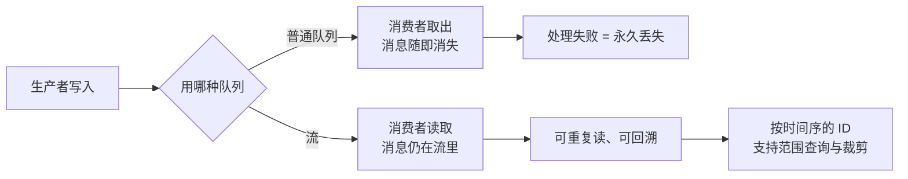
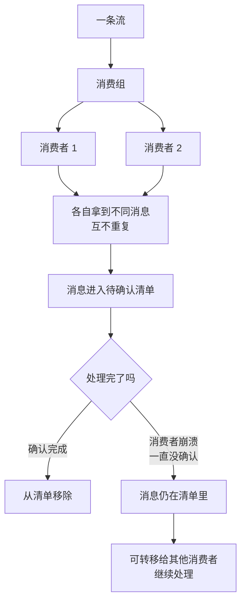
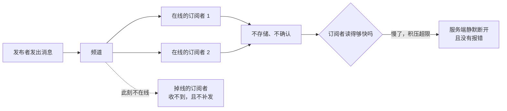

# 课 5：Stream 与 Pub/Sub

> 阶段 2《数据结构与命令》第 3 课（**补充课**，兑现课 3 的承诺）
> 前置：课 3《List 与 Hash》、课 4《Set、ZSet 与特殊类型》
> 环境：WSL Ubuntu 24.04 + Redis 8.10.1（本机实测，核查于 2026-09）
> 📖 结论已按官方文档核对（核对于 2026-09 ｜ 来源：redis.io/docs/latest/develop/data-types/streams/、develop/interact/pubsub/）

---

## 本课要解决的三个问题

课 3 讲 List 当消息队列时，留了一个尾巴：

> "Stream 的详细用法超出本课范围（属阶段 2 进阶内容）"

这一课就是把那个承诺兑现。同时把课 1 架构图里并列的三个"消息中间件身份"补齐——**List / Stream / Pub-Sub**，之前只讲了 List。

具体来说，本课回答三件事：

1. **"消息不能丢"怎么办？** —— List 的 `BRPOP` 一弹出消息就没了，消费者崩了消息也跟着没
2. **"多个消费者要分摊处理，还要能确认"怎么办？** —— 这是消费者组与 PEL
3. **只是想做广播通知，需要这么重吗？** —— 这是 Pub/Sub，以及它为什么"轻到会丢消息"

本课的核心立场：**Stream 和 Pub/Sub 不是替代关系，是"可靠性"与"实时性"的两端**。选错的代价很直接——用 Pub/Sub 传订单消息会丢单，用 Stream 做在线人数广播是杀鸡用牛刀。

---

## 第一幕：场景引入 —— 两个"消息丢了"的现场

### 困境一：消费者崩了，消息也没了

用 List 做队列（课 3 的写法）：

```bash
LPUSH orders "{oid:1001, amount:88}"
BRPOP orders 30        # 消费者拿到消息，立刻从 List 里消失
```

这行 `BRPOP` 执行完的瞬间，**消息就从 Redis 里消失了**。如果消费者拿到消息后，在写数据库之前进程崩溃——这条订单就永久丢失了。

问题在于：List 的 `BRPOP` 是**"取出即删除"**，没有任何"处理完了再删"的机制。

### 困境二：想加消费者做负载均衡，结果消息被重复消费或漏消费

业务量上来了，你要起 3 个消费者实例分摊处理。用 List：

```bash
# 三个消费者都执行
BRPOP orders 30
```

看起来能分摊——`BRPOP` 是原子的，同一条消息只会被一个消费者拿到。**但这带来新问题**：如果消费者 A 拿到消息后处理失败（比如数据库超时），消息已经不在队列里了，没人会重试它。

你需要的是：**消息还在，只是被标记为"投递给了 A，A 还没确认"**。这就是 PEL（Pending Entries List）。

### 困境三：只想广播一个"配置变更了"，也要建 Stream 吗？

另一类需求完全不同：管理后台改了配置，通知所有应用节点刷新本地缓存。

这个场景的特点是：**消息丢了也没关系**（下个节点重启时会重新加载）、**所有在线节点都要收到**、**不需要持久化**。

用 Stream 做这个，等于为"丢了也无所谓"的消息付了持久化的成本。Redis 为此提供了另一套更轻的机制。

> 📌 **一句话本质**：把"消息取走就没了、崩了就找不回"变成"消息留在流里、谁读没读完都有据可查"——并分清哪些场景根本不需要这份保障。
>
> ⚖️ **处境对照**：不这么做——用 List 当队列，消费者 A 拿走消息后处理失败，消息已经不在队列里，**没人会重试它**（本课开头那 300 多个没发出去的短信就是这么丢的）。这么做——Stream 把消息留在流里、用 PEL 标记"投递给 A 但 A 还没确认"，崩了可以 `XCLAIM` 转给别人；实测两个消费者分摊 5 条消息互不重复。代价是：Stream 同样 1 万条消息的内存是 List 的 **3.46 倍**，而且它**不能替代** Pub/Sub——后者不存储、无确认、订阅者掉线即丢（实测先发布后订阅，先发的消息收到次数为 **0**），但胜在极轻；慢订阅者还会被服务端静默断开（实测输出缓冲区冲到 **574112 字节**后被踢且无报错）。

---

## 第二幕：认知冲突 —— 三个"想当然"的崩塌

### 冲突一：`XADD` 的 ID 不是让你自己填的（而且填错会报错）

看到 `XADD mystream 1000-0 k v` 这种写法，很多人以为 ID 是"自增序号"。实测：

```
XADD mystream '*' sensor-id 1234 temperature 19.8
-> 1789613096923-0          ← 毫秒时间戳-序号

XADD mystream 1000-0 k v
-> ERR The ID specified in XADD is equal or smaller than the target stream top item
```

**ID 是 `<毫秒时间戳>-<同一毫秒内的序号>`**。`*` 表示"让 Redis 自动生成"。

手动指定 ID 时**必须大于当前最大 ID**，否则直接报错。这不是限制，是 Stream 的设计基础——**ID 单调递增，天然有序**。

同一毫秒内连续写入，序号会递增：

```
1789613096923-0     ← 第 1 条
1789613096923-1     ← 同一毫秒的第 2 条
1789613096925-0     ← 新的毫秒
```

**这意味着**：Stream 不需要额外的排序字段，也不需要用 score 编码时间戳（对比课 4 ZSet 里"同分按时间排序"要手工把时间戳编进 score，麻烦得多）。

### 冲突二：`XREAD` 读过之后，消息**还在**

这是 Stream 和 List 最本质的区别，也是最容易被忽略的。

List 的 `BRPOP`：**取出即删除**。
Stream 的 `XREAD`：**只是读，消息仍然留在 Stream 里**。

实测证据：

```
XADD s:persist '*' msg "同样一条消息"
DBSIZE = 1          ← Stream 留下了数据
```

而 Pub/Sub 发布一条消息后：

```
PUBLISH news.sport "试试能不能留下痕迹"
DBSIZE = 0          ← keyspace 里什么都没留下
```

**一句话区分这三者的持久化语义**：

| 机制 | 消息存储 | 读后是否还在 | 订阅者掉线 |
|------|---------|------------|-----------|
| List（`BRPOP`） | 在 List 里 | **否**（弹出即删） | 消息仍在（但已被别人消费） |
| Stream | 在 Stream 里 | **是**（要显式 XACK 才"结清"） | 消息仍在，可重新投递 |
| Pub/Sub | **不存储** | - | **消息永久丢失** |

### 冲突三：Pub/Sub 的"轻"是有代价的 —— 先发布后订阅，消息就没了

实测（这是 Pub/Sub 最反直觉的地方）：

```
① 先发布（此时无人订阅）
   PUBLISH news.late "先发的消息"
   -> 返回 0        ← 0 个订阅者收到

② 再起订阅者，再发布
   PUBLISH news.late "后发的消息"
   -> 返回 1

③ 订阅者收到的内容：
   '后发的消息' 出现次数：1
   '先发的消息' 出现次数：0    ← 永久丢失
```

**Pub/Sub 没有"历史消息"这个概念。** `PUBLISH` 的返回值是"当时有多少个订阅者收到了"，它是**即时的、无存储的广播**。

对比 Kafka 或 Stream：消费者可以从任意位置开始读。Pub/Sub 不行——**你必须先在线，才能收到**。

这决定了它的适用边界：**只用于"丢了也无所谓"的实时通知**（缓存失效广播、在线状态推送、配置刷新）。

### 冲突四（补充）：订阅者不消费，会被服务端踢掉

这是 Pub/Sub 在生产上出事的典型方式。订阅者连上了，但因为业务逻辑卡住、或者消费太慢，**不去读 socket**。消息会堆在服务端的输出缓冲区里。

实测（把 `client-output-buffer-limit` 的 pubsub 部分设为硬限制 1 MB，然后持续发布 1 KB 的消息给一个从不读取的订阅者）：

```
omem 采样（发布条数 -> 输出缓冲区字节）：
  第    0 条 -> omem = 0
  第  500 条 -> omem = 20504
  第 1000 条 -> omem = 20504
  第 1500 条 -> omem = 20504
  第 3000 条 -> omem = 61512
  第 3500 条 -> omem = 574112     ← 快速逼近 1 MB 硬限制

发布结束后 subscribe 客户端数 = 0    ← 已被服务端断开
```

**注意这里的数字规律**：前 2000 条 omem 稳定在 20504 字节——因为发布端在 `i % 500 == 0` 时会读一次响应，给了订阅者 socket 缓冲"泄洪"的机会；之后发布端不再读，omem 立刻冲到 574 KB。

**后果**：订阅者被静默断开。如果客户端没有自动重连，它就再也收不到任何消息，而且**不会有任何报错**——这比报错更危险。

这与课 9 讲的 `CLIENT LIST` 里 `omem` 是同一个指标：**"Redis 内存涨了但 key 没变多"时，八成是客户端输出缓冲区**。

---

## 第三幕：层层揭示 —— 三个知识点

### 一眼全局图（进入细节前先看一眼）


> 看图指引：左边是"消息取走就没、崩了找不回"的队列，右边是"消息留在流里、谁读没读完都有据可查"。图只回答一件事：**处理失败的消息，凭什么还能找回来**。

### 本课地图（分几步走）

| 步骤 | 这一步要解决什么 | 对应知识点 |
|------|------------------|-----------|
| 第 1 步 | 先学会把消息写进去、读出来且不删 | 知识点 1：Stream 的基础读写 |
| 第 2 步 | 再让多个人分摊，并保证处理失败能兜住 | 知识点 2：消费者组 |
| 第 3 步 | 最后分清"丢了也无所谓"的场景该走哪条路 | 知识点 3：Pub/Sub |

## 知识点 1：Stream 的基础读写

> 🧭 第 1/3 步｜承接：第一幕的困境——消费者 A 拿走消息后处理失败，消息已经不在队列里，没人会重试它 → 本步：先看消息怎么"写进去、读出来且不删"，这是能找回来的前提。



### 1.1 写入：XADD

```bash
# 自动生成 ID（推荐）
XADD mystream '*' sensor-id 1234 temperature 19.8
-> 1789613096923-0

# 手动指定 ID（必须大于当前最大 ID）
XADD mystream 1000-0 k v

# 限制 Stream 长度（防止无限增长）
XADD mystream MAXLEN ~ 1000 '*' k v       # ~ 近似裁剪，更快
XADD mystream MAXLEN = 1000 '*' k v       # = 精确裁剪，更慢
```

**`MAXLEN` 是生产必备**。不限制的话 Stream 会一直涨，直到打爆内存。

> 📌 **行话锚定**：本课说的"流"官方叫 **Stream**；那条"按时间序、单调递增的编号"官方叫 **Entry ID**（格式 `<毫秒时间戳>-<序号>`）。在哪遇到：`XADD` / `XRANGE` / `XINFO STREAM`；`TYPE` 返回 `stream`；官方文档 [data-types/streams](https://redis.io/docs/latest/develop/data-types/streams/)。
>
> 📚 官方文档：[Redis Streams](https://redis.io/docs/latest/develop/data-types/streams/) ｜ [XADD](https://redis.io/docs/latest/commands/xadd/) ｜ [XTRIM](https://redis.io/docs/latest/commands/xtrim/)

### 1.2 读取：XRANGE / XREVRANGE（按 ID 范围）

```bash
XRANGE mystream - +              # - 最小 ID，+ 最大 ID
XRANGE mystream - + COUNT 2      # 只取 2 条
XREVRANGE mystream + - COUNT 2   # 倒序（注意参数顺序也反过来）
```

实测：

```
XRANGE mystream - + COUNT 2
1) 1789613096923-0
   1) "sensor-id"   2) "1234"
   2) "temperature" 3) "19.8"
2) 1789613096925-0
   1) "sensor-id"   2) "1234"
   2) "temperature" 3) "21.3"
```

**`XRANGE` 是"查历史"**，不会改变 Stream 的状态，也不会标记任何东西。

### 1.3 阻塞读取：XREAD BLOCK

```bash
# $ 表示"从现在开始，只收新消息"
XREAD BLOCK 1000 STREAMS mystream '$'
```

实测（无人写入时）：

```
实际阻塞耗时：1090 ms      ← 设置 1000ms，超时返回 nil
```

`BLOCK 0` 表示永久阻塞。`XREAD` 可以同时监听多个 Stream：

```bash
XREAD BLOCK 5000 STREAMS s1 s2 '$' '$'
```

> ⚠️ **`XREAD` 是"独立消费者"模式**——每个客户端各自读全部消息，**不会分摊**。要做负载均衡必须用消费者组（知识点 2）。这是一个非常常见的误解：以为 `XREAD` 能当队列用，结果起了 5 个消费者，5 个都收到同样 5 份消息。

### 1.4 限制长度：XTRIM 的 `~` 与 `=`

实测（1000 条 Stream）：

```
裁剪前长度：1000
MAXLEN ~ 10 后长度：100     ← 要 10 条，实际留下 100 条
MAXLEN = 5  后长度：5       ← 精确
```

**`~` 为什么不准？** 因为 Stream 底层用 radix tree 存储，`~` 只在**整节点空闲时**才释放，不会为了精确到 10 而拆节点。这是**用精度换性能**的取舍（和课 4 的 HyperLogLog、布隆过滤器是同一类思路）。

生产上通常用 `~`，因为"大概不超过 1000 条"已经够用了，没必要为了精确付额外代价。

### 1.5 查看状态：XINFO

```bash
XINFO STREAM orders      # 流的元信息
XINFO GROUPS orders      # 消费组
XINFO CONSUMERS orders g1  # 组内消费者
```

实测：

```
length              6
last-generated-id   1789613098074-0
entries-added       6
recorded-first-entry-id  1789613098037-0

（消费组）
name           g1
consumers      2
pending        1          ← 有 1 条未确认
last-delivered-id  1789613098074-0
lag            0          ← 还有多少条没投递（0 = 已追上）
```

**`lag` 是监控消费者的关键指标**：持续增长说明消费者处理不过来了。

### 1.6 内存代价：Stream 比 List 贵约 3.5 倍

实测（同样 1 万条简单消息）：

```
Stream 1 万条：124853 字节
List   1 万条： 36086 字节
```

**Stream 约为 List 的 3.46 倍。** 这个代价换来的是：消息持久化、消费确认、崩溃后可重新投递、多消费者分摊。

> 📌 **不要用 Stream 存"丢了也无所谓"的消息**。如果只是广播通知，Pub/Sub 的内存代价接近 0；如果消息可以丢，List 更省。

---

## 知识点 2：消费者组（Stream 真正的队列能力）

> 🧭 第 2/3 步｜承接：上一步能写能读且不删，但多人同时处理时，怎么保证不重复、且有人掉线消息不丢 → 本步：学会用消费组分摊，并用"已读未确认"清单兜住处理失败。



### 2.1 创建组与"分摊"的实测证据

```bash
XGROUP CREATE orders g1 '$' MKSTREAM     # $ = 从创建时刻开始；MKSTREAM = 流不存在时自动创建
```

然后写入 5 条消息，两个消费者各读 3 条。实测：

```
[c1 读 3 条]
1789613098037-0  oid 1001
1789613098039-0  oid 1002
1789613098041-0  oid 1003

[c2 读 3 条]
1789613098042-0  oid 1004
1789613098044-0  oid 1005
```

**这是消费者组的核心**：同一条消息**只会被组内一个消费者拿到**。c1 拿了 1001-1003，c2 拿到的是 1004-1005（不是 1001-1003 的重复）。

对比 `XREAD`：5 个消费者会各自收到全部 5 条。

> 📌 **行话锚定**：本课说的"已读未确认清单"，官方叫 **PEL（Pending Entries List）**——消费者组里最需要盯的东西。在哪遇到：`XINFO GROUPS` 的 `pending` 字段、`XPENDING` 命令；监控上它持续增长就意味着有消费者卡住了；官方文档 [streams](https://redis.io/docs/latest/develop/data-types/streams/) 的 consumer groups 一节。另外"`>`"是**只取新消息**的特殊 ID，不是"大于某值"。
>
> 📚 官方文档：[Redis Streams · consumer groups](https://redis.io/docs/latest/develop/data-types/streams/) ｜ [XREADGROUP](https://redis.io/docs/latest/commands/xreadgroup/) ｜ [XPENDING](https://redis.io/docs/latest/commands/xpending/)

### 2.2 `>` 的特殊含义

```bash
XREADGROUP GROUP g1 c1 COUNT 3 STREAMS orders '>'
```

`>` 表示"**只给我从未投递过的消息**"。这是最常用的写法。

如果传 `0` 而不是 `>`，含义完全不同：

```bash
XREADGROUP GROUP g1 c1 COUNT 10 STREAMS orders 0     # 读我自己的 PEL（历史未确认）
```

**这是处理"上次崩溃遗留消息"的标准做法**——消费者重启后，先用 `0` 把自己的 PEL 读出来重新处理，再用 `>` 收新消息。

### 2.3 PEL：已读未确认的消息

消息被 `XREADGROUP` 投递后，会进入 PEL（Pending Entries List），**直到被 `XACK` 确认**。

实测：

```
XPENDING orders g1
1) 5                          ← 总条数
2) 1789613098037-0            ← 最小 ID
3) 1789613098044-0            ← 最大 ID
4) c1 -> 3 条
   c2 -> 2 条

XPENDING orders g1 - + 10     ← 明细（ID / 消费者 / 空闲ms / 投递次数）
1789613098037-0  c1  9ms  1
1789613098039-0  c1  9ms  1
1789613098041-0  c1  9ms  1
1789613098042-0  c2  5ms  1
1789613098044-0  c2  5ms  1
```

**PEL 就是"消费确认"的账本**。它记录了：哪条消息给了谁、给了多久、给了几次。

### 2.4 XACK：确认处理完成

```bash
XACK orders g1 1789613098037-0
```

实测（确认全部 5 条后）：

```
确认前 pending 条数：5
确认后 XPENDING：
0                    ← 空了
```

**注意**：`XACK` **不会删除消息**，只是把它从 PEL 里移除。消息仍然在 Stream 里，直到被 `XTRIM` 或 `XDEL` 清理。

这点和很多人的直觉相反——以为"确认了就删了"。**Stream 是"日志"，不是"队列"**；它记录发生过什么，确认只是记一笔"这条处理完了"。

### 2.5 消费者崩溃：XCLAIM 转移消息

这是 Stream 相对 List 最大的价值。场景：c1 拿到消息，还没确认就崩溃了。

实测：

```
转移前 PEL：
  1789613098074-0  c1  2ms  1

执行 XCLAIM（c2 认领空闲超过 0ms 的消息）：
  XCLAIM orders g1 c2 0 1789613098074-0
  -> 返回消息内容：oid 2001

转移后 PEL：
  1789613098074-0  c2  3ms  2      ← 归属变成 c2，投递次数从 1 变成 2
```

**投递次数（delivery counter）会递增**。这个数字很重要：如果某条消息被反复投递（比如 10 次）仍失败，说明它是**毒药消息（poison message）**，应该移到死信队列，而不是无限重试。

生产上的典型做法：

```bash
# 找出空闲超过 60 秒的消息，转移给其他消费者
XPENDING orders g1 IDLE 60000 - + 10
XCLAIM orders g1 c2 60000 <消息ID>

# 投递次数过多的移到死信
XAUTOCLAIM orders g1 c2 60000 0-0 COUNT 10     # Redis 6.2+ 的自动认领
```

### 2.6 完整脚本

> 📌 完整脚本：`playground/prep-lesson-05-stream.sh`，跑完上述全部实验（XADD / XRANGE / XREAD BLOCK / 消费者组 / PEL / XACK / XCLAIM / XTRIM / XINFO / 内存对比）。

```bash
bash playground/prep-lesson-05-stream.sh
```

---

## 知识点 3：Pub/Sub —— 轻到会丢消息

> 🧭 第 3/3 步｜承接：前两步都在为"不能丢"付成本，但第一幕困境三说了——配置变更这种通知，丢了也无所谓 → 本步：认识那条更轻的路，以及它轻在哪、丢在哪。



### 3.1 基本用法

```bash
# 订阅者 1（会阻塞，等待消息）
SUBSCRIBE news.sport

# 订阅者 2：模式匹配
PSUBSCRIBE 'news.*'

# 发布者
PUBLISH news.sport "体育新闻"
```

实测（模式订阅）：

```
PSUBSCRIBE 'news.*' 后：
  PUBLISH news.sport "体育新闻"  -> 收到
  PUBLISH news.tech  "科技新闻"  -> 收到
  PUBLISH order.pay  "订单消息"  -> 未收到（不匹配 news.*）
```

`PUBLISH` 的返回值是**收到该消息的订阅者数量**：

```
PUBLISH news.sport "无人接收的消息"
-> 0        ← 没人订阅，这条消息蒸发了
```

> 📌 **行话锚定**：本课说的"订阅频道"，官方叫 **Publish/Subscribe（Pub/Sub）**；"按模式订阅"是 **pattern subscribe**（`PSUBSCRIBE`，用 glob 风格匹配）。在哪遇到：`PUBLISH` / `SUBSCRIBE` / `PSUBSCRIBE`；`PUBSUB CHANNELS` 查活跃频道；慢订阅者被踢对应配置项 `client-output-buffer-limit` 的 pubsub 段；官方文档 [pubsub](https://redis.io/docs/latest/develop/interact/pubsub/)。
>
> 📚 官方文档：[Redis Pub/Sub](https://redis.io/docs/latest/develop/interact/pubsub/) ｜ [PUBLISH](https://redis.io/docs/latest/commands/publish/) ｜ [PSUBSCRIBE](https://redis.io/docs/latest/commands/psubscribe/)

### 3.2 查询订阅关系

```bash
PUBSUB CHANNELS          # 当前活跃的频道
PUBSUB NUMSUB ch:a ch:b  # 各频道的订阅者数
PUBSUB NUMPAT            # 模式订阅的数量
```

实测：

```
PUBSUB CHANNELS   -> ch:a, ch:b
PUBSUB NUMSUB ch:a ch:b  -> ch:a:1, ch:b:1
PUBSUB NUMPAT     -> 0
```

**注意**：`PUBSUB CHANNELS` 只列出**有订阅者的频道**。Pub/Sub 不创建任何 key，所以它不占用 keyspace（这也解释了冲突二里 `DBSIZE = 0`）。

### 3.3 三个必须知道的边界

**边界一：没有持久化。** 消息不写 RDB、不写 AOF。Redis 重启，所有"在途"消息消失。

**边界二：没有确认机制。** 没有 `ACK`。服务端把消息写进订阅者的 socket 缓冲区就认为完成了——至于订阅者有没有真的处理，Redis 不知道也不关心。

**边界三：慢订阅者会被踢。** 见冲突四，输出缓冲区超过限制，服务端直接断开连接。

### 3.4 完整脚本

> 📌 完整脚本：`playground/prep-lesson-05-pubsub.sh`（基础用法与消息丢失）与 `prep-lesson-05-pubsub-buffer.sh`（输出缓冲区堆积与断开）。

```bash
bash playground/prep-lesson-05-pubsub.sh
bash playground/prep-lesson-05-pubsub-buffer.sh
```

---

## 第四幕：实操验证 —— 跟着做一遍

> 环境：WSL Ubuntu 24.04 + Redis 8.10.1
> **实验全部使用独立端口 7201 / 7203 / 7204，不触碰默认 6379 实例。**

### 实验 1：Stream 完整流程

```bash
cd /mnt/d/projects/learning/redis/playground
bash prep-lesson-05-stream.sh
```

**你会看到：**

1. `XADD` 手动指定过小 ID 会报错（冲突一）
2. `XREAD BLOCK 1000` 超时返回 nil，实测阻塞 1090 ms
3. 消费者组里 c1/c2 **分摊** 5 条消息，不重复（知识点 2.1）
4. PEL 显示 5 条未确认，`XACK` 后归零（知识点 2.3-2.4）
5. `XCLAIM` 把 c1 的消息转给 c2，投递次数从 1 变 2（知识点 2.5）
6. `XTRIM ~ 10` 实际留下 100 条，`= 5` 精确留 5 条（知识点 1.4）
7. Stream 1 万条 124853 字节 vs List 36086 字节（知识点 1.6）

### 实验 2：Pub/Sub 的消息蒸发

```bash
bash prep-lesson-05-pubsub.sh
```

**你会看到：**

1. 无人订阅时 `PUBLISH` 返回 0，消息消失
2. 先发布后订阅：先发的消息**收不到**（冲突三）
3. `PSUBSCRIBE 'news.*'` 能收到 news.sport / news.tech，收不到 order.pay
4. Pub/Sub 发布后 `DBSIZE` 仍为 0，而 Stream 写入后为 1

### 实验 3：慢订阅者被踢

```bash
bash prep-lesson-05-pubsub-buffer.sh
```

**你会看到：**

```
omem 采样（发布条数 -> 输出缓冲区字节）：
  第    0 条 -> omem = 0
  第  500 条 -> omem = 20504
  第 3000 条 -> omem = 61512
  第 3500 条 -> omem = 574112
发布结束后 subscribe 客户端数 = 0    ← 已被服务端断开
```

**这个实验的价值**：它解释了生产上"订阅端莫名其妙收不到消息"的一类根因——不是网络问题，是被服务端保护性断开了。

### 清理

```bash
# 脚本末尾已自动 shutdown nosave 并删除临时目录
# 如需手动确认无残留：
redis-cli -p 7201 ping 2>&1 | head -1    # 应提示连接失败
```

### 4.2 应用实战：把本课知识点用起来

> 本课三个知识点合起来解决一个真实场景：**订单消息（丢了要赔钱）与配置变更通知（丢了无所谓）混在一起，怎么分流**。
>
> 完整演练见 [应用实战 05：可靠消息与广播](../../../应用实战/05-可靠消息与广播.md)——从"所有消息一刀切进流"走到"能丢的走广播、不能丢的走留痕流"，含可直接运行的代码与分步设计图。
>
> 回目录：[应用实战索引](../../../应用实战/INDEX.md)

---

## 第五幕：体系收束 —— 三者怎么选

### 消息机制选型决策树

```
需要在 Redis 里传消息
│
├─ 消息丢了会出事吗？
│   │
│   ├─ 无所谓（缓存失效广播、在线状态、配置刷新）
│   │   └── Pub/Sub
│   │       ⚠️ 前提：订阅者必须处理得比发布快，否则会被踢
│   │
│   └─ 会出事（订单、支付、任务）
│       │
│       ├─ 需要多消费者分摊 + 消费确认 + 崩溃重试？
│       │   └── Stream + 消费者组      ← 唯一选择
│       │
│       └─ 简单场景，能接受"取出即删除"？
│           └── List（LPUSH + BRPOP）
│               ⚠️ 消费者崩溃 = 消息永久丢失
```

### 三机制总对照表

| 维度 | List | Stream | Pub/Sub |
|------|------|--------|---------|
| 消息持久化 | 在 List 里 | 在 Stream 里（可 RDB/AOF） | **不存储** |
| 读后是否删除 | **是**（BRPOP 弹出即删） | 否（需 XACK 结清） | - |
| 多消费者分摊 | 是（BRPOP 原子） | 是（消费者组） | **否**（每个订阅者都收全量） |
| 消费确认 | **无** | 有（PEL + XACK） | **无** |
| 崩溃后可重试 | **否** | 是（XCLAIM） | **否** |
| 历史消息 | 有（未消费的） | 有（可 XRANGE 查） | **无** |
| 内存代价（1 万条） | 36086 B | 124853 B（3.46x） | ≈ 0（不建 key） |
| 典型场景 | 简单任务队列 | 订单流、事件溯源 | 缓存失效广播、实时通知 |

### 本课必须记住的四个数字

| 数字 | 含义 |
|------|------|
| **0** | Pub/Sub 发布后 `DBSIZE` 的变化——消息不落 keyspace |
| **1090 ms** | `XREAD BLOCK 1000` 的实测阻塞耗时（`$` 只收新消息） |
| **3.46x** | Stream 相对 List 的内存倍数（1 万条：124853 B vs 36086 B） |
| **100** | `XTRIM MAXLEN ~ 10` 实际留下的条数——`~` 是近似裁剪 |

### 与前后课的联系

- **← 课 3（List 与 Hash）**：本课兑现了"Stream 属阶段 2 进阶内容"的承诺；List 当队列的三个硬伤（无确认、无重试、无持久化）正是 Stream 存在的理由
- **← 课 4（Set、ZSet）**：ZSet 做延迟队列需要手工把时间戳编进 score；Stream 的 ID 天然带毫秒时间戳，无需编码
- **→ 阶段 3（持久化）**：Stream 的消息会写进 RDB/AOF，所以它的"不丢"是有持久化成本配套的（课 5 RDB/AOF 讲代价）
- **→ 阶段 4（集群）**：Stream 也是 key，受 hash slot 限制；消费者组不能跨 slot（课 7）
- **→ 课 9（生产实践）**：Pub/Sub 慢订阅者被踢，与 `CLIENT LIST` 的 `omem` 指标是同一个问题；课 9 的客户端输出缓冲区分析直接适用于此

---

## 常见误区

1. **"`XREAD` 可以让多个消费者分摊消息"**
   错。`XREAD` 是独立消费者模式，每个客户端都会读到**全部**消息。要分摊必须用 `XREADGROUP` + `>`。这是本课最常见的误解。

2. **"`XACK` 之后消息就被删了"**
   错。`XACK` 只是把消息从 PEL 移除，**消息仍在 Stream 里**。要真正删除用 `XDEL`，要控制长度用 `XTRIM MAXLEN`。Stream 是日志，不是队列。

3. **"Pub/Sub 和 Stream 差不多，都能发消息"**
   差很远。Pub/Sub **不存储消息、无确认、订阅者掉线即丢**；实测先发布后订阅，先发的消息收到次数为 0。用 Pub/Sub 传订单会丢单。

4. **"`XTRIM MAXLEN ~ 10` 会精确留下 10 条"**
   错。实测留下 100 条。`~` 是按 radix tree 节点整体释放的近似裁剪，要精确用 `=`（代价更高）。

5. **"Stream 的消费者组会自动重试失败的消息"**
   不会。消息会一直待在 PEL，**需要你自己写逻辑**（`XPENDING` 找超时消息 + `XCLAIM` 转移）。Redis 只提供机制，不提供策略。

6. **"订阅者连上了就一定能收到消息"**
   不一定。输出缓冲区超限会被服务端**静默断开**，且没有报错。实测 omem 冲到 574112 字节后订阅者被踢。生产必须配自动重连 + 监控 `omem`。

---

## 本课小结

| 知识点 | 核心结论 |
|--------|---------|
| Stream 基础读写 | ID 是 `<毫秒时间戳>-<序号>` 且单调递增；`XREAD` 只读不删（对比 List 弹出即删）；`XTRIM ~` 是近似裁剪，实测要 10 条留 100 条 |
| 消费者组 | 组内消费者**分摊**消息（c1 拿 1001-1003，c2 拿 1004-1005）；`>` 只收新消息，`0` 读自己未确认的；PEL 记账，`XACK` 结清，`XCLAIM` 转移崩溃遗留（投递次数递增） |
| Pub/Sub | **不存储、无确认、先发布后订阅即丢**（实测收到 0 次）；慢订阅者会被踢（omem 574112 字节后断开）；只适合"丢了也无所谓"的实时通知 |

---

## 📝 本课小测（5 题）

**Q1**：关于 `XREAD` 与 `XREADGROUP`，下列说法正确的是？

- A. 两者都能让多个消费者分摊同一批消息，不会重复
- B. `XREAD` 是独立消费者模式，每个客户端都会读到全部消息；要分摊必须用 `XREADGROUP` 配合 `>`
- C. `XREADGROUP` 的 `>` 参数表示"读取我自己的历史未确认消息"
- D. `XREAD` 读过的消息会从 Stream 中删除

<details><summary>答案与解析</summary>

**答案：B**。

`XREAD` 是**独立消费者**模式——多个客户端各自读到全部消息，不会分摊。只有 `XREADGROUP`（消费者组）才会把消息分摊给组内不同消费者。本课实测：c1 拿到 oid 1001-1003，c2 拿到 1004-1005，不重复。

- A 错误：把两者的核心区别说反了。
- C 错误：`>` 表示"只收从未投递过的新消息"；读历史未确认消息要传 `0`。
- D 错误：`XREAD` **只读不删**，这是 Stream 与 List（`BRPOP` 弹出即删）的本质区别。

</details>

**Q2**：消息被 `XREADGROUP` 投递、且已执行 `XACK` 之后，下列说法正确的是？

- A. 消息已从 Stream 中删除
- B. 消息仍在 Stream 中，只是从 PEL 移除；要删需 `XDEL`，要限长需 `XTRIM`
- C. `XACK` 会自动触发 `XTRIM`，把已确认的消息清理掉
- D. `XACK` 之后消息重新回到待投递状态，会被再次消费

<details><summary>答案与解析</summary>

**答案：B**。

`XACK` **只移除 PEL 记录，不删除消息**。本课实测：确认全部 5 条后 `XPENDING` 返回 0（PEL 空了），但消息仍在 Stream 里，仍可用 `XRANGE` 查到。

- A 错误：这是最常见的误解。Stream 是**日志**不是队列，确认只是记一笔"处理完了"。
- C 错误：`XTRIM` 必须显式调用（或 `XADD` 时带 `MAXLEN`），`XACK` 不触发任何清理。不显式清理的 Stream 会一直增长。
- D 错误：`XACK` 后消息不会再被 `>` 投递，恰恰相反——它会永久留在 PEL 外。

</details>

**Q3**：某系统用 Pub/Sub 广播"配置已变更"，有节点反馈"偶尔收不到通知"。最可能的原因是？

- A. Redis 主节点宕机，消息未同步到从节点
- B. 节点在 `PUBLISH` 之后才 `SUBSCRIBE`，消息已蒸发；或节点消费过慢导致输出缓冲区超限被服务端静默断开
- C. Pub/Sub 的消息有 TTL，超过 5 秒自动过期
- D. 频道名包含非法字符，部分消息被丢弃

<details><summary>答案与解析</summary>

**答案：B**。

两个原因本课都有实测：

1. **先发布后订阅**：`PUBLISH news.late "先发的消息"` 后再订阅，实测"先发的消息"收到次数为 **0**——Pub/Sub 不存储任何历史消息。
2. **慢订阅者被踢**：持续发布时订阅者 `omem` 涨到 574112 字节，超过 `client-output-buffer-limit` 的 pubsub 硬限制后，服务端**静默断开**连接（实测断开后 subscribe 客户端数变为 0），且**不报错**。

- A 错误：Pub/Sub 本身不做持久化，与主从同步无关（虽然 Sentinel 也用 Pub/Sub 做发现，但这是另一个话题）。
- C 错误：Pub/Sub 消息根本不存储，不存在 TTL 概念。
- D 错误：Redis 不会因频道名丢弃消息。

**生产建议**：订阅端必须实现自动重连；关键配置不能只依赖广播，要有启动时的全量拉取兜底。

</details>

**Q4**：关于 `XTRIM` 的 `~` 与 `=`，下列说法正确的是？

- A. `MAXLEN ~ 10` 会精确留下 10 条，且性能最好
- B. `MAXLEN = 10` 是精确裁剪，代价更高；`~` 是近似裁剪，实测要 10 条留下 100 条
- C. 两者完全等价，只是写法不同
- D. `~` 会阻塞 Redis 直到裁剪完成，`=` 是异步的

<details><summary>答案与解析</summary>

**答案：B**。

本课实测（1000 条 Stream）：

```
MAXLEN ~ 10 后长度：100     ← 要 10 条，实际留下 100 条
MAXLEN = 5  后长度：5       ← 精确
```

`~` 之所以不准，是因为 Stream 底层是 radix tree，`~` 只在**整节点空闲时**才释放，不会为精确到 10 而拆节点——**用精度换性能**。生产通常用 `~`，因为"大概不超 1000 条"够用了。

- A 错误：`~` 恰恰是不精确的。
- C 错误：实测结果差 20 倍（100 vs 5），不等价。
- D 错误：说反了。两者都在主线程执行，`=` 因为要精确裁剪反而可能更慢。

</details>

**Q5**：下列关于消息机制选型，最合理的是？

- A. 订单支付消息用 Pub/Sub，因为最轻量
- B. 缓存失效广播用 Stream + 消费者组，保证不丢
- C. 订单支付用 Stream + 消费者组（需确认与崩溃重试）；缓存失效广播用 Pub/Sub（丢了无所谓，下次启动会重新加载）
- D. 简单任务队列一律用 Stream，因为 List 已废弃

<details><summary>答案与解析</summary>

**答案：C**。

选型的**第一问是"消息丢了会不会出事"**：

- **会出事（订单、支付）**：必须 Stream + 消费者组。需要消费确认（PEL/XACK）、崩溃后可重新投递（XCLAIM）。Pub/Sub 丢消息是静默的——`PUBLISH` 返回 0 你甚至不知道没人收到。
- **无所谓（缓存失效广播、在线状态、配置刷新）**：Pub/Sub。它不建 key、内存代价接近 0，且订阅者掉线本就不需要补发历史（节点重启会重新加载全量）。

- A 错误：Pub/Sub 丢消息无感知，订单场景会导致丢单。
- B 错误：用 Stream 做广播是过度设计。付了持久化的内存成本（实测 Stream 是 List 的 3.46 倍），换来的可靠性用不上。
- D 错误：List 未被废弃，简单任务队列（能接受"取出即删除"）仍是合理选择，且内存只有 Stream 的 1/3.46。

</details>

---

## 🚀 下一批接力提示词

> 学完本课，**复制下面这段文字发给 AI**，即可无缝进入下一批（无需重新描述上下文）：

```
继续学 Redis。我的学习档案在 redis/00-学习档案.md，
刚学完阶段 2《数据结构与命令》的补充课《Stream 与 Pub/Sub》
（知识点：Stream 基础读写、消费者组与 PEL/XACK/XCLAIM、Pub/Sub 与三者选型），
请按大纲继续讲解阶段 3《持久化与高可用》的课《RDB 与 AOF 持久化》的知识点：
RDB fork 与写时复制、AOF 写后日志与刷盘策略、持久化选型决策。
```

## 🧭 课程导航

⬅️ **上一课**：[课 4：Set、ZSet 与特殊类型](lesson-04-Set、ZSet与特殊类型.md)

➡️ **下一课**：[课：RDB 与 AOF 持久化](../../3-持久化与高可用/lessons/lesson-05-RDB与AOF持久化.md)（阶段 3）

📚 **返回目录**：[课程目录](../../../02-课程目录.md) ｜ [阶段 2 总览](../overview.md)

> 📌 **编号说明**：本课是阶段 2 的补充课（兑现课 3 的承诺），文件名序号沿用阶段内顺序。
> 阶段 3 另有一课《RDB 与 AOF 持久化》，其课程序号为「课 5」，与本课的**文件序号**无关——
> 二者属不同阶段，以目录与标题区分，不影响既有 9 课的编号体系。
