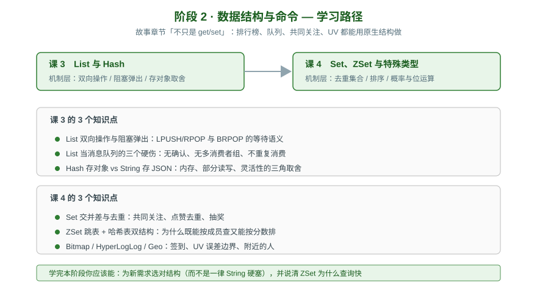

# 阶段 2：数据结构与命令

> 所属课程：Redis 系统学习 ｜ 故事章节：「不只是 get/set」——排行榜、队列、共同关注、UV 都能用原生结构做 ｜ 上一阶段：[阶段 1](../1-为什么需要Redis/overview.md)

## 🎯 本阶段目标

- 面对一个业务需求能选对数据结构，而不是一律用 String 硬塞
- 理解每种结构底层的实现选择，以及这个选择带来的能力边界
- 知道哪些"看起来能用 Redis 做"的事其实不该做（如 List 当消息队列）

## 📍 学习重点

- **List 的双向与阻塞**：`BRPOP` 能阻塞等待，这让 List 看起来很像队列——但它**没有消费确认**，消费者崩了消息就丢了。这是理解 Stream 存在意义的前提。
- **Hash vs String 存对象**：不是简单的"哪个省内存"，而是内存 / 部分读写 / 灵活性的三角取舍，还要考虑 ziplist 编码的临界值。
- **ZSet 的双结构**：同一个 ZSet 同时维护哈希表与跳表，这是它既能按成员 O(1) 查、又能按分数范围查的原因。
- **概率与位运算**：HyperLogLog 用约 12KB 统计上亿 UV，代价是 0.81% 的标准误差——**用精度换空间**，要能说清什么时候这个误差可接受。

## ✅ 必须掌握的知识点

| 知识点 | 所属课 | 学完应能 |
|--------|--------|----------|
| List 双向操作与阻塞弹出 | 课 3 | 用 LPUSH/RPOP 与 BRPOP 写出一个可用的队列 demo |
| List 当消息队列的三个硬伤 | 课 3 | 说清为什么不推荐，以及什么场景可以凑合用 |
| Hash 存对象 vs String 存 JSON | 课 3 | 给出选型判断条件，而非一律选某个 |
| Set 交并差与去重 | 课 4 | 实现共同关注、点赞去重、抽奖 |
| ZSet 跳表 + 哈希表双结构 | 课 4 | 解释为什么两种操作都快 |
| Bitmap / HyperLogLog / Geo | 课 4 | 说出各适用什么场景、误差或限制在哪 |

## 🗺️ 本阶段路径图

## 本阶段产出

- [x] [课 3《List 与 Hash》](lessons/lesson-03-List与Hash.md)（2026-08-31，评审 P0=0）
- [x] [课 4《Set、ZSet 与特殊类型》](lessons/lesson-04-Set、ZSet与特殊类型.md)（2026-09-01，评审 P0=0）

---

⬅️ **上一阶段**：[阶段 1：为什么需要 Redis](../1-为什么需要Redis/overview.md)

➡️ **下一阶段**：[阶段 3：持久化与高可用](../3-持久化与高可用/overview.md)

📚 **返回目录**：[课程目录](../../02-课程目录.md)
