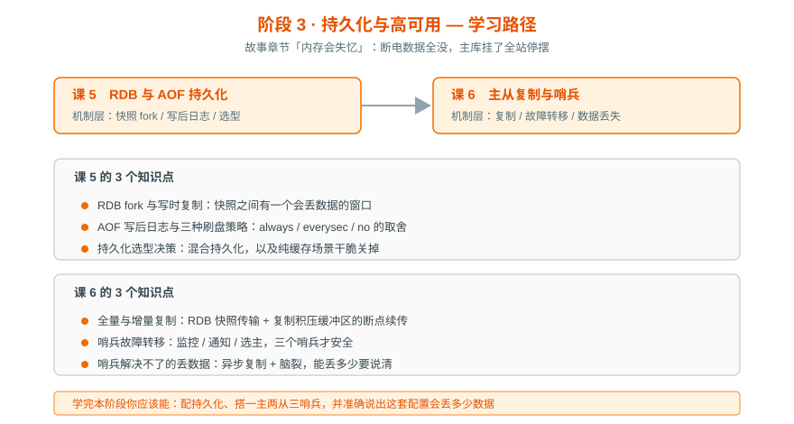

# 阶段 3：持久化与高可用

> 所属课程：Redis 系统学习 ｜ 故事章节：「内存会失忆」——断电数据全没，主库挂了全站停摆 ｜ 上一阶段：[阶段 2](../2-数据结构与命令/overview.md)

## 🎯 本阶段目标

- 配置一套合理的持久化策略，并**准确说出这套配置会丢多少数据**
- 搭起一主两从 + 三哨兵，理解故障转移时发生了什么
- 建立对"高可用不等于不丢数据"的正确预期

## 📍 学习重点

- **RDB 的 fork 与写时复制**：`BGSAVE` 靠 fork 子进程写快照，父子进程共享内存页，写时才复制——所以**快照期间内存可能涨到接近两倍**，这是生产上最常见的内存告警来源。
- **AOF 的写后日志**：先执行命令再写日志，这个顺序决定了它不会阻塞当前命令，但也意味着可能丢最后一条。三种刷盘策略对应三种丢失窗口。
- **持久化不是免费的**：纯缓存场景下，持久化反而是负担——该关就关。这个决策比参数调优更重要。
- **异步复制是丢数据的根源**：主从同步是异步的，主库写成功就返回，还没来得及传给从库就挂了，这部分数据就永久丢了。哨兵解决的是"服务可用性"，**不解决"数据不丢失"**。

## ✅ 必须掌握的知识点

| 知识点 | 所属课 | 学完应能 |
|--------|--------|----------|
| RDB fork 与写时复制 | 课 5 | 解释为什么 BGSAVE 时内存会涨，以及丢多少数据 |
| AOF 写后日志与刷盘策略 | 课 5 | 对比 always / everysec / no，给出选型理由 |
| 持久化选型决策 | 课 5 | 判断某场景该用 RDB、AOF、混合还是干脆关掉 |
| 全量与增量复制 | 课 6 | 说清复制积压缓冲区的作用与断连后的行为 |
| 哨兵故障转移 | 课 6 | 搭三哨兵，说清为什么三个才安全 |
| 哨兵解决不了的丢数据 | 课 6 | 解释异步复制与脑裂，说出最坏情况丢多少 |

## 🗺️ 本阶段路径图

## 本阶段产出

- [ ] `lessons/lesson-05-RDB与AOF持久化.md`
- [ ] `lessons/lesson-06-主从复制与哨兵.md`

---

⬅️ **上一阶段**：[阶段 2：数据结构与命令](../2-数据结构与命令/overview.md)

➡️ **下一阶段**：[阶段 4：分布式与生产实践](../4-分布式与生产实践/overview.md)

📚 **返回目录**：[课程目录](../../02-课程目录.md)
