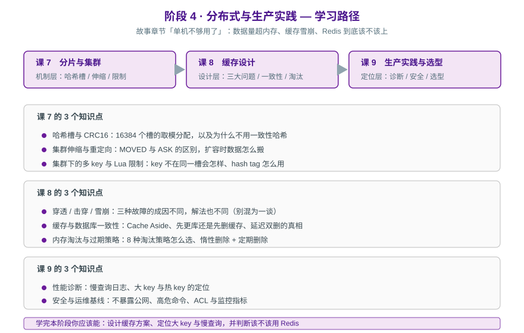

# 阶段 4：分布式与生产实践

> 所属课程：Redis 系统学习 ｜ 故事章节：「单机不够用了」——数据量超内存、缓存雪崩、Redis 到底该不该上 ｜ 上一阶段：[阶段 3](../3-持久化与高可用/overview.md)

## 🎯 本阶段目标

- 能设计一套完整的缓存方案并说清每个参数为什么这样定
- 能定位大 key、热 key 与慢查询
- 能判断"这个业务该不该用 Redis"，以及不用 Redis 时该用什么

## 📍 学习重点

- **哈希槽而非一致性哈希**：Redis Cluster 用 16384 个固定槽做分配，这个设计选择决定了伸缩、重定向与多 key 操作的全部行为。
- **三种缓存故障不是一回事**：穿透（查不存在的数据）、击穿（单个热点 key 过期）、雪崩（大批 key 同时过期）成因不同，解法也不同，混为一谈就会用错药。
- **一致性的真相**：Cache Aside 是事实标准，但"先更新数据库还是先删缓存"没有完美答案——**延迟双删也不保证一致**。要理解的是"能接受多久的不一致"。
- **淘汰策略要按业务选**：`allkeys-lru` 不是万能答案，当 Redis 一部分 key 不能丢时，它就错了。
- **生态已分裂**：2024 年许可证变更、Valkey 分叉、2025 年 AGPL 三许可。选型前必须先知道"你说的 Redis 是哪个 Redis"。

## ✅ 必须掌握的知识点

| 知识点 | 所属课 | 学完应能 |
|--------|--------|----------|
| 哈希槽与 CRC16 | 课 7 | 解释槽分配，说清为什么不用一致性哈希 |
| 集群伸缩与重定向 | 课 7 | 区分 MOVED 与 ASK，说清扩容时数据怎么搬 |
| 集群下的多 key 与 Lua 限制 | 课 7 | 用 hash tag 解决跨槽问题，说清限制 |
| 穿透 / 击穿 / 雪崩 | 课 8 | 三种故障分别给解法，不混淆 |
| 缓存与数据库一致性 | 课 8 | 说清 Cache Aside 与延迟双删的局限 |
| 内存淘汰与过期策略 | 课 8 | 按业务选出淘汰策略并说明理由 |
| 性能诊断 | 课 9 | 用慢查询日志与大 key 扫描定位问题 |
| 安全与运维基线 | 课 9 | 列出上线前必做的安全与监控项 |
| 生态与选型 | 课 9 | 给出 Redis / Valkey / Memcached / 不用缓存 的决策条件 |

## 🗺️ 本阶段路径图

## 本阶段产出

- [ ] `lessons/lesson-07-分片与集群.md`
- [ ] `lessons/lesson-08-缓存设计.md`
- [ ] `lessons/lesson-09-生产实践与选型.md`

---

⬅️ **上一阶段**：[阶段 3：持久化与高可用](../3-持久化与高可用/overview.md)

📚 **返回目录**：[课程目录](../../02-课程目录.md)
