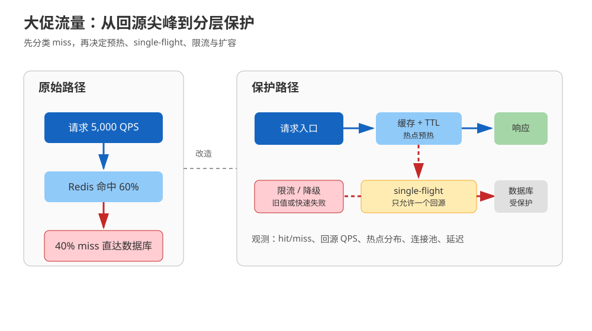
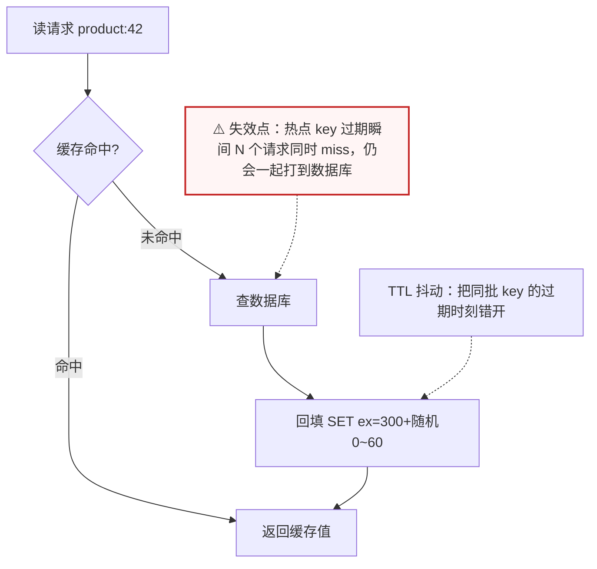
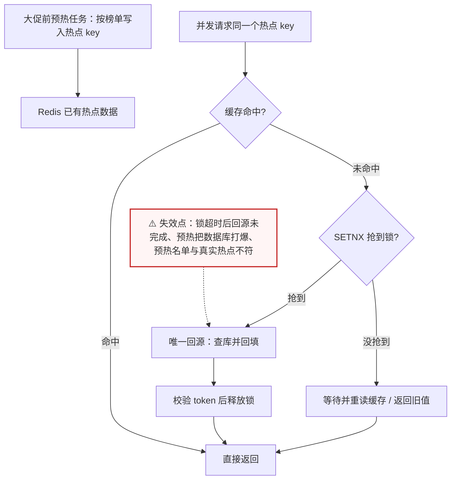
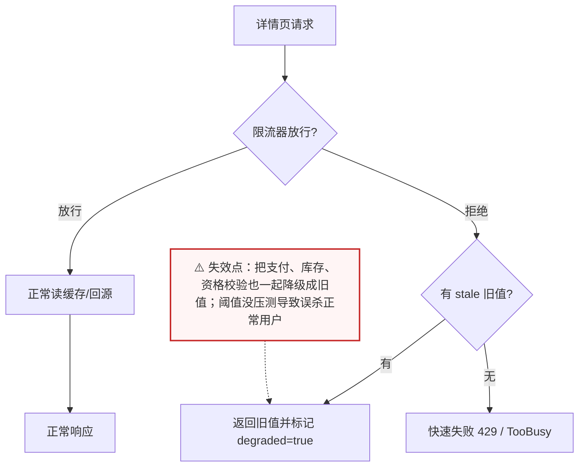
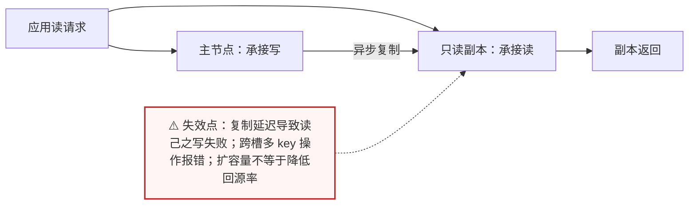

# 场景 01：大促流量翻 10 倍，数据库先扛不住

| 项目 | 内容 |
|---|---|
| 类型 | 规模压力题 |
| 场景 | QPS 从 500 升到 5,000，缓存命中率只有 60%，数据库连接池持续打满 |
| 目标 | 把数据库从热路径上救出来，同时保住可接受的延迟与正确性 |
| 先看 | [08-实战经验 · 故障模式 6：缓存雪崩——同一时刻大量 key 集体失效](../08-实战经验.md#故障模式-6缓存雪崩同一时刻大量-key-集体失效) |
| 崩了怎么办 | [09-排障速查手册 · 症状 6：缓存雪崩](../09-排障速查手册.md)（先看症状，再按条件-动作表止血） |

## 场景描述

商品详情平时每秒 500 次请求，促销开始后变成 5,000 次。Redis 还在工作，但命中率只有 60%：40% 的请求穿透到数据库，连接池很快耗尽。此时“给 Redis 加机器”不是第一问，第一问是：miss 是正常未缓存、缓存过期同时发生，还是热点 key 被击穿？



> 读图：沿蓝色主链看正常请求，再看红色虚线的保护分支。

## 🔒 先自己想 30 秒

先回答四件事：

1. 命中率为什么只有 60%？冷数据没缓存、key 批量过期、查询根本不存在（穿透）、还是热点 key 过期瞬间被打穿（击穿）？
2. 热点 key 过期时，谁负责回源？1,000 个并发请求会不会一起查库？
3. 数据库已经满载时，哪些请求可以被拒绝、被降级、被返回旧值？
4. 加容量之前，怎样证明瓶颈确实在 Redis，而不是在数据库查询本身或连接池大小？

<details>
<summary>💡 提示（卡住了再看）</summary>

- 先把 miss 分类：冷数据、过期、穿透、击穿。
- 正常回源需要 TTL；同一热点 key 同时 miss 时需要 single-flight / mutex。
- 保护数据库的手段包括预热、TTL 抖动、请求限流、旧值降级和只读副本。
- 任何优化都要配观测：命中率、回源 QPS、命中延迟、数据库连接池、热 key 分布。

</details>

<details>
<summary>📖 展开解法（先想完再看）</summary>

> 代码约定：以下片段中 `redis_client` 为已连接的 Redis 客户端，`decode` / `encode` 为序列化辅助函数，`db_query_product` / `random_token` / `release_lock_if_owner` / `wait_then_read_cache_or_degrade` / `limiter` / `TooBusy` 为业务侧占位实现，文中不再重复定义，照抄时需自备。

## 解法一览

| 解法 | 核心动作 | 效果（DB 回源 QPS / 生效速度） | 适合 | 主要代价 |
|---|---|---|---|---|
| A. 缓存旁路 + TTL 抖动 | miss 回源并写缓存；TTL 加随机扰动 | 稳态回源 QPS 降到 miss 率 × QPS；改一行 TTL 即可生效 | 普通详情页、读多写少 | 仍有回源；需要处理并发 miss |
| B. 热点预热 + single-flight | 大促前预热；同 key 只允许一个请求回源 | 热点 key 的并发回源从 N 次降到 1 次；需提前预热才生效 | 热点商品、集中式读流量 | 预热失准；锁超时与异常恢复复杂 |
| C. 限流、降级与旧值 | 在应用层挡住过载，允许返回旧值或简化结果 | 直接给 DB 设上限，分钟级生效；但会牺牲实时性 | 数据库已接近极限 | 牺牲部分实时性或功能完整度 |
| D. 读副本 / 分片 | 将读压力分散到副本或多个分片 | 提高的是读吞吐上限，不降低回源 QPS | 单实例吞吐或容量已到边界 | 一致性、运维和路由复杂度上升 |

## 展开解法

### 解法 A：缓存旁路（Cache-Aside）+ TTL 抖动

**思路。** 读请求先读缓存，miss 后查数据库并回填；TTL 不要对所有 key 使用同一个固定过期时刻，可以加入小范围随机量，降低同批过期造成的回源尖峰。缓存旁路允许一个短暂的一致性窗口，所以适合“详情偶尔旧几秒也可接受”的数据。



> 读图：主干是「读缓存 → miss → 查库 → 回填」；虚线标出 TTL 抖动只解决“同时过期”，解决不了“同一热点 key 的并发回源”——那正是解法 B 要补的。

```python
def get_product(product_id, redis_client):
    key = f"product:{product_id}"
    cached = redis_client.get(key)
    if cached is not None:
        return decode(cached)

    value = db_query_product(product_id)  # 示例占位：由业务数据库访问层实现
    if value is not None:
        ttl_seconds = 300 + random.randint(0, 60)
        redis_client.set(key, encode(value), ex=ttl_seconds)
    return value
```

| 维度 | 判断 |
|---|---|
| 代价 | 回源仍可能形成尖峰；写路径必须设计失效或更新策略 |
| 边界 | 价格、库存等不能容忍旧值的数据不能只靠普通 TTL |
| 课程挂钩 | [课 8《缓存设计》](../stages/4-分布式与生产实践/lessons/lesson-08-缓存设计.md)：缓存旁路、TTL、穿透/击穿/雪崩 |
| 来源 | [Redis Cache-Aside pattern](https://redis.io/docs/latest/develop/use-cases/cache-aside/)、[Redis eviction](https://redis.io/docs/latest/develop/reference/eviction/) |

### 解法 B：热点预热 + single-flight

**思路。** 在促销前把已知热点放入缓存；运行时 miss 的第一个请求获得短时互斥，其余请求等待或读取旧值，避免 1,000 个并发请求同时查库。互斥只负责“减少重复回源”，不等于分布式锁能保证业务正确性。



> 读图：关键在于中间那条分叉——只有抢到锁的请求走数据库，其余请求被挡在等待/旧值分支上；三个失效点都集中在“锁的生命周期”和“预热名单的准确性”。

```python
def get_hot_product(product_id, redis_client):
    key = f"product:{product_id}"
    cached = redis_client.get(key)
    if cached is not None:
        return decode(cached)

    lock_key = f"lock:product:{product_id}"
    token = random_token()
    if redis_client.set(lock_key, token, nx=True, ex=3):
        try:
            value = db_query_product(product_id)
            if value is not None:
                redis_client.set(key, encode(value), ex=360)
            return value
        finally:
            release_lock_if_owner(redis_client, lock_key, token)

    return wait_then_read_cache_or_degrade(redis_client, key)
```

| 维度 | 判断 |
|---|---|
| 代价 | 需要超时、锁拥有者校验、等待上限和降级策略；预热任务也可能打爆数据库 |
| 边界 | 不能把“拿到锁”当成库存扣减等业务事务的正确性证明；锁超时后必须允许重试 |
| 课程挂钩 | [课 8《缓存设计》](../stages/4-分布式与生产实践/lessons/lesson-08-缓存设计.md)：热点 key、击穿、互斥回源；[课 9《生产实践与选型》](../stages/4-分布式与生产实践/lessons/lesson-09-生产实践与选型.md)：延迟与容量观测 |
| 来源 | [Redis distributed locks](https://redis.io/docs/latest/develop/clients/patterns/distributed-locks/)、[Redis Cache-Aside pattern](https://redis.io/docs/latest/develop/use-cases/cache-aside/) |

### 解法 C：限流、降级与旧值服务

**思路。** 当数据库连接池已经满载时，继续提高缓存命中率也来不及止血。应用网关或服务入口按用户、接口、商品维度限流；详情页可以返回最近一次旧值，推荐位可以返回静态兜底，非核心接口直接快速失败。把“可接受的旧”写成业务契约，不能把异常吞掉后假装成功。



> 读图：限流器的“拒绝”分支不是终点，而是分出「旧值降级」与「快速失败」两条路——能不能走旧值，取决于这个接口是否承担关键判断。

```python
def read_detail(product_id, redis_client, limiter):
    if not limiter.allow(f"detail:{product_id}", limit=2000, window=1):
        stale = redis_client.get(f"product:stale:{product_id}")
        if stale is not None:
            return decode(stale), {"degraded": True}
        raise TooBusy("detail temporarily limited")

    return get_product(product_id, redis_client), {"degraded": False}
```

| 维度 | 判断 |
|---|---|
| 代价 | 用户可能看到旧数据、简化页面或 429；需要前端和产品定义降级体验 |
| 边界 | 支付、库存、资格校验不能用旧值直接放行；限流阈值必须通过压测和线上指标调整 |
| 课程挂钩 | [课 8《缓存设计》](../stages/4-分布式与生产实践/lessons/lesson-08-缓存设计.md)：缓存降级与雪崩保护；[课 9《生产实践与选型》](../stages/4-分布式与生产实践/lessons/lesson-09-生产实践与选型.md)：生产限流与监控 |
| 来源 | [Redis INCR](https://redis.io/docs/latest/commands/incr/)（限流计数原语）；限流阈值、旧值时效属于业务契约，需由系统压测与产品确认 |

### 解法 D：读副本 / 分片

**思路。** 只有在确认单实例 CPU、网络、内存或数据库读能力已到边界后，才把读流量分到只读副本或 Cluster 分片。副本适合扩读，不解决写热点；Cluster 适合容量和吞吐横向增长，但多 key 操作要考虑 hash tag 与同槽约束。



> 读图：副本和主节点之间是**异步**箭头——它扩大的是读吞吐，不改变 miss 分类与回源次数，所以它是解法 A/B/C 之后的第四档，不是第一档。

```bash
# 先做只读证据采集，再决定扩容；以下命令不会改变数据
redis-cli INFO stats | egrep 'keyspace_hits|keyspace_misses|instantaneous_ops_per_sec'
redis-cli INFO memory | egrep 'used_memory_human|maxmemory_human'
redis-cli SLOWLOG GET 20
```

| 维度 | 判断 |
|---|---|
| 代价 | 副本存在异步复制延迟；Cluster 增加路由、迁槽、跨槽事务与运维复杂度 |
| 边界 | 不能用副本读来完成必须读己之写的流程；不能把扩分片当作 miss 分类和缓存策略的替代品 |
| 课程挂钩 | [课 6《主从复制与哨兵》](../stages/3-持久化与高可用/lessons/lesson-06-主从复制与哨兵.md)：副本读；[课 7《分片与集群》](../stages/4-分布式与生产实践/lessons/lesson-07-分片与集群.md)：Cluster、hash slot |
| 来源 | [Redis replication](https://redis.io/docs/latest/operate/oss_and_stack/management/replication/)、[Redis scaling and Cluster](https://redis.io/docs/latest/operate/oss_and_stack/management/scaling/) |

## 推荐路径：按证据逐级加复杂度

1. 先测 miss 分类、回源 QPS、数据库连接池与热点分布；不要只看 Redis 总 QPS。
2. 先上解法 A：TTL 抖动、合理的缓存 key 和回源超时。
3. 有明确热点再加解法 B；回源仍压垮数据库时临时启用解法 C。
4. 只有单实例能力或容量确实到边界，才进入解法 D，并先验证副本延迟或 Cluster 跨槽影响。

## 非 Redis 替代路线

| 替代路线 | 适合什么情况 | 与 Redis 解法的关键差异 | 代价 / 注意 |
|---|---|---|---|
| CDN + 应用本地缓存 + 数据库 | 详情页内容相对静态、可接受分钟级失效 | Redis 被移出最热读路径；失效靠 CDN 刷新与本地缓存 TTL | 实例间缓存不一致；容量治理与失效广播要自己做 |
| 数据库只读副本 / 物化视图 | 读模型复杂但 QPS 不高 | 回源消失，查询由数据库优化器承担 | 依赖索引与查询计划；数据库本身成为扩容瓶颈 |
| 服务端渲染结果缓存（页面级） | 整页可缓存、个性化少 | 缓存粒度从 key 级变页面级，命中率更高 | 个性化与实时片段要拆出来单独加载 |

## 做错会踩的坑

- 把 60% 命中率当成一个数字问题，未先区分冷 miss、过期、穿透和击穿。
- 所有 key 使用同一个 TTL，整点过期造成回源波峰。
- 用 `KEYS *` 做“热 key 排查”，在生产阻塞主线程；应使用受控的 `SCAN` 与指标。
- 只加 Redis 副本，却没有验证副本延迟和读己之写需求。
- 降级返回旧值，却没有把旧值年龄和适用接口写进契约。

</details>
