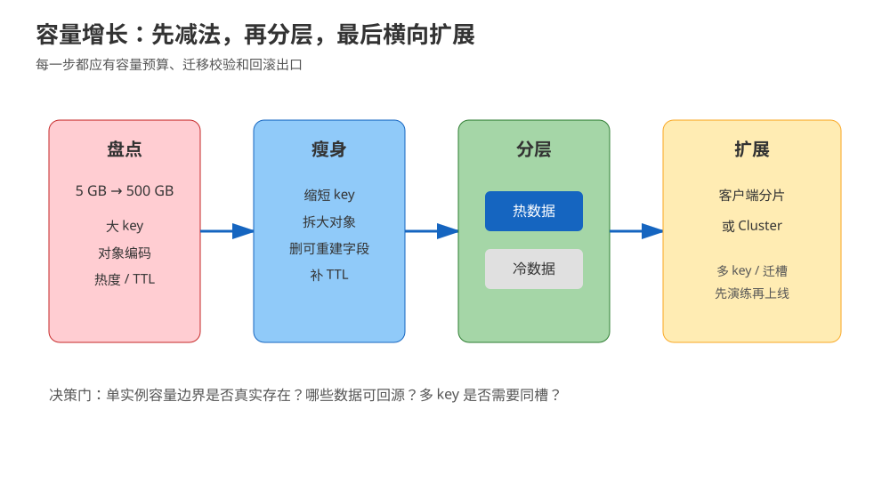
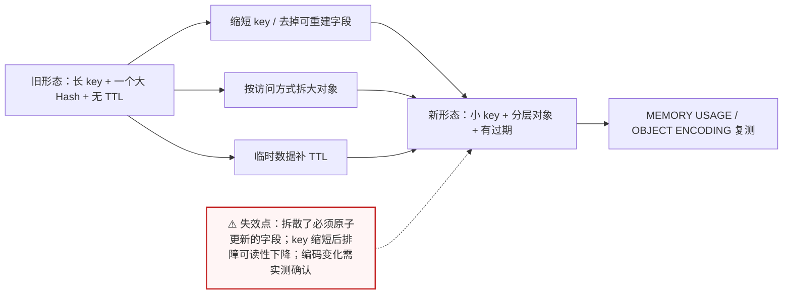
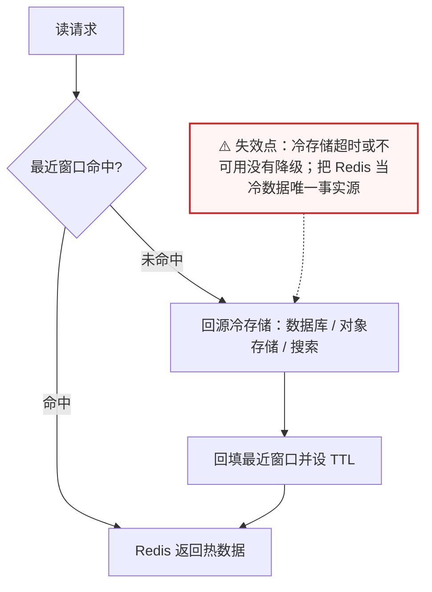
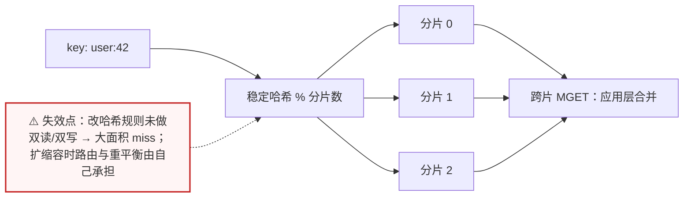
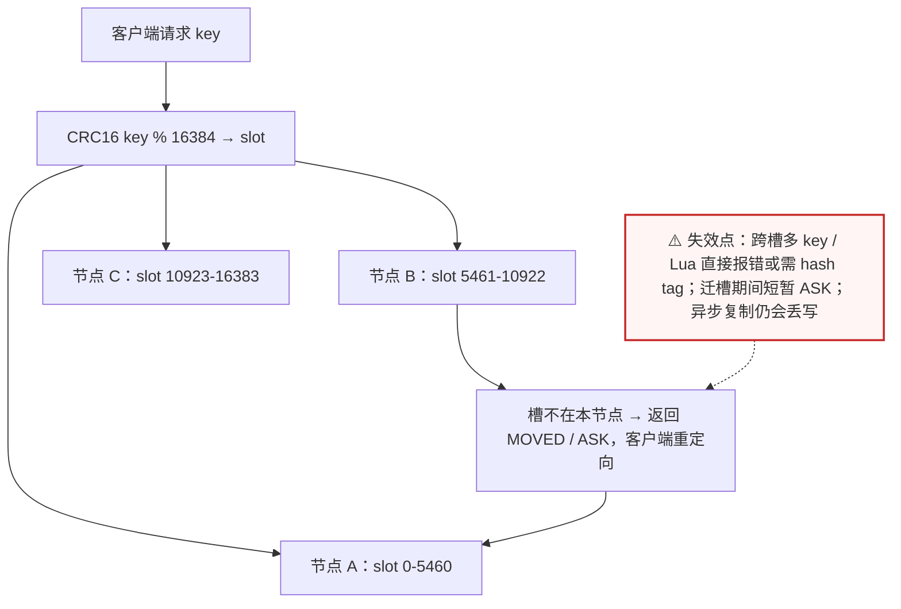

# 场景 02：数据量翻 100 倍，单机内存不够了

| 项目 | 内容 |
|---|---|
| 类型 | 规模压力题 |
| 场景 | Redis 数据从 5 GB 增长到 500 GB，单实例内存、备份窗口和重启恢复时间都开始失控 |
| 目标 | 先确认哪些数据值得留在 Redis，再选择拆分、淘汰或扩容方式 |
| 先看 | [08-实战经验 · 故障模式 3：大 key 删除造成周期性卡顿](../08-实战经验.md#故障模式-3大-key-删除造成周期性卡顿) |
| 崩了怎么办 | [09-排障速查手册 · 症状 3：大 key 同步删除造成卡顿](../09-排障速查手册.md) |

## 场景描述

业务把用户画像、最近行为、排行榜和临时会话都放进了同一个 Redis。两年后数据量扩大 100 倍，单机无法再承载；团队的第一反应是“直接上 Cluster”。但如果 70% 的数据已经不热，先做冷热分层和结构瘦身，往往比立即迁移集群更能降低风险。



> 读图：把每一个箭头都理解为一个可回滚的容量决策，不是一次性架构跳跃。

## 🔒 先自己想 30 秒

先列出再判断：

1. 每一类 key 的类型、平均大小、访问频率、保留期限、是否允许丢失——你能列出这张清单吗？
2. 这些数据是否真的需要毫秒级访问？降级到数据库或对象存储能不能满足？
3. 一个大 Hash 拆开后，原来的批量读、批量写和原子更新是否仍成立？
4. 扩容之后，最常用的多 key 操作（`MGET`、事务、Lua、聚合）会不会跨槽？

<details>
<summary>💡 提示（卡住了再看）</summary>

- 先盘点内存组成和大 key，不要只看 `used_memory` 总数。
- Redis 的内存效率取决于编码、对象数量、key 长度和碎片；“一条大 Hash”与“很多小 key”不是同一个成本模型。
- 热数据留 Redis，冷数据回源数据库、对象存储或搜索系统。
- Cluster 解决容量与吞吐的横向问题，不自动解决数据模型、备份和跨槽事务问题。

</details>

<details>
<summary>📖 展开解法（先想完再看）</summary>

> 代码约定：以下片段中 `redis_client` 为已连接的 Redis 客户端，`decode` / `encode` 为序列化辅助函数，`query_cold_store` / `stable_hash` / `shards` 为业务侧占位实现，文中不再重复定义，照抄时需自备。

## 解法一览

| 解法 | 核心动作 | 效果（内存削减 / 扩展上限） | 适合 | 主要代价 |
|---|---|---|---|---|
| A. 结构瘦身 | 缩短 key、拆大对象、控制字段与 TTL | 削减幅度完全取决于浪费程度，必须用 `MEMORY USAGE` 实测确认；部署形态不变 | 数据模型存在明显浪费 | 需要改读写代码和迁移脚本 |
| B. 热冷分层 | 热数据进 Redis，冷数据留持久化系统 | 削减的是“不热却常驻”的那一大块，Redis 只留窗口 | 访问呈明显长尾 | 回源延迟与双存储治理 |
| C. 客户端 / 代理分片 | 按业务 key 路由到多个 Redis | 上限 = 分片数 × 单机容量，可渐进加片 | 需要渐进迁移、暂不想上 Cluster | 路由、扩缩容和多 key 操作复杂 |
| D. Redis Cluster | 使用 hash slot 横向拆分容量与吞吐 | 官方横向扩展路径，容量与吞吐同时扩 | 单实例已到硬边界 | 集群运维、跨槽约束、迁移风险 |

## 展开解法

### 解法 A：结构瘦身与大 key 拆分

**思路。** 先找到每类数据占用的内存和访问价值。缩短重复前缀、移除可重建字段、给临时数据设置 TTL，并按访问方式拆分超大 Hash 或 List。课程实测中，100 万字段 Hash 在追加一个字段时可能出现编码变化，内存与操作成本都不能只凭字段数量推测，必须在目标版本上实测。



> 读图：左边是“一个庞然大物”，右边是三条并行的瘦身动作汇到一起——每做一步都要用 `MEMORY USAGE` 复测，因为编码变化（如课程实测的 Hash 编码跳变）会让理论估算失真。

```bash
# 逐个 key 取证；生产环境不要对全库使用 KEYS
redis-cli MEMORY USAGE user:profile:42
redis-cli OBJECT ENCODING user:profile:42
redis-cli STRLEN user:profile:42
redis-cli SCAN 0 MATCH 'user:profile:*' COUNT 1000
```

| 维度 | 判断 |
|---|---|
| 代价 | 需要兼容旧格式、迁移读写和回滚；缩短 key 会降低排障可读性 |
| 边界 | 不要为了省内存把必须原子更新的字段拆到跨 key；拆分前先列出事务与批量读需求 |
| 课程挂钩 | [课 3《List 与 Hash》](../stages/2-数据结构与命令/lessons/lesson-03-List与Hash.md)：数据结构与大对象；[课 9《生产实践与选型》](../stages/4-分布式与生产实践/lessons/lesson-09-生产实践与选型.md)：大 key、内存观测 |
| 来源 | [Redis memory optimization](https://redis.io/docs/latest/operate/oss_and_stack/management/optimization/memory-optimization/)、[Redis MEMORY USAGE](https://redis.io/docs/latest/commands/memory-usage/) |

### 解法 B：热冷分层

**思路。** 将最近访问、短期会话和实时计数留在 Redis；历史画像、完整行为明细和可重建结果回到数据库、对象存储或搜索系统。Redis 只保存冷数据的索引、摘要或最近窗口，miss 时按契约回源并可异步回填。



> 读图：Redis 只保留“最近窗口”，回源箭头指向的是真正的持久层——这条箭头必须有超时和降级，否则冷存储一抖，Redis 层就跟着雪崩。

```python
def get_user_activity(user_id, redis_client):
    key = f"activity:recent:{user_id}"
    value = redis_client.get(key)
    if value is not None:
        return decode(value)

    value = query_cold_store(user_id, limit=100)  # 非 Redis 持久化系统
    redis_client.set(key, encode(value), ex=86400)
    return value
```

| 维度 | 判断 |
|---|---|
| 代价 | 冷数据回源会增加延迟；需要定义迁移、回填、删除和隐私保留策略 |
| 边界 | 不能把 Redis 当成冷数据唯一事实源；若冷库不可用，必须有超时与降级 |
| 课程挂钩 | [课 8《缓存设计》](../stages/4-分布式与生产实践/lessons/lesson-08-缓存设计.md)：TTL、回源、缓存定位；[课 9《生产实践与选型》](../stages/4-分布式与生产实践/lessons/lesson-09-生产实践与选型.md)：Redis 适用边界 |
| 来源 | [Redis Cache-Aside pattern](https://redis.io/docs/latest/develop/use-cases/cache-aside/)、[Redis eviction](https://redis.io/docs/latest/develop/reference/eviction/) |

### 解法 C：客户端 / 代理分片

**思路。** 由客户端一致性哈希、业务分区或代理层将 key 分到多个独立 Redis。它可以作为从单机到集群的过渡，但必须把路由规则、迁移期间双读/双写和多 key 语义写成明确契约。



> 读图：路由函数决定一切——分片数一变，key 的落点就变；所以图中特意把“跨片 MGET 由应用层合并”画成扇入，这是客户端分片最容易被低估的隐性成本。

```python
def route(key, shards):
    # 示例路由；生产实现还要处理节点变更、重平衡和失败重试
    index = stable_hash(key) % len(shards)
    return shards[index]

def get(key, shards):
    return route(key, shards).get(key)
```

| 维度 | 判断 |
|---|---|
| 代价 | 应用或代理承担路由与重平衡；跨分片 MGET、事务、Lua 和统计聚合更麻烦 |
| 边界 | 不能在没有迁移演练的情况下直接改变哈希规则，否则会造成大面积 miss |
| 课程挂钩 | [课 7《分片与集群》](../stages/4-分布式与生产实践/lessons/lesson-07-分片与集群.md)：分片路由、迁移、hash tag |
| 来源 | [Redis scaling](https://redis.io/docs/latest/operate/oss_and_stack/management/scaling/)；具体客户端或代理的路由保证应以所选实现的官方文档为准 |

### 解法 D：Redis Cluster

**思路。** 当单实例已经在容量、吞吐或故障恢复窗口上到达硬边界，再使用 Cluster 按 hash slot 分散 key。把经常一起操作的 key 放入同一个 hash tag，例如 `{user:42}:profile` 与 `{user:42}:cart`；但 hash tag 只解决路由归属，不替代业务上的原子性设计。



> 读图：客户端不是“连上集群就完事”——它要自己算槽、处理 `MOVED`/`ASK` 重定向；这张图里的红色分支就是集群模式下最常见的报错来源。

```bash
# 只展示验证思路；创建集群前应先在演练环境完成节点、端口和迁移验证
redis-cli -c -h redis-node-1 CLUSTER INFO
redis-cli -c -h redis-node-1 CLUSTER SLOTS
redis-cli -c -h redis-node-1 SET '{user:42}:profile' v
redis-cli -c -h redis-node-1 SET '{user:42}:cart' v
```

| 维度 | 判断 |
|---|---|
| 代价 | 节点、复制、故障转移、迁槽和客户端升级都要纳入运维；跨槽多 key 操作会失败或需要改模型 |
| 边界 | Cluster 不是强一致数据库；异步复制下仍要设计故障丢写和重试语义 |
| 课程挂钩 | [课 7《分片与集群》](../stages/4-分布式与生产实践/lessons/lesson-07-分片与集群.md)：16384 hash slot、hash tag、迁槽与 ASK/MOVED |
| 来源 | [Redis Cluster scaling](https://redis.io/docs/latest/operate/oss_and_stack/management/scaling/)、[Redis Cluster specification](https://redis.io/docs/latest/operate/oss_and_stack/reference/cluster-spec/) |

## 推荐路径：容量问题先做减法

1. 采集 keyspace、对象大小、编码、访问频率和 TTL 分布，建立容量预算。
2. 先做解法 A，清理不可重建数据、过期数据和大 key。
3. 按访问热度做解法 B；能不进 Redis 的历史数据不要迁进来。
4. 仍然达到单实例硬边界时，在 C 与 D 之间选择：已有成熟路由层可先用 C，新系统且需要标准横向能力再用 D。
5. 扩容前演练恢复、迁移、跨槽失败和客户端重连，不把“节点数变多”当成验收标准。

## 非 Redis 替代路线

| 替代路线 | 适合什么情况 | 与 Redis 解法的关键差异 | 代价 / 注意 |
|---|---|---|---|
| 数据库分区 + 索引 | 主体是历史明细与条件查询，延迟可接受 | 省掉 Redis 容量治理，查询能力更强 | 峰值延迟与连接池要压测；热点仍需额外缓存 |
| 对象存储 + 索引表 | 大对象、明细归档、审计留存 | Redis 只存索引，正文不在内存里 | 取正文多一跳网络；需要版本号与生命周期策略 |
| 列式分析库 / 搜索系统 | 以分析、聚合、检索为主 | 不在 Redis 里做复杂计算 | 实时性弱于 Redis；多一套系统与同步链路 |
| 进程内本地缓存 + 配置发布系统 | 只是热点配置、字典表 | 完全不引入 Redis 容量问题 | 实例间不一致；失效广播要自己做 |

## 做错会踩的坑

- 只看 `used_memory`，不看大 key、碎片率、编码变化和对象数量。
- 把所有数据都设置成永不过期，然后用淘汰策略掩盖数据分层缺失。
- 先上 Cluster，之后才发现 Lua、事务、批量读都跨槽。
- 改分片算法没有双读、双写或迁移校验，导致全量 cache miss。
- 把副本或 Cluster 当成持久化替代品；缓存数据是否可丢必须单独定义。

</details>
