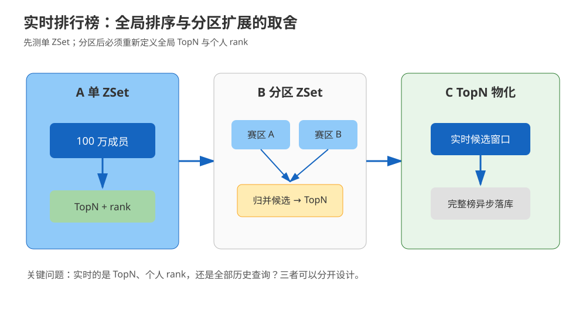
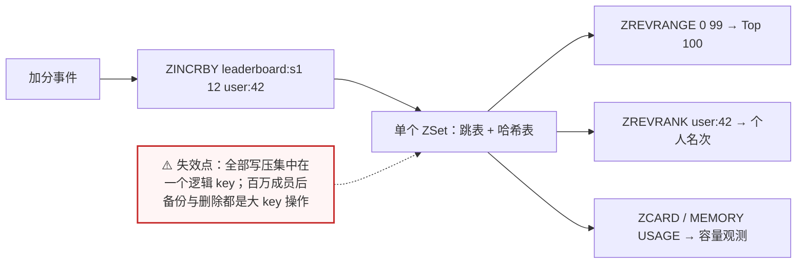
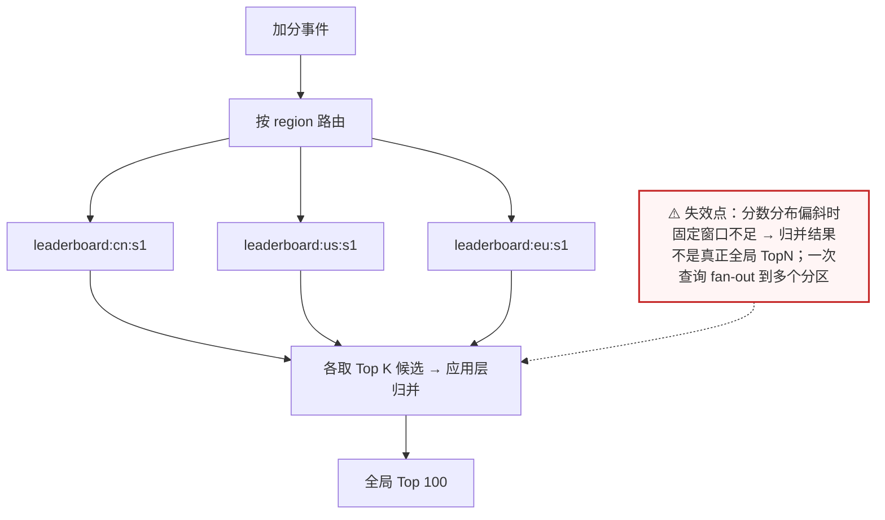
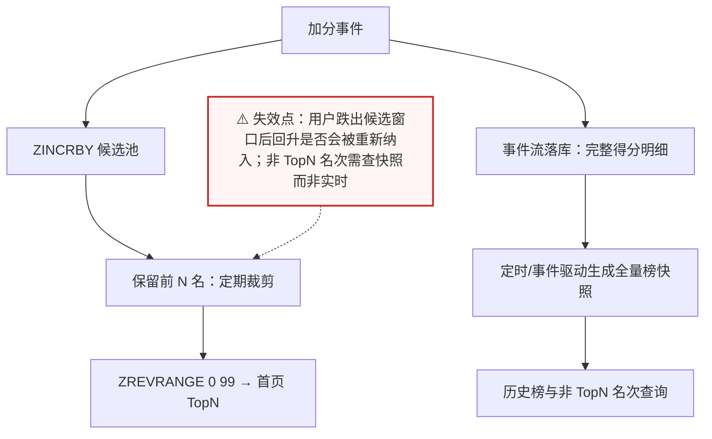
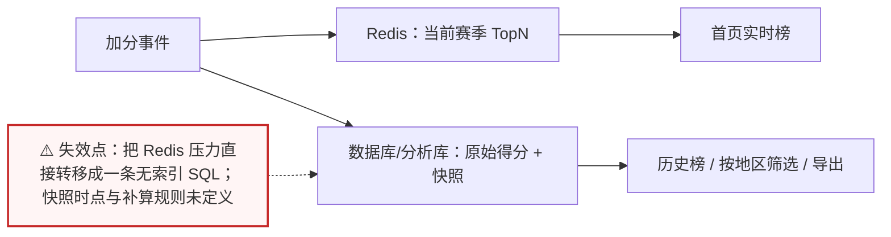

# 场景 03：百万级实时排行榜

| 项目 | 内容 |
|---|---|
| 类型 | 规模压力题 |
| 场景 | 100 万参赛者、每秒数千次加分，页面要求实时返回 Top 100 与某人的名次 |
| 目标 | 在写入、TopN 查询、个人排名和内存之间取得可解释的平衡 |
| 先看 | [08-实战经验 · 故障模式 3：大 key 删除造成周期性卡顿](../08-实战经验.md#故障模式-3大-key-删除造成周期性卡顿) |
| 崩了怎么办 | [09-排障速查手册 · 症状 3：大 key 同步删除造成卡顿](../09-排障速查手册.md) |

## 场景描述

产品说“做一个排行榜”通常包含四个不同需求：实时加分、全局 TopN、个人名次、历史榜单。单个 ZSet 是很好的起点，但“百万成员”不是天然的故障线。真正要测的是成员数量、score 更新频率、成员名长度、查询范围和是否需要跨赛区聚合。



> 读图：蓝色路径代表实时读写，灰色路径代表离线或准实时汇总。

## 🔒 先自己想 30 秒

请分别回答：

1. 个人排名是否必须强实时？用户看到“第 12,345 名”晚 10 秒能不能接受？
2. Top 100 是否比全量排名更重要？如果页面只展示前 100 名，为什么要让 Redis 维护一个可被任意查询的全量榜？
3. 所有参赛者是否必须在一个全局有序集合里？按赛区 / 租户天然分组能不能满足产品？
4. 跨分区汇总的延迟能接受多少？先估算成员内存与写放大，再决定要不要拆榜。

<details>
<summary>💡 提示（卡住了再看）</summary>

- ZSet 适合 score 排序和按名次范围读取。
- 128 不是通用容量阈值；课程实测的编码变化说明必须在目标版本和真实 key 形态下测量。
- 分区后个人名次与全局名次需要额外聚合，不能继续假设一个 `ZREVRANK` 就能回答。
- 如果页面只要 Top 100，不一定要让 Redis 保存一个可被任意查询的全量全局排名。

</details>

<details>
<summary>📖 展开解法（先想完再看）</summary>

> 代码约定：以下片段中 `redis_clients` 为按分区取用的 Redis 客户端集合，`trim_candidates` / `event_stream` 为业务侧占位实现，文中不再重复定义，照抄时需自备。

## 解法一览

| 解法 | 核心动作 | 效果（TopN 实时性 / 个人排名实时性） | 适合 | 主要代价 |
|---|---|---|---|---|
| A. 单 ZSet | 一个榜写入与读取都走同一 ZSet | TopN 与个人名次都强实时（单次 `ZREVRANGE` / `ZREVRANK`） | 中小规模、强实时全局排名 | 单 key 热点与内存集中 |
| B. 分区 ZSet + 合并 | 按赛区/租户拆榜，查询时取各分区候选 | TopN 近实时（应用层归并）；个人全局名次需额外计算 | 写压力和容量继续增长 | 全局排名计算复杂、延迟上升 |
| C. TopN 物化 | 只实时维护候选与 TopN，完整榜异步落库 | TopN 强实时；非 TopN 个人排名变为准实时 | 页面只看 TopN | 非 TopN 个人排名不再即时 |
| D. 数据库 / 专用分析系统 | Redis 只做热点榜，完整历史在其他系统 | TopN 取决于快照频率；历史与筛选能力强 | 需要历史、审计、复杂筛选 | 实时性和系统链路复杂度折中 |

## 展开解法

### 解法 A：单 ZSet 起步

**思路。** 一个 `leaderboard:{season}` ZSet 以用户 ID 为 member、分数为 score。加分用 `ZINCRBY`，TopN 用倒序范围读取，个人名次用倒序 rank。先把“榜单是否需要持久化、分数相同时如何稳定排序、赛季结束如何冻结”写入契约。



> 读图：所有读写都汇聚到中间那一个 ZSet——这就是它的优点（一次操作即可得到 TopN 与名次）与缺点（热点与容量都无处分散）。

```bash
redis-cli ZINCRBY leaderboard:s1 12 user:42
redis-cli ZREVRANGE leaderboard:s1 0 99 WITHSCORES
redis-cli ZREVRANK leaderboard:s1 user:42
redis-cli ZCARD leaderboard:s1
redis-cli MEMORY USAGE leaderboard:s1
```

| 维度 | 判断 |
|---|---|
| 代价 | 所有写入集中到一个逻辑 key；成员和 score 持续增长会带来内存与备份压力 |
| 边界 | 不适合需要多维过滤、复杂历史分析或绝对不能丢失的唯一事实数据 |
| 课程挂钩 | [课 4《Set、ZSet 与特殊类型》](../stages/2-数据结构与命令/lessons/lesson-04-Set、ZSet与特殊类型.md)：ZSet、排序、`ZINCRBY`、`ZREVRANK`；[课 9《生产实践与选型》](../stages/4-分布式与生产实践/lessons/lesson-09-生产实践与选型.md)：内存测量 |
| 来源 | [Redis sorted sets](https://redis.io/docs/latest/develop/data-types/sorted-sets/)、[ZINCRBY](https://redis.io/docs/latest/commands/zincrby/)、[ZREVRANK](https://redis.io/docs/latest/commands/zrevrank/) |

### 解法 B：分区 ZSet + 合并候选

**思路。** 按赛区、租户或时间窗口把写入打散，例如 `leaderboard:{region}:s1`。查询全局 TopN 时先从每个分区取一个候选窗口，再在应用层归并；窗口不足时扩大并重试。分区数是可压测的参数，不是越多越好。



> 读图：写入被扇出到多个分区，查询却要扇入回一个归并点——扇入窗口 K 取多大，决定了这个方案的准确性与成本。

```python
def global_top(redis_clients, season, regions, limit=100):
    candidates = []
    for region in regions:
        rows = redis_clients[region].zrevrange(
            f"leaderboard:{region}:{season}", 0, limit - 1, withscores=True
        )
        candidates.extend((user_id, score, region) for user_id, score in rows)
    return sorted(candidates, key=lambda row: (-row[1], row[0]))[:limit]
```

| 维度 | 判断 |
|---|---|
| 代价 | 一次查询 fan-out 到多个分区；分区内 rank 容易算，全局 rank 需要更多候选或离线计算 |
| 边界 | 不能用固定 Top 100 候选保证任意情况下的全局 Top 100；分数分布偏斜时要扩大窗口 |
| 课程挂钩 | [课 7《分片与集群》](../stages/4-分布式与生产实践/lessons/lesson-07-分片与集群.md)：分片与 hash tag；[课 4《Set、ZSet 与特殊类型》](../stages/2-数据结构与命令/lessons/lesson-04-Set、ZSet与特殊类型.md)：ZSet 范围查询 |
| 来源 | [Redis scaling](https://redis.io/docs/latest/operate/oss_and_stack/management/scaling/)、[Redis sorted sets](https://redis.io/docs/latest/develop/data-types/sorted-sets/) |

### 解法 C：只维护实时 TopN，完整榜异步物化

**思路。** 如果首页只需要 Top 100，实时路径只维护候选窗口或 TopN；完整得分明细写入持久化系统，定时或事件驱动生成全量榜。它把实时写压力和内存需求降下来，但要明确“TopN 实时、全量榜准实时”的不同 SLA。



> 读图：两条链分开——上面一条只服务“首页 TopN”（快、但被裁剪），下面一条服务“完整榜”（全、但有延迟）。选择这个解法，本质是接受两套 SLA。

```python
def update_score(user_id, delta, redis_client, event_stream):
    score = redis_client.zincrby("leaderboard:topn:candidates", delta, user_id)
    trim_candidates(redis_client, "leaderboard:topn:candidates", keep=10000)
    event_stream.append({"user_id": user_id, "delta": delta, "score": score})

def read_top(redis_client):
    return redis_client.zrevrange("leaderboard:topn:candidates", 0, 99, withscores=True)
```

| 维度 | 判断 |
|---|---|
| 代价 | 需要候选窗口大小、异步落库、重算和补偿；一个用户暂时跌出窗口后再回升要能被重新纳入 |
| 边界 | 不能用它回答强实时的任意用户全局排名；积分事件必须有幂等键和重放能力 |
| 课程挂钩 | [课 5《Stream 与 Pub/Sub》](../stages/2-数据结构与命令/lessons/lesson-05-Stream与PubSub.md)：事件流与重放；[课 9《生产实践与选型》](../stages/4-分布式与生产实践/lessons/lesson-09-生产实践与选型.md)：实时性与持久化边界 |
| 来源 | [Redis Streams](https://redis.io/docs/latest/develop/data-types/streams/)、[ZREVRANGE](https://redis.io/docs/latest/commands/zrevrange/) |

### 解法 D：Redis 做热点榜，完整榜交给数据库或专用系统

**思路。** Redis 只承担最近赛季或当前页面需要的 TopN；原始得分、排名快照和审计记录进入数据库、搜索系统或分析库。查询历史榜、按地区筛选、导出报表时走后者，避免把一个缓存型组件变成唯一事实源。



> 读图：写入一分为二——实时那份进 Redis，可审计那份落到持久层；右侧两个页面各取所需，避免“Redis 榜”被当成唯一事实源。

```sql
-- 示例：完整得分在持久化系统中保存，排名按批次生成
SELECT user_id, score, rank
FROM leaderboard_snapshot
WHERE season_id = :season
ORDER BY rank
LIMIT 100;
```

| 维度 | 判断 |
|---|---|
| 代价 | 实时查询链路变长；需要定义快照时点、延迟和补算机制 |
| 边界 | 数据库排序也可能成为瓶颈；不能只把 Redis 的压力转移到一条无索引 SQL |
| 课程挂钩 | [课 1《Redis 是什么》](../stages/1-为什么需要Redis/lessons/lesson-01-Redis是什么.md)：缓存、临时状态与事实数据边界；[课 9《生产实践与选型》](../stages/4-分布式与生产实践/lessons/lesson-09-生产实践与选型.md)：选型与降级 |
| 来源 | Redis 的定位与替代系统属于架构决策；[Redis data types](https://redis.io/docs/latest/develop/data-types/) 可用于确认 Redis 侧能力边界 |

## 推荐路径：先用最小可行榜单

1. 先用 A 做目标版本压测，记录 ZSet 内存、写延迟、TopN 延迟和 rank 查询比例。
2. 只有单 key 热点或容量逼近边界时，选择 B；先按业务天然边界分区，不要随机拆分导致查询无法解释。
3. 页面只要 TopN 时优先评估 C；需要历史与复杂筛选时采用 D。
4. 赛季结束后冻结快照、清理临时榜，避免“实时榜永远增长”变成隐性容量债务。

## 非 Redis 替代路线

| 替代路线 | 适合什么情况 | 与 Redis 解法的关键差异 | 代价 / 注意 |
|---|---|---|---|
| 数据库窗口函数 `ROW_NUMBER` / `RANK` | 实时性要求低、需要审计与复杂筛选 | 不需要额外维护 ZSet，排序由数据库完成 | 高频更新会打数据库；需索引与批量快照 |
| 专用 OLAP / 搜索系统 | 历史榜、多维筛选、导出报表 | 查询能力强，可长期留存明细 | 实时性弱于 Redis；多一条同步链路 |
| 应用内有界堆 + 周期持久化 | 只展示首页 TopN、实例数少 | 零外部依赖，内存占用可控 | 实例间不一致；重启后需要重建 |

## 做错会踩的坑

- 把 128 成员当作所有版本的硬阈值；编码变化必须以实际版本、成员长度和测量结果为准。
- 只测 `ZINCRBY`，不测高并发 `ZREVRANK`、TopN 查询和持久化快照。
- 分区后仍声称能用一次 `ZREVRANK` 得到全局名次。
- score 相同没有稳定 tie-break 规则，导致页面名次抖动。
- 只保留 Redis 榜，没有原始得分事件或可重算快照，故障后无法解释和补算。

</details>
