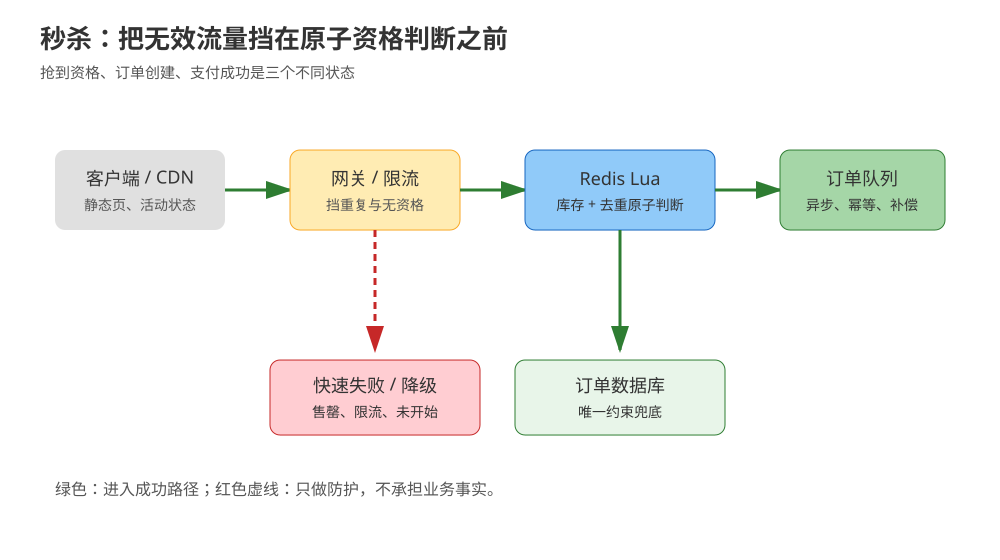
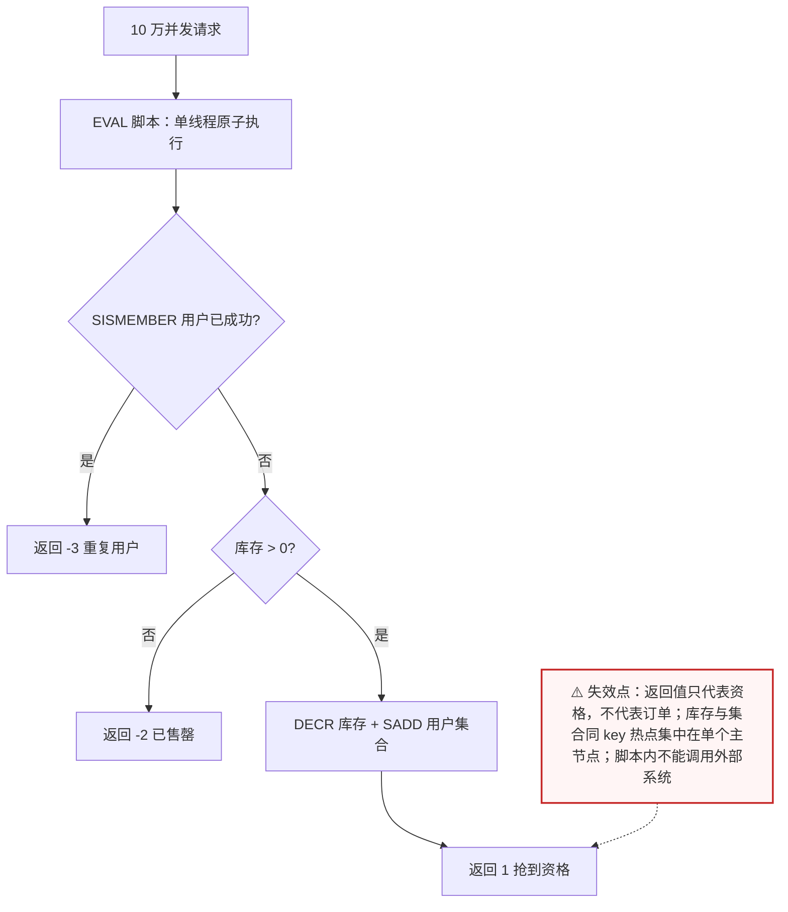
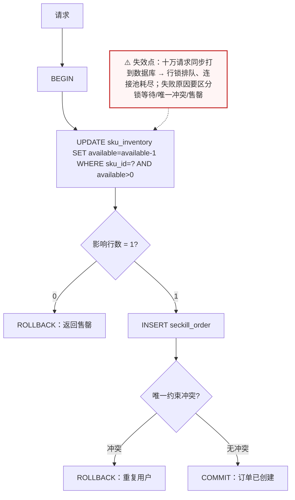
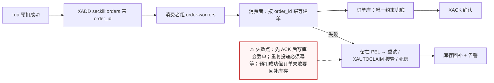
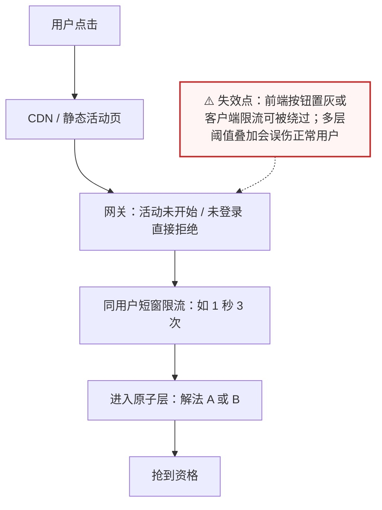

# 场景 04：秒杀 100 件商品，10 万人同时抢

| 项目 | 内容 |
|---|---|
| 类型 | 规模压力题 + 经典设计题 |
| 场景 | 库存 100 件、瞬时请求 100,000，要求不超卖、同一用户最多成功一次、接口快速返回 |
| 目标 | 把“资格判断、库存扣减、防重复”放进一个可验证的原子边界，并隔离后续订单写入 |
| 先看 | [08-实战经验 · 故障模式 9：秒杀超卖](../08-实战经验.md#故障模式-9秒杀超卖) |
| 崩了怎么办 | [09-排障速查手册 · 症状 9：秒杀超卖](../09-排障速查手册.md) |

## 场景描述

如果先查库存、再扣库存、再写用户购买记录，十万个并发请求会把这三个动作交错执行。数据库事务可以提供正确性，但连接池和行锁可能被瞬时流量拖垮；Redis 可以做前置原子判断，却不能凭空替代订单事实、支付和履约。



> 读图：红色分支表示快速失败，绿色分支表示进入后续订单处理。

## 🔒 先自己想 30 秒

请先写出并发下必须原子的最小集合，再回答：

1. 必须一起原子的三件事是什么：库存是否足够、用户是否已经成功、成功名额是否占用？
2. 秒杀接口返回的是**最终订单**，还是一张**排队凭证**？用户看到什么文案？
3. Redis 宕机时，未完成的预扣怎么回补？事件重复投递会不会重复建单？
4. 订单落库失败时，库存怎么回滚、用户看到什么状态、人工从哪里介入？

<details>
<summary>💡 提示（卡住了再看）</summary>

- “查询后判断再写”不是原子操作；Lua 或数据库条件更新可以缩小原子边界。
- 去重集合与库存计数必须在同一原子脚本或同一数据库事务里更新。
- 前置拦截只能减少无效请求，不能替代最终订单校验。
- 异步链路一定要有幂等订单号、重试和人工/自动补偿出口。

</details>

<details>
<summary>📖 展开解法（先想完再看）</summary>

> 代码约定：以下片段中 `redis_client` 为已连接的 Redis 客户端，`limiter` / `activity_started` / `run_atomic_qualification` 为业务侧占位实现，文中不再重复定义，照抄时需自备。

## 解法一览

| 解法 | 核心动作 | 效果（不超卖保证 / 峰值吞吐） | 适合 | 主要代价 |
|---|---|---|---|---|
| A. Lua 原子扣减 | 库存判断、用户去重、扣减一次完成 | 不超卖由脚本原子性保证；吞吐接近单节点 Redis 上限 | 高并发、快速返回资格 | 脚本边界与补偿设计复杂 |
| B. 数据库条件更新 | `UPDATE ... WHERE stock > 0` + 唯一约束 | 不超卖由行锁 + 约束保证；吞吐受行锁/连接池限制 | 规模中等、订单必须同步确认 | 行锁/连接池压力较大 |
| C. Redis 预扣 + Stream 异步下单 | 先抢资格，再可靠消费落订单 | 不超卖在资格层保证；订单吞吐由消费者数量决定 | 峰值远高于订单写入能力 | 最终一致、重复消费与回补 |
| D. 分层拦截 | CDN/网关/本地限流挡掉大部分无效流量 | 不单独保证不超卖，只把进入原子层的请求降到可承载量级 | 流量极端集中 | 多层阈值协调、误杀风险 |

## 展开解法

### 解法 A：Lua 脚本把资格判断做成一个原子动作

**思路。** `KEYS[1]` 保存库存，`KEYS[2]` 保存已经成功的用户集合。脚本先判断重复，再判断库存，再同时扣减和写入集合；返回值只表达“是否抢到资格”，不冒充订单已支付或已履约。



> 读图：三个菱形是脚本内部的判断顺序——先查重、再查库存、最后才扣减；因为整个脚本在 Redis 单线程里一次执行完，所以不会出现“查完还没扣就被别人插队”。

```lua
-- seckill.lua
local user_id = ARGV[1]

if redis.call('SISMEMBER', KEYS[2], user_id) == 1 then
  return -3 -- duplicate user
end

local stock = tonumber(redis.call('GET', KEYS[1]) or '-1')
if stock <= 0 then
  return -2 -- sold out
end

redis.call('DECR', KEYS[1])
redis.call('SADD', KEYS[2], user_id)
return 1 -- qualification acquired
```

```bash
redis-cli SET seckill:stock:sku-1 100
redis-cli EVAL "$(<seckill.lua)" 2 seckill:stock:sku-1 seckill:users:sku-1 user-42
```

| 维度 | 判断 |
|---|---|
| 代价 | 脚本修改范围越大越难演进；库存与购买集合可能需要回补；高热点 key 仍集中在一个主节点 |
| 边界 | Redis 返回成功不等于订单写入成功；必须有事件、订单幂等和补偿；不能在脚本中调用外部系统 |
| 课程挂钩 | [课 7《分片与集群》](../stages/4-分布式与生产实践/lessons/lesson-07-分片与集群.md)：Lua 原子性与 Cluster 同槽；[课 4《Set、ZSet 与特殊类型》](../stages/2-数据结构与命令/lessons/lesson-04-Set、ZSet与特殊类型.md)：Set 去重 |
| 来源 | [Redis programmability](https://redis.io/docs/latest/develop/programmability/)、[Redis transactions](https://redis.io/docs/latest/develop/using-commands/transactions/) |

### 解法 B：数据库条件扣减 + 唯一约束

**思路。** 让数据库持有最终库存与订单事实，用一个带条件的更新保证库存不能降到零以下，再用用户与商品唯一约束防重复。它最容易保证订单与库存的一致性，但必须用压测验证行锁、连接池和超时重试。



> 读图：正确性由“条件更新 + 唯一约束”两处共同保证——前者挡超卖，后者挡重复；代价是它们都在同一条数据库行上排队。

```sql
BEGIN;

UPDATE sku_inventory
SET available = available - 1
WHERE sku_id = :sku_id AND available > 0;

-- 受影响行数为 0 时回滚并返回售罄
INSERT INTO seckill_order(order_id, sku_id, user_id)
VALUES (:order_id, :sku_id, :user_id);
-- (sku_id, user_id) 上有唯一约束，重复用户插入失败

COMMIT;
```

| 维度 | 判断 |
|---|---|
| 代价 | 大量竞争会集中到库存行；失败重试必须区分锁等待、唯一冲突和业务售罄 |
| 边界 | 不适合十万请求全部同步打到数据库；要先在网关和应用层挡住明显无效流量 |
| 课程挂钩 | [课 8《缓存设计》](../stages/4-分布式与生产实践/lessons/lesson-08-缓存设计.md)：缓存不是事实源；[课 9《生产实践与选型》](../stages/4-分布式与生产实践/lessons/lesson-09-生产实践与选型.md)：故障边界与降级 |
| 来源 | [PostgreSQL explicit locking](https://www.postgresql.org/docs/current/explicit-locking.html)（若使用 PostgreSQL）；Redis 侧可参考 [Redis transactions](https://redis.io/docs/latest/develop/using-commands/transactions/) 理解原子边界；具体数据库仍以其版本文档为准 |

### 解法 C：Redis 预扣 + Stream 异步下单

**思路。** A 的脚本成功后，把订单凭证写入 Redis Stream；消费者组异步创建订单，失败消息留在待处理列表并重试或转人工。事件至少包含幂等订单号，消费者以数据库唯一约束兜底。不要把 Pub/Sub 用作这种需要重放的订单事件总线。



> 读图：注意 `XACK` 在“订单写库成功”之后——顺序反了就是丢单；右下角 PEL 分支是这个方案必须设计的补偿出口。

```bash
# 预扣成功后写入；生产代码应让“预扣成功”和“写事件”处于可补偿的设计中
redis-cli XADD seckill:orders MAXLEN ~ 100000 '*' \
  order_id order-20260917-0001 sku_id sku-1 user_id user-42

redis-cli XGROUP CREATE seckill:orders order-workers 0-0 MKSTREAM
redis-cli XREADGROUP GROUP order-workers worker-1 COUNT 20 BLOCK 2000 STREAMS seckill:orders '>'
redis-cli XACK seckill:orders order-workers 1710000000000-0
```

| 维度 | 判断 |
|---|---|
| 代价 | 用户先拿到排队凭证；消费者重复投递、崩溃接管、超时和库存回补都要设计 |
| 边界 | Stream 不是自动的“恰好一次”；订单消费者必须幂等，且要监控 pending 数和最老消息年龄 |
| 课程挂钩 | [课 5《Stream 与 Pub/Sub》](../stages/2-数据结构与命令/lessons/lesson-05-Stream与PubSub.md)：Stream、消费者组、确认与重试；[课 9《生产实践与选型》](../stages/4-分布式与生产实践/lessons/lesson-09-生产实践与选型.md)：异步交付边界 |
| 来源 | [Redis Streams](https://redis.io/docs/latest/develop/data-types/streams/)、[XREADGROUP](https://redis.io/docs/latest/commands/xreadgroup/)、[XACK](https://redis.io/docs/latest/commands/xack/) |

### 解法 D：CDN、网关和应用层分层拦截

**思路。** 把无资格请求尽可能挡在 Redis 前：活动未开始直接拒绝，用户未登录直接拒绝，同一用户短时间重复请求限流，静态活动页走 CDN。真正进入 Redis 的请求仍须执行 A 或 B，分层拦截只是削峰与省资源。



> 读图：每一层都在“减少到达原子层的请求数”，但最后一层 `ATOM` 不可省略——拦截层再厚，也不能替你保证不超卖。

```python
def enter_seckill(user_id, sku_id, redis_client, limiter):
    if not activity_started(sku_id):
        return {"status": "not_started"}
    if not limiter.allow(f"seckill:{sku_id}:{user_id}", limit=3, window=1):
        return {"status": "rate_limited"}
    return run_atomic_qualification(redis_client, user_id, sku_id)
```

| 维度 | 判断 |
|---|---|
| 代价 | 多层限流阈值和缓存状态可能短暂不一致；过严会误伤正常用户 |
| 边界 | 不能只靠前端按钮置灰或客户端限流；攻击者可以绕过客户端 |
| 课程挂钩 | [课 8《缓存设计》](../stages/4-分布式与生产实践/lessons/lesson-08-缓存设计.md)：限流、热点与降级；[课 9《生产实践与选型》](../stages/4-分布式与生产实践/lessons/lesson-09-生产实践与选型.md)：生产防护 |
| 来源 | [Redis INCR](https://redis.io/docs/latest/commands/incr/)（计数型限流原语）；网关/CDN 策略需以实际产品文档和压测为准 |

## 推荐路径：正确性先于速度

1. 先确定订单事实、幂等键、库存回补和用户可见状态。
2. 先用 D 削减无效流量，再用 A 或 B 选择原子扣减边界。
3. 同步订单写入扛不住峰值时，采用 C，把“抢到资格”和“订单已创建”明确分成两个状态。
4. 用并发压测验证：成功数 ≤ 100、重复用户成功数 ≤ 1、失败可解释、消费者重启后可恢复。

## 非 Redis 替代路线

| 替代路线 | 适合什么情况 | 与 Redis 解法的关键差异 | 代价 / 注意 |
|---|---|---|---|
| 网关限流 + 数据库条件更新 | 峰值可控、订单必须同步确认 | 少一个 Redis 原子状态，一致性全部落在数据库 | 行锁与连接池是瓶颈，必须压测 |
| Kafka / RabbitMQ + 数据库唯一约束 | 已有消息平台、需要长期保留与多消费者 | 队列语义成熟，重放与死信由消息平台承担 | 多一套运维；端到端延迟变长 |
| 数据库队列表 + `FOR UPDATE SKIP LOCKED` | 中小流量、不想引入新组件 | 用数据库既做事实源又做队列 | 吞吐有限；轮询与锁竞争要调优 |

## 做错会踩的坑

- `GET` 库存后在应用代码里 `DECR`，并发下出现超卖。
- Lua 只扣库存，不记录用户去重，导致同一用户多次成功。
- Redis 预扣成功后订单写失败，没有回补库存和告警。
- 把 Stream 的重复投递当成 bug，消费者没有幂等却直接创建订单。
- 把“接口返回抢到”文案写成“支付成功”，混淆资格、订单、支付三个状态。

</details>
