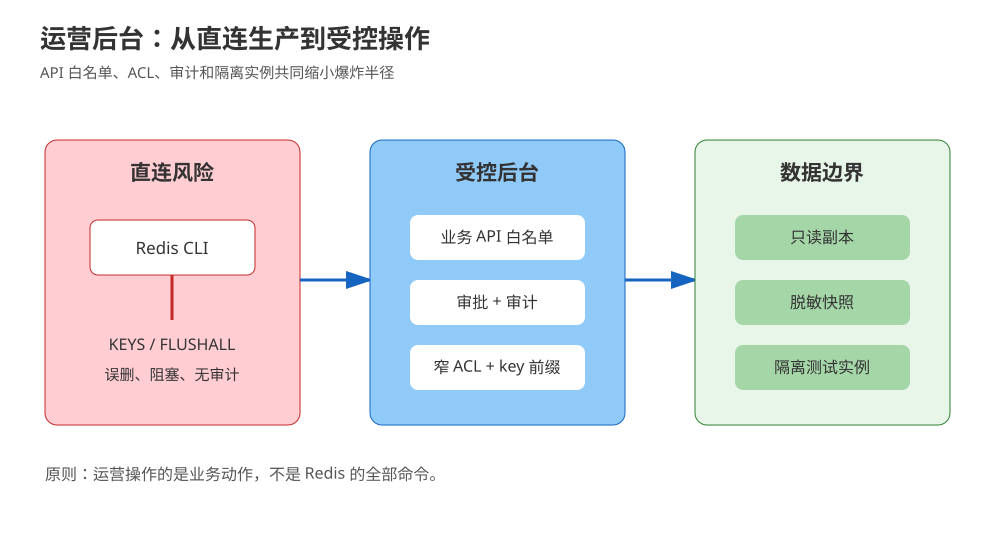
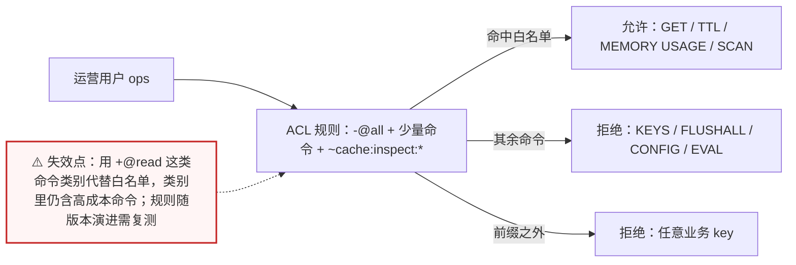
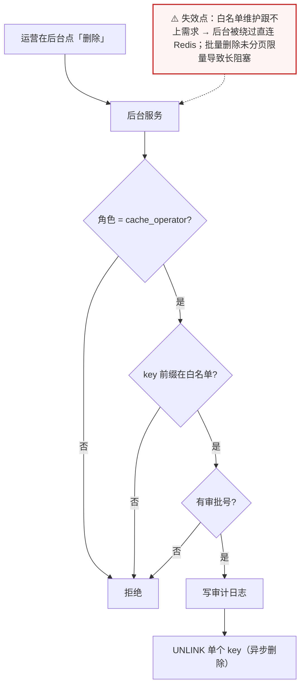
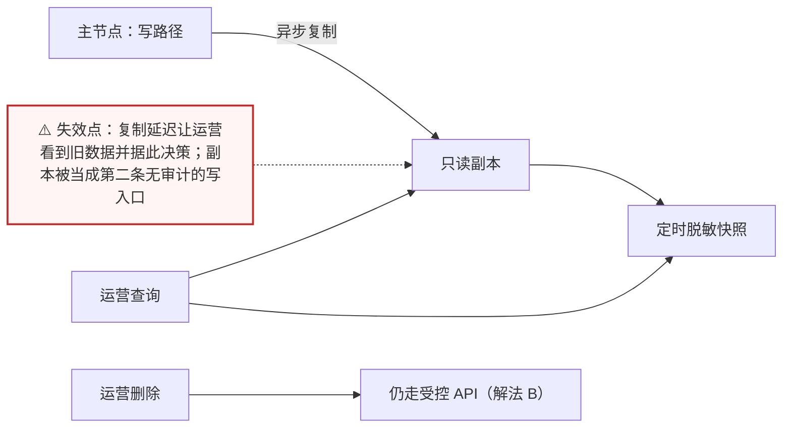
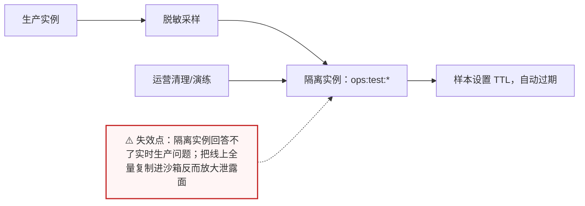

# 场景 05：给运营开数据后台，如何防误操作

| 项目 | 内容 |
|---|---|
| 类型 | 经典设计题 |
| 场景 | 运营需要查 key、看 TTL、删除测试数据；工程师担心 `KEYS *`、`FLUSHALL`、误删线上缓存 |
| 目标 | 让运营完成必要工作，同时把权限、命令、实例和审计边界收窄 |
| 先看 | [08-实战经验 · 故障模式 1：KEYS 命令阻塞引发全链路雪崩](../08-实战经验.md#故障模式-1keys-命令阻塞引发全链路雪崩) |
| 崩了怎么办 | [09-排障速查手册 · 症状 1：KEYS 阻塞事件循环](../09-排障速查手册.md) |

## 场景描述

“给一个 Redis 账号”不是后台设计。运营的动作可以拆成浏览、抽样读取、删除单个测试 key、批量清理和修改配置；每一种动作需要的权限不同。尤其要注意：Redis ACL 的命令类别是方便的集合，不等于最小权限；例如 `+@read` 并不代表“只能读几个安全命令”，仍需逐项核查。



> 读图：优先看红色被挡住的管理命令，再看绿色允许的最小读路径。

## 🔒 先自己想 30 秒

先把“人想做的事”翻译成动作清单，再回答：

1. 运营到底需要哪些动作？浏览、抽样读、删单个测试 key、批量清理、改配置——各需要什么权限？
2. 能不能只允许按前缀 `SCAN` + 读 `TYPE`/`TTL`/`MEMORY USAGE`，而不是开放通用命令？
3. 线上数据是否必须直接查？换成只读副本或脱敏快照能不能满足？
4. 每次删除能否做到：审批、留痕、限量、可中断、自动过期？

<details>
<summary>💡 提示（卡住了再看）</summary>

- 优先把“人想做的事”翻译成业务 API，而不是把 Redis CLI 暴露给人。
- ACL 是底层护栏，API 层还要做 key 前缀、数量、速率和审批校验。
- 生产只读副本、脱敏快照和隔离测试实例可以进一步降低爆炸半径。
- 禁用危险命令只是最后一层，审计、回滚和超时同样重要。

</details>

<details>
<summary>📖 展开解法（先想完再看）</summary>

> 代码约定：以下片段中 `redis_client` 为已连接的 Redis 客户端，`require_role` / `require_prefix` / `require_approval` / `record_audit` 为业务侧占位实现，文中不再重复定义，照抄时需自备。

## 解法一览

| 解法 | 核心动作 | 效果（误操作爆炸半径 / 运营自助度） | 适合 | 主要代价 |
|---|---|---|---|---|
| A. ACL 最小权限 | 按角色限制命令与 key pattern | 把可用命令从“全部”收成白名单；运营仍需会基本命令 | 需要保留有限 Redis 能力 | 规则容易过宽，需持续审计 |
| B. 后台 API 代理 | 后台只提供白名单业务动作 | 运营完全不接触命令；爆炸半径 = 允许的前缀 × 单次数量 | 面向非研发用户 | 需要开发、鉴权和审计服务 |
| C. 只读副本 / 脱敏快照 | 运营不接触主实例 | 主库写路径零暴露；运营自助查询能力强 | 主要是查询与排障 | 数据有延迟或脱敏损失 |
| D. 隔离实例 | 测试/运营数据与生产分开 | 误删最坏只影响沙箱；自助度最高 | 清理、演练、批量操作 | 需要同步或数据准备流程 |

## 展开解法

### 解法 A：ACL 最小权限 + key 前缀

**思路。** 为应用、运维、运营分别建用户；运营用户只允许规定命令和 `ops:*`/`cache:inspect:*` 等前缀。密码通过环境变量或密钥管理系统注入，示例不放真实凭据。上线前用“允许清单”和“拒绝清单”各做一次测试。



> 读图：ACL 是三岔口——命令白名单、key 前缀、默认拒绝；只要有一处写成“类别”而不是“具体命令”，中间那条允许分支就会悄悄变宽。

```bash
# 示例命令；密码必须由密钥管理系统注入，以下变量不包含真实值
redis-cli ACL SETUSER ops on resetkeys '~cache:inspect:*' \
  -@all +get +mget +exists +type +ttl '+memory|usage' \
  ">${OPS_REDIS_PASSWORD}"

redis-cli ACL LIST
redis-cli ACL GETUSER ops
```

> 注意：`+@read` 是命令类别，不是安全的业务白名单；生产规则应按实际需求缩到具体命令。对带敏感内容的 `GET` 仍要在 API 层脱敏。

| 维度 | 判断 |
|---|---|
| 代价 | ACL 规则会随版本和运维需求演化；误配可能导致“查不到”或权限过宽 |
| 边界 | ACL 不能替代应用层参数校验、审批、审计和速率限制；不要给运营 `CONFIG`、`FLUSHALL`、`EVAL` 等管理能力 |
| 课程挂钩 | [课 9《生产实践与选型》](../stages/4-分布式与生产实践/lessons/lesson-09-生产实践与选型.md)：ACL、危险命令与生产护栏 |
| 来源 | [Redis ACL](https://redis.io/docs/latest/operate/oss_and_stack/management/security/acl/)、[Redis command permissions](https://redis.io/docs/latest/operate/oss_and_stack/management/security/acl/) |

### 解法 B：后台 API 代理

**思路。** 运营后台提供“按精确 key 查询”“查看类型与 TTL”“删除一个经过校验的测试 key”等有限动作，服务端固定允许的前缀、最大批量、操作者和审批号。后台服务自身使用窄 ACL；运营永远看不到 Redis 连接串和命令行。



> 读图：三道校验（角色 / 前缀 / 审批）串成一条链，最后才落到 `UNLINK`——注意是异步删除的 `UNLINK`，不是同步 `DEL`。

```python
ALLOWED_PREFIXES = ("cache:inspect:", "ops:test:")

def delete_one_key(actor, key, redis_client):
    require_role(actor, "cache_operator")
    require_prefix(key, ALLOWED_PREFIXES)
    require_approval(actor, key)
    record_audit(actor, "delete", key)
    return redis_client.unlink(key)
```

| 维度 | 判断 |
|---|---|
| 代价 | 需要开发接口、鉴权、审批、审计和回滚提示；需求增长时白名单要维护 |
| 边界 | 代理层不能允许任意 key、任意命令或任意 Lua；批量删除必须分页、限量、可中断 |
| 课程挂钩 | [课 9《生产实践与选型》](../stages/4-分布式与生产实践/lessons/lesson-09-生产实践与选型.md)：生产治理、`SCAN`、危险操作 |
| 来源 | [Redis SCAN](https://redis.io/docs/latest/commands/scan/)、[Redis UNLINK](https://redis.io/docs/latest/commands/unlink/)、[Redis ACL](https://redis.io/docs/latest/operate/oss_and_stack/management/security/acl/) |

### 解法 C：只读副本或脱敏快照

**思路。** 查询类需求不必直连主节点：运营读副本、只读导出库或定时脱敏快照。页面明确显示“数据时间”和“非事实源”，避免把延迟数据当成线上当前状态。任何删除动作仍回到受控 API，不允许在副本上直接执行。



> 读图：运营的“读”指向副本与快照，“删”却必须折回受控 API——读写的两条路径刻意不同，这是这个解法的核心。

```bash
# 在指定只读连接上做小范围取证；不要对生产全库 KEYS
redis-cli -h "$REDIS_READ_HOST" SCAN 0 MATCH 'cache:inspect:*' COUNT 100
redis-cli -h "$REDIS_READ_HOST" TTL 'cache:inspect:item-1'
redis-cli -h "$REDIS_READ_HOST" MEMORY USAGE 'cache:inspect:item-1'
```

| 维度 | 判断 |
|---|---|
| 代价 | 有复制延迟、快照时效和脱敏成本；故障排查可能看不到最新写入 |
| 边界 | 不能用于读己之写、支付状态或实时库存确认；不要让副本成为另一条无审计的写入口 |
| 课程挂钩 | [课 6《主从复制与哨兵》](../stages/3-持久化与高可用/lessons/lesson-06-主从复制与哨兵.md)：复制与副本延迟；[课 9《生产实践与选型》](../stages/4-分布式与生产实践/lessons/lesson-09-生产实践与选型.md)：运维边界 |
| 来源 | [Redis replication](https://redis.io/docs/latest/operate/oss_and_stack/management/replication/)、[Redis SCAN](https://redis.io/docs/latest/commands/scan/) |

### 解法 D：隔离实例与可过期数据

**思路。** 测试数据、演练数据和运营临时查询尽量落在隔离实例；实例级权限和网络策略把误删范围限制在非生产环境。生产数据需要复现时，生成脱敏样本并设置明确过期时间，而不是把线上全量复制到“临时 Redis”。



> 读图：从生产到沙箱只有一条“脱敏采样”的单向箭头——沙箱里的样本还必须带 TTL，否则“临时 Redis”会变成一个新的数据滞留点。

```bash
# 示例：只对隔离实例做清理；生产环境不执行 FLUSHALL
redis-cli -h "$REDIS_SANDBOX_HOST" SCAN 0 MATCH 'ops:test:*' COUNT 500
redis-cli -h "$REDIS_SANDBOX_HOST" UNLINK 'ops:test:sample-1'
```

| 维度 | 判断 |
|---|---|
| 代价 | 需要脱敏、样本生成和环境同步流程；复现数据可能与生产略有差异 |
| 边界 | 隔离实例不能回答实时生产问题；生产删除仍要走 B 或受控变更流程 |
| 课程挂钩 | [课 1《Redis 是什么》](../stages/1-为什么需要Redis/lessons/lesson-01-Redis是什么.md)：缓存与事实数据定位；[课 9《生产实践与选型》](../stages/4-分布式与生产实践/lessons/lesson-09-生产实践与选型.md)：环境隔离与选型 |
| 来源 | [Redis persistence](https://redis.io/docs/latest/operate/oss_and_stack/management/persistence/)、[Redis ACL](https://redis.io/docs/latest/operate/oss_and_stack/management/security/acl/) |

## 推荐路径：先收窄人，再收窄命令

1. 先选 B，把运营动作抽象成 API，并在接口层完成审批、审计、前缀和数量限制。
2. 让 B 使用 A 的窄 ACL，形成应用层和 Redis 层双重边界。
3. 查询量大或需要排障时加 C；测试清理和演练优先迁到 D。
4. 每季度用自动化脚本验证允许清单、拒绝清单和审计事件，权限变更必须可追踪。

## 非 Redis 替代路线

| 替代路线 | 适合什么情况 | 与 Redis 解法的关键差异 | 代价 / 注意 |
|---|---|---|---|
| 数据库管理后台 / BI 平台 | 运营要看的是业务视图而非 key | 完全不暴露 Redis 概念 | 需要把 Redis 数据同步成可查询的业务表 |
| 云厂商缓存控制台 | 已上云、接受供应商权限模型 | 权限、审计、审批由平台提供 | 要核对平台自身的审计粒度与账号体系 |
| 只导出指标与脱敏样本 | 运营只需统计与排查线索 | 无人接触原始 key | 细节丢失，复杂问题仍需研发介入 |

## 做错会踩的坑

- 直接把 Redis CLI 或连接串交给运营。
- 以为 `+@read` 等于“安全只读”，却忘了它可能包含高成本查询命令。
- 用 `KEYS *` 搜索，用 `FLUSHALL` 清理，用 `DEL` 同步删除大量 key。
- 示例或脚本把真实密码提交进仓库；凭据只从环境或密钥系统注入。
- 只做 ACL，不做审批、审计、前缀限制和操作数量上限。

</details>
