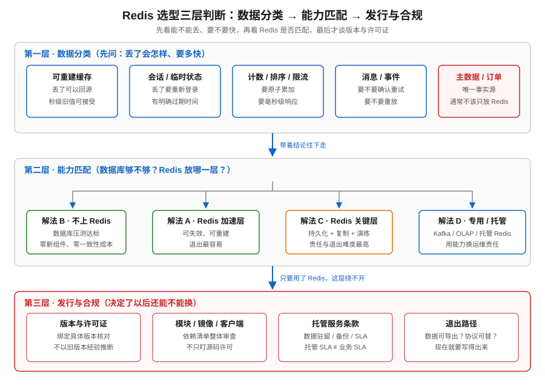
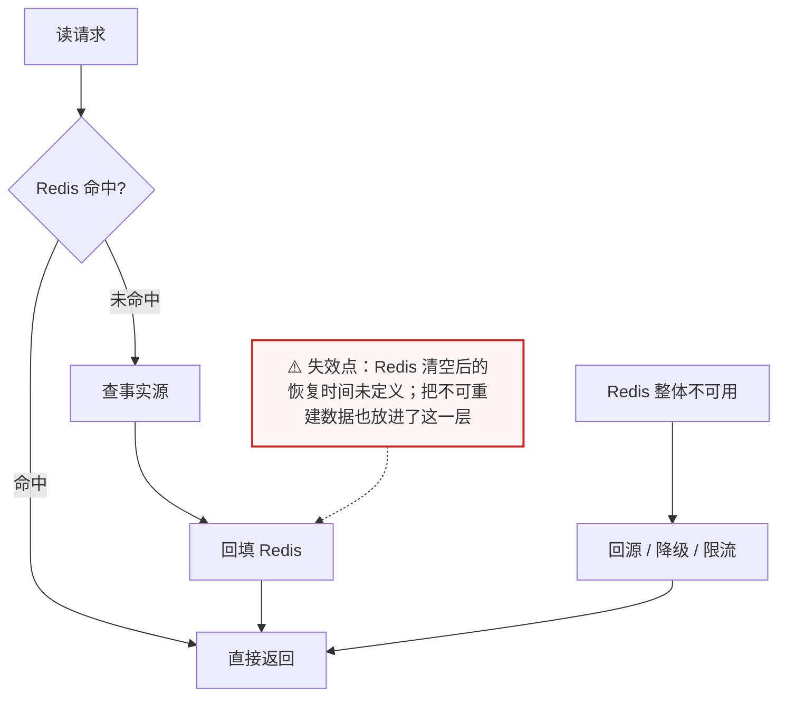
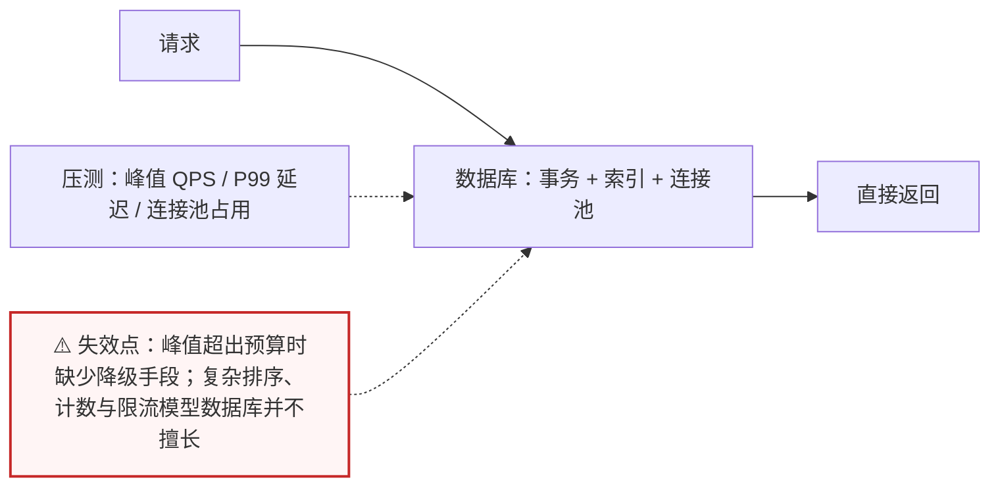
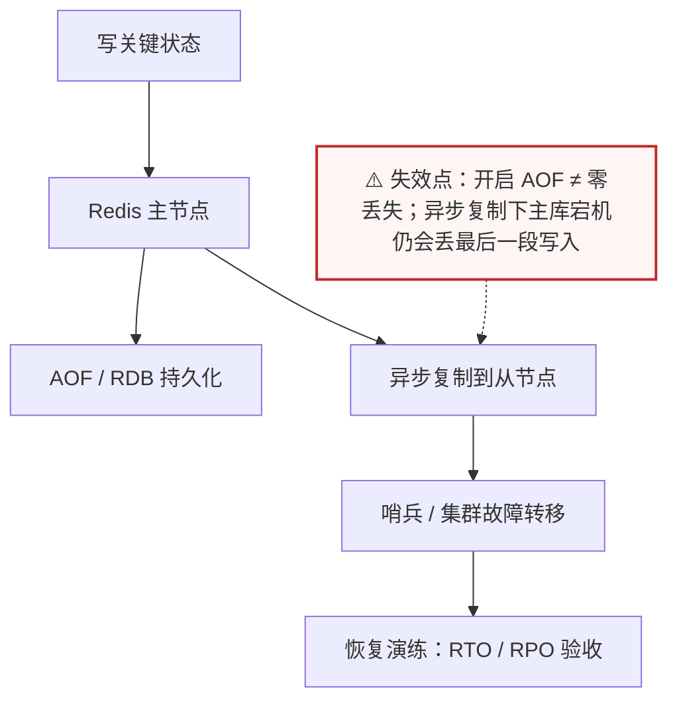
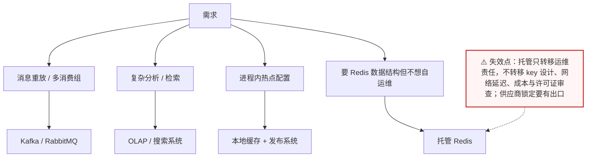

# 场景 06：Redis 该不该上？团队在纠结选型

| 项目 | 内容 |
|---|---|
| 类型 | 经典设计题 |
| 场景 | 新服务需要缓存、会话、限流、排行榜和事件；团队同时纠结“要不要 Redis”和“选哪个发行版” |
| 目标 | 先按数据与一致性需求判断是否需要 Redis，再核对发行版、托管服务和许可证 |
| 先看 | [08-实战经验 · 什么时候不该用 Redis](../08-实战经验.md#什么时候不该用-redis) |
| 崩了怎么办 | [09-排障速查手册 · 症状倒查索引](../09-排障速查手册.md)（选型阶段先按“不该用”的信号自查） |

> ⚠️ 许可证判断不是法律意见。发行版、版本、源码与二进制分发方式都可能改变义务；上线前应让法务核对具体依赖清单、合同和使用方式。

## 场景描述

“Redis 快”不是选型理由。要先问数据是否可重建、是否需要毫秒级访问、是否需要排序/计数/过期/事件流，以及数据库是否已经能以可接受的成本承担这些工作。决定使用 Redis 后，还要单独审查当前 Redis 版本的许可证与企业分发限制，不能把“开源”直接等同于“没有合规成本”。



> 读图：先看最上面那道“可重建吗 / 要多快”的分水岭，再看最下面许可证与退出路径那一层。

## 🔒 先自己想 30 秒

把需求拆成数据分类，再逐项回答：

1. 缓存、会话、计数器、排行榜、消息、主数据——每一类**丢失后的后果**是什么？恢复方式是重算、回源还是人工？
2. 每一类的延迟目标是多少毫秒？数据库加索引能不能达到？
3. 团队有没有能力运维一个有持久化、复制、故障转移和容量预算的存储组件？
4. 如果三年后要换掉它，退出路径是什么？数据能不能导出、协议能不能替代？

<details>
<summary>💡 提示（卡住了再看）</summary>

- Redis 适合低延迟数据结构和临时状态，但不自动成为业务事实源。
- 许可证决策必须绑定版本和发行方式；“兼容 BSD”不能从旧版本推断到当前版本。
- 托管服务减少运维，但不必然消除许可证、数据驻留、网络和成本问题。
- 先做小规模可测的适配层，再决定是否把 Redis 变成关键依赖。

</details>

<details>
<summary>📖 展开解法（先想完再看）</summary>

> 代码约定：以下片段中 `redis_client` 为已连接的 Redis 客户端，`decode` / `encode` 为序列化辅助函数，`db_query_config` 为业务侧占位实现，文中不再重复定义，照抄时需自备。

## 解法一览

| 解法 | 核心动作 | 效果（引入成本 / 退出难度） | 适合 | 主要代价 |
|---|---|---|---|---|
| A. Redis 做加速层 | 缓存、会话、计数、排行榜等可重建状态 | 引入成本低（可旁路、可摘除）；退出最容易 | 低延迟且允许回源 | 多一套运维与一致性问题 |
| B. 数据库直接承担 | 事务、查询、约束全部在数据库完成 | 零新组件引入；退出成本为零 | 数据量/流量中等、正确性优先 | 峰值延迟和吞吐可能不够 |
| C. Redis 做关键数据层 | Redis 保存需要快速读写的核心状态，并配置持久化/复制 | 引入成本高（持久化/复制/演练）；退出难度高 | 数据模型匹配且团队有运维能力 | 故障、恢复、合规责任更重 |
| D. 专用系统 / 托管服务 | 消息用 Kafka，分析用 OLAP，缓存用托管 Redis 等 | 引入成本最高；退出依赖供应商与协议 | 需要专门能力或减少自运维 | 成本、锁定和边界更多 |

## 展开解法

### 解法 A：Redis 做加速层

**思路。** 把 Redis 定义为可失效、可重建的加速层：数据库或服务是事实源，Redis 保存缓存、短期会话、限流计数和榜单索引。服务必须能在 Redis 清空后回源、重建或进入降级状态。



> 读图：右侧那条“Redis 整体不可用 → 降级”的分支是这个解法的验收线——如果画不出这条分支，就说明 Redis 已经被当成了事实源。

```python
def get_config(name, redis_client):
    cached = redis_client.get(f"config:{name}")
    if cached is not None:
        return decode(cached)
    value = db_query_config(name)
    redis_client.set(f"config:{name}", encode(value), ex=300)
    return value
```

| 维度 | 判断 |
|---|---|
| 代价 | 需要失效、回源、预热、内存预算和故障降级；数据会出现短暂不一致 |
| 边界 | 不能把唯一订单、支付结果或不可重建数据只放缓存；需定义 Redis 清空后的恢复时间 |
| 课程挂钩 | [课 1《Redis 是什么》](../stages/1-为什么需要Redis/lessons/lesson-01-Redis是什么.md)：Redis 定位；[课 8《缓存设计》](../stages/4-分布式与生产实践/lessons/lesson-08-缓存设计.md)：缓存旁路与一致性 |
| 来源 | [Redis Cache-Aside pattern](https://redis.io/docs/latest/develop/use-cases/cache-aside/)、[Redis persistence](https://redis.io/docs/latest/operate/oss_and_stack/management/persistence/) |

### 解法 B：数据库直接承担

**思路。** 如果业务已经有数据库事务、索引和连接池能力，且测得的峰值仍在预算内，可以不引入 Redis。把复杂度集中在一个事实源，换取较低的系统数量和一致性成本；需要先做目标负载压测，而不是凭感觉判断数据库“肯定扛不住”。



> 读图：整条链路只有一个组件，简洁就是它的价值；虚线那次“压测”是这个结论成立的前提，没有压测就把“不上 Redis”变成赌注。

```sql
-- 示例：数据库直接提供有序的 TopN 查询
SELECT user_id, score
FROM player_score
WHERE season_id = :season
ORDER BY score DESC, user_id
LIMIT 100;
```

| 维度 | 判断 |
|---|---|
| 代价 | 热点查询可能竞争 CPU、锁和连接池；高峰扩容与降级手段较少 |
| 边界 | 数据库已经达到延迟或连接上限时不要硬撑；复杂排序、计数和限流可能需要专门模型 |
| 课程挂钩 | [课 1《Redis 是什么》](../stages/1-为什么需要Redis/lessons/lesson-01-Redis是什么.md)：什么时候不需要 Redis；[课 9《生产实践与选型》](../stages/4-分布式与生产实践/lessons/lesson-09-生产实践与选型.md)：容量与选型证据 |
| 来源 | [PostgreSQL explicit locking](https://www.postgresql.org/docs/current/explicit-locking.html)（若使用 PostgreSQL）；查询计划、索引和容量仍以实际数据库版本文档与压测为准 |

### 解法 C：Redis 做关键数据层

**思路。** 某些状态天然适合 Redis 的数据结构与低延迟模型，例如在线状态、实时计数或短事件流；若决定让 Redis 承担关键数据，就必须把持久化、复制、故障转移、备份、恢复演练和数据丢失窗口纳入设计。此时“缓存”这个称呼已经不够准确。



> 读图：从主节点分出的两条虚线（持久化、复制）都是**异步**的——这决定了它的丢失窗口；最下面的“恢复演练”是这个解法不能省略的验收动作。

```bash
# 取证并确认当前实例的持久化与复制状态
redis-cli INFO persistence | egrep 'rdb_last_save_time|aof_enabled|aof_last_write_status'
redis-cli INFO replication | egrep 'role|master_link_status|master_repl_offset'
redis-cli CONFIG GET appendonly
```

| 维度 | 判断 |
|---|---|
| 代价 | 恢复、备份、复制延迟、容量和升级都成为业务责任；持久化会带来 I/O 与重写成本 |
| 边界 | 不能只开启 AOF 就宣称零丢失；要定义同步点、故障切换和恢复验收 |
| 课程挂钩 | [课 5《RDB 与 AOF 持久化》](../stages/3-持久化与高可用/lessons/lesson-05-RDB与AOF持久化.md)：持久化；[课 6《主从复制与哨兵》](../stages/3-持久化与高可用/lessons/lesson-06-主从复制与哨兵.md)：复制与故障转移 |
| 来源 | [Redis persistence](https://redis.io/docs/latest/operate/oss_and_stack/management/persistence/)、[Redis replication](https://redis.io/docs/latest/operate/oss_and_stack/management/replication/) |

### 解法 D：专用系统或托管 Redis

**思路。** 消息重放与消费组可以选择 Kafka，复杂分析选择分析库，简单本地热点选择进程内缓存；若仍需 Redis 的数据结构但不想自运维，可比较托管 Redis。托管改变的是运维责任分配，不改变 key 设计、数据分类、网络延迟和许可证审查。



> 读图：四条需求各自指向不同的专门系统——只有第四条才轮到托管 Redis；把“不想运维”当成唯一理由，容易选到一个能力不匹配的系统。

```text
选择记录至少包含：数据类型、RPO/RTO、峰值 QPS、容量增长、跨地域要求、
故障责任、数据驻留、许可证/合同义务、迁移与退出方案。
```

| 维度 | 判断 |
|---|---|
| 代价 | 专用系统增加技术栈；托管服务增加账单、网络和供应商锁定；迁移出口要提前设计 |
| 边界 | 不要为了“合规”选择一个没有所需数据结构或延迟能力的系统；也不要把托管 SLA 当成业务 SLA |
| 课程挂钩 | [课 5《Stream 与 Pub/Sub》](../stages/2-数据结构与命令/lessons/lesson-05-Stream与PubSub.md)：消息能力边界；[课 9《生产实践与选型》](../stages/4-分布式与生产实践/lessons/lesson-09-生产实践与选型.md)：Redis 选型与许可证 |
| 来源 | [Apache Kafka documentation](https://kafka.apache.org/documentation/)、[Redis licensing](https://redis.io/legal/licenses/)；托管服务以具体供应商合同与服务条款为准 |

## 发行版与许可证：单独做一次核对

当前官方许可证页显示，Redis 8 的开源发行选项包括 RSALv2、SSPLv1 和 AGPLv3；页面同时列出其他版本的历史许可安排。版本、代码仓库、发行包和企业功能不要混为一谈，建议在采购或发布前保存一次页面快照与依赖清单。

| 选项 | 适合的讨论方式 | 必查项 |
|---|---|---|
| 当前 Redis 开源发行版 | 先确认具体版本与三种许可证中采用哪一种 | 触发条件、网络服务义务、修改/分发方式、依赖许可证 |
| Valkey 等兼容项目 | 评估 API、客户端、模块和运维工具兼容性 | 目标版本、模块替代、性能回归、BSD 许可文本 |
| 托管 Redis | 评估供应商承担的运维与合同责任 | 服务条款、数据驻留、出口、备份、许可证与商业功能 |

> 以上只给核对框架，不替法务作结论。以 [Redis 官方许可证页](https://redis.io/legal/licenses/) 和选定版本随附的 LICENSE / NOTICE 为准；Valkey 以其[官方许可证说明](https://valkey.io/topics/license/)为准。

## 推荐路径：用事实和退出方案做决定

1. 先按数据分类写出“可丢失吗、可回源吗、要多快、要什么结构”。
2. 能由数据库或本地缓存满足的需求不要强行引入 Redis。
3. 需要 Redis 时优先从解法 A 开始；只有可靠性目标与数据模型要求才把它推进到 C。
4. 运维能力不足时比较 D，但把网络、成本、许可证、数据驻留和退出路径一起评估。
5. 固化版本、镜像来源、许可证文本和审批记录；版本升级重新核对，不沿用旧结论。

## 非 Redis 替代路线

| 替代路线 | 适合什么情况 | 与 Redis 解法的关键差异 | 代价 / 注意 |
|---|---|---|---|
| 数据库（事务 + 索引） | 正确性优先、峰值可控 | 单一事实源，无缓存一致性问题 | 扩容与降级手段较少，需压测 |
| 本地进程内缓存 | 热点配置、字典表、单实例足够 | 无网络跳数，无集中容量问题 | 实例间不一致；失效广播要自建 |
| Kafka / RabbitMQ | 需要重放、多消费组、长期保留 | 消息语义完整，Redis 不必当队列 | 多一套运维；延迟高于内存队列 |
| 对象存储 / 搜索 / 分析库 | 大对象、检索、聚合分析 | 按需取用，不占内存常驻 | 实时性弱；同步链路要维护 |
| 托管缓存服务 | 想保留 Redis 能力但不自运维 | 运维责任外移 | 成本、网络、数据驻留与供应商锁定 |

## 做错会踩的坑

- 用“Redis 快”替代容量、延迟、RPO/RTO 和成本证据。
- 把可重建缓存、会话、订单事实和消息事件放进同一个“Redis 集群”概念里。
- 用旧版本 BSD 经验推断当前版本许可证。
- 只看源码许可证，不看模块、镜像、客户端、托管合同和分发方式。
- 只决定“用什么”，不设计迁移、备份、恢复和退出路径。

</details>
