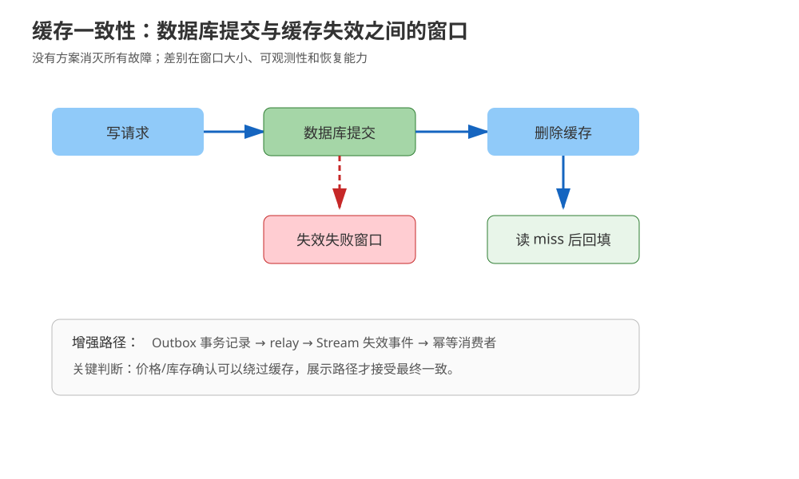
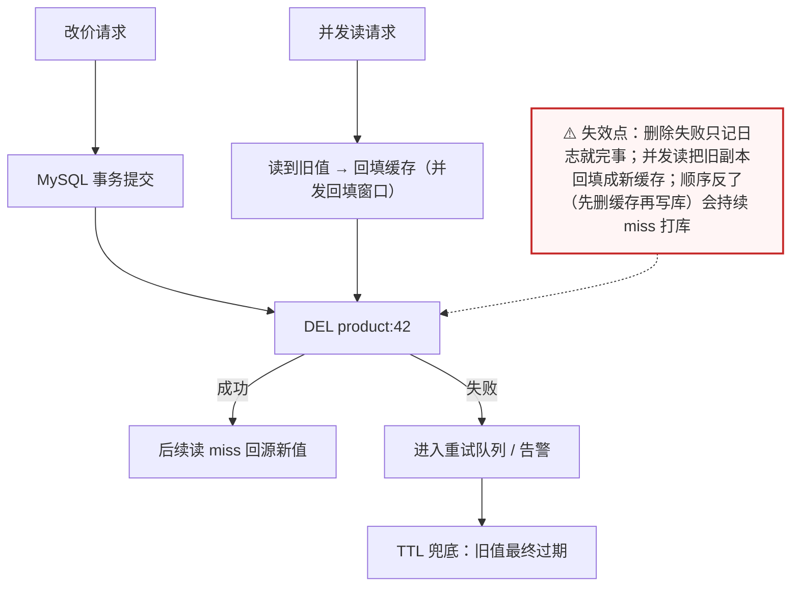
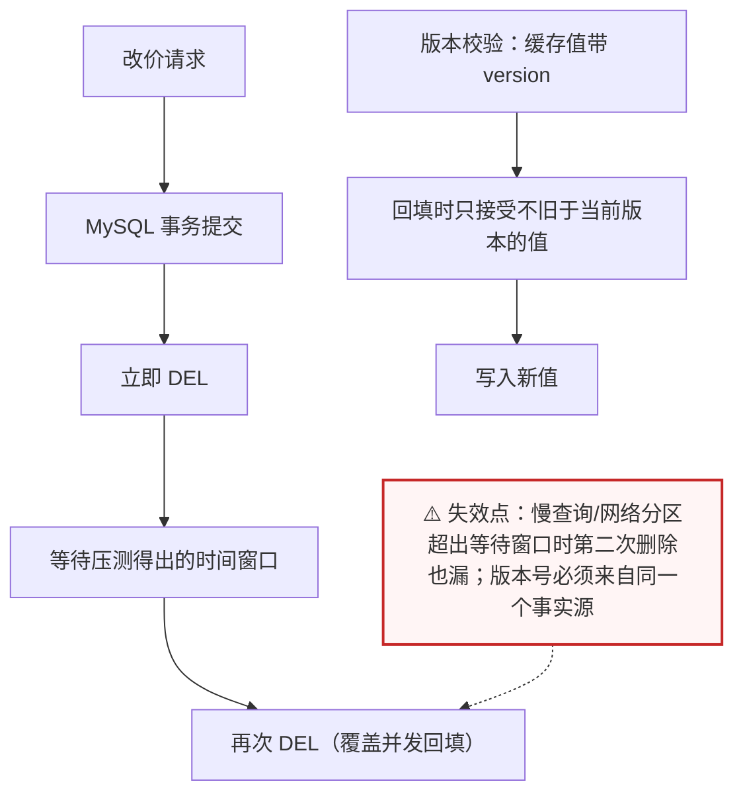
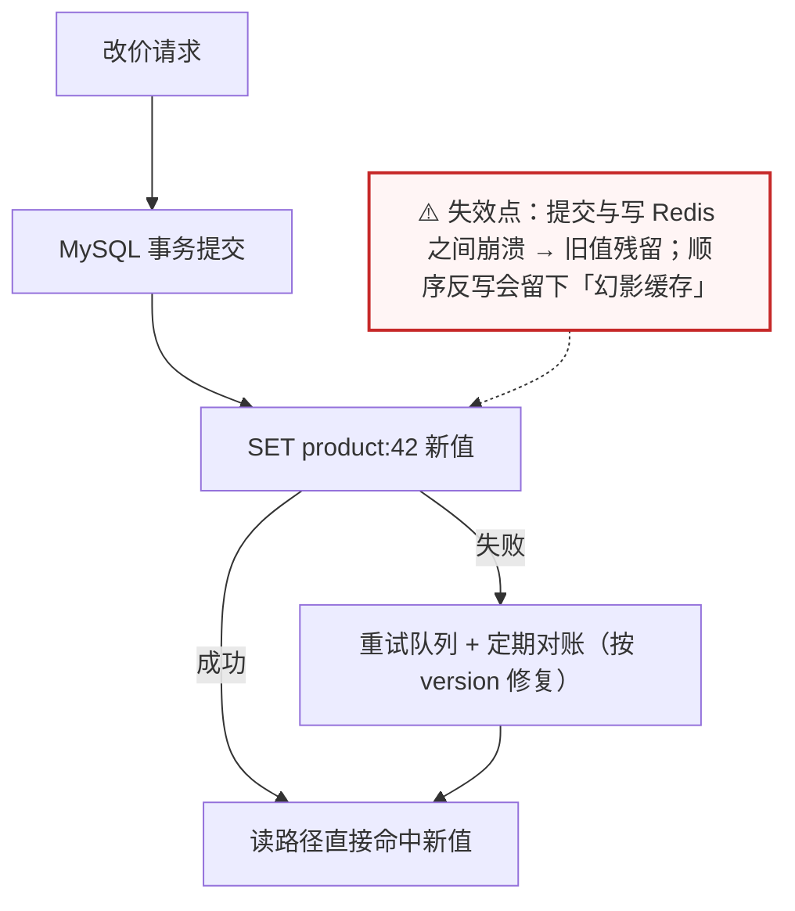
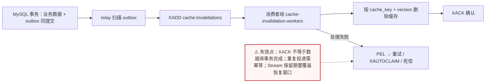
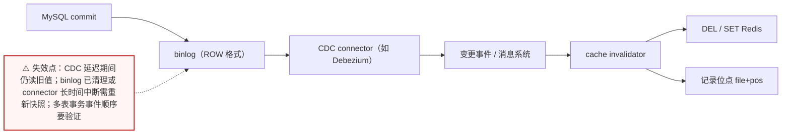
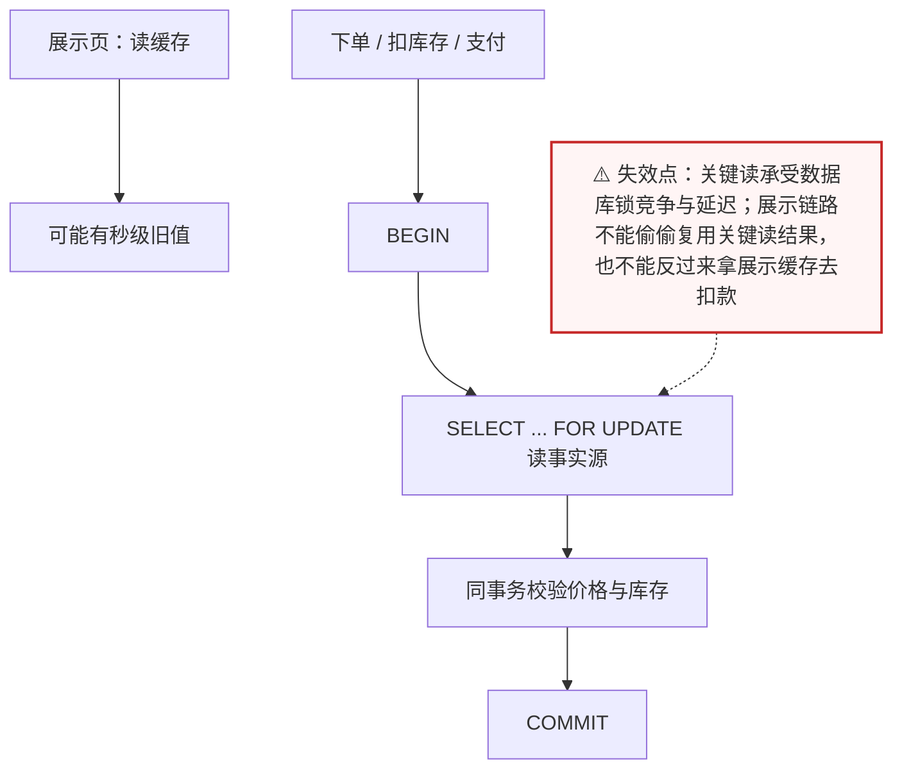

# 场景 07：MySQL ↔ Redis 双写一致性，商品价格变了怎么办

| 项目 | 内容 |
|---|---|
| 类型 | 经典设计题 |
| 场景 | 商品详情读 QPS 2,000，价格每天更新数千次；用户不能长时间看到旧价，数据库仍是事实源 |
| 目标 | 明确一致性窗口、失效顺序、失败恢复和哪些接口根本不能读缓存 |
| 先看 | [08-实战经验 · 故障模式 5：缓存与数据库长期不一致](../08-实战经验.md#故障模式-5缓存与数据库长期不一致) |
| 崩了怎么办 | [09-排障速查手册 · 症状 5：缓存与数据库不一致](../09-排障速查手册.md) |

## 场景描述

最常见的缓存旁路是“先更新数据库，再删除缓存”。它简单、吞吐高，却不是强一致：删除失败会留下旧值，并发读写也可能把旧值重新写回缓存。价格展示、库存校验、优惠资格和支付金额的容忍度不同，不能用一套缓存策略覆盖全部接口。



> 读图：重点看“数据库提交”和“缓存失效/更新”之间的故障窗口。

## 🔒 先自己想 30 秒

先把一致性写成可验收的指标，再回答：

1. 如果数据库已经提交但 Redis 删除失败，会发生什么？旧值会存活多久？TTL 能不能兜底？
2. 如果删除后有并发读请求把**旧数据库副本**重新写回缓存，又会发生什么？
3. 这个接口能容忍多久的旧值？展示页和下单价的容忍度一样吗？
4. 发生故障后能不能从事件或版本号恢复？还是只能等 TTL 自然过期？

<details>
<summary>💡 提示（卡住了再看）</summary>

- 一致性不是“有/无”，要写成最大旧值时长、读己之写和故障恢复要求。
- 失效通常比双写更容易收敛；缓存值可以带版本号，避免旧版本覆盖新版本。
- Outbox 解决数据库更新与“产生失效事件”之间的原子性缺口，但仍需消费者重试与幂等。
- 对价格、库存、支付金额等关键判断，直接读事实源可能比复杂缓存更可靠。

</details>

<details>
<summary>📖 展开解法（先想完再看）</summary>

> 代码约定：以下片段中 `redis_client` 为已连接的 Redis 客户端，`db_update_product` / `mysql_update_product` / `enqueue_cache_invalidation_retry` / `enqueue_cache_repair` / `schedule_after` / `write_only_if_version_at_least` / `record_invalidation_offset` 与 `event` 为业务侧占位实现，文中不再重复定义，照抄时需自备。

## MySQL ↔ Redis 双写总原则

| 原则 | 含义 |
|---|---|
| MySQL 是事实源 | 业务写入先落 MySQL 事务；Redis 是缓存副本，不把 Redis 成功当成订单/价格已提交 |
| 两次写不是一个事务 | MySQL 与 Redis 没有天然共享的 ACID 提交点；所谓“双写一致”必须依靠失效、重试、Outbox、CDC、版本号和对账收敛 |
| 失效通常优先于直接更新 | 删除 key 能避免遗漏字段和序列化差异；直接更新减少回源，但失败恢复要求更高 |
| 关键判断绕过缓存 | 下单价格、库存、支付金额从 MySQL 事实源确认；缓存只服务展示和可接受最终一致的读 |

因此，“双写”不是一个固定方案，而是一组故障处理策略：先决定一致性窗口，再决定是删缓存、更新缓存、发失效事件还是直接不读缓存。

## 解法一览

| 解法 | 核心动作 | 效果（旧值窗口 / 可恢复性） | 适合 | 主要代价 |
|---|---|---|---|---|
| A. 更新库后删缓存 | 数据库提交后删除缓存，读 miss 再回填 | 旧值窗口 = 删除前瞬间；删除失败则靠 TTL 兜底 | 普通详情、可接受最终一致 | 删除失败与并发回填窗口 |
| B. 延迟双删 / 版本校验 | 删除后等待再删，或只接受不旧于当前版本的写入 | 覆盖并发回填导致的旧值；慢查询超窗口时仍失效 | 旧值窗口需要更小 | 时间参数、并发竞态和实现复杂度 |
| C. 应用层双写 | MySQL 提交后更新 Redis，失败进入重试/对账 | 读路径少一次回源；失败靠重试队列 + 定期对账恢复 | 能接受补偿窗口、希望读路径少一次回源 | 两套系统无法共享一个事务 |
| D. Outbox + 失效事件流 | MySQL 事务写业务数据和 outbox，relay 发布失效事件 | 可重放、可追踪；旧值窗口 = 链路延迟 | 需要可追踪、可重放恢复 | 多一条事件链，仍需幂等 |
| E. Binlog / CDC | 从 MySQL binlog 捕获变更，异步失效或更新 Redis | 写入口再多也能统一捕获；窗口 = CDC 延迟 | 写入口多、想统一捕获数据库变化 | CDC 延迟、位点、补数与运维成本 |
| F. 关键读绕过缓存 | 价格/库存决策直接查事实源，缓存只做展示加速 | 关键判断零旧值窗口 | 强一致判断 | 牺牲一部分延迟与吞吐 |

## 展开解法

### 解法 A：更新数据库后删除缓存

**思路。** 业务数据只写数据库；事务提交成功后删除对应 cache key。读请求 miss 时从数据库读取并回填。删除动作失败必须进入重试队列或告警，不能只记录日志。这个方案把一致性目标定义为“通常很快收敛”，而不是强一致。



> 读图：主干是“提交 → 删除”，两条旁路是失败重试与并发回填——这个解法的旧值窗口就藏在右下的并发回填箭头里。

```python
def update_product(product_id, patch, redis_client):
    product = db_update_product(product_id, patch)  # 提交数据库事务
    try:
        redis_client.delete(f"product:{product_id}")
    except Exception as exc:
        enqueue_cache_invalidation_retry(product_id, reason=str(exc))
    return product
```

| 维度 | 判断 |
|---|---|
| 代价 | 删除失败会留旧值；并发回填可能出现短暂旧值覆盖 |
| 边界 | 不能用于以缓存值直接决定扣款、扣库存或放行资格的流程；需要 TTL 作为最终兜底 |
| 课程挂钩 | [课 8《缓存设计》](../stages/4-分布式与生产实践/lessons/lesson-08-缓存设计.md)：缓存旁路、失效、回源与一致性窗口 |
| 来源 | [Redis Cache-Aside pattern](https://redis.io/docs/latest/develop/use-cases/cache-aside/)、[Redis SET](https://redis.io/docs/latest/commands/set/) |

### 解法 B：延迟双删或版本校验

**思路。** 一种工程折中是“写库 → 立即删 → 等待一个经过压测的时间 → 再删一次”，用第二次删除覆盖部分并发回填窗口；它不是严格保证。更稳妥的增强是给缓存值带数据库版本号，回填时只允许不旧于已知版本的值写入。



> 读图：上面那条“删—等—再删”是时间换正确性的折中，下面那条“版本校验”才是可解释的收敛手段；两者不是一回事，别把双删口号当证明。

```python
def update_with_delayed_delete(product_id, patch, redis_client):
    product = db_update_product(product_id, patch)
    redis_client.delete(f"product:{product_id}")
    schedule_after(0.2, redis_client.delete, f"product:{product_id}")
    return product

def cache_if_newer(redis_client, key, value, version):
    # 示例占位：生产实现用 Lua/事务保证“比较版本 + 写入”不可被打断
    return write_only_if_version_at_least(redis_client, key, value, version)
```

| 维度 | 判断 |
|---|---|
| 代价 | 延迟参数与并发模型强相关；调度任务、版本比较和失败重试增加复杂度 |
| 边界 | 双删不能覆盖任意长的慢查询、网络分区或多写入口；版本号必须来自同一个事实源 |
| 课程挂钩 | [课 8《缓存设计》](../stages/4-分布式与生产实践/lessons/lesson-08-缓存设计.md)：一致性、击穿与回源；[课 7《分片与集群》](../stages/4-分布式与生产实践/lessons/lesson-07-分片与集群.md)：Lua 原子比较写入 |
| 来源 | [Redis Cache-Aside pattern](https://redis.io/docs/latest/develop/use-cases/cache-aside/)、[Redis programmability](https://redis.io/docs/latest/develop/programmability/)；延迟双删时间不由 Redis 官方保证，必须由本系统压测确定 |

### 解法 C：MySQL 提交后应用层双写 Redis

**思路。** MySQL 事务提交成功后，由应用再把同一份数据写入 Redis；Redis 写失败进入重试队列，并由定期对账任务用 MySQL 版本号修复。顺序必须是“先提交 MySQL、后写 Redis”，不能把 Redis 成功误当成 MySQL 已提交。这个方案比“更新库后删缓存”减少一次回源，但它仍然是两个独立系统的双写，不是分布式事务。



> 读图：注意写入顺序被写死为“事务 → SET”，且失败分支必须落到可重放的重试队列——没有这条补救链，双写就只是把风险藏起来。

```python
def update_product_with_dual_write(product_id, patch, redis_client):
    product = mysql_update_product(product_id, patch)  # MySQL 事务已提交
    try:
        redis_client.set(
            f"product:{product_id}",
            encode(product),
            ex=300,
        )
    except Exception as exc:
        enqueue_cache_repair(product_id, version=product["version"], reason=str(exc))
    return product
```

| 维度 | 判断 |
|---|---|
| 代价 | MySQL 提交与 Redis 写入之间存在失败窗口；需要重试、版本比较、定期对账和监控 |
| 边界 | 不适合要求跨 MySQL 与 Redis 强原子的场景；禁止先写 Redis 再提交 MySQL，否则回滚会留下“幻影缓存” |
| 课程挂钩 | [课 8《缓存设计》](../stages/4-分布式与生产实践/lessons/lesson-08-缓存设计.md)：缓存更新与一致性窗口；[课 9《生产实践与选型》](../stages/4-分布式与生产实践/lessons/lesson-09-生产实践与选型.md)：故障补偿与对账 |
| 来源 | [MySQL COMMIT](https://dev.mysql.com/doc/refman/8.4/en/commit.html)、[Redis SET](https://redis.io/docs/latest/commands/set/)、[Redis Cache-Aside pattern](https://redis.io/docs/latest/develop/use-cases/cache-aside/) |

### 解法 D：MySQL Outbox + Redis 失效事件流

**思路。** 在同一个数据库事务中提交业务数据和 outbox 记录；relay 持续把 outbox 发布到 Redis Stream，失效消费者按 key 删除缓存并记录版本。数据库提交与“事件待发送”因此不会只靠两个独立网络调用连接。relay 和消费者都要可重试、幂等，Stream 也要有保留与积压监控。



> 读图：原子性只在最左边那个 MySQL 事务里；之后每一跳（relay、Stream、消费者）都要自己保证可重试与幂等。

```sql
BEGIN;
UPDATE product SET price = :price, version = version + 1 WHERE id = :id;
INSERT INTO cache_invalidation_outbox(event_id, cache_key, version)
VALUES (:event_id, :cache_key, :new_version);
COMMIT;
```

```bash
# relay 从 outbox 发布；消费者组负责处理与确认
redis-cli XADD cache:invalidations MAXLEN ~ 100000 '*' \
  event_id evt-1 cache_key product:42 version 18
redis-cli XGROUP CREATE cache:invalidations cache-invalidation-workers 0-0 MKSTREAM
redis-cli XREADGROUP GROUP cache-invalidation-workers worker-1 COUNT 20 BLOCK 2000 STREAMS cache:invalidations '>'
redis-cli XACK cache:invalidations cache-invalidation-workers 1710000000000-0
```

| 维度 | 判断 |
|---|---|
| 代价 | 引入 outbox、relay、消费者组、pending 与重放运维；缓存失效延迟变成可观测指标 |
| 边界 | 不能把 XACK 当成数据库事务已完成；消费者删除缓存要幂等，outbox 和 Stream 保留期要覆盖恢复窗口 |
| 课程挂钩 | [课 5《Stream 与 Pub/Sub》](../stages/2-数据结构与命令/lessons/lesson-05-Stream与PubSub.md)：Stream、消费者组、确认与重试；[课 8《缓存设计》](../stages/4-分布式与生产实践/lessons/lesson-08-缓存设计.md)：缓存失效 |
| 来源 | [Redis Streams](https://redis.io/docs/latest/develop/data-types/streams/)、[XREADGROUP](https://redis.io/docs/latest/commands/xreadgroup/)、[XACK](https://redis.io/docs/latest/commands/xack/) |

### 解法 E：MySQL Binlog / CDC 驱动失效或更新

**思路。** 不要求每个业务写入口都显式维护 Redis，而是从 MySQL binlog 捕获行变更，经过 CDC connector 和消息系统送到缓存失效服务，再按表、主键和版本删除或更新 Redis。Debezium 的 MySQL connector 读取 binlog 并产生行级变更事件；它不是“自动保证缓存一致”的开关，仍需处理位点、重复、顺序、快照、binlog 保留和消费者积压。



> 读图：起点是数据库的 binlog，不是业务代码——这让它天然覆盖所有写入口，代价是链路变长、位点与补数要自己管。

```text
MySQL commit → binlog（ROW）→ CDC connector → 变更事件 → cache invalidator → DEL / SET Redis
```

```python
def handle_mysql_change(event, redis_client):
    if event["table"] != "product":
        return
    key = f"product:{event['after']['id']}"
    # 失效通常比异步写完整对象更容易避免字段遗漏
    redis_client.delete(key)
    record_invalidation_offset(event["source"]["file"], event["source"]["pos"])
```

| 维度 | 判断 |
|---|---|
| 代价 | 需要开启并保留 binlog、管理 connector/消息系统、监控位点与延迟；首次快照和断点恢复要演练 |
| 边界 | CDC 延迟期间仍可能读到旧值；binlog 已清理或 connector 长时间中断时要有重新快照/对账方案；多表事务的事件顺序必须验证 |
| 课程挂钩 | [课 5《Stream 与 Pub/Sub》](../stages/2-数据结构与命令/lessons/lesson-05-Stream与PubSub.md)：事件流与消费；[课 8《缓存设计》](../stages/4-分布式与生产实践/lessons/lesson-08-缓存设计.md)：失效与回源；[课 9《生产实践与选型》](../stages/4-分布式与生产实践/lessons/lesson-09-生产实践与选型.md)：生产链路与替代系统 |
| 来源 | [MySQL replication formats](https://dev.mysql.com/doc/refman/8.4/en/replication-formats.html)、[Debezium MySQL connector](https://debezium.io/documentation/reference/stable/connectors/mysql.html)、[Redis Streams](https://redis.io/docs/latest/develop/data-types/streams/) |

### 解法 F：关键读绕过缓存

**思路。** 价格展示可以读缓存，但下单确认价格、库存扣减和支付金额直接读取事实源，或在同一个数据库事务内完成校验。Redis 仍可以服务非关键展示路径，却不承担最终判断。这是降低系统复杂度的设计解法，不是“Redis 用得不够多”。



> 读图：上面一条走缓存（快、可旧），下面一条走事务（慢、准确）——两条路刻意分开，是这套设计最省心的部分。

```sql
BEGIN;
SELECT price, available
FROM sku_inventory
WHERE sku_id = :sku_id
FOR UPDATE;
-- 在同一事务中校验价格/库存并写订单
COMMIT;
```

| 维度 | 判断 |
|---|---|
| 代价 | 关键读承受数据库延迟和锁竞争；需要连接池、索引和事务压测 |
| 边界 | 数据库本身无法承载峰值时要配合队列、限流或分片；不能让展示链路偷偷复用关键读结果 |
| 课程挂钩 | [课 1《Redis 是什么》](../stages/1-为什么需要Redis/lessons/lesson-01-Redis是什么.md)：缓存与事实源边界；[课 9《生产实践与选型》](../stages/4-分布式与生产实践/lessons/lesson-09-生产实践与选型.md)：生产选型 |
| 来源 | [PostgreSQL explicit locking](https://www.postgresql.org/docs/current/explicit-locking.html)（若使用 PostgreSQL）；数据库锁语义以实际数据库官方文档为准 |

## 推荐路径：先定义一致性，再选择失效链

1. 把接口分成展示、资格判断、下单确认三类，分别写最大旧值时长。
2. 普通详情从 A 开始，删除失败入重试并以 TTL 兜底。
3. 仍有可观测的旧值窗口，再评估 B；不要把双删口号当成证明。
4. 只有在能接受补偿窗口且希望减少回源时才选 C；写入口多、需要统一捕获时评估 D 或 E。
5. 价格确认、库存扣减和支付金额等关键判断直接采用 F。

## 非 Redis 替代路线

| 替代路线 | 适合什么情况 | 与 Redis 解法的关键差异 | 代价 / 注意 |
|---|---|---|---|
| 数据库物化视图 / 只读副本 | 读模型稳定、可以接受秒级延迟 | 不需要维护失效链，一致性由数据库承担 | 刷新有延迟；写库压力要评估 |
| CDC 直接驱动本地缓存失效 | 实例数少、热点集中 | 不引入集中式缓存 | 广播与版本管理要自己做 |
| 完全不缓存关键实体 | 关键实体 QPS 不高或变化频繁 | 零一致性问题 | 数据库要扛住读峰值 |
| API 网关 / CDN 缓存版本化静态响应 | 响应可版本化、可按 URL 失效 | 失效粒度是 URL 而非 key | 个性化片段要单独加载 |

## 做错会踩的坑

- 先删缓存再写数据库，写失败后缓存 miss 反复打数据库。
- 业务有多个写入口，却只在其中一个入口删除缓存。
- 把延迟双删写成“强一致方案”，没有测慢查询、并发回填和网络故障。
- Outbox 没有唯一 event ID，重复投递时消费者无法幂等。
- 下单时读取商品详情缓存，把展示数据当成扣款或库存事实。

</details>
