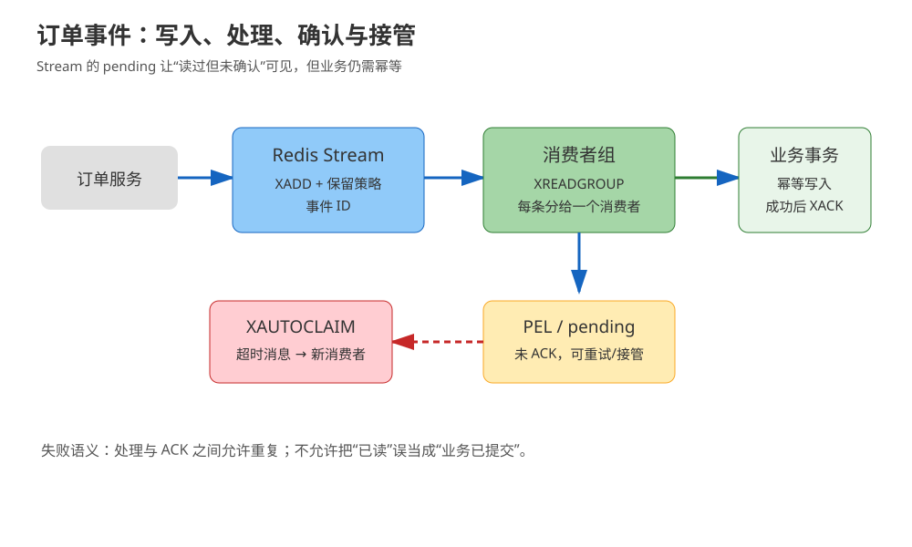
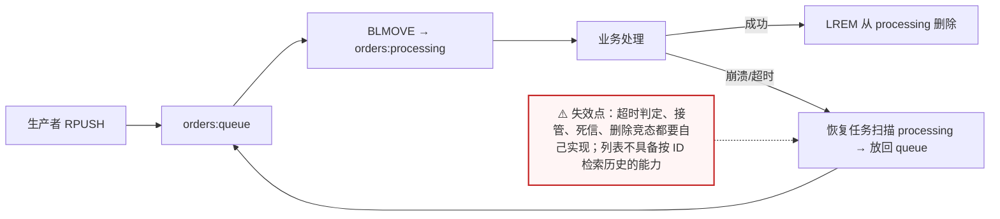
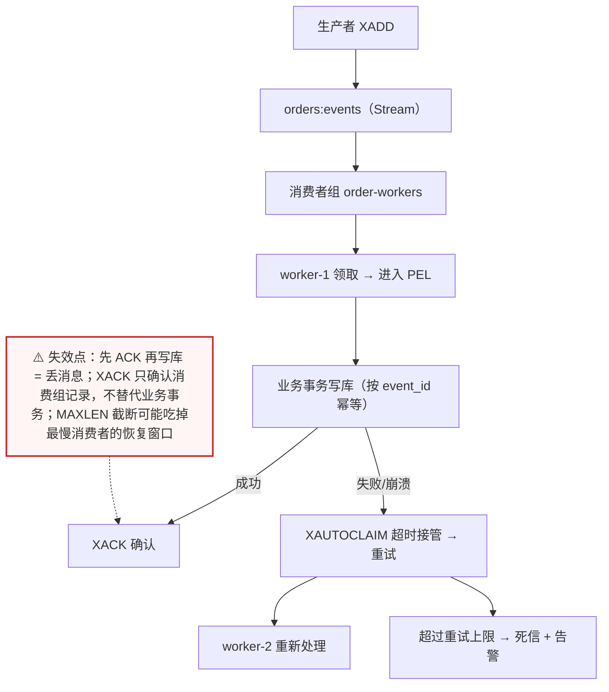
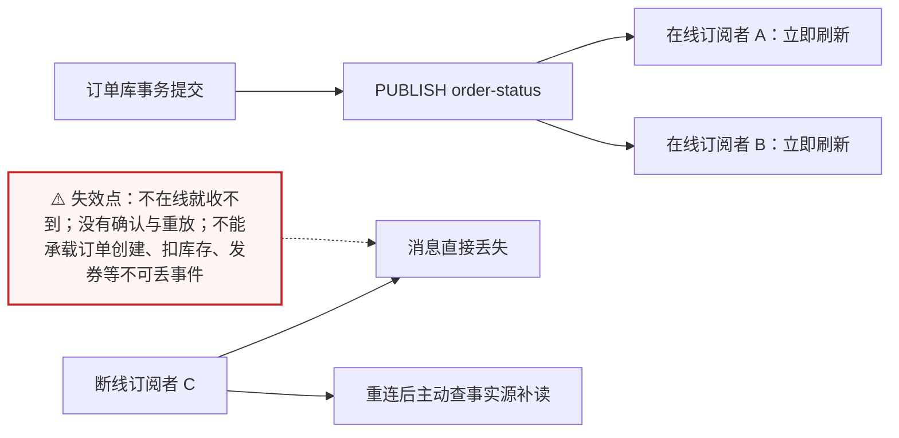
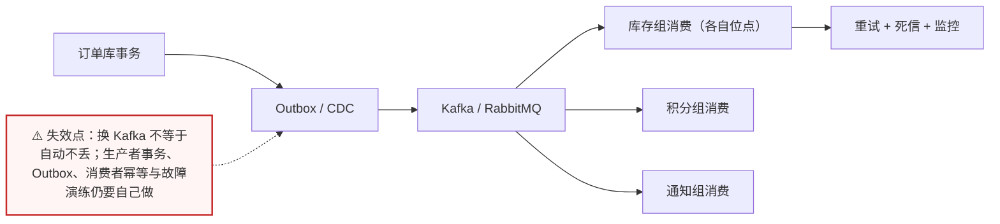

# 场景 08：订单事件不能丢，Redis 消息怎么选

| 项目 | 内容 |
|---|---|
| 类型 | 经典设计题 |
| 场景 | 订单创建后要通知库存、积分和物流；消费者会重启，事件需要重试、追踪积压，不能只靠在线连接接收 |
| 目标 | 根据“是否需要历史、确认、重试、广播还是竞争消费”选择 List、Streams、Pub/Sub 或外部消息系统 |
| 先看 | [08-实战经验 · 什么时候不该用 Redis](../08-实战经验.md#什么时候不该用-redis) |
| 崩了怎么办 | [09-排障速查手册 · 症状倒查索引](../09-排障速查手册.md)（先确认是消息积压还是消费失败） |

## 场景描述

Redis 里有三个看起来都像“消息”的结构：List、Streams、Pub/Sub。它们的失败语义完全不同。Pub/Sub 适合在线通知，订阅者断线期间不会等着一条历史消息；订单事件要能确认、重试和接管，就需要持久化的队列语义和幂等消费者。



> 读图：区分“消息已经写入”“消费者已经处理”“业务事务已经提交”三个时刻。

## 🔒 先自己想 30 秒

按失败场景逐个回答：

1. 消费者处理到一半崩溃时，消息在哪里？是回到队列、留在处理中列表，还是彻底消失？
2. 多个消费者是每人都收到一份（广播），还是一条消息只给一个消费者（竞争消费）？
3. 发布者和订阅者不在线时，消息要不要保留？保留多久由谁决定？
4. 重复处理会不会重复扣库存或发券？你的幂等键是什么？

<details>
<summary>💡 提示（卡住了再看）</summary>

- List 可以做简单队列，但确认、处理中状态和接管要自己约定。
- Streams 消费者组有 pending entries list，可确认、重试和把空闲消息交给其他消费者。
- Pub/Sub 没有历史重放与消费确认，不适合作为不可丢订单事件的唯一承载。
- 无论选哪种，业务消费者都要以事件 ID/订单 ID 做幂等。

</details>

<details>
<summary>📖 展开解法（先想完再看）</summary>

## 解法一览

| 解法 | 核心动作 | 效果（丢失风险 / 重放能力） | 适合 | 主要代价 |
|---|---|---|---|---|
| A. List + 处理中队列 | 阻塞取出，先移入 processing，成功后确认删除 | 有处理中列表兜底；重放需自己保留历史 | 简单单消费者/轻量任务 | ACK、接管、死信要自行实现 |
| B. Streams 消费者组 | `XREADGROUP` 领取，`XACK` 确认，`XAUTOCLAIM` 接管 | PEL 保留未确认消息；可按 ID 重放历史 | 需要重试、积压和多消费者 | PEL、保留、幂等和监控复杂 |
| C. Pub/Sub | 订阅者在线时即时广播通知 | 断线即丢，无重放 | WebSocket 刷新、缓存失效提示 | 断线丢消息，无确认与重放 |
| D. Kafka / RabbitMQ 等外部系统 | 把可靠消息交给专用消息平台 | 长期保留、成熟死信与重放 | 长期保留、跨团队、多租户消息 | 额外运维、网络与成本 |

## 展开解法

### 解法 A：List + 处理中队列

**思路。** 生产者 `RPUSH queue payload`；消费者用 `BLMOVE queue processing RIGHT LEFT 0` 把消息原子地从待处理队列移入处理中队列，业务成功后从 processing 删除。消费者崩溃时，运维或恢复任务扫描 processing，把超时消息重新放回 queue。Redis 不会替你定义“处理超时”或“确认格式”，要在 payload 中带唯一 ID 和时间。



> 读图：`BLMOVE` 那一步是关键——原子地把消息从“待处理”挪到“处理中”，崩溃后消息不会凭空消失，但谁来把它挪回去是你自己的责任。

```bash
redis-cli RPUSH orders:queue '{"event_id":"evt-1","order_id":"o-1"}'
redis-cli BLMOVE orders:queue orders:processing RIGHT LEFT 0
# 业务成功后按完整 payload 或唯一 ID 删除；生产实现需避免误删重复消息
redis-cli LREM orders:processing 1 '{"event_id":"evt-1","order_id":"o-1"}'
```

| 维度 | 判断 |
|---|---|
| 代价 | 处理中列表、超时接管、死信、重复投递和删除竞态都要自己实现；列表历史检索弱 |
| 边界 | 不适合需要多个独立消费组、长期重放或精细 pending 观测的事件流 |
| 课程挂钩 | [课 3《List 与 Hash》](../stages/2-数据结构与命令/lessons/lesson-03-List与Hash.md)：阻塞队列、List 移动与可靠队列改造 |
| 来源 | [Redis Lists](https://redis.io/docs/latest/develop/data-types/lists/)、[BLMOVE](https://redis.io/docs/latest/commands/blmove/)、[LREM](https://redis.io/docs/latest/commands/lrem/) |

### 解法 B：Streams 消费者组

**思路。** 生产者用 `XADD` 写入 Stream；同一个消费者组内，一条消息分给一个消费者；读取后进入 pending，业务事务成功后 `XACK`。消费者崩溃或长时间未确认时，其他消费者用 `XAUTOCLAIM` 接管。处理成功与 ACK 之间仍可能重复，因此订单、积分和库存写入必须幂等。



> 读图：`XACK` 出现在“业务事务写库成功”之后，顺序不能颠倒；右下角 PEL → 接管 → 死信是这套机制真正值钱的地方。

```bash
redis-cli XADD orders:events MAXLEN ~ 100000 '*' \
  event_id evt-1 order_id o-1 type order.created
redis-cli XGROUP CREATE orders:events order-workers 0-0 MKSTREAM
redis-cli XREADGROUP GROUP order-workers worker-1 COUNT 20 BLOCK 2000 STREAMS orders:events '>'
# 业务提交成功后确认
redis-cli XACK orders:events order-workers 1710000000000-0
# 接管空闲超过 60 秒的消息
redis-cli XAUTOCLAIM orders:events order-workers worker-2 60000 0-0 COUNT 20
```

| 维度 | 判断 |
|---|---|
| 代价 | 需要监控 pending 数、最老 pending 年龄、Stream 长度、重试次数和死信；保留策略会影响重放窗口 |
| 边界 | 不是自动恰好一次；`XACK` 只确认消费组记录，不替代业务数据库事务；同一 Stream 的多组仍需各自治理 |
| 课程挂钩 | [课 5《Stream 与 Pub/Sub》](../stages/2-数据结构与命令/lessons/lesson-05-Stream与PubSub.md)：Stream、消费者组、PEL、`XACK`、`XAUTOCLAIM` |
| 来源 | [Redis Streams](https://redis.io/docs/latest/develop/data-types/streams/)、[XREADGROUP](https://redis.io/docs/latest/commands/xreadgroup/)、[XACK](https://redis.io/docs/latest/commands/xack/)、[XAUTOCLAIM](https://redis.io/docs/latest/commands/xautoclaim/) |

### 解法 C：Pub/Sub 做在线通知

**思路。** 订单状态已经写入事实库后，用 Pub/Sub 通知在线页面刷新，或通知本来就会从事实源重新读取的短生命周期订阅者。发布前后的状态都不应依赖这条通知保存；订阅者断线后重新连接时，应主动从事实源查询当前状态。



> 读图：发布是“扇出给所有当前在线的人”，右下角那条断线分支没有补救——所以这条路径只能做提示，不能做事实。

```bash
# 终端 1：在线订阅
redis-cli SUBSCRIBE order-status
# 终端 2：发布刷新提示，不把完整订单事实当成唯一消息
redis-cli PUBLISH order-status '{"order_id":"o-1","version":18}'
```

| 维度 | 判断 |
|---|---|
| 代价 | 断线期间的通知丢失；广播给所有订阅者，消费者负载随订阅数增长 |
| 边界 | 不适合订单创建、扣库存、发券等不可丢事件；不能用“客户端通常在线”推导可靠性 |
| 课程挂钩 | [课 5《Stream 与 Pub/Sub》](../stages/2-数据结构与命令/lessons/lesson-05-Stream与PubSub.md)：Pub/Sub 的在线广播与丢失边界 |
| 来源 | [Redis Pub/Sub](https://redis.io/docs/latest/develop/pubsub/)、[PUBLISH](https://redis.io/docs/latest/commands/publish/) |

### 解法 D：Kafka / RabbitMQ 等专用消息系统

**思路。** 当事件需要较长保留、多个团队独立消费、跨地域复制、吞吐隔离或成熟的死信与监控时，使用专用消息平台。Redis 可以继续做缓存、幂等键或短期状态，但不承担消息平台的全部责任。



> 读图：三个消费组各有自己的位点，这正是 Redis Stream 也能做但“治理成本更高”的部分；左边 Outbox 的存在说明可靠性起始于数据库事务，而不是消息系统本身。

```text
订单库事务 → Outbox/CDC → 专用消息系统 → 库存组 / 积分组 / 通知组
                                  ├─ 重试与死信
                                  └─ 消费者按 event_id 幂等
```

| 维度 | 判断 |
|---|---|
| 代价 | 引入额外集群、客户端、监控和网络链路；需要团队掌握分区/路由、保留和消费位点 |
| 边界 | 不是“换 Kafka 就自动不丢”；生产者事务、Outbox、消费者幂等与故障演练仍然需要 |
| 课程挂钩 | [课 1《Redis 是什么》](../stages/1-为什么需要Redis/lessons/lesson-01-Redis是什么.md)：Redis 的适用边界；[课 9《生产实践与选型》](../stages/4-分布式与生产实践/lessons/lesson-09-生产实践与选型.md)：替代系统选型 |
| 来源 | [Apache Kafka documentation](https://kafka.apache.org/documentation/)；RabbitMQ 的确认、重试与死信以其官方文档和部署版本为准 |

## 推荐路径：先按失败语义选结构

1. 只是在线刷新提示，选 C，并让客户端重连后从事实源补读。
2. 单一轻量任务、可接受自建处理中队列时选 A；先写清接管和死信规则。
3. 需要确认、重试、消费者组和积压观测时选 B；以幂等数据库写为最终安全网。
4. 需要长期保留、多个团队和复杂消费治理时采用 D；Redis 只保留它擅长的状态。

## 非 Redis 替代路线

| 替代路线 | 适合什么情况 | 与 Redis 解法的关键差异 | 代价 / 注意 |
|---|---|---|---|
| 数据库 Outbox + Kafka / RabbitMQ | 跨团队、长期保留、成熟死信 | 位点与重放由消息平台承担，Redis 不必当队列 | 多一套集群与运维；端到端延迟变长 |
| 数据库队列表 + `FOR UPDATE SKIP LOCKED` | 小系统、不想引入新组件 | 用数据库既当事实源又当队列 | 吞吐有限；轮询与锁竞争要调优 |
| 云厂商消息队列 / 事件总线 | 已在云上、接受供应商模型 | 免运维，监控与死信现成 | 成本、配额与供应商锁定要评估 |

## 做错会踩的坑

- 用 Pub/Sub 发布订单事实，消费者断线后没有任何补偿。
- Streams 读到消息后先 ACK，再写数据库，导致处理失败却无法重放。
- 认为 pending 存在就等于业务事务未完成，实际没有维护状态和幂等键。
- 通过固定 `MAXLEN` 截断 Stream，却没有确认它覆盖最慢消费者的恢复窗口。
- 生产者和消费者都没有唯一 event ID，重试时重复扣库存、发券或发通知。

</details>
