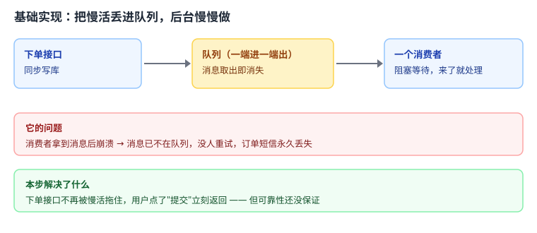
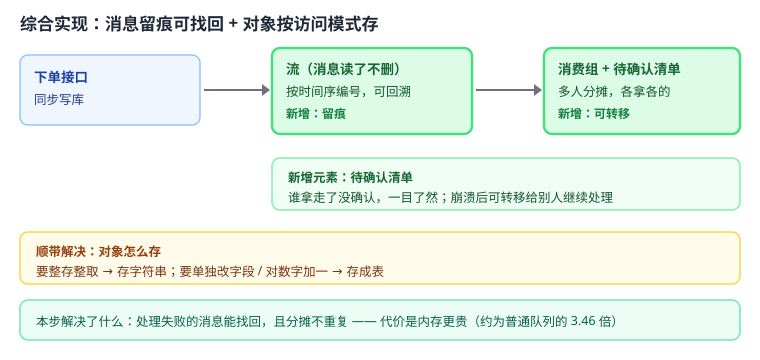

# 应用实战 03：异步任务与对象存储

> 对应：[课 3《List 与 Hash》](../stages/2-数据结构与命令/lessons/lesson-03-List与Hash.md)
> 回目录：[应用实战索引](./INDEX.md)
> 覆盖知识点：List 双向操作与阻塞弹出 / List 当消息队列的三个硬伤 / Hash 存对象 vs String 存 JSON

## 场景

用户下单后要发短信、加积分、通知仓库——这些慢活不能堵在下单接口里。把它们丢进队列后台处理，并决定"订单对象"到底怎么存。

## 全貌一句话

完整的生产方案还需要**消费者进程的优雅退出与并发控制**、**死信队列**、**监控告警**——这些超出本课范围，这里只做"队列 + 存储"这条主线。

---

## 第一步：基础实现 —— 两行命令搭一个队列


> 代码约定：以下片段中的 `r` 为已连接的 Redis 客户端，`db_query` / `db_update` 为数据库查询占位函数，均未重复定义，照抄时需自备。
最自然的想法：List 一端进、一端出，还自带阻塞等待，连轮询都省了。



> 读图指引：下单接口把任务推进队列，一个消费者阻塞等待、来了就处理。**关键点在中间那一格**——消息"取出即消失"，这是后面所有麻烦的根源。

```python
import redis, json, time

r = redis.Redis(host='127.0.0.1', port=6379, decode_responses=True)

def place_order(order_id: int):
    """下单：同步写库，慢活丢进队列"""
    # 1. 同步写数据库（真实业务里这里是事务）
    print(f"订单 {order_id} 已入库")

    # 2. 慢活推进队列，接口立刻返回
    r.lpush("orders", json.dumps({"order_id": order_id}))

def consume():
    """消费者：阻塞等待，来了就处理"""
    while True:
        # BRPOP 阻塞 5 秒；返回 (key, value) 或 None
        item = r.brpop("orders", timeout=5)
        if item is None:
            continue
        order = json.loads(item[1])
        send_sms(order["order_id"])   # 慢活：发短信

def send_sms(order_id: int):
    """慢活；真实实现中失败时 raise TaskError（下面只吞这类"可预期失败"）"""
    print(f"给订单 {order_id} 发短信")
```

**跑得起来吗**：能。测试环境飞快，下单接口从 3 秒降到几十毫秒。

### 它的问题

1. **消息取走就没了**：`BRPOP` 是弹出，消息一旦取出就从 List 消失。消费者处理到一半崩了，这条消息**没有任何办法找回**——开头那 300 多条没发出的短信就是这么丢的。
2. **不能多人分摊后再回溯**：`BRPOP` 保证同一条只给一个人，但也意味着"让三个人各处理一遍"做不到；历史消息取走即删，无法回看。
3. **对象存法没想清楚**：下面的 `send_sms` 只用到 `order_id`，但如果慢活需要"把积分 +10"，整存整取的 JSON 就得"读出整个订单 → 改一个字段 → 整块写回"，并发下还会互相覆盖。

---

## 第二步：综合实现 —— 让消息留痕，并按访问模式选存储

被上面三个问题逼出来的下一步：把普通队列换成**流**（消息读了不删、可确认、可转移），并按访问模式决定对象存法。



> 读图指引：比上一张多了两块绿色——**流**（消息留痕）与**待确认清单**（谁拿了没确认）。多出来的这块，正是"处理失败能找回"的实现方式。

```python
import redis, json, socket

r = redis.Redis(host='127.0.0.1', port=6379, decode_responses=True)
CONSUMER = socket.gethostname()      # 用主机名区分消费者，实际用进程号更好


class TaskError(Exception):
    """慢活执行失败：可预期的业务异常（区别于代码 bug，后者不应被吞掉）"""

# 建流与消费组（已存在时忽略报错）
try:
    r.xgroup_create("orders", "sms", id="0", mkstream=True)
except redis.exceptions.ResponseError as e:
    if "BUSYGROUP" not in str(e):
        raise

def place_order(order_id: int, user_id: int):
    """下单：同步写库 + 按访问模式存对象 + 慢活进流"""
    # 1. 订单对象：要单独改字段（状态/积分）→ 存成 Hash
    r.hset(f"order:{order_id}", mapping={
        "user_id": user_id, "status": "paid", "points": 0
    })
    r.expire(f"order:{order_id}", 7 * 86400)   # 一周后自动清理

    # 2. 慢活进流：消息留存，可被确认
    r.xadd("orders", {"order_id": order_id})

def consume():
    """消费者：拿消息 → 处理 → 确认"""
    while True:
        # '>' 表示只取还没分给别人的新消息
        resp = r.xreadgroup("sms", CONSUMER, {"orders": ">"}, count=1, block=5000)
        if not resp:
            continue
        msg_id, fields = resp[0][1][0]
        try:
            send_sms(int(fields["order_id"]))
        except (TaskError, redis.exceptions.RedisError, ValueError):
            # 只吞"可预期的失败"：业务异常、Redis 连接问题、字段解析失败
            continue        # 不确认 → 留在待确认清单，后续可被转移
        r.xack("orders", "sms", msg_id)     # 确认完成，移出待确认清单

def take_over_pending():
    """兜底：把别人卡住超过 60 秒的消息转给自己"""
    resp = r.xautoclaim("orders", "sms", CONSUMER, min_idle_time=60000, start_id="0-0")
    if resp and resp[1]:
        for msg_id, fields in resp[1]:
            try:
                send_sms(int(fields["order_id"]))
            except (TaskError, redis.exceptions.RedisError, ValueError):
                continue    # 转移过来仍失败：留在待确认清单，等下一轮
            r.xack("orders", "sms", msg_id)

def add_points(order_id: int, delta: int):
    """只改一个字段：Hash 的原子自增，不用整存整取"""
    return r.hincrby(f"order:{order_id}", "points", delta)
```

**为什么这么改**：

- `XADD` + `XREADGROUP` 让消息**读了不删**，处理失败就不 `XACK`，消息留在待确认清单里；
- `XAUTOCLAIM` 把别人卡住超过 60 秒的消息转给自己——崩溃不再等于丢失；
- 订单对象改用 Hash，加分用 `HINCRBY` **原子自增**，避免"读-改-写"的并发覆盖；
- 仍然给整个 key 设了 TTL，冷数据自动清理。

**代价要说清**：流比普通队列贵——同样 1 万条消息，内存约为 List 的 **3.46 倍**。这笔钱买的是"不丢"，如果你的慢活丢了也无妨（比如刷新本地缓存的通知），那就别付。

---

🎯 **会用标志**：能独立写出"下单后把慢活推进流、消费者确认处理、崩溃后可转移"的完整代码，并说清什么时候**不该**用流、以及订单对象为什么选 Hash 而不是 JSON 字符串。
