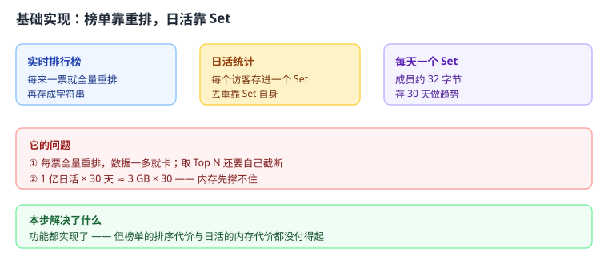
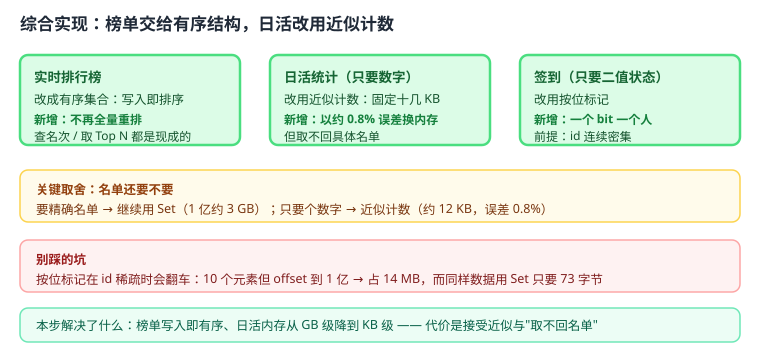

# 应用实战 04：排行榜与日活统计

> 对应：[课 4《Set、ZSet 与特殊类型》](../stages/2-数据结构与命令/lessons/lesson-04-Set、ZSet与特殊类型.md)
> 回目录：[应用实战索引](./INDEX.md)
> 覆盖知识点：Set 交并差与去重 / ZSet 跳表 + 哈希表双结构 / Bitmap、HyperLogLog、Geo

## 场景

运营要一个**实时更新的销量排行榜**，还要看**每天的独立访客数（DAU）**做趋势分析。数据量百万级。

## 全貌一句话

完整的生产方案还需要**榜单的分片与冷热分离**、**日活数据的离线归档**、**Geo 的边界查询优化**——这些超出本课范围，这里只做"排行 + 统计"这条主线。

---

## 第一步：基础实现 —— 榜单靠重排，日活靠 Set


> 代码约定：以下片段中的 `r` 为已连接的 Redis 客户端，`db_query` / `db_update` 为数据库查询占位函数，均未重复定义，照抄时需自备。
先按最直觉的写法来：榜单每次投票后整体重排一遍再存回字符串；日活用 Set，天然去重。



> 读图指引：左边榜单"每来一票就全量重排"，中间日活"每个访客存进 Set"，右边"每天一个 Set 存 30 天"。三块看着都合理，问题在下面那格。

```python
import redis, json

r = redis.Redis(host='127.0.0.1', port=6379, decode_responses=True)

def vote(item_id: str, delta: int = 1):
    """投票：把整个榜单取出来重排，再整块存回"""
    raw = r.get("leaderboard")
    board = json.loads(raw) if raw else {}
    board[item_id] = board.get(item_id, 0) + delta
    # 每次都要全量排序 + 全量写回
    ordered = dict(sorted(board.items(), key=lambda kv: kv[1], reverse=True))
    r.set("leaderboard", json.dumps(ordered))

def top_n(n: int = 10):
    raw = r.get("leaderboard")
    board = json.loads(raw) if raw else {}
    return list(board.items())[:n]

def record_visit(day: str, user_id: str):
    """日活：每个访客存进当天的 Set"""
    r.sadd(f"dau:{day}", user_id)

def dau_count(day: str) -> int:
    return r.scard(f"dau:{day}")
```

**跑得起来吗**：小数据量能跑，功能也都对。

### 它的问题

1. **榜单每次全量重排**：`vote` 要"取出整个榜单 → 排序 → 整块写回"。百万级数据下一次投票就是一次全量 JSON 编解码；更糟的是**并发下会互相覆盖**——两个请求同时读、各自加一、先后写回，结果只加了一次。
2. **日活内存撑不住**：Set 每成员约 32 字节，1 亿日活约 **3 GB**；存 30 天做趋势就是 90 GB，根本不现实。
3. **要"附近的人"这类功能时完全没辙**：重排出来的字符串结构不支持按位置查。

---

## 第二步：综合实现 —— 榜单交给有序结构，日活改用近似计数

被上面三个问题逼出来的下一步：榜单换成**有序集合**（写入即排序、原子自增），日活按"要不要名单"选结构。



> 读图指引：比上一张多了三块绿色——**有序集合**（写入即排序）、**近似计数**（十几 KB 换内存）、**按位标记**（一个 bit 一个人）。黄色那格是本步最关键的取舍：名单还要不要。

```python
import redis

r = redis.Redis(host='127.0.0.1', port=6379, decode_responses=True)

# ---------- 排行榜：改用有序集合 ----------
def vote(item_id: str, delta: int = 1):
    """投票：服务端原子自增，写入即有序，无需重排"""
    r.zincrby("leaderboard", delta, item_id)

def top_n(n: int = 10):
    """取前 N 名（降序，带分值）"""
    return r.zrevrange("leaderboard", 0, n - 1, withscores=True)

def rank_of(item_id: str):
    """查某个商品排第几（0 起，+1 才是真实名次）"""
    rank = r.zrevrank("leaderboard", item_id)
    return None if rank is None else rank + 1

# ---------- 日活：按"要不要名单"选结构 ----------
def record_visit_hll(day: str, user_id: str):
    """只要数字：近似计数，固定约 12 KB，标准误差约 0.81%"""
    r.pfadd(f"dau:{day}", user_id)

def dau_count_hll(day: str) -> int:
    return r.pfcount(f"dau:{day}")

def dau_count_multi(*days: str) -> int:
    """多天合并去重（PFCOUNT 支持多个 key）——注意算的是并集"""
    return r.pfcount(*[f"dau:{d}" for d in days])

def record_signin(day: str, user_offset: int):
    """签到：只要二值状态，用按位标记（前提：offset 连续密集）"""
    r.setbit(f"signin:{day}", user_offset, 1)

def signin_count(day: str) -> int:
    return r.bitcount(f"signin:{day}")
```

**为什么这么改**：

- `ZINCRBY` 在**服务端原子自增**，既不用全量重排，也不会并发覆盖；`ZREVRANGE` / `ZREVRANK` 直接返回排名，Top N 与"我排第几"都是现成的；
- 日活改用 `PFADD` / `PFCOUNT`，**1 亿用户也只要约 12 KB**；`PFCOUNT` 传多个 key 还能算跨天去重（并集）；
- 签到这类纯二值状态改用 `SETBIT` / `BITCOUNT`，一个 bit 一个人。

**代价要说清**：

- 近似计数**取不回名单**——你只知道"今天 1 亿人"，不知道"是哪 1 亿人"。要做用户分群、要精确名单，就得回到 Set 并接受那 3 GB。
- 按位标记**在 id 稀疏时会翻车**：10 个元素但 offset 到 1 亿，实测占 **14 MB**，而同样数据用 Set 只要 **73 字节**。用户 id 是随机字符串或稀疏大整数时，别用它。

---

🎯 **会用标志**：能独立写出"用有序集合做实时排行榜（含 Top N 与查名次）"，并在给定"只要数字 / 要精确名单 / 只要二值状态"三种需求时，选出对应结构并说清各自的内存代价与误差边界。
