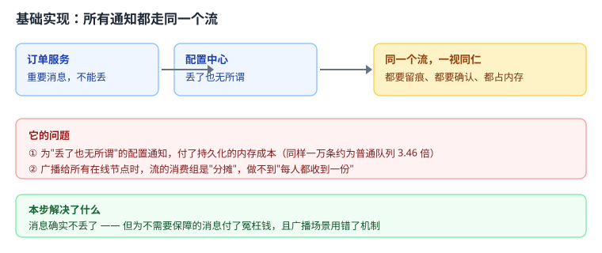
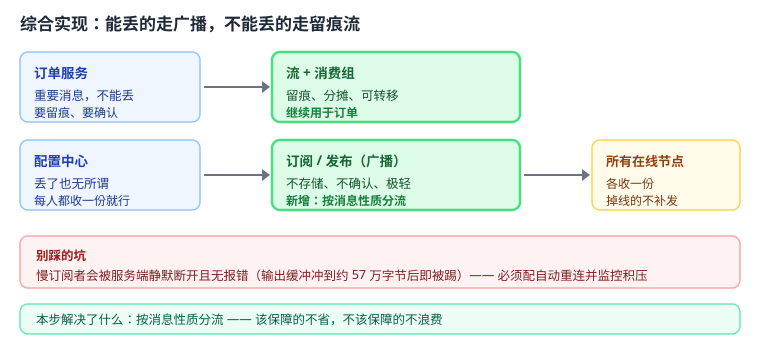

# 应用实战 05：可靠消息与广播

> 对应：[课 5《Stream 与 Pub/Sub》](../stages/2-数据结构与命令/lessons/lesson-05-Stream与PubSub.md)（阶段 2 补充课）
> 回目录：[应用实战索引](./INDEX.md)
> 覆盖知识点：Stream 基础读写 / 消费者组与 PEL / Pub/Sub 的边界

## 场景

两类消息混在一起处理：**订单消息**（丢了要赔钱）与**配置变更通知**（丢了无所谓））。用同一套机制处理它们，要么浪费、要么出错。

## 全貌一句话

完整的生产方案还需要**消费者进程的优雅退出**、**死信与重试上限**、**监控待确认清单长度**——这些超出本课范围，这里只做"按消息性质分流"这条主线。

---

## 第一步：基础实现 —— 所有通知都走同一个流


> 代码约定：以下片段中的 `r` 为已连接的 Redis 客户端，`db_query` / `db_update` 为数据库查询占位函数，均未重复定义，照抄时需自备。
既然流能留痕、能确认，那就把所有消息都写进去，一视同仁。



> 读图指引：订单服务和配置中心都往同一个流里写。看着"统一又可靠"，问题在下面那格——为不需要保障的消息付了保障的钱。

```python
import redis, json

r = redis.Redis(host='127.0.0.1', port=6379, decode_responses=True)

def publish_anything(stream: str, payload: dict):
    """所有消息一律写进流"""
    return r.xadd(stream, payload)

def consume_anything(stream: str, group: str, consumer: str):
    """所有消息一律走消费组：留痕 + 确认"""
    resp = r.xreadgroup(group, consumer, {stream: ">"}, count=10, block=5000)
    for _, messages in resp or []:
        for msg_id, fields in messages:
            handle(fields)
            r.xack(stream, group, msg_id)

def handle(fields: dict):
    print("处理：", fields)
```

**跑得起来吗**：能，而且消息确实不丢了。

### 它的问题

1. **为不需要保障的消息付了冤枉钱**：配置变更这种"丢了也无所谓"的通知，也被持久化下来。同样 1 万条消息，流的内存约为普通队列的 **3.46 倍**——这些钱花得毫无必要。
2. **广播场景用错了机制**：消费组的语义是**分摊**（同一条只给一个人），而"通知所有节点刷新缓存"要的是**每人都收到一份**。用消费组做广播，结果只有一个节点收到。
3. **待确认清单无限增长**：配置通知如果没人及时确认，待确认清单会一直堆积。

---

## 第二步：综合实现 —— 能丢的走广播，不能丢的走留痕流

被上面三个问题逼出来的下一步：**按消息性质分流**。



> 读图指引：比上一张多了一条**广播**支路——配置中心不再进流，改走订阅/发布，所有在线节点各收一份、不存储、不确认。订单仍走流，保留留痕与确认。

```python
import redis, json, threading

r = redis.Redis(host='127.0.0.1', port=6379, decode_responses=True)


class TaskError(Exception):
    """消息处理失败：可预期的业务异常（区别于代码 bug，后者不应被吞掉）"""
def publish_order(order_id: int):
    """订单消息：写进流，留痕待确认"""
    return r.xadd("orders", {"order_id": order_id})

def consume_orders(consumer: str):
    """消费组：分摊处理，确认后才移出待确认清单"""
    resp = r.xreadgroup("order-group", consumer, {"orders": ">"},
                        count=10, block=5000)
    for _, messages in resp or []:
        for msg_id, fields in messages:
            try:
                handle_order(fields)
            except (TaskError, redis.exceptions.RedisError):
                # 只吞"可预期的失败"：业务异常与 Redis 连接问题
                continue    # 不确认 → 留在待确认清单，后续可转移
            r.xack("orders", "order-group", msg_id)

def reclaim_stuck(consumer: str, idle_ms: int = 60000):
    """把别人卡住超过 idle_ms 的消息转给自己"""
    resp = r.xautoclaim("orders", "order-group", consumer,
                        min_idle_time=idle_ms, start_id="0-0")
    for msg_id, fields in resp[1] if resp else []:
        try:
            handle_order(fields)
        except (TaskError, redis.exceptions.RedisError):
            continue        # 转移过来仍失败：留在待确认清单，等下一轮
        r.xack("orders", "order-group", msg_id)

# ========== 二、丢了也无所谓：订阅 / 发布 ==========
def publish_config(key: str, value: str):
    """配置变更：广播出去，不存储、不确认"""
    return r.publish("config-changed", json.dumps({"key": key, "value": value}))

def watch_config(node_name: str):
    """每个节点各订阅一份：都会收到，掉线的不补发"""
    pubsub = r.pubsub()
    pubsub.subscribe("config-changed")
    for message in pubsub.listen():
        if message["type"] != "message":
            continue
        data = json.loads(message["data"])
        reload_local_cache(data["key"], data["value"])

def start_watcher(node_name: str):
    """订阅是阻塞的，放后台线程"""
    t = threading.Thread(target=watch_config, args=(node_name,), daemon=True)
    t.start()

def reload_local_cache(key: str, value: str):
    print(f"节点刷新本地缓存：{key}={value}")

def handle_order(fields: dict):
    """订单处理；真实实现中失败时 raise TaskError（下面只吞这类"可预期失败"）"""
    print("处理订单：", fields)
```

**为什么这么改**：

- 订单仍走流：`XADD` 留痕、`XACK` 确认、`XAUTOCLAIM` 转移卡住的消息——**崩溃不再等于丢单**；
- 配置通知改走 `PUBLISH` / `SUBSCRIBE`：**不存储、不确认**，所有在线节点各收一份，成本极低；
- 订阅是阻塞的（`pubsub.listen()`），所以放在后台线程里跑。

**代价要说清**：

- 广播**掉线即丢**：先发布后订阅，先发的消息收到次数为 **0**。所以配置通知必须能容忍丢失——通常靠"节点启动时主动拉一次全量配置"兜底。
- **慢订阅者会被静默断开**：输出缓冲区冲到约 **574112 字节**后服务端直接踢掉，且**没有任何报错**。生产必须配自动重连，并监控订阅者的积压量。

---

🎯 **会用标志**：拿到一条新需求时，能先问一句"这条消息丢了会怎样"，并在"流 + 消费组"与"订阅 / 发布"之间做出选择，说清两者在存储、确认、广播语义与内存成本上的差异。
