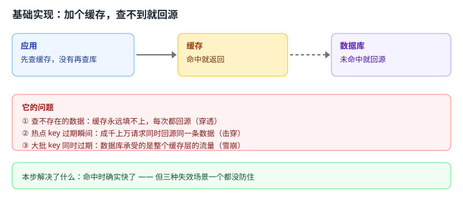
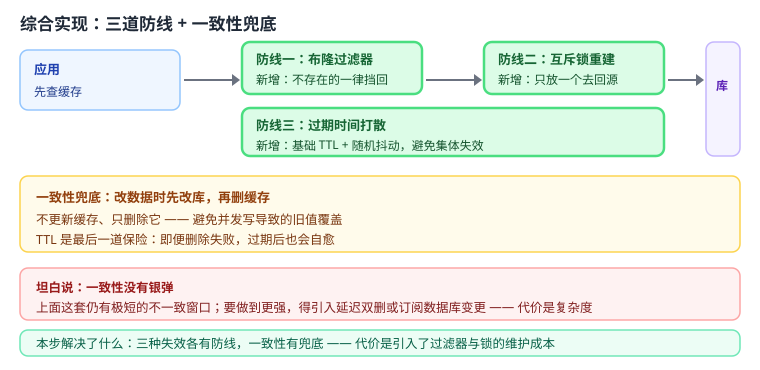

# 应用实战 08：商品详情缓存

> 对应：[课 8《缓存设计》](../stages/4-分布式与生产实践/lessons/lesson-08-缓存设计.md)
> 回目录：[应用实战索引](./INDEX.md)
> 覆盖知识点：穿透 / 击穿 / 雪崩 / 缓存与数据库一致性 / 过期与淘汰

## 场景

商品详情页 QPS 高、数据库扛不住。加一层缓存，并且要保证：不会被无效请求打穿、热点失效时不炸、整批 key 不会同时过期。

## 全貌一句话

完整的生产方案还需要**多级缓存（本地 + 分布式）**、**缓存预热**、**数据库变更的订阅清理**、**命中率与回源量的监控告警**——这些超出本课范围，这里只做"三道防线 + 一致性"这条主线。

---

## 第一步：基础实现 —— 查不到就回源


> 代码约定：以下片段中的 `r` 为已连接的 Redis 客户端，`db_query` / `db_update` 为数据库查询占位函数，均未重复定义，照抄时需自备。
最直觉的写法：先查缓存，没有就查库，查到再写回缓存。



> 读图指引：应用 → 缓存 → 数据库，虚线是回源。命中时确实快了，但下面那格三个问题一个都没解决。

```python
import redis, json

r = redis.Redis(host='127.0.0.1', port=6379, decode_responses=True)

def get_product(product_id: int):
    """查商品：先查缓存，没有再查库"""
    cached = r.get(f"product:{product_id}")
    if cached is not None:
        return json.loads(cached)

    product = db_query(product_id)          # 回源
    if product is None:
        return None                          # 不存在，什么都不做

    r.setex(f"product:{product_id}", 3600, json.dumps(product))
    return product

def db_query(product_id: int):
    """模拟数据库查询；不存在时返回 None"""
    return {"id": product_id, "name": "示例商品"} if product_id > 0 else None
```

**跑得起来吗**：能，命中时确实快。

### 它的问题

1. **穿透**：查一个根本不存在的 id，缓存永远填不上，**每次都回源**。攻击者用随机 id 猛打，数据库直接被打穿。
2. **击穿**：某个爆款商品的缓存过期的那一瞬间，成千上万请求同时回源**同一条数据**，数据库瞬间压力陡增。
3. **雪崩**：如果所有商品都在整点写入、TTL 都是 1 小时，那么每天整点**几十万个 key 集体过期**，数据库承受的是整个缓存层的流量。

---

## 第二步：综合实现 —— 三道防线 + 一致性兜底

被上面三个问题逼出来的下一步：**门口挡掉无效请求、只允许一个回源、TTL 打散**，再加上一致性的兜底写法。



> 读图指引：比上一张多了三块绿色——**布隆过滤器**（挡无效 id）、**互斥锁重建**（只放一个回源）、**TTL 打散**（避免集体失效）。黄色那格是一致性兜底。

```python
import redis, json, uuid, time, random

r = redis.Redis(host='127.0.0.1', port=6379, decode_responses=True)

BASE_TTL = 3600          # 基础过期时间（秒）
JITTER = 300             # 随机抖动（秒），打散过期时机

def _ttl() -> int:
    """第三道防线：基础 TTL + 随机抖动，避免大批 key 同时过期"""
    return BASE_TTL + random.randint(0, JITTER)

# ---------- 建过滤器（真实项目在写入商品时同步 BF.ADD） ----------
def init_filter(ids):
    try:
        r.execute_command("BF.RESERVE", "product-filter", 0.001, 100000)
    except redis.exceptions.ResponseError as e:
        if "exists" not in str(e):
            raise
    for i in ids:
        r.execute_command("BF.ADD", "product-filter", i)

def get_product(product_id: int):
    # 第一道防线：布隆过滤器挡掉"肯定不存在"的 id
    if r.execute_command("BF.EXISTS", "product-filter", product_id) == 0:
        return None

    cached = r.get(f"product:{product_id}")
    if cached is not None:
        return json.loads(cached)

    # 第二道防线：互斥锁重建，只放一个请求去回源
    token = str(uuid.uuid4())
    lock_key = f"lock:product:{product_id}"
    got = r.set(lock_key, token, nx=True, ex=10)

    if got:
        try:
            product = db_query(product_id)
            if product is None:
                return None
            r.setex(f"product:{product_id}", _ttl(), json.dumps(product))
            return product
        finally:
            # 只删自己的锁：比对 token 后再删，用 Lua 保证原子
            UNLOCK = """
            if redis.call('get', KEYS[1]) == ARGV[1] then
                return redis.call('del', KEYS[1])
            else
                return 0
            end
            """
            r.eval(UNLOCK, 1, lock_key, token)
    else:
        # 没抢到锁：等一会再读缓存，别一股脑都去回源
        time.sleep(0.05)
        cached = r.get(f"product:{product_id}")
        return json.loads(cached) if cached else None

# ---------- 一致性兜底：改库后删缓存，而不是更新缓存 ----------
def update_product(product_id: int, name: str):
    db_update(product_id, name)     # 先改库
    r.delete(f"product:{product_id}")   # 再删缓存（不是更新！）

def db_query(product_id: int):
    return {"id": product_id, "name": "示例商品"} if product_id > 0 else None

def db_update(product_id: int, name: str):
    print(f"数据库更新：{product_id} -> {name}")
```

**为什么这么改**：

- **布隆过滤器**在门口挡掉"肯定不存在"的 id，穿透不再打到数据库（实测 5 万个不存在的 id 误判 **28 次 ≈ 0.056%**，真实 id **误拦 0 次**）；
- **互斥锁**保证热点过期时只有一个请求回源，其余等待后重读缓存，击穿不再发生；
- **TTL 加随机抖动**，让过期时机分散，雪崩不再整齐划一；
- 更新走**"先改库、再删缓存"**而不是更新缓存——避免并发写造成的旧值覆盖，TTL 是最后一道保险；
- 释放锁用 **token 比对 + Lua 原子删除**，避免删掉别人持有的锁（这是课 8 重点强调的坑）。

**代价要说清**：

- 布隆过滤器**不支持删除**，需要删除场景要换布谷过滤器（`CF.*`）；空值缓存则会堆积垃圾 key（实测第一轮就把缓存从 500 撑到 **2499 个**）。
- **一致性没有银弹**：上面这套仍有极短的不一致窗口。要更强就得上延迟双删或订阅数据库变更，代价是复杂度。

---

🎯 **会用标志**：能独立写出"布隆过滤器 + 互斥锁 + TTL 打散"的商品详情缓存，并说清三道防线各自防的是哪一种失效、以及更新时为什么是"删缓存"而不是"更新缓存"。
