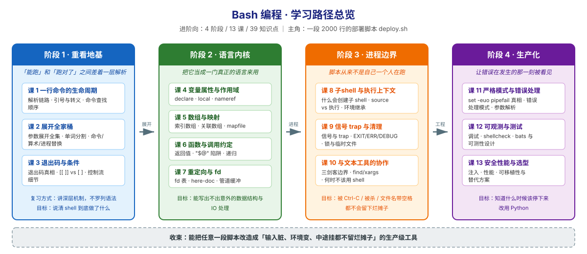

# Bash 编程 学习路径总览

> 本文件是活文档，随学习进度动态调整。

## 🎯 学习目标

- **目标类型**：动手实操 + 理解机制
- **目标说明**：把已具备的 2000+ 行 shell 经验，从"能写出来"推进到"写得对、挂得住、别人敢改"——深入语言深层特性（解析顺序、展开、退出码、子 shell、trap、fd），补齐健壮性与工程化短板（严格模式、错误处理、可观测、测试、安全与性能），并清楚知道**什么时候该停止用 shell**。

> 明确不讲：`cd` / `ls` / `cp` 等基础命令用法、变量赋值与 `if` 的入门语法、管道是什么。

## 故事主线

- **主角**：一段真实存在的部署脚本 `deploy.sh`（2000 行，能跑，但没人敢动）
- **冲突**：它在你机器上跑得好好的，上了 CI 就崩、文件名带个空格就崩、跑一半 Ctrl-C 就留下半个烂摊子——而且崩得莫名其妙
- **收束**：学完全程，你能把任意一段脚本改造成「输入脏、环境变、中途挂都不留烂摊子」的生产级工具，并且知道什么时候该停下来说"这个该用 Python 写"

> 整个课程是这条故事线的展开，每个阶段是故事的一个"章节"。

## 学习路径图

## 阶段总览

### 阶段 1：重看地基（章节：「能跑」和「跑对了」之间差着一层解析）

- **目标**：说清 shell 拿到一行输入后到底做了什么——解析顺序、展开时机、退出码传播
- **学习重点**：
  - shell 解析命令的完整链路（不是"读一行执行一行"）
  - 引号与转义的真实作用域（什么时候该加、加了会不会错）
  - 参数展开全集（进阶者最常用的 `${var:-}` / `${var##}` 只是冰山一角）
  - 单词分割与 glob 的触发条件（空格炸脚本的真正原因）
  - 退出码在管道 / 子 shell / 函数返回值之间的传播规则
  - `[[ ]]` 与 `[ ]` 与 `(( ))` 的差异与各自适用边界
- **必须掌握**：能说出"这句命令 shell 分几步处理、哪一步会出问题"；能解释为什么 `${x}` 加了引号仍可能出错
- **对应课**：课 1、课 2、课 3

### 阶段 2：语言内核（章节：把它当成一门真正的语言来用）

- **目标**：熟练使用 bash 的数据结构与 IO 能力，写出行为可预期的代码
- **学习重点**：
  - `declare` 家族与变量属性（`-r` `-i` `-a` `-A` `-l` `-u` `-x` `-n`）
  - 作用域：为什么 `local` 不是"局部变量"而是"函数内可见"，动态作用域与它的坑
  - 索引数组与关联数组的完整操作，以及 `@` 与 `*` 的差异
  - 函数即命令：返回值、输出、命名冲突；`"$@"` 传递的全部细节
  - 文件描述符表：重定向顺序、`exec` 持久重定向、here-doc/here-string
  - 管道缓冲对交互式脚本的影响（为什么输出卡住了）
- **必须掌握**：能用关联数组替代"用 eval 拼变量名"；能安全地把参数数组穿过三层函数传递
- **对应课**：课 4、课 5、课 6、课 7

### 阶段 3：进程边界（章节：脚本从来不是自己一个人在跑）

- **目标**：搞清进程边界——什么创建子 shell、变量为什么改不回来、被中断时怎么收摊
- **学习重点**：
  - 创建子 shell 的六种情形，以及"变量改了没生效"的根因归类
  - `source` 与执行的本质差异，以及什么时候该用哪个
  - 作业控制：`wait` / `wait -n` / `$!`，以及"后台任务的退出码只能靠 wait 取回"
  - `trap` 与信号：EXIT / ERR / DEBUG 三个伪信号的触发时机
  - 清理模式：临时文件、`flock` 锁、中断安全的收尾
  - 与 grep/sed/awk 协作时的边界（什么时候 shell 只是个胶水）
  - `find -print0` / `xargs -0` 与 NUL 分隔：文件名带空格的正确解法
- **必须掌握**：能写出一个 Ctrl-C、被 kill、异常退出都能正确清理临时文件与锁的脚本；能用 `wait -n` 做 N 路并发并汇总每台的结果
- **对应课**：课 8、课 9、课 10

### 阶段 4：生产化（章节：让错误在发生的那一刻被看见）

- **目标**：把脚本从"能跑"推到"敢上生产"——错误处理、可观测、测试、安全、性能、选型
- **学习重点**：
  - `set -euo pipefail` 的真实语义与**它失效的七种场景**（这是最多人踩的坑）
  - 错误处理模式：错误码约定、错误上下文、`trap ERR` 打栈
  - 参数解析：`getopts` 的局限与手写长选项解析器
  - 调试：`set -x` 的增强用法、`PS4`、`BASH_XTRACEFD`
  - `shellcheck` 静态检查与 **`bats-core` 单元测试**（本机未装，用到时先征询）
  - 注入安全：`eval` 与命令注入、不可信输入的边界
  - 性能：子 shell 与 fork 成本、`while read` 循环的正确写法
  - 可移植性与替代方案：什么时候该停下改用 Python
- **必须掌握**：能说清 `set -e` 在什么情况下不会退出；能给一段 300 行脚本补上测试
- **对应课**：课 11、课 12、课 13

## 当前进度

- [x] 阶段 1：重看地基（✅ 已完成，3 课 9 知识点，2026-09-04）
- [x] 阶段 2：语言内核（✅ 已完成，4 课 12 知识点，2026-09-04）
- [x] 阶段 3：进程边界（✅ 已完成，3 课 10 知识点，2026-09-04）
- [x] 阶段 4：生产化（✅ 已完成，3 课 9 知识点，2026-09-04）

> 进度以 [00-学习档案.md](00-学习档案.md) 的知识点级进度表为准，本表只记阶段级状态。

## Phase 进度（讲义之外的产物）

| Phase | 产物 | 状态 |
|-------|------|------|
| Phase 1 | 大纲与骨架（4 阶段 13 课 40 知识点） | ✅ 已完成 |
| Phase 2 | 13 课讲义 | ✅ 已完成（2026-09-04） |
| Phase 3 | [结课实战项目 `release-audit`](projects/release-audit/README.md) | ✅ 已完成（2026-09-04，57 断言全通过，复杂度四门槛达标） |
| Phase 4 | [课程手册](final-课程手册.md) | ✅ 已完成（2026-09-04，438 行，P0×0） |
| Phase 5 | 见下方三件套 | ✅ 已完成（2026-09-04，三份共 1130 行，P0×0，16 组实测对照） |

## 环境基线

| 项 | 值 |
|----|-----|
| 系统 | WSL Ubuntu 24.04.4 LTS |
| Shell | GNU bash 5.2.21(1)-release (x86_64-pc-linux-gnu) |
| 已装 | awk、sed、mktemp、flock、timeout、perl |
| 未装 | shellcheck、bats-core（用到时须先征询用户再安装） |
| 调用方式 | Windows 侧经 `C:\Windows\System32\bash.exe` 进入 WSL |

> 全部示例代码在真实 bash 中跑通后再写入讲义，输出块与运行时 stdout 逐字一致。
