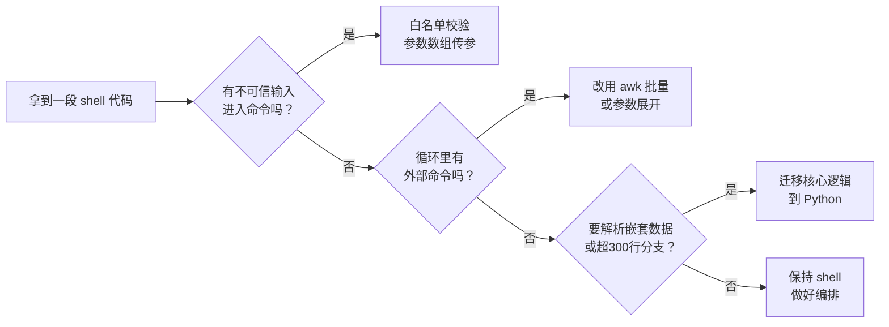

# Bash 编程 · 课程手册

> 这是 4 阶段 / 13 课 / 40 知识点的**汇总索引**，不是第 14 课讲义。
> 每课保留「核心结论 + 关键实测数字 + 高频误区」，**点课名进原文看完整推导**。
>
> 全部实测数据来自本机：WSL Ubuntu 24.04.4 · 内核 6.6.87.2-microsoft-standard-WSL2 · GNU bash 5.2.21(1) · 20 核。
> ⚠️ 性能数字带平台偏差，引用时务必连同平台一起说（见 [性能数字的平台偏差](#性能数字的平台偏差)）。

---

## 怎么读这份手册

先看你现在的处境，再决定读哪一节。

| 你的处境 | 直接去这一节 |
|---|---|
| 线上脚本炸了，要立刻止血 | 排障速查手册（待产出）· 当前可先用 [决策清单三：注入防护](#决策清单三注入防护的三原则按优先级) 与 [生产脚本检查清单](#六生产脚本检查清单) |
| 要写一个新脚本，想一次写对 | [全课硬数字速查](#一全课硬数字速查) → [生产脚本检查清单](#六生产脚本检查清单) |
| 拿不准这个功能该用 shell 还是 Python | [决策清单二：该不该停下改用 Python](#决策清单二该不该停下改用-python) |
| 想复习某个具体机制 | [四阶段收束](#二四阶段收束13-课-40-知识点) 按阶段点进去 |
| 想看全部内容怎么串成一条线 | [三条贯穿全课的伏笔](#三三条贯穿全课的伏笔) |
| 学完了，想检验 | [结课实战项目 `release-audit`](#结课实战项目-release-audit) |

---

## 一、全课硬数字速查

这张表是整门课最可迁移的资产——**每个数字都是本机跑出来的**，不是抄文档。

### 性能：fork 是唯一的量级问题

| 对比项 | 慢的写法 | 快的写法 | 实测倍数 | 出处 |
|---|---|---|---|---|
| 参数展开 vs 外部命令 | `basename` × 2000 | `${p##*/}` × 2000 | 2419ms vs 7ms ≈ **345×** | 课 13 |
| 算术 vs 外部命令 | `expr` × 2000 | `$(( ))` × 2000 | 2716ms vs 5ms ≈ **540×** | 课 13 |
| 内建 vs 外部命令（综合） | 外部命令 1000 次 | 内建 1000 次 | 6.9–7.7s vs 0.015–0.016s ≈ **370×** | 课 3 |
| 参数展开（总括） | 外部命令 | `${p##*/}` / `${f%.*}` | ≈ **500×** | 课 2 |
| 消除循环内 fork | while 循环内调外部命令 | 交给单个 `awk` 进程 | 3145ms → 3ms ≈ **1000×** | 课 13 |
| 一次 fork 的绝对成本 | fork + exec | bash 纯算术 | 0.549ms vs 0.0035ms ≈ **157×** | 课 10 |
| `find -exec` 两种写法 | `\;` 逐个（N 进程） | `+` 批量（1 进程） | 9 进程 vs 1 进程 | 课 10 |

**一句话**：微优化收益 < 2×，**数量级优化只有一个方向——减少 fork 次数**。

### 性能：三个"你以为很值其实不值"的优化

这三条是实测推翻的主流说法，最容易被写进代码评审意见里。

| 常见说法 | 实测 | 真实结论 |
|---|---|---|
| 去掉 `cat file \| cmd` 是重要优化 | 338ms vs 302ms，仅 **12%** | 大头是 `wc` 自身 200 次 fork。真正理由是**避免管道开子 shell**（课 11），不是性能。别为 12% 改可读代码 |
| `[[ ]]` 比 `[ ]` 快，优化该换 | 2000 次 7ms vs 6ms，**1.2×** | 两者都是内置，差异可忽略。`[[ ]]` 的价值是**安全**（不做词拆分）与**功能**（`=~` 正则），不是速度 |
| 无限流并发最快 | 8 路 204ms vs 4 路 404ms | 确实快 2×，但会打爆下游（数据库连接、API 限流）。**限流的目的是保护下游，不是优化自己** |

### 并发与清理

| 项 | 实测值 | 出处 |
|---|---|---|
| 串行 vs 4 路并行（8 台） | 1611ms vs 404–405ms ≈ **4×** | 课 8 |
| 8 路全开（不限流） | 204ms，但会打爆下游 | 课 8 |
| `mktemp -d` 权限 | 700，模板至少 6 个 `X` | 课 9 |
| 等外部命令时收 SIGINT | 退出码是 **0**，不是 130（纯计算脚本才是 130） | 课 9 |
| 信号推迟 | T+0.5s 发 INT，T+3.0s 才触发（`sleep 3` 完整跑完 3004ms） | 课 9 |
| 等幂清理 | 重复 `rm -rf` 返回 0，不报错 | 课 9 |
| 孤儿持锁 | 杀掉父进程，子子进程继承 fd **继续持锁**，清掉孤儿才释放 | 课 9 |

### 退出码：全课约定

| 码 | 含义 | 备注 |
|---|---|---|
| 0 | 成功 | **注意：0 ≠ 真的成功**，关键操作要有独立的产物校验 |
| 1 | 通用失败 / `grep` 无匹配 | 可用 `[ 1 ]` 精确区分"无匹配"与"真错误(2)" |
| 2 | **用法错误**（参数不对） | 也是 `return` 在非 source 顶层的报错码 |
| 3 | （自定义）业务失败 | 课 13 退出码污染实测用例 |
| 126 / 127 | 不可执行 / 命令未找到 | |
| 128+N | 被信号 N 杀死 | 与主动 `exit 143` **无法区分** |
| 130 | SIGINT（仅纯计算脚本） | 等外部命令时是 **0** |
| 139 | SIGSEGV（栈溢出） | **stderr 零输出**，极难定位 |
| 141 | SIGPIPE | 管道后接 `head` 必现，须显式处理 |

**退出码的三个反直觉之处**（课 3）：
- `$?` 只有 8 位，`exit 256` → 0
- `$?` 只记最近一条命令，会被 `echo` 和赋值冲掉——`cmd; echo; echo "rc=$?"` 拿到的是 `echo` 的码
- 管道默认取最后一段，`pipefail` 只报**最后一个非零段**（不是第一个失败）

### 环境的硬事实

| 项 | 实测值 |
|---|---|
| bash | 5.2.21(1)-release (x86_64-pc-linux-gnu) |
| 内核 / 系统 | 6.6.87.2-microsoft-standard-WSL2 / Ubuntu 24.04.4 LTS |
| `/bin/sh` | → `/usr/bin/dash`（不是 bash！） |
| 已装 | awk (GNU Awk 5.2.1)、sed、mktemp、flock、timeout、perl (5.38.2)、python3 (3.12.3) |
| **未装** | `shellcheck`、`bats-core`、`jq` |
| 调用方式 | Windows 侧经 `C:\Windows\System32\bash.exe` 进入 WSL |

---

## 二、四阶段收束（13 课 / 40 知识点）

### 阶段 1：重看地基（3 课 / 9 知识点）

> 章节主题：「能跑」和「跑对了」之间差着一层解析

| 课 | 核心结论 | 最易踩的坑 |
|---|---|---|
| [课 1 一行命令的生命周期](stages/1-重看地基/lessons/lesson-01-一行命令的生命周期.md) | 解析五阶段：读行 → 分词 → 展开 → 重定向 → 查找执行。**操作符在分词时定，变量在展开时才替换** | 引号不随值传递：定义处的引号管"值里能否含空格"，使用处的引号管"会不会被分割"，两者独立 |
| [课 2 展开全家桶](stages/1-重看地基/lessons/lesson-02-展开全家桶.md) | 参数展开是**零 fork 的字符串 DSL**（实测快约 500×） | `local x=$(cmd)` 吞失败；`(( ))` 退出码与 C 相反；进程替换绕开子 shell |
| [课 3 退出码与条件](stages/1-重看地基/lessons/lesson-03-退出码与条件.md) | `$?` 是易失单值；`[ ]` / `[[ ]]` / `(( ))` 三套不通用 | 前导零是八进制：`010`=8，`08`/`09` 直接报错（用 `10#` 修复）；`for f in $(ls)` 永远错 |

**阶段 1 的通用诊断工具**：`set -x` 看展开后的真实命令——这是后续每一课的归因起点。

**记忆锚点**：`#` 靠左管开头、`%` 靠右管结尾；单个最短、双个最长；负偏移前要留空格。

---

### 阶段 2：语言内核（4 课 / 12 知识点）

> 章节主题：把它当成一门真正的语言来用

| 课 | 核心结论 | 最易踩的坑 |
|---|---|---|
| [课 4 变量属性与作用域](stages/2-语言内核/lessons/lesson-04-变量属性与作用域.md) | 属性贴在变量上，**赋值时才生效**；子能看见父的 `local`，父看不见子的 | `-i` 非数字静默归零；`-x` 导数组**静默失败**；`local` 吞退出码 |
| [课 5 数组与映射](stages/2-语言内核/lessons/lesson-05-数组与映射.md) | 遍历永远写 `"${arr[@]}"` | 漏引号导致元素裂开；`${#arr}` 不是长度；`set -u` 下自增崩；末行无换行丢失 |
| [课 6 函数与调用约定](stages/2-语言内核/lessons/lesson-06-函数与调用约定.md) | 成功与否走 `return`，数据走 stdout/nameref，进度信息走 stderr | 漏一层引号全废且零报错；栈溢出 139 零提示；**nameref 被同名 `local` 遮蔽** |
| [课 7 重定向与文件描述符](stages/2-语言内核/lessons/lesson-07-重定向与文件描述符.md) | 重定向从左到右复制指针，想让错误进日志写 `>log 2>&1` | 连管道变全缓冲（SIGKILL 时缓冲区**蒸发**，实测 0 字节）；`PIPESTATUS` 被下一条命令重置 |

**阶段 2 三条立即可用的规则**（课 4–6 共同结论）：

1. 函数内变量一律 `local`，除非明确全局
2. 全局配置 `CFG_*` 大写 + `declare -r`，局部变量 `_xxx` 前缀
3. 返回字符串/数组用 `declare -n _out`，**nameref 变量永远带 `_` 前缀**

**课 7 三句话版本**：
1. 重定向从左到右复制指针，想让错误进日志就写 `>log 2>&1`
2. here-doc 定界符加引号 = 整段不展开，生成配置文件用两段拼接
3. 连管道变全缓冲，`stdbuf -oL` 加在做缓冲的进程上，管道改的变量活不下来

---

### 阶段 3：进程边界（3 课 / 10 知识点）

> 章节主题：脚本从来不是自己一个人在跑

| 课 | 核心结论 | 最易踩的坑 |
|---|---|---|
| [课 8 子shell与执行上下文](stages/3-进程边界/lessons/lesson-08-子shell与执行上下文.md) | 子 shell 是**复印件**——完整继承一切，但所有修改随退出而丢弃 | `$$` 看不出分身，**`$BASHPID` 才能**；`lastpipe` 在 `set -m` 下静默失效 |
| [课 9 信号trap与清理](stages/3-进程边界/lessons/lesson-09-信号trap与清理.md) | 被信号杀死时 EXIT trap 里的 `$?` 是 **0**，实际退出 143——必须第一行存 | 孤儿子进程继承 fd 继续持锁；`kill -- -$$` 组不存在（脚本不是组长） |
| [课 10 与文本工具的协作](stages/3-进程边界/lessons/lesson-10-与文本工具的协作.md) | 优化第一原则是**消灭循环**，不是换语言 | 文件名可含空格/tab/引号/换行，**只有 NUL 安全**；`xargs` + `awk` 的 END **每批执行一次** |

**创建子 shell 的六种情形**（课 8）：管道两侧、命令替换 `$( )`、括号组 `( )`、后台 `&`、外部命令、被执行的脚本。

**课 9 的取证纪律**：`trap ... KILL` 返回 0 但永不执行；WSL 下 `/proc/<pid>/status` 的 `SigIgn` 读不到（pid 命名空间受限），取信号处置须改用 `trap -p` 或行为观测。

**课 10 的 xargs 脚本模板**：`xargs -0 bash -c '...' _`（走参数传递，不用 `-I{}`）。

---

### 阶段 4：生产化（3 课 / 9 知识点）

> 章节主题：让错误在发生的那一刻被看见

| 课 | 核心结论 | 最易踩的坑 |
|---|---|---|
| [课 11 严格模式与错误处理](stages/4-生产化/lessons/lesson-11-严格模式与错误处理.md) | `set -e` 只拦**未被测试**的失败，有七个洞 | `(( i++ ))` 值为 0 时误杀；`local x=$(cmd)` 吞码；命令替换子 shell 丢失 `-e` |
| [课 12 可观测与测试](stages/4-生产化/lessons/lesson-12-可观测与测试.md) | 可观测与可测都不是"加个工具"，而是**改变脚本的写法** | `PS4` 不做 printf 格式化；日志标签是 `%-5s` 补齐的 `[INFO ]` **带尾空格** |
| [课 13 安全性能与选型](stages/4-生产化/lessons/lesson-13-安全性能与选型.md) | 三个知识点是同一约束的推论：**shell 用字符串作唯一数据结构** | `local a=$1 b=$a` 先展开整行；`${1:-默认}` 会**掩盖空参数** |

**阶段 4 是一条完整链路**：课 11 让出错会停 → 课 12 让停在哪看得见 → 课 13 让脚本不会被骗、跑得够快、知道何时换语言。

**课 13 的共同根源**（手册最重要的一句）：

> shell 把「字符串」用作唯一的通用数据结构，而这既是它的力量，也是它的边界。
> - **注入**：因为命令是字符串，数据和代码用同一种材质，所以数据可能被当成代码
> - **性能**：因为每次调用外部命令都要 fork，所以批量处理必须"派一个人一次办完"
> - **选型**：因为字符串无法表达嵌套结构，所以遇到 JSON/YAML 就该换语言

---

## 三、三条贯穿全课的伏笔

这三条不是"总结出来的道理"，是**同一个现象在全课反复出现**——数过了，遍布 13 课。它们是手册里最值钱的部分，因为单看某一课你只会当成一条技巧。

### 伏笔一：shell 的错误几乎全是静默的

全课出现 **171 处**「静默 / 不报错 / 零报错」。这不是修辞，是这门语言的真实性格。

| 课 | 静默失败的样子 |
|---|---|
| 课 1 | 引号留在值里，`find` 去找名字含单引号的文件，退出码 0，**静默无输出** |
| 课 2 | glob 无匹配时原样保留（危险）；`${!var}` 指向不存在变量 → 空串、退出码 0 |
| 课 4 | `declare -i x; x="abc"` → 变 `0` 不报错；`declare -x arr=(...)` 导数组**静默失败**（父 `-ax`、子拿空） |
| 课 5 | 漏引号遍历：3 个服务变 5 个，**零报错**；`arr[10]` 越界返回空 |
| 课 6 | `return 300` 静默回绕成 44；漏一层 `"$@"` → 5 个变 7 个，零报错；nameref 撞名**完全静默、零 warning** |
| 课 7 | `&>` 在 dash 下静默失效，日志 **0 字节但退出码 0** |
| 课 8 | `lastpipe` 在 `set -m` 下静默失效（`c=0`） |
| 课 9 | `trap ... KILL` 返回 0 但 **handler 永不执行**；两个 `trap ... EXIT` 后者覆盖前者，第一条静默消失 |
| 课 10 | `xargs` + `awk` 的 `END` **每批执行一次**，文件少时对、涨到 1 万错，**不报错只是结果悄悄变** |
| 课 11 | `grep` 失败被 `\|\| true` 变成 0 → `[[ $count -gt 0 ]]` 静默为假，**一次真失败被"保险措施"彻底吞掉** |
| 课 12 | `$?` 被中间命令污染，判断结果**反转**，不报错不崩溃 |
| 课 13 | `local a=$1 b=$a` 外层有同名变量时**静默用错值**（`app-GLOBAL` 而非 `app-v2`）；`read` 末行无换行**静默丢弃** |

**提炼成一句可执行的判据**：

> **不要用「没报错」判断「做对了」。** 关键操作必须有独立的产物校验——
> 写了文件就 `wc -c` 验字节数，导出了变量就到子进程里读回来，删了东西就数一遍剩几个。

**为什么 `set -u` 特别重要**：课 13 实测证明，加了 `set -u` 之后 `local a=$1 b=$a` 这类写法才会暴露。**没有 `set -u`，它会静默用错值。**

---

### 伏笔二：命令替换 `$( )` 吞掉的不只是退出码

全课出现 **57 处**「子 shell 吞」。课 2 第一次提它时只是"吃尾换行"，到后面才发现它吞的东西越来越多。

| 课 | 又吞掉了什么 |
|---|---|
| 课 2 | 吃尾换行 |
| 课 5 | `mapfile` 在管道子 shell 里，数组读不回来 |
| 课 6 | `$( )` 每次调用一个子 shell（fib(24) 的 `echo` 版 **95757ms**，约 15 万个子 shell） |
| 课 8 | 子 shell 是**复印件**——完整继承一切，所有修改随退出丢弃 |
| 课 11 | 吞**调用栈中间帧**（`r=$(middle)` 丢了 `inner` 那一帧），ERR trap 还打印两遍；`errexit` 默认不继承进去 |
| 课 12 | 吞 **stub 的计数**（实测 `out=20 hits=0`），测试断言永远为 0 |
| 课 13 | 它还是 **fork 成本的来源** |
| 结课项目 | `d=$(ra_mktemp_dir)` → 函数内 `+=` 不回传 → **临时目录泄漏**，`BASH_SUBSHELL` 1→2 是铁证 |

**提炼成一句可执行的判据**：

> **凡是要把「状态改动」带回调用方，就不能用 `$( )`。** 三条出路：
> ① nameref 出参（推荐，无子 shell）② 写进临时文件 ③ 改用重定向 `while ... done < file`。

**配套的取证技巧**：`PS4` 首字符重复 = 子 shell 层级。`+pb.sh:5:> f` vs `++pb.sh:6:> echo`——眼睛扫一眼前缀长度就知道在第几层，比显式写 `${BASH_SUBSHELL}` 直观。

---

### 伏笔三：deploy.sh 的六次进化

这门课从头到尾在改同一个脚本。把它六个版本摆在一起，就是整门课的骨架：

| 阶段 | 版本 | 核心问题 | 解决了什么 |
|---|---|---|---|
| 阶段 1 | 裸脚本 | 引号、展开、词拆分 | 脚本**能跑对** |
| 阶段 2 | + 函数与数组 | 重复代码、参数传递 | 脚本**有结构** |
| 阶段 3 | + awk/sed | 文本处理靠 grep 硬拆 | 脚本**会处理数据** |
| 课 11 | + `set -Eeuo pipefail` + trap | 错了还在继续跑 | **错了会停** |
| 课 12 | + 日志分级 + `PS4` + 可测结构 | 出问题看不出在哪 | **错了看得见** |
| 课 13 | + 白名单 + awk 批量 + 选型判据 | 会被骗、会变慢、不知道边界 | **不会被骗、跑得够快、知道何时换语言** |

**三条伏笔的交点**：阶段 4 的三课讲的是同一个问题的三个层次——"**这个脚本能不能在生产上跑？**"
课 11 答了一半（出错会停），课 12 补第二层（停在哪看得见），课 13 补第三层（不会被骗、跑得够快、知道何时换语言）。

---

## 四、决策清单

### 决策清单一：这个任务该不该用 shell

先过这四条**否决项**，任意一条命中就不该用 shell：

| # | 信号 | 为什么不适用 |
|---|---|---|
| 1 | 需要解析/生成**嵌套数据结构**（JSON/YAML/XML） | 字符串表达不了嵌套。本机**无 jq** 是天然实锤：`grep -o '"errors": [0-9]*'` 能抠出 `12/3/27`，但**丢掉与 name 的对应关系**，答不出"哪个 service" |
| 2 | 需要**真正的错误处理**（异常类型、错误传播、回滚） | shell 里 `arr[10]` 越界返空、`$((v+1))` 非数字当 0，**都不报错** |
| 3 | 逻辑超过 **200–300 行且有分支** | 没有命名空间、没有模块系统、没有类型 |
| 4 | 需要**单元测试与重构**，或必须跨平台一致 | macOS 自带 bash 3.2，`declare -A` 等 bash 4+ 特性直接不工作 |

**满足任一就该换 Python。** 但注意最后一句：

> **不是重写，是迁移核心逻辑。** shell 保留编排（find/遍历/退出码/日志），Python 接管计算（解析/聚合/结构化输出）。

实测范例（课 13）：`find logs -name '*.log' | python3 summarize.py` —— 整个脚本**无一行 bash 在解析日志**。

**反过来，这些场景用 shell 更合适**：编排类脚本（无依赖、管道天然、容器 entrypoint）。判据是"**这段逻辑在做什么**"，不是"团队用什么语言"。

### 决策清单二：该不该停下改用 Python

### 决策清单三：注入防护的三原则（按优先级）

**注入的本质不是「用没用 eval」，而是「数据会不会被 shell 重新解析」。**

同一 payload 实测：`eval "grep -r '$p' ."` 读出 `TOP-SECRET-TOKEN`；`grep -r -- "$p" .` 零输出退出码 1，**完全免疫**。
`ssh host "cmd $x"` 没有 eval 同样危险（远端 shell 会解析）。

**glob 注入不需要 eval 也不需要分号**：传 `*` 作文件名，无引号 `cat $target` 会把目录下所有文件读一遍。**最强论据——只要脚本遍历目录，文件名就是外部输入。**

| 优先级 | 手段 | 说明 |
|---|---|---|
| ① | 白名单正则 `^[A-Za-z0-9][A-Za-z0-9._-]{0,63}$` | 8 个边界用例全覆盖，拦住 `..` / `-rf` / `a b` / 超长 / **空串** |
| ② | 参数数组 + `--` | `cmd -- "$x"`。⚠️ `--` 不是万能的：`tar -czf -- out.tar.gz` **构建失败**，`-f` 后必须紧跟归档名，**带参数的选项内部顺序优先于 `--`** |
| ③ | `printf %q` | 兜底，非首选 |

---

## 五、速查表

### 五组"只有一个正确答案"的写法

| 场景 | 唯一正确写法 | 为什么其他都错 |
|---|---|---|
| 遍历数组 | `for x in "${arr[@]}"` | 漏引号 3 个变 5 个，**零报错** |
| 判键存在 | `[ -v "map[$k]" ]` | `[ -n "${m[k]}" ]` 在键存在但值为空时误判 |
| 参数透传 | 每一层都写 `"$@"` | 漏一层全废，零报错 |
| 读文件 | `mapfile -t arr < <(cmd)` | 管道版开子 shell，数组读不回来 |
| 逐行处理 | `while IFS= read -r line \|\| [ -n "$line" ]` | 五个部分缺一不可（见下） |

**`while IFS= read -r line` 五个部分缺一不可**：
`-r` 防反斜杠被当转义（`a\tb` → `atb`）· `IFS=` 防首尾空白被吃 · **末行无换行符会静默丢失**（2 行读成 1 行），补救 `|| [ -n "$line" ]`。

### 三套条件测试不是高低配

| | 是什么 | 特点 |
|---|---|---|
| `[ ]` | **命令** | 会做词拆分，必须加引号 |
| `[[ ]]` | **语法** | 不做词拆分，支持 `=~` 正则。价值是安全与功能，**不是速度**（1.2× 可忽略） |
| `(( ))` | **算术** | 真值相反（0 为假），且 `(( i++ ))` 在 `set -e` 下会**误杀** |

**引号规则统一**：`[[ ]]` 和 `case` 里，加引号 = 字面量，不加 = 模式。

### 子 shell 六来源与规避

来源：管道两侧 · 命令替换 `$( )` · 括号组 `( )` · 后台 `&` · 外部命令 · 被执行的脚本。

| 想做的事 | 别用 | 改用 |
|---|---|---|
| 计数器在循环后仍有效 | `cmd \| while read` | `while ... done < file`（重定向，首选） |
| 函数返回数组/字符串 | `d=$(f)` | nameref 出参 `declare -n _out=$1` |
| 测试里 stub 传状态 | shell 变量 | **写进文件** |

---

## 六、生产脚本检查清单

写完一个脚本，对照这 12 条自查（课 11 原始清单）。

| # | 检查项 | 违反后果 |
|---|--------|---------|
| 1 | 开头是 `set -Eeuo pipefail`（**四个字母，不只是三个**） | 命令替换子 shell 里的错误不触发 ERR trap |
| 2 | 需要命令替换内部也严格时，加 `shopt -s inherit_errexit` | `errexit` 不继承进子 shell |
| 3 | 所有 `local x=$(cmd)` 都拆成 `local x; x=$(cmd)` | 吞掉失败退出码 |
| 4 | 所有 `(( i++ ))` 都放进条件或用 `++i` | `set -e` **误杀**（不是漏网，方向相反） |
| 5 | 没有裸的 `\|\| true`——都检查了 `$?` 并区分退出码 | 真错误被"保险措施"彻底吞掉 |
| 6 | 管道后面有 `head` 时，处理了 141（SIGPIPE） | 假失败 |
| 7 | 退出码用 `readonly` 常量，不用裸数字 | 语义漂移 |
| 8 | 错误信息走 stderr，且带"哪个文件/哪个参数" | 无法定位 |
| 9 | 有 `trap ERR` 打栈，且开了 `set -E` | 函数内错误不触发 |
| 10 | 需要完整调用栈的深层调用，避免命令替换 | 丢失中间帧、栈打印两遍 |
| 11 | 参数解析后有四层校验（存在/类型/范围/依赖） | 错误参数流到业务逻辑里才炸 |
| 12 | `--help` 走 stdout 且退出码 0；未知选项退出码 2 | 违反 CLI 契约 |

---

## 结课实战项目 `release-audit`

发布审计工具，[README](projects/release-audit/README.md) · [8 条技术决策 DECISIONS.md](projects/release-audit/DECISIONS.md)

| 项 | 实测 |
|---|---|
| 规模 | 1053 行主程序（1 主程序 + 3 库 + 31 函数）+ 969 行测试 |
| 测试 | **57 条断言全通过** |
| 复杂度四门槛 | 全部达标（规模 / 跨阶段 4 阶段全覆盖 / 质量 / 8 条决策） |
| 性能 | 10 / 100 / 400 文件下外部命令调用**恒为 5 次**（常量级，零循环内 fork） |

### 项目实测抓出并修复的 5 个真 bug

这五条是"学完了去写真实代码"时最容易重犯的，每条都带铁证。

1. **命令替换吞掉数组登记**：`d=$(ra_mktemp_dir)` 开子 shell，函数内 `+=` 不回传 → **临时目录泄漏**。`BASH_SUBSHELL` 1→2 为铁证。改 nameref 出参。
2. **nameref 循环引用**：函数内 `local d` 与调用方传来的 `d` 同名 → `circular name reference`，**赋值静默失效**。这是课 6 nameref 陷阱的**第三变体**——课 6 讲的是"被调用方 `local` 与 nameref **目标**同名"，这里撞的是"**函数内局部量**与 nameref **指向的名字**同名"。改用 `_ra_tmp_` / `_ra_nref_` 前缀隔离。
3. **库缺 include guard**：`declare -r` + `set -e`，重复 source 被 `readonly variable` 报错中断，**后续变量全未定义**。加 `[[ -n ${_RA_CORE_LOADED:-} ]] && return 0`。
4. **清单元数据行被当文件名**：`version=2.1.0` 被当成必需文件，clean 样例误报 BLOCK。补 `[[ $line == *=* ]] && continue`。
5. **测试运行器 source 位置错误**：用例文件的 source 放在函数内，`declare` 变量变局部。改子 shell 顶层 source。

**两处取证方法被实测推翻**

这两条值得单独记住，因为**错误的取证手段会让你得出完全相反的结论**。

- 日志标签是 `printf '%-5s'` 补齐的，`INFO` 实际是 `[INFO ]` **带尾空格**。用 `[INFO]` 去匹配**永远匹配不上**。
- **严格模式不能在命令替换里取证**（2026-09-04 复核修正）：`set -e` 开着时，命令替换内 `set +o` 输出 `set +o errexit`（谎报 off），`$SHELLOPTS` 也**不含** `errexit`。根因是 `errexit` 不继承进子 shell。
  此前记录的「用 `$SHELLOPTS` 不用 `set +o`」**不够准确**——两者在命令替换里都不可信。正确做法是先 `shopt -s inherit_errexit`，并在顶层取证。

---

## 全课索引

| 类型 | 文件 |
|---|---|
| 学习路径总览 | [01-学习路径总览.md](01-学习路径总览.md) |
| 课程目录 | [02-课程目录.md](02-课程目录.md) |
| 学习档案（知识点级进度） | [00-学习档案.md](00-学习档案.md) |
| 评审清单 | [00-评审清单.md](00-评审清单.md) |
| 阶段 1 概览 | [stages/1-重看地基/overview.md](stages/1-重看地基/overview.md) |
| 阶段 2 概览 | [stages/2-语言内核/overview.md](stages/2-语言内核/overview.md) |
| 阶段 3 概览 | [stages/3-进程边界/overview.md](stages/3-进程边界/overview.md) |
| 阶段 4 概览 | [stages/4-生产化/overview.md](stages/4-生产化/overview.md) |
| 结课实战项目 | [projects/release-audit/README.md](projects/release-audit/README.md) · [DECISIONS.md](projects/release-audit/DECISIONS.md) |

**收尾产物**（Phase 5，待产出）：`08-实战经验.md` · `09-排障速查手册.md` · `10-场景解法库.md`

---

## 性能数字的平台偏差

⚠️ **引用本手册任何性能数字时，必须连同平台一起说。**

本机是 **WSL2**，fork 需要**跨 VM 边界**，代价远高于原生 Linux。课 13 明确记录：

> 本课给出的倍数（`expr` 比 `$(( ))` 慢约 500 倍）是 **WSL2 环境下的实测值**；
> 在原生 Linux 上，同样对比通常是 **50–150 倍**。

**倍数会变，结论不变**——消除循环内 fork 永远是 shell 性能优化的唯一量级方向。

---

## 评审结论（2026-09-04）

**评审方式**：主 agent 内联（pedagogy + learner 双视角）。本仓库 `course-reviewer` 子 agent 尚未创建，独立性受限。

**P0 × 0 ｜ P1 × 0**

**开工前资产体检发现并修复的 4 处真缺陷**（汇总类文档开工前强制前置）：

1. `00-学习档案.md` 写「39 知识点」，与课程目录/路径总览的 40 矛盾 → 以进度表实测 **40** 为准，已修正
2. `01-学习路径总览.md` 阶段 3 写「9 知识点」，实际 **10 个**（课 8 有 4 个，含后补的「作业控制与并发」）→ 已修正
3. `02-课程目录.md` 顶部进度停留于「11/13 课（34/40）· 阶段 4 进行中」，实际 13 课全交付 → 已修正为「13/13（40/40）全部完成」
4. 各文档口径现已完全对齐：13 课 · 40 知识点 · 阶段分布 9/12/10/9

**证据纪律核查**：本手册所有数字均取自 13 课讲义原文实测值与 `projects/release-audit/DECISIONS.md`，无一条凭记忆或推断写入。三条贯穿伏笔经全文检索核实——「静默」171 处、「子 shell 吞」57 处，分布见正文表格。

**链接纪律核查**：Phase 5 三份收尾产物尚未产出，一律以**纯文本 + 「待产出」** 标注，未建任何 Markdown 链接（遵守 02-课程目录.md 开篇规范「已编写 = 可点击链接；未编写 = 纯文本」）。
