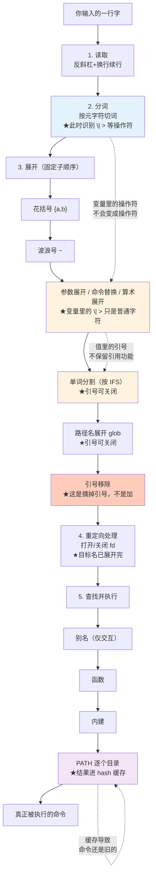

# 第 1 课：一行命令的生命周期

> 所属阶段：阶段 1《重看地基》｜ 水平：进阶 ｜ 本课知识点：shell 解析命令的完整链路、引号与转义、命令查找顺序与命令类型
> 故事情节：deploy.sh 在你机器上跑得好好的，上了 CI 第一行就炸——同一行命令，换个地方就不是同一个东西了

## 🎯 本课目标

- 说出 shell 处理一行输入的完整阶段顺序，并解释"展开"与"重定向"的相对次序
- 判断任意一处该用单引号、双引号还是不加引号，并说清"引号不嵌套传递"的后果
- 解释函数没生效、改了 PATH 命令还是旧的三类真实原因

> 本文所有输出均在本机 **WSL Ubuntu 24.04 + GNU bash 5.2.21** 实测。文中每条命令均为可独立复现的最小用例，可直接粘贴到 bash 中验证。

---

## 第一幕：起源与场景引入

> 🏛️ **起源**：Bash（Bourne-Again SHell）由 Brian Fox 于 1989 年为 GNU 项目编写，是 Stephen Bourne 1977 年 Version 7 Unix shell（sh）的自由软件替代品——名字里的 "Bourne-Again" 正是 "born again" 的双关。（核查于 2026-09）

> 🎬 **场景**：`deploy.sh` 里有这么一行，你本机跑得好好的：

```bash
tar czf backup-$(date +%F).tar.gz $SOURCE_DIR
```

上了 CI 之后，它有时生成 `backup-2026-09-03.tar.gz`，有时生成一个名字里带空格的怪文件，有时干脆报 `tar: Cowardly refusing to create an empty archive`。同一行命令，代码没变，行为变了。

---

## 第二幕：认知冲突

> ❓ **问题**：为什么同一行命令，换个环境就变成另一个东西？

直觉答案是"环境变量不同"。但真正的答案是：**你写的这行字，不是 shell 执行的东西**。

shell 拿到的是一串字符，它要经过若干次变形，才变成真正被执行的命令和参数。每一次变形都受环境（变量值、当前目录、shell 选项）影响。

你以为你在写命令，其实你在写**一段会被 shell 反复改写的模板**。

而且改写是有**严格顺序**的——顺序搞反一步，命令就变成另一个意思。下面三个知识点，讲的就是这条改写流水线。

---

## 第三幕：层层揭示

### 知识点 1：shell 解析命令的完整链路

> 本知识点关键点：读取与分词、展开发生在重定向之后、执行前才确定命令位置

#### 一句话定义

shell 处理一行输入经历**读取 → 分词 → 展开 → 重定向处理 → 查找并执行**五个阶段，其中"展开"发生在"重定向"**之后**——这个顺序是绝大多数诡异行为的根源。

#### 直觉建立（类比）

把 shell 想象成**餐厅后厨的传菜流程**：

- **读取**：服务员把客人手写的一张潦草订单拿进来（你敲的那行字）
- **分词**：把订单按空格撕成几张小票（`cmd`、`arg1`、`arg2`）
- **展开**：把小票上的缩写还原成真名（`$SOURCE_DIR` → `/data/app`、`*.log` → 三个文件名）
- **重定向**：决定这道菜（输出）送到哪张桌子
- **查找并执行**：按菜名去厨房找人做（别名 → 函数 → 内建 → PATH）

> 💡 **类比的边界**：餐厅里"送菜地点"是下单时就定好的，但 shell 里**重定向的文件名本身也要经过展开**，而且展开发生在分词之后。所以 `> $file` 中的 `$file` 若含空格，会在这一步被撕成两张票——订单上写着"送到 A 桌"，展开后变成了"送到 A"和"桌"。

#### 核心原理

五个阶段的严格顺序，以及每个阶段"认什么、不认什么"：

| 阶段 | 做什么 | 关键约束 |
|------|--------|----------|
| 1. 读取 | 按行（或 `-c` 的字符串）读入 | 反斜杠+换行在此续行 |
| 2. 分词 | 按**元字符**（空格、Tab、`|` `>` `;` `&`）切成词 | **此时**识别 `|` `>` 等操作符 |
| 3. 展开 | 花括号 → 波浪号 → 参数/命令替换/算术 → 单词分割 → 路径名(glob) | 顺序固定，见下 |
| 4. 重定向 | 打开/关闭 fd | 目标文件名**在上一步已展开完** |
| 5. 查找执行 | 别名 → 函数 → 内建 → PATH | 路径含 `/` 则跳过 PATH |

**第 3 步展开内部还有固定子顺序**（这是本课最容易记错的地方）：

```
花括号展开 {a,b}
    ↓
波浪号展开 ~
    ↓
参数展开 $var / 命令替换 $(cmd) / 算术展开 $(( ))
    ↓
单词分割（按 IFS，默认 空格/ Tab / 换行）
    ↓
路径名展开（glob：* ? [ ]）
    ↓
引号移除（注意：这是"移除引号"，不是"加上引号"）
```

两个来自这个顺序的关键推论：

1. **变量值里的 `|` `>` 不是操作符**——因为操作符在第 2 步分词时就已经定下来了，而变量到第 3 步才展开。展开出来的 `|` 只是个普通字符。
2. **glob 在单词分割之后**——所以一个未加引号的变量里如果含有 `*`，会先被撕成几个词，每个词再各自去匹配文件名。

#### 示例演示

**演示一：变量里的操作符只是普通字符**

```bash
op="|"
echo a $op b        # 不是管道，是三个参数
redir="> x.txt"
echo hi $redir      # 不是重定向，是三个参数
```

实测输出：

```
a | b
hi > x.txt
```

`echo` 老老实实把 `|` 和 `>` 当普通字符打印了出来。**想让变量里的东西变成操作符，只能用 `eval`**——而那正是注入漏洞的入口（课 13 详述）。

**演示二：重定向目标被单词分割（经典炸法）**

```bash
f="out put.txt"
echo hi > $f        # 错了：展开后是 > out put.txt
echo "exit=$?"
echo hi > "$f"      # 对了：引号阻止分割
echo "exit=$?"
```

实测输出：

```
/mnt/.../c1-kp1.sh: line 18: $f: ambiguous redirect
exit=1
exit=0
```

`ambiguous redirect`（歧义重定向）是 bash 的**保护性报错**：它发现 `> out put.txt` 的目标不是一个词而是两个，搞不清你要写哪个，于是宁可不写。这是好事——真正危险的是它不报错的那些情况。

**演示三：用 `set -x` 看见展开后的真实命令**

```bash
f="a.txt b.txt"
set -x
echo $f      # 未加引号：被分割成两个参数
echo "$f"    # 加引号：保持一个参数
set +x
```

实测输出：

```
+ echo a.txt b.txt
a.txt b.txt
+ echo 'a.txt b.txt'
a.txt b.txt
```

`+` 开头的行是 trace（走 stderr），它显示的是**展开之后、执行之前**的真实命令。注意 bash 贴心地给加了引号的版本补回了引号 `'a.txt b.txt'`，明确告诉你"这是一个参数"。

> 💡 **`set -x` 是解析链路的显微镜**：任何时候你不确定 shell 到底把你的命令改成什么样了，开 `set -x` 看一眼。这是本课最实用的一招。

**演示四：重定向的确在展开之后（可观测证据）**

怎么证明"重定向先于命令查找、且目标文件名先展开"？用一个不存在的命令：

```bash
nonexistent_cmd_xyz > created_by_redir.txt
echo "退出码=$?"
ls -1
```

实测输出：

```
/mnt/.../c1-kp1b.sh: line 8: nonexistent_cmd_xyz: command not found
退出码=127
created_by_redir.txt
```

**命令根本不存在，文件却被创建了**。这直接证明：文件是在"查找命令"之前就打开好的。同理，重定向目标里的 `$((n+1))` 也会先算出 `file2.txt` 再打开。

**演示五：赋值语句不做单词分割**

```bash
v="a b"
w=$v          # 赋值上下文：不分割
printf '[%s]\n' "$w"
```

实测输出：

```
[a b]
```

`w=$v` 虽然没加引号，但**赋值语句的右侧不做单词分割**（也不做 glob）。这是"加了引号更安全，但赋值时可以不加"的少数例外之一——不过我的建议仍是**一律加引号**，因为省下的这次思考不值得。

#### 常见误区

**误区一：以为重定向是从左到右"边解析边执行"的**

重定向确实左到右处理，但**所有重定向都在命令执行前完成**，与它在命令行中的位置无关：

```bash
echo early > early.txt    # 重定向在参数后
> late.txt echo late      # 重定向在命令前，一样有效
```

两者都正常创建了文件。所以重定向的位置是风格问题，不是语义问题——但**顺序**是语义问题（`2>&1 >f` 与 `>f 2>&1` 天差地别，课 7 详述）。

**误区二：以为 `echo hi > $empty` 会写到"空文件名"**

实测两种写法的报错都不同：

```
/mnt/...: line 48: $empty: ambiguous redirect     ← 未加引号，且分割后无词
退出码=1
/mnt/...: line 50: : No such file or directory     ← 加引号，目标就是空串
退出码=1
```

未加引号时，空的展开结果被**整个移除**（不是变成一个空词），于是 `>` 后面没有操作数，报"歧义重定向"；加了引号时空词被保留，报"No such file"。两种都失败，但原因不同——这正是"展开顺序"影响报错信息的典型例子。

#### 一句话记住

**shell 不是在执行你写的那行字，而是在执行它改写后的那行字——改写有五步，顺序写死在 shell 里，出错时开 `set -x` 看改写结果。**

---

### 知识点 2：引号与转义

> 本知识点关键点：单引号/双引号/反斜杠的作用域、引号在变量值里不保留、引号不嵌套传递

#### 一句话定义

引号不是"把字符串包起来"，而是**关闭后续展开步骤的开关**——并且，引号**不会随着变量的值被传递下去**。

#### 直觉建立（类比）

把展开过程想象成一条**流水线**，各种展开是流水线上的机器（`$` 替换机、`*` 匹配机、空格分割机）。引号的作用是**给经过的原料套上防护罩**：

- 双引号 `"`：套上大部分防护罩，但**参数展开、命令替换、算术展开这三台机器照常工作**
- 单引号 `''`：套上全面防护罩，**所有机器都停**

关键在于：**防护罩不会跟着原料一起被装进变量里带走**。变量存的是脱了罩的裸字符串。

#### 核心原理

三种引用方式的作用域：

| 写法 | 关闭的展开 | 仍生效的 |
|------|-----------|----------|
| `\x` | 仅下一个字符的特殊含义 | 其余全部 |
| `"..."` | 单词分割、glob、`~`（部分情况）、花括号 | `$var`、`` `cmd` ``/`$(cmd)`、`$(( ))`、`$'...'`（在外层） |
| `'...'` | **全部** | 无 |

以及本课最重要的一条：

> ⚠️ **引号不嵌套传递**：变量**值里面**的引号字符，在展开后是**字面字符**，不再具有引用功能。

这条解释了本课前五名的诡异 bug。

#### 示例演示

**演示一：引号不随值保留**

```bash
x="a b"
printf '[%s]\n' $x      # 未加引号：被分割成两个词
printf '[%s]\n' "$x"    # 加引号：保持一个词
```

实测输出：

```
[a]
[b]
[a b]
```

`x` 里的引号是**写的时候用的语法**，存进 `x` 的是 `a b` 三个字符（含空格，不含引号）。所以 `$x` 展开出来的是裸的 `a b`，要不要分割取决于**使用处的引号**，与**定义处**的引号无关。

**演示二：引号不嵌套传递（本课最重要）**

```bash
opts="-name '*.log'"
find . $opts            # 你以为传的是 -name 和 *.log
find . -name '*.log'    # 实际想要的效果
```

开 `set -x` 看实参（`c1-kp2b.sh`）：

```
+ find . -name ''\''*.log'\'''
+ find . -name '*.log'
./b.log
./a.log
```

第一行 trace 里那堆 `'\''` 就是铁证：`find` 收到的第二个参数是**带引号字符的** `'*.log'`，而不是 `*.log`。于是 find 去找名字里**真的含有单引号**的文件，自然一个都找不到（`find-exit=0`，静默无输出——最坏的失败方式）。

**正确做法是用数组**：

```bash
findargs=(-name '*.log')
find . "${findargs[@]}"
```

trace 显示（`c1-kp2b.sh`）：

```
+ find . -name '*.log'
./b.log
./a.log
```

数组的每个元素是独立的一个词，`'*.log'` 的引号在**数组定义时**生效（阻止 glob），展开时 `"${findargs[@]}"` 保持元素边界。这是"把一组参数传下去"的唯一正确写法，课 5 会系统展开。

> `eval "find . $opts"` 也能跑通（实测输出了 `./b.log ./a.log`），但那等于把字符串交给 shell **再解析一遍**——引号重新获得语法含义的同时，注入的门也开了。课 13 会讲它为什么危险。

**演示三：单双引号的差别**

```bash
name=world
echo "hello $name"      # 双引号：展开
echo 'hello $name'      # 单引号：原样
```

实测输出：

```
hello world
hello $name
```

双引号内三种展开照常：`$(cmd)` 和 `$(( ))` 也生效：

```bash
echo "值=$name 命令=$(echo in) 算术=$((1+2))"
echo "转义: \$name"
```

实测输出：

```
值=world 命令=in 算术=3
转义: $name
```

注意第二行：双引号内 `\$` 仍能转义 `$`——这是双引号里反斜杠**仅对 `$`、`` ` ``、`"`、`\`、换行**有效的体现。

**演示四：反斜杠在不同位置的三种命运**

```bash
printf '%s\n' a\ b      # 无引号：转义空格，不分割
printf '%s\n' "a\ b"    # 双引号内：\ 后跟普通字符，反斜杠保留
printf '%s\n' 'a\ b'    # 单引号内：全部原样
```

实测输出：

```
a b
a\ b
a\ b
```

三种写法三种结果，记住判据：**双引号里反斜杠只对 `$ ` `` ` `` ` `"` `\` 换行 五个字符有效，其余原样保留**。

**演示五：`$'...'`（ANSI-C 引用）**

```bash
printf '%s\n' $'a\tb'   # \t 被解释成真正的 Tab
```

实测输出（Tab 不可见，表现为 `a` 与 `b` 之间有制表符）：

```
a	b
```

`$'...'` 里的转义序列由 **shell** 解释（不是由 `printf`）——这是它与 `"a\tb"` 的本质区别。对比一下：

```bash
printf '%s\n' "tab:$'\t'end"    # $'...' 在双引号内不生效
```

实测输出：

```
tab:$'\t'end
```

`$'...'` 是独立的引用语法，**不能嵌在双引号里用**。

#### 常见误区

**误区一：以为变量定义时加了引号，使用时就安全了**

不会。定义处的引号管的是"值里能不能有空格"，使用处的引号管的是"值被展开后会不会被分割"。**两者独立，都需要。**

**误区二：在变量里塞引号，指望它在使用处生效**

这正是演示二。`opts="-name '*.log'"` 这种写法在 shell 里永远行不通——改用数组。

**误区三：用 `echo` 判断字符串内容**

`echo` 在不同 shell 下对 `-n`、`-e`、反斜杠的处理不一致，会污染你的判断。诊断时一律用 `printf '%s\n'` 或 `printf '[%s]\n'`——后者能让你看见首尾空格。

#### 一句话记住

**引号是"使用处"的语法，不是"值"的一部分——想把一组带空格的参数传下去，用数组，不要在字符串里塞引号。**

---

### 知识点 3：命令查找顺序与命令类型

> 本知识点关键点：别名→函数→内建→PATH 的查找顺序、hash 缓存导致的"命令还是旧的"、type 家族命令

#### 一句话定义

bash 找命令的顺序是**别名 → 函数 → 内建 → PATH**，其中 PATH 查找结果会被 **hash 表缓存**，导致"明明装了新版本却还是跑旧的"。

#### 直觉建立（类比）

把命令查找想象成**找人办事**：

- **别名**：你给某人起的绰号（"找老王"）——只在开口第一句有效，且**只在你亲自开口（交互式）时才生效**
- **函数**：你自己写的办事流程
- **内建**：前台自带的员工（不用出门找）
- **PATH**：按名单挨个办公室敲门找

而 **hash 表**是前台的"上次在哪儿找到他的"小本子——**它记得上次的门牌号，不再重新挨个敲**。这本小本子就是"改了 PATH 命令还是旧的"的元凶。

#### 核心原理

**查找顺序（严格）**：

```
1. 别名        （仅交互式，或 shopt -s expand_aliases）
2. 函数
3. 内建        （cd、echo、printf、type、builtin...）
4. PATH 逐个目录找可执行文件
```

**旁路规则**：

- 命令名**含 `/`** → 跳过 1-4，直接当路径执行（所以 `./local.sh` 与 `local.sh` 是两回事）
- `command cmd` → 跳过 1-2（别名与函数），只找内建和 PATH
- `builtin cmd` → **只**找内建
- `enable -n cmd` → 禁用某个内建

**hash 缓存**：PATH 查找成功后，bash 把"命令名 → 完整路径"记进 hash 表，下次直接用，**不再重扫 PATH**。

#### 示例演示

**演示一：`type -a` 看一个名字的多种身份**

```bash
type -a echo
type -a cd
type -a ls
```

实测输出：

```
echo is a shell builtin
echo is /usr/bin/echo
echo is /bin/echo
---
cd is a shell builtin
---
ls is /usr/bin/ls
ls is /bin/ls
```

`echo` 同时是内建和 `/usr/bin/echo`——内建优先。`cd` 只有内建（它必须是内建：外部进程改不了父进程的当前目录）。`ls` 只有外部命令。

**演示二：函数遮蔽外部命令**

```bash
ls() { echo "假 ls: $*"; }
type -a ls
ls /tmp
command ls /tmp >/dev/null && echo "command ls 绕过函数成功"
```

实测输出：

```
ls is a function
ls () 
{ 
    echo "假 ls: $*"
}
ls is /usr/bin/ls
ls is /bin/ls
假 ls: /tmp
command ls 绕过函数成功
```

函数排在内建和 PATH 之前，所以能遮蔽 `ls`。这就是**测试替身（stub）**的原理——课 12 讲 bats 时会用它把 `rm`、`ssh` 换成假函数。

`command ls` 跳过函数，找到真的 `ls`。

**演示三：hash 缓存——装了新版本却跑旧的**

这个坑的默认触发条件很反直觉，我实测复现了：

```bash
# dirA 此时是空的，PATH 里 dirA 在前
export PATH=/tmp/c1h2/dirA:/tmp/c1h2/dirB:/usr/bin:/bin
mytool                    # 只找到 dirB 的版本 → hash 记住 dirB
hash -l | grep mytool

# 现在往 dirA 装了新版本（dirA 在 PATH 更前面）
printf '#!/bin/sh\necho 我是 dirA 的新版本\n' > /tmp/c1h2/dirA/mytool
mytool                    # 仍然跑旧的！

hash -d mytool            # 清掉这一条缓存
mytool                    # 现在是新的
```

实测输出：

```
我是 dirB 的老版本
builtin hash -p /tmp/c1h2/dirB/mytool mytool
我是 dirB 的老版本
我是 dirA 的新版本
```

**关键观察**：第三次调用时，dirA 的新版本**已经在 PATH 更靠前的位置了**，但 bash 根本没去 PATH 里找——它直接用了 hash 里记的 `/tmp/c1h2/dirB/mytool`。

> 💡 **这个坑的真实触发场景**：脚本开头调用了一次某命令（PATH 里还没有你新装的版本），中途修改了 PATH 或安装了新版本，后续调用仍然走旧的。在 CI 里装依赖然后立刻调用，最容易踩到。

**解法**：`hash -d <name>` 删单条，`hash -r` 清空整张表。

好消息是：**缓存的路径失效后 bash 会自动重查**。实测把 dirB 的 `mytool` 删掉后：

```
我是 dirA 的新版本
退出码=0
builtin hash -p /tmp/c1h2/dirA/mytool mytool
```

它发现缓存路径不存在，重新扫了 PATH，并**顺手更新了缓存**。所以这个坑只在"旧路径仍然存在"时才会咬人。

**演示四：别名在脚本里默认是关的**

这是个高频误解——很多人把 `.bashrc` 里的 alias 写进脚本，然后发现没生效：

```bash
alias ll='ls -l'
ll
echo "退出码=$?"
```

实测输出：

```
非交互脚本中 expand_aliases=off
/tmp/c1alias.sh: line 4: ll: command not found
退出码=127
```

`expand_aliases` 在非交互 shell 中**默认 off**。显式 `shopt -s expand_aliases` 后才生效（实测开启后正常输出 `ls -l` 的结果，退出码 0）。

> 📌 **实践结论**：**不要在脚本里用别名**。脚本需要复用一段逻辑，用函数——函数没有这个开关问题，还能传参。别名是给交互式偷懒用的。

**演示五：别名只在"命令位置"展开**

即使在交互式下，别名也有位置限制：

```bash
alias G='| grep'
printf 'abc\ndef\n' | grep a    # 正常：grep 在命令位置
printf 'abc\ndef\n' G a         # G 不在命令位置 → 不展开
```

实测输出：

```
abc
abc
def
```

第二行输出了两行——`G` 被当成普通参数打印出来了，别名没展开。

而且别名**只在命令位置**展开，管道符后的位置实测也不算（`printf 'x' | C` 中 `C` 报 `command not found`）。

**演示六：PATH 的三种"空"，行为各不相同**

这块我实测出了**两个反直觉的结果**，值得单独记住：

```bash
# 1) PATH 未设置 → bash 回落到编译期默认 PATH
env -u PATH bash -c 'echo "PATH=[$PATH]"; ls >/dev/null; echo "ls 退出码=$?"'
```

实测输出：

```
内部 PATH=[/usr/local/sbin:/usr/local/bin:/usr/sbin:/usr/bin:/sbin:/bin]
ls 退出码=0
```

**PATH 未设置时，bash 会自己补一个默认 PATH**（`/usr/local/sbin:/usr/local/bin:/usr/sbin:/usr/bin:/sbin:/bin`），所以 `ls` 照样能找到——这解释了为什么 `env -u PATH` 后命令还能跑。

```bash
# 2) PATH 含空元素 → 该元素代表"当前目录"
PATH=":/usr/bin:/bin" bash -c 'inner.sh'      # 前导空元素 → 找到当前目录的脚本
PATH="/usr/bin:/bin"  bash -c 'here.sh'       # 无空元素 → 找不到
```

实测输出：

```
我在 sub 目录
  前导空元素：退出码=0
bash: line 1: here.sh: command not found
  无空元素：退出码=127
```

> ⚠️ **安全提示**：PATH 里的空元素（前导冒号、尾随冒号、连续冒号）等于"把当前目录加入搜索路径"。这意味着**你在 `/tmp` 下运行一个脚本，别人预先放一个同名的 `ls` 在 `/tmp`，就会被优先执行**——这就是经典的 PATH 劫持。永远不要在 PATH 里留空元素。

至于 `PATH=""` 这种写法：在变量赋值场景下（`PATH="" cmd`），bash 把空串当成"含一个空元素"，于是只搜当前目录；而 `env -u PATH` 是真正没设置，走默认 PATH。**两者行为相反**，调试时别搞混。

#### 常见误区

**误区一：以为改了 PATH 就能立刻用上新版本**

见演示三的 hash 缓存。改完 PATH 后不放心，就 `hash -r`。

**误区二：把 `.bashrc` 的 alias 搬进脚本**

见演示四。脚本里用函数。

**误区三：以为 `which` 能看出脚本里会执行什么**

`which` 只看 PATH，看不见别名、函数、内建。脚本里要判断用 `type -a` 或 `command -v`。

#### 一句话记住

**命令是按"别名 → 函数 → 内建 → PATH"找的，PATH 结果会进 hash 缓存——"装了新版还是跑旧的"查 hash，"脚本里 alias 没生效"是因为它默认只对交互 shell 开。**

---

## 第四幕：实操验证

回到第一幕的那个故障。现在你能解释它了：

```bash
tar czf backup-$(date +%F).tar.gz $SOURCE_DIR
```

用本课的三块知识拆解这行命令的三种失败：

**失败一：生成名字里带空格的怪文件**

`$SOURCE_DIR` 未加引号。若它的值是 `/data/my app`，展开后经过**单词分割**变成两个参数 `/data/my` 和 `app`，于是命令变成：

```bash
tar czf backup-2026-09-03.tar.gz /data/my app
```

`tar` 收到了**两个**要打包的路径——于是它打包了 `/data/my` 和 `app`（当前目录下的 `app`），而不是你想要的那个带空格的目录。

**修复**：`tar czf "backup-$(date +%F).tar.gz" "$SOURCE_DIR"`

**失败二：报 `Cowardly refusing to create an empty archive`**

`$SOURCE_DIR` 为空且未加引号时，展开结果被**整个移除**——`tar` 没收到任何要打包的路径，于是它拒绝创建空归档。**这是好事**：如果它老老实实建了个空包，你的"备份"就静默变成了"什么都没备份"。

**修复**：加上 `"$SOURCE_DIR"`，并**显式校验变量非空**（课 11 的输入校验）。

**失败三：换个环境行为就变**

`$(date +%F)` 的输出依赖 locale 与时区；`$SOURCE_DIR` 的值依赖环境变量是否设置。这行命令**本身就是一段模板**，它的最终形态由环境决定。

**验证手法**：任何时候怀疑"命令变成了别的样子"，开 `set -x`：

```bash
set -x
tar czf "backup-$(date +%F).tar.gz" "$SOURCE_DIR"
set +x
```

trace 行会显示展开后的真实命令——这是解析链路唯一的"显微镜"。

> 📌 **本课的核心方法论**：以后遇到"这行为什么在我这儿好好的、换个地方就炸"，按五阶段链路**逐段问**：
> ① 分词时操作符是我要的吗？② 展开后变量变成了什么？③ 有没有被单词分割？④ 有没有被 glob？⑤ 命令是从哪儿找到的？
> 五问下来，绝大多数"玄学"都能定位到具体阶段。

---

## 第五幕：体系收束

本课是**阶段 1 的地基第一块**，它给后面所有内容提供了**归因框架**：

```
本课（解析链路）
    ↓ 展开的具体规则 → 课 2《展开全家桶》
    ↓ 命令执行后的结果 → 课 3《退出码与条件》
    ↓ 重定向的细节 → 课 7《重定向与 fd》
    ↓ 路径查找与 PATH → 贯穿全程（尤其课 9 的 cron 环境）
```

三个知识点与后续的关系：

- **解析链路**（本课）是"为什么炸"的归因框架——后续每一课的"诡异行为"，最终都能归到链路的某一环
- **引号**（本课）在课 2 展开讲"为什么加了引号还是错"，在课 5 讲"数组才是传参的正解"
- **命令查找**（本课）在课 8 讲"子进程继承什么"时复用，在课 12 讲"stub 遮蔽命令"时复用

**阶段 1 的故事进展**：`deploy.sh` 的第一行为什么炸，你已经能解释了。但还没完——`$SOURCE_DIR` 该怎么校验、`$(date +%F)` 有没有更好的写法，都是课 2 的事。

---

## 🐞 常见误区

| 误区 | 真相 | 出处 |
|------|------|------|
| 变量里的 `\|` `>` 会当操作符 | 不会。操作符在**分词**阶段就定了，变量展开在其后 | KP1 演示一 |
| 定义时加了引号，使用就安全 | 两处独立。定义处管"值能含空格"，使用处管"会不会被分割" | KP2 演示一 |
| 变量里塞引号能在使用时生效 | 不能。值里的引号是字面字符，用数组 | KP2 演示二 |
| 赋值 `w=$v` 会被分割 | 赋值右侧不做分割也不做 glob | KP1 演示五 |
| 重定向位置影响语义 | 不影响（但**顺序**影响，课 7） | KP1 演示四 |
| 命令不存在时不会创建重定向文件 | 会创建——重定向先于命令查找 | KP1 演示四 |
| `.bashrc` 的 alias 脚本里能用 | 非交互 shell 默认 `expand_aliases=off`，用函数 | KP3 演示四 |
| 改了 PATH 就能用新版本 | hash 缓存会拦。`hash -d` 或 `hash -r` | KP3 演示三 |
| `PATH=""` 等于没有搜索路径 | 相反：空串被当成"含一个空元素"= 当前目录；`env -u PATH` 才是走默认 PATH | KP3 演示六 |
| PATH 里的空元素无害 | 等于把当前目录加入搜索路径，是 PATH 劫持入口 | KP3 演示六 |

---

## 一图总结



**一句话概括全课**：shell 执行的是它**改写后**的命令，改写有五步固定顺序；引号是**使用处**的语法而非值的一部分；命令查找有优先级且 PATH 结果会进缓存。

---

## 课后小测

<details>
<summary>第 1 题（概念）</summary>

命令 `op="|"; echo a $op b` 的输出是什么？为什么 `|` 没有起到管道作用？

**答案**：输出 `a | b`。
因为 `|` 作为操作符是在**第 2 步分词**时识别的，而 `$op` 要到**第 3 步展开**才变成 `|`——展开出来的 `|` 只是普通字符，被 `echo` 当作参数打印。

</details>

<details>
<summary>第 2 题（概念）</summary>

```bash
x="a b"
printf '[%s]\n' $x
printf '[%s]\n' "$x"
```

两行各输出什么？这说明了引号的什么性质？

**答案**：第一行输出 `[a]` 和 `[b]`（两行），第二行输出 `[a b]`（一行）。
说明**引号不随变量值保留**：`x` 存的是 `a b` 三个字符（不含引号），使用处的引号才决定是否分割。定义处的引号与使用处的引号是两回事。

</details>

<details>
<summary>第 3 题（概念）</summary>

`opts="-name '*.log'"; find . $opts` 为什么找不到文件？正确写法是什么？

**答案**：`$opts` 展开后，值里的单引号是**字面字符**，find 收到的第二个参数是带引号的 `'*.log'`，于是去找名字里真含单引号的文件，结果为空（且退出码 0，静默失败）。
正确写法用数组：`findargs=(-name '*.log'); find . "${findargs[@]}"`。

</details>

<details>
<summary>第 4 题（应用）</summary>

脚本里 `nonexistent_cmd > out.txt` 执行后，`out.txt` 存在吗？这证明了什么？

**答案**：存在（空文件，0 行）。
证明**重定向发生在命令查找之前**——shell 先把文件打开好，再去查找命令；命令找不到（退出码 127）也不影响文件已被创建。

</details>

<details>
<summary>第 5 题（应用）</summary>

你在脚本开头调用了 `mytool`，然后安装了新版本到 PATH 更前面的目录，再次调用却还是旧版本。为什么？怎么解决？

**答案**：因为 **hash 缓存**——第一次调用成功后，bash 把 `mytool → 旧路径` 记进 hash 表，后续调用直接用缓存路径，**不再重扫 PATH**。
解决：`hash -d mytool` 删这一条，或 `hash -r` 清空整表。
补充：如果旧路径已经被删除，bash 会发现缓存失效并自动重查，所以这个坑只在"旧路径仍然存在"时才咬人。

</details>

<details>
<summary>第 6 题（应用）</summary>

你在 `.bashrc` 里定义了 `alias ll='ls -l'`，写进脚本后提示 `ll: command not found`。为什么？脚本里应该用什么替代别名？

**答案**：因为非交互 shell 中 `expand_aliases` 默认是 **off**，别名不展开。
脚本里应该用**函数**代替别名——函数没有开关问题、能传参、且能被 `command` 绕过，是脚本内复用逻辑的正确方式。

</details>

<details>
<summary>第 7 题（辨析）</summary>

下面关于 PATH 的说法，哪些正确？

A. `env -u PATH bash -c 'ls'` 会因为找不到 ls 而失败
B. `PATH="" cmd` 中的空串表示"没有搜索路径"
C. PATH 中出现前导冒号（如 `:/usr/bin`）等于把当前目录加入搜索路径
D. PATH 中的空元素是安全的，因为它只是被忽略

**答案**：只有 **C** 正确。
- A 错：PATH 未设置时，bash 回落到**编译期默认 PATH**（`/usr/local/sbin:...:/bin`），`ls` 照样能找到。
- B 错：空串被当作"含一个空元素"，而空元素代表**当前目录**，所以反而能找到当前目录的脚本。
- D 错：空元素等于把当前目录加入搜索路径，是 **PATH 劫持**的经典入口，必须避免。

</details>

<details>
<summary>第 8 题（综合）</summary>

回到第一幕的故障命令：

```bash
tar czf backup-$(date +%F).tar.gz $SOURCE_DIR
```

当 `$SOURCE_DIR` 未设置时，`tar` 报 `Cowardly refusing to create an empty archive`。请按五阶段链路解释：为什么不加引号的**空变量**会导致这个报错？这个报错是好事还是坏事？

**答案**：
链路解释：`$SOURCE_DIR` 未加引号且值为空时，第 3 步展开产生**零个词**（空展开结果被整个移除，不是变成空词），于是 `tar` 只收到 `czf` 和归档名，**没有任何要打包的路径**。tar 检测到"你要我打包零个文件"，判断这几乎肯定是参数错误，于是拒绝创建空归档。

**这是好事**。如果它老老实实建了个空 tar 包，你的"备份"就静默变成了"什么都没备份"——等到真要恢复时才发现。tar 的这个保护把静默失败变成了显式报错。

修复：加引号 `"$SOURCE_DIR"`，并显式校验非空（课 11 讲输入校验的系统做法）。

</details>

---

---

## 📌 本课速览

- **解析五阶段**：读取 → 分词 → 展开 → 重定向 → 查找执行。操作符在**分词**时定，变量在**展开**时才替换
- **引号不随值传递**：定义处的引号管"值里能否含空格"，使用处的引号管"会不会被分割"，两者独立
- **命令查找四级**：别名 → 函数 → 内建 → PATH，PATH 结果进 **hash 缓存**
- **诊断手法**：`set -x` 看展开后的真实命令，是后续每一课的通用归因工具

---

## 🧭 课程导航

| 上一课 | 本课 | 下一课 |
|--------|------|--------|
| —（阶段 1 第一课） | **课 1：一行命令的生命周期** ✅ | [课 2：展开全家桶](lesson-02-展开全家桶.md) |

- 返回：[课程目录](../../../02-课程目录.md) ｜ [阶段 1 概览](../overview.md) ｜ [学习路径总览](../../../01-学习路径总览.md)

---

## 🚀 下一批接力提示词

> 学完本批后，**复制下面这段文字发给 AI**，即可无缝进入下一批（无需重新描述上下文）：

```
继续学 Bash 编程。我的学习档案在 shell/00-学习档案.md，
刚学完阶段 1《重看地基》的课《一行命令的生命周期》知识点 shell 解析命令的完整链路、引号与转义、命令查找顺序与命令类型，
请按大纲继续讲解下一批知识点。
```
