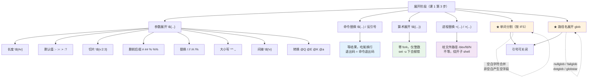

# 第 2 课：展开全家桶

> 所属阶段：阶段 1《重看地基》｜ 水平：进阶 ｜ 本课知识点：参数展开全集、单词分割与路径名展开、命令替换/算术展开/进程替换
> 故事情节：一段"能用"的日志清理脚本，在文件名带空格的机器上删错了文件——展开没搞清，"能跑"和"跑对了"差着一层

## 🎯 本课目标

- 用参数展开替代 `basename` / `dirname` / `cut` 等外部命令，并说清性能差异的量级
- 解释并修复"文件名带空格就崩"，会用 `nullglob` / `failglob` 让 glob 安全
- 说清 `$()` 与反引号、`$(( ))` 与 `(( ))`、进程替换与管道的本质差别

> 本文所有输出均在本机 **WSL Ubuntu 24.04 + GNU bash 5.2.21** 实测。文中每条命令均为可独立复现的最小用例，可直接粘贴到 bash 中验证。

---

## 第一幕：起源与场景引入

> 🏛️ **起源**：参数展开的 `${var#pattern}` / `${var%pattern}` 语法源自 **KornShell（ksh88，1988）**，用于在不 fork 外部进程的前提下做字符串处理——`basename` / `dirname` 在 1970 年代的 Unix 上都是独立可执行文件，每次调用都要 fork+exec。bash 完整继承了这套语法，并在 4.x 后陆续加入大小写转换（4.0）、`@Q`/`@E` 等转换操作符（4.4）。（核查于 2026-09）

> 🎬 **场景**：一段跑了两年的日志清理脚本：

```bash
for f in $(ls /var/log/app/*.log); do
    name=$(basename "$f")
    day=${name%%_*}
    [ "$day" \< "$CUTOFF" ] && rm "$f"
done
```

在大多数机器上它工作正常。某天换到一台新机器，日志文件名里出现了空格（`app server_2026-09-01.log`），这个脚本删掉了 `/var/log/app/` 下一个**名字叫 `app` 的文件**——而那个文件不是日志。

代码没变，行为变了。**问题出在"展开"这一层**。

---

## 第二幕：认知冲突

> ❓ **问题**：`for f in $(ls *.log)` 为什么会把一个文件名拆成两个？

课 1 讲过解析五阶段：分词 → 展开 → 重定向 → 执行。这里的 `$(ls *.log)` 属于**第 3 步展开**中的命令替换。

关键在**子顺序**：命令替换之后，还有**单词分割**和**路径名展开**两步等着。命令替换的输出是一整块字符串，这块字符串会被**再分割一次**，然后每个词再各自去 glob。

所以 `ls` 输出的 `app server_2026-09-01.log` 被空格切成两个词，`for` 就拿到了两个"文件名"。

**更反直觉的是**：这个错和 `$(ls)` 有关，但**不是 `ls` 的错**。真正的元凶是"命令替换的输出会再走一遍分割与 glob"这条规则。

> 💡 顺带一提，`for f in $(ls ...)` 本身就是**反模式**——glob 已经能给出文件列表，不需要 `ls` 掺和。正确写法是 `for f in /var/log/app/*.log`。本课会把这类"多此一举"逐个拆掉。

---

## 第三幕：层层揭示

### 知识点 1：参数展开全集

> 本知识点关键点：默认值/切片/删除前后缀/替换/大小写/间接展开/`@` 转换操作符

#### 一句话定义

参数展开是一套**零 fork 的字符串处理 DSL**——`${var##*/}` 就是 `basename`，`${var%.*}` 就是去扩展名，全部在 shell 内部完成。

#### 直觉建立（类比）

把变量想象成**一根带刻度的绳子**。参数展开的各种符号是**不同的剪刀和模具**：

- `${#s}`：量一下多长
- `${s:2:3}`：从第 2 格开始剪 3 格
- `${s#*/}`：从**绳头**开始，剪掉**最短**一段能匹配 `*/` 的部分
- `${s%.*}`：从**绳尾**开始，剪掉**最短**一段能匹配 `.*` 的部分
- `${s/-/_}`：把绳子里的 `-` 换成 `_`

> 💡 **记忆锚点**：`#` 在键盘上靠**左** → 处理**开头**（前缀）；`%` 靠**右** → 处理**结尾**（后缀）。
> 单个 = **最短匹配**（non-greedy），双个 = **最长匹配**（greedy）。

> 💡 **类比的边界**：真实绳子剪掉就没了，参数展开**不修改原变量**——它只产生一个新字符串。想"剪完存回去"必须显式赋值：`f=${f##*/}`。

#### 核心原理

完整语法族（按用途分组）：

| 分类 | 语法 | 作用 |
|------|------|------|
| 长度 | `${#var}` | 字符数（数组用 `${#arr[@]}` 取元素个数） |
| 默认值 | `${var:-默认}` | var 未设置**或为空** → 用默认值 |
| | `${var-默认}` | 仅 var **未设置** → 用默认值（空串保留） |
| | `${var:=默认}` | 同上，但**顺带赋值给 var** |
| | `${var:+替换}` | var 非空 → 整个替换成"替换" |
| | `${var:?报错}` | var 未设置或为空 → 打印错误并**退出** |
| 切片 | `${var:offset}` `${var:offset:length}` | 支持负 offset（前面要留空格） |
| 删前缀 | `${var#pat}` / `${var##pat}` | 最短 / 最长 |
| 删后缀 | `${var%pat}` / `${var%%pat}` | 最短 / 最长 |
| 替换 | `${var/pat/rep}` | 替换**第一个** |
| | `${var//pat/rep}` | 替换**全部** |
| | `${var/#pat/rep}` | 仅匹配**开头**才换 |
| | `${var/%pat/rep}` | 仅匹配**结尾**才换 |
| 大小写 | `${var^^}` `${var,,}` | 全大写 / 全小写 |
| | `${var^}` `${var,}` | 首字母大写 / 小写 |
| | `${var^^e}` | 只转换指定字符 |
| 间接 | `${!var}` | 取 var 的**值作为变量名**，再取其值 |
| | `${!prefix*}` `${!prefix@}` | 列出匹配前缀的所有变量名 |
| 转换 | `${var@Q}` `@E` `@P` `@A` `@K` `@a` `@U` `@L` | 见下表 |

**`@` 转换操作符**（bash 4.4+）：

| 操作符 | 作用 |
|--------|------|
| `@Q` | 生成**可直接粘回脚本**的引号形式 |
| `@E` | 展开值里的反斜杠转义序列（`\t` → 真 Tab） |
| `@P` | 按提示符规则展开（`\u` `\h` 等） |
| `@A` | 生成 `declare` 赋值语句 |
| `@K` | 关联数组 → `"k1" "v1" "k2" "v2"` 形式 |
| `@a` | 返回变量的属性标志（如 `i` 整数、`x` 导出、`r` 只读） |
| `@U` / `@L` | 全大写 / 全小写 |

#### 示例演示

**演示一：删前后缀 = 免费的 basename / dirname**

```bash
path="/usr/local/bin/foo"
echo "删一个=[${path#*/}"      # 错：#*/ 只删最短
echo "删最长*/=[${path##*/}]"  # = basename
```

实测输出：

```
删最短到/=[usr/local/bin/foo]
删最长*/=[foo]
```

注意 `${path#*/}` 得到的是 `usr/local/bin/foo`——**不是** `foo`。因为 `#` 是最短匹配，`*/` 最短能匹配的就是第一个 `usr/`。要取 basename 必须用 `##`。

后缀同理，且**多级扩展名**的差别最能体现最短/最长：

```bash
f="archive.tar.gz"
echo "%删最短=[${f%.*}]"    # archive.tar
echo "%%删最长=[${f%%.*}]"  # archive
```

实测输出：

```
%删最短=[archive.tar]
%%删最长=[archive]
```

**去扩展名用 `%`（只要去掉最后一段）**，取主名用 `%%`。写反了就会得到 `archive.tar` 而你以为拿到 `archive`。

**演示二：替换的四种形态**

```bash
s="a-b-c-d"
echo "首个=[${s/-/_}]"      # a_b-c-d
echo "全部=[${s//-/_}]"     # a_b_c_d
echo "前缀匹配=[${s/#a/X}]" # X-b-c-d
echo "前缀不匹配=[${s/#b/X}]" # 不变
echo "后缀匹配=[${s/%d/Y}]" # a-b-c-Y
```

实测输出：

```
首个=[a_b-c-d]
全部=[a_b_c_d]
前缀匹配=[X-b-c-d]
前缀不匹配=[a-b-c-d]
后缀匹配=[a-b-c-Y]
```

`#` / `%` 在这里是**锚定**的意思：不匹配就不替换，**不会报错**。

**演示三：切片与负偏移**

```bash
p="abcdefghij"
echo "从2开始=[${p:2}]"     # cdefghij
echo "从2取3=[${p:2:3}]"    # cde
echo "负偏移=[${p: -3}]"    # hij
echo "负长度=[${p:2:-3}]"   # cdefg
```

实测输出：

```
从2开始=[cdefghij]
从2取3=[cde]
负偏移=[hij]
负长度=[cdefg]
```

> ⚠️ **负偏移前必须留空格**：`${p:-3}` 会被解析成"默认值"语法（`-3` 是默认值），必须写成 `${p: -3}`。这是本课最容易记错的一个字符。

**演示四：默认值四兄弟的实际差别**

```bash
unset u
n=""
v="set"
echo "1 [${u:-默认}]"   # 默认
echo "2 [${u-默认}]"    # 默认
echo "3 [${n:-默认}]"   # 默认  ← 空串也用默认
echo "4 [${n-默认}]"    # （空） ← 空串保留
echo "5 [${v:+有值}]"   # 有值
echo "6 [${v+有值}]"    # 有值
```

实测输出：

```
1 [默认]
2 [默认]
3 [默认]
4 []
5 [有值]
6 [有值]
```

**加不加冒号的区别只在"变量已设置但为空"这一种情况**：

- `:-` / `:=` / `:+` / `:?`（**带冒号**）：空串**视同未设置**
- `-` / `=` / `+` / `?`（**不带冒号**）：空串是**有效值**

> 💡 **实用判据**：绝大多数场景你要的是**带冒号**的版本。不带冒号的版本只在"空串和未设置必须区别对待"时才用（比如允许用户显式传空值来关闭某功能）。

`:=` 会**顺带赋值**——这是它与 `:-` 的唯一差别：

```bash
unset w
echo "use=[${w:=赋值了}]"
echo "after=[$w]"      # 赋值了
```

`:?` 是**输入校验的最短写法**：

```bash
( echo "try=[${req:?缺少必需参数}]" )
echo "子shell退出码=$?"
```

实测输出：

```
c2-kp1.sh: line 36: req: 缺少必需参数
子shell退出码=1
```

**它会自动带上脚本名和行号**，比手写 `if [ -z ] ; then echo; exit 1; fi` 省事且信息更全。

**演示五：`set -u` 下默认值仍然安全**

脚本开了 `set -u`（课 11 详述）后，直接用未设置变量会崩，但默认值语法安全：

```bash
set -u
unset opt
echo "值=[${opt:-默认}]"    # 正常输出"默认"
( echo "$opt" )             # 报错退出
```

实测输出：

```
值=[默认]
c2-kp1b.sh: line 76: opt: unbound variable
退出码=1
```

**这是 `${var:-}` 在严格模式下的核心价值**——它让你既能享受 `set -u` 的保护，又能优雅处理可选参数。

**演示六：间接展开 `${!var}`**

```bash
real="真值"
ref="real"
echo "间接=[${!ref}]"    # 真值
```

`ref` 的值是 `real`，`${!ref}` 于是去取 `real` 的值。

> ⚠️ **`${!arr[@]}` 是另一种语义**：在数组上它表示"取所有下标"，**不是**间接展开。同一个符号两种含义，看上下文：
> ```bash
> arr=(one two three)
> echo "${!arr[@]}"    # 0 1 2（下标）
> echo "${arr[1]}"     # two
> ```

间接展开**不支持嵌套**——`${!${w}}` 会报 `bad substitution`（实测确认）。需要多层间接时用 **nameref**（bash 4.3+，课 4 详述）：

```bash
declare -n nr=real
echo "nameref: [$nr]"    # 真值
nr="改过了"               # 会改到 real
echo "real=[$real]"      # 改过了
```

**`${!prefix*}` 与 `${!prefix@}` 的差别**在加引号时才显现（与 `$*` / `$@` 同构）：

```bash
aa=1; ab=2; bb=3
printf 'a* 加引号: [%s]\n' "${!a*}"    # 一个词
printf 'a@ 加引号: [%s]\n' "${!a@}"    # 多个词
```

实测输出：

```
a* 加引号: [aa ab]
a@ 加引号: [aa]
a@ 加引号: [ab]
```

`${!a@}` 加引号后展开成**两个独立的词**（printf 被调了两次）。

**演示七：`@Q` — 生成可复用引号**

```bash
s="it's a \"test\""
printf 'Q=[%s]\n' "${s@Q}"
eval "printf '回读=[%s]\n' ${s@Q}"
```

实测输出：

```
原始=[it's a "test"]
Q=['it'\''s a "test"']
回读=[it's a "test"]
```

`@Q` 的输出可以**直接粘回脚本或 eval** 而保持原值——这是生成配置文件、写日志时的利器。注意它用的是 `'\''` 这个经典的单引号内嵌单引号技巧。

**演示八：`@K` 与关联数组重建**

```bash
declare -A m=([name]=tom [age]=18)
printf 'K=[%s]\n' "${m[@]@K}"
declare -A m2="( ${m[@]@K} )"
printf 'm2[name]=%s m2[age]=%s\n' "${m2[name]}" "${m2[age]}"
```

实测输出：

```
K=[age "18" name "tom" ]
m2[name]=tom m2[age]=18
```

`@K` 把关联数组序列化成 `"k" "v"` 形式，**可以直接喂给另一个 `declare -A`**——这是 bash 里传递关联数组进函数的标准手法（课 5 详述）。

**`@a` 查属性**：

```bash
declare -i i=1; declare -l low=ABC; declare -u up=abc
declare -x exported=1; declare -r ro=1
```

实测：`i`→`i`，`low`→`l`，`up`→`u`，`exported`→`x`，`ro`→`r`。

#### 常见误区

**误区一：用 `${path#*/}` 取 basename**

得到的是去掉第一段的结果，不是 basename。正确的是 `${path##*/}`（双 `#`）。

**误区二：`${p:-3}` 想取最后三个字符**

`:-` 是默认值语法。必须写 `${p: -3}`（冒号后留空格）。

**误区三：以为 `${var/pat/rep}` 会替换全部**

单斜杠只替换第一个。全部要 `//`。

**误区四：`${!var}` 指向的变量不存在时会报错**

实测：不会报错，展开为**空串**，退出码 0。这是个隐藏 bug 源——你以为拿到了值，其实是空的。

#### 一句话记住

**`${var##*/}` 是 basename，`${var%.*}` 去扩展名，`:-` 给默认值，`:?` 做校验——全部零 fork，比外部命令快两三个数量级。**

---

### 知识点 2：单词分割与路径名展开

> 本知识点关键点：IFS 的空白/非空白差异、glob 无匹配时原样保留、nullglob/failglob/dotglob/globstar、extglob 的解析期错误

#### 一句话定义

展开之后、执行之前，结果还要过两关：**单词分割**（按 `IFS` 切）和**路径名展开**（glob）。加引号能同时关掉这两关——这是引号最主要的用途。

#### 直觉建立（类比）

把展开流水线想象成**邮件分拣**：

- **单词分割**：按 `IFS` 这个"分隔印章"把一整段文字切成一张张明信片
- **路径名展开**：每张明信片上如果画着 `*`（通配符），就去找所有匹配的文件，把一张变成一沓

**引号就是给明信片套了个塑料袋**——既切不开，也匹配不了。

关键在于：**这两步发生在所有替换之后**。所以命令替换、参数展开产出的内容，统统都要再过一遍这两关——这正是第二幕那个 bug 的根源。

#### 核心原理

**IFS（Internal Field Separator）默认值是空格、Tab、换行**。它有一条容易被忽略的**不对称规则**：

| IFS 字符类型 | 连续出现时 | 前导/尾随 |
|-------------|-----------|----------|
| **空白字符**（空格/Tab/换行） | **合并成一个**分隔符 | **忽略** |
| **非空白字符**（如 `:` `,`） | **每个都是分隔符**，产生**空字段** | **产生空字段** |

这条规则解释了大量"为什么我的 `IFS=: read` 多了一个空字段"的问题。

**glob 的元字符**：`*`（任意长）、`?`（单个）、`[...]`（字符集）。它们**只在未加引号时**生效。

**glob 相关 shell 选项**（`shopt`）：

| 选项 | 默认 | 作用 |
|------|------|------|
| `nullglob` | off | 无匹配 → 展开成**空**（而不是原样保留） |
| `failglob` | off | 无匹配 → **报错并退出** |
| `dotglob` | off | `*` 是否匹配隐藏文件 |
| `globstar` | off | `**` 是否递归匹配子目录 |
| `nocaseglob` | off | 大小写不敏感 |
| `extglob` | **off（脚本中）** | 启用 `@()` `!()` `?()` `*()` `+()` 扩展模式 |

#### 示例演示

**演示一：IFS 的不对称规则（本课最反直觉）**

```bash
line="a:b::c"
IFS=':'
printf '[%s]\n' $line      # 非空白分隔符，不合并
```

实测输出：

```
[a]
[b]
[]
[c]
```

**中间那个空字段是真的存在**——`::` 之间有个空字符串。而空格（空白字符）会合并：

```bash
v="a  b   c"
printf '[%s]\n' $v         # 连续空格合并成一个
```

实测输出（只有三个词，没有空字段）：

```
[a]
[b]
[c]
```

尾随分隔符的行为也遵循同一规则：

```
"a:b:"   → [a] [b]                 （非空白：尾随不产生空字段）
":a:b"   → [] [a] [b]              （非空白：前导产生空字段）
```

> 💡 **判据**：处理 `/etc/passwd` 这类冒号分隔数据时，用 `IFS=: read -r` 而不是 `IFS=: ; set -- $line`——`read` 的字段切分不会让你被空字段绊倒。

**演示二：`read` 与 IFS 的正确组合**

```bash
data="root:x:0:0:root:/root:/bin/bash"
IFS=: read -r user _ uid gid _ home shell <<< "$data"
echo "user=$user uid=$uid gid=$gid home=$home shell=$shell"
```

实测输出：

```
user=root uid=0 gid=0 home=/root shell=/bin/bash
```

三个要点：
1. `IFS=: ` 是**命令前缀**，只影响这一条 `read`，不会污染后续
2. `-r` **必须加**——不加的话反斜杠会被吃掉（见下）
3. `_` 是惯用的"丢弃字段"变量名

`-r` 的实测差异：

```bash
printf 'x\\ty\n' | { read -r r1; printf 'read -r =[%s]\n' "$r1"; }
printf 'x\\ty\n' | { read r2;   printf '普通read=[%s]\n'  "$r2"; }
```

实测输出：

```
read -r =[x\ty]
普通read=[xty]
```

**不加 `-r`，反斜杠被当转义符吃掉了**。读路径、读正则时必须加 `-r`。

**演示三：`$@` 与 `$*` 的四种形态**

```bash
set -- "a b" "c d"
printf '[%s]\n' $*       # 未加引号：再分割
printf '[%s]\n' $@       # 未加引号：也再分割
printf '[%s]\n' "$*"     # 合并成一个词
printf '[%s]\n' "$@"     # 保持每个参数的边界
```

实测输出：

```
-- $* 未加引号 --
[a] [b] [c] [d]
-- $@ 未加引号 --
[a] [b] [c] [d]
-- "$*" --
[a b c d]
-- "$@" --
[a b]
[c d]
```

> ⚠️ **未加引号的 `$@` 和 `$*` 行为完全一样**——都会再分割。`"$@"` 的特殊性**只在加了引号时才存在**。这是"永远写 `"$@"`"的原因。（课 6 详述）

**演示四：glob 无匹配时原样保留（危险默认）**

```bash
ls -1              # a.log b.log c.txt
for f in *.md; do echo "处理 [$f]"; done
```

实测输出：

```
处理 [*.md]
```

**没有任何 `.md` 文件，循环却执行了一次**，`$f` 的值是字面量 `*.md`。如果循环体是 `rm "$f"`，你就会去删除一个叫 `*.md` 的文件——如果它恰好存在，就被误删了。

**演示五：`nullglob` / `failglob` 让 glob 安全**

```bash
shopt -s nullglob
count=0
for f in *.nonexistent; do count=$((count+1)); done
echo "nullglob 下循环次数=$count"     # 0
shopt -u nullglob
for f in *.nonexistent; do printf '进入循环 [%s]\n' "$f"; done
```

实测输出：

```
nullglob 下循环次数=0
进入循环 [*.nonexistent]
默认下循环次数=1（把字面量当文件名了）
```

`failglob` 则更严格——直接报错：

```
c2-kp2.sh: line 53: no match: *.md
退出码=1
```

> 💡 **选择建议**：
> - 遍历文件用 **`nullglob`**（无文件就跳过，符合直觉）
> - 参数必须是已存在文件用 **`failglob`**（快速失败，不静默）
> - 两者**不要同时开**：`nullglob` 优先，`failglob` 永远不会触发

**演示六：`dotglob` 与隐藏文件**

```bash
touch .hidden
echo "默认=[$(echo *)]"
shopt -s dotglob
echo "dotglob 后=[$(echo *)]"
```

实测输出：

```
默认 *.log 不含隐藏: [a.log b.log c.txt]
dotglob 后: [.hidden a.log b.log c.txt]
```

默认 `*` **不匹配以点开头的文件**——这是 shell 的设计，避免 `rm -rf *` 把 `.git`、`.ssh` 一起删了。

**演示七：`globstar` 让 `**` 递归**

```bash
shopt -s globstar
echo "**/*.log=[$(echo **/*.log)]"
```

实测输出：

```
默认 **/*.log=[**/*.log]
globstar 后 **/*.log=[a.log b.log x/y/z/deep.log]
```

未开启时 `**` 等价于单个 `*`（只匹配一层）；开启后 `**/` 匹配**任意深度**的目录。

> 💡 **`globstar` 不能替代 `find`**：它不跟随符号链接、无法按时间/大小过滤、对大量文件性能差。需要复杂条件时仍用 `find`（课 10）。

**演示八：`extglob` — 需先开启，且是解析期特性**

这是本课**最容易踩的坑**，我实测确认了它的报错方式：

```bash
shopt -s extglob          # 必须先开
echo "@(file1|file2).txt = [$(echo @(file1|file2).txt)]"
echo "!(fileA).txt        = [$(echo !(fileA).txt)]"
```

实测输出（开启后）：

```
@(file1|file2).txt = [file1.txt file2.txt]
!(fileA).txt       = [file1.txt file2.txt]
file?(1).txt       = [file1.txt]
file*(1).txt       = [file1.txt]
file+(1).txt       = [file1.txt]
```

五种模式：`@(a|b)` 恰好一个、`!(a)` 非、`?(a)` 零或一个、`*(a)` 零或多个、`+(a)` 一个或多个。

**未开启时不是"匹配失败"，而是语法错误**：

```bash
# /tmp/c2eg_noext.sh
echo "这行本该先执行"
echo @(a|b)
```

运行它的实测输出：

```
这行本该先执行
/tmp/c2eg_noext.sh: line 2: syntax error near unexpected token `('
退出码=2
```

等等——第一行**确实执行了**？这与我的预期相反。真正发生的是：bash **逐行解析执行**脚本（不像编译型语言先解析整个文件），第一行先执行了，解析到第二行才发现语法错误。

> 📌 **这是课 1 解析链路的直接印证**：bash 是"读一行 → 解析一行 → 执行一行"。语法错误发生在**解析该行时**，此时前面的行已经执行完了。**所以 `shopt -s extglob` 必须写在任何使用 extglob 语法的行之前**——写在文件末尾是没用的。
>
> 更稳妥的做法：需要 extglob 时，把它放在脚本**顶部**；或者干脆避免 extglob，用 `find` / `grep` 过滤。

#### 常见误区

**误区一：`for f in $(ls *.log)`**

`ls` 的输出会被再分割，文件名带空格就崩。正确写法 `for f in *.log`——glob 直接给出正确分隔的文件列表。

**误区二：以为加了引号就绝对安全**

引号关掉的是**分割和 glob**，但命令替换内部、算术展开内部有各自的规则。而且**引号位置**错了照样出事（`"$@"` vs `$@`）。

**误区三：开着 `nullglob` 时给命令传 glob 参数**

`grep pattern *.log` 在 `nullglob` 下若无 `.log` 文件，会变成 `grep pattern`——**没有文件参数时 grep 会去读标准输入**，然后挂住等你输入。这是 `nullglob` 的副作用。

**误区四：以为 `**` 天生递归**

默认不递归，需要 `shopt -s globstar`。

#### 一句话记住

**展开之后还有分割和 glob 两关，引号是唯一的通关符；glob 无匹配时默认是"原样保留"这个危险行为，用 `nullglob`/`failglob` 关掉它。**

---

### 知识点 3：命令替换、算术展开与进程替换

> 本知识点关键点：`$()` vs 反引号、命令替换吃尾换行与退出码、`$(( ))` vs `(( ))`、进程替换的子 shell 规避

#### 一句话定义

三种"把别的东西变成字符串"的机制：**命令替换**把命令输出变字符串，**算术展开**把表达式变数字，**进程替换**把命令输出变**文件**。

#### 直觉建立（类比）

把三者想象成**三种外卖方式**：

- **`$()` 命令替换**：外卖送到门口，你**必须等**它到了才能继续（`$(...)` 会阻塞等待）；而且包装盒（尾部换行）会被扔掉
- **`$(( ))` 算术展开**：这是你自己在家算的，**不用出门**，零成本
- **`<(...)` 进程替换**：外卖被放进一个**取餐柜**，你拿到的是**柜子编号**（一个文件路径），可以稍后再去取——**不用等**

关键差别就在**等不等**和**拿到的是什么**。

#### 核心原理

**命令替换**：

| | `$()` | 反引号 |
|---|-------|--------|
| 嵌套 | 直接嵌套 `$(a $(b))` | 需转义 `` \` `` |
| 转义 | 内部规则清晰 | `\` `$` `` ` `` 的转义复杂易错 |
| 可读性 | 好 | 差（与单引号混淆） |
| 结论 | **总是用 `$()`** | 仅兼容老 shell 时用 |

两个重要行为：
1. **吃掉所有尾部换行**：`$(printf 'a\n\n\n')` 得到的是 `a`（长度 1）
2. **退出码就是被替换命令的退出码**：`r=$(false)` 后 `$?` 是 1

**算术展开 `$(( ))`**：
- 变量名**不需要** `$` 前缀
- 未设置变量当 **0**（但 `set -u` 下会报错！）
- 只做**整数**运算
- 支持 `+ - * / % **`、位运算 `& | ^ ~ << >>`、三元 `?:`、逗号、进制 `0x` `0b` `base#num`

**进程替换 `<(...)` / `>(...)`**：
- 展开结果是一个**文件路径**（WSL 下是 `/dev/fd/63`）
- `<(...)`：从这个路径**读**到命令的输出
- `>(...)`：往这个路径**写**，内容进命令的输入
- **不等**命令结束

#### 示例演示

**演示一：`$()` vs 反引号的嵌套**

```bash
echo "反引号嵌套: [$(echo `echo \`echo hi\``)]"   # 要转义
echo "\$() 嵌套: [$(echo $(echo $(echo hi)))]"    # 直接写
```

实测两者都输出 `hi`，但反引号那行的转义已经让人眼花。**永远用 `$()`。**

**演示二：命令替换吃掉尾部换行**

```bash
out=$(printf 'a\n\n\n')
printf '长度=%s 值=[%s]\n' "${#out}" "$out"
```

实测输出：

```
长度=1 值=[a]
```

三个换行全被吃掉了。补测确认：`printf 'a\n\n\n'` 写进文件是 4 字节，命令替换后只剩 1 字符。

> 💡 **影响**：`$(cat file)` 会丢失文件末尾的空行。要**逐字节**保留必须用文件重定向或 `mapfile`（课 5）。多数场景无所谓，但校验和、二进制数据处理时会咬人。

**演示三：命令替换的退出码（与 `set -e` 的交互）**

```bash
( set -e; r=$(false); echo "这行不会执行" )
echo "退出码=$?"
```

实测输出：

```
退出码=1
```

`set -e` **确实会捕获**赋值语句中命令替换的失败——因为赋值语句整体的退出码就是命令替换的退出码。

**但是**，当命令替换作为参数传给另一个命令时，情况不同：

```bash
( set -e; echo "$(false)"; echo "这行会执行吗" )
echo "退出码=$?"
```

实测输出：

```
（空行）
这行会执行吗
退出码=0
```

`echo` 成功了（退出码 0），于是 `set -e` 认为一切正常——**命令替换的失败被 `echo` 的成功掩盖了**。

**演示四：`local` 掩盖退出码（本课最阴的坑）**

```bash
f() { local r; r=$(false); echo "函数内继续"; return 0; }
f; echo "退出码=$?"
```

实测输出：

```
函数内继续
退出码=0
```

`r=$(false)` 失败了，但函数继续往下走。原因：**`local r` 和 `r=$(false)` 写成一行时（`local r=$(false)`），整行的退出码是 `local` 的退出码（0）**，命令替换的失败被吃掉。

正确写法是**把声明和赋值分开，并显式检查**：

```bash
g() { local r; r=$(false) || return $?; }
g; echo "正确写法退出码=$?"
```

实测输出：`正确写法退出码=1`。

> 📌 **规则**：`local x=$(cmd)` 会吞掉 `cmd` 的失败。**永远写成 `local x` 然后 `x=$(cmd) || return $?`**。（课 11 详述 `set -e` 的完整失效清单）

**演示五：算术展开的语法便利性**

```bash
x=5
echo "x+1=$((x+1))"                  # 变量名不加 $
echo "自增: $((x++)) -> x=$x"        # 5 -> x=6
echo "三元: $(( x > 3 ? 10 : 20 ))"
echo "逗号: $((x=1, x+5))"
echo "位运算: 5&3=$((5&3)) 5|3=$((5|3)) 5^3=$((5^3)) ~5=$((~5))"
echo "移位: 1<<4=$((1<<4))"
echo "进制: 0xff=$((0xff)) 2#101=$((2#101))"
```

实测输出：

```
1+2=3
x+1=6
自增: 5 -> x=6
三元: 10
逗号: 6
位运算 5&3=1 5|3=7 5^3=6 ~5=-6
移位 1<<4=16
进制 0xff=255 2#101=5
```

**演示六：算术里的两个陷阱（实测纠正了我的预期）**

**陷阱一：`set -u` 下算术展开并不安全**

我原本以为"未设置变量在算术里当 0"是无条件成立的。实测：

```
set -u 下 $((zz + 1))：
c2-kp3b.sh: line 76: zz: unbound variable
```

`set -u` **会**让算术展开报错。所谓"当 0"只在未开 `set -u` 时成立。严格模式下要写 `${zz:-0}`。

**陷阱二：前导零是八进制**

```bash
echo "08 = $((08))"      # 报错！
echo "10#08 = $((10#08))"  # 8
```

实测输出：

```
c2-kp3b.sh: line 81: 08: value too great for base (error token is "08")
10#08 = 8
```

**`08`、`09` 会直接报错**（八进制里没有 8、9）。处理 `date +%m` 得到的 `08`、`09` 时必踩。解法是用 `10#` 强制十进制：`$((10#$month))`。

**演示七：`$(( ))` vs `(( ))` 的退出码相反直觉**

```bash
(( 1 )); echo "(( 1 )) 退出码=$?"
(( 0 )); echo "(( 0 )) 退出码=$?"
```

实测输出：

```
(( 1 )) 退出码=0
(( 0 )) 退出码=1
```

**与 C 语言相反**：算术结果**非零**时退出码是 **0**（成功），结果为 **0** 时退出码是 **1**（失败）。

所以 `(( n ))` 作为条件才是正确的用法——`if (( n ))` 表示"n 非零时"（课 3 详述）。

**演示八：进程替换给的是一个文件路径**

```bash
echo "实际=$(echo <(echo hi))"
```

实测输出：

```
实际=/dev/fd/63
```

`<(...)` 展开后是一个**文件路径**（WSL 下在 `/dev/fd/`）。这意味着它可以用在**任何需要文件参数的地方**：

```bash
diff <(sort a.txt) <(sort b.txt)
```

实测输出（a.txt 是 1-3，b.txt 是 1-4）：

```
3a4
> 4
diff 退出码=1
```

**不需要创建任何临时文件**。这是进程替换最经典的用途。

**演示九：进程替换 vs 管道 — 子 shell 才是关键差别**

这是本课**最有实用价值**的一点：

```bash
count=0
printf 'a\nb\n' | while read -r l; do count=$((count+1)); done
echo "管道后 count=$count"

count=0
while read -r l; do count=$((count+1)); done < <(printf 'a\nb\n')
echo "进程替换后 count=$count"
```

实测输出：

```
管道后 count=0  （子 shell 隔离）
进程替换后 count=2  （当前 shell）
```

**管道的右侧在子 shell 中执行**，变量修改出不来；**进程替换不会创建子 shell**，`while` 循环在当前 shell 里跑，`count` 能被保留。

> 📌 **这是"while read 循环里改的变量不见了"的标准解法**。另一个解法是 here-string `<<<`，但那要求数据已在变量里。

**演示十：进程替换拿不到退出码**

```bash
( exit 3 ) > >(cat > /dev/null)
echo "上面退出码=$?"
```

实测输出：`上面退出码=3`。

咦，拿到的是 3？这是因为**这里 `>(cat > /dev/null)` 是重定向目标，主体命令 `( exit 3 )` 的退出码正常传播**。

真正的问题是**反向**：你拿不到 `>(...)` **里面**那个命令的退出码：

```bash
echo hello > >(grep nonexistent; echo "grep 退出码=$?")
```

`grep` 失败了，但外层命令的退出码仍是 0——**进程替换内部的失败完全被吞掉**。

> 💡 **判据**：需要知道命令**是否成功** → 用 `$()` 或管道（配合 `pipefail`）；只需要命令的**输出** → 用进程替换。

#### 常见误区

**误区一：用反引号**

可读性差、嵌套要转义、与单引号混淆。一律用 `$()`。

**误区二：以为 `$(( ))` 能做浮点**

不能。`echo $((3/2))` 是 `1`。浮点要用 `awk` 或 `bc`。

**误区三：`local x=$(cmd)`**

吞掉 `cmd` 的失败（见演示四）。分开写。

**误区四：以为进程替换能拿到退出码**

拿不到。且 `>(...)` 内部命令是**异步**的——外层脚本结束时它可能还没跑完，需要 `wait` 或显式同步。

#### 一句话记住

**`$()` 等结果且吃尾换行，`$(( ))` 零成本但只有整数，`<( )` 给文件路径且能绕开子 shell——三者的选择取决于"要不要等"和"要不要退出码"。**

---

## 第四幕：实操验证

回到第一幕那个删错文件的脚本：

```bash
for f in $(ls /var/log/app/*.log); do
    name=$(basename "$f")
    day=${name%%_*}
    [ "$day" \< "$CUTOFF" ] && rm "$f"
done
```

用本课三块知识逐个拆解：

**问题一：`$(ls *.log)` 多此一举且有害**

glob `*.log` 在 `ls` **之前**就已经被 shell 展开了，`ls` 只是把已经正确的文件列表**重新拼成一个字符串**，然后命令替换的输出又被**再分割一次**。文件名带空格时，这一来一回就把它切成了两个。

**修复**：去掉 `ls`，直接 `for f in /var/log/app/*.log`。glob 产出的就是正确分隔的文件列表。

**问题二：`basename` 完全没必要**

`${f##*/}` 就在 shell 内部完成，实测性能差**两三个数量级**：

```
-- 用 basename 1000 次 --
real    0m1.008s
-- 用 ${path##*/} 1000 次 --
real    0m0.002s
```

1000 次调用：1.008 秒 vs 0.002 秒，**约 500 倍**。日志清理这类循环里，这个差距直接决定脚本是"秒级"还是"分钟级"。

**问题三：`${name%%_*}` 用对了，但逻辑仍危险**

`%%` 是**最长匹配**，对 `app server_2026-09-01.log` 会删到**第一个** `_` 之前，得到 `app server`——这个值与 `$CUTOFF` 比较时，`[ "$day" \< "$CUTOFF" ]` 是按**字符串**比较的，`app server` 与日期比较结果不可预测。

**修复后的版本**：

```bash
shopt -s nullglob            # 无匹配时安全跳过
for f in /var/log/app/*.log; do
    name=${f##*/}            # 零 fork 的 basename
    day=${name%%_*}          # 取第一个 _ 之前
    [[ $day =~ ^[0-9]{4}-[0-9]{2}-[0-9]{2}$ ]] || continue   # 校验格式
    [[ $day < $CUTOFF ]] && rm -- "$f"
done
```

改动说明：
- 去掉 `ls` 与 `basename`（**零 fork**）
- `shopt -s nullglob` 让无匹配时不进循环
- 用**正则校验**日期格式，不合法就跳过（课 3 讲 `=~`）
- `rm -- "$f"` 的 `--` 防止文件名以 `-` 开头被当选项

> 📌 **本课的方法论**：写 shell 时问自己三个问题 ——
> ① 这里真的需要外部命令吗？（参数展开能做的别 fork）
> ② 这里的输出会不会被再分割？（命令替换、`$@`、未加引号的变量）
> ③ glob 无匹配时会怎样？（默认危险，用 `nullglob`/`failglob`）

---

## 第五幕：体系收束

本课是**阶段 1 的能力层**——课 1 给了归因框架，本课给了"不用外部命令就能干活"的工具箱：

```
课 1（归因框架：五阶段链路）
    ↓ 本课填充"展开"这一阶段的三类展开
    ↓ 参数展开 → 课 5 数组（@K、${!arr[@]}）
    ↓ 单词分割 → 课 6 "$@" 陷阱、课 10 NUL 分隔
    ↓ 进程替换 → 课 7 fd 与重定向、课 8 子 shell
    ↓ 算术展开 → 课 3 (( )) 作为条件
```

三个知识点与后续的关系：

- **参数展开**在课 5 讲数组时复用 `${arr[@]@K}`，在课 11 讲输入校验时复用 `:-` `:?`
- **单词分割与 glob** 是课 6 `"$@"` 陷阱的前置，也是课 10「find/xargs 与 NUL 分隔」的根因
- **进程替换**在课 7 讲 fd 时揭晓它其实是 `/dev/fd/N`，在课 8 讲子 shell 时复用"绕开子 shell"这个技巧

**阶段 1 的故事进展**：日志清理脚本删错文件的原因，你已经能定位到"命令替换输出被再分割"这一环了。但还有一个没解决的问题——`[ "$day" \< "$CUTOFF" ]` 这种比较为什么不可靠、退出码该怎么判断，那是**课 3《退出码与条件》**的事。

---

## 🐞 常见误区

| 误区 | 真相 | 出处 |
|------|------|------|
| `${path#*/}` 取 basename | 得到去掉第一段的结果，正确是 `${path##*/}` | KP1 演示一 |
| `${p:-3}` 取最后三个字符 | `:-` 是默认值语法，必须 `${p: -3}`（留空格） | KP1 演示三 |
| `${var/pat/rep}` 替换全部 | 单斜杠只换第一个，全部要 `//` | KP1 演示二 |
| `${!var}` 指向不存在的变量会报错 | 不报错，展开为空串、退出码 0（隐藏 bug 源） | KP1 补测 |
| `set -u` 下 `${var:-默认}` 会崩 | 不会，默认值语法在 `set -u` 下安全 | KP1 演示五 |
| `for f in $(ls *.log)` 没问题 | 输出被再分割，文件名带空格就崩 | KP2 演示/第四幕 |
| glob 无匹配时循环不执行 | 默认**会执行一次**，`$f` 是字面量 `*.md` | KP2 演示四 |
| `**` 天生递归 | 需 `shopt -s globstar` | KP2 演示七 |
| extglob 语法随时可用 | 需先 `shopt -s extglob`，且必须写在使用它的行之前 | KP2 演示八 |
| `local x=$(cmd)` 能捕获失败 | 吞掉失败，退出码是 `local` 的 0 | KP3 演示四 |
| 算术里未设置变量总当 0 | `set -u` 下会报 unbound variable | KP3 演示六 |
| `$((08))` 就是 8 | 前导零是八进制，报错；用 `10#08` | KP3 演示六 |
| `(( 0 ))` 退出码是 0 | 是 **1**（与 C 相反） | KP3 演示七 |
| 进程替换能拿到内部命令退出码 | 拿不到，内部失败被吞 | KP3 演示十 |

---

## 一图总结



**一句话概括全课**：展开分三类——参数展开是零 fork 的字符串 DSL（比外部命令快约 500 倍），命令替换等结果但吃尾换行，进程替换给文件路径且能绕开子 shell；而它们产出的所有内容，都还要再过**单词分割**和 **glob** 这两关。

---

## 课后小测

<details>
<summary>第 1 题（概念）</summary>

写出下面各表达式的结果：

```bash
p="/usr/local/bin/foo"
echo "${p#*/}"
echo "${p##*/}"
f="archive.tar.gz"
echo "${f%.*}"
echo "${f%%.*}"
```

并说明：取 basename 该用哪个？去扩展名该用哪个？

**答案**：
```
usr/local/bin/foo
foo
archive.tar
archive
```
- **取 basename 用 `${p##*/}`**（双 `#`，最长匹配）
- **去扩展名用 `${f%.*}`**（单 `%`，最短匹配，只去掉最后一段）

记忆锚点：`#` 靠左管开头，`%` 靠右管结尾；单个最短，双个最长。

</details>

<details>
<summary>第 2 题（概念）</summary>

`set -u` 已开启，`opt` 未设置。下面两段各输出什么？为什么？

```bash
echo "值=[${opt:-默认}]"
echo "$opt"
```

**答案**：第一段输出 `值=[默认]`；第二段报错 `opt: unbound variable` 并退出（退出码 1）。

原因：`:-` 这类默认值语法**在 `set -u` 下仍然安全**——它明确声明了"未设置时用默认值"的意图，不属于"使用未绑定变量"。这也是 `${var:-}` 在严格模式下的核心价值：既能享受 `set -u` 的保护，又能优雅处理可选参数。

</details>

<details>
<summary>第 3 题（概念）</summary>

`IFS=':'` 时，`a:b::c` 被分割成几个字段？如果 `IFS=' '`（空格），`a  b   c` 被分割成几个字段？为什么不同？

**答案**：前者 4 个字段（`a`、`b`、**空串**、`c`）；后者 3 个字段（`a`、`b`、`c`）。

原因：**IFS 的空白字符与非空白字符规则不对称**——
- 空白字符（空格/Tab/换行）：连续出现**合并成一个**分隔符，前导尾随**忽略**
- 非空白字符（如 `:`）：**每个都是**分隔符，连续出现会**产生空字段**

</details>

<details>
<summary>第 4 题（应用）</summary>

目录下没有任何 `.md` 文件时，下面代码输出什么？如何让它在无匹配时**不执行**循环体？

```bash
for f in *.md; do echo "处理 [$f]"; done
```

**答案**：输出 `处理 [*.md]` —— 循环**执行了一次**，`$f` 是字面量 `*.md`。

因为 glob 无匹配时 bash 的默认行为是**原样保留**模式字符串。

让循环安全跳过：`shopt -s nullglob`（无匹配则展开为空，循环 0 次）。
若希望快速失败则用 `shopt -s failglob`（报错退出，退出码 1）。
**两者不要同时开**（nullglob 优先，failglob 永不触发）。

</details>

<details>
<summary>第 5 题（应用）</summary>

下面函数为什么吞掉了失败？改成能正确传播失败的版本。

```bash
f() { local r=$(false); echo "继续"; return 0; }
```

**答案**：因为 `local r=$(false)` 写在一行时，**整行的退出码是 `local` 内建命令的退出码（0）**，命令替换 `$(false)` 的失败被掩盖了。

正确写法（声明与赋值分开，显式检查）：

```bash
f() { local r; r=$(false) || return $?; echo "继续"; return 0; }
```

实测：改后退出码为 1。

</details>

<details>
<summary>第 6 题（应用）</summary>

你在脚本里写 `shopt -s globstar` 放在文件末尾，然后在文件开头用了 `**/*.log`。会怎样？这与课 1 的哪个知识点有关？

**答案**：**不行**，`**` 不会递归。

因为 bash 是**读一行 → 解析一行 → 执行一行**（课 1 的解析链路）。`shopt -s globstar` 必须写在**任何使用 `**` 语法的行之前**才会生效；写在末尾时，前面的行早已解析执行完了。

这个陷阱对 **extglob 更严重**：未开启 extglob 时使用 `@(a|b)` 不是"匹配失败"，而是**语法错误**（`syntax error near unexpected token`，退出码 2）。

</details>

<details>
<summary>第 7 题（辨析）</summary>

关于 `$(( ))` 与 `(( ))`，哪些说法正确？

A. `$((08))` 的结果是 8
B. `(( 0 ))` 的退出码是 0
C. `set -u` 下 `$((undefined_var + 1))` 会报错
D. `$(( ))` 里引用变量要写 `$` 前缀

**答案**：只有 **C** 正确。
- A 错：前导零表示**八进制**，`08` 会报 `value too great for base`。要用 `10#08` 强制十进制。
- B 错：`(( 0 ))` 的退出码是 **1**（与 C 语言相反：算术结果非零 → 退出码 0）。
- D 错：`$(( ))` 里变量名**不需要** `$` 前缀（写了也行，但没必要）。

</details>

<details>
<summary>第 8 题（综合）</summary>

下面两段代码，运行后 `count` 分别是多少？为什么？

```bash
count=0
printf 'a\nb\n' | while read -r l; do count=$((count+1)); done
echo "count=$count"

count=0
while read -r l; do count=$((count+1)); done < <(printf 'a\nb\n')
echo "count=$count"
```

**答案**：第一段 `count=0`，第二段 `count=2`。

原因：**管道的右侧在子 shell 中执行**，变量修改无法传回父 shell，所以第一段里 `count` 的累加全丢了。

**进程替换 `<(...)` 不创建子 shell**，`while` 循环在当前 shell 里执行，所以第二段的 `count` 被正确保留。

这是"while read 循环里改的变量不见了"的标准解法。

</details>

---

---

## 📌 本课速览

- **参数展开是零 fork 的字符串 DSL**：`${p##*/}` = basename，`${f%.*}` = 去扩展名，实测快约 **500 倍**
- **记忆锚点**：`#` 靠左管开头、`%` 靠右管结尾；单个最短、双个最长；负偏移前要留空格
- **IFS 不对称**：空白字符连续合并，非空白（`:`）连续产生**空字段**
- **glob 无匹配默认原样保留**（危险）→ `nullglob` / `failglob` 关掉它
- **`local x=$(cmd)` 吞掉失败**；**`(( ))` 退出码与 C 相反**；**进程替换绕开子 shell**
- **自问三句**：① 真需要外部命令吗？② 输出会不会被再分割？③ glob 无匹配会怎样？

---

## 🧭 课程导航

| 上一课 | 本课 | 下一课 |
|--------|------|--------|
| [课 1：一行命令的生命周期](lesson-01-一行命令的生命周期.md) | **课 2：展开全家桶** ✅ | 课 3：退出码与条件（待编写） |

- 返回：[课程目录](../../../02-课程目录.md) ｜ [阶段 1 概览](../overview.md) ｜ [学习路径总览](../../../01-学习路径总览.md)

---

## 🚀 下一批接力提示词

> 学完本批后，**复制下面这段文字发给 AI**，即可无缝进入下一批（无需重新描述上下文）：

```
继续学 Bash 编程。我的学习档案在 shell/00-学习档案.md，
刚学完阶段 1《重看地基》的课 2《展开全家桶》知识点 参数展开全集、单词分割与路径名展开、命令替换算术展开与进程替换，
请按大纲继续讲解课 3《退出码与条件》的三个知识点。
```
