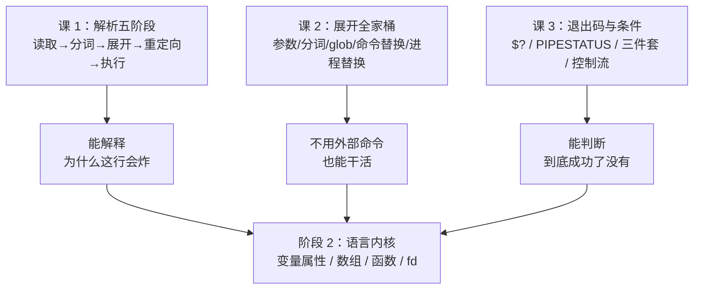
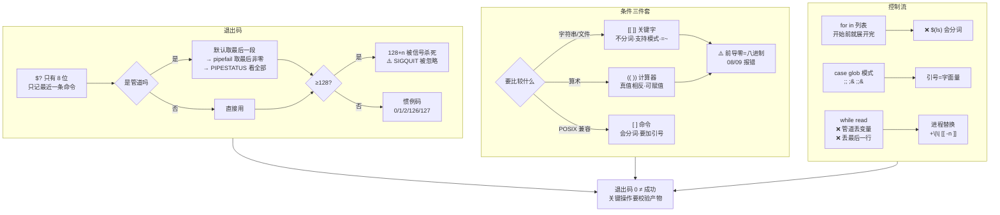

# 第 3 课：退出码与条件

> 所属阶段：阶段 1《重看地基》｜ 水平：进阶 ｜ 本课知识点：退出码的真相、条件测试三件套、控制流细节
> 故事情节：脚本明明报错了，`$?` 却是 0——deploy.sh 一路"成功"地跑完了失败的流程

## 🎯 本课目标

- 解释管道中 `$?` 取的是谁的值，判断进程是正常退出还是被信号杀死
- 在 `[[ ]]` / `[ ]` / `(( ))` 之间正确选择，并用 `=~` 做正则匹配
- 写对 `for` 的两种形态，用 `case` 替代长串 `elif`

---

## 第一幕：起源与场景引入

> 🎬 **场景**：`deploy.sh` 里有这么一段"备份成功才继续"的逻辑：

```bash
tar czf "$backup" "$src" | gzip -9 > "$final"
if [ $? -eq 0 ]; then
    echo "备份成功"
    rm -rf "$src"
fi
```

某次磁盘满了，`tar` 失败，但脚本打印了"备份成功"，然后**把源目录删了**。

这不是假想。本课第四幕会在本机把这段 bug 完整复现出来——看着源目录真的消失——再逐版修复它。

---

## 第二幕：认知冲突

> ❓ **问题**：`tar` 明明失败了，`$?` 为什么是 0？

因为 `$?` 取的是**管道最后一个命令** `gzip` 的退出码。`tar` 写不出东西，`gzip` 收到一个空输入照样正常退出——它诚实地报告"我干完了"，于是整条管道"成功"。

实测（`c3-fix3.sh`）：

```console
--- 构造 tar 失败、gzip 成功的管道 ---
  PIPESTATUS = [2 0]
  单纯 $? = 0   <-- 只看 $? 会上当
```

**`$?` 是 0，而第一段 `tar` 的退出码是 2。** 于是 `if [ $? -eq 0 ]` 成立，脚本欢快地删掉了源目录。

这引出两个必须搞清楚的问题：**`$?` 到底是谁的？** 以及 **判断条件该怎么写才不会骗你？**

---

## 第三幕：层层揭示

### 知识点 1：退出码的真相

> 本知识点关键点：`$?` 只反映最近一个命令、管道默认取最后一段（以及 `pipefail` 与 `PIPESTATUS`）、被信号杀死时是 `128+n`、退出码惯例（0 成功 / 1 通用 / 2 用法错 / 126 不可执行 / 127 未找到 / 128+n 信号）、退出码只有 8 位（`exit 256` → 0）

#### 一句话定义

退出码是进程留给父进程的**唯一一个 0–255 的整数**，用来回答"我干成了没有"。

#### 直觉建立（类比）

退出码是程序的**临终遗言**——但只允许说一个 0 到 255 之间的数字，说多了会绕回去。

而且这句遗言**极易被覆盖**：你问"上一句说的是什么"，必须在问下一句之前立刻记下来。shell 里的 `$?` 就是这样——任何一条命令（包括 `echo`、`printf`、甚至一次变量赋值）都会把它冲掉。

#### 核心原理

**1. 管道默认取最后一段**

```console
$ faker_tar | gzip -9
faker_tar: 磁盘已满，写不出数据
faker_tar | gzip   -> $? = 0   （这是 gzip 的码，不是 tar 的）
faker_tar 单独跑   -> $? = 2
```

反过来的情形也一样——管道码就是最后一段的码：

```console
echo | gzip        -> $? = 0   （gzip 成功）
echo | (exit 3)    -> $? = 3   （最后一段失败，管道码就是它）
```

**2. `PIPESTATUS` 数组逐段查看**

`PIPESTATUS` 保存最近一条管道**每一段**的退出码：

```console
PIPESTATUS 全部元素: [2 0]
  第1段 faker_tar = 2
  第2段 gzip      = 0
```

但它有个极其阴险的特性：**读取它的动作本身就会毁掉它**。

```console
faker_tar | gzip -9
第一次读（整数组）: [2 0]
第二次读（元素 0）: [0]   <-- 已被上一行的 echo 冲掉
第三次读（元素 1）: []    <-- 空，数组只剩一个元素
```

连只取一个元素也躲不掉：

```console
a=${PIPESTATUS[0]}
b=${PIPESTATUS[0]}
a=2  b=0   <-- b 已经被赋值 a 那行冲成 0 了
```

**正确姿势只有一种：管道的下一行立刻整个存进数组。**

```bash
cmd1 | cmd2 | cmd3
st=("${PIPESTATUS[@]}")     # 必须是紧接着的下一行
echo "第1段=${st[0]} 第3段=${st[2]}"   # 之后随便读
```

为什么赋值也不行？因为**赋值语句本身就是一条命令**：

```console
只跑一个冒号后 PIPESTATUS = [0]
只做一次赋值后 PIPESTATUS = [0]   <-- 赋值也是命令
立刻存下来 = [2 0]
```

**3. `pipefail` 的语义：取"最后一个非零"，不是"第一个失败"**

这是本课最容易被记错的一条。实测三段管道（`seg1` 返回 2、`seg3` 返回 5）：

```console
pipefail off -> $? = 5   （末尾 seg3 的 5）
pipefail on  -> $? = 5   （末尾非零的 5，不是第一个失败的 2）
```

中段失败、末段成功的对照最能说明问题——**这正是 `pipefail` 存在的意义**：

```console
中段失败/末段成功 pipefail off -> $? = 0   （丢失！）
中段失败/末段成功 pipefail on  -> $? = 7   （捞回来了）
```

再验证"最后一个非零"而**不是**"最大值"：

```console
9 然后 4 pipefail on -> $? = 4   （若是取最大应是 9）
4 然后 9 pipefail on -> $? = 9   （若是取最大也应是 9）
```

两次结果不同，且都等于最后一个非零段——证明规则是"最后一个非零"，跟大小无关。

**4. 被信号杀死 = `128 + n`**

```console
kill -TERM (15) -> $? = 143   （128+15）
kill -INT (2)   -> $? = 130   （128+2）
kill -KILL (9)  -> $? = 137   （128+9）
```

注意 `143` 和"主动 `exit 143`"在 `$?` 上**完全无法区分**：

```console
exit 143        -> $? = 143   （主动退出）
kill -TERM      -> $? = 143   （被杀）
  二者 $? 相同，区别在 WIFSIGNALED；shell 里可用 128+n 反推：n = 15
```

想要真正区分，得用 `wait` 的返回值或外部工具——shell 层面只能靠约定反推。

**⚠️ 实测发现：`SIGQUIT` 是个例外**

按公式 `SIGQUIT`(3) 应该是 131，但本机实测：

```console
  SIGHUP   -> 129
  SIGINT   -> 130
  SIGQUIT  -> 0      <-- 不是 131！
  SIGILL   -> 132
  SIGTRAP  -> 133
  SIGABRT  -> 134
  SIGBUS   -> 135
  SIGFPE   -> 136
  SIGKILL  -> 137
  SIGUSR1  -> 138
  SIGSEGV  -> 139
  SIGUSR2  -> 140
  SIGPIPE  -> 141
  SIGALRM  -> 142
  SIGTERM  -> 143
```

原因是**非交互式 bash 默认忽略 `SIGQUIT`**，信号被丢弃，脚本继续往下跑：

```console
bash -c 'kill -QUIT $$; echo "  QUIT 之后这行还执行了 -> 说明信号被忽略"'
  QUIT 之后这行还执行了 -> 说明信号被忽略
```

更反直觉的是，显式 `trap - QUIT` 想恢复默认处置**也不管用**：

```console
trap - QUIT 后 kill -QUIT   -> 0
trap "exit 131" QUIT        -> 131   <-- 只有自己写 handler 才有效
```

写成独立脚本文件一样是 0。**结论：别依赖 `SIGQUIT` 做清理，也不要假设 `128+3` 会出现。**

**5. 退出码只有 8 位**

```console
exit 0   -> 0
exit 255 -> 255
exit 256 -> 0   <-- 绕回
exit 257 -> 1   <-- 绕回
exit -1  -> 255   <-- 负数也按 256 取模
exit 300 -> 44   <-- 300 % 256 = 44
```

函数的 `return` 同样受此约束：

```console
return 300 -> $? = 44   <-- 同样按 256 取模
return -1  -> $? = 255
```

**6. 退出码惯例（本机实测）**

| 码 | 含义 | 实测命令 | 实测结果 |
|----|------|----------|----------|
| 0 | 成功 | `true` | 0 |
| 1 | 通用失败 | `false` | 1 |
| 2 | 用法错误 | `ls --bad-option-xyz` | 2 |
| 126 | 找到但不可执行 | 无执行位的脚本 | 126 |
| 127 | 命令未找到 | `nonexistent_cmd_xyz` | 127 |
| 128+n | 被信号 n 杀死 | `kill -TERM` | 143 |

```console
命令未找到     -> 127   （127）
文件不可执行   -> 126   （126）
用法错误       -> 2   （ls 的 2）
grep 用法错误  -> 2
```

#### 示例演示

**最经典的吞码陷阱：`local x=$(cmd)`**

```console
  先 local 再赋值 -> $? = 42   （保住了 42）
  local 与赋值同句 -> $? = 0   <-- 42 被吞
  显式 return $?  -> 42   （正确姿势）
  declare 同句    -> $? = 0   <-- 同样吞掉
  export 同句     -> $? = 0
```

因为 `local` 本身是个命令，它返回 0，于是 `$(...)` 里那句的退出码被覆盖。`declare`、`export` 同理。

正确写法：

```bash
f() {
    local x          # 声明单独一行
    x=$(cmd)         # 赋值单独一行，$? 才是 cmd 的
    # 或者：local x; x=$(cmd) || return $?
}
```

**`exit` 不带参数时取上一条命令的码**

```console
true;  exit  -> 0
false; exit -> 1
```

**`if` 不需要 `$?`**

```bash
if bash -c 'exit 1'; then ...   # 直接吃退出码
```

```console
if 直接吃退出码 -> 走 else，无需写 [ $? -eq 0 ]
函数返回 42 -> if 判为假（非零即假）
ret42 的 $? = 42
```

**`&&` / `||` 链的真实退出码**

```console
true && true   -> 0
false && true  -> 1
false || true  -> 0
false || false -> 1
```

**⚠️ `a && b || c` 的陷阱**：当 `b` 失败时，`c` 会被误触发，即使 `a` 是成功的。

```console
  执行 A
  执行 B
  执行 C
  ^ B 失败了，C 也被执行了 —— 但 A 是成功的
```

想要"a 成功则 b，a 失败则 c"，老老实实写 `if a; then b; else c; fi`。

**`set -e` 下 `PIPESTATUS` 依然可用**

担心"严格模式下管道一失败就退出，来不及看 `PIPESTATUS`"？实测不会：

```console
  这行不会执行（pipefail 未开但 f 失败不算管道失败）
  退出码 = 0
  PIPESTATUS = [3 0]
  退出码 = 0   <-- 管道末尾成功，set -e 不触发
```

**不开 `pipefail` 时，`set -e` 不会因为管道中间段失败而退出**——它只看管道整体的退出码（即最后一段）。所以你有充分的时间读 `PIPESTATUS`：

```bash
set -e
cmd1 | cmd2 | cmd3
st=("${PIPESTATUS[@]}")     # 来得及，脚本不会在这里退出
```

一旦开了 `pipefail`，情况就变了——管道任一失败会直接终止脚本：

```console
  if 里失败不会退出脚本，PIPESTATUS=[3 0]
  脚本继续
  退出码 = 0
  退出码 = 3   <-- pipefail + set -e 直接退出
```

注意第一行：`if` 条件里的失败**不会**触发 `set -e` 退出，所以想在严格模式下自己处理管道失败，把它放进 `if` 即可。

**取反 `!` 只翻转 0/非 0，不翻转具体值**

```console
! true  -> $? = 1
! false -> $? = 0
! (exit 42) -> $? = 0   <-- 变成 0，不是 -42
```

**⚠️ 实测纠正了一处常见误解：`else` 分支开头能拿到原退出码**

我原本以为进入分支后 `$?` 会变成 `if` 的，实测**不是**：

```console
else 分支开头 $? = 42      <-- check 返回 42，分支里还能读到
return 7 时 else 分支 $? = 7
false 时 else 分支 $? = 1
exit 9 时 else 分支 $? = 9
elif 条件为假后，else 里 $? = 3
```

但**分支里只要跑了任何命令，就立刻被覆盖**：

```console
分支里跑了个 echo
现在 $? = 0   <-- 是 echo 的 0
```

而 `if` **语句整体**的退出码，是**最后执行的那条命令**的码——没有 `else` 且条件为假时，是 **0**：

```console
else 里 true  -> if 整体 $? = 0
else 里 false -> if 整体 $? = 1
条件全假无 else -> if 整体 $? = 0   <-- 是 0！
```

`while` 也一样，无论正常结束、`break`、还是条件初始为假，退出码都是 0：

```console
正常结束的 while -> $? = 0
break 跳出       -> $? = 0
break 5          -> $? = 0
条件初始为假     -> $? = 0
```

#### 常见误区

**误区一：`local x=$(cmd)` 吞掉 `cmd` 的退出码**

- ❌ 错：`local x=$(cmd)` —— `$?` 变成 `local` 的 0
- ✅ 对：`local x` 单独一行，再 `x=$(cmd)`
- 同理适用于 `declare`、`export`

**误区二：`if [ $? -eq 0 ]` 这种写法本身**

- ❌ 错：`cmd; if [ $? -eq 0 ]` —— 多余且易被中间命令污染
- ✅ 对：`if cmd; then` —— 直接吃退出码

**误区三：`a && b || c` 当作三元表达式**

- ❌ 错：`b` 失败时会执行 `c`
- ✅ 对：`if a; then b; else c; fi`

**误区四：以为 `pipefail` 会告诉你"第一个"失败的是谁**

- ❌ 错：`pipefail` 给的是**最后一个非零**段的码
- ✅ 对：想知道每段的情况，用 `PIPESTATUS`

**误区五：依赖 `SIGQUIT` 产生 131**

- ❌ 错：非交互 bash 忽略 `SIGQUIT`，得到 0，且 `trap -` 恢复不了
- ✅ 对：别用它；要清理请用 `trap '...' EXIT`

#### 一句话记住

**`$?` 是易失的、8 位的、只反映最近一条命令的单值；管道里它默认说最后一段的坏消息，要么开 `pipefail`，要么用 `PIPESTATUS` 立刻存起来。**

---

### 知识点 2：条件测试三件套

> 本知识点关键点：`[` 是命令而 `[[` 是关键字（决定了它们在解析中的不同待遇）、`[[ ]]` 内不做单词分割与 glob、`=~` 正则匹配与 `BASH_REMATCH`、`(( ))` 的算术真值（0 为假，非 0 为真！）、`-z` `-n` 与未加引号的空变量

#### 一句话定义

`[ ]`、`[[ ]]`、`(( ))` 是**三套语义完全不同的东西**：一个是外部命令、一个是关键字语法、一个是算术求值。

#### 直觉建立（类比）

- **`[ ]` 是一条普通命令**——它的参数跟你传给 `ls` 的参数没有本质区别，所以会被分词、会被 glob 展开。
- **`[[ ]]` 是语法**——像 `if`、`while` 一样由 bash 自己解析，内部是**独立的语法上下文**，分词和 glob 都不发生。
- **`(( ))` 是计算器**——它只关心算出来的值，而且真值方向**跟 C 相反**。

#### 核心原理

**1. 身份差异（实测）**

```console
type [       : [ is a shell builtin
type [[      : [[ is a shell keyword
type test    : test is a shell builtin
```

`[` 还有独立的外部可执行文件：

```console
-rwxr-xr-x 1 root root 55744 Aug 25 23:09 /usr/bin/[
```

这个身份差异决定了后续所有行为差异。

**2. `[ ]` 走普通命令解析 → 会被分词**

空变量时，`[ $x = "a" ]` 展开成 `[ = a ]`，`[` 收到 3 个参数却期待一元操作符，直接报错：

```console
c3-kp2.sh: line 22: [: =: unary operator expected
退exit码 = 2
```

加引号后恢复正常：

```console
[ "$x" = a ] -> 不等，正常返回
退出码 = 0
```

**3. `[[ ]]` 内不做单词分割**

```console
[[ $x = a ]] 空变量也不报错 -> 不等
退出码 = 0
x='a b c'
  [[ ]] 里不加引号也能完整匹配（无分词）
--- 对照：[ ] 里不加引号 ---
  [ ] 退出码=2（分词成了 3 个词，报参数过多）
```

**4. `[[ ]]` 内 `==` 右侧是模式匹配，不是文件名 glob**

目录下有 `app.log`、`err.log`、`data.txt`：

```console
--- f=app.log ---
  [[ $f == *.log ]] -> 真（模式匹配，*.log 不展开成文件名）
  加引号 [[ $f == "*.log" ]] -> 假（引号关闭了模式匹配，变成字面量）
```

变量展开后**仍然是模式**：

```console
  [[ $f == $pat ]] -> 真（变量展开后仍当模式）
  [[ $f == "$pat" ]] -> 假（字面量比较）
```

这是本课最实用的一条：**加引号 = 字面量，不加引号 = 模式。** 想精确匹配就加引号，想通配就不加。

**5. `=~` 正则与 `BASH_REMATCH`**

```console
匹配成功
  完整:      server-01.prod.example.com
  组1(类型): server
  组2(编号): 01
  组3(域名): prod.example.com
  组数: 3
```

`BASH_REMATCH[0]` 是完整匹配，`[1]` 之后是捕获组。**匹配失败时会整个被清空**：

```console
匹配失败后 ${#BASH_REMATCH[@]} = 0
```

同样的引号规则——**加引号就退化成字面量**：

```console
  不加引号: 匹配到数字 -> 真
  加引号 [[ $v =~ "[0-9]+" ]] -> 假（变成字面量匹配）
```

推荐把正则存进变量（最清晰、最易维护）：

```bash
re='^[0-9]{3}-[0-9]{4}$'
[[ $cand =~ $re ]] && echo "匹配"
```

```console
  '123-4567' -> 匹配
  '12-345' -> 不匹配
  'abc-defg' -> 不匹配
```

正则里 `.` 是通配符，忘了转义会匹配过头：

```console
  IP 正则 -> 匹配
  未转义点号：192x168x1x1 也匹配了 -> 说明 . 是通配符
```

**6. `(( ))` 的反向真值**

```console
n=0 -> 假（非零才为真）
  (( 0 )) 退出码 = 1
n=1 -> 真
n=-5 -> 真（负数也是真）
```

表达式**结果**为 0 就是假：

```console
(( 3 - 3 )) -> 假（结果 0）
(( 2 > 1 )) -> 真
(( 2 < 1 )) -> 假
```

`(( ))` 里变量不用 `$`、不用引号，未定义变量当 0：

```console
  (( count > 5 )) 直接写变量名 -> 真
  未定义变量在 (( )) 里当 0 -> 假
```

它还能赋值，而且**赋值表达式的值就是所赋的值**：

```console
  (( n++ )) 后 n = 6
  (( m = 3 * 4 )) -> m = 12
  (( n = 0 )) -> 假（赋值表达式的值是赋的值 0）
  副作用：n 现在是 0
```

#### 示例演示

**⚠️ 本课最危险的实测发现：前导零是八进制**

```console
  [[ 010 -eq 8 ]] -> 真
  [[ 010 -eq 9 ]] -> 假
  [[ 010 -eq 10 ]] -> 假     <-- 010 不等于 10！
  [[ 010 -eq 11 ]] -> 假
```

```console
  $((010)) = 8
  $[010]   = 8   <-- 老式算术展开，同结果
```

于是 `08`、`09` 直接**报错**——因为它们不是合法的八进制数：

```console
c3-kp2c.sh: line 36: [[: 08: value too great for base (error token is "08")
退出码 = 1
c3-kp2c.sh: line 40: [[: 09: value too great for base (error token is "09")
退出码 = 1
```

**哪些月份会踩坑？实测 01–12：**

```console
  01 -> OK    02 -> OK    03 -> OK    04 -> OK
  05 -> OK    06 -> OK    07 -> OK
  08 -> 报错（不是合法八进制）
  09 -> 报错（不是合法八进制）
  10 -> OK    11 -> OK    12 -> OK
```

**只有 08 和 09。** 这意味着一个处理日期的脚本，一年里有两个月会莫名其妙地报 `value too great for base`。

真实场景：

```console
  写法一（错）：if [[ $day -lt $cutoff ]]
c3-kp2c.sh: line 59: [[: 08: value too great for base (error token is "08")
    结果：假，退出码=1 —— 报错了！
  写法二（对）：强制十进制 10#
    结果：真（08 < 10，正确）
  写法三（对）：字符串比较（同位数时可用）
    结果：真（字典序 '08' < '10'）
  写法四（最稳）：去掉前导零或改用 date +%s
    date -d "2026-09-08" +%s = 1788796800
    date -d "2026-09-10" +%s = 1788969600
```

`(( ))` 和 `declare -i` 一样中招：

```console
--- (( 08 < 10 )) ---
报错，退出码=1
--- (( 10#08 < 10#10 )) ---
真（正确）
```

```console
declare -i num; num=08 -> 报错了吗？退出码=1
num=010 -> num=8
num="10#08" -> num=8   <-- 加 10# 才行
```

**修复方式：`10#` 前缀强制十进制**

```console
  10#08 = 8
  10#09 = 9
  10#10 = 10
  10#010 = 10
  10#0 = 0
```

⚠️ 但 `10#` 遇到空变量或负数会直接语法错：

```console
  10#$e 展开成 10# -> 10#: invalid integer constant (error token is "10#")
  10#$n = （负数同样报错）
```

所以**先校验、再计算**才是正解：

```bash
validate_num() {
    [[ $1 =~ ^[0-9]+$ ]] || { echo "非法：'$1' 不是十进制数字"; return 1; }
    printf "合法，值为 %s\n" "$((10#$1))"
}
```

```console
  合法，值为 8
  合法，值为 10
  非法：'abc' 不是十进制数字
```

**`-z` / `-n` 的经典陷阱**

```console
  [[ -z $e ]] -> 真（长度为 0）
  [[ -n $e ]] -> 假
--- 经典陷阱 ---
  [ -n $e ] -> 真（错！）
  [ -n $e ] 退出码=0  <-- 未加引号时 -n 被当成待判字符串，非空，故为真
```

拆解一下为什么：

```console
  [ -n ] （只有一个参数）退出码=0
  [ -n "" ] 退出码=1
```

`$e` 为空且未加引号时，`[ -n $e ]` 变成 `[ -n ]`——`[` 收到一个参数 `-n`，按"字符串是否非空"来判断，`-n` 这个字符串非空，所以为真。**完全不是你想要的意思。**

`[[ ]]` 因为不做分词，所以躲过了这个坑；但养成加引号的习惯在任何上下文都安全。

**文件测试**

```console
  -e 存在      -> 真
  -f 普通文件  -> 真
  -s 非空      -> 真
  -r 可读      -> 真
  -w 可写      -> 真
  -d 目录      -> 假
  -x 可执行    -> 假
  -L 符号链接  -> 假
```

```console
  空文件的 -s -> 假（大小为 0）
  空文件的 -e -> 真（存在性不受大小影响）
  删除后 -e   -> 假
```

**软链接默认跟随目标**——这是排查时的高频困惑点：

```console
  -L -> 真（是链接）
  -f -> 真（跟随到目标，目标是普通文件）
  断链 -e -> 假（-e 跟随目标，目标没了）
  断链 -L -> 真（链接本身还在）
```

**字符串 `<` `>` 按 locale 字典序**

```console
  [[ apple < banana ]] -> 真
  [[ 10 < 9 ]] -> 真（字典序，1 在 9 前）
  (( 10 < 9 )) -> 假（数值）
```

大小写排序依赖 locale，跨机器可能不同：

```console
  [[ Zebra < apple ]] -> 真（C locale：大写在前）
  LC_ALL=C 下 -> 真
  en_US.UTF-8 下 -> 真
```

**内建 vs 外部命令的性能差距**

```console
=== [[ ]] 内建（5 次）===
  第1次: 0.015 s
  第2次: 0.015 s
  第3次: 0.016 s
  第4次: 0.016 s
  第5次: 0.016 s

=== /usr/bin/[ 外部命令（5 次）===
  第1次: 7.159 s
  第2次: 7.677 s
  第3次: 7.310 s
  第4次: 6.913 s
  第5次: 7.689 s
```

10000 次调用：内建稳定在 **0.015–0.016 s**，外部命令在 **6.9–7.7 s** 区间浮动，比值约 **370 倍**（本机单次实测 367.5 倍）。

另外，`[ ]` 内建（0.023–0.024 s）比 `[[ ]]` 略慢一点，但同一量级——真正的差距在**是否 fork 进程**，不在 `[` 还是 `[[`。

#### 常见误区

**误区一：`[ $x = "a" ]` 在 `$x` 为空时变成语法错误**

- ❌ 错：`[ $x = "a" ]` → `unary operator expected`
- ✅ 对：`[ "$x" = "a" ]`，或直接用 `[[ $x == a ]]`

**误区二：以为 `[[ ]]` 里也会 glob**

- ❌ 错：`[[ $f == *.log ]]` 是**模式匹配**，不会展开成当前目录的文件名
- ✅ 对：想要字面量匹配，加引号：`[[ $f == "*.log" ]]`

**误区三：`=~` 右侧加了引号**

- ❌ 错：`[[ $v =~ "[0-9]+" ]]` 退化成字面量字符串比较
- ✅ 对：把正则存进变量再匹配：`re='[0-9]+'; [[ $v =~ $re ]]`

**误区四：用 `-eq` / `-lt` 比较带前导零的数字**

- ❌ 错：`[[ 08 -lt 10 ]]` 直接报 `value too great for base`
- ✅ 对：`[[ 10#$d -lt 10#$c ]]`，或先 `[[ $d =~ ^[0-9]+$ ]]` 校验

**误区五：`(( ))` 的真值跟 C 一样**

- ❌ 错：`(( 0 ))` 是**假**（退出码 1），非零才是真
- ✅ 对：记住"退出码与算术值相反"

**误区六：`[ -n $var ]` 判断变量非空**

- ❌ 错：`$var` 为空时变成 `[ -n ]`，恒为**真**
- ✅ 对：`[ -n "$var" ]` 或 `[[ -n $var ]]`

#### 一句话记住

**`[ ]` 是命令会分词、`[[ ]]` 是语法能模式匹配、`(( ))` 是计算器且真值相反；三者混用前先问：我要的是字符串、模式、还是算术？**

---

### 知识点 3：控制流细节

> 本知识点关键点：`for x in ...` 与 `for ((i=0;...))` 两种形态、`for` 的迭代列表在**循环开始前就展开完**、`case` 的模式匹配与 `;;` `;&` `;;&`、select 与 PS3、循环与重定向的配合

#### 一句话定义

`for` 遍历的是**已经展开完的词列表**，`case` 匹配的是 **glob 模式**——两者的时机和语义都跟直觉不同。

#### 直觉建立（类比）

`for f in *.txt` 不是"边找边处理"，而是**先拍一张快照，再照着快照逐条处理**。快照拍完，目录里再发生什么都跟这一轮无关了。

#### 核心原理

**1. `for` 的两种形态**

```console
形态一 for x in（遍历词列表）:
  x=a
  x=b
  x=c
形态二 for (( ))（C 风格算术）:
  i=0
  i=1
  i=2
```

`for` 省略 `in` 时遍历 `$@`：

```console
  共 3 个参数
    [one]
    [two]
    [three four]
```

**2. 迭代列表在循环开始前就展开完**

循环内新建的文件，本轮**看不到**：

```console
  处理 f1.txt
    （刚创建了 f3.txt）
  处理 f2.txt
  --- 结论：f3.txt 本轮没被遍历到，因为列表进入循环前就定了
```

循环内删除的文件，循环**仍会尝试处理**（于是报错）：

```console
  处理 g1.txt
    （刚删除了 g2.txt）
  处理 g2.txt
  处理 g3.txt
  --- g2.txt 已被删除，但循环仍尝试处理它
```

**在循环体里改循环变量是无效的**——每次迭代都会用列表里的下一个值覆盖：

```console
  迭代开始 i=1 -> 改为 changed，下次迭代 i=changed
  迭代开始 i=2 -> 改为 changed，下次迭代 i=changed
  迭代开始 i=3 -> 改为 changed，下次迭代 i=changed
  -> 每次迭代都会用列表里的下一个值覆盖，改了没用
```

但 C 风格 `for` 里可以改，因为 `i` 是真正的计数器：

```console
  i=0
  i=1 -> 跳到 3
  i=4
```

**⚠️ glob 无匹配时，`for` 会拿到字面量执行一次**（呼应课 2 的 nullglob/failglob）：

```console
  [*.log]
  循环执行了，$f 的字面值是: *.log
  -> nullglob 没开时，for 会拿到字面量 '*.log' 并执行一次
```

```console
  开 nullglob 后循环次数 = 0
c3-kp3b.sh: line 153: no match: *.log
```

所以 `for f in *.log; do rm -- "$f"; done` 在无匹配时会去删一个叫 `*.log` 的文件。要么开 `nullglob`，要么先判存在性。

**3. `for f in $(ls)` 的三宗罪**

目录下有 `another.log`、`my file.txt`、`normal.txt`：

```console
--- 错误写法 ---
  [another.log]
  [my]
  [file.txt]
  [normal.txt]
```

文件名里的空格被 IFS 切成了两个词。正解：

```console
--- 正确写法1：glob ---
  [another.log]
  [my file.txt]
  [normal.txt]
--- 正确写法2：while read（NUL 分隔最稳） ---
  [./normal.txt]
  [./another.log]
  [./my file.txt]
```

**记住：`for f in $(ls)` 永远错。用 `for f in *` 或 `find -print0 | while IFS= read -r -d ''`。**

**4. `case` 的模式是 glob，不是正则**

```console
  app.log -> 日志
  note.txt -> 文本
  data.gz -> 压缩包
  data.bz2 -> 压缩包
  script.sh -> 其他
```

```console
  以小写字母开头 -> 匹配（glob 的 [a-z]）
  a* 匹配 abc
  加引号的 "a*" 是字面量 -> 不匹配 abc
```

跟 `[[ ]]` 一样：**加引号 = 字面量，不加 = 模式。** 多模式用 `|` 分隔（`*.gz|*.bz2`）。

**5. `;;` / `;&` / `;;&` 三种分隔符**

```console
--- ;; 只执行第一个匹配分支 ---
  分支 b
--- ;& 继续执行下一个分支（不判断条件）---
  分支 b（fallthrough 进来的）
  默认分支（也被穿透了）
--- ;;& 继续测试后续分支（要判断条件）---
  分支 b（条件匹配）
  单字母分支（也匹配，继续测）
  默认分支
```

- `;;`：匹配即停（99% 的场景用这个）
- `;&`：**无条件**继续执行下一分支（C 语言 fallthrough）
- `;;&`：继续**测试**后续分支，匹配的都执行

**分支按顺序匹配，第一个命中即停**——所以 `*` 写在最前面会吃掉所有情况：

```console
  *) 分支（放最前）
  -> *) 放最前会吃掉所有匹配（按顺序匹配，第一个命中即停）
```

**`case` 的退出码是所执行分支里最后一条命令的码**；没有任何分支匹配时是 **0**（不是 1）：

```console
  无匹配且无 *) 分支 -> $? = 0
  有 *) 分支          -> $? = 0
  分支里 false        -> $? = 1   <-- case 的码是分支最后一条命令
```

这意味着**不能用 `case` 的退出码判断是否匹配成功**。要区分"没匹配上"必须显式处理：

```bash
matched=0
case $v in
    a) matched=1; ... ;;
    b) matched=1; ... ;;
esac
(( matched )) || { echo "未识别: $v" >&2; exit 1; }
```

**6. `nocasematch` 让匹配大小写不敏感**

```console
  nocasematch 开 -> 匹配（ERROR == error）
  nocasematch 关 -> 不匹配
```

⚠️ **`nocasematch` 是全局开关**，会影响之后的**所有** `[[ ]]` 和 `case` 匹配，不只是你眼前这一句。误开之后忘记关，脚本里其他地方的大小写判断会悄悄失效。

用完务必关掉：

```bash
shopt -s nocasematch
case $w in error) ... ;; esac
shopt -u nocasematch        # 用完立刻恢复
```

更稳妥的做法是在子 shell 里开，副作用不外溢：

```bash
( shopt -s nocasematch; [[ $w == error ]] ) && echo "匹配"
```

> 课 2 讲过 `shopt` 必须先设置再使用（bash 逐行解析执行），这里同理——`shopt -s` 必须写在**用它那一行之前**。

#### 示例演示

**`select` 与 `PS3`**

```console
1) 备份
2) 回滚
3) 退出
请选一个（输入序号）:   你选了: 回滚 (REPLY=2)
```

无效输入时，变量 `opt` 为**空**，`REPLY` 才是用户实际输入：

```console
1) A
2) B
请选一个（输入序号）:   REPLY=99  opt=''
```

所以判断必须看 `REPLY` 或检查 `opt` 是否为空。

**循环与重定向的位置决定一切**

```console
--- 重定向在 done 后（整个循环的输出）---
行 1
行 2
行 3
```

```console
--- 重定向在循环体内（每条命令各自）---
行 3
```

```console
--- 追加重定向 ---
行 1
行 2
行 3
```

> 放在 `done` 后：打开一次文件，整个循环共享。放在循环体内：**每次迭代重新打开**，`>` 会反复截断，只剩最后一行。

**`while read` 的三种写法与子 shell**

```console
--- 写法1：管道（循环体在子 shell）---
  循环外 n = 0   <-- 丢了
--- 写法2：重定向（当前 shell）---
  循环外 n = 3   <-- 保住了
--- 写法3：进程替换（当前 shell）---
  循环外 n = 3   <-- 保住了
```

这正是课 2 讲的进程替换的用武之地。

**⚠️ 最后一行没有换行符时会丢**

```console
--- while read 会丢掉最后一行吗 ---
  读到[first]
  共 1 行（read 返回非零但 line 有值）
--- 正解：|| [[ -n $line ]] ---
  读到[first]
  读到[second-no-newline]
  共 2 行
```

`read` 遇到 EOF 时返回非零，但**已经把内容读进 `line` 了**。所以标准写法是：

```bash
while IFS= read -r line || [[ -n $line ]]; do
    ...
done < file
```

**`break` / `continue` 带层数**

```console
--- break n ---
  i=1 j=a
  （break 2 跳出了两层）
--- continue n ---
  i=1 j=a
  i=2 j=a
  i=3 j=a
```

**遍历数组必须加引号**

```console
--- 错：${arr[*]} 不加引号 ---
  [item]
  [one]
  [item]
  [two]
  [item]
  [three]
--- 对："${arr[@]}" ---
  [item one]
  [item two]
  [item three]
```

#### 常见误区

**误区一：`for f in $(ls)`**

- ❌ 错：文件名含空格会被 IFS 切成多个词
- ✅ 对：`for f in *`（glob）或 `find -print0 | while IFS= read -r -d '' f`

**误区二：以为循环里新建的文件本轮能处理到**

- ❌ 错：迭代列表在循环开始前就展开完毕
- ✅ 对：需要动态发现时，用 `while` + `find`，或分两轮

**误区三：`while read` 丢最后一行**

- ❌ 错：`while read -r line; do ... done < file` 会丢掉无末尾换行的最后一行
- ✅ 对：`while IFS= read -r line || [[ -n $line ]]; do ... done < file`

**误区四：重定向写在循环体内**

- ❌ 错：`for ...; do echo x > f; done` 每次迭代截断文件，只剩最后一行
- ✅ 对：把重定向放到 `done` 之后：`for ...; do echo x; done > f`

**误区五：遍历数组不加引号**

- ❌ 错：`${arr[*]}` 会分词
- ✅ 对：`"${arr[@]}"`

#### 一句话记住

**`for` 先拍快照再遍历，`case` 用 glob 不用正则，`while read` 记得 `|| [[ -n $line ]]` 和进程替换。**

---

## 第四幕：实操验证

现在回头修复第一幕那个删源目录的 bug。

### 复现：先看源目录真的消失

脚本 `c3-fix3.sh` 完整复现了事故。制造 `tar` 失败用了 `/dev/full`——一个写入必然返回 `ENOSPC` 的设备，等价于"磁盘满了"：

```console
  版本0 用 /dev/full 复现删源目录的 bug
  判断为【备份成功】
  >>> 源目录已删除，数据丢失！
```

> ⚠️ **本机环境说明**：一开始我打算用 `chmod 000` 让源目录不可读来制造失败，但实测发现**本机以 root 运行，root 无视权限位**，`tar` 照样成功（退出码 0）。这也是真实运维中常见的困惑——"我明明改了权限，怎么脚本还能读"。改用 `/dev/full` 后才稳定复现。

```console
当前用户: 0 (root)
  chmod 000 后 tar 退出码 = 0
  归档还是建出来了（root 无视权限位）
```

### 版本 1：用 `PIPESTATUS` 修复

```console
  PIPESTATUS = [2 0]
  -> 备份失败（tar=2），不动源目录
  源目录安全 ✓（文件数 2）
```

配套的正确读法（紧邻管道的下一行整体存入数组）：

```bash
tar czf "$final" -C "$src" . | gzip -9 > "$out"
st=("${PIPESTATUS[@]}")            # 必须是下一行
if (( st[0] != 0 || st[1] != 0 )); then
    echo "备份失败" >&2
    exit 1
fi
```

**对照错误读法**——分两次读，第二次已经被冲掉：

```console
  第1段 = 0
  第2段 =    <-- 被上一行 printf 冲掉了
```

### 版本 2：用 `pipefail` 修复

```console
  -> 备份失败（退出码=2），不动源目录
  源目录安全 ✓（文件数 2）
```

```bash
set -o pipefail
if tar czf "$final" -C "$src" . | gzip -9 > "$out"; then
    echo "备份成功"
else
    echo "备份失败，退出码=$?" >&2
    exit 1
fi
```

### 版本 3：根本解法——去掉管道

`tar` 的 `-z` 自己就能 gzip，这段管道**根本不存在必要**：

```console
  -> 备份失败（退出码=2），不动源目录
  源目录安全 ✓（文件数 2）
```

```bash
if tar czf "$final" -C "$src" .; then
    echo "备份成功"
else
    echo "备份失败，退出码=$?" >&2
    exit 1
fi
```

**没有管道，就没有"谁的退出码"这个问题。** 这是本课最重要的一条工程建议：能不用管道就不用。

### 版本 4：退出码 0 ≠ 备份可用

即使 `tar` 成功，归档也可能是坏的。把 180 字节的归档截断到 20 字节：

```console
  归档建成，大小=180
  tar 退出码=0，看起来是成功的
  截断到 20 字节后：
  gzip -t: 失败（退出码=1）-> 备份不可用
  tar tzf: 失败（退出码=2）
```

**退出码只能证明"命令没报错"，不能证明"产物可用"。**

### 版本 5：完整健壮版（可直接抄）

```bash
robust_backup() {
    local src=$1 dest=$2 rc

    tar czf "$dest" -C "$src" . 2>/dev/null
    rc=$?                                  # 立刻存，别急着判断

    if (( rc != 0 )); then
        printf '[FAIL] tar 失败，退出码=%s\n' "$rc" >&2
        (( rc >= 128 )) && printf '  (被信号 %s 杀死)\n' "$((rc-128))" >&2
        return "$rc"
    fi

    if ! gzip -t "$dest" 2>/dev/null; then
        echo '[FAIL] 归档校验失败，文件损坏' >&2
        return 1
    fi

    printf '[OK] 备份成功并通过校验: %s (%s 字节)\n' "$dest" "$(stat -c %s "$dest")"
    return 0
}
```

注意函数里的三个细节：

1. `local ... rc` 单独声明，`rc=$?` 单独赋值——避免 `local rc=$?` 吞码
2. 用 `(( rc >= 128 ))` 区分"报错"和"被信号杀死"
3. 退出码检查之外，**加了产物校验**

调用侧只在成功时才删源目录：

```bash
if robust_backup "$src" "$final"; then
    rm -rf "$src"
else
    echo "备份失败，源目录保留" >&2
    exit 1
fi
```

> **照抄说明**：`robust_backup` 依赖 `tar`、`gzip`、`stat` 三个命令（本机均已确认可用），`$src` 是源目录、`$dest` 是归档路径。它不会自己创建父目录——目标路径的目录要提前存在，否则 `tar` 会报 `Cannot open: No such file or directory`（退出码 2）。

### 修复前后对照

| 版本 | 做法 | tar 失败时 | 源目录 |
|------|------|-----------|--------|
| 原始 | 管道 + `$?` | 误判成功 | ❌ 被删除 |
| 1 | `PIPESTATUS` 立刻存数组 | 正确识别 | ✅ 保留 |
| 2 | `set -o pipefail` | 正确识别 | ✅ 保留 |
| 3 | 去掉管道 | 正确识别 | ✅ 保留 |
| 5 | 去管道 + 产物校验 + `128+n` 识别 | 正确识别 | ✅ 保留 |

---

## 第五幕：体系收束

### 阶段 1 收束：三块地基



三课的关系：

- **课 1 给归因框架**——任何诡异行为，都能归到解析链路的某一环
- **课 2 给工具箱**——不用 fork 外部命令就能处理字符串
- **课 3 给判据**——怎么知道一件事**真的成了**

第三块尤其关键：前两课让你**写得出**，这一课让你**敢信**。

### 本课三条主线

**1. 退出码是易失的单值**

`$?` 只有 8 位、只反映最近一条命令、会被任何命令（含 `echo` 和赋值）冲掉。管道里默认说最后一段。想要全貌，用 `PIPESTATUS` 且**立刻存**。

**2. 三件套不是"高级版和低级版"**

`[ ]` 是命令会分词、`[[ ]]` 是语法能模式匹配、`(( ))` 是计算器且真值相反。选错不只是风格问题，是**语义错误**。

**3. 退出码 0 不等于成功**

它只说明"命令没报错"。本课的 `tar` 退出码 0，但归档被截断后完全不可用。**关键操作要有独立的产物校验。**

### 本课纠正的几个"想当然"

| 我以为 | 实测 |
|--------|------|
| `chmod 000` 能让 tar 失败 | root 无视权限位，照样成功（退出码 0） |
| `SIGQUIT` 会产生 131 | 非交互 bash 忽略 SIGQUIT，得到 0，`trap -` 也恢复不了 |
| `else` 分支里拿不到原退出码 | 分支开头**能**拿到，只是跑一句就被覆盖 |
| `pipefail` 取第一个失败 | 取**最后一个非零** |
| `[[ 010 -eq 10 ]]` 为真 | 前导零是八进制，`010` = 8；`08`/`09` 直接报错 |
| 条件全假的 `if` 返回非零 | 返回 **0** |

### 引出阶段 2

阶段 1 解决的是"一行命令和一条判断"。但 `deploy.sh` 有 2000 行——它需要函数、数组、作用域。

**阶段 2《语言内核》**回答：怎么把它当成一门真正的语言来用。

---

## 🐞 常见误区

| # | 误区 | 错在哪 | 正确做法 |
|---|------|--------|----------|
| 1 | `local x=$(cmd)` | `$?` 变成 `local` 的 0，cmd 的失败被吞 | `local x` 单独一行再赋值 |
| 2 | `cmd; if [ $? -eq 0 ]` | 多余，且易被中间命令污染 | `if cmd; then` |
| 3 | `a && b \|\| c` 当三元 | `b` 失败会误触发 `c` | `if a; then b; else c; fi` |
| 4 | 以为 `pipefail` 报第一个失败 | 它报**最后一个非零**段 | 逐段看用 `PIPESTATUS` |
| 5 | 分两次读 `PIPESTATUS` | 第一次读就把它冲了 | 下一行整体存进数组 |
| 6 | `[ $x = "a" ]` | 空变量 → `unary operator expected` | `[ "$x" = "a" ]` 或 `[[ ]]` |
| 7 | `[[ $v =~ "[0-9]+" ]]` | 引号让它退化成字面量 | 正则存变量：`[[ $v =~ $re ]]` |
| 8 | `[[ 08 -lt 10 ]]` | 前导零是八进制，08 非法 | `[[ 10#$d -lt 10#$c ]]` + 先校验 |
| 9 | `(( 0 ))` 当作真 | 算术真值与退出码相反 | 非零才是真 |
| 10 | `[ -n $var ]` | 空变量变成 `[ -n ]`，恒为真 | `[ -n "$var" ]` |
| 11 | `for f in $(ls)` | 文件名空格被 IFS 切碎 | `for f in *` 或 `find -print0` |
| 12 | 循环内新建文件期待本轮处理 | 列表循环前就展开完 | 用 `while` + `find` |
| 13 | `while read` 丢最后一行 | `read` 遇 EOF 返回非零但已读入 | `\|\| [[ -n $line ]]` |
| 14 | 重定向写在循环体内 | `>` 每次迭代截断，只剩最后一行 | 放到 `done` 之后 |
| 15 | 依赖 `SIGQUIT` 产出 131 | 非交互 bash 忽略它，得到 0 | 用 `trap ... EXIT` 做清理 |
| 16 | 退出码 0 就认为备份成功 | 只说明没报错，产物可能损坏 | 加独立的产物校验 |

## 一图总结



## 课后小测

<details>
<summary>第 1 题（退出码）</summary>

```bash
set -o pipefail
cmd_a | cmd_b | cmd_c
```

`cmd_a` 返回 3，`cmd_b` 返回 0，`cmd_c` 返回 7。问：

A. `$?` 是 3
B. `$?` 是 7
C. `${PIPESTATUS[0]}` 是 3
D. 关掉 pipefail 后 `$?` 还是 7

**答案**：**B、C、D**。
- A 错：pipefail 取**最后一个非零**，是 `cmd_c` 的 7。
- B 对：同上。
- C 对：`PIPESTATUS` 逐段记录，第 0 段是 `cmd_a` 的 3。
- D 对：关掉 pipefail 后取最后一段，同样是 `cmd_c` 的 7——**这个例子里两种设置结果相同，因为最后一段恰好非零**。要看差别，得让最后一段成功、中间段失败。

</details>

<details>
<summary>第 2 题（PIPESTATUS 陷阱）</summary>

下面代码想检查管道每一段是否成功，能正常工作吗？

```bash
tar czf - "$src" | gzip -9 > "$out"
if (( ${PIPESTATUS[0]} != 0 )); then
    echo "tar 失败"
fi
if (( ${PIPESTATUS[1]} != 0 )); then
    echo "gzip 失败"
fi
```

**答案**：**不能**。第一个 `if` 里的 `(( ))` 本身就是一条命令，执行完 `PIPESTATUS` 已被覆盖成 `[0]`（或类似）。第二个 `if` 读到的是被冲掉后的值，不是 `gzip` 的码。

正确写法：

```bash
tar czf - "$src" | gzip -9 > "$out"
st=("${PIPESTATUS[@]}")        # 紧邻下一行，整体存下
if (( st[0] != 0 )); then echo "tar 失败"; fi
if (( st[1] != 0 )); then echo "gzip 失败"; fi
```

</details>

<details>
<summary>第 3 题（前导零）</summary>

一个脚本每月运行，用 `[[ $(date +%m) -lt 10 ]]` 判断"是否在上半年"。哪些月份会出问题？

A. 都不出问题
B. 08 和 09
C. 10、11、12
D. 01 到 09

**答案**：**B**。只有 08 和 09 不是合法的八进制数，会报 `value too great for base`。01–07 作为八进制恰好等于自身（1–7），碰巧没问题；10、11、12 无前导零按十进制解析，也正常。

修复：`[[ 10#$(date +%m) -lt 10 ]]`，或改用 `date +%s` 做时间戳比较。

</details>

<details>
<summary>第 4 题（三件套选择）</summary>

要把 `$ver`（形如 `v1.2.3`）拆成主版本号、次版本号、修订号，下面哪种正确？

```bash
# A
if [[ $ver =~ ^v([0-9]+)\.([0-9]+)\.([0-9]+)$ ]]; then
    major=${BASH_REMATCH[1]}
fi

# B
if [[ $ver =~ "^v([0-9]+)\.([0-9]+)\.([0-9]+)$" ]]; then
    major=${BASH_REMATCH[1]}
fi

# C
re='^v([0-9]+)\.([0-9]+)\.([0-9]+)$'
if [[ $ver =~ $re ]]; then
    major=${BASH_REMATCH[1]}
fi
```

**答案**：**A 和 C** 都正确，**B 错**。

`=~` 右侧加引号会退化成**字面量字符串比较**，于是变成"这个字符串是否等于 `^v([0-9]+)\.([0-9]+)\.([0-9]+)$`"——永远不匹配，`BASH_REMATCH` 也被清空（实测元素数为 0）。

A 能工作，但正则里大量的 `\` 在源码里很脆弱。C 是推荐写法：正则存变量，既清晰又避免了引号规则。

</details>

<details>
<summary>第 5 题（(( )) 真值）</summary>

```bash
n=0
if (( n )); then
    echo "真"
else
    echo "假"
fi
(( n = 5 ))
if (( n )); then
    echo "第二个真"
fi
```

输出是什么？

**答案**：

```
假
第二个真
```

`(( ))` 的退出码与算术值**相反**：表达式结果为 0 时退出码是 1（假），非零时退出码是 0（真）。所以 `n=0` 走 `else`。

另外注意 `(( n = 5 ))` 是**赋值**，赋值表达式的值就是所赋的值 5，非零 → 真。这也是为什么 `if (( n = 0 ))` 这类写法既产生副作用又是假的，极难发现。

</details>

<details>
<summary>第 6 题（控制流）</summary>

目录里有 `a.txt`、`b.txt`。下面循环会输出几行？

```bash
for f in *.txt; do
    echo "$f"
    touch c.txt
done
```

A. 2 行
B. 3 行
C. 无限循环
D. 4 行

**答案**：**A（2 行）**。`for` 的迭代列表在**循环开始前就展开完毕**，所以循环内新建的 `c.txt` 本轮不会被遍历到。

如果反过来——在循环里**删除**文件——循环仍会尝试处理已删除的名字（因为它照着快照走），于是报错。

</details>

<details>
<summary>第 7 题（while read）</summary>

这个文件最后一行**没有换行符**：

```
first
second
```

（即内容为 `first\nsecond`，无末尾 `\n`）

```bash
n=0
while IFS= read -r line; do
    n=$((n+1))
done < file.txt
echo "$n"
```

输出是什么？怎么修？

**答案**：输出 **1**，丢了最后一行 `second`。

原因：`read` 读到 EOF 时返回**非零**，于是 `while` 条件为假直接退出——但此时 `line` 里**已经装了** `second`。

修复：

```bash
n=0
while IFS= read -r line || [[ -n $line ]]; do
    n=$((n+1))
done < file.txt
echo "$n"      # 2
```

还有一点：这里用的是 `< file.txt` 而非 `cat file.txt | while ...`。后者会让循环体在子 shell 中执行，`n` 的累加全部丢失（实测输出 0）。

</details>

<details>
<summary>第 8 题（综合：修复 deploy.sh）</summary>

这是第一幕的原始代码：

```bash
tar czf "$backup" "$src" | gzip -9 > "$final"
if [ $? -eq 0 ]; then
    echo "备份成功"
    rm -rf "$src"
fi
```

请指出**四处**问题，并给出修复版。

**答案**：

四处问题：

1. **管道吃掉了 `tar` 的失败**——`$?` 是 `gzip` 的，`tar` 失败时仍是 0。这是删源目录的直接原因。
2. **`[ $? -eq 0 ]` 是多余的**——`if` 直接吃退出码，写成 `[ $? -eq 0 ]` 反而给中间命令污染的机会。
3. **`tar` 的 `-z` 已经做了 gzip**，这段管道根本没必要——去掉管道，问题 1 就不存在了。
4. **退出码 0 不等于产物可用**——归档可能损坏，需要独立校验。

修复版：

```bash
robust_backup() {
    local src=$1 dest=$2 rc

    tar czf "$dest" -C "$src" .
    rc=$?

    if (( rc != 0 )); then
        printf '[FAIL] tar 失败，退出码=%s\n' "$rc" >&2
        (( rc >= 128 )) && printf '  (被信号 %s 杀死)\n' "$((rc-128))" >&2
        return "$rc"
    fi

    if ! gzip -t "$dest" 2>/dev/null; then
        echo '[FAIL] 归档校验失败，文件损坏' >&2
        return 1
    fi

    printf '[OK] 备份成功并通过校验: %s\n' "$dest"
    return 0
}

if robust_backup "$src" "$final"; then
    rm -rf "$src"
else
    echo "备份失败，源目录保留" >&2
    exit 1
fi
```

三个细节值得注意：`local rc` 单独声明避免吞码；`(( rc >= 128 ))` 区分报错与被信号杀死；只有在校验通过后才删源目录。

</details>

---

## 📌 本课速览

- **`$?` 是易失单值**：只有 8 位（`exit 256`→0）、只记最近一条命令、会被 `echo` 和赋值冲掉
- **管道默认取最后一段**：`pipefail` 取**最后一个非零**（不是第一个失败），`PIPESTATUS` 看全部但**必须下一行整体存数组**
- **`128+n` = 被信号杀死**，但与主动 `exit 143` 无法区分；**`SIGQUIT` 在非交互 bash 中被忽略，得到 0**
- **三件套不是高低配**：`[ ]` 是命令会分词、`[[ ]]` 是语法支持模式与 `=~`、`(( ))` 是计算器且**真值相反**
- **引号规则统一**：`[[ ]]` 和 `case` 里，加引号 = 字面量，不加 = 模式
- **前导零是八进制**：`010` = 8，`08`/`09` 直接报错，修复用 `10#` 并先校验
- **`for` 先拍快照**：`for f in $(ls)` 永远错；`while read` 要 `|| [[ -n $line ]]` 且避开管道子 shell
- **退出码 0 ≠ 成功**：关键操作要有独立的产物校验

---

## 🧭 课程导航

| 上一课 | 本课 | 下一课 |
|--------|------|--------|
| [课 2：展开全家桶](lesson-02-展开全家桶.md) | **课 3：退出码与条件** ✅ | 课 4：变量属性与作用域（待编写，进入阶段 2《语言内核》） |

- 返回：[课程目录](../../../02-课程目录.md) ｜ [阶段 1 概览](../overview.md) ｜ [学习路径总览](../../../01-学习路径总览.md)

---

## 🚀 下一批接力提示词

> 学完本批后，**复制下面这段文字发给 AI**，即可无缝进入下一批（无需重新描述上下文）：

```
继续学 Bash 编程。我的学习档案在 shell/00-学习档案.md，
刚学完阶段 1《重看地基》的课 3《退出码与条件》知识点 退出码的真相、条件测试三件套、控制流细节，
请按大纲继续讲解课 4《变量属性与作用域》的三个知识点（进入阶段 2《语言内核》）。
```
