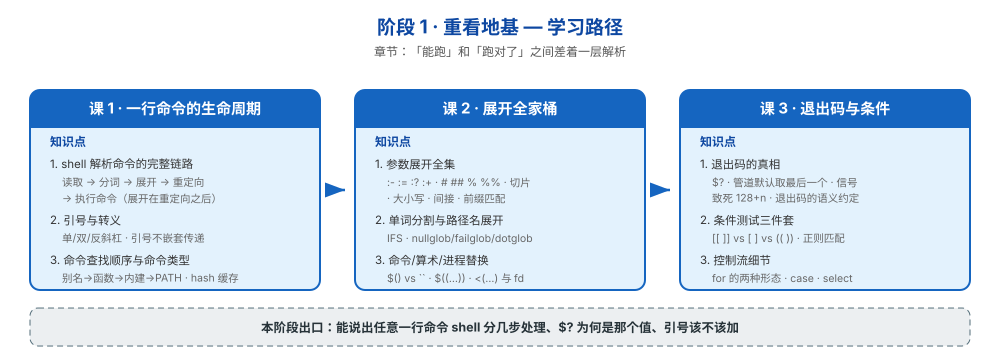

# 阶段 1：重看地基

> 所属课程：Bash 编程 ｜ 故事章节：「能跑」和「跑对了」之间差着一层解析 ｜ 下一阶段：[阶段 2](../2-语言内核/overview.md)

## 🎯 本阶段目标

- 说清 shell 拿到一行输入后**到底做了什么**——不是"读一行执行一行"
- 能解释"为什么这句在交互命令行能跑、写进脚本就炸"
- 能把"空格炸脚本""变量为空就崩""退出码不对"这三类经典问题归因到具体机制

## 📍 学习重点

- **解析顺序**：读取 → 分词 → 展开 → 重定向 → 执行。绝大多数"诡异行为"都出在**顺序搞错**（最典型：以为重定向先于展开）
- **引号的真实作用域**：引号不是"包住一个字符串"，而是**关闭后续展开的一个开关**；引号在变量值里**不保留**
- **参数展开全集**：`${var:-}` 只是入门，`${var##*/}` `${var/#old/new}` `${!prefix*}` `${var@Q}` 才是拉开差距的部分
- **单词分割与 glob**：炸脚本的元凶，且二者是**展开之后**才发生的，所以"加了引号也可能错"
- **退出码传播**：`$?` 在管道、子 shell、函数之间的真实规则；被信号杀死时是 `128+n`
- **`[[ ]]` vs `[ ]` vs `(( ))`**：不是"高级版和低级版"，是三套不同语义的东西

## ✅ 必须掌握的知识点

| 知识点 | 所属课 | 学完应能 |
|--------|--------|----------|
| shell 解析命令的完整链路 | 课 1 | 说出一行命令被处理的五个阶段，并解释"为什么重定向里的变量展开顺序会坑人" |
| 引号与转义 | 课 1 | 判断任意一处该用单引号 / 双引号 / 不加引号；说清"引号不嵌套传递"的后果 |
| 命令查找顺序与命令类型 | 课 1 | 解释为什么函数没生效、为什么改了 PATH 命令还是旧的 |
| 参数展开全集 | 课 2 | 不用 `basename` `dirname` `cut` 也能做字符串处理 |
| 单词分割与路径名展开 | 课 2 | 解释并修复"文件名带空格就崩"；会用 nullglob/failglob |
| 命令替换、算术展开与进程替换 | 课 2 | 说清 `$()` 与反引号的差别、`<(...)` 到底给了什么 |
| 退出码的真相 | 课 3 | 解释管道中 `$?` 取的是谁；判断进程是退出还是被信号杀死 |
| 条件测试三件套 | 课 3 | 在 `[[ ]]` / `[ ]` / `(( ))` 之间正确选择；用 `=~` 做正则匹配 |
| 控制流细节 | 课 3 | 写对 `for` 的两种形态；用 `case` 替代长串 `elif` |

## 🗺️ 本阶段路径图

## 本阶段产出

- [x] `lessons/lesson-01-一行命令的生命周期.md`（2026-09-03 完成）
- [x] `lessons/lesson-02-展开全家桶.md`（2026-09-03 完成）
- [x] `lessons/lesson-03-退出码与条件.md`（2026-09-04 完成）

> ✅ **阶段 1《重看地基》已于 2026-09-04 全部完成**（3 课 / 9 知识点）。下一阶段：[阶段 2《语言内核》](../2-语言内核/overview.md)。

## 📌 本课核心结论（课 3）

- **`$?` 是易失单值**：只有 8 位（`exit 256`→0）、只记最近一条命令、会被 `echo` 和**赋值语句**冲掉
- **管道默认取最后一段**：`pipefail` 取**最后一个非零**（不是第一个失败）；`PIPESTATUS` 看全部，但**读取它本身就会毁掉它**，必须紧邻下一行整体存数组
- **`128+n` = 被信号杀死**，但与主动 `exit 143` 在 `$?` 上无法区分；**`SIGQUIT` 在非交互 bash 中被忽略（得到 0），且 `trap -` 恢复不了**
- **三件套不是高低配**：`[ ]` 是命令会分词、`[[ ]]` 是语法支持模式与 `=~`、`(( ))` 是计算器且**真值相反**（0 为假）
- **引号规则统一**：`[[ ]]` 和 `case` 里，加引号 = 字面量，不加 = 模式
- **前导零是八进制**：`010`=8，`08`/`09` 直接报 `value too great for base`（仅这两个月份会踩坑），修复用 `10#` 且先校验
- **`for` 先拍快照**：`for f in $(ls)` 永远错；`while read` 要 `|| [[ -n $line ]]` 且避开管道子 shell
- **退出码 0 ≠ 成功**：关键操作要有独立的产物校验（`gzip -t`）

> 本课是**判据层**：课 1 给归因框架、课 2 给工具箱，本课回答"**怎么知道一件事真的成了**"。写 shell 时自问三句：① 这个 `$?` 是谁的？② 退出码 0 就够了吗？③ 条件用的是字符串、模式、还是算术？

> ⚠️ **环境认知（影响后续所有实操）**：WSL 内默认以 **root** 运行，基于文件权限位制造失败的实验不可靠（root 无视权限位）。模拟磁盘满用 `/dev/full`。

## 📌 本课核心结论（课 2）

- **参数展开是零 fork 的字符串 DSL**：`${p##*/}` = basename，`${f%.*}` = 去扩展名。实测 1000 次调用快约 **500 倍**（1.008s vs 0.002s）
- **记忆锚点**：`#` 靠左管开头、`%` 靠右管结尾；单个最短、双个最长
- **IFS 不对称规则**：空白字符（空格/Tab/换行）连续会**合并**，非空白（`:`、`,`）连续会**产生空字段**
- **glob 无匹配默认是"原样保留"**（危险）→ 用 `nullglob`（跳过）或 `failglob`（报错）
- **`extglob`/`globstar` 必须先 `shopt -s` 且写在使用它的行之前**——bash 逐行解析执行
- **`local x=$(cmd)` 吞掉 cmd 的失败**，退出码是 `local` 的 0
- **`(( ))` 退出码与 C 相反**：结果非零 → 退出码 0
- **进程替换 `<(...)` 给文件路径且绕开子 shell**，是"while read 里变量丢失"的标准解法

> 本课是**能力层**：课 1 给了归因框架，本课给了"不用外部命令就能干活"的工具箱。写 shell 时自问三句：① 真需要外部命令吗？② 输出会不会被再分割？③ glob 无匹配会怎样？

## 📌 核心结论（课 1）

- **解析五阶段**：读取 → 分词 → 展开 → 重定向 → 查找执行。操作符在**分词**时定，变量在**展开**时才替换——所以变量里的 `|` `>` 永远只是普通字符
- **引号不随值传递**：定义处的引号管"值里能否含空格"，使用处的引号管"会不会被分割"，两者独立。`opts="-name '*.log'"` 这种写法必然失败，正确解是**数组**
- **命令查找四级**：别名 → 函数 → 内建 → PATH，PATH 结果进 **hash 缓存**（"装了新版跑旧的"元凶）
- **PATH 的三种空**：未设置 → 回落默认 PATH；空串 → 视为含一个空元素 = **当前目录**；含空元素 → **PATH 劫持入口**
- **别名在脚本中默认关闭**（`expand_aliases=off`），脚本内复用逻辑一律用函数

> 本课是**归因框架**：后续每一课的"诡异行为"，最终都能归到链路的某一环。诊断手法统一为 `set -x` 看展开后的真实命令。

## 💡 复习方式说明

本阶段虽是"基础"，但**不按零基础讲法展开**：不解释 `cd` 是什么、不教 `if` 怎么写。每个知识点都直奔"你以为懂了其实没懂的那一层"——比如引号讲的是"引号在变量值里不保留"而不是"单双引号的区别"。

> 这是为满足"很久没写了，复习一下基础也好"的诉求：复习靠**重建精确心智模型**，不靠重读语法清单。
