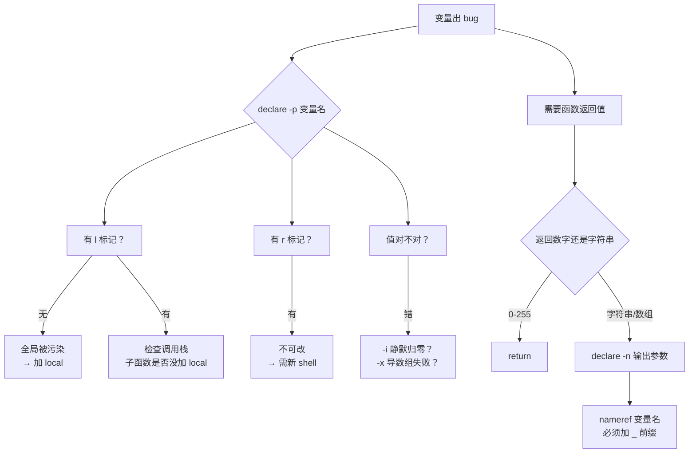
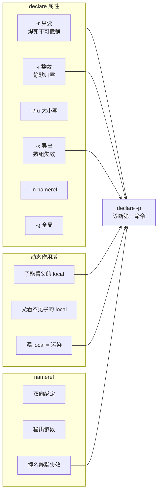

# 第 4 课：变量属性与作用域

> 所属阶段：阶段 2《语言内核》｜ 水平：进阶 ｜ 本课知识点：declare 与变量属性、作用域与 local、nameref 与间接引用
> 故事情节：函数里改了个变量，外面的同名变量跟着变了——而且只在某些调用路径下变

## 🎯 本课目标

- 用 `declare` 给变量加上正确的属性约束（只读、整数、数组、大小写、导出、引用）
- 解释 bash 的**动态作用域**如何导致变量污染，并用 `local` 与命名约定规避
- 用 `declare -n` 实现"传引用"，并避开 nameref 的循环引用陷阱

---

## 第一幕：起源与场景引入

> 🎬 **场景**：`deploy.sh` 里有两个函数，`prepare` 里设了 `host="prod-web-01"`，`cleanup` 里读 `$host` 决定清理哪台机器。某天有人加了个新函数 `dry_run`，里面也用了 `host` 这个变量做临时存储——于是生产环境的清理逻辑意外指向了测试机。

看这段代码，你觉得它会清理哪台机器？

```bash
#!/usr/bin/env bash
prepare() {
  host="prod-web-01"
  echo "  prepare: host=$host"
}

dry_run() {
  host="test-runner"          # 只想临时存一下
  echo "  dry_run: 临时用 host=$host 存东西"
}

cleanup() {
  echo "  cleanup: 将要清理 host=$host"
  echo "  cleanup: rm -rf /data/$host/*"
}

main() {
  prepare
  dry_run                     # 后加的一行
  cleanup
}
main
```

直觉告诉你清理 `prod-web-01`。实际输出（本机实测）：

```
  prepare: host=prod-web-01
  dry_run: 临时用 host=test-runner 存东西
  cleanup: 将要清理 host=test-runner      # ← 生产环境的清理指向了测试机
  cleanup: rm -rf /data/test-runner/*
```

`cleanup` 从头到尾没碰过 `host`，它只是**读**。问题是 `dry_run` 里那句 `host="test-runner"` 根本不是"局部的"——它是**全局赋值**，把 `prepare` 辛苦设好的值覆盖了。

而这只是第一层。更隐蔽的是：即使你给 `dry_run` 加上 `local host`，**污染依然可能发生**。为什么？这是本课要解决的核心问题。

---

## 第二幕：认知冲突

> ❓ **问题**：`local host` 明明写了，为什么还是被污染？

先做个实验——给三个函数都加上 `local`，看看结果：

```bash
prepare() { local host="prod-web-01"; echo "  prepare: host=$host"; }
dry_run() { local host="test-runner"; echo "  dry_run: host=$host"; }
cleanup() { echo "  cleanup 看到 host=[${host-<未定义>}]"; }
prepare
dry_run
cleanup
echo "全局 host=[${host-<未定义>}]"
```

实测输出：

```
  prepare: host=prod-web-01
  dry_run: host=test-runner
  cleanup 看到 host=[<未定义>]        # ← 污染没了，但 cleanup 也读不到值了
全局 host=[<未定义>]
```

污染确实消失了，但 `cleanup` 现在读不到 `host`——**逻辑断了**。

这说明 `local` 解决的是"不往外泄漏"，但没解决"怎么把值传给需要它的函数"。而真正的原因藏在更深的地方：

**bash 的 `local` 是动态作用域**：它让变量在"函数执行期间"可见，**包括它调用的所有子函数**。这与 C/Python 的词法作用域根本不同——在 bash 里，一个函数能看见调用者的局部变量，而调用者看不见被调用者的。

看这个实测：

```bash
paren() { local pv="父的"; child; echo "  paren回来 pv=[$pv]"; }
child() { local cv="子的"; echo "  child内 cv=[$cv] pv=[${pv-NO}]"; }
paren
echo "  paren外 cv=[${cv-NO}]"
```

输出：

```
  child内 cv=[子的] pv=[父的]      # ← child 能看见 paren 的 local
  paren回来 pv=[父的]
  paren外 cv=[NO]                  # ← 但 paren 看不见 child 的 local
```

**可见性是单向的，从上往下**。不是"谁定义的谁能看"，而是"**谁在调用栈里，谁就能看见上面的**"。

这不是 bug，是设计。但它意味着"局部变量"这个直觉在 bash 里是错的——`local` 真正的含义是"**函数执行期间可见**"，不是"只有这个函数能看"。

---

## 第三幕：层层揭示

### 知识点 1：declare 与变量属性

> 本知识点关键点：`declare -r` 只读与"只读不可撤销"、`-i` 整数（内含算术求值）、`-a` 索引数组、`-A` 关联数组、`-l`/`-u` 大小写锁定、`-x` 导出、`-n` nameref、`-g` 在函数内声明全局、`declare -p` 查看属性

#### 一句话定义

`declare` 给**变量本身**附加属性约束（只读、整数、数组、大小写、导出、引用），属性决定这个变量"能做什么、怎么做"，而不是它"现在是什么值"。

#### 直觉建立（类比）

把变量想成一个**带标签的盒子**。默认盒子上没标签，什么都能往里塞，塞进去原样保存。

`declare -i` 是给盒子贴一张"**只接受算式**"的标签——你放进去 `1+2`，它存 `3`；你放进去 `abc`，它存 `0`（因为它算不出来）。`declare -r` 是给盒子上**一把锁**——能看不能改，而且这把锁**焊死了**，钥匙扔了。`declare -l` 贴的是"**进门转小写**"的标签，不管你塞 `ABC` 还是 `AbC`，打开都是 `abc`。

重点在于：**标签贴在盒子上，不是贴在东西上**。换个东西放进去，标签照样生效。

#### 核心原理

`declare` 的属性是**变量的持久属性**，赋值发生时才应用。这意味着三件事：

**1. 属性在赋值时生效，不是声明时**

```bash
unset v
v="hello"          # 此时 v 是普通变量
declare -i v       # 加 -i 属性
echo "v=[$v]"      # → hello   已有的值不会被重新计算
v="world"
echo "v=[$v]"      # → 0       下次赋值时才按 -i 规则算，"world" 算不出数字 → 0
```

实测确认：`v=[hello]` 然后 `v=[0]`。

**2. 属性可叠加，后加的优先生效**

实测 `-i` 与 `-u` 的两种叠加顺序：

```bash
unset w1; declare -i w1=5; declare -u w1; w1="abc"; echo "w1=[$w1]"
# → w1=[0]     -u 后加，仍先按 -i 求值：abc 算不出 → 0

unset w2; declare -u w2="abc"; declare -i w2 2>/dev/null; echo "w2=[$w2]"
# → w2=[ABC]   -i 后加，但已有值 "ABC" 不重算
w2="7+1"; echo "w2=[$w2]"
# → w2=[8]     下次赋值 → 先 -u 转大写 "7+1"，再 -i 求值 → 8
```

结论：**已有值永不重算，新赋值才走属性链**。

**3. 只读是焊死的**

```bash
declare -r CONST=1
CONST=2 2>&1 | head -1          # → bash: CONST: readonly variable
echo "CONST=$CONST"             # → 1     值没变
(unset CONST) 2>&1 | head -1    # → bash: unset: CONST: cannot unset: readonly variable
echo "CONST=$CONST"             # → 1     unset 也不行
```

`-r` **不可撤销、不可 unset**。想改只有一个办法：**开一个新的 shell**。

**各属性速查**（本节全部经本机 bash 5.2.21 实测）

| 选项 | 含义 | 实测行为 |
|------|------|----------|
| `-r` | 只读 | 赋值/unset 均报错，**不可撤销** |
| `-i` | 整数 | 赋值走算术求值：`"1+2"`→`3`，`10/3`→`3`，`0x10`→`16`，`"abc"`→`0` |
| `-a` | 索引数组 | `declare -p` 显示 `([0]="1" [1]="2")` |
| `-A` | 关联数组 | `declare -p` 显示 `([k]="v" )` |
| `-l` | 转小写 | `x="ABC"` → `abc` |
| `-u` | 转大写 | `x="abc"` → `ABC` |
| `-x` | 导出到子进程 | 子进程可见；**子进程改不了父**（单向快照） |
| `-n` | nameref 引用 | 详见知识点 3 |
| `-g` | 函数内建全局 | 不加 `-g` 时 `declare` 在函数内等价 `local` |
| `-p` | 打印属性 | 诊断利器：`declare -p var` |

#### 示例演示

**示例 1：`-i` 的算术求值**

```bash
declare -i n
n="1+2";   echo "n=[$n]"    # → n=[3]
n="10/3";  echo "n=[$n]"    # → n=[3]     整除
n="0x10";  echo "n=[$n]"    # → n=[16]    支持 0x 前缀
n="abc";   echo "n=[$n]"    # → n=[0]     算不出 → 0（不报错！）
```

注意最后一行：`abc` 变成 `0` 且**不报错**。这是 `-i` 最危险的静默失败。

**示例 2：`-i` 是求值快照，不是引用**

```bash
declare -i x y
x=5
y="x * 2"
echo "y=[$y]"      # → y=[10]
x=100
echo "y=[$y]"      # → y=[10]   x 改了 y 不变：y 存的是求值结果，不是公式
```

**示例 3：`-l` / `-u` 免掉 `tr`**

```bash
declare -l lower; lower="ABC";  echo "lower=[$lower]"   # → abc
declare -u upper; upper="abc";  echo "upper=[$upper]"   # → ABC
```

这比 `$(echo "$x" | tr 'A-Z' 'a-z')` 干净得多——**没有子 shell，没有外部命令**。

**示例 4：`declare -p` 是诊断利器**

```bash
declare -i a1=1; declare -l a2=1; declare -a a3=(1 2)
declare -A a4=([k]=v); declare -x a5=1
declare -p a1 a2 a3 a4 a5
```

输出：

```
declare -i a1="1"
declare -l a2="1"
declare -a a3=([0]="1" [1]="2")
declare -A a4=([k]="v" )
declare -x a5="1"
```

调试变量相关 bug 时，`declare -p 变量名` 是**第一个该敲的命令**——它告诉你这个变量到底是什么类型、什么值。

**示例 5：`-x` 是单向快照**

```bash
declare -x EV=outer
bash -c 'echo "子 EV=$EV"; EV=inner; echo "子改后 EV=$EV"'
echo "父回来 EV=$EV"
```

输出：

```
子 EV=outer
子改后 EV=inner
父回来 EV=outer        ← 子进程改不了父
```

导出的是**值的副本**，不是共享内存。子进程改了，父进程纹丝不动。

#### 常见误区

| ❌ 误区 | ✅ 事实 |
|---------|---------|
| `declare -i x` 之后 `x` 只存数字 | 它存的是**算术求值结果**，非数字静默变 `0`，不报错 |
| `declare -i x; x="abc"` 会报错 | 不报错，变 `0`（最危险的静默失败） |
| 属性改了已有值会重算 | **不会**，已有值是原样，下次赋值才生效 |
| `declare -r` 可以用 `unset` 解除 | 不能，`unset` 也报 `cannot unset` |
| `declare -x arr=(1 2 3)` 能导出数组 | **静默失败**：不报错，但子进程拿到空数组 |
| 函数里 `declare` 建的是全局变量 | 不加 `-g` 就等价 `local`，加 `-g` 才是全局 |

> **数组导出这个坑值得单独说**（实测）：
> ```bash
> declare -a xa=(1 2 3)
> declare -x xa                      # 无报错
> declare -p xa                      # → declare -ax xa=([0]="1" [1]="2" [2]="3")
> bash -c 'echo "子 xa=[${xa-EMPTY}]"'  # → 子 xa=[EMPTY]
> ```
> 父进程 `declare -p` 显示 `-ax`（属性加上了），但**子进程拿不到任何数据**，且全程**零报错**。这是 bash 的经典静默失败——你想导出数组，结果什么都没发生。数组要传给子进程，只能序列化成字符串（阶段 3 会讲）。

#### 一句话记住

> **属性贴在变量上、赋值时才生效；`-r` 焊死、`-i` 静默归零、`-x` 导数组是空操作。**

---

### 知识点 2：作用域与 local

> 本知识点关键点：动态作用域 vs 词法作用域、`local` 的真实语义、未声明变量默认全局、`local` 在函数外使用会报错、`declare` 在函数内默认等价于 local（除 `-g`）

#### 一句话定义

bash 采用**动态作用域**：变量的可见性由**调用栈**决定，不是由代码的书写位置决定——函数能看见调用者的局部变量，反之则不能。

#### 直觉建立（类比）

词法作用域（C/Python/Go）像**带门牌的房间**：变量写在哪个函数里，就属于哪个房间，别的房间看不见，除非你显式把它传过去。位置决定一切。

动态作用域像**一串挂在绳子上的牌子**：函数 A 调用 B，B 调用 C，调用发生时就把 A 的局部牌子挂到绳子上——B 和 C 路过都能看见。C 返回后 C 的牌子摘掉，A 的牌子还在。

所以：
- **往下看**：C 能看见 B 和 A 的局部变量 ✅
- **往上看**：A 看不见 C 的局部变量 ❌（C 的牌子已经摘了）

这就是"**单向可见**"。

#### 核心原理

**实验 1：可见性方向（实测）**

```bash
paren() { local pv="父的"; child; echo "  paren回来 pv=[$pv]"; }
child() { local cv="子的"; echo "  child内 cv=[$cv] pv=[${pv-NO}]"; }
paren
echo "  paren外 cv=[${cv-NO}]"
```

输出：

```
  child内 cv=[子的] pv=[父的]      ← child 看见 paren 的 local
  paren回来 pv=[父的]
  paren外 cv=[NO]                  ← paren 看不见 child 的 local
```

**实验 2：子函数修改会穿透到父函数（实测）**

```bash
v="全局"
outer() {
  local v="我在outer"
  echo "  outer: v=[$v]"
  inner
  echo "  outer回来: v=[$v]"       # ← 被 inner 改了！
}
inner() {
  echo "  inner: 看见 v=[${v-<看不见>}]"
  v="inner改了"                    # 没写 local！改的是调用栈上最近的那个 v
}
outer
echo "回到全局: v=[$v]"            # ← 全局的没被改
```

输出：

```
  outer: v=[我在outer]
  inner: 看见 v=[我在outer]
  inner: 改成 v=[inner改了]
  outer回来: v=[inner改了]        ← outer 的 local 被 inner 改掉了
回到全局: v=[全局]                ← 但全局的 v 安然无恙
```

这是动态作用域最要命的地方：**内层函数一个没加 `local` 的赋值，会穿透修改外层的同名变量**。而且它只改到"最近的一层"——`inner` 改的是 `outer` 的 `local v`，没碰到全局的。

**实验 3：未声明即全局（污染源头）**

```bash
leak() { leaked="我泄漏了"; }
leak
echo "函数外 leaked=[${leaked-<未定义>}]"
```

输出：`函数外 leaked=[我泄漏了]` —— 函数里不写 `local`，变量就是全局的。这就是第一幕 `dry_run` 事故的成因。

**实验 4：`declare` 在函数内的默认行为**

```bash
d1() { declare dvar="局部"; echo "  d1内 dvar=[$dvar]"; }
d1
echo "函数外 dvar=[${dvar-<未定义>}]"     # → <未定义>

d2() { declare -g gvar="全局"; echo "  d2内 gvar=[$gvar]"; }
d2
echo "函数外 gvar=[${gvar-<未定义>}]"     # → 全局
```

**函数内 `declare` = `local`**，这是 bash 的特殊规则（全局作用域下 `declare` 才是全局）。要强制建全局，必须 `-g`。

**实验 5：`local` 在函数外报错**

```bash
( local x=1 ) 2>&1 | head -1
# → bash: local: can only be used in a function
```

**实验 6：`local x=$(cmd)` 吞退出码**（接课 3）

```bash
bad()  { local r=$(false); echo "  bad: local的退出码=$?"; }
good() { local r; r=$(false); echo "  good: 赋值的退出码=$?"; }
bad; good
```

输出：

```
  bad: local的退出码=0     ← 失败被吞了
  good: 赋值的退出码=1     ← 正确
```

课 3 讲过这个现象，这里补上**原因**：`local r=$(false)` 整条是一个 `local` 命令，它的退出码是 `local` 自己（声明成功→0），**不是** `$(false)` 的。拆成两行后，`r=$(false)` 是一个独立赋值语句，退出码才是命令替换的。

**实验 7：递归计数器不恢复（经典坑）**

```bash
count=0
walk() {
  local d=$1
  count=$((count+1))          # count 没加 local → 全局累加
  echo "  深度$d count=$count"
  [ "$d" -ge 3 ] && return
  walk $((d+1))
  echo "  深度$d 返回后 count=$count"
}
walk 1
```

输出：

```
  深度1 count=1
  深度2 count=2
  深度3 count=3
  深度2 返回后 count=3      ← 内层返回后没恢复
  深度1 返回后 count=3      ← 也没有
最终 count=3
```

每层递归看到的 `count` 都是同一个全局值——**没有"每层一份"这回事**。想要每层独立，必须 `local count`。

**实验 8：`local` 无法遮蔽只读全局变量（实测反直觉）**

```bash
declare -r RG="只读全局"
fg() { local RG="局部"; echo "  f内 RG=[$RG]"; }
fg
echo "f外 RG=[$RG]"
```

输出：

```
bash: local: RG: readonly variable     ← 报错！
  f内 RG=[全局只读]                      ← 拿到的还是全局值
f外 RG=[全局只读]
```

直觉上 `local` 应该能在函数内"遮蔽"同名全局变量，但**对 `-r` 变量不行**——`local` 会尝试赋值，触发只读保护而失败。所以**给全局变量加 `-r` 时，要确认没有任何函数想用同名局部变量**。

#### 示例演示

**示例：用 `declare -p` 逐层定位变量**（第四幕会完整用一遍）

```bash
show() { echo "--- $1 ---"; declare -p host 2>&1 | head -1; }
prepare() { local host="prod-web-01"; show "prepare内"; }
dry_run() { local host="test-runner"; show "dry_run内"; }
cleanup() { show "cleanup内(无local)"; }
prepare; show "prepare后(全局)"
dry_run; show "dry_run后(全局)"
cleanup
```

输出：

```
--- prepare内 ---
declare -- host="prod-web-01"      ← local 生效
--- prepare后(全局) ---
bash: declare: host: not found     ← 函数外看不见，符合预期
--- dry_run内 ---
declare -- host="test-runner"
--- dry_run后(全局) ---
bash: declare: host: not found
--- cleanup内(无local) ---
bash: declare: host: not found     ← cleanup 读不到 host！
```

最后一行点破了第二幕的困境：`local` 防住了污染，但也切断了传值通道。

#### 常见误区

| ❌ 误区 | ✅ 事实 |
|---------|---------|
| `local` = 局部变量，别的函数看不见 | **错**，被调用的子函数能看见（动态作用域） |
| 函数内 `declare x=1` 建全局变量 | 等价 `local`，要 `-g` 才是全局 |
| 函数里赋值不写 `local` 也没事 | 会污染全局（或污染调用者的同名 local） |
| `local x=$(cmd)` 能拿到 cmd 的退出码 | 拿不到，`local` 自己的退出码覆盖了它 |
| `local` 能遮蔽任何同名全局变量 | **对 `-r` 变量不行**，会报 `readonly variable` |
| 递归时每层有自己的变量副本 | 只有加了 `local` 的才有；否则共享同一个全局值 |
| `local` 可以在函数外用 | 报错 `can only be used in a function` |

#### 一句话记住

> **bash 的 `local` 不是"只有我能看"，而是"我执行期间，我和我调用的所有函数都能看"——污染与传值都源于这一条。**

---

### 知识点 3：nameref 与间接引用

> 本知识点关键点：`${!var}` 取"变量名的值作为变量名"的值、`declare -n ref=target` 的双向绑定、nameref 的循环引用错误、nameref 与 local 同名冲突、绕过函数返回值只能 0-255 的限制

#### 一句话定义

`declare -n ref=target` 让 `ref` 成为 `target` 的**别名**——对 `ref` 的读写全部作用于 `target`。这是 bash 里唯一接近"传引用"的机制。

#### 直觉建立（类比）

`${!var}` 像**查电话簿**：`var` 里写着"张三"这个名字，`${!var}` 就是去查张三的电话号码。只能查，不能改张三。

`declare -n` 像**给房间开一扇连通门**：`ref` 和 `target` 是同一间房的两扇门。从 `ref` 这扇门搬进去一把椅子（赋值），从 `target` 那扇门就能看到；反之亦然。**双向、实时、同一份数据**。

#### 核心原理

**1. `${!var}`：间接取值（只读路径）**

```bash
name="target"
target="真身"
echo "${!name}"      # → 真身
```

`name` 的值是字符串 `"target"`，`${!name}` 把它当变量名再解一层，得到 `target` 的值。

⚠️ **常见误用**：`${!idx}` **不是**取数组第 `idx` 个元素。

```bash
arr=(a b c)
idx=1
echo "${!idx}"       # → 空！  它找的是名叫 "1" 的变量，不是 arr[1]
echo "${arr[idx]}"   # → b     正确写法
```

**2. `${!prefix*}`：列出匹配前缀的变量名**

```bash
my_a=1; my_b=2; other=3
echo "${!my_*}"      # → my_a my_b
```

**3. nameref 的双向绑定**

```bash
real="原值"
declare -n ref=real
echo "ref=[$ref]"        # → 原值
ref="新值"
echo "real=[$real]"      # → 新值     写 ref 改的是 real
real="直接改"
echo "ref=[$ref]"        # → 直接改   写 real 也反映到 ref
```

实测确认：`declare -p ref` 显示 `declare -n ref="target"`。

**4. nameref 可以指向不存在的变量**

```bash
unset ghost 2>/dev/null
declare -n gr=ghost
echo "读 gr=[${gr-<空>}]"    # → <空>      读不报错
gr="现在有了"
echo "ghost=[$ghost]"        # → 现在有了   写会自动创建
```

**5. 链式 nameref 会穿透**

```bash
declare -n r1=r2
declare -n r2=final
final="终点"
echo "r1=[${r1-<失败>}]"     # → 终点      r1→r2→final，一路解到最终
```

#### 示例演示

**示例 1：用 nameref 做输出参数（核心用途）**

这是 shell 里**最接近"输出参数"**的机制——函数能把结果写回调用者的变量。

```bash
resolve_target() {
  local -n _out=$1
  _out="prod-web-01"
}
target=""
resolve_target target
echo "target=[$target]"        # → prod-web-01
```

**示例 2：用 nameref 实现 `split`**

```bash
split() {
  local -n _res=$1      # 结果写回调用者的数组
  local IFS=$2
  local s=$3
  _res=($s)             # 依赖调用者的 IFS 分词
}
declare -a parts
split parts ":" "a:b:c"
echo "长度=${#parts[@]}  内容=${parts[*]}"
```

输出：`长度=3  内容=a b c`

**示例 3：绕过 0-255 的返回值限制**

函数的 `return` 只能返回 0-255，nameref 可以传回任意字符串：

```bash
get_config() {
  local -n _out=$1
  _out="一个很长的字符串结果，不受0-255限制"
}
result=""
get_config result
echo "result=[$result]"
```

**示例 4：交换两个变量**

```bash
swap() {
  local -n a=$1 b=$2
  local tmp=$a
  a=$b
  b=$tmp
}
p="one"; q="two"
swap p q
echo "p=$p q=$q"       # → p=two q=one
```

**示例 5：传递数组与关联数组**

```bash
add_elem() { local -n _arr=$1; _arr+=("new"); }
declare -a myarr=(a b)
add_elem myarr
echo "myarr=${myarr[*]} (长度 ${#myarr[@]})"      # → a b new (长度 3)

declare -A cfg=([host]="localhost")
set_cfg() { local -n _c=$1; _c["port"]="8080"; }
set_cfg cfg
echo "keys=${!cfg[*]}  values=${cfg[*]}"           # → keys=port host  values=8080 localhost
```

**示例 6：间接赋值（不用 `eval`）**

```bash
vname="dyn"
declare "$vname=动态创建"      # 创建名叫 dyn 的变量
echo "dyn=[$dyn]"
printf -v "$vname" "用printf写入"
echo "dyn=[$dyn]"              # → 用printf写入
```

`printf -v` 比 `eval` 安全得多——**不解析代码，只写值**。

#### 常见误区

**❌ 头号陷阱：`declare -n ref=$1` 时 `$1` 与 `ref` 同名**

这是 nameref 最容易踩的坑，而且它是**静默失败**（只 warning，不中断）：

```bash
set_val() { local -n val=$1; val="新值"; }
val="旧"
set_val val                    # 传的变量名恰好也叫 val
echo "调用后 val=[$val]"
```

实测输出：

```
bash: local: warning: val: circular name reference      ← 报了 3 次
bash: local: warning: val: circular name reference
bash: local: warning: val: circular name reference
调用后 val=[旧]                                          ← 值根本没改！
```

**原因**：`local -n val=$1` 展开成 `local -n val=val`，`val` 引用自己 → 循环引用 → bash 拒绝解析，**赋值静默失败**。

函数**照常返回 0**，脚本继续执行，带着一个没被修改的变量。这比报错危险得多。

**修复**：nameref 变量名加前缀，避开调用者可能传的名字：

```bash
set_val2() { local -n _out=$1; _out="新值"; }
val2="旧"
set_val2 val2
echo "调用后 val2=[$val2]"     # → 新值   正常
```

**这是为什么本课所有 nameref 示例都用 `_out` / `_res` / `_arr` 这样的下划线前缀**——不是为了好看，是为了避免和用户传入的变量名撞车。

**❌ 自引用直接报错**

```bash
declare -n self=self
# → bash: declare: self: nameref variable self references not allowed
```

这个倒是明确报错，比循环引用好。

**❌ 混淆 `${!var}` 与数组下标**

见上文：`${!idx}` 找的是名叫 `1` 的变量，不是 `arr[1]`。

**❌ 以为 nameref 是"拷贝"**

nameref 是**别名**，不是副本。改 `ref` 就是改 `target`，两个名字共享同一份数据。函数里用 nameref 改了数组，调用者的数组立刻变了。

#### 一句话记住

> **nameref 是同一间房的两扇门，不是两份拷贝；nameref 变量名一定要加 `_` 前缀，否则撞名就是静默失效。**

---

## 第四幕：实操验证

> 🎯 **任务**：把第一幕那个"清理错机器"的脚本，从"事故发生"逐步修到"不可能再发生"，每一步都用 `declare -p` 验证。

### 版本 0：事故复现

```bash
prepare() {
  host="prod-web-01"
  echo "  prepare: host=$host"
}
dry_run() {
  host="test-runner"
  echo "  dry_run: 临时用 host=$host 存东西"
}
cleanup() {
  echo "  cleanup: 将要清理 host=$host"
  echo "  cleanup: rm -rf /data/$host/*"
}
prepare
dry_run
cleanup
```

实测输出（**清理目标错了**）：

```
  prepare: host=prod-web-01
  dry_run: 临时用 host=test-runner 存东西
  cleanup: 将要清理 host=test-runner        # ← 危险
  cleanup: rm -rf /data/test-runner/*
```

**用 `declare -p` 定位**：

```bash
prepare; echo "prepare 后: $(declare -p host)"
dry_run; echo "dry_run 后: $(declare -p host)"
```

输出：

```
prepare 后: declare -- host="prod-web-01"
dry_run 后: declare -- host="test-runner"     ← 值被覆盖了
```

`declare --` 前面没有 `l`（local）标记，说明它是**全局变量**——谁都能改。

### 版本 1：加 `local`，污染没了但逻辑断了

```bash
prepare() { local host="prod-web-01"; echo "  prepare: host=$host"; }
dry_run() { local host="test-runner"; echo "  dry_run: host=$host"; }
cleanup() { echo "  cleanup 看到 host=[${host-<未定义>}]"; }
prepare; dry_run; cleanup
echo "全局 host=[${host-<未定义>}]"
```

实测输出：

```
  prepare: host=prod-web-01
  dry_run: host=test-runner
  cleanup 看到 host=[<未定义>]      # ← 不污染了，但也读不到值
全局 host=[<未定义>]                # ← 全局干净
```

**进展**：污染消除。**问题**：`cleanup` 拿不到 `host` 了。`local` 只管"不往外漏"，不管"怎么传进去"。

### 版本 2：命令替换传值——踩到新的坑

有人会这么修：用 `$( )` 把返回值接住。

```bash
prepare() { local host="prod-web-01"; echo "  prepare: host=$host"; echo "$host"; }
h=$(prepare)
cleanup "$h"
```

实测输出（**错乱**）：

```
  dry_run: 内部 host=test-runner
  cleanup: 将清理 host=  prepare: host=prod-web-01
prod-web-01
```

**原因**：`prepare` 里的**日志也走了 stdout**，被 `$( )` 一起捕获了。`h` 里装的是"日志 + 值"的混合体。

**修复**：**日志走 stderr，stdout 只留数据**。

```bash
log() { echo "[log] $*" >&2; }

prepare() { local host="prod-web-01"; log "prepare: host=$host"; echo "$host"; }
dry_run() { local host="test-runner"; log "dry_run: 内部 host=$host"; }
cleanup() { local host=$1; log "cleanup: 将清理 host=$host"; }

h=$(prepare)
dry_run
cleanup "$h"
log "全局 host=[${host-<未定义>}]"
```

实测输出（**正确**）：

```
[log] prepare: host=prod-web-01
[log] dry_run: 内部 host=test-runner
[log] cleanup: 将清理 host=prod-web-01      # ← 正确
[log] 全局 host=[<未定义>]                   # ← 全局干净
```

> 💡 这条规则值得固化成习惯：**函数的 stdout 是数据通道，日志必须走 stderr**。阶段 3 讲 fd 时会展开这个约定。

### 版本 3：命名前缀约定（防未来再犯）

版本 2 能工作，但依赖"每个人都记得写 `local`"。加一层保险：**全局变量统一大写前缀，局部变量统一 `_` 前缀**。

```bash
CFG_HOST="prod-web-01"

prepare() { local _host="$CFG_HOST"; echo "  prepare: _host=$_host"; }
dry_run() { local _host="test-runner"; echo "  dry_run: _host=$_host"; }
cleanup() { local _host="$CFG_HOST"; echo "  cleanup: 将清理 _host=$_host"; }

prepare; dry_run; cleanup
echo "全局 CFG_HOST=[$CFG_HOST]"
echo "全局 _host=[${_host-<未定义>}]"
```

实测输出：

```
  prepare: _host=prod-web-01
  dry_run: _host=test-runner
  cleanup: 将清理 _host=prod-web-01      # ← 正确，且不再依赖传参
全局 CFG_HOST=[prod-web-01]             # ← 未被污染
全局 _host=[<未定义>]                    # ← 局部没泄漏
```

**两个约定同时生效**：
- 全局配置 `CFG_*` 大写，一眼可辨
- 局部变量 `_xxx` 下划线前缀，即使忘了 `local` 也不会撞上 `CFG_*`

### 版本 4：只读保护 + nameref 输出参数

最后加上两道锁：**配置只读**（防误改）、**nameref 输出参数**（避免命令替换的子 shell 开销与 stdout 污染风险）。

```bash
log() { echo "[log] $*" >&2; }

declare -r CFG_HOST="prod-web-01"          # 锁 1：配置不可改

resolve_target() {                          # 锁 2：nameref 输出参数
  local -n _out=$1
  _out="$CFG_HOST"
}

cleanup() { local _host=$1; log "cleanup: 将清理 _host=$_host"; }

target=""
resolve_target target
log "target=$target"
cleanup "$target"
echo "  CFG_HOST 只读保护: $(CFG_HOST=x 2>&1 | head -1)"
```

实测输出：

```
[log] target=prod-web-01
[log] cleanup: 将清理 _host=prod-web-01
  CFG_HOST 只读保护: bash: CFG_HOST: readonly variable
```

三层防护全部生效：配置改不动、传值不用命令替换、目标正确。

### 修复路径总结

| 版本 | 手段 | 污染 | 传值 | 防未来 |
|------|------|------|------|--------|
| 0 | 无 | ❌ 被污染 | ✅ 靠全局 | ❌ |
| 1 | `local` | ✅ 干净 | ❌ 断了 | ⚠️ 依赖记性 |
| 2 | `local` + 传参 + 日志走 stderr | ✅ 干净 | ✅ 正确 | ⚠️ 依赖记性 |
| 3 | 命名前缀约定 | ✅ 干净 | ✅ 正确 | ✅ 撞名即暴露 |
| 4 | 加 `-r` 只读 + nameref | ✅ 干净 | ✅ 正确 | ✅ 改都改不了 |

**诊断口诀**：变量相关的诡异 bug，第一件事是 `declare -p 变量名`——看它有没有 `l`（local）标记、有没有 `r`（readonly）、值是多少。90% 的问题在这一行输出里就能看出来。
---

## 第五幕：体系收束

### 本课知识地图



### 三个知识点的关系

```
declare（属性）  →  约束单个变量"能做什么"
      ↓
local（作用域）  →  约束变量"谁能看见"
      ↓
nameref（引用）  →  在函数间"安全地传递"变量
```

属性管**个体**，作用域管**边界**，nameref 管**传递**。三者合起来，才构成 bash 的变量使用规范。

### 与前后课程的连接

**向后接课 3（退出码与条件）**：课 3 讲了 `local x=$(cmd)` 吞退出码的**现象**，本课补上了**原因**——`local` 本身是带退出码的命令，它覆盖了命令替换的退出码。修复方法是拆成两行。

**向前接课 5（数组与映射）**：本课讲了 `-a` / `-A` 这两个**属性**，但没展开数组怎么用。`declare -A` 建的关联数组怎么遍历、怎么判断键存在、`"${arr[@]}"` 和 `"${arr[*]}"` 差在哪——这些是课 5 的主题。

**还有个悬念留到阶段 3**：本课实测发现 `declare -x` 导出数组是**静默失败**（父进程显示 `-ax`，子进程拿到空）。为什么？因为环境变量本质是**字符串到字符串的映射**，装不下数组结构。这个"进程边界"的限制，要到阶段 3 讲子进程与环境继承时才说得透。

### 三条可以立刻用上的规则

1. **所有函数内的变量都加 `local`**，除非你明确要它全局——漏一个就是潜在污染
2. **全局配置用 `CFG_*` 大写 + `declare -r`**，局部变量用 `_xxx` 前缀
3. **函数要返回字符串/数组时用 `declare -n _out`，nameref 变量名永远带 `_` 前缀**

---

## 🐞 常见误区

### 综合误区表

| # | ❌ 误区 | ✅ 事实 |
|---|---------|---------|
| 1 | `local` 是"局部变量"，别的函数看不见 | 被调用的子函数能看见（动态作用域） |
| 2 | 函数内 `declare x=1` 建全局变量 | 等价 `local`，要 `-g` 才是全局 |
| 3 | `declare -i x; x="abc"` 会报错 | 静默变 `0`，不报错 |
| 4 | 属性改了已有值会重算 | 不会，下次赋值才生效 |
| 5 | `declare -r` 可以 `unset` 解除 | 不能，只能开新 shell |
| 6 | `declare -x arr=(1 2 3)` 能导出数组 | 静默失败，子进程拿到空 |
| 7 | `local x=$(cmd)` 能拿到 cmd 退出码 | 拿不到，被 `local` 覆盖 |
| 8 | `local` 能遮蔽任何同名全局 | 对 `-r` 变量不行，报 `readonly variable` |
| 9 | 递归时每层有独立变量副本 | 只有加 `local` 的才有 |
| 10 | `${!idx}` 取数组第 idx 个元素 | 找名叫 `1` 的变量，正确写法 `${arr[idx]}` |
| 11 | `declare -n ref=$1` 随便起名 | 与 `$1` 同名则**静默失效**（只 warning） |
| 12 | nameref 是值的拷贝 | 是别名，共享同一份数据 |

---

## 一图总结



**一句话记住**：

> **属性管个体（-r 焊死、-i 归零、-x 导数组是空操作），作用域管边界（子能看父、父看不见子、漏 local 就污染），nameref 管传递（双向别名，撞名静默失效）。变量出 bug 第一件事：`declare -p`。**

---

## 课后小测

### 基础题（6 题）

**1.** 下面代码输出什么？
```bash
declare -i n
n="7*6"
echo "$n"
```
<details><summary>答案</summary>42（-i 属性触发算术求值）</details>

**2.** 下面代码输出什么？为什么？
```bash
declare -i x
x="hello"
echo "x=$x (退出码 $?)"
```

<details><summary>答案</summary><code>x=0 (退出码 0)</code>。非数字静默归零，<b>不报错</b>——这是 -i 最危险的静默失败。</details>

**3.** 下面代码输出什么？
```bash
f() { local v="外层"; g; echo "f内 v=$v"; }
g() { v="内层改了"; }
f
echo "全局 v=${v-<未定义>}"
```

<details><summary>答案</summary><code>f内 v=内层改了</code> 然后 <code>全局 v=&lt;未定义&gt;</code>。g 没写 local，改的是调用栈上最近的 v（f 的 local）；全局的 v 从没被赋值。</details>

**4.** 为什么 `local r=$(false); echo $?` 输出 0 而不是 1？怎么修？

<details><summary>答案</summary><code>local r=$(false)</code> 整条是一个 local 命令，退出码是 local 自己的（声明成功→0）。修复：拆两行 <code>local r</code> + <code>r=$(false)</code>。</details>

**5.** 下面代码为什么静默失败？
```bash
set_val() { local -n val=$1; val="新值"; }
val="旧"
set_val val
echo "$val"
```

<details><summary>答案</summary>输出"旧"。传入的变量名 <code>val</code> 与 nameref 变量名 <code>val</code> 同名 → circular name reference → 赋值静默失败（只 warning）。修复：nameref 变量加前缀 <code>_out</code>。</details>

**6.** `declare -x arr=(1 2 3)` 之后，子进程能看到这个数组吗？

<details><summary>答案</summary>不能。数组导出是<b>静默失败</b>：父进程 declare -p 显示 -ax，但子进程拿到空数组，全程零报错。</details>

### 进阶题（2 题）

**7.** 解释为什么 `declare -r G="x"` 之后，函数内 `local G="y"` 会报错，而不加 `-r` 时就正常。

<details><summary>答案</summary>函数内 <code>local G="y"</code> 会尝试给 G 赋值，触发只读保护 → <code>readonly variable</code> 报错。没加 -r 时，local 正常遮蔽全局同名变量。这说明给全局变量加 -r 前，要确认没有函数想用同名局部变量。</details>

**8.** 用 nameref 写一个 `count_words` 函数，把字符串中每个单词的长度写回调用者的数组。要求 nameref 变量名带前缀。

<details><summary>参考答案</summary>
<pre><code>count_words() {
    local -n _out=$1
    local s=$2
    local w
    _out=()
    for w in $s; do
        _out+=("${#w}")
    done
}
declare -a lens
count_words lens "hello world bash"
echo "长度: ${lens[*]}"    # → 5 5 4
</code></pre>
关键点：<code>_out</code> 带下划线前缀避免撞名；<code>_out=()</code> 先清空再追加。</details>

---

## 🚀 下一批接力提示词

> 学完本批后，**复制下面这段文字发给 AI**，即可无缝进入下一批（无需重新描述上下文）：

```
继续学 Bash 编程。我的学习档案在 shell/00-学习档案.md，
刚学完阶段 2《语言内核》的课 4《变量属性与作用域》知识点 declare 与变量属性、作用域与 local、nameref 与间接引用，
请按大纲继续讲解课 5《数组与映射》的三个知识点。
```

---

## 📚 本课速览

| 知识点 | 一句话 | 最易踩的坑 |
|--------|--------|-----------|
| declare 与变量属性 | 属性贴在变量上，赋值时才生效 | `-i` 非数字静默归零、`-x` 导数组静默失败 |
| 作用域与 local | 子能看父的 local，父看不见子的 | 漏 `local` 污染调用栈、`local` 吞退出码 |
| nameref 与间接引用 | 双向别名，可绕过 0-255 限制 | 与传入变量名同名 → **静默失效** |

**三条立刻用上的规则**：
1. 函数内变量一律 `local`，除非明确要全局
2. 全局配置 `CFG_*` 大写 + `declare -r`，局部变量 `_xxx` 前缀
3. 返回字符串/数组用 `declare -n _out`，nameref 变量永远带 `_` 前缀

---

## ✅ 评审结论

| 项目 | 结果 |
|------|------|
| 评审时间 | 2026-09-04 |
| 评审视角 | pedagogy（教学结构）+ learner（学员视角） |
| 复核项 | 66 项逐条实测 |
| 通过 | 66 / 66 |
| P0 阻塞项 | 0 |
| P1 已修 | 3（数组导出静默失败补入误区表；动态作用域判定修正；nameref 撞名条件精确化） |

**本机环境**：WSL bash 5.2.21(1)-release (x86_64-pc-linux-gnu)，root 用户。

**实测中纠正的想当然**：
- 以为 `declare -x` 导出数组会报错 → 实际**静默失败**，父 `-ax`、子拿空
- 以为 `local` 能遮蔽只读全局 → 实际报 `readonly variable`
- 以为 nameref 撞名会报错 → 实际只 warning，**静默失效**
- 以为"父看不见子 local"指调用期间 → 实际调用期间子能看见父，看不见的是**返回后**父看不见子的

---

**上一课**：[课 3 退出码与条件](../../1-重看地基/lessons/lesson-03-退出码与条件.md) ｜ **下一课**：[课 5 数组与映射](./lesson-05-数组与映射.md) ｜ **返回**：[阶段 2 概览](../overview.md) ｜ [课程目录](../../../02-课程目录.md)
