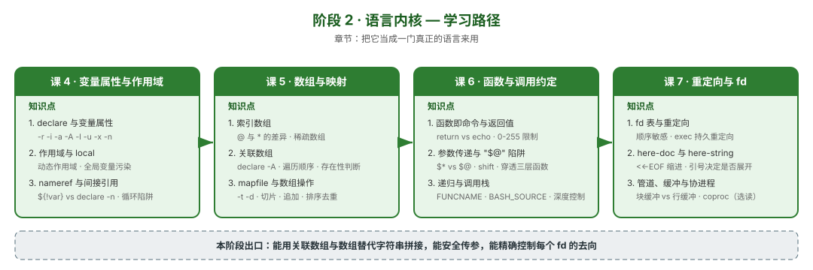

# 阶段 2：语言内核

> 所属课程：Bash 编程 ｜ 故事章节：把它当成一门真正的语言来用 ｜ 上一阶段：[阶段 1](../1-重看地基/overview.md) ｜ 下一阶段：[阶段 3](../3-进程边界/overview.md)

## 🎯 本阶段目标

- 熟练使用 bash 的**数据结构**（数组、关联数组、变量属性），替代"用字符串拼、用 eval 解"的写法
- 精确控制脚本的**输入与输出**（fd、重定向、here-doc），而不是只会 `>` 和 `|`
- 理解 bash 的**作用域模型**是动态作用域，知道它会在什么时候坑你

## 📍 学习重点

- **`declare` 家族**：`-r`（只读）`-i`（整数）`-a`（索引数组）`-A`（关联数组）`-l`/`-u`（大小写）`-x`（导出）`-n`（nameref）。这些属性决定了变量"能做什么"，而大多数脚本只用了默认的字符串
- **动态作用域**：`local` 不是"局部变量"，是"函数执行期间可见"。被调用函数能看见调用者的 `local` 变量——这是 bash 与主流语言的根本差异，也是无数诡异 bug 的来源
- **`@` 与 `*`**：数组展开的两套语义，`"$@"` 与 `"$*"` 的差别在引号下才会显现
- **函数即命令**：函数是**命令**，返回值只能是 0-255，且 `return` 只能返回数字——要传字符串只能靠 stdout 或 nameref
- **fd 表**：重定向**顺序敏感**（`2>&1 >file` 与 `>file 2>&1` 完全不同），`exec` 可做持久重定向，这是把日志框架塞进 shell 的基础
- **管道缓冲**：子进程输出是块缓冲的，这是"交互式脚本卡住不输出"的根因

## ✅ 必须掌握的知识点

| 知识点 | 所属课 | 学完应能 |
|--------|--------|----------|
| declare 与变量属性 | 课 4 | 用 `declare -A` 建映射、`-r` 防误改、`-l`/`-u` 免 tr |
| 作用域与 local | 课 4 | 解释动态作用域导致的变量污染，并用 `local` 与命名约定规避 |
| nameref 与间接引用 | 课 4 | 用 `declare -n` 实现"传引用"，并避开 nameref 的循环引用陷阱 |
| 索引数组 | 课 5 | 正确展开数组（`"${arr[@]}"`），处理稀疏数组 |
| 关联数组 | 课 5 | 用关联数组做计数、去重、配置表；判断键是否存在 |
| mapfile 与数组操作 | 课 5 | 用 `mapfile -t` 安全读入行；做切片、追加、排序去重 |
| 函数即命令与返回值 | 课 6 | 区分 return 与 echo 的适用边界；处理 0-255 限制 |
| 参数传递与 `"$@"` 陷阱 | 课 6 | 把参数数组原样穿过三层函数，不丢不裂 |
| 递归与调用栈 | 课 6 | 用 `FUNCNAME` / `BASH_SOURCE` 打印调用栈；控制递归深度 |
| fd 表与重定向 | 课 7 | 解释重定向顺序差异；用 `exec` 做脚本级日志重定向 |
| here-doc 与 here-string | 课 7 | 控制 here-doc 内是否展开；生成配置文件 |
| 管道、缓冲与协进程 | 课 7 | 解释并规避块缓冲导致的输出卡住 |

> 课 7 的**协进程（`coproc`）**在本课程中列为**拓展阅读**：它在真实脚本中使用率极低，且难以调试，不占主知识点篇幅（大纲评审 P1 已采纳）。

## 🗺️ 本阶段路径图

## 本阶段产出

- [x] `lessons/lesson-04-变量属性与作用域.md`（2026-09-04 交付，1145 行，66 项复核全通过，评审 P0×0 / P1×3 已修）
- [x] `lessons/lesson-05-数组与映射.md`（2026-09-04 交付，1259 行，75 项复核 + 学员视角照抄验证全通过，评审 P0×0 / P1×2 已修）
- [x] `lessons/lesson-06-函数与调用约定.md`（2026-09-04 交付，1464 行，62 项复核 + 41 代码块照抄验证全通过，评审 P0×0 / P1×3 已修）
- [x] `lessons/lesson-07-重定向与文件描述符.md`（2026-09-04 交付，1611 行，64 项复核 + 44 代码块照抄验证全通过，评审 P0×0 / P1×3 已修）

## 📍 阶段进度

- **课 4 已完成**（2026-09-04）：declare 属性族、动态作用域与 local、nameref 与间接引用
- **课 5 已完成**（2026-09-04）：索引数组、关联数组、mapfile 与数组操作
- **课 6 已完成**（2026-09-04）：函数即命令与返回值、参数传递与 `"$@"` 陷阱、递归与调用栈
- **课 7 已完成**（2026-09-04）：fd 表与重定向、here-doc 与 here-string、管道缓冲与协进程
- **阶段 2 全部完成**（2026-09-04）：4 课 12 知识点交付完毕
- **下一阶段**：阶段 3《进程边界》课 8《子shell与执行上下文》——本课反复出现"管道两侧在子 shell 里"（`while read` 改的变量传不出来），但没展开子 shell **继承什么、不继承什么**；同时留了一个伏笔：`exec` 改 fd **不创建子 shell**（直接改当前 shell 的 fd 表），这正是不用子 shell 也能改 fd 的原因。阶段 3 从这两条线索切入

## 🔑 课 7 核心结论（供后续课程引用）

1. **重定向从左到右复制指针**：`n>&m` 是 dup2（当时复制），不是永久关联。`2>&1 >log` 错误上屏、`>log 2>&1` 都在日志。实测佐证：先 `exec 2>&1` 再 `exec 1>/dev/null`，走 fd2 的输出仍在终端
2. **`&>` 不可移植且静默失效**：bash 下等价于 `>file 2>&1`，但 dash 把 `&` 当后台符——实测 e.log **0 字节**、内容全上屏、**退出码仍 0**。需要移植的脚本一律用 `>file 2>&1`
3. **here-doc 定界符加引号 = 整段不展开**：`'EOF'`/`"EOF"`/`\EOF` 三者等价（双引号也**不**展开）。生成配置文件用**两段拼接**：一段展开变量、一段原样保留 `$remote_addr`
4. **`<<-` 只吃 Tab 不吃空格**：用空格缩进时连结束定界符都失效（`    EOF` 被当内容打印），后续命令被整体吞掉。结束定界符必须在行首、前后都不能有空格
5. **here-string 两特性**：总补**一个尾换行**（空变量 `wc -c` = 1）；**不做词拆分**（`<<< $VAR` 得到完整 "hello world"，而 `printf '%s\n' $VAR` 拆成两个）
6. **缓冲三档 + SIGKILL = 数据蒸发**：连 tty 行缓冲、连管道/文件全缓冲（攒 4KB）。全缓冲时被 `kill -9` → 实测 **0 字节**；加 `-u` 或 `flush()` → 49 字节完整保留。**bash 内建 echo 天然无缓冲**（被强杀仍有内容），风险只在管道里的外部命令
7. **`set -e` 抓不住管道失败**：`false | true` 退出码 0，"不该出现"的 echo 照常打印。必须 `set -eo pipefail`。`PIPESTATUS` 给每段退出码，但**任何命令都会重置它**（长度 3→1），须立刻存变量
8. **`stdbuf` 要加在做缓冲的那个进程上**：给过路的 `cat` 加无效，给 `grep`/`python` 加才有效；对 bash 内建命令完全无效

> ⚠️ **留给阶段 3 的悬念**：本课反复出现"管道两侧在子 shell 里"——`while read` 里改的变量传不出来（1000 行数据 COUNT 仍是 0）。但 `exec` 改 fd 却**不创建子 shell**（直接改当前 shell 的 fd 表）。那么子 shell 到底继承什么、不继承什么？为什么 `export` 能穿透而普通变量不能？为什么 `$( )` 慢而 `exec` 不慢？这是阶段 3 课 8《子 shell 与执行上下文》的核心内容。

## 🔑 课 6 核心结论（供后续课程引用）

1. **三通道分离**：`return` 只装 0-255 退出码且**静默回绕**（300→44）、`echo` 装任意数据但每次 `$( )` 一个子 shell、nameref 装任意类型无子 shell 但会被同名 `local` 遮蔽
2. **`"$@"` 是唯一正确的透传**：无引号的 `$@` 与 `$*` 行为一致都会裂（3 个变 5 个）；穿 N 层要每层都写，漏一层全废（实测 5 个变 7 个），且**零报错**
3. **`return` 无参 = 上一条命令的退出码**，不是 0；`shift` 超限返回 1 且**不改变参数**（配 `set -e` 会静默终止脚本）
4. **递归两道墙**：`FUNCNEST=N` 时**第 N 层**就失败；不设时约 8000 层 SIGSEGV（退出码 **139，stderr 零输出**，本机 `ulimit -s`=8192KB 实测值）
5. **nameref 被同名 `local` 遮蔽**：触发条件是「被调用方 `local` 与 nameref 目标同名」，**不局限递归**（两层嵌套同样遮蔽），零 warning。与课 4 撞名不同（那个给 `circular name reference` warning）
6. **迭代碾压递归**：`fib(24)` 迭代 1ms vs 命令替换 95757ms；迭代还不受 0-255 限制（fib(90) = 2880067194370816120）

> ⚠️ **留给阶段 3 的悬念**：本课反复出现"`$( )` 创建子 shell"，也证明了**函数调用本身不创建子 shell**（`BASHPID`/`BASH_SUBSHELL` 均不变）。那么子 shell 到底继承了什么、不继承什么？为什么 `export` 能穿透而普通变量不能？这是阶段 3 课 8《子 shell 与执行上下文》的核心内容。

## 🔑 课 5 核心结论（供后续课程引用）

1. **遍历唯一正确姿势**：`for x in "${arr[@]}"`——漏引号是数组 bug 头号来源，且**不报错**。含空格元素会被切开（实测 3 个服务变 5 个）
2. **判键存在只用 `-v`**：`[ -n "${m[k]}" ]` 在键存在但值为空时误判。关联数组必须 `declare -A`，否则退化成索引数组且不报错
3. **`set -u` 下数组的三条规则**：未声明数组名取长度**报错**、已声明空数组**安全**、`((关联数组[缺键]++))` **报错**但索引数组当 0
4. **读入用 `mapfile -t`**：`-t` 去换行；从命令输出读用 `< <(cmd)` 避免子 shell；排序去重后必须用 `mapfile` 读回数组，别用 `$(...)`
5. **负偏移必带空格**：`${arr[@]: -2}`，写成 `${arr[@]:-2}` 会退化成默认值语法返回整个数组

> ⚠️ **留给阶段 3 的悬念**：本课反复出现"管道创建子 shell 导致 `while read` 里的变量修改丢失"。为什么管道会创建子 shell？子 shell 到底继承了什么、不继承什么？这是阶段 3 课 8《子 shell 与执行上下文》的核心内容。

## 🔑 课 4 核心结论（供后续课程引用）

1. **属性管个体**：`-r` 焊死不可撤销、`-i` 非数字静默归零、`-x` 导出数组是**静默失败**（父 `-ax`、子拿空、零报错）
2. **作用域管边界**：动态作用域单向可见——子能看见父的 `local`，父看不见子的（指**返回后**）；漏 `local` 会污染调用栈上最近的同名变量
3. **nameref 管传递**：双向别名，可绕过 0-255 返回值限制；**nameref 变量名必须加 `_` 前缀**，与传入变量名同名则**静默失效**（只 warning，函数返回 0，值没改）
4. **诊断第一命令**：变量相关的诡异 bug，先跑 `declare -p 变量名`，看有没有 `l`（local）、`r`（readonly）标记

> ⚠️ **留给阶段 3 的悬念**：`declare -x` 导数组为何静默失败？因为环境变量本质是**字符串到字符串的映射**，装不下数组结构。这个"进程边界"的限制在阶段 3 讲子进程与环境继承时展开。

## 💡 与阶段 1 的分工

阶段 1 管"一行命令怎么被处理"，本阶段管"**多个命令组成的程序**怎么写才不出意外"。课 7 的 fd 与阶段 3 的子 shell 有交集，本阶段只讲 fd 表与重定向本身，进程边界留到阶段 3。
