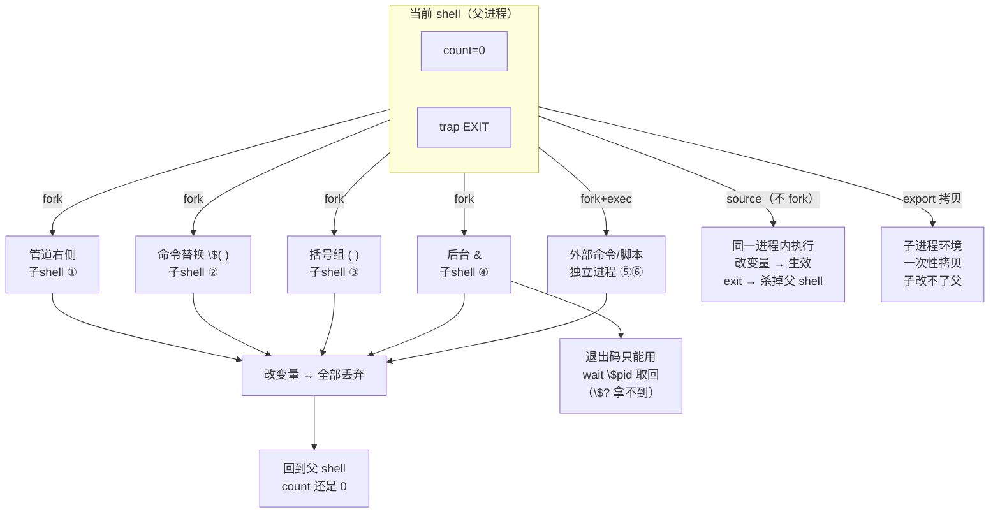

# 第 8 课：子shell 与执行上下文

> 所属阶段：阶段 3《进程边界》｜ 水平：进阶 ｜ 本课知识点：什么会创建子 shell、source 与执行的区别、执行环境继承、作业控制与并发
> 故事情节：循环里的计数器永远是 0——变量明明加了，出了循环就没了
>
> 上一课：[课 7《重定向与文件描述符》](../../2-语言内核/lessons/lesson-07-重定向与文件描述符.md) ｜ 下一课：[课 9《信号trap与清理》](./lesson-09-信号trap与清理.md)

## 🎯 本课目标

- 列举创建子 shell 的六种情形，并把"变量改了没生效"归因为具体哪一种
- 判断该用 `source` 还是执行，说清 `exit` 的杀伤范围
- 用 `export` / `env -i` 控制子进程环境，避开 `BASH_ENV` 陷阱
- 用 `wait` / `wait -n` 实现 N 路并发并正确收集每个后台任务的退出码

---

## 第一幕：起源与场景引入

> 🎬 **场景**：`deploy.sh` 想统计成功部署了几台机器：

```bash
#!/usr/bin/env bash
# 先造出 hosts.txt，保证本文件可独立照抄运行
cat > hosts.txt << 'EOF'
web-01
web-02
web-03
web-04
web-05
EOF

count=0
cat hosts.txt | while read -r host; do
    deploy_one "$host" && ((count++))
done
echo "成功 $count 台"
```

输出永远是"成功 0 台"，哪怕每台都部署成功了。

`deploy_one` 不存在会报错，但不影响观察核心现象——我们真正关心的是最后那行 `echo`。把 `deploy_one` 换成一个必然成功的函数，计数器依然是 0：

```bash
count=0
printf 'a\nb\nc\n' | while read -r line; do
    ((count++))
    echo "  循环内 count=$count"
done
echo "循环外 count=$count"
```

输出：

```text
  循环内 count=1
  循环内 count=2
  循环内 count=3
循环外 count=0
```

循环里明明数到了 3，出了循环就归零。这不是 `count` 被重置，而是**循环压根就没在当前 shell 里跑**。

---

## 第二幕：认知冲突

> ❓ **问题**：`count` 是全局变量，循环体里加了，为什么出循环就没了？

因为**管道把 while 循环送进了子 shell**。子 shell 是父进程的一份副本，它有自己的一份 `count`。循环在副本里把数加到 3，子 shell 一退出，副本连同里面的 `count` 一起销毁，父进程的 `count` 从头到尾没动过。

用 `$BASHPID` 可以当场抓到证据：

```bash
echo "父 shell: BASHPID=$BASHPID PID=$$"
printf 'a\nb\nc\n' | while read -r line; do
    echo "  循环内 BASHPID=$BASHPID PID=$$"
done
```

输出（数字因机器而异，重点看**哪个变了**）：

```text
父 shell: BASHPID=2019763 PID=2019763
  循环内 BASHPID=2019766 PID=2019763
```

`$BASHPID` 从 2019763 变成 2019766——换进程了。而 `$$` 从头到尾都是 2019763，**没变**。

> ⚠️ **`$$` 在子 shell 里不变**，这是最容易踩的坑。很多人用 `$$` 判断"是不是子 shell"，结论永远是"不是"。要判断必须用 `$BASHPID`。

这引出阶段 3 的核心命题：**脚本里存在看不见的进程边界，变量跨越不过去**。

---

## 第三幕：层层揭示

### 知识点 1：什么会创建子 shell

> 本知识点关键点：管道两侧各自一个子 shell、命令替换 `$(...)`、括号组 `( ... )`、后台 `&` 与外部命令、`$BASHPID` 与 `$$` 的区别（子 shell 中 `$$` 不变！）、子 shell 继承全部变量（副本）但修改不回传

#### 一句话定义

**子 shell 是父 shell 用 `fork` 复制出的一个子进程，它完整继承父进程的一切，但对副本的任何修改都会随子 shell 退出而丢弃。**

#### 直觉建立（类比）

把父 shell 想成你手里的**原件**，子 shell 是拿去**复印的一份**：

- 复印机把原件当前状态**完整复制**一份（变量、函数、选项、工作目录全都有）
- 你带着复印件进小会议室，在上面写写画画
- 出来时复印件进碎纸机
- 原件自始至终躺在桌上，一个字没变

关键在于：**复印件里有什么，取决于按下复印键的那一刻**。之后原件再改，复印件也不会同步。

#### 核心原理

创建子 shell 的六种情形，逐一实测（每条都打印 `$BASHPID` 与 `$$` 对比）：

```bash
x=parent
printf 'a\nb\n' | while read -r line; do
    echo "  情形1 管道内: BASHPID=$BASHPID PID=$$ x=$x"
    x=changed_in_pipe
done
echo "  情形1 管道后: x=$x"

y=outer
inner=$(y=changed_in_subst; echo "  情形2 命令替换: BASHPID=$BASHPID y=$y")
echo "$inner"
echo "  情形2 替换后: y=$y"

z=outer
(
    z=changed_in_paren
    echo "  情形3 括号内: BASHPID=$BASHPID z=$z"
)
echo "  情形3 括号后: z=$z"

w=outer
{
    sleep 0.2
    w=changed_in_bg
    echo "  情形4 后台里: BASHPID=$BASHPID w=$w"
} &
wait
echo "  情形4 后台后: w=$w"
```

实测输出：

```text
  情形1 管道内: BASHPID=2019766 PID=2019763 x=parent
  情形1 管道内: BASHPID=2019766 PID=2019763 x=changed_in_pipe
  情形1 管道后: x=parent      ← 改了，没传回来
  情形2 命令替换: BASHPID=2019769 y=changed_in_subst
  情形2 替换后: y=outer       ← 没传回来
  情形3 括号内: BASHPID=2019770 z=changed_in_paren
  情形3 括号后: z=outer       ← 没传回来
  情形4 后台里: BASHPID=2020323 w=changed_in_bg
  情形4 后台后: w=outer       ← 没传回来
```

四种情形行为完全一致：**改了不回传**。

剩下两种需要区分清楚：

```bash
# 情形5：外部命令 —— 独立进程，不是子shell
echo "  情形5 bash 自身: BASHPID=$BASHPID"
/bin/sleep 0.1
echo "  情形5 sleep 跑完就没了，不继承 shell 变量"

# 情形6：执行脚本（非 source）
cat > /tmp/child.sh << 'EOF'
echo "  情形6 脚本内: BASHPID=$BASHPID PID=$$"
v=changed_in_script
echo "  情形6 脚本内: v=$v"
EOF
v=outer
bash /tmp/child.sh
echo "  情形6 脚本后: v=$v"

# 对比：source 不创建新进程
source /tmp/child.sh
echo "  source 后: v=$v BASHPID=$BASHPID"
```

输出：

```text
  情形5 bash 自身: BASHPID=2020320
  情形6 脚本内: BASHPID=2020350 PID=2020350
  情形6 脚本内: v=changed_in_script
  情形6 脚本后: v=outer        ← 传不回来
  情形6 脚本内: BASHPID=2020320 PID=2020320
  情形6 脚本内: v=changed_in_script
  source 后: v=changed_in_script BASHPID=2020320   ← 传回来了！
```

`source` 那两行是关键对照：**BASHPID 与父完全相同（2020320），且 `v` 的修改成功传回**。这就是为什么环境配置文件必须用 `source`。

> 📌 **精确区分**：严格来说，外部命令（情形5）和被执行的脚本（情形6）是**独立进程**不是子 shell——它们是 `fork` + `exec`，用新程序替换了自身。子 shell 是 `fork` 后**不 exec**，继续跑 shell 代码。二者对"变量传不回来"的表现一致，所以常被混为一谈，但机制不同。

#### 示例演示：修复那个计数器

第一幕的 bug 有四种修法：

```bash
printf 'h1\nh2\nh3\nh4\nh5\n' > hosts.txt

# 写法A：管道版（坏）
count=0
cat hosts.txt | while read -r host; do ((count++)); done
echo "  A 管道版: count=$count"

# 写法B：重定向版（推荐）
count=0
while read -r host; do ((count++)); done < hosts.txt
echo "  B 重定向版: count=$count"

# 写法C：here-string 版
count=0
while read -r host; do ((count++)); done <<< "$(cat hosts.txt)"
echo "  C here-string版: count=$count"

# 写法D：进程替换版
count=0
while read -r host; do ((count++)); done < <(cat hosts.txt)
echo "  D 进程替换版: count=$count"

# 写法E：lastpipe
shopt -s lastpipe
count=0
cat hosts.txt | while read -r host; do ((count++)); done
echo "  E lastpipe版: count=$count"
shopt -u lastpipe
```

实测输出：

```text
  A 管道版: count=0     ← 坏
  B 重定向版: count=5   ← 好
  C here-string版: count=5   ← 好
  D 进程替换版: count=5   ← 好
  E lastpipe版: count=5   ← 好
```

**写法 B 是首选**：`while ... done < file` 让循环留在当前 shell（没有管道就没有子 shell），同时避免了 `cat` 的无谓进程。写法 D（进程替换）保留了"数据来源是个命令"的写法，代价是多一个进程。

**写法 E 有隐藏前提**——`lastpipe` 只在**作业控制关闭**时生效。实测：

```bash
#!/usr/bin/env bash
set -m              # 开启作业控制
shopt -s lastpipe
c=0
printf 'a\nb\nc\n' | while read -r l; do ((c++)); done
echo "  开启作业控制(-m) + lastpipe: c=$c"
```

输出：`开启作业控制(-m) + lastpipe: c=0` —— **限流失效了**。

脚本默认作业控制是关的，所以 `lastpipe` 通常能用；但一旦有人加了 `set -m`，它就静默失效。这是 `lastpipe` 不如写法 B 稳妥的原因。

#### 子 shell 继承什么、不继承什么

```bash
echo "--- 1. 普通变量：继承（副本），改了不回传 ---"
a=1
( echo "  子 a=$a"; a=99; echo "  子改后 a=$a" )
echo "  父 a=$a"

echo "--- 2. shell 选项：继承 ---"
shopt -s nocasematch
( shopt -q nocasematch && echo "  子: nocasematch 开启(继承)" )
shopt -u nocasematch

echo "--- 3. 函数：继承（不需要 export）---"
myfunc() { echo "  子能调用函数"; }
( myfunc )

echo "--- 4. 工作目录：继承，子改了不回传 ---"
mkdir -p subdir && cd subdir
( cd /tmp; echo "  子 PWD=$PWD" )
echo "  父 PWD=$PWD"

echo "--- 6. local 变量：子shell 能看到 ---"
f() { local lv=local_val; ( echo "  子看到 local: lv=$lv" ); }
f
```

实测输出：

```text
--- 1. 普通变量：继承（副本），改了不回传 ---
  子 a=1
  子改后 a=99
  父 a=1
--- 2. shell 选项：继承 ---
  子: nocasematch 开启(继承)
--- 3. 函数：继承 ---
  子能调用函数
--- 4. 工作目录：继承，子改了不回传 ---
  子 PWD=/tmp
  父 PWD=/tmp/c8work/subdir
--- 6. local 变量：子shell 能看到 ---
  子看到 local: lv=local_val
```

**trap 的行为需要特别说清楚**——常见说法"子 shell 会重置 trap"是**不准确**的：

```bash
#!/usr/bin/env bash
trap 'echo "  [TRAP触发]"' EXIT

echo "  A: 进入子shell"
(
    echo "    A: 子shell内 trap -p EXIT:"
    trap -p EXIT | sed 's/^/      /'
    echo "    A: 子shell即将退出"
)
echo "  A: 子shell已退出，回到父"
echo "  A: 主脚本结束"
```

输出：

```text
  A: 进入子shell
    A: 子shell内 trap -p EXIT:
      trap -- 'echo "  [TRAP触发]"' EXIT
    A: 子shell即将退出
  A: 子shell已退出，回到父      ← 子shell 退出时没有触发！
  A: 主脚本结束
  [TRAP触发]                    ← 只在父脚本最终退出时触发一次
```

三个精确结论：

1. **子 shell `( )` 和 `$( )` 继承 trap 设置**（`trap -p` 能看到）
2. **但子 shell 退出时不触发** EXIT trap——只在最外层脚本结束时触发一次
3. **独立进程（`bash -c`、`./script.sh`）完全不继承 trap**（`trap -p` 为空）

第 3 条实测：

```bash
#!/usr/bin/env bash
trap 'echo "  [父TRAP触发]"' EXIT
bash -c 'echo "  B: 子进程内 trap -p EXIT:"; trap -p EXIT | sed "s/^/    /"; echo "  B: (空=未继承)"'
echo "  B: 父继续"
```

输出：

```text
  B: 子进程内 trap -p EXIT:
  B: (空=未继承)
  B: 父继续
  [父TRAP触发]
```

> 💡 这个区别在课 9 会再次用到：正因为子 shell 退出不触发 EXIT trap，所以"清理逻辑写在 EXIT trap 里"是安全的——管道子 shell 退出不会误触发清理。

#### 常见误区

**误区一：用 `$$` 判断是否在子 shell。**
`$$` 在子 shell 中保持不变，永远显示原始 shell 的 PID。必须用 `$BASHPID`。

**误区二：以为 `lastpipe` 开了就一定生效。**
它在作业控制开启（`set -m`）时静默失效。实测 `c=0`。

**误区三：以为子 shell 会重置 trap，所以清理逻辑会被管道误触发。**
恰恰相反——子 shell 继承 trap 但**退出时不触发**，EXIT trap 只在最外层脚本结束时跑一次。

**误区四：把"外部命令"和"子 shell"混为一谈。**
外部命令是 `fork` + `exec`（换了个程序），子 shell 是 `fork` 不 `exec`（还是 shell）。变量都传不回来，但机制不同，这个区别在课 9 讲 trap 继承时很关键。

#### 一句话记住

**子 shell 是复印机——复印件随便改，原件纹丝不动；`$$` 看不出分身，`$BASHPID` 才能。**

---

### 知识点 2：source 与执行的区别

> 本知识点关键点：`source` / `.` 在当前 shell 进程内执行、执行脚本会 fork 新进程、被 source 的脚本里 `exit` 会**终止你的 shell**、`return` 在 source 的脚本里合法且只结束该脚本、`$0` 与 `${BASH_SOURCE[0]}` 的差异、获取脚本真实路径的标准写法

#### 一句话定义

**`source`（或 `.`）把文件内容逐行读进"当前 shell"执行，不创建新进程；直接执行则 fork 一个新 shell 来跑，跑完销毁。**

#### 直觉建立（类比）

想象两种请人帮忙的方式：

- **执行**（`./script.sh`）：你把任务写在纸上，交给一个新同事去做。他有自己的办公桌（独立进程），做完把结果告诉你，然后走人。他桌上摆什么、改什么，跟你无关。
- **source**：你把任务内容**直接念给自己听**，自己动手做。用的就是你的办公桌（当前 shell），所以改的东西全留在你这儿。

这解释了配置文件为什么必须用 `source`：改的是环境变量，必须留在当前 shell 里。

#### 核心原理

**`exit` 的杀伤范围完全不同**——这是最要命的区别：

```bash
cat > killer.sh << 'EOF'
echo "  killer.sh: 我被执行了"
exit 3
EOF
chmod +x killer.sh

echo "  [执行方式]"
bash -c './killer.sh; echo "  这行会执行"'

echo "  [source 方式]"
bash -c 'source ./killer.sh; echo "  这行不会执行"'
echo "  source 那次的外层退出码=$?"
```

输出：

```text
  [执行方式]
  killer.sh: 我被执行了
  这行会执行              ← 脚本 exit 只结束自己
  [source 方式]
  killer.sh: 我被执行了
  source 那次的外层退出码=3   ← 整个 shell 被干掉，后面的 echo 没跑
```

> ⚠️ **所以库文件里绝对不能写 `exit`。** 库文件是拿去 source 的，一个 `exit` 就把调用者的 shell 干掉了。库文件要提前返回，用 `return`。

**`return` 的合法性取决于调用方式**：

```bash
cat > rtn.sh << 'EOF'
echo "  rtn.sh: 开始"
return 0
echo "  rtn.sh: 这行不会执行"
EOF
chmod +x rtn.sh

echo "  [source 方式]"
bash -c 'source ./rtn.sh; echo "  source 后继续，退出码=$?"'

echo "  [执行方式]"
bash -c './rtn.sh; echo "  执行后退出码=$?"'
```

输出：

```text
  [source 方式]
  rtn.sh: 开始
  source 后继续，退出码=0        ← return 在 source 下合法
  [执行方式]
  rtn.sh: 开始
./rtn.sh: line 2: return: can only `return' from a function or sourced script
  执行后退出码=2
```

这里藏着一个**双重陷阱**：

1. `return` 报错了，但**脚本没有中断**，继续往下执行——错误被降级成一行 stderr 警告。
2. 退出码是 **2**（`return` 报错本身的退出码），而不是你 `return 0` 指定的 0。

如果 `return` 后面还有别的命令，退出码就变成后续命令的：

```bash
printf 'echo S\nreturn 0\necho AFTER\n' > rtn2.sh
chmod +x rtn2.sh
./rtn2.sh 2>&1
```

输出：

```text
S
./rtn2.sh: line 2: return: can only `return' from a function or sourced script
AFTER
```

`AFTER` 正常打印，脚本退出码 0。**错误被完全吞掉。**

而在 source 场景下，`return` 的值正常传递（实测 `return 3` → 调用者拿到 3），这才是它该有的行为。

> ⚠️ 结论：**库文件必须用 `return` 而不是 `exit`，但要用对地方——它只在被 source 时才按预期返回；被直接执行时只会得到一行警告加一个意外退出码。** 想让库文件两种调用方式都安全，可以在开头加保护（课 11 会给出标准写法）。

**`$0` 与 `${BASH_SOURCE[0]}`**：

```bash
cat > whoru.sh << 'EOF'
echo "  \$0              = $0"
echo "  \${BASH_SOURCE[0]} = ${BASH_SOURCE[0]}"
EOF
chmod +x whoru.sh

echo "  [执行]"
./whoru.sh
echo "  [source]"
source ./whoru.sh
```

输出：

```text
  [执行]
  $0              = ./whoru.sh
  ${BASH_SOURCE[0]} = ./whoru.sh
  [source]
  $0              = /tmp/c8work/p2run.sh     ← 变成了父脚本的名字！
  ${BASH_SOURCE[0]} = ./whoru.sh             ← 仍然指向自己
```

**source 时 `$0` 会变成调用者的名字**，只有 `${BASH_SOURCE[0]}` 稳定指向当前文件。

#### 示例演示：获取脚本真实路径的标准写法

```bash
cat > path.sh << 'EOF'
SCRIPT_DIR="$(cd "$(dirname "${BASH_SOURCE[0]}")" && pwd)"
echo "  SCRIPT_DIR = $SCRIPT_DIR"
echo "  SCRIPT     = ${BASH_SOURCE[0]}"
EOF

echo "  [source 调用]"
source ./path.sh

echo "  [从别的目录执行]"
cd /tmp && bash /tmp/c8work/path.sh
```

输出：

```text
  [source 调用]
  SCRIPT_DIR = /tmp/c8work
  SCRIPT     = ./path.sh
  [从别的目录执行]
  SCRIPT_DIR = /tmp/c8work
  SCRIPT     = /tmp/c8work/path.sh
```

两种方式都正确解析到 `/tmp/c8work`。这就是那句标准咒语：

```bash
SCRIPT_DIR="$(cd "$(dirname "${BASH_SOURCE[0]}")" && pwd)"
```

拆解：

- `${BASH_SOURCE[0]}` —— 当前脚本文件名（source 和执行下都对）
- `dirname` —— 取目录部分
- `cd ... && pwd` —— 进到那个目录再取绝对路径（把相对路径和符号链接都解析掉）

> 💡 用 `$0` 代替 `${BASH_SOURCE[0]}` 是常见 bug：脚本被 source 时路径就错了。

#### 常见误区

**误区一：在库文件里用 `exit`。**
库文件是给别人 source 的，`exit` 会连调用者的 shell 一起杀掉。用 `return` 提前返回。

**误区二：用 `$0` 取脚本路径。**
被 source 时 `$0` 是调用者的名字。用 `${BASH_SOURCE[0]}`。

**误区三：以为 `return` 报错会中断脚本。**
实测：执行方式下 `return` 只打印一行警告，脚本继续跑。若它是最后一条命令，退出码为 2；若后面还有命令，退出码由后续命令决定（错误被完全吞掉）。

**误区四：`source` 和 `.` 有区别。**
在 bash 中二者完全等价（`.` 是 POSIX 写法，`source` 是 bash 增强）。唯一差异：`.` 可移植到 dash，`source` 不能。

#### 一句话记住

**执行是派人去干（干完走人，改不了你家），source 是自己干（改的全留在你家）——所以库文件用 `return`，配置文件用 `source`。**

---

### 知识点 3：执行环境继承

> 本知识点关键点：只有 `export` 的变量进入子进程环境、`export` 是"拷贝"而非"共享"（子改不了父）、`env -i` 干净环境、`env VAR=x cmd` 临时注入、`declare -x` 与 `export` 等价、`BASH_ENV` 对非交互 shell 的隐式 source 陷阱、函数也能 `export -f`（bash 专有）

#### 一句话定义

**环境变量是进程创建时的一次性拷贝：父进程在 fork 的那一刻把 `export` 过的变量复制给子进程，此后各改各的，互不相干。**

#### 直觉建立（类比）

把环境想象成**孩子出生时给的行李箱**：

- 孩子出生（fork）那一刻，你把他需要的东西**装进箱子**（export 的变量）
- 装完就封箱，孩子带走的是**副本**
- 孩子在箱子里换掉某件东西，你箱子里的原件不变
- 你后来又买了新东西放进自己箱子，孩子那儿也不会有

所以"改了 PATH 想让父 shell 也生效"注定失败——行李箱早就封了。

#### 核心原理

```bash
echo "--- 1. 只有 export 的变量进入子进程 ---"
plain=notexported
export shared=exported
bash -c 'echo "  子进程: plain=[$plain] shared=[$shared]"'

echo "--- 2. export 是拷贝，子改不了父 ---"
export ev=parent_value
bash -c 'echo "  子: ev=$ev"; ev=child_value; echo "  子改后: ev=$ev"'
echo "  父: ev=$ev  (未变)"

echo "--- 3. declare -x 与 export 等价 ---"
declare -x dv=from_declare
bash -c 'echo "  子进程看到 dv=$dv"'

echo "--- 4. env VAR=x cmd 临时注入（不改当前 shell）---"
echo "  注入前: TEMPVAR=[$TEMPVAR]"
env TEMPVAR=injected bash -c 'echo "  子进程: TEMPVAR=[$TEMPVAR]"'
echo "  注入后: TEMPVAR=[$TEMPVAR]  (未污染)"
```

实测输出：

```text
--- 1. 只有 export 的变量进入子进程 ---
  子进程: plain=[] shared=[exported]
--- 2. export 是拷贝，子改不了父 ---
  子: ev=parent_value
  子改后: ev=child_value
  父: ev=parent_value  (未变)
--- 3. declare -x 与 export 等价 ---
  子进程看到 dv=from_declare
--- 4. env VAR=x cmd 临时注入（不改当前 shell）---
  注入前: TEMPVAR=[]
  子进程: TEMPVAR=[injected]
  注入后: TEMPVAR=[]  (未污染)
```

#### 示例演示：复现"cron 里脚本跑不起来"

这是环境继承最经典的实战故障。很多人遇到"手动跑得好好的，放进 crontab 就失败"。

```bash
echo "  [正常环境]"
bash -c 'echo "    awk -> $(command -v awk)"'

echo "  [模拟 cron: PATH=/usr/bin:/bin]"
env -i PATH=/usr/bin:/bin bash -c 'echo "    awk -> $(command -v awk)"; echo "    ifconfig -> $(command -v ifconfig)"'
```

输出：

```text
  [正常环境]
    awk -> /usr/bin/awk
  [模拟 cron: PATH=/usr/bin:/bin]
    awk -> /usr/bin/awk
    ifconfig ->                    ← 找不到了！
```

`ifconfig` 在 `/sbin` 下，cron 的短 PATH 里没有它，命令静默失败。

极端情况更能说明问题——**PATH 完全为空时，连 bash 自己都找不到**（下面这段**故意会失败**，请照抄观察报错）：

```bash
env -i PATH= bash -c 'echo hello'
```

输出：`env: 'bash': No such file or directory`

> ⚠️ 注意这个报错来自 `env` 而不是 bash——`env` 在设好 PATH 后去找 bash，PATH 为空就找不着了。这正是 cron 任务"莫名其妙不执行"的根因之一。

**排查手法**：在脚本开头打印环境，和手动执行时对比。

```bash
#!/usr/bin/env bash
echo "PATH=$PATH" > /tmp/env-debug.log
env | sort >> /tmp/env-debug.log
```

#### BASH_ENV 陷阱

这是本课最隐蔽的一个坑。**`BASH_ENV` 指向的脚本会被每一个非交互 bash 隐式 source，没有任何显式调用**：

```bash
cat > sneaky.sh << 'EOF'
echo "    [BASH_ENV 脚本被执行了! 没人显式调用我]"
INJECTED=yes
EOF

echo "  [未设 BASH_ENV]"
bash -c 'echo "    INJECTED=[$INJECTED]"'

echo "  [设了 BASH_ENV]"
export BASH_ENV=/tmp/c8work/sneaky.sh
bash -c 'echo "    INJECTED=[$INJECTED]"'

unset BASH_ENV
```

输出：

```text
  [未设 BASH_ENV]
    INJECTED=[]
  [设了 BASH_ENV]
    [BASH_ENV 脚本被执行了! 没人显式调用我]
    INJECTED=[yes]
```

**交互 shell 不受影响**——`BASH_ENV` 只对非交互 shell 生效。下面这段是交互 shell 的写法，**在非 tty 环境下会挂起（`bash -i` 等待终端输入），不要照抄执行**：

```text
export BASH_ENV=/tmp/c8work/sneaky.sh
bash -i -c 'echo "  交互: INJECTED=[$INJECTED]"'
```

输出：`交互: INJECTED=[]`

> ⚠️ 上面标记为 `text` 而非 `bash`，就是因为它会挂起。本地复现请用下面的替代写法。

```bash
export BASH_ENV=/tmp/c8work/sneaky.sh
echo "  非交互(带 BASH_ENV): $(bash -c 'echo $INJECTED' </dev/null 2>/dev/null)"
echo "  非交互(未带):        $(env -u BASH_ENV bash -c 'echo [$INJECTED]' </dev/null 2>/dev/null)"
unset BASH_ENV
```

输出：

```text
  非交互(带 BASH_ENV): yes
  非交互(未带):        []
```

> 💡 这既是陷阱也是武器。陷阱：某个 CI 环境设了 `BASH_ENV`，你的每个脚本都被注入了意外内容，极难排查。武器：可以用它给所有脚本统一注入公共函数库。用之前先确认 `echo $BASH_ENV` 是空的。

#### export -f：导出函数

bash 专有能力，把函数塞进环境让子进程能用：

```bash
greet() { echo "    Hello from $1"; }
export -f greet
bash -c 'greet "子进程"'
echo "  环境中导出记录数: $(env | grep -c 'BASH_FUNC_greet')"
```

输出：

```text
    Hello from 子进程
  环境中导出记录数: 1
```

函数在环境里以 `BASH_FUNC_xxx%%` 的形式存在。

> ⚠️ 这只对 bash 子进程有效，且**子 shell 不需要它**——子 shell 直接继承父 shell 的函数，因为它是完整副本。实测：

```bash
plainfunc() { echo "    普通函数也能用"; }
( plainfunc )     # 无需 export -f，直接能用
```

#### 常见误区

**误区一：以为在子进程里改 PATH 会影响父 shell。**
不可能，行李箱早就封了。要改当前 shell 的环境，必须 `source` 一个改 PATH 的脚本。

**误区二：以为 `readonly` 变量会被子进程继承。**
实测**不会**：

```bash
declare -r RO=readonly_val
bash -c 'echo "    子进程看到 RO=[$RO]"'   # 输出空
( echo "    子shell看到 RO=[$RO]" )        # 输出 readonly_val
```

`readonly` 需要配合 `export` 才能进子进程，而子 shell 因为是完整副本所以能看到。

**误区三：忽略 `BASH_ENV`。**
排查诡异问题时，先看 `echo $BASH_ENV` 是否为空。

**误区四：以为 `env -i` 能造出真正的空环境。**
bash 启动时会补一个默认 PATH（`/usr/local/sbin:/usr/local/bin:/usr/sbin:/usr/bin:/sbin:/bin`）。要精确控制 PATH，显式写 `env -i PATH=xxx`。

#### 一句话记住

**export 是给子进程打包行李——装完封箱，各改各的；`BASH_ENV` 则是那个没人请也会自己来的客人。**

---

### 知识点 4：作业控制与并发

> 本知识点关键点：后台 `&` 启动作业、`wait` 等待全部与 `wait -n` 等待任意一个、`$!` 取上一个后台 PID、`jobs` `-p` 与 `-r`、并行度控制（计数器 + `wait -n` 实现 N 路并发、或 `xargs -P`）、后台作业的退出码**只能靠 `wait` 获取**（`$?` 拿不到）、中断时批量终止后台任务（与课 9 trap 联动）、后台任务与子 shell 的关系

#### 一句话定义

**后台任务 `&` 会 fork 一个子 shell 去跑，它的退出码不进 `$?`，必须显式用 `wait $pid` 才能取回；`wait -n` 则用于实现"完成一个补一个"的 N 路限流。**

#### 直觉建立（类比）

**串行是排队办事——一个窗口，前面的人办完才轮到下一个。**

**并发是开 N 个窗口**——但窗口不是越多越好：

- 开 2 个窗口， throughput 大约翻倍
- 开 100 个窗口，柜员全在忙，大厅挤爆，反而更慢（CPU 上下文切换 + 内存）
- 开 8 个窗口处理 100 个人，是最优解

所以生产脚本要**限流**：固定开 N 个窗口，谁空了谁接下一个。

#### 核心原理

**退出码只能靠 `wait` 取回**：

```bash
( sleep 0.5; exit 9 ) &
bgpid=$!
echo "  后台 PID=$bgpid 已启动(会 sleep 0.5 后以 9 退出)"
sleep 0.1
echo "  此刻 \$? = $?  ← 这是 sleep 的退出码，与后台任务无关"
wait $bgpid
rc=$?
echo "  wait \$bgpid 后 rc=$rc  ← 这才是后台任务的退出码"
```

输出：

```text
  后台 PID=2029825 已启动(会 sleep 0.5 后以 9 退出)
  此刻 $? = 0  ← 这是 sleep 的退出码，与后台任务无关
  wait $bgpid 后 rc=9  ← 这才是后台任务的退出码
```

`$?` 永远反映**最近一条前台命令**，后台任务死活与它无关。这是"脚本里明明有命令失败了却没发现"的常见来源。

**`set -e` 对后台任务的行为需要精确区分**——我原以为 `set -e` 完全管不到后台，实测推翻了这个预期：

```bash
#!/usr/bin/env bash
set -e
( exit 5 ) &
wait $!
echo "  这行执行了 = set -e 没杀掉脚本"
```

输出：`脚本退出码=5`，且**"这行执行了"没有打印**。

> 📌 **这段脚本会以 5 退出，这是预期结果，不是报错。** 它证明的正是"裸 `wait` 失败时 `set -e` 会终止脚本"——第三行没打印就是证据。

**裸 `wait` 失败时，`set -e` 是生效的**（脚本以 5 退出）。

但如果 `wait` 被包在条件里，`set -e` 就失效了：

```bash
#!/usr/bin/env bash
set -e
( sleep 0.3; echo "  [后台任务: 我要失败了]"; exit 1 ) &
bgpid=$!
if wait "$bgpid"; then
    echo "  [wait 返回成功]"
else
    rc=$?
    echo "  [wait 返回失败 rc=$rc] —— set -e 仍然不会因此退出脚本"
fi
echo "  [脚本继续执行到最后]"
```

输出：

```text
  [后台任务: 我要失败了]
  [wait 返回失败 rc=1] —— set -e 仍然不会因此退出脚本
  [脚本继续执行到最后]
脚本退出码=0
```

**结论**：`set -e` 对 `wait` 的管束遵循它的通用规则——**被 `if` / `&&` / `||` / `while` 包裹的命令不受 `set -e` 管辖**。这不是后台任务的特权，是 `set -e` 本身的语义（课 11 会详细展开）。

> 📌 实践含义：如果你要"后台任务失败就终止脚本"，用裸 `wait $pid`；如果你要"收集所有结果最后汇总"，用 `if wait` 并自己记录——两种写法都合法，但别指望 `if wait` 还能触发 `set -e`。

**`wait` 的两个边界**：

```bash
bash -c 'wait -n; echo "  无后台任务时 wait -n 退出码=$?"'
bash -c 'wait 99999; echo "  wait 不存在PID 退出码=$?"'
```

输出：

```text
  无后台任务时 wait -n 退出码=127
bash: line 1: wait: pid 99999 is not a child of this shell
  wait 不存在PID 退出码=127
```

`wait` 一个非子进程会报错并返回 127。所以保存的 PID 变量如果为空或失效，`wait "$pid"` 会静默失败。

#### 示例演示：N 路限流并行部署

**方案一：计数器 + `wait -n`**（纯 bash，推荐）

```bash
#!/usr/bin/env bash
MAX=4
running=0
for i in {1..10}; do
    # 若已达上限，等任意一个结束
    while [ "$running" -ge "$MAX" ]; do
        wait -n
        running=$((running - 1))
    done
    {
        echo "    任务$i 开始"
        sleep 0.3
        echo "    任务$i 结束"
    } &
    running=$((running + 1))
done
wait
echo "  10 个任务全部完成，最大并发=$MAX"
```

实测输出（节选）：

```text
    任务1 开始 (running=1)
    任务2 开始 (running=2)
    任务3 开始 (running=3)
    任务4 开始 (running=4)
    任务3 结束
    任务4 结束
    任务2 结束
    任务1 结束
    任务5 开始 (running=4)
    ...
  10 个任务全部完成，最大并发=4
real	0m0.908s
```

严格保持 4 路并发，10 个任务 0.908s 完成（串行需要 3s）。

**方案二：`jobs -rp | wc -l` 计数**（写法更短，但依赖 `jobs` 输出）

```bash
#!/usr/bin/env bash
MAX=4
for i in {1..8}; do
    while [ "$(jobs -rp | wc -l)" -ge "$MAX" ]; do
        sleep 0.05
    done
    sleep 0.2 &
done
wait
echo "  jobs -rp 法: 完成"
```

> ⚠️ 方案二有个隐患：`jobs` 在非交互脚本里有时不报告已终止的作业，计数可能漂移。方案一的计数器由你自己维护，更可控。

**方案三：`xargs -P`**（最简单，适合"对一堆输入跑同一个命令"）

```bash
printf 'h1\nh2\nh3\nh4\nh5\n' | xargs -P 4 -I{} sh -c 'echo "  处理 {}"; sleep 0.2'
```

`-P 4` 就是 4 路并发。适合输入是列表、每个处理逻辑相同的场景。

#### 中断时批量终止后台任务

并发脚本被 Ctrl-C 打断时，后台任务不会自动死掉，会变成孤儿继续跑。**必须记录 PID 并批量 kill**：

```bash
#!/usr/bin/env bash
pids=()
for i in 1 2 3; do
    ( sleep 5 ) &
    pids+=($!)
done
echo "  启动了 ${#pids[@]} 个后台任务: ${pids[*]}"
sleep 0.2
echo "  批量终止..."
kill "${pids[@]}" 2>/dev/null
sleep 0.2
echo "  剩余存活: $(jobs -rp | wc -l) 个"
wait 2>/dev/null
echo "  完成"
```

输出：

```text
  启动了 3 个后台任务: 2033953 2033954 2033955
  批量终止...
  剩余存活: 0 个
  完成
```

> 💡 这个模式在课 9 会和 `trap` 结合，升级成"被中断时自动清理"：`trap 'kill "${pids[@]}" 2>/dev/null' EXIT`。

#### 后台任务是子 shell

后台 `&` 启动的也是子 shell，所以变量改不回传：

```bash
v=outer
{ v=changed_in_bg; } &
wait
echo "  后台后 v=$v  (未变，证明是子shell)"
```

输出：`后台后 v=outer  (未变，证明是子shell)`

因此**并行任务的结果不能靠改变量汇总**，必须借助外部载体：写临时文件、或用 `wait $pid` 收集退出码。

#### 常见误区

**误区一：以为 `$?` 能拿到后台任务的退出码。**
拿不到，`$?` 只反映最近的前台命令。必须 `wait $pid`。

**误区二：以为 `set -e` 能捕获后台任务失败。**
裸 `wait` 可以；`if wait` / `wait ||` 不行。这是 `set -e` 的通用规则。

**误区三：并发度越高越好。**
无限流开 8 路确实最快（实测 204ms vs 4 路的 404ms），但真实任务会打爆下游（数据库连接、API 限流）。**限流的目的是保护下游，不是优化自己**。

**误区四：并发循环里用全局变量汇总结果。**
后台是子 shell，改了不回传。用临时文件或 `wait` 收集退出码。

**误区五：`wait -n` 没有后台任务时会一直等。**
实测立即返回 127，不会挂起。但要留意这个 127 会污染你的判断逻辑。

#### 一句话记住

**后台任务的退出码藏在 `wait` 里，`$?` 永远看不见；开窗口要限流，保护下游比跑得快更重要。**

---

## 第四幕：实操验证

> 🎬 把第一幕那个永远显示"成功 0 台"的部署脚本，从坏到好改一遍，再压测并发收益。

### 实验 1：复现故障

```bash
cat > hosts.txt << 'EOF'
web-01
web-02
web-03
web-04
web-05
web-06
web-07
web-08
EOF

cat > deploy_lib.sh << 'EOF'
deploy_one() {
    local host="$1"
    sleep 0.2
    if [ "$host" = "web-04" ]; then
        echo "    [$host] 部署失败"
        return 1
    fi
    echo "    [$host] 部署成功"
    return 0
}
EOF
source ./deploy_lib.sh

count=0
cat hosts.txt | while read -r host; do
    deploy_one "$host" > /dev/null && ((count++))
done
echo "  管道版结果: 成功 $count 台"
```

输出：`管道版结果: 成功 0 台`

8 台里 7 台成功，报告 0 台。**故障复现。**

### 实验 2：重定向修复

```bash
count=0
while read -r host; do
    deploy_one "$host" > /dev/null && ((count++))
done < hosts.txt
echo "  重定向版结果: 成功 $count 台"
```

输出：`重定向版结果: 成功 7 台`

改一个字符（管道改重定向），结果从 0 变 7。

### 实验 3：串行 vs 并行性能

```bash
# 串行
s=$(date +%s%3N)
ok=0
while read -r host; do
    deploy_one "$host" > /dev/null && ((ok++))
done < hosts.txt
e=$(date +%s%3N)
echo "  串行: $((e - s)) ms (成功 $ok 台)"

# 并行 4 路
s=$(date +%s%3N)
MAX=4
running=0
while read -r host; do
    while [ "$running" -ge "$MAX" ]; do
        wait -n
        running=$((running - 1))
    done
    deploy_one "$host" > /dev/null &
    running=$((running + 1))
done < hosts.txt
wait
e=$(date +%s%3N)
echo "  并行4路: $((e - s)) ms"
```

跑 3 轮实测：

```text
  第 1 轮:
    串行: 1611 ms (成功 7 台)
    并行4路: 404 ms
  第 2 轮:
    串行: 1611 ms (成功 7 台)
    并行4路: 405 ms
  第 3 轮:
    串行: 1611 ms (成功 7 台)
    并行4路: 404 ms
```

**串行 1611ms，并行 4 路 404-405ms，约 4 倍加速**（8 台 ÷ 4 路 = 2 批，每批 0.2s，理论 400ms，实测吻合）。

对照：不限流 8 路全开 = **204ms**。

> ⚠️ 别被 204ms 迷惑。8 台机器时全开最快，但换成 800 台，同时 800 个 SSH 连接会把跳板机和部署服务打爆。**限流 4 路在 800 台时的总耗时 = 800/4 × 0.2 = 40s，这是可接受的；全开则可能直接失败重试。**

### 实验 4：并行版正确汇总每台结果

并发时全局变量没用，用临时文件收结果：

```bash
#!/usr/bin/env bash
source /tmp/c8work/deploy_lib.sh
MAX=4
resfile=$(mktemp)
while read -r host; do
    while [ "$(jobs -rp | wc -l)" -ge "$MAX" ]; do
        wait -n
    done
    (
        if deploy_one "$host" > /dev/null 2>&1; then
            echo "$host ok" >> "$resfile"
        else
            echo "$host fail" >> "$resfile"
        fi
    ) &
done < /tmp/c8work/hosts.txt
wait
echo "  汇总:"
sort "$resfile" | sed 's/^/    /'
echo "  成功 $(grep -c ' ok$' "$resfile") 台 / 共 $(wc -l < "$resfile") 台"
rm -f "$resfile"
```

输出：

```text
  汇总:
    web-01 ok
    web-02 ok
    web-03 ok
    web-04 fail
    web-05 ok
    web-06 ok
    web-07 ok
    web-08 ok
  成功 7 台 / 共 8 台
```

`web-04` 被正确标记失败，其余 7 台成功。**并发下也能精确知道哪台挂了。**

> 💡 `mktemp` 保证临时文件不撞名，多个脚本同时跑也安全。清理逻辑在课 9 会用 `trap ... EXIT` 做成自动化。

---

## 第五幕：体系收束

三个阶段串起来看本课的位置：

| 阶段 | 核心问题 | 关键机制 |
|------|----------|----------|
| 阶段 1 | 一条命令怎么跑完 | 展开顺序、退出码 |
| 阶段 2 | 数据与逻辑怎么组织 | 变量作用域、数组、函数、fd |
| **阶段 3** | **边界在哪、怎么跨越** | **子 shell、source、环境继承、并发** |

本课解决的四个边界问题：

1. **变量跨越不过去的边界**——子 shell 是副本，改了不回传。修法：管道改重定向。
2. **`exit` 的杀伤边界**——source 时它会杀掉调用者。库文件用 `return`。
3. **环境的传递边界**——`export` 是 fork 时的一次性拷贝。子进程改不了父。
4. **并发的退出码边界**——后台任务的成败藏在 `wait` 里，`$?` 看不见。

### 本课与前后课的连接

**承接课 7**：课 7 讲 fd 表时留下一个问题——`while read` 在管道右侧改的变量传不出来，但 `exec` 改 fd 却活得下来。现在答案清楚了：`exec` 改的是当前进程的 fd 表（不 fork），而管道右侧是另一个进程。

**引向课 9**：本课反复出现"退出时"这个时刻——子 shell 退出时 trap 不触发、后台任务被中断时会变孤儿、`wait` 才能取回退出码。这些都指向课 9 的主题：**进程被强行打断时，怎么保证清理逻辑一定执行**。

具体说，课 9 会回答三个本课埋下的问题：

- 子 shell 退出不触发 EXIT trap，那 EXIT trap 到底在什么时候触发？（答案：只在最外层 shell 退出时，且是唯一"无论怎么退出都会跑"的钩子）
- 并发脚本被 Ctrl-C 时怎么自动清理后台任务？（答案：`trap 'kill "${pids[@]}"' EXIT`）
- 临时文件 `mktemp` 之后怎么保证一定被删除？（答案：还是 `trap ... EXIT`）

---

## 🐞 常见误区

### 1. 用 `$$` 判断是否在子 shell

```bash
# 错误：永远显示同一个 PID
echo "我在子shell吗? $$"
( echo "我在子shell吗? $$" )

# 正确：BASHPID 会变
echo "我在子shell吗? $BASHPID"
( echo "我在子shell吗? $BASHPID" )
```

### 2. 循环改变量却用管道喂数据

```bash
# 坏
count=0
cat file | while read -r l; do ((count++)); done
echo "$count"    # 0

# 好
count=0
while read -r l; do ((count++)); done < file
echo "$count"    # 正确值
```

### 3. 以为 `lastpipe` 万无一失

`set -m` 开启作业控制后 `lastpipe` 静默失效。生产脚本优先用重定向。

### 4. 在库文件里写 `exit`

库文件被 source 时，`exit` 会杀掉调用者的 shell。用 `return`。

### 5. 用 `$0` 取脚本路径

被 source 时 `$0` 是调用者的名字。用 `${BASH_SOURCE[0]}`。

### 6. 以为子进程改 PATH 会影响父 shell

环境是 fork 时的一次性拷贝。要改当前 shell 必须 `source`。

### 7. 忽略 `BASH_ENV`

排查"脚本行为诡异"时，先 `echo $BASH_ENV` 确认是否为空。

### 8. 以为 `$?` 能拿到后台任务退出码

必须 `wait $pid`。

### 9. 以为 `set -e` 能抓住后台失败

裸 `wait` 可以，`if wait` 不行。

### 10. 并发时用全局变量汇总结果

后台是子 shell，改了不回传。用临时文件或 `wait` 收集。

### 11. 以为子 shell 退出会触发 EXIT trap

不会。子 shell 继承 trap 设置，但退出时不触发；只有最外层脚本退出时才触发。

### 12. 并发度开到最大

限流的目的是保护下游，不是优化自己。8 台机器测出"全开最快"不代表 800 台时也成立。

---

## 一图总结



**一句话**：子 shell 是复印件，改了白改；想让修改生效，要么别 fork（用重定向 / `source`），要么把结果写到 fork 之外的地方（文件 / `wait` 退出码）。

---

## 课后小测

**1.（综合）** 下面脚本输出什么？

```bash
x=1
printf 'a\n' | while read -r l; do x=2; done
echo "$x"
```

<details>
<summary>答案</summary>

输出 `1`。

管道右侧是子 shell，`x=2` 改的是副本。子 shell 退出后副本销毁，父 shell 的 `x` 仍是 1。

</details>

**2.（综合）** 如何让上题的 `x` 变成 2？写出两种改法。

<details>
<summary>答案</summary>

改法一（推荐，重定向）：

```bash
x=1
while read -r l; do x=2; done < <(printf 'a\n')
echo "$x"    # 2
```

注意这里用**进程替换** `< <(...)` 而非管道——它不产生子 shell 包住整个循环。若数据来自文件更简单：`done < file`。

改法二（lastpipe）：

```bash
shopt -s lastpipe
x=1
printf 'a\n' | while read -r l; do x=2; done
echo "$x"    # 2
```

改法二的前提是作业控制关闭（不要 `set -m`）。

</details>

**3.（概念）** 为什么在子 shell 里 `$$` 不变，而 `$BASHPID` 会变？

<details>
<summary>答案</summary>

`$$` 是**原始 shell 的 PID**，设计上在子 shell 中保持不变（POSIX 规定），目的是让脚本能稳定拿到"主进程 ID"（比如用于生成临时文件名）。

`$BASHPID` 是 bash 扩展，它 always 反映**当前实际进程的 PID**，因此子 shell 中会显示新 PID。

所以判断"是否在子 shell"必须用 `$BASHPID`。

</details>

**4.（陷阱）** 你写了一个库文件 `mylib.sh`，里面有一句 `exit 1`。别人 `source mylib.sh` 后会发生什么？

<details>
<summary>答案</summary>

**他当前的 shell 会被直接终止**，退出码 1。`exit` 在 source 的脚本里作用于当前 shell，而不是结束库文件。

正确做法：库文件里用 `return` 提前返回。实测证明 `return` 在 source 的脚本里合法，且只结束该脚本，调用者继续运行。

</details>

**5.（实战）** 脚本手动跑正常，放进 crontab 就失败。列出三个可能原因。

<details>
<summary>答案</summary>

1. **PATH 太短**：cron 的 PATH 通常是 `/usr/bin:/bin`，不含 `/usr/local/bin` 和 `/sbin`。脚本里用的命令（如 `ifconfig`）找不到，报错被吞掉。
2. **环境缺失**：cron 不加载 `~/.bashrc`，脚本依赖的 `export` 变量（代理地址、Java home、密钥路径）全都没有。
3. **工作目录不同**：cron 的 cwd 通常是 `$HOME`，脚本里的相对路径全指向意外位置。

排查手法：脚本开头加 `env | sort > /tmp/cron-env.log`，与手动执行时对比。

</details>

**6.（辨析）** 子 shell 退出时会触发 EXIT trap 吗？独立进程呢？

<details>
<summary>答案</summary>

**子 shell `( )` / `$( )`**：继承父 shell 的 trap 设置（`trap -p` 能看到），但**退出时不触发**。EXIT trap 只在最外层脚本最终退出时触发一次。

**独立进程（`bash -c`、`./script.sh`）**：**完全不继承** trap，`trap -p` 输出为空。

这个区别很重要：正因为子 shell 退出不触发 EXIT trap，把清理逻辑写在 EXIT trap 里是安全的——管道子 shell 每次退出都不会误触发清理。

</details>

**7.（陷阱）** 有人说"`set -e` 管不到后台任务"。这个说法准确吗？

<details>
<summary>答案</summary>

**不准确，需要分情况。**

- **裸 `wait $pid`** 失败时，`set -e` **会**终止脚本。实测：后台任务 `exit 5`，脚本以 5 退出，后续代码未执行。
- **`if wait $pid` / `wait || ...`** 失败时，`set -e` **不会**终止脚本。实测：脚本继续执行到最后，退出码 0。

这不是后台任务的特权，而是 `set -e` 的通用规则：**被 `if` / `&&` / `||` / `while` 条件包裹的命令不受 `set -e` 管辖**。

实践含义：要"失败即终止"用裸 `wait`；要"收集全部结果"用 `if wait` 并自行记录。

</details>

**8.（实战）** 写出一个 4 路并发处理 10 个任务的限流框架（不要求完整业务逻辑，框架对即可）。

<details>
<summary>答案</summary>

```bash
#!/usr/bin/env bash
MAX=4
running=0
for i in {1..10}; do
    while [ "$running" -ge "$MAX" ]; do
        wait -n                      # 等任意一个完成
        running=$((running - 1))
    done
    {
        # 这里是你的任务逻辑
        echo "任务 $i 完成"
    } &
    running=$((running + 1))
done
wait                                 # 收尾，等剩余的
echo "全部完成"
```

关键点：

- `wait -n` 实现"完成一个补一个"
- `running` 计数器由自己维护，比 `jobs -rp | wc -l` 更可控
- 最后的裸 `wait` 不能省，否则脚本会在后台任务跑完前就结束

</details>

**9.（综合）** 并发脚本里，为什么不能用全局变量统计成功数？正确做法是什么？

<details>
<summary>答案</summary>

因为**后台任务 `&` 启动的是子 shell**，它对变量的修改随子 shell 退出而丢弃，父 shell 永远看不到。

实测：

```bash
v=outer
{ v=changed; } &
wait
echo "$v"    # 仍是 outer
```

两种正确做法：

**做法一：用 `wait $pid` 收集退出码**（可独立运行）

```bash
# 模拟部署：server-b 会失败
deploy_one() { [ "$1" != "server-b" ]; }
hosts=(server-a server-b server-c)
pids=(); ok=0
for host in "${hosts[@]}"; do
    deploy_one "$host" &
    pids+=($!)
done
for pid in "${pids[@]}"; do
    if wait "$pid"; then
        ok=$((ok + 1))
    fi
done
echo "成功 $ok 台 / 共 ${#hosts[@]} 台"
```

> 💡 注意这里**先全部启动、再逐个 `wait`**——这样并发度等于主机数。要限流就用知识点 4 的 `wait -n` 框架。

**做法二：写临时文件**（适合需要知道"哪台失败"）

```bash
resfile=$(mktemp)
(
    deploy_one "$host" >/dev/null 2>&1 \
        && echo "$host ok" >> "$resfile" \
        || echo "$host fail" >> "$resfile"
) &
# ... wait 之后汇总
sort "$resfile"
rm -f "$resfile"
```

用 `mktemp` 避免多实例撞名；课 9 会用 `trap ... EXIT` 保证它一定被删除。

</details>

**10.（综合）** 把下面这段"看起来对"的脚本改对，并说明改了几处、为什么。

> 题目用到的三个文件，先造出来才能照抄运行：

```bash
mkdir -p /tmp/quiz10 && cd /tmp/quiz10
printf 'server-a\nserver-b\n' > servers.txt
cat > ping_lib.sh << 'EOF'
# 库文件：正确做法是用 return，不是 exit
# 用 grep 模拟可达性检查，避免依赖真实网络
ping_check() {
    local host="$1"
    echo "$host ok" | grep -q "$host"
    return $?
}
EOF
cat > cleanup.sh << 'EOF'
#!/usr/bin/env bash
echo "  cleanup 完成"
EOF
chmod +x cleanup.sh
```

待修改的脚本（**它本身就是错的**，照抄运行会看到"在线 0 台"——这正是要你修的现象）：

```bash
#!/usr/bin/env bash
cd /tmp/quiz10
set -e
total=0
cat servers.txt | while read -r s; do
    # 用 grep 模拟可达性检查（不依赖真实网络，任何环境都能跑）
    echo "$s ok" | grep -q "$s" && total=$((total + 1))
done
echo "在线 $total 台"
source ./ping_lib.sh
./cleanup.sh
```

> ⚠️ 上面这段依赖前面的"造文件"块。若单独运行，请先执行造文件那段。
> 原题用 `ping` 演示，这里换成 `grep` 模拟——是为了让示例在没有网络的机器上也能跑通，要考察的知识点不变。

<details>
<summary>答案</summary>

**三处问题：**

**问题 1（P0）：管道导致计数器失效。**

```bash
# 改前（坏）
total=0
cat servers.txt | while read -r s; do
    ping -c1 "$s" > /dev/null && total=$((total + 1))
done
echo "在线 $total 台"

# 改后（好）
total=0
while read -r s; do
    if ping -c1 "$s" > /dev/null 2>&1; then
        total=$((total + 1))
    fi
done < servers.txt
echo "在线 $total 台"
```

管道把循环送进子 shell，`total` 的修改全部丢弃，永远输出"在线 0 台"。

**问题 2（P1）：`set -e` + `&&` 的静默跳过。**

```bash
cd /tmp/quiz10
total=0
# 坏：检查失败时被 && 短路，整条表达式返回非 0
while read -r s; do
    echo "$s ok" | grep -q "$s" && total=$((total + 1))
done < servers.txt
echo "计数受影响: $total"

# 好：if 显式包裹，意图清晰
total=0
while read -r s; do
    if echo "$s ok" | grep -q "$s"; then
        total=$((total + 1))
    fi
done < servers.txt
echo "计数正确: $total"
```

`ping` 失败时整条 `&&` 表达式返回非 0。虽然这里因为有 `&&`，`set -e` 不会终止（右侧是条件的一部分），但如果这是循环体最后一条命令，需要确认行为符合预期。更清晰的写法：

```bash
if ping -c1 "$s" > /dev/null 2>&1; then
    total=$((total + 1))
fi
```

**问题 3（P1）：`source ./ping_lib.sh` 的风险。**

如果 `ping_lib.sh` 里有 `exit`，会把当前脚本干掉。库文件应改用 `return`，或确认其内容安全后再 source。

**改后版本**（可独立运行，自带依赖准备）：

```bash
#!/usr/bin/env bash
set -euo pipefail

# 依赖准备（独立运行时需要；题目环境已造过则无害）
mkdir -p /tmp/quiz10 && cd /tmp/quiz10
printf 'server-a\nserver-b\n' > servers.txt
cat > ping_lib.sh << 'EOF'
ping_check() {
    local host="$1"
    echo "$host ok" | grep -q "$host"
    return $?
}
EOF
cat > cleanup.sh << 'EOF'
#!/usr/bin/env bash
echo "  cleanup 完成"
EOF
chmod +x cleanup.sh

total=0
while read -r s; do
    if echo "$s ok" | grep -q "$s"; then
        total=$((total + 1))
    fi
done < servers.txt
echo "在线 $total 台"
source ./ping_lib.sh
./cleanup.sh
```

改了 3 处：管道改重定向（核心）、`&&` 改 `if`（清晰）、加 `-u pipefail`（防御）。

</details>

---

## 📌 本课速览

1. **子 shell 是复印件**——完整继承父进程一切（变量、函数、shopt、trap 设置），但所有修改随子 shell 退出而丢弃。六种来源：管道两侧、命令替换 `$( )`、括号组 `( )`、后台 `&`、外部命令、被执行的脚本。
2. **`$$` 看不出分身，`$BASHPID` 才能**——`$$` 在子 shell 中保持不变（POSIX 规定），判断是否在子 shell 必须用 `$BASHPID`。
3. **修复计数器的首选是重定向**——`while ... done < file` 让循环留在当前 shell。`lastpipe` 虽可行但在 `set -m` 下静默失效，不如重定向稳妥。
4. **`source` 不 fork，`exit` 因此会杀掉调用者**——库文件必须用 `return`；`return` 在非 source 顶层只给一行警告且退出码变成 2，错误极易被吞。
5. **环境是 fork 时的一次性拷贝**——子进程改不了父；`BASH_ENV` 会让每个非交互 bash 隐式 source 一个脚本，是排查诡异行为时要先看的地方。
6. **后台任务的成败藏在 `wait` 里**——`$?` 永远看不见。裸 `wait` 失败时 `set -e` 生效，被 `if` 包裹时失效。限流的目的是保护下游，不是优化自己。

## 🧭 课程导航

| 上一课 | 本课 | 下一课 |
|--------|------|--------|
| [课 7《重定向与文件描述符》](../../2-语言内核/lessons/lesson-07-重定向与文件描述符.md) | **课 8《子shell与执行上下文》** ✅ | [课 9《信号trap与清理》](./lesson-09-信号trap与清理.md) |

[课程目录](../../../02-课程目录.md) ｜ [阶段 3 概览](../overview.md) ｜ [学习路径总览](../../../01-学习路径总览.md)

---

## 🚀 下一批接力提示词

> 学完本课后，**复制下面这段文字发给 AI**，即可无缝进入下一课（无需重新描述上下文）：

```text
继续学 Bash 编程。我的学习档案在 shell/00-学习档案.md，
刚学完阶段 3《进程边界》的课《子shell 与执行上下文》知识点 什么会创建子 shell、source 与执行的区别、执行环境继承、作业控制与并发，
请按大纲继续讲解下一批知识点。
```
