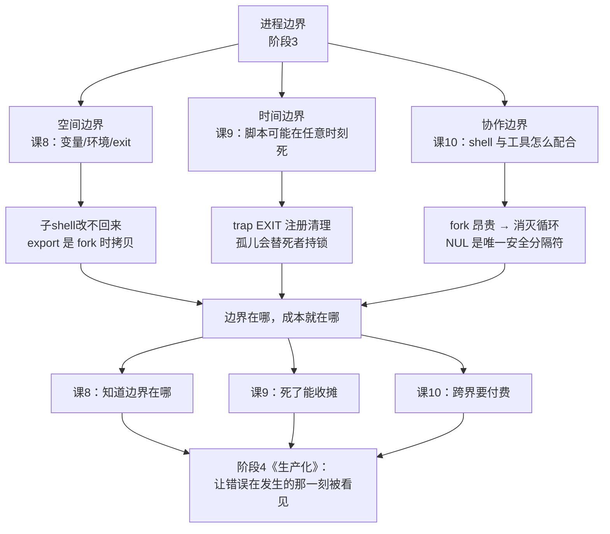

# 第 10 课：与文本工具的协作

> 所属阶段：阶段 3《进程边界》｜ 水平：进阶 ｜ 本课知识点：三剑客分工与边界、find/xargs 与 NUL 分隔、何时不该用 shell 处理文本
> 故事情节：一个 `while read` 循环跑了 20 分钟——不是逻辑慢，是它 fork 了一万次

## 🎯 本课目标

- 在 grep / sed / awk 之间正确选择，且不越界使用
- 正确处理含空格、含换行的文件名（NUL 分隔是唯一正解）
- 给出换 Python 的具体判据（行数 / 逻辑复杂度 / 性能）

---

## 第一幕：起源与场景引入

> 🎬 **场景**：`deploy.sh` 要扫描一万个日志文件，从每个里提取错误行数并汇总：

```bash
total=0
while read -r f; do
    n=$(grep -c ERROR "$f")      # 一次 fork
    total=$((total + n))
done < <(find /var/log -name '*.log')
echo "共 $total 条错误"
```text

它跑了 20 分钟。逻辑上"就一万次 grep"，但每次 grep 都是一次 fork + exec。

**这段代码错在哪里？** 它看起来无可挑剔：用了 `while read -r`（不是 `for`）、用了 `< <(...)` 而不是管道（避开了子 shell）、变量加了引号。课 8 教的每一条它都做到了。

但它慢得离谱。而慢的原因，不在 shell 语法层面——在**进程边界**上。

这就是阶段 3 收官要回答的问题：当 shell 需要和外部工具协作时，这条边界该怎么管。

---

## 第二幕：认知冲突

> ❓ **问题**：shell 明明只是"调用工具"，为什么会这么慢？

因为**shell 本身不做文本处理**——它每处理一行就要把活外包给一个外部程序，而外包一次的成本（fork + exec + 进程调度）远大于处理本身。当你把"循环"和"外部命令"叠在一起，成本是**乘法**关系。

先看一个量化实验。下面这段代码什么正事都不干，只是反复启动一个最小外部命令：

```bash
ms(){ python3 -c 'import time;print(int(time.time()*1000))'; }

echo "=== 基线：bash 自身算术循环 10000 次 ==="
t0=$(ms)
i=0
while [ $i -lt 10000 ]; do i=$((i+1)); done
t1=$(ms)
echo "  纯算术耗时=$((t1-t0))ms"

echo "=== 对比：10000 次外部命令 /bin/true ==="
t0=$(ms)
i=0
while [ $i -lt 10000 ]; do /bin/true; i=$((i+1)); done
t1=$(ms)
echo "  fork+exec 耗时=$((t1-t0))ms"

echo "=== 对照：同样 10000 条数据，交给一个 awk 进程 ==="
t0=$(ms)
seq 1 10000 | awk '{s+=$1} END{print "  awk 汇总=" s}'
t1=$(ms)
echo "  awk 单进程耗时=$((t1-t0))ms"
```

本机实测（WSL Ubuntu 24.04，20 核）：

```text
=== 基线：bash 自身算术循环 10000 次 ===
  纯算术耗时=35ms
=== 对比：10000 次外部命令 /bin/true ===
  fork+exec 耗时=5491ms
=== 对照：同样 10000 条数据，交给一个 awk 进程 ===
  awk 汇总=50005000
  awk 单进程耗时=16ms
```text

**三个数字，一条结论**：

| 操作 | 10000 次耗时 | 单次成本 |
|------|-------------|---------|
| bash 纯算术（不 fork） | 35ms | 0.0035ms |
| fork + exec 外部命令 | **5491ms** | **0.549ms** |
| 交给一个 awk 进程 | 16ms | —（一次性） |

**一次 fork 约 0.55 毫秒，是纯算术的 157 倍。** 而同样的数据量交给单个 awk 进程，只要 16ms。

换算成年终总结里的那句话：**1 万次 fork ≈ 5.5 秒，10 万次 ≈ 55 秒**。这还只是启动进程、什么都没干的开销。

所以第一幕那个循环的真实账本是：

```text
10000 次 grep 启动  ≈ 5.5 秒（纯开销）
+ 10000 次实际读取    ≈ 若干秒
+ 10000 次命令替换    ≈ 额外一层 fork
────────────────────────────────
= 20 分钟（真实环境磁盘更慢）
```

**结论很反直觉**：在 shell 里，让循环变快的办法是**消灭循环**——把工作整个交给一个 awk 进程，而不是让它跑一万次 grep。

> 💡 **这里有个认知转折点**：很多人以为"shell 慢"是因为它是解释型语言。实测证明不是——bash 自己的算术循环 10000 次只要 35ms，快得很。**慢的是跨越进程边界**，不是 shell 本身。

---

## 第三幕：层层揭示

### 知识点 1：三剑客分工与边界

> 本知识点关键点：grep = 筛选（不该用它做提取）、sed = 单行/流编辑（不该用它做跨行逻辑）、awk = 字段处理与聚合（它是一门完整语言）、三者都能做的事该如何选、`awk` 一次遍历完成"筛选+提取+汇总"、在 awk 里避免重复读文件

#### 一句话定义

`grep` 是**筛子**（回答"哪些行"），`sed` 是**流水线上的改写工位**（逐行改写文本），`awk` 是**带计数器和小本子的工位**（按字段处理并聚合）——它是一门完整的编程语言。

#### 直觉建立（类比）

想象一条工厂流水线，传送带上是一行行文本：

- **`grep` 是质检卡尺**：它只做一件事——量一下这行合不合格，合格的放行。**它不改造产品**。
- **`sed` 是贴标机**：对每个经过的产品做同一个动作（贴新标签、换包装）。**它不计数、不做判断分支**。
- **`awk` 是一个工位上的工人**：他手边有小本子（关联数组），能看产品的每个组成部分（`$1`、`$2`…），能边看边记数，最后在下班时（END）报出汇总。**他能完成"筛选 + 提取 + 汇总"整条链路**。

所以：想挑出某些行 → grep；想批量改写 → sed；想提取字段并算点什么 → awk。

**最容易犯的错**，是让三个工具在管道里接力，各自干一点——那等于把产品送上三次传送带。

#### 核心原理

下面所有示例都基于同一个样例文件。先生成它（复制这一段即可，后面的例子都依赖它）：

```bash
mkdir -p /tmp/lab10/sample
python3 - <<'PY'
import random
random.seed(7)
with open("/tmp/lab10/sample/app.log", "w") as f:
    for j in range(40):
        lvl = random.choice(["INFO","INFO","INFO","WARN","ERROR"])
        f.write(f"2026-09-04 10:{j:02d}:00 [{lvl}] svc-0 msg={j} code={random.randint(100,599)}\n")
PY
wc -l /tmp/lab10/sample/app.log
head -3 /tmp/lab10/sample/app.log
```

```text
40 /tmp/lab10/sample/app.log
2026-09-04 10:00:00 [INFO] svc-0 msg=0 code=112
2026-09-04 10:01:00 [INFO] svc-0 msg=1 code=225
2026-09-04 10:02:00 [INFO] svc-0 msg=2 code=171
```

**一、awk 的三段模型**

这是理解 awk 的钥匙，它把"处理一批文本"分成三个时刻：

```bash
awk 'BEGIN{print ">> 开始（读文件前，执行一次）"}
     NR<=3 {printf "  main 段: NR=%d 等级=%s\n", NR, $3}
     END{print ">> 结束，共处理 " NR " 行"}' /tmp/lab10/sample/app.log
```text

```text
>> 开始（读文件前，执行一次）
  main 段: NR=1 等级=[INFO]
  main 段: NR=2 等级=[INFO]
  main 段: NR=3 等级=[INFO]
>> 结束，共处理 40 行
```

- **`BEGIN{...}`**：读任何输入**之前**执行一次。用于初始化、打印表头。
- **`模式{动作}`**：**每读入一行**执行一次。`NR` 是全局行号，`$3` 是第 3 个字段。
- **`END{...}`**：所有输入读完之后执行一次。用于输出汇总。

记住这个模型，"为什么 awk 能做聚合"就明白了——因为 `END` 段天然就是"全部处理完之后"的时刻。

**二、一次遍历 vs 三次读文件**

反模式长这样——为了统计三种等级，把同一个文件读了三遍：

```bash
f=/tmp/lab10/sample/app.log
echo "--- 反模式：同一文件读三次 ---"
awk '/ERROR/{c++} END{print "ERROR=" c+0}' "$f"
awk '/WARN/{c++}  END{print "WARN="  c+0}' "$f"
awk '/INFO/{c++}  END{print "INFO="  c+0}' "$f"
echo "--- 正解：一次遍历 ---"
awk '/ERROR/{e++} /WARN/{w++} /INFO/{i++} END{print "ERROR=" e+0 " WARN=" w+0 " INFO=" i+0}' "$f"
```text

```text
--- 反模式：同一文件读三次 ---
ERROR=8
WARN=3
INFO=29
--- 正解：一次遍历 ---
ERROR=8 WARN=3 INFO=29
```

结果一样，但**后者只读了一次磁盘、只启动了一个进程**。文件越大，差距越明显。

**三、用字段还是用正则**

上面的例子用正则 `/ERROR/` 匹配，但它有个隐患：如果正文里恰好出现 "ERROR" 这个词，会误判。更稳的做法是**按字段取值**。

日志格式是 `2026-09-04 10:04:00 [ERROR] svc-0 msg=4 code=144`，第 3 个字段是 `[ERROR]`。去掉方括号即可：

```bash
f=/tmp/lab10/sample/app.log
echo "正则法:"
awk '/\[ERROR\]/{e++} /\[WARN\]/{w++} /\[INFO\]/{i++} END{printf "ERROR=%d WARN=%d INFO=%d\n", e+0,w+0,i+0}' "$f"
echo "字段法（gsub 去掉方括号后取 \$3）:"
awk '{gsub(/[][]/,"",$3); c[$3]++} END{printf "ERROR=%d WARN=%d INFO=%d\n", c["ERROR"]+0,c["WARN"]+0,c["INFO"]+0}' "$f"
```text

```text
正则法:
ERROR=8 WARN=3 INFO=29
字段法（gsub 去掉方括号后取 $3）:
ERROR=8 WARN=3 INFO=29
```

两者结果一致。**日志格式规整时用字段法更稳**（不受正文内容干扰）；格式不规整时才退回正则。

**四、三者都能做的事，如何选**

目标：从 ERROR 行里取出 `code` 的数值。

```bash
f=/tmp/lab10/sample/app.log
echo "--- 输入行样例 ---"
grep ERROR "$f" | head -1
echo
echo "--- 反模式：grep | cut | sed（3 个进程）---"
grep ERROR "$f" | cut -d= -f3 | sed 's/^/code:/' | head -3
echo
echo "--- 正解 awk（1 个进程，split 取等号后段）---"
awk '/ERROR/ {split($NF, a, "="); print "code:" a[2]}' "$f" | head -3
echo
echo "--- 正解 awk（-F 指定多分隔符，直接取末字段）---"
awk -F'[= ]' '/ERROR/ {print "code:" $NF}' "$f" | head -3
```text

```text
--- 输入行样例 ---
2026-09-04 10:04:00 [ERROR] svc-0 msg=4 code=144

--- 反模式：grep | cut | sed（3 个进程）---
code:144
code:316
code:113

--- 正解 awk（1 个进程，split 取等号后段）---
code:144
code:316
code:113

--- 正解 awk（-F 指定多分隔符，直接取末字段）---
code:144
code:316
code:113
```

结果相同，但**管道版本启动了 4 个进程**（grep、cut、sed、head），awk 版本只要 1 个。

> ⚠️ **注意 `cut -d= -f3` 的脆弱性**：它依赖"第 3 个等号分隔的字段恰好是 code"。如果日志前面多了一个 `key=value`，字段序号就全错了。而 awk 的 `$NF`（最后一个字段）或 `split($NF,...)` 对格式变化更健壮。

**五、sed 的本职与越界**

sed 的本职是**逐行流式改写**：

```bash
f=/tmp/lab10/sample/app.log
echo "--- sed 本职：把 ERROR 改成 FATAL ---"
sed 's/ERROR/FATAL/' "$f" | grep 'FATAL' | head -3
```text

```text
--- sed 本职：把 ERROR 改成 FATAL ---
2026-09-04 10:04:00 [FATAL] svc-0 msg=4 code=144
2026-09-04 10:05:00 [FATAL] svc-0 msg=5 code=316
2026-09-04 10:09:00 [FATAL] svc-0 msg=9 code=113
```

sed 也能勉强做跨行逻辑（`N` 把下一行读入模式空间），但那是越界：

```bash
printf 'a1\na2\nb1\nb2\n' | sed 'N;s/\n/+/'
```text

```text
a1+a2
b1+b2
```

**能跑，但别这么写**——可读性差、边界情况多（奇数行怎么办？空行怎么办？）。跨行逻辑是 awk 的活。

#### 示例演示

##### 演示一：聚合真实场景——按服务统计 ERROR 数

这是 awk 最典型的应用：一次遍历完成"筛选 + 提取 + 汇总"。

```bash
awk '/ERROR/ {match($0, /svc-[0-9]+/); s=substr($0, RSTART, RLENGTH); cnt[s]++}
     END {for (k in cnt) printf "  %s: %d\n", k, cnt[k]}' \
     /tmp/lab10/sample/app.log | sort
```text

```text
  svc-0: 8
```

`match()` 把匹配位置存进 `RSTART`（起始）和 `RLENGTH`（长度），`substr` 取出匹配串，然后 `cnt[s]++` 记数。这就是那个"带小本子的工人"。

##### 演示二：跨文件聚合——awk 天然支持多文件

把多个文件交给一个 awk，用 `FILENAME` 区分来源（多文件时会分成多批，见知识点 2 的陷阱）。先造第二个文件：

```bash
cp /tmp/lab10/sample/app.log /tmp/lab10/sample/app2.log
awk '/ERROR/ {f=FILENAME; sub(/.*\//,"",f); cnt[f]++}
     END {n=0; for(k in cnt) n++; print "  含 ERROR 的文件数=" n}' \
     /tmp/lab10/sample/app.log /tmp/lab10/sample/app2.log
```text

```text
  含 ERROR 的文件数=2
```

注意 `FNR` 与 `NR` 的区别：`NR` 是全局累计行号，`FNR` 是**当前文件内**的行号。处理多文件时判断"是不是新文件的第一行"要用 `FNR==1`。

#### 常见误区

| 误区 | 真相 | 后果 |
|------|------|------|
| 用 `grep` 提取字段再 `cut` 再 `sed` | 三道管道 = 三个进程，awk 一行搞定 | 进程开销 ×3，且 `cut -f` 依赖字段序号、易碎 |
| `grep` 能干所有文本活 | grep 是**筛选**工具，`-o` 提取是副业 | 复杂提取写不出、写不出还要拼管道 |
| `sed` 适合做跨行逻辑 | 能用 `N` 凑，但可读性差、边界多 | 跨行逻辑应交给 awk |
| 为了三个统计把文件读三遍 | awk 一次遍历即可（多个计数器） | 磁盘 IO ×3、进程数 ×3 |
| awk 只能处理单个文件 | awk 天然支持多文件，用 `FNR`/`FILENAME` 区分 | 误以为必须外层套循环 |
| 正则匹配就够了 | 格式规整时用**字段**更稳（不受正文干扰） | 正文里出现关键词时误判 |

#### 一句话记住

**grep 管筛选、sed 管改写、awk 管字段与聚合；能用一条 awk 完成的，别拆成三道管道——每多一道管道，就多一个进程、多一次拷贝。**

---

### 知识点 2：find / xargs 与 NUL 分隔

> 本知识点关键点：为什么空格会炸、文件名**可以含换行**所以换行分隔也不安全、`find -print0` + `xargs -0` 是唯一正解、`read -r -d ''` 配合 `-print0`、`xargs` 的批处理与 `-n` `-L` `-P` 并行、`xargs` 的空输入问题（`-r`/`--no-run-if-empty`）、`find -exec ... +` 与 `\;` 的区别（批量 vs 逐个）

#### 一句话定义

文件名可以包含**除 `/` 和 NUL 之外的任何字符**（包括空格、换行、引号、tab），所以唯一安全的分隔符是 **NUL（`\0`）**——它是唯一不可能出现在文件名里的字符。

#### 直觉建立（类比）

用"换行"分隔文件名，就像用"逗号"分隔人名——而世界上确实有人名字里带逗号。

你以为 `张三,李四` 是两个人，实际可能是一个叫"张三,李四"的人。**只要分隔符可能出现在数据本身里，这个分隔协议就是破的。**

文件名里能出现空格、tab、引号、甚至换行——所以换行分隔是破的。而 NUL 是操作系统**明令禁止**出现在文件名里的字符，用它做分隔符，协议才是完备的。

这就是为什么 `find -print0` 和 `xargs -0` 必须成对出现。

#### 核心原理

**一、先看灾难现场**

构造 9 个文件名，故意包含空格、双空格、tab、换行、引号、前导空格：

```bash
LAB=/tmp/lab10/tricky
rm -rf "$LAB"; mkdir -p "$LAB"
python3 - <<'PY'
import os
base = "/tmp/lab10/tricky"
names = [
    "normal.log", "with space.log", "with  two  spaces.log",
    "with\nnewline.log", " leading-space.log", "trailing-space .log",
    "quote'and\"dquote.log", "dash-starting.log", "tab\there.log",
]
for n in names:
    open(os.path.join(base, n), "w").write("ERROR one\nINFO two\nERROR three\n")
print("created", len(names), "files")
PY
find "$LAB" -type f -printf '  [%f]\n' | cat -A
```text

```text
created 9 files
  [tab^Ihere.log]$
  [with  two  spaces.log]$
  [normal.log]$
  [with space.log]$
  [quote'and"dquote.log]$
  [trailing-space .log]$
  [ leading-space.log]$
  [dash-starting.log]$
  [with$
newline.log]$
```

（`cat -A` 把 tab 显示为 `^I`、行尾显示为 `$`，这样能看清真实字符。）

**9 个文件。现在用最常见的写法数一遍：**

```bash
LAB=/tmp/lab10/tricky
echo "--- 反模式：for f in \$(find ...) ---"
count=0
for f in $(find "$LAB" -type f); do count=$((count+1)); done
echo "  for 循环计数 = $count  ← 应该是 9"

echo "--- 换行分隔：while read ---"
nl=0
while IFS= read -r f; do nl=$((nl+1)); done < <(find "$LAB" -type f)
echo "  换行分隔计数 = $nl  ← 应该是 9"

echo "--- 正解：NUL 分隔 ---"
nul=0
while IFS= read -r -d '' f; do nul=$((nul+1)); done < <(find "$LAB" -type f -print0)
echo "  NUL 分隔计数 = $nul  ← 正确"
```text

```text
--- 反模式：for f in $(find ...) ---
  for 循环计数 = 16  ← 应该是 9
--- 换行分隔：while read ---
  换行分隔计数 = 10  ← 应该是 9
--- 正解：NUL 分隔 ---
  NUL 分隔计数 = 9  ← 正确
```

**三个数字，三种正确性**：

| 写法 | 计数 | 错在哪 |
|------|------|--------|
| `for f in $(find ...)` | **16** | 三重错误：单词分割 + 路径名展开 + 缓冲 |
| `while read`（换行分隔） | **10** | 文件名含换行 → 被当成两个文件 |
| `while read -r -d ''` + `-print0` | **9** ✅ | NUL 不可出现在文件名中 |

**二、`for f in $(...)` 的三重错误**

把拆出来的片段打印出来，看它到底干了什么：

```bash
LAB=/tmp/lab10/tricky
for f in $(find "$LAB" -type f); do
    echo "  片段: [$f]"
done | head -8
```text

```text
  片段: [/tmp/lab10/tricky/tab]
  片段: [here.log]
  片段: [/tmp/lab10/tricky/with]
  片段: [two]
  片段: [spaces.log]
  片段: [/tmp/lab10/tricky/normal.log]
  片段: [/tmp/lab10/tricky/with]
  片段: [space.log]
```

`tab\there.log` 被拆成两半，`with  two  spaces.log` 被拆成三段。三重错误分别是：

1. **单词分割**：命令替换的结果按 `IFS`（默认空格/tab/换行）切成多个词
2. **路径名展开**：切出来的词如果含 `*`、`?`、`[`，会被当成 glob 再展开一次
3. **缓冲与参数上限**：文件极多时可能超出命令行长度上限

> ⚠️ **`for f in $(...)` 没有任何补救办法**。加引号 `for f in "$(...)"` 会让所有文件名变成**一整个字符串**，更错。正确做法是彻底不用 `$(...)` 承载文件名列表。

**三、换行分隔为什么也不安全**

你可能会想：那我用 `while read` 不就行了？**不行**——因为文件名可以含换行。

上面的实验里 `with\nnewline.log` 就被算成了 2 个文件（9 变 10）。而 POSIX 文件名只禁止两个字符：`/`（路径分隔符）和 NUL。换行是完全合法的。

**四、NUL 是唯一解——操作系统层面的保证**

```bash
python3 -c "
try:
    open('/tmp/lab10/tricky/has\x00nul.log','w')
except ValueError as e:
    print('  Python 报错:', e)
"
```text

```text
  Python 报错: embedded null byte
```

操作系统**拒绝**创建含 NUL 的文件名。所以 NUL 可以安全地充当分隔符——这是内核级保证，不是约定。

**五、正确的两种写法**

**写法 A：需要逐个处理 → `while read -r -d ''`**

```bash
LAB=/tmp/lab10/tricky
while IFS= read -r -d '' f; do
    printf '  [%s] ERROR数=%s\n' "$(basename "$f")" "$(grep -c ERROR "$f")"
done < <(find "$LAB" -type f -print0)
```text

```text
  [tab	here.log] ERROR数=2
  [with  two  spaces.log] ERROR数=2
  [normal.log] ERROR数=2
  [with space.log] ERROR数=2
  [quote'and"dquote.log] ERROR数=2
  [trailing-space .log] ERROR数=2
  [ leading-space.log] ERROR数=2
  [dash-starting.log] ERROR数=2
  [with
newline.log] ERROR数=2
```

**9 个文件全部正确处理，包括含换行的那个。** 注意 `IFS=`（防止行首尾空格被吃掉）和 `-r`（防止反斜杠被解释）——这两个都不能少。

**写法 B：批量交给命令 → `xargs -0`**

```bash
LAB=/tmp/lab10/tricky
find "$LAB" -type f -print0 | xargs -0 grep -c ERROR
```text

```text
/tmp/lab10/tricky/tab	here.log:2
/tmp/lab10/tricky/with  two  spaces.log:2
/tmp/lab10/tricky/normal.log:2
/tmp/lab10/tricky/with space.log:2
/tmp/lab10/tricky/quote'and"dquote.log:2
/tmp/lab10/tricky/trailing-space .log:2
/tmp/lab10/tricky/ leading-space.log:2
/tmp/lab10/tricky/dash-starting.log:2
/tmp/lab10/tricky/with
newline.log:2
```

`xargs -0` 按 NUL 切分参数，然后**作为参数**传给 `grep`。因为走的是参数传递（不是字符串拼接），引号、空格、换行全部安全。

**六、`xargs -I{}` 的隐藏陷阱**

需要复杂处理时，很多人会写 `xargs -I{} sh -c '...{}...'`。**这是错的**，因为 `-I{}` 做的是**文本替换**——它把文件名直接替换进命令字符串里，于是文件名里的引号就变成了代码：

```bash
LAB=/tmp/lab10/tricky
Q="$LAB/quote'and\"dquote.log"
echo "目标文件: [$Q]"
echo
echo "--- 写法A（错）：xargs -I{} sh -c '...\"{}\"...' ---"
printf '%s\0' "$Q" | xargs -0 -I{} sh -c 'printf "  得到: [%s]\n" "{}"' 2>&1 | head -3
echo
echo "--- 写法B（对）：参数传递 ---"
printf '%s\0' "$Q" | xargs -0 bash -c 'for f in "$@"; do printf "  得到: [%s]\n" "$f"; done' _ 2>&1 | head -3
```text

```text
目标文件: [/tmp/lab10/tricky/quote'and"dquote.log]

--- 写法A（错）：xargs -I{} sh -c '..."{}"...' ---
sh: 1: Syntax error: Unterminated quoted string

--- 写法B（对）：参数传递 ---
  得到: [/tmp/lab10/tricky/quote'and"dquote.log]
```

**写法 A 直接语法错误**——文件名里的单引号提前闭合了 `sh -c` 的引号。

> 🔑 **正确模板**：`xargs -0 bash -c '脚本内容' _`
>
> 末尾的下划线 `_` 是 `$0` 的占位符（惯例用 `_` 或 `bash`），**不能省略**——否则第一个文件名会被当成 `$0`，你的循环会少处理一个文件。文件名通过 `$@` 拿到，全程是参数传递，不会被引号问题影响。

`-I{}` 还有两个副作用：隐含 `-L1`（一次只处理一个）且**无法与 `-P` 并行共存**。

**七、`find -exec ... \;` 与 `... +` 的区别**

这是本课最容易记混的一对符号：

```bash
LAB=/tmp/lab10/tricky
echo "  \\; 形式（逐个）："
find "$LAB" -type f -exec sh -c 'echo "    pid=$$ file=$(basename "$1")"' _ {} \; | awk '{print $1}' | sort -u | wc -l
echo "    ↑ 不同 pid 数 = 启动的 shell 进程数"
echo "  + 形式（批量）："
find "$LAB" -type f -exec sh -c 'echo "    pid=$$ count=$#"' _ {} + | wc -l
echo "    ↑ 启动的 shell 进程数"
```text

```text
  \; 形式（逐个）：
10
    ↑ 不同 pid 数 = 启动的 shell 进程数
  + 形式（批量）：
1
    ↑ 启动的 shell 进程数
```

**`\;` 启动 10 个进程，`+` 只启动 1 个。**

| 写法 | 行为 | 进程数 | 适用 |
|------|------|--------|------|
| `-exec cmd \;` | 每个文件执行一次 | N 个 | 命令只接受单个文件参数 |
| `-exec cmd +` | 尽量合并成一批 | 尽量少（受 ARG_MAX 限制） | 命令可接受多文件参数 |

**优先用 `+`**，它是 `xargs` 的等价物且不需要管道。

**八、xargs 的空输入问题**

```bash
mkdir -p /tmp/lab10/emptydir
echo "--- 不带 -r：空输入时命令仍会被执行一次 ---"
find /tmp/lab10/emptydir -type f -print0 | xargs -0 echo "  命令被执行了，收到参数:"
echo "--- 带 -r：空输入时不执行 ---"
find /tmp/lab10/emptydir -type f -print0 | xargs -0 -r echo "  这行不该出现"
echo "  退出码=$?"
```text

```text
--- 不带 -r：空输入时命令仍会被执行一次 ---
  命令被执行了，收到参数:
--- 带 -r：空输入时不执行 ---
  退出码=0
```

第一条**没有文件也执行了命令**（输出里能看到 echo 跑了一次，只是没有参数）。如果这个命令是 `rm` 或 `chmod`，后果可能很糟。

> 💡 **GNU xargs 默认会执行一次，BSD/macOS 的 xargs 默认不执行。** 为了可移植性，显式写 `-r`（或 `--no-run-if-empty`）。

**九、`-n`、`-P`：批处理与并行**

```bash
LAB=/tmp/lab10/tricky
echo "--- -n 2：每批 2 个参数 ---"
find "$LAB" -type f -print0 | xargs -0 -n 2 sh -c 'echo "  批次参数数=$#" ' _ 2>/dev/null | head -3

echo "--- -P 4：4 路并行 ---"
ms(){ python3 -c 'import time;print(int(time.time()*1000))'; }
t0=$(ms)
find "$LAB" -type f -print0 | xargs -0 -n 1 -P 4 sh -c 'sleep 0.2' _ 2>/dev/null
t1=$(ms)
echo "  9 个文件 × 0.2s，并行耗时=$((t1-t0))ms（串行理论值约 1800ms）"
```text

```text
--- -n 2：每批 2 个参数 ---
  批次参数数=2
  批次参数数=2
  批次参数数=2
--- -P 4：4 路并行 ---
  9 个文件 × 0.2s，并行耗时=622ms（串行理论值约 1800ms）
```

`-P 4` 把 1800ms 压到 622ms，约 2.9 倍加速（9 个任务 / 4 路 ≈ 3 批 × 0.2s）。

> ⚠️ **`-P` 与课 8 学到的限流原则一致**：并行度不是越高越好，要按**下游承受能力**设。对本地 CPU 密集任务，`-P` 取 `nproc`；对远程 SSH/SCP，**要保守**（打爆跳板机会被投诉）。

#### 示例演示

##### 演示一：安全的批量重命名

```bash
LAB=/tmp/lab10/tricky
find "$LAB" -type f -print0 | xargs -0 bash -c '
  for f in "$@"; do
      d=$(dirname "$f"); b=$(basename "$f")
      printf "  将重命名: [%s] -> [%s]\n" "$b" "renamed_${b// /_}"
  done
' _
```text

```text
  将重命名: [tab	here.log] -> [renamed_tab	here.log]
  将重命名: [with  two  spaces.log] -> [renamed_with__two__spaces.log]
  ...
```

注意这里**只打印不执行**（演示安全）。真实重命名把 `printf` 换成 `mv -- "$f" "$d/renamed_${b// /_}"` 即可。`--` 防止文件名以 `-` 开头时被当成选项。

##### 演示二：`-exec +` 的等价改写

```bash
LAB=/tmp/lab10/tricky
echo "--- xargs 版 ---"
find "$LAB" -type f -print0 | xargs -0 grep -c ERROR
echo "--- find -exec + 版（无需管道）---"
find "$LAB" -type f -exec grep -c ERROR {} +
```text

两者输出相同。后者更简洁（少一个进程），但**不能用 `-P` 并行**。

#### 常见误区

| 误区 | 真相 | 后果 |
|------|------|------|
| `for f in $(find ...)` 能用 | 三重错误：单词分割 + glob 展开 + 缓冲 | 9 个文件数出 16 个；文件名被拆碎 |
| 加引号 `for f in "$(find ...)"` 就好了 | 所有文件名变成**一个字符串** | 更错，循环只执行一次 |
| 文件名不会含换行 | POSIX 只禁止 `/` 和 NUL，**换行合法** | `while read` 也会数错（9→10） |
| `-print0` 配 `xargs` 不加 `-0` | 分隔符不匹配，仍按空格/换行切 | 白用了 `-print0` |
| `xargs -I{} sh -c '...{}...'` 没问题 | `-I` 是**文本替换**，文件名引号会破坏语法 | `Unterminated quoted string` 语法错误 |
| `xargs -0 bash -c '...' _` 末尾 `_` 可省 | `$0` 占位符，省了会吞掉第一个文件 | 少处理一个文件 |
| `-exec \;` 和 `-exec +` 随便选 | `\;` 每文件一进程，`+` 批量 | 10000 文件时进程数差 1 万倍 |
| 空输入时 xargs 不会执行命令 | GNU 默认**会执行一次**，需 `-r` | 空列表时误执行 `rm` 等危险命令 |

#### 一句话记住

**文件名里除了 `/` 和 NUL 什么都能有，所以只有 NUL 能当分隔符：`find -print0` 必须配 `xargs -0` 或 `read -r -d ''`；需要脚本处理时用 `xargs -0 bash -c '...' _` 走参数传递，千万别用 `-I{}` 做文本替换。**

---

### 知识点 3：何时不该用 shell 处理文本

> 本知识点关键点：fork 成本的量级（毫秒级 × N）、判据一：需要嵌套数据结构（数组的数组）时、判据二：需要真正的错误处理（异常、类型）时、判据三：脚本超过 ~200-300 行且有分支逻辑时、判据四：需要跨平台（Windows）时、判据五：需要单元测试与重构时、混合方案：shell 做编排、Python 做计算

#### 一句话定义

shell 是**调度员**，不是**计算器**——它的专长是"把程序串起来"，而不是"自己算东西"。当任务的重心从"编排"滑向"计算"时，就该换语言了。

#### 直觉建立（类比）

让调度员去做算术，他就得每算一道题跑一趟会计部。

调度员（shell）的价值在于知道"谁负责什么、按什么顺序叫谁"。但如果你让他算 1 万笔账，他就得来回跑 1 万趟——不是他算得慢，是**路上的时间**占了 99%。

Python 则是一个自己就会算账的人：账本在他手上，算完直接报数。

所以判据不是"哪个语言快"，而是**这件活的重心在"跑腿"还是在"算账"**。

#### 核心原理

**一、先看一个反直觉的实测**

同样是"统计 2000 个日志文件中三种等级的数量"，三种写法：

```bash
LAB=/tmp/lab10
ms(){ python3 -c 'import time;print(int(time.time()*1000))'; }

echo "【shell 循环版】while read + grep（逐文件 fork）"
t0=$(ms)
e=0; w=0; i=0
while read -r f; do
    e=$(( e + $(grep -c '\[ERROR\]' "$f") ))
    w=$(( w + $(grep -c '\[WARN\]'  "$f") ))
    i=$(( i + $(grep -c '\[INFO\]'  "$f") ))
done < <(find "$LAB/logs" -name '*.log')
t1=$(ms)
echo "  结果 ERROR=$e WARN=$w INFO=$i  耗时=$((t1-t0))ms"

echo "【shell 优化版】一条 awk"
t0=$(ms)
r=$(find "$LAB/logs" -name '*.log' -print0 | xargs -0 awk '
  /\[ERROR\]/{e++} /\[WARN\]/{w++} /\[INFO\]/{i++}
  END{printf "ERROR=%d WARN=%d INFO=%d", e+0, w+0, i+0}')
t1=$(ms)
echo "  结果 $r  耗时=$((t1-t0))ms"

echo "【python 版】"
t0=$(ms)
python3 - "$LAB/logs" <<'PY'
import sys, os, glob
d = {"ERROR":0, "WARN":0, "INFO":0}
for p in glob.glob(os.path.join(sys.argv[1], "*.log")):
    with open(p, encoding="utf-8", errors="replace") as f:
        for line in f:
            if "[ERROR]" in line: d["ERROR"] += 1
            elif "[WARN]" in line: d["WARN"] += 1
            elif "[INFO]" in line: d["INFO"] += 1
print(f"  ERROR={d['ERROR']} WARN={d['WARN']} INFO={d['INFO']}", end=" ")
PY
t1=$(ms)
echo " 耗时=$((t1-t0))ms"
```

本机实测（2000 文件 / 80000 行）：

```text
【shell 循环版】while read + grep（逐文件 fork）
  结果 ERROR=16004 WARN=16189 INFO=47807  耗时=8379ms
【shell 优化版】一条 awk
  结果 ERROR=16004 WARN=16189 INFO=47807  耗时=45ms
【python 版】
  ERROR=16004 WARN=16189 INFO=47807 耗时=63ms
```text

**这个结果值得停下来看三秒**：

| 写法 | 耗时 | 相对 |
|------|------|------|
| shell 循环 + grep | 8379ms | 186× |
| **一条 awk** | **45ms** | **1×（最快）** |
| Python | 63ms | 1.4× |

**优化后的 shell 比 Python 还快**（45ms vs 63ms）。

> 🔑 **这是本课最重要的一句话**：**"换 Python 因为 shell 慢"是个伪命题。** 优化过的 shell（awk 单进程）在纯文本扫描任务上甚至略快于 Python。真正的换语言理由是**复杂度与健壮性**，不是性能。

那 8379ms 是怎么回事？它慢不是因为"shell 慢"，而是因为**写了一个每轮 fork 三次的循环**。这是**写法问题**，不是**语言问题**。

**二、判据一：需要嵌套数据结构**

Bash 的关联数组只能存"字符串→字符串"。要模拟二维，只能把 key 拼成字符串：

```bash
declare -A cnt
svc="svc-0"; lvl="ERROR"
cnt["$svc,$lvl"]=$(( ${cnt["$svc,$lvl"]:-0} + 1 ))
echo "  bash 伪二维：key=[svc-0,ERROR] 值=${cnt["svc-0,ERROR"]}"
```

```text
  bash 伪二维：key=[svc-0,ERROR] 值=1
```text

而 Python 能直接嵌套：

```bash
python3 -c "
d = {}
for i in range(50):
    d.setdefault(f'svc-{i%5}', {}).setdefault('ERROR', 0)
    d[f'svc-{i%5}']['ERROR'] += 1
print('  python 真嵌套:', {k: list(v.keys()) for k,v in list(d.items())[:2]})
"
```

```text
  python 真嵌套: {'svc-0': ['ERROR'], 'svc-1': ['ERROR']}
```text

**判据**：当你开始用逗号拼 key、或者需要"数组里套数组"时——换 Python。

Bash 的伪二维还有个隐患：**key 里含逗号会冲突**（`svc-0,ERROR` 与 `svc-0,ERROR,X` 编码歧义）。

**三、判据二：需要真正的错误处理**

shell 里的错误是**静默**的。实测：

```bash
set +u
arr=(a b c)
echo "  arr[10]=[${arr[10]}]  ← 越界返回空，不报错"
v="abc"
echo "  \$((v+1)) = $(( v + 1 ))  ← 非数字被当 0"
set -u
```

```text
  arr[10]=[]  ← 越界返回空，不报错
  $((v+1)) = 1  ← 非数字被当 0
```text

数组越界返回空字符串，非数字参与算术被当 0——**都不报错**。程序带着错误的值继续跑，直到某个下游环节炸掉，而那时现场早没了。

Python 会当场抛异常：

```bash
python3 -c "
try:
    arr=['a','b','c']; print(arr[10])
except IndexError as e: print(f'  IndexError: {e}')
try:
    print('abc' + 1)
except TypeError as e: print(f'  TypeError: {e}')
"
```

```text
  IndexError: list index out of range
  TypeError: can only concatenate str (not "int") to str
```text

**判据**：任务需要区分"预期内的异常"与"编程错误"时——换 Python。

（这是课 9 讲过的同一条原则在另一个层面的体现：shell 的 `trap ERR` 只报告不拦截，而 Python 的异常机制能精确定位并恢复。）

**四、判据三：代码规模与可维护性**

同一任务（按服务聚合 ERROR，输出 top5）的两种写法：

```bash
echo "  shell+awk 版本:"
cat <<'SH'
  find logs -name '*.log' -print0 | xargs -0 awk '
    /\[ERROR\]/ { match($0,/svc-[0-9]+/); c[substr($0,RSTART,RLENGTH)]++ }
    END { for (k in c) printf "%d %s\n", c[k], k }' | sort -rn | head -5
SH
echo "  python 版本:"
cat <<'PY'
  import glob, re, collections
  c = collections.Counter()
  for p in glob.glob("logs/*.log"):
      for line in open(p):
          if "[ERROR]" in line:
              if (m := re.search(r"svc-\d+", line)): c[m.group()] += 1
  for k, v in c.most_common(5): print(v, k)
PY
```

两者行数相近。但**需求一变，差距就出来了**：

- 要"按服务 × 等级"二维统计 → awk 要改用多维模拟（gawk 的 `ARRAY[SUBSEP]`），Python 加一层 `dict` 即可
- 要输出 JSON → awk 要手写转义，Python 一个 `json.dump()`
- 要单元测试 → awk 没有测试框架，Python 有 `pytest`

**判据（经验值）**：脚本超过 **200–300 行**且含多层分支 —— 换 Python。

这个数字不是硬规定，是个"闻到味道就该检查"的阈值。

**五、判据四与五：跨平台与可测试性**

```bash
echo "  shell: $(bash --version | head -1)"
echo "  python: $(python3 --version)"
```text

```text
  shell: GNU bash, version 5.2.21(1)-release (x86_64-pc-linux-gnu)
  python: Python 3.12.3
```

- **跨平台**：Windows 原生没有 bash（需 WSL / Git-Bash），且 `sed`/`awk`/`grep` 在 GNU 与 BSD（macOS）版本上**参数不兼容**（课 3 提过的 `-i` 与 `-i ''`）。Python 三个平台行为一致。
- **可测试性**：shell 没有标准测试框架（bats 是第三方，阶段 4 课 12 会讲），Python 有内置 `unittest` 与成熟的 `pytest`。

**六、混合方案：shell 做编排，Python 做计算**

最实用的架构不是二选一，而是**各干各的擅长**：

```bash
#!/usr/bin/env bash
set -euo pipefail
# ⚠️ 下面是架构示意（/opt/bin/*.py 是虚构路径，不可直接运行）
# 真实项目里把两个 .py 换成你自己的脚本即可
find /var/log -name '*.log' -print0 \
  | xargs -0 -n 500 -P 8 python3 /opt/bin/analyze.py \
  | python3 /opt/bin/aggregate.py > report.json
```text

- **shell**：`find -print0`（安全列文件）、`xargs -P`（并发）、管道编排
- **Python**：单批 500 个文件的解析与聚合、JSON 输出

这样既拿到了 awk 的吞吐，又拿到了 Python 的表达力，还避开了"循环里 fork 一万次"。

#### 示例演示

##### 演示一：决策清单

把上面的判据浓缩成一张可查的表：

| 信号 | 建议 |
|------|------|
| 循环里调外部命令，数据 > 1000 条 | **先优化 shell**（改 awk / xargs），不必换语言 |
| 需要用字符串拼 key 模拟二维 | 换 Python |
| 需要区分异常类型、要恢复现场 | 换 Python |
| 脚本 > 200–300 行且有分支 | 换 Python |
| 要输出 JSON / XML 等结构化格式 | 换 Python |
| 要单元测试 / 要重构 | 换 Python |
| 要跑在 Windows 原生环境 | 换 Python |
| 只是"找文件 + 传给工具 + 收结果" | **留在 shell** |

##### 演示二：混合方案实测

```bash
LAB=/tmp/lab10
ms(){ python3 -c 'import time;print(int(time.time()*1000))'; }
t0=$(ms)
find "$LAB/logs" -name '*.log' -print0 \
  | xargs -0 -n 500 -P 8 python3 -c '
import sys
c = 0
for p in sys.argv[1:]:
    with open(p, errors="replace") as f:
        c += sum(1 for line in f if "ERROR" in line)
print(c)'
t1=$(ms)
echo "  混合方案（shell 并发调度 + python 计算）：$((t1-t0))ms"
```

这个方案把"并发调度"留给 shell、"逐行解析"交给 Python，是本课推荐的工程实践。

#### 常见误区

| 误区 | 真相 | 后果 |
|------|------|------|
| shell 慢，所以该换 Python | **优化过的 shell（awk）比 Python 还快**（45ms vs 63ms） | 换了语言却没解决真问题（写法） |
| shell 更快因为不用启动解释器 | 只对"只调几个命令"成立；循环里 fork 就崩 | 1 万次 fork ≈ 5.5s 纯开销 |
| Python 启动慢所以不适合小任务 | 启动一次约 30ms，只在"循环内反复启动"时才是问题 | 误把一次性启动当瓶颈 |
| awk 能做任何文本处理 | 它是语言，但没有异常、没有嵌套结构、无测试框架 | 复杂逻辑写成天书 |
| 换语言是性能优化手段 | 换语言是**复杂度管理**手段 | 用错工具解决不存在的问题 |
| shell 脚本写不长就不用管结构 | 200 行后就难测、难重构 | 技术债累积 |

#### 一句话记住

**换 Python 的理由从来不是"shell 慢"——而是"需要嵌套结构、需要真正的异常、需要测试、需要跨平台"；在那之前，先把循环里的 fork 消灭掉，一条 awk 往往就够了。**

---

## 第四幕：实操验证

> 🎯 **任务**：把第一幕那个跑了 20 分钟的循环，改造成三条正确路线，并在 1 万个文件上实测选型。

### 第一步：准备 1 万文件的实验场

```bash
LAB=/tmp/lab10
rm -rf "$LAB"; mkdir -p "$LAB/logs"
python3 - <<'PY'
import random
random.seed(42)
for i in range(10000):
    with open(f"/tmp/lab10/logs/app-{i:05d}.log", "w") as f:
        for j in range(20):
            lvl = random.choice(["INFO","INFO","INFO","WARN","ERROR"])
            f.write(f"2026-09-04 10:{j:02d}:00 [{lvl}] svc-{i%20} msg={j} code={random.randint(100,599)}\n")
PY
echo "文件数=$(find "$LAB/logs" -name '*.log' | wc -l)"
```text

```text
文件数=10000
```

### 第二步：四条路线实测

```bash
LAB=/tmp/lab10
ms(){ python3 -c 'import time;print(int(time.time()*1000))'; }

echo "===== 路线 1：while read + 循环内 grep（第一幕原版）====="
t0=$(ms)
total=0
while read -r f; do
    n=$(grep -c 'ERROR' "$f"); total=$((total + n))
done < <(find "$LAB/logs" -name '*.log')
t1=$(ms)
echo "  结果=$total  耗时=$((t1-t0))ms"

echo "===== 路线 2：xargs 批量 + grep -c + awk 汇总 ====="
t0=$(ms)
r2=$(find "$LAB/logs" -name '*.log' -print0 | xargs -0 -n 500 grep -c 'ERROR' | awk -F: '{s+=$2} END{print s+0}')
t1=$(ms)
echo "  结果=$r2  耗时=$((t1-t0))ms"

echo "===== 路线 3：单条 awk（推荐）====="
t0=$(ms)
r3=$(find "$LAB/logs" -name '*.log' -print0 | xargs -0 awk '/ERROR/{c++} END{print c+0}' | awk '{s+=$1} END{print s+0}')
t1=$(ms)
echo "  结果=$r3  耗时=$((t1-t0))ms"

echo "===== 路线 4：awk 并行（-P 8）====="
t0=$(ms)
r4=$(find "$LAB/logs" -name '*.log' -print0 | xargs -0 -n 500 -P 8 awk '/ERROR/{c++} END{print c+0}' | awk '{s+=$1} END{print s+0}')
t1=$(ms)
echo "  结果=$r4  耗时=$((t1-t0))ms"
```text

本机实测（3 轮，10000 文件 / 200000 行）：

```text
路线 1：while read + 循环内 grep
  结果=40063  耗时=13731ms
路线 2：xargs 批量 + grep -c + awk 汇总
  结果=40063  耗时=80ms
路线 3：单条 awk（推荐）
  结果=40063  耗时=86ms
路线 4：awk 并行（-P 8）
  结果=40063  耗时=38ms
```

**四条路线结果完全一致（40063）**，耗时差距 **361 倍**。

### 第三步：一个必须知道的陷阱——xargs 分批会让 awk END 执行多次

如果你把路线 3 写成这样（**不加最后的汇总 awk**）：

```bash
find /tmp/lab10/logs -name '*.log' -print0 | xargs -0 awk '/ERROR/{c++} END{print c+0}'
```text

得到的不是 40063，而是**三行**：

```text
18082
18113
3868
```

**为什么？** 因为 `xargs` 会把参数**分批**——当 1 万个文件路径的总长度超过命令行上限时，它启动多个 awk 进程，每个处理一批，**每个 awk 都在自己那批结束时执行一次 `END`**。

用 `PROCINFO["pid"]` 可以看见进程数：

```bash
find /tmp/lab10/logs -name '*.log' -print0 \
  | xargs -0 awk '/ERROR/{c++} END{print "  awk-pid=" PROCINFO["pid"] " 小计=" c+0}' \
  | sort | uniq -c
```text

```text
      1   awk-pid=2471291 小计=18077
      1   awk-pid=2471292 小计=18112
      1   awk-pid=2471293 小计=3874
```

**3 个 awk 进程，3 个小计。** 三个数加起来才是总数。

这个坑的隐蔽之处在于：**文件少的时候不会出现**。1000 个文件时 xargs 一批就装下了，你得到一个正确的总数；等文件涨到 1 万，同一个命令突然开始输出多行——而它不报错，只是"结果变了"。

> ⚠️ **记忆点**：`xargs` + `awk` 的 `END` 是**每批执行一次**，不是"全局一次"。只要用了 `xargs`，就要么在末尾再汇总一次，要么确保单批。

**三种可靠写法**：

```bash
# A. 再汇总一次（通用，推荐）
find ... -print0 | xargs -0 awk '/ERROR/{c++} END{print c+0}' | awk '{s+=$1} END{print s+0}'

# B. 先 cat 成一个流，只喂给一个 awk（内存换简单）
find ... -print0 | xargs -0 cat | awk '/ERROR/{c++} END{print c+0}'

# C. find -exec + （同样会分批，仍需 A 的汇总）
find ... -exec awk '/ERROR/{c++} END{print c+0}' {} + | awk '{s+=$1} END{print s+0}'
```text

方案 B 的代价是把全部内容过一遍管道（实测 140ms，比其他方案慢），好处是语义最简单、绝不会分批。

### 第四步：把改造结果写回第一幕

第一幕那个 20 分钟的循环，最终形态：

```bash
#!/usr/bin/env bash
set -euo pipefail

LOG_DIR=${1:-/var/log}
MAX_PARALLEL=${2:-8}

# 一行搞定：find 安全列文件 → xargs 分批并行 → awk 每批统计 → 再汇总
total=$(find "$LOG_DIR" -name '*.log' -print0 \
  | xargs -0 -n 500 -P "$MAX_PARALLEL" awk '/ERROR/{c++} END{print c+0}' \
  | awk '{s+=$1} END{print s+0}')

echo "共 $total 条错误"
```

相比原版，改动只有一件事：**把循环消灭了**。

### 第五步：清理实验环境

```bash
rm -rf /tmp/lab10
echo "已清理"
```text

---

## 第五幕：体系收束

### 本课的三个认知升级

**第一，从"shell 慢"到"跨越进程边界慢"。**

实测把这两件事分开了：bash 自己跑 1 万次算术只要 35ms，同样次数调外部命令要 5491ms。**慢的不是 shell，是 fork。** 所以优化方向不是"换语言"，而是"减少跨界次数"。

**第二，从"加引号就够了"到"只有 NUL 是安全分隔符"。**

文件名可以含空格、tab、引号、换行——POSIX 只禁止 `/` 和 NUL。所以 `for f in $(find ...)` 数出 16 个（实际 9 个）不是"没加引号"的疏忽，而是**协议层面就不成立**。NUL 是唯一由内核保证的安全分隔符。

**第三，从"换 Python 因为 shell 慢"到"换 Python 因为复杂度"。**

这是本课最反直觉的一条：优化过的 shell（一条 awk，45ms）**比 Python（63ms）还快**。真正该换语言的信号是"需要嵌套结构、需要异常、需要测试、需要跨平台"，而不是性能。性能问题通常靠**消灭循环**就能解决。

### 与前面课程的连接

| 本课概念 | 前序课程 | 连接点 |
|---------|---------|--------|
| fork 成本 | 课 8 子 shell | 子 shell 也是 fork；本课量化了它到底多贵 |
| `while read` vs 管道 | 课 8 变量边界 | 课 8 教"用重定向代替管道"保变量；本课补上"循环内更要避开 fork" |
| `find -print0` + `xargs -0` | 课 2 单词分割 | 课 2 讲分割机制，本课给唯一正确的防御姿势 |
| 并行度 `-P` | 课 8 `wait`/并发 | 课 8 用 `wait -n` 限流，本课用 `xargs -P`，原则一致：按下游承受力设 |
| 中断安全三件套 | 课 9 `trap`/清理 | 本课的长任务同样需要它；`-P` 产生的后台任务被中断时依赖课 9 的 `kids` 数组清理 |
| 退出码与错误处理 | 课 3 退出码 | `grep` 无匹配返回 1、`xargs` 子进程失败返回 123——管道中这些退出码会被吞掉（阶段 4 课 11 的 `pipefail` 解决） |

### 阶段 3 收束：三条边界全部走完



课 8 回答"**边界在哪里**"，课 9 回答"**被中断了怎么办**"，课 10 回答"**应该怎么跨界**"。

三条合起来是一句话：**shell 是一门编排语言，它的能力来自把别的程序串起来，它的成本也来自于此。**

### 下一阶段预告

阶段 3 到这里完结（3 课 / 10 知识点）。

进入阶段 4《生产化》，要解决的问题从"边界"转向"正确性"：

- **课 11《严格模式与错误处理》**：`set -euo pipefail` 的真相——本课遗留了一个伏笔，上面那些管道里，`grep` 无匹配返回 1、`xargs` 失败返回 123，但整条管道的退出码只反映最后一个命令。这就是 `pipefail` 要解决的。
- **课 12《可观测与测试》**：shellcheck 静态检查、bats 测试框架。
- **课 13《安全性能与选型》**：注入防护、性能、可移植性。

---

## 🐞 常见误区

### 三剑客

1. **用 `grep` 提取字段再 `cut` 再 `sed`** → 三道管道 = 三个进程 + 三次拷贝，一条 awk 就能完成。
2. **`grep` 能干所有文本活** → grep 本职是**筛选**；`-o` 提取是副业，复杂提取写不出。
3. **`sed` 适合做跨行逻辑** → 能用 `N` 凑（如 `sed 'N;s/\n/+/'`），但可读性差、边界多；跨行逻辑属于 awk。
4. **为了三个统计把文件读三遍** → awk 一次遍历、多个计数器即可，磁盘 IO ×3 纯属浪费。
5. **awk 只能处理单个文件** → 天然支持多文件，用 `FNR`（当前文件行号）与 `FILENAME` 区分。
6. **正则匹配就够了** → 格式规整时用**字段**（`$3`）更稳，不受正文中出现关键词的干扰。

### find / xargs / NUL

7. **`for f in $(find ...)` 能用** → 三重错误（单词分割 + glob 展开 + 缓冲），实测 9 个文件数出 16 个。
8. **加引号 `for f in "$(find ...)"` 就好了** → 所有文件名变成**一个字符串**，循环只执行一次，更错。
9. **文件名不会含换行** → POSIX 只禁止 `/` 和 NUL，**换行完全合法**；`while read`（换行分隔）也会数错（9→10）。
10. **`-print0` 配 `xargs` 不加 `-0`** → 分隔符不匹配，仍按空格/换行切，白用了 `-print0`。
11. **`xargs -I{} sh -c '...{}...'` 没问题** → `-I` 是**文本替换**，文件名含引号时 `sh -c` 语法错误（`Unterminated quoted string`）。
12. **`xargs -0 bash -c '...' _` 末尾 `_` 可省** → 那是 `$0` 占位符，省掉会吞掉第一个文件。
13. **`-exec \;` 和 `-exec +` 随便选** → `\;` 每文件一进程，`+` 批量；实测 10 vs 1 个进程。
14. **空输入时 xargs 不会执行命令** → GNU 默认**会执行一次**；需 `-r`（BSD 默认不执行，为可移植性应显式写）。
15. **`xargs` + `awk` 的 `END` 是全局一次** → **每批执行一次**；1 万文件时输出 3 个小计而非总数，且不报错。

### 何时换语言

16. **shell 慢，所以该换 Python** → 实测优化过的 shell（awk 45ms）比 Python（63ms）**更快**；真正原因是复杂度。
17. **shell 更快因为不用启动解释器** → 只对"只调几个命令"成立；循环里 fork 就崩（1 万次 ≈ 5.5s 纯开销）。
18. **Python 启动慢所以不适合小任务** → 启动一次约 30ms，只在"循环内反复启动"时才是问题。
19. **awk 能做任何文本处理** → 它是语言，但没有异常、没有嵌套结构、没有测试框架。
20. **换语言是性能优化手段** → 换语言是**复杂度管理**手段；性能问题通常靠消灭循环解决。

---

## 一图总结

```mermaid
graph TD
    subgraph S1["为什么慢：fork 成本"]
        A1["bash 算术 1万次<br/>35ms"]
        A2["fork+exec 1万次<br/>5491ms（0.55ms/次）"]
        A3["awk 单进程 1万行<br/>16ms"]
        A1 --> A4["慢的不是 shell<br/>是跨越进程边界"]
        A2 --> A4
        A3 --> A4
    end

    subgraph S2["三剑客分工"]
        B1["grep = 筛子<br/>回答哪些行"]
        B2["sed = 改写工位<br/>逐行替换"]
        B3["awk = 带小本子的工人<br/>字段提取 + 聚合"]
        B1 --> B4["能用一条 awk 完成<br/>就别拆三道管道"]
        B2 --> B4
        B3 --> B4
    end

    subgraph S3["NUL 分隔"]
        C1["文件名可含：空格/tab/<br/>引号/换行"]
        C2["POSIX 只禁止 / 和 NUL"]
        C3["find -print0 + xargs -0<br/>read -r -d ''"]
        C1 --> C2 --> C3
        C3 --> C4["9 个文件：for=16<br/>换行=10，NUL=9 ✅"]
    end

    subgraph S4["xargs 陷阱"]
        D1["-I{} 是文本替换<br/>引号会炸语法"]
        D2["空输入仍执行一次<br/>需 -r"]
        D3["分批 → awk END 多次<br/>不报错，结果悄悄变"]
        D1 --> D5["用 xargs -0 bash -c '...' _<br/>走参数传递"]
        D2 --> D5
        D3 --> D5
    end

    subgraph S5["何时换 Python"]
        E1["❌ 因为 shell 慢<br/>awk 更快"]
        E2["✅ 需要嵌套结构"]
        E3["✅ 需要真正的异常"]
        E4["✅ >200-300 行 / 要测试"]
        E5["✅ 要跨平台 / 输出 JSON"]
        E1 --> E6["先消灭循环<br/>再谈换语言"]
        E2 --> E6
        E3 --> E6
        E4 --> E6
        E5 --> E6
    end

    S1 --> S2
    S2 --> S3
    S3 --> S4
    S4 --> S5
```text

---

## 课后小测

**1.（基础）** 一次 `fork + exec` 大约耗时多少？bash 自身算术循环呢？

<details>
<summary>参考答案</summary>

一次 fork+exec 约 **0.55 毫秒**（实测 10000 次 = 5491ms），bash 自身算术约 **0.0035 毫秒**（10000 次 = 35ms）。**相差约 157 倍。**

验证：

```bash
ms(){ python3 -c 'import time;print(int(time.time()*1000))'; }
t0=$(ms); i=0; while [ $i -lt 10000 ]; do i=$((i+1)); done; t1=$(ms)
echo "算术 10000 次: $((t1-t0))ms"
t0=$(ms); i=0; while [ $i -lt 10000 ]; do /bin/true; i=$((i+1)); done; t1=$(ms)
echo "fork 10000 次: $((t1-t0))ms"
```

```text
算术 10000 次: 35ms
fork 10000 次: 5491ms
```text

</details>

**2.（基础）** `grep`、`sed`、`awk` 各自的本职是什么？

<details>
<summary>参考答案</summary>

- **`grep`**：筛选——回答"哪些行符合条件"。不改造文本。
- **`sed`**：流编辑——对每行做同一个改写动作。不计数、不分叉。
- **`awk`**：字段处理与聚合——提取字段、累积计数、最后汇总。它是一门完整语言（BEGIN/主循环/END 三段模型）。

类比：grep 是质检卡尺，sed 是贴标机，awk 是带小本子的工人。

</details>

**3.（理解）** 为什么优化后的 shell（一条 awk）会比 Python 还快？这说明了什么？

<details>
<summary>参考答案</summary>

实测（2000 文件 / 80000 行，统计三种等级数量）：

- shell 循环 + grep：**8379ms**
- 一条 awk：**45ms**
- Python：**63ms**

awk 更快，因为它是一个**单进程、零 fork** 的专用文本处理器，而 Python 需要启动解释器、建对象、走通用循环。

**这说明"换 Python 因为 shell 慢"是个伪命题**——原版慢的原因是"循环里 fork 了 6000 次"，是**写法问题**不是**语言问题**。真正该换 Python 的信号是：需要嵌套数据结构、需要真正的异常处理、需要单元测试、需要跨平台、脚本超过 200–300 行。

**先消灭循环，再谈换语言。**

</details>

**4.（理解）** 有 9 个文件，为什么 `for f in $(find ...)` 会数出 16 个？

<details>
<summary>参考答案</summary>

因为命令替换的结果会被**单词分割**（按 IFS 切成多个词）。含空格、tab、换行的文件名被拆成多个片段：

- `tab\there.log` → 拆成 `tab` 和 `here.log`（2 个）
- `with  two  spaces.log` → 拆成 `with`、`two`、`spaces.log`（3 个）
- `with\nnewline.log` → 拆成 2 个

9 个文件因此变成 16 个片段。这是**三重错误**：单词分割 + 路径名展开（glob）+ 缓冲。

**加引号救不了**：`for f in "$(...)"` 会让全部文件名变成一整个字符串，循环只执行一次。正解是 `find -print0` + `read -r -d ''`。

</details>

**5.（理解）** 文件名可以含换行，所以换行分隔也不安全。那什么分隔符是安全的？为什么？

<details>
<summary>参考答案</summary>

**NUL（`\0`）**。

POSIX 只禁止文件名中出现两个字符：`/`（路径分隔符）和 NUL。空格、tab、引号、换行全部合法。所以换行分隔会被真实文件名拆开（实测 9 个文件数出 10 个）。

NUL 由**操作系统内核保证**不会出现在文件名里，所以它是唯一完备的分隔协议。Python 层面也会拒绝：

```bash
python3 -c "
try:
    open('/tmp/has\x00nul','w')
except ValueError as e: print(e)"
```

```text
embedded null byte
```text

写法：`find -print0 | xargs -0 ...`，或 `while IFS= read -r -d '' f; do ... done < <(find ... -print0)`。

</details>

**6.（应用）** `xargs -0 -I{} sh -c 'printf "%s\n" "{}"'` 为什么在文件名含单引号时会报 `Unterminated quoted string`？

<details>
<summary>参考答案</summary>

因为 `-I{}` 做的是**文本替换**，不是参数传递。它把文件名直接替换进 `sh -c` 的命令字符串里，文件名中的单引号就会提前闭合 `sh -c` 的引号，破坏语法。

正确写法是**走参数传递**，用 `$@` 拿文件名：

```bash
find ... -print0 | xargs -0 bash -c 'for f in "$@"; do printf "%s\n" "$f"; done' _
```

末尾的 `_` 是 `$0` 占位符，**不能省**——否则第一个文件名会被当成 `$0`，循环少处理一个文件。

另外 `-I{}` 还有两个副作用：隐含 `-L1`（一次一个），且无法与 `-P` 并行共存。

</details>

**7.（应用）** 下面这条命令在 1 万文件上为什么输出了 3 行而不是 1 个总数？

```bash
find /var/log -name '*.log' -print0 | xargs -0 awk '/ERROR/{c++} END{print c+0}'
```text

<details>
<summary>参考答案</summary>

因为 `xargs` 会把参数**分批**：1 万个文件路径的总长度超过命令行上限（ARG_MAX）时，它启动**多个 awk 进程**，每个处理一批，**每个 awk 在自己那批结束时执行一次 `END`**。

实测（1 万文件）输出：

```text
18082
18113
3868
```

三个数相加才是总数 40063。用 `PROCINFO["pid"]` 可见 3 个不同 pid。

**隐蔽之处**：文件少时一批装得下，输出正确；文件涨到某个量级后，同一条命令突然开始输出多行——**不报错，只是结果悄悄变了**。

修复：末尾再汇总一次。

```bash
find ... -print0 | xargs -0 awk '/ERROR/{c++} END{print c+0}' | awk '{s+=$1} END{print s+0}'
```text

</details>

**8.（应用）** `find -exec cmd \;` 与 `find -exec cmd +` 有什么区别？什么时候用哪个？

<details>
<summary>参考答案</summary>

| 写法 | 行为 | 进程数 |
|------|------|--------|
| `-exec cmd \;` | 每个文件执行一次 | N 个 |
| `-exec cmd +` | 尽量合并成一批 | 尽量少（受 ARG_MAX 限制，实测 10 → 1） |

**优先用 `+`**（进程数更少，是 `xargs` 的等价物且不需要管道）。只有命令**只接受单个文件参数**时才用 `\;`。

注意：`+` 同样会分批（实测 1 万文件分成 4518/4518/964 三批），所以配 awk 时仍需再汇总一次。

</details>

**9.（理解）** 列举至少 3 个"该换 Python"的具体信号。

<details>
<summary>参考答案</summary>

1. **需要嵌套数据结构**：Bash 只能用字符串拼 key 模拟二维（且 key 含逗号会冲突）
2. **需要真正的错误处理**：shell 里 `arr[10]` 越界返回空、`$((v+1))` 中非数字被当 0，**都不报错**
3. **脚本超过 200–300 行**且含多层分支
4. **需要单元测试与重构**（Python 有 pytest）
5. **需要跨平台**（Windows 无原生 bash；GNU/BSD 工具参数不兼容）
6. **需要输出 JSON/XML** 等结构化格式（awk 要手写转义）

**注意**：性能**不在**这个清单里——优化过的 shell（awk）往往更快。

</details>

**10.（综合）** 把下面的慢脚本改造成快版本，并说明改动原理：

```bash
total=0
while read -r f; do
    n=$(grep -c ERROR "$f")
    total=$((total + n))
done < <(find /var/log -name '*.log')
echo "共 $total 条错误"
```

<details>
<summary>参考答案</summary>

**改造版**：

```bash
total=$(find /var/log -name '*.log' -print0 \
  | xargs -0 -n 500 -P 8 awk '/ERROR/{c++} END{print c+0}' \
  | awk '{s+=$1} END{print s+0}')
echo "共 $total 条错误"
```text

**三处改动**：

1. **消灭循环** → 原版每文件 fork 一次 grep（1 万次 ≈ 5.5s 纯开销）；新版把文件批量交给 awk
2. **`-print0` + `-0`** → 正确处理含空格/换行的文件名（原版 `read -r` 用换行分隔，会被含换行文件名拆开）
3. **末尾再汇总一次** → 因为 `xargs` 分批会让 awk 的 `END` 执行多次，不汇总会得到多个小计而非总数

**实测（1 万文件）**：原版 13731ms → 改造版 38ms，**约 361 倍**。结果一致（40063）。

**注意 `-P 8` 要按下游承受力调整**（课 8 原则：并行度保护的是下游，不是本机）。

</details>

---

## 📚 本课速览

| 主题 | 一句话 |
|------|--------|
| fork 成本 | 一次约 0.55ms，是 bash 算术的 157 倍；1 万次 ≈ 5.5s |
| 三剑客 | grep 筛选、sed 改写、awk 字段与聚合 |
| 优化第一原则 | **消灭循环**，不是换语言 |
| 分隔符 | 文件名可含空格/tab/引号/换行，**只有 NUL 安全** |
| 正确处理 | `find -print0` + `xargs -0` 或 `read -r -d ''` |
| xargs 脚本模板 | `xargs -0 bash -c '...' _`（走参数传递，不用 `-I{}`） |
| `-exec +` vs `\;` | `+` 批量（1 进程），`\;` 逐个（N 进程） |
| 分批陷阱 | `xargs` + `awk` 的 END **每批执行一次**，不报错但结果变 |
| 换 Python 的理由 | 嵌套结构 / 真异常 / >200-300 行 / 测试 / 跨平台——**不是性能** |

---

## 🚀 下一批接力提示词

> 学完本批后，**复制下面这段文字发给 AI**，即可无缝进入下一批（无需重新描述上下文）：

```text
继续学 Bash 编程。我的学习档案在 shell/00-学习档案.md，
刚学完阶段 3《进程边界》的课《与文本工具的协作》知识点 三剑客分工与边界、find/xargs 与 NUL 分隔、何时不该用 shell 处理文本，
请按大纲继续讲解下一批知识点（进入阶段 4《生产化》）。
```

## 🧭 课程导航

- **上一课**：[课 9：信号 trap 与清理](lesson-09-信号trap与清理.md)
- **本课**：课 10：与文本工具的协作 ✅
- **下一课**：[课 11：严格模式与错误处理](../../4-生产化/lessons/lesson-11-严格模式与错误处理.md)（阶段 4）
- **阶段概览**：[阶段 3：进程边界](../overview.md)
- **课程目录**：[02-课程目录.md](../../../02-课程目录.md)
