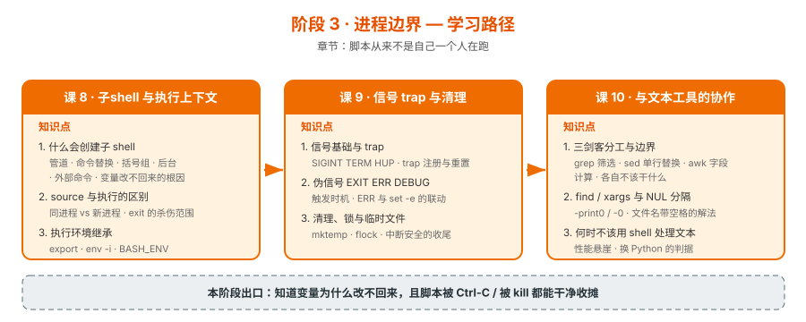

# 阶段 3：进程边界

> 所属课程：Bash 编程 ｜ 故事章节：脚本从来不是自己一个人在跑 ｜ 上一阶段：[阶段 2](../2-语言内核/overview.md) ｜ 下一阶段：[阶段 4](../4-生产化/overview.md)

## 🎯 本阶段目标

- 搞清**进程边界**：什么会创建子 shell、变量为什么改不回来、环境变量怎么传
- 让脚本**可被中断**：Ctrl-C、被 kill、异常退出都能清理临时文件与锁，不留半个烂摊子
- 明白 shell 在文本处理链中的**角色边界**：它是胶水，不是计算引擎

## 📍 学习重点

- **子 shell 的六种来源**：管道两侧、命令替换 `$(...)`、括号组 `( )`、后台 `&`、外部命令、以及被 `source` 之外的脚本。理解这一点，"变量改了没生效"就不再是玄学
- **`source` vs 执行**：`source` 在同一个进程里跑，所以 `exit` 会**杀掉你的 shell**；执行是子进程，改不了父进程环境。这个区别决定了配置文件为什么要用 `source`
- **`trap` 与伪信号**：`EXIT` 是唯一"无论怎么退出都会触发"的钩子，是清理逻辑的唯一正确落点；`ERR` 与 `set -e` 联动时行为微妙；`DEBUG` 可以做逐行追踪
- **清理三件套**：`mktemp -d` 建临时目录、`trap ... EXIT` 注册清理、`flock` 防并发。这三样组合才是"中断安全"
- **NUL 分隔**：`find -print0` + `xargs -0` / `read -r -d ''` 是文件名带空格的**唯一正解**，靠加引号是治不好的
- **并发与 `wait`**：后台任务 `&` 也是一条进程边界——它的退出码**只能靠 `wait` 取回**；并行度不控制则会把下游压垮。（⚠️ 课 8 实测修正：裸 `wait $!` 失败时 `set -e` **确实生效**，只有被 `if`/`&&`/`||` 包裹才失效——是 `set -e` 通用规则，非后台任务特权）
- **性能悬崖**：`while read` 循环里每 fork 一次外部命令，处理 1 万行就是 1 万次进程创建——这是 shell 处理文本的硬边界

## ✅ 必须掌握的知识点

| 知识点 | 所属课 | 学完应能 |
|--------|--------|----------|
| 什么会创建子 shell | 课 8 | 列举六种情形，并把"变量改不回来"归因为具体哪一种 |
| source 与执行的区别 | 课 8 | 判断该用 `source` 还是执行；说清 `exit` 的杀伤范围 |
| 执行环境继承 | 课 8 | 用 `export` / `env -i` 控制子进程环境；避开 `BASH_ENV` 陷阱 |
| 作业控制与并发 | 课 8 | 用 `wait` / `wait -n` 实现 N 路并发并正确收集每个后台任务的退出码 |
| 信号基础与 trap | 课 9 | 注册 SIGINT/SIGTERM 处理；知道 trap 的继承与重置规则 |
| 伪信号 EXIT / ERR / DEBUG | 课 9 | 用 `trap ... EXIT` 做清理；说清 ERR 与 `set -e` 的联动 |
| 清理、锁与临时文件 | 课 9 | 用 `mktemp -d` + `trap EXIT` + `flock` 写出中断安全的脚本 |
| 三剑客分工与边界 | 课 10 | 在 grep / sed / awk 之间正确选择，且不越界 |
| find / xargs 与 NUL 分隔 | 课 10 | 正确处理含空格、含换行的文件名 |
| 何时不该用 shell 处理文本 | 课 10 | 给出换 Python 的具体判据（行数 / 逻辑复杂度 / 性能） |

### 课 8 核心结论（2026-09-04 完成）

四条进程边界，逐条实测：

| 边界 | 现象 | 实测证据 | 正确做法 |
|------|------|----------|----------|
| 变量边界 | 子 shell 改变量不回传 | 管道内 `BASHPID` 2019766 ≠ 父 2019763，`count` 归 0 | `while ... done < file` 代替管道 |
| `exit` 边界 | source 时 `exit` 杀掉调用者 | `source killer.sh` → 外层退出码 3，后续不执行 | 库文件用 `return` |
| 环境边界 | `export` 是 fork 时一次性拷贝 | 子改 `ev=child` 后父仍 `parent_value` | 要改当前 shell 必须 source |
| 退出码边界 | 后台任务成败藏在 `wait` 里 | `$?` 拿到的是 `sleep` 的 0，非任务的 9 | `wait $pid` 取回 |

**性能实测（8 台部署，跑 3 轮）**：串行 1611ms → 4 路限流 404-405ms（约 4 倍加速）→ 8 路全开 204ms。但**限流的目的是保护下游**：800 台时全开会打爆跳板机。

**三处实测纠正的常见说法**：

1. `set -e` 对**裸 `wait` 生效**（rc=5，后续不执行），只对 `if wait`/`&&`/`||` 包裹的形式失效——是 `set -e` 通用规则，非后台任务特权
2. 子 shell **继承 trap 但退出不触发**（常见说法"子 shell 重置 trap"不准确）；独立进程 `bash -c` 才完全不继承
3. `lastpipe` 在 `set -m` 开启作业控制时**静默失效**（`c=0`），不如重定向写法稳妥

### 课 9 核心结论（2026-09-04 完成）

三个知识点实测，四条最关键的结论：

| 现象 | 直觉 | 实测真相 |
|------|------|----------|
| 脚本被 Ctrl-C | 退出码 130 | 若正在等**外部命令**且无 trap → **0**；纯计算脚本才是 130 |
| Ctrl-C 立刻中断 | 命令马上停 | bash **推迟**信号处理，命令会**跑完**（T+0.5 发 INT，T+3.0 才触发） |
| 进程死了锁自动放 | fd 关闭即释放 | 只杀父进程不够，**孤儿子进程继承 fd 继续持锁** |
| `kill -- -$$` 杀进程组 | 清理后台任务 | 脚本**不是组长**（PGID=父 PID），要么无效、要么**误杀调用者** |

**信号与伪信号速查**：

- `trap 'cmd' INT` 注册 / `trap - INT` 重置为默认（会死）/ `trap '' INT` 忽略（不死）
- `trap ... KILL` **返回 0 不报错，但 handler 永不执行**
- 继承规则：handler **不继承**，只有"忽略"继承（POSIX）
- `EXIT` 是唯一全覆盖钩子，但**被信号杀死时 `$?` 是 0**（实际退出 143）→ 必须第一行存
- 两个 `trap ... EXIT` → **后者覆盖前者**，前一条静默消失
- `ERR` 需 `set -E` 才进函数；`DEBUG`/`RETURN` 需 `set -T`；`ERR` **只报告不拦截**

**中断安全三件套**：`mktemp -d`（权限 700，模板至少 6 个 X）+ `trap cleanup EXIT` + `flock` fd 形式。cleanup 范式：`local rc=$?` → `trap - EXIT` 防重入 → 清理 → `exit $rc` 保退出码。

### 课 10 核心结论（2026-09-04 完成）

三条处理路线在 1 万文件 / 20 万行上的实测（3 轮，结果全部一致 = 40063）：

| 路线 | 耗时 | 相对 |
|------|------|------|
| `while read` + 循环内 `grep`（1 万次 fork） | 13731ms | 361× |
| `xargs -0 -n 500 awk`（再汇总） | 84–90ms | 2.3× |
| `xargs -0 cat \| awk`（单批，语义最简单） | 140–145ms | 3.7× |
| `xargs -0 -n 500 -P 8 awk`（并行） | **37–38ms** | 1× |

**fork 成本量化**（本课立论基础）：一次 fork+exec ≈ **0.55ms**（1 万次 = 5491ms），
bash 自身算术 1 万次只要 35ms——**相差约 157 倍**。所以慢的不是 shell，是跨越进程边界。

**四条最关键的结论**：

| 现象 | 直觉 | 实测真相 |
|------|------|----------|
| shell 慢 → 该换 Python | Python 更快 | **优化过的 shell（awk 45ms）比 Python（63ms）还快**；换语言理由是复杂度，不是性能 |
| `for f in $(find ...)` 能用 | 加引号就行 | 三重错误（分词+glob+缓冲），**9 个文件数出 16 个**；加引号更错（变成一个字符串） |
| 换行分隔够安全 | 文件名不含换行 | POSIX 只禁 `/` 和 NUL，**换行合法** → `while read` 数出 10 个；只有 NUL 分隔得 9 个 |
| `xargs -0 awk '...END{}'` 得到总数 | 一个 END | **分批启动多进程，每个都执行 END** → 输出 3 个小计，**不报错**，文件少时却是对的 |

**三剑客分工**：grep = 筛选（筛子）、sed = 逐行改写（贴标机）、awk = 字段处理与聚合（带小本子的工人）。
awk 的 `BEGIN / 模式{动作} / END` 三段模型是"一次遍历完成筛选+提取+汇总"的基础。

**换 Python 的五个判据**（性能**不在**其中）：①需要嵌套数据结构（bash 只能拼字符串 key）；
②需要真正的异常（shell 里 `arr[10]` 越界返空、`$((v+1))` 非数字当 0，**都不报错**）；
③脚本 > 200–300 行且有分支；④需要单元测试与重构；⑤需要跨平台或输出 JSON。

> ✅ **阶段 3《进程边界》已完结**（3 课 / 10 知识点，2026-09-04）：
> 课 8 回答"边界在哪里"，课 9 回答"被中断了怎么办"，课 10 回答"应该怎么跨界"。
> 一句话收束：**shell 是一门编排语言，能力来自把别的程序串起来，成本也来自于此。**

## 🗺️ 本阶段路径图

## 本阶段产出

- [x] `lessons/lesson-08-子shell与执行上下文.md`
- [x] `lessons/lesson-09-信号trap与清理.md`
- [x] `lessons/lesson-10-与文本工具的协作.md`

## 💡 与阶段 4 的分工

本阶段解决"**边界与中断**"（进程在哪分叉、被中断怎么收摊），阶段 4 解决"**可见性与正确性**"（错误怎么被发现、怎么验证脚本是对的）。`trap ERR` 在课 9 讲机制，它在错误处理中的实战用法放在阶段 4 课 11。
