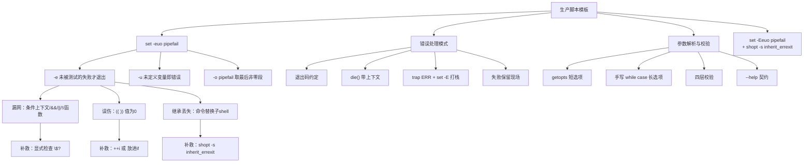
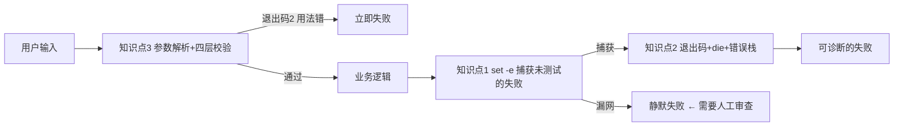
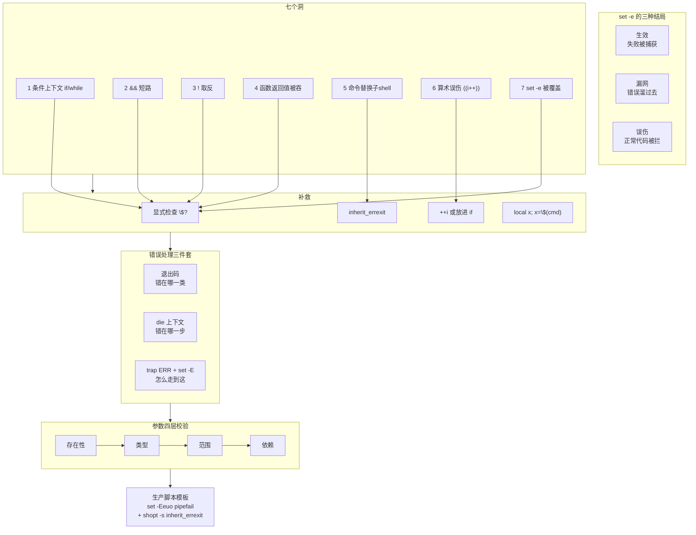

## 第一幕：起源与场景引入

> 🎬 **场景**：`deploy.sh` 开头是标准三连：

```bash
set -euo pipefail
```

每个写 Bash 的人都被教过要加这一行。它看起来像是一张安全网："任何命令失败，脚本立刻退出。"

> 📌 **下文示例中的 `$log` 代表"某个日志文件路径变量"**。为方便你跟着敲，每个引用 `$log` 的示例都自带了文件准备命令（`printf ... > /tmp/app.log`），可以单独复制运行。

然后某天，脚本在这行静默通过了：

```bash
printf 'ERROR disk full\nINFO ok\n' > /tmp/app.log
log=/tmp/app.log
if grep -q "ERROR" "$log"; then
    echo "发现错误" >&2
else
    echo "没有错误（grep 返回 1，但脚本继续）"
fi
echo "脚本继续，退出码 $?"
```

`grep` 没找到匹配（退出码 1），`set -e` 没让脚本退出——**这没问题，因为它就该这样**。

但紧接着这一行：

```bash
printf 'ERROR disk full\nINFO ok\n' > /tmp/app.log
log=/tmp/app.log
count=$(grep -c "PATTERN" "$log" || true)
echo "count=[$count]"      # 空字符串：PATTERN 无匹配
[[ $count -gt 0 ]] && echo "alert" || echo "静默跳过（无匹配，也没报错）"
```

这里的 `|| true` 是作者为了"防 `set -e` 误杀"加的。可如果 `$log` 文件根本不存在呢？`grep` 会返回 2（真错误），`|| true` 把它变成 0，`count` 得到空字符串，后面 `[[ $count -gt 0 ]]` 静默为假——**一次真正的失败，被一个"保险措施"彻底吞掉了**。

更糟的是这个：

```bash
set -e
i=0
(( i++ ))          # ← 脚本在这里退出，但没人知道为什么
echo "i=$i"
```

`(( i++ ))` 在 `i=0` 时表达式的值为 0，`set -e` 认为"命令失败"——**脚本被自己的计数器杀掉了**。

这就是本课要解决的问题：`set -euo pipefail` 是 Bash 里**最多人写、最少人真懂**的一行。它不是一张网，而是一张**有七个洞的网**——而且这七个洞的方向还不一样：有些让错误溜过去，有些又把正常代码拦下来。

---

## 第二幕：认知冲突

> ❓ **问题**：`set -e` 到底是什么？为什么它时灵时不灵？

先做一组对照实验。下面两段代码，唯一的区别是 `false` 出现的位置：

```bash
# 实验 A：失败的命令裸奔
set -e
false
echo "继续执行"       # ← 不打印，脚本在 false 处退出
```

```bash
# 实验 B：失败的命令在 if 里
set -e
if false; then :; fi
echo "继续执行"       # ← 打印了！set -e 没生效
```

**同一个 `false`，在 A 里致命，在 B 里无害。**

原因是 `set -e` 的真实语义极其反直觉：

> **它不是"任何命令失败就退出"，而是"一个未被『测试过』的命令失败就退出"。**

只要命令出现在条件上下文里（`if` / `while` / `until` / `&&` / `||` / `!`），它就被"测试过"了，`set -e` 对它**主动让路**。

而且——这是最要命的一点——**这个豁免会沿着调用链向内传染，让整个函数体都失去保护**：

```bash
set -e
f() {
    echo "步骤1"
    false                  # ← 函数内部的失败
    echo "步骤2永远会执行"   # ← 它打印了
}
if f; then echo "成功"; fi
echo "外部也继续"
```

实测输出（`bash 5.2.21`）：

```text
步骤1
步骤2永远会执行
成功
外部也继续
```

函数 `f` 因为被 `if` 测试，**整个函数体内部的 `set -e` 全部失效**。你在函数里写的每一步错误检查，都形同虚设。

再看另一个方向——`set -e` 不只是"漏掉"错误，它还会**制造**错误：

```bash
set -e
i=0
(( i++ ))     # 表达式值为 0 → 判定为失败 → 脚本退出
echo "i=$i"   # 永远不执行
```

这里 `i++` 后置自增**返回自增前的值**：`i` 是 0，所以表达式值为 0，退出码为 1。一个完全正常的计数器写法，直接被 `set -e` 判了死刑。

**多数人以为 `set -e` 是安全网，实际它同时在做两件相反的事：该拦的不拦，不该拦的乱拦。**

---

## 第三幕：层层揭示

### 知识点 1：set -euo pipefail 的真相

> 本知识点关键点：`-e` 的真实语义与"被测试过"豁免规则、`-u` 对未定义变量的严格化（含 `"$@"` 与 `${arr[@]}` 在旧 bash 下的空数组陷阱）、`-o pipefail` 的语义是"取最后一个非零值"而非"第一个失败"、失效场景清单（条件上下文、`!` 取反、`||` 短路、函数返回值被吞、子 shell、算术上下文、被继承覆盖）、`inherit_errexit` 与 `shopt -s inherit_errexit` 的补救

#### 一句话定义

`set -euo pipefail` 的三个开关各管一件事：**`-e`** 让"未被测试过的失败命令"终止脚本，**`-u`** 让未定义变量的引用变成错误，**`-o pipefail`** 让管道的退出码反映"最后一个非零的段"——但三者都有明确的失效边界，且 `-e` 的边界尤其多。

#### 直觉建立（类比）

把 `set -e` 想成一个**只在没人盯着的时候才报警的保安**。

- 一条命令裸奔时，没人盯着 → 它失败了，保安立刻报警（脚本退出）。
- 同一条命令被 `if` 包着时，有人盯着（`if` 正在检查它的结果）→ 保安想："有人看着呢，不用我管。"→ 放行。
- 而这个"有人盯着"的认定会**传染**：如果 `if` 盯着的是一个函数，那么函数里面所有命令都被认为"有人看着"。

问题是：你在函数里写的 `false`，其实**并没人盯着**——`if` 只是想知道函数的最终返回值，它管不着函数内部的第二步、第三步。保安却认为"整栋楼都有人看着"，于是全部放行。

至于 `(( i++ ))` 那种情况，是保安把"计数器读数为 0"误判成了"有人倒下了"。

#### 核心原理

先确认本机环境（本课所有实测均在此环境）：

```bash
bash --version | head -1
for o in errexit nounset pipefail errtrace inherit_errexit; do
    if set -o | grep -q "^$o *on$"; then
        echo "set -o $o: on"
    elif shopt -q "$o" 2>/dev/null; then
        echo "shopt $o: on"
    else
        echo "$o: off"
    fi
done
```

实测输出：

```text
GNU bash, version 5.2.21(1)-release (x86_64-pc-linux-gnu)
inherit_errexit: off
errtrace: off
errexit: off
set -o nounset: on
pipefail: off
```

> 注意 `nounset` 显示为 on，是因为检测脚本自身带了 `set -u`；新建的 bash 默认 `errexit` / `nounset` / `pipefail` / `errtrace` / `inherit_errexit` **全部为 off**。这正是本课全部立论的前提。

##### 一、`-e` 的真实语义：三种结局

`set -e` 下一条失败命令可能有三种结局，必须先分清：

| 结局 | 含义 | 例子 |
|------|------|------|
| **生效（退出）** | 失败被捕获，脚本终止 | `set -e; false` |
| **失效（漏网）** | 失败被忽略，脚本继续——**错误溜过去了** | `set -e; if false; then :; fi` |
| **误伤（误杀）** | 命令其实成功了，脚本却退出——**正常代码被拦** | `set -e; i=0; (( i++ ))` |

多数教程只讲第一种，把后两种混为一谈。但它们的**性质和修复方法完全不同**：漏网要补检查，误伤要加保护。

##### 二、七种失效场景（附实测）

下面每条都在 `bash 5.2.21` 实测过。判定方法：失败后打印 `CONTINUED` 说明脚本没退出。

**场景 1：条件上下文（`if` / `while` / `until`）**

```bash
set -e
if false; then echo "then"; fi
echo "CONTINUED"
```

实测：`继续执行，rc=0` —— **失效**。

`if` 正在测试这个命令的结果，所以 `set -e` 让路。这是**设计如此**，不是 bug：你显然想根据 `grep` 的成败来分支。

真正危险的是**豁免向内传染**：

```bash
set -e
f() {
    echo "步骤1"
    false
    echo "步骤2永远会执行"
}
if f; then echo "成功分支"; else echo "失败分支"; fi
echo "CONTINUED"
```

实测输出：

```text
步骤1
步骤2永远会执行
成功分支
CONTINUED
```

注意"成功分支"——函数最后的 `echo` 返回 0，掩盖了中间 `false` 的失败。函数体内的错误检查全部失效。

**场景 2：`&&` / `||` 短路**

```bash
set -e
false || echo "走了||分支"
echo "CONTINUED"
```

实测：`继续执行` —— **失效**。`||` 左侧的命令被视为"测试过"。

这就是开篇那个 `|| true` 吞掉真错误的根源：

```bash
set -e
grep -c NOSUCHPATTERN /etc/hostname || true
echo "CONTINUED"
```

`grep` 找不到模式返回 1，`|| true` 把它变成 0。但如果文件不存在，`grep` 返回 **2**（真错误），`|| true` 同样把它变成 0。**一个"保险"同时吞掉了无害的 1 和有害的 2。**

正确写法是区分对待：

```bash
printf 'ERROR disk full\nINFO ok\n' > /tmp/app.log
set -e
log=/tmp/app.log            # ← 改成 /tmp/nosuch.log 可看到"真错误被保留"
pattern='ERROR'
# 只吞掉"无匹配"(1)，保留真错误(2)
count=$(grep -c "$pattern" "$log") || {
    rc=$?
    (( rc == 1 )) || exit "$rc"    # 1 视为空结果，其他是真错误
    count=0
}
echo "count=$count"
```

**场景 3：`!` 取反**

```bash
set -e
! false
echo "CONTINUED"
```

实测：`继续执行` —— **失效**。而且 `!` 同样会**向内传染到函数体**：

```bash
set -e
f() { false; echo "函数内继续"; }
! f
echo "CONTINUED"
```

实测输出 `函数内继续` + `CONTINUED`。`!` 只关心函数的最终返回值，函数内部的 `set -e` 全部失效。

**场景 4：函数返回值被吞**

这其实是场景 1–3 的合集的后果，值得单独强调。同一个函数，只因调用方式不同，行为就完全相反：

```bash
# 4c：函数未被测试 → set -e 生效
set -e
f() { false; echo "函数内继续"; }
f
echo "CONTINUED"
```

实测：`提前退出，rc=1`（`函数内继续` 没打印）。

```bash
# 4b：函数被 && 测试 → set -e 失效
set -e
f() { false; echo "函数内继续"; }
f && echo "OK"
echo "CONTINUED"
```

实测：`继续执行`，打印 `函数内继续` 和 `OK`。

**同一个函数，加不加 `&&` 决定了它内部的错误检查是否生效。** 这是最难排查的一类问题，因为出问题的代码（函数体）和导致问题的代码（调用处）相隔很远。

**场景 5：子 shell 与命令替换**

这里的表现**分两种**，必须分开看：

```bash
# 子 shell 整体失败 → 父 shell 会退出（生效）
set -e
( false )
echo "CONTINUED"
```

实测：`提前退出，rc=1` —— **生效**。子 shell 的退出码就是最后一个命令的退出码，父 shell 能看到。

```bash
# 子 shell 内部失败但后面还有命令 → 内部继续执行
set -e
( false; echo "子shell内后续" )
echo "CONTINUED"
```

实测：`提前退出，rc=1`，**但 `子shell内后续` 确实被打印了**（在退出前）。子 shell 内部是"继续执行"的，只是最终退出码传给了父 shell。

真正的问题在**命令替换**：

```bash
set -e
x=$(false; echo "内部后续")
echo "CONTINUED"
```

实测：`继续执行` —— **失效**。命令替换里的 `false` 没让任何东西退出，`内部后续` 正常执行。

原因是**命令替换创建子 shell，而 `errexit` 默认不继承进去**。补救办法是打开 `inherit_errexit`：

```bash
set -e
shopt -s inherit_errexit
x=$(false; echo "内部后续")
echo "CONTINUED"
```

实测：`提前退出，rc=1` —— 失败被捕获了。

不过要注意：如果失败发生在命令替换的**最后一条命令**，返回值仍会传给父 shell 并被 `set -e` 捕获：

```bash
set -e
x=$(echo hi; false)
echo "CONTINUED"
```

实测：`提前退出，rc=1`。所以命令替换的坑只在"失败后还有后续命令"时才暴露。

**场景 6：算术上下文 `(( ))` —— 这是误伤，不是失效**

这是本课最需要纠正的一处常见误解。很多资料把算术上下文列为"`set -e` 失效场景"，**这是错的**。实测证明它恰恰相反——`set -e` 在这里**过度生效**：

```bash
set -e
(( 0 ))
echo "CONTINUED"
```

实测：`提前退出，rc=1`。

因为 `(( ))` 的退出码规则是：**表达式值非 0 → 返回 0（成功）；值为 0 → 返回 1（失败）**。这跟 C 语言的真假判断一致，但跟"命令是否出错"完全无关。

于是经典的坑出现了：

```bash
set -e
i=0
(( i++ ))
echo "CONTINUED i=$i"
```

实测：`提前退出，rc=1`。

`i++` 是**后置自增**，返回自增**前**的值。`i` 是 0，表达式值为 0，`(( ))` 返回 1，`set -e` 判定失败 → 脚本退出。

对照一下 `i=1` 的情况：

```bash
set -e
i=1
(( i++ ))
echo "CONTINUED i=$i"
```

实测：`继续执行`，打印 `CONTINUED i=2`。

**同一个 `(( i++ ))`，只因 `i` 的初始值不同，一个死一个活。** 这种 bug 的隐蔽性在于：循环第一次迭代正常（`i` 从 1 开始），某次 `i` 恰好为 0 时突然暴毙。

一组对照实测（`set -e` 下各表达式）：

```text
set -e; (( 0 ))        -> rc=1  (退出)
set -e; (( 1 ))        -> rc=0  (继续)
set -e; (( 1 - 1 ))    -> rc=1  (退出)
set -e; (( 5 > 3 ))    -> rc=0  (继续)
set -e; (( 5 < 3 ))    -> rc=1  (退出)
```

`(( 5 < 3 ))` 这个**纯粹的逻辑判断**也会导致脚本退出——因为它求值为假（0）。

三种规避写法（均实测通过）：

```bash
set -e
i=0
(( ++i ))                 # 前置自增，返回自增后的值 1 → rc=0
echo "前置++: i=$i OK"
```

```bash
set -e
i=0
(( i++ )) || true         # 显式容忍
echo "||true: i=$i OK"
```

```bash
set -e
i=0
if (( i++ == 0 )); then   # 放进条件上下文（推荐：语义最清晰）
    echo "if条件: i=$i OK"
fi
```

推荐第三种：`(( ))` 本就用于判断，把它放进 `if` 既符合语义，又天然获得豁免。

**场景 7：`set -e` 被覆盖或继承丢失**

`set -e` 是**全局状态**，不是局部的。函数里 `set +e` 会影响调用者：

```bash
set -e
f() { set +e; false; echo "函数内继续"; }
f
echo "CONTINUED"
```

实测：`继续执行` —— `set +e` 泄漏到了全局，之后的 `set -e` 全部失效。

对照子 shell（隔离，不泄漏）：

```bash
set -e
( set +e )
false
echo "CONTINUED"
```

实测：`提前退出，rc=1` —— 子 shell 里的 `set +e` 没影响到父 shell。

**实践含义**：函数里若要临时关掉 `set -e`，必须**恢复**，或者干脆放进子 shell。更推荐的做法是只在局部用 `||` 容忍特定失败，而不去动全局开关。

##### 三、`-u`：未定义变量即错误

`-u`（`set -o nounset`）让未定义变量的引用变成错误：

```bash
set -u
echo "$UNDEFINED_VAR"
echo "CONTINUED"
```

实测：`提前退出，rc=127`，报错 `bash: line 2: UNDEFINED_VAR: unbound variable`。

注意退出码是 **127**，不是 1。

位置参数同样被检查：

```bash
set -u
echo "$1"
echo "CONTINUED"
```

实测：`提前退出，rc=127`。这是 `${1:?}` 之外的一种保护，但 `-u` 的错误信息不如 `:?` 友好。

规避写法（实测均通过）：

```bash
set -u
echo "${1:-默认值}"     # 未定义或为空 → 用默认值
echo "${1-默认值}"      # 仅未定义 → 用默认值（空字符串保留）
```

两者的区别：`${1:-x}` 在 `$1` 为空字符串时也用默认值，`${1-x}` 只在 `$1` 完全未定义时用默认值。

**关于空数组的坑（重要更正）**

很多资料说 `set -u` 下引用空数组 `"${arr[@]}"` 会报错——这在 **bash 4.3 及更早**确实如此。但本机是 **bash 5.2.21**，实测该问题**已被修复**：

```bash
set -u
arr=()
echo "元素数=${#arr[@]}"
echo "展开=[${arr[@]}]"
echo "CONTINUED"
```

实测输出：

```text
元素数=0
展开=[]
CONTINUED
```

不报错，`rc=0`。

> **环境提示**：如果你的脚本要跑在 bash 4.3 或更早（例如 CentOS 7 的 bash 4.2），仍需用 `${arr[@]+"${arr[@]}"}` 这种写法规避。但在 bash 4.4+ 可以放心直接用。这条差异值得写进脚本的兼容性注释。

##### 四、`-o pipefail`：取"最后一个非零值"

默认情况下，管道的退出码是**最后一个命令**的退出码：

```bash
set -e
false | cat
echo "CONTINUED"
```

实测：`继续执行，rc=0` —— **管道左侧的 `false` 被完全吞掉**，因为 `cat` 成功了。

打开 `pipefail` 后：

```bash
set -eo pipefail
false | cat
echo "CONTINUED"
```

实测：`提前退出，rc=1`。

`pipefail` 的精确语义是：**管道的退出码 = 最后一个非零的段**。注意不是"第一个失败"：

```bash
set -eo pipefail
{ exit 3; } | { exit 7; }
echo "CONTINUED"
```

实测：`提前退出，rc=7` —— 取的是**最后**一个非零值 7，不是第一个 3。

如果想看每个段的退出码，用 `PIPESTATUS`：

```bash
set -eo pipefail
{ exit 3; } | { exit 7; } || true
echo "PIPESTATUS=${PIPESTATUS[*]}"
```

**注意**：`PIPESTATUS` 会在任何后续命令执行后被重置，所以要么立即读取，要么先存进变量。

**`pipefail` 的经典陷阱：SIGPIPE（退出码 141）**

`pipefail` 会暴露一个原本被掩盖的问题——`| head` 导致的 SIGPIPE：

```bash
set -eo pipefail
yes | head -1
echo "CONTINUED"
```

实测：`提前退出，rc=141`。

`head` 读够 1 行就退出，关闭管道；`yes` 继续写入时收到 SIGPIPE 信号（13），退出码 = 128 + 13 = **141**。

实测对比（数据量决定是否触发）：

```text
set -eo pipefail; seq 1 200000 | head -1 >/dev/null  -> rc=141 (退出)
set -eo pipefail; seq 1 10     | head -1 >/dev/null  -> rc=0   (继续)
set -eo pipefail; yes          | head -1 >/dev/null  -> rc=141 (退出)
set -eo pipefail; printf "a\nb\n" | grep a | head -1 >/dev/null -> rc=0 (继续)
```

小数据量时 `seq` 在 `head` 退出前就写完了，不触发；数据量大或无限输出（`yes`）必然触发。

**这是 `pipefail` 最常见的"假警报"**：脚本逻辑完全正确，却因为下游提前关闭管道而失败。处理办法：

```bash
set -eo pipefail
# 明确容忍 SIGPIPE
yes | head -1 || {
    rc=$?
    (( rc == 141 )) || exit "$rc"
}
```

或者在 `ERR` trap 里统一把 141 视为正常。

##### 五、补救清单：`shopt` 的两个开关

| 开关 | 作用 | 默认 | 何时需要 |
|------|------|------|----------|
| `shopt -s inherit_errexit` | 让 `errexit` 继承进命令替换的子 shell | off | 依赖命令替换内部失败即退出时 |
| `set -E`（`set -o errtrace`） | 让 `ERR` trap 被函数继承 | off | 用 `trap ERR` 打错误栈时**必需** |

推荐的生产脚本开头：

```bash
#!/usr/bin/env bash
set -Eeuo pipefail
shopt -s inherit_errexit
```

比标准三连多了 `E` 和 `inherit_errexit`。

#### 示例演示

把七种场景一次跑完（可直接复制执行）：

```bash
cat > /tmp/set_e_audit.sh <<'SCRIPT'
#!/usr/bin/env bash
# set -e 失效/误伤场景自检
run_case() {
    local name="$1" code="$2" out rc
    out=$(bash -c "$code" 2>&1)
    rc=$?
    if grep -q '^CONTINUED$' <<<"$out"; then
        printf '%-30s | 继续执行 | rc=%-3s\n' "$name" "$rc"
    else
        printf '%-30s | 提前退出 | rc=%-3s\n' "$name" "$rc"
    fi
}

run_case "基线-裸命令失败"        'set -e; false; echo CONTINUED'
run_case "1-if条件"               'set -e; if false; then :; fi; echo CONTINUED'
run_case "1-if函数(体内豁免)"     'set -e; f(){ false; echo 函数内继续; }; if f; then :; fi; echo CONTINUED'
run_case "2-&&短路"               'set -e; false && echo x; echo CONTINUED'
run_case "2-||true吞真错"         'set -e; grep -c X /etc/hostname || true; echo CONTINUED'
run_case "3-!取反"                'set -e; ! false; echo CONTINUED'
run_case "4-函数被&&测试"          'set -e; f(){ false; echo 函数内继续; }; f && echo OK; echo CONTINUED'
run_case "5-子shell整体失败"       'set -e; ( false ); echo CONTINUED'
run_case "5-命令替换内部失败"      'set -e; x=$(false; echo 内部继续); echo CONTINUED'
run_case "5-命令替换+inherit"      'set -e; shopt -s inherit_errexit; x=$(false; echo x); echo CONTINUED'
run_case "6-算术((0))误伤"         'set -e; (( 0 )); echo CONTINUED'
run_case "6-算术i=0自增误伤"       'set -e; i=0; (( i++ )); echo CONTINUED'
run_case "6-算术i=1自增正常"       'set -e; i=1; (( i++ )); echo CONTINUED'
run_case "7-函数内set+e泄漏"       'set -e; f(){ set +e; }; f; false; echo CONTINUED'
run_case "P-无pipefail管道左失败"  'set -e; false | cat; echo CONTINUED'
run_case "P-有pipefail"           'set -eo pipefail; false | cat; echo CONTINUED'
run_case "P-pipefail取最后非零"    'set -eo pipefail; { exit 3; } | { exit 7; }; echo CONTINUED'
run_case "P-SIGPIPE 141"          'set -eo pipefail; yes | head -1 >/dev/null; echo CONTINUED'
SCRIPT
bash /tmp/set_e_audit.sh
```

实测输出：

```text
基线-裸命令失败                  | 提前退出 | rc=1
1-if条件                        | 继续执行 | rc=0
1-if函数(体内豁免)               | 继续执行 | rc=0
2-&&短路                        | 继续执行 | rc=0
2-||true吞真错                  | 继续执行 | rc=0
3-!取反                         | 继续执行 | rc=0
4-函数被&&测试                   | 继续执行 | rc=0
5-子shell整体失败                | 提前退出 | rc=1
5-命令替换内部失败               | 继续执行 | rc=0
5-命令替换+inherit               | 提前退出 | rc=1
6-算术((0))误伤                  | 提前退出 | rc=1
6-算术i=0自增误伤                | 提前退出 | rc=1
6-算术i=1自增正常                | 继续执行 | rc=0
7-函数内set+e泄漏                | 继续执行 | rc=0
P-无pipefail管道左失败           | 继续执行 | rc=0
P-有pipefail                    | 提前退出 | rc=1
P-pipefail取最后非零             | 提前退出 | rc=7
P-SIGPIPE 141                   | 提前退出 | rc=141
```

#### 常见误区

**误区 1：以为 `set -e` 能捕获管道左侧失败**

不能，必须配 `pipefail`。实测 `set -e; false | cat` 继续执行（rc=0），加 `pipefail` 后才退出。

**误区 2：以为算术上下文会"失效"**

恰恰相反，它是**误伤**。实测 `set -e; (( 0 ))` 会退出（rc=1）。把两者混为一谈，会导致你给本该通过的代码加不必要的 `|| true`。

**误区 3：以为 `|| true` 只是"让 grep 无匹配时不退出"**

它同时吞掉了 `grep` 返回 2 的真错误（文件不存在等）。正确做法是检查 `$?` 并区分退出码。

**误区 4：认为函数里的 `set -e` 是局部的**

`set -e` 是全局状态，函数内 `set +e` 会泄漏到调用者。子 shell 是隔离的，函数不是。

**误区 5：以为 `local x=$(cmd)` 和 `local x; x=$(cmd)` 等价**

不等价，这关系到退出码是否被吞：

```bash
set -e
f(){ local x=$(false); echo "函数内继续, local rc=$?"; }
f
echo "外部继续"
```

实测：`继续执行`，打印 `函数内继续, local rc=0` —— **失败被吞了**，因为 `local` 自身的退出码（0）覆盖了命令替换的退出码。

```bash
set -e
f(){ local x; x=$(false); echo "这行不执行"; }
f
echo "外部不执行"
```

实测：`提前退出，rc=1` —— 分开写则正确捕获。

直接对比两者的返回值：

```text
local 的 rc=0     ← local x=$(false)
赋值的 rc=1       ← local x; x=$(false)
```

**规则：永远分开写 `local` 和赋值。**

**误区 6：以为 `-u` 会让空数组报错（在 bash 5.2 上）**

不会。bash 4.4+ 已修复，实测 `set -u; arr=(); echo "${arr[@]}"` 正常输出空。这是 bash 4.3 及更早的问题。

**误区 7：以为 `set -euo pipefail` 就"安全"了**

它连自己的三件事都没做全：命令替换内部不继承（需 `inherit_errexit`）、`ERR` trap 不进函数（需 `set -E`）、管道 SIGPIPE 会误报（需单独处理 141）。

#### 一句话记住

> **`set -e` 不是"出错就退"，而是"没人盯着才退"——它既会在有人盯的时候放走错误（漏网），也会把值为 0 的正常算术当成失败（误伤）；配上 `-u` 防未定义、`pipefail` 防管道吞错、`-E` 让 trap 进函数、`inherit_errexit` 让子 shell 继承，才算真的把网补上。**

---

### 知识点 2：错误处理模式

> 本知识点关键点：退出码语义约定（0 成功 / 1 通用错 / 2 用法错 / 126 不可执行 / 127 未找到 / 130 Ctrl-C / 128+n 信号）、错误信息必须带上下文（哪一步、哪个文件、哪个参数）、`die()` 函数模式、`trap 'handler $LINENO' ERR` 打栈（配合 `set -E`）、`FUNCNAME`/`BASH_SOURCE`/`BASH_LINENO` 组装堆栈、"失败时留下可诊断现场"而非静默清理

#### 一句话定义

错误处理模式 = **一套让失败"自解释"的约定**：用明确的退出码说明"错在哪一类"，用带上下文的错误信息说明"错在哪一步"，用 `trap ERR` 自动打印调用栈说明"怎么走到这一步的"。

#### 直觉建立（类比）

把脚本想象成一个**快递分拣流水线**。

- **退出码**是包裹上的**异常分类标签**：1 = 包裹破损，2 = 地址写错，3 = 收件人不存在。看标签就知道该找谁处理。
- **错误信息**是标签上的**具体备注**：不只是"地址错"，而是"地址错：缺少门牌号（收件人：张三，订单号 12345）"。
- **调用栈**是**物流轨迹**：包裹经过了哪些站点、在哪个站点出的问题。

只贴"出错了"三个字的包裹，只能退回发货方，谁也处理不了。

而 `trap ERR` 就是那个**自动记录轨迹的扫码枪**——但要注意，它默认只在总站工作，不会跟进分拣中心内部（函数），除非你打开 `set -E`。

#### 核心原理

##### 一、退出码约定

Bash 的退出码是 0–255。约定俗成的语义（本课实测验证）：

| 退出码 | 含义 | 实测来源 |
|--------|------|----------|
| `0` | 成功 | `true` → 0 |
| `1` | 通用失败 / 多数命令的"否"答案 | `false` → 1；`grep` 无匹配 → 1 |
| `2` | **用法错误**（参数写错、缺参数） | 约定；`getopts` 内置错误也是 2 |
| `3`–`125` | 自定义业务错误 | 自由分配 |
| `126` | 命令存在但**不可执行** | 执行无执行位的文件 → 126 |
| `127` | 命令**未找到** | `nosuch_cmd_xyz` → 127；`set -u` 未定义变量 → 127 |
| `128+n` | 被**信号 n** 终止 | SIGINT(2) → 130；SIGTERM(15) → 143 |
| `130` | Ctrl-C（SIGINT） | 实测 `kill -INT $$` → 130 |
| `141` | SIGPIPE（128+13） | `yes \| head -1` → 141 |
| `255` | 越界（`exit -1` 等） | — |

实测记录：

```text
true                             rc=0
false                            rc=1
未找到命令                        rc=127
不可执行文件                      rc=126
grep 无匹配                      rc=1
grep 有匹配                      rc=0
test 文件存在                    rc=0
test 文件不存在                   rc=1
kill -TERM self                  rc=143
kill -INT self                   rc=130
```

> 注意 `126` 的实测方式：我执行的是 `/etc/hostname`（存在但无执行位），得到 126。这正是 shell 在"文件存在但无法执行"时返回的码。

**自定义业务码**建议用 `readonly` 声明，避免散落的字面量：

```bash
readonly EX_OK=0        # 成功
readonly EX_FAIL=1      # 通用失败
readonly EX_USAGE=2     # 用法错误
readonly EX_NOINPUT=3   # 输入不存在
readonly EX_CONFIG=4    # 配置错误
readonly EX_PERM=5      # 权限不足
```

实测各分支退出码：

```text
ok         -> rc=0
fail       -> rc=1
usage      -> rc=2
noinput    -> rc=3
config     -> rc=4
perm       -> rc=5
bogus      -> rc=2
```

##### 二、`die()` 函数模式

`die` 是"打印错误 + 退出"的标准封装。要点有三：**错误输出到 stderr**、**带程序名**、**带上下文**。

```bash
PROG=${0##*/}
die() {
    local code=$1; shift
    printf '[%s] ERROR: %b\n' "$PROG" "$*" >&2
    exit "$code"
}
```

三个细节：

1. **`>&2`** — 错误信息必须走 stderr，否则会混进标准输出，被 `$(...)` 捕获或被下游管道当成数据。
2. **`%b` 而非 `%s`** — 允许消息里用 `\n` 换行。用 `%s` 会把 `\n` 原样打印出来。这是一个真实的坑：
   ```text
   # 用 %s：
   [demo] ERROR: 缺少参数 -f <文件>\n用法: demo -f <文件>
   # 用 %b：
   [demo] ERROR: 缺少必填参数 -f <文件>
   ```
   注意 `%b` 会解释转义序列，如果消息里可能包含用户输入，应先转义或用 `%s`。
3. **`local code=$1; shift`** — 先取退出码再 `shift`，这样调用方写 `die 2 "消息"` 即可。

实测各种错误路径：

```text
--- 无参数 ---
[c11_die2.sh] ERROR: 缺少必填参数 -f <文件>
  rc=2
--- 文件不存在 ---
[c11_die2.sh] ERROR: 文件不存在: /nope.txt
  rc=3
--- 缺选项参数 ---
[c11_die2.sh] ERROR: 选项 -f 需要参数
  rc=2
--- 未知选项 ---
[c11_die2.sh] ERROR: 未知选项: -Z
  rc=2
--- 正常 ---
OK 处理 /tmp/c11_ok.txt
  rc=0
--- 帮助 ---
  rc=0
```

**错误信息要带上下文**：不说"文件不存在"，而说"文件不存在: /nope.txt"；不说"缺少参数"，而说"缺少必填参数 -f <文件>"。收到消息的人不需要再猜是哪个文件、哪个参数。

##### 三、`trap ERR` 打印调用栈

`trap ... ERR` 在任何命令返回非零时触发。但它**默认不继承进函数**——这是绝大多数人踩的坑。

先看不开 `set -E` 的情况：

```bash
set -euo pipefail
trap 'echo "[ERR] line=$LINENO cmd=$BASH_COMMAND"' ERR
f(){ false; }
f
echo "不会到这里"
```

实测输出：**什么都没打印**。`ERR` trap 没有被函数内的 `false` 触发。

打开 `set -E`（等价 `set -o errtrace`）：

```bash
set -Eeuo pipefail
trap 'echo "[ERR] line=$LINENO func=${FUNCNAME[0]} cmd=$BASH_COMMAND"' ERR
f(){ false; }
f
```

实测输出：

```text
[ERR] line=4 func=f cmd=false
```

**`set -E` 是 `trap ERR` 能进函数的前提。** 这就是本课开头推荐的 `set -Eeuo pipefail` 里那个 `E` 的用途。

再对比一次裸测（更直观）：

```bash
# 关闭 set -E
set -e
trap "echo TRAP_FIRED" ERR
g(){ false; echo "函数内继续"; }
g
```

实测：只打印 `函数内继续`，**没有 TRAP_FIRED**。

```bash
# 打开 set -E
set -Ee
trap "echo TRAP_FIRED" ERR
g(){ false; echo "函数内继续(不该出现)"; }
g
```

实测：打印 `TRAP_FIRED`，函数的后续不再执行。

##### 四、三个栈数组的含义

打栈要用到三个数组。先直接观察它们的实际内容：

```bash
#!/usr/bin/env bash
set -Eeuo pipefail
dump() {
    local rc=$?
    echo "退出码      : $rc"
    echo "BASH_COMMAND: $BASH_COMMAND"
    echo "FUNCNAME    : ${FUNCNAME[*]}"
    echo "BASH_SOURCE : ${BASH_SOURCE[*]}"
    echo "BASH_LINENO : ${BASH_LINENO[*]}"
    local n=${#FUNCNAME[@]}
    for (( i=0; i<n; i++ )); do
        printf 'frame %d: func=%-8s src=%-16s call_line=%s\n' \
            "$i" "${FUNCNAME[$i]:-main}" "${BASH_SOURCE[$i]:--}" "${BASH_LINENO[$i]:--}"
    done
    exit $rc
}
trap 'dump' ERR
a(){ false; }
b(){ a; }
c(){ b; }
c
```

实测输出：

```text
退出码      : 1
BASH_COMMAND: false
FUNCNAME    : dump a b c main
BASH_SOURCE : /tmp/c11_arrays.sh ×5
BASH_LINENO : 20 21 22 23 0
--- 逐帧对照 ---
frame 0: func=dump     src=/tmp/c11_arrays.sh call_line=20
frame 1: func=a        src=/tmp/c11_arrays.sh call_line=21
frame 2: func=b        src=/tmp/c11_arrays.sh call_line=22
frame 3: func=c        src=/tmp/c11_arrays.sh call_line=23
frame 4: func=main     src=/tmp/c11_arrays.sh call_line=0
```

**关键对应关系**（这条最容易搞错）：

- `FUNCNAME[i]` = 第 i 帧的**函数名**；`FUNCNAME[0]` 是 trap 处理函数本身（`dump`），真实调用链从 `i=1` 开始。
- `BASH_SOURCE[i]` = **该函数定义所在的文件**。
- `BASH_LINENO[i-1]` = **调用 `FUNCNAME[i]` 的那一行**（注意索引要减 1，这是错位设计）。
- 最后一帧的 `BASH_LINENO` 为 **0**，表示"脚本顶层"。

> **为何末帧 `BASH_LINENO` 是 0**：末帧代表脚本顶层，没有"调用它的那一行"。实测验证过，这跟末帧函数名叫不叫 `main` 无关——把函数改名为 `last`，栈依然是 `FUNCNAME=[show a last main]`、`BASH_LINENO=[5 6 7 0]`。那个 `main` 是 bash 对"顶层"的表示。

##### 五、`EXIT` 与 `ERR` trap 的执行顺序

```bash
set -Ee
trap 'echo "[EXIT] 退出码=$?"' EXIT
trap 'echo "[ERR]  退出码=$?"' ERR
false
echo 不会打印
```

实测输出：

```text
[ERR]  退出码=1
[EXIT] 退出码=1
```

**`ERR` 先于 `EXIT` 执行。** 正常退出时只有 `EXIT` 触发：

```text
正常结束
[EXIT] 退出码=0
```

实践含义：清理逻辑放 `EXIT`（一定执行），错误报告放 `ERR`（仅失败时执行）。

##### 六、`trap ERR` 在子 shell 与命令替换中

```bash
set -Ee
trap "echo TRAP_IN_SUB" ERR
( false )
echo 外部继续
```

实测输出：

```text
TRAP_IN_SUB
TRAP_IN_SUB
  rc=1
```

**打印了两次**——子 shell 里触发一次，父 shell 里再触发一次（因为子 shell 的退出码非零）。

命令替换同理：

```bash
set -Ee
trap "echo TRAP_IN_CMDSUB" ERR
x=$(false)
echo 外部继续
```

实测：`TRAP_IN_CMDSUB` 后退出。

**这会导致一个真实现象：命令替换会让调用栈丢失中间帧，并且栈被打印两遍。**

```bash
#!/usr/bin/env bash
set -Eeuo pipefail
stacktrace(){
  local rc=$? i n=${#FUNCNAME[@]}
  printf '退出码=%s 失败命令=%s\n' "$rc" "$BASH_COMMAND" >&2
  for ((i=1;i<n;i++)); do
    printf '  #%d %s() %s:%s\n' "$i" "${FUNCNAME[$i]}" "${BASH_SOURCE[$i]##*/}" "${BASH_LINENO[$((i-1))]}" >&2
  done
  exit $rc
}
trap 'stacktrace' ERR

inner(){ [[ -f /nope ]] || return 3; }
middle(){ inner; }
outer(){ local r; r=$(middle); echo "$r"; }   # ← 命令替换
main(){ outer; }
main "$@"
```

实测输出：

```text
退出码=3 失败命令=return 3
  #1 middle() c11_sub1.sh:14
  #2 outer() c11_sub1.sh:15
  #3 main() c11_sub1.sh:16
  #4 main() c11_sub1.sh:17
退出码=3 失败命令=r=$(middle)
  #1 outer() c11_sub1.sh:15
  #2 main() c11_sub1.sh:16
  #3 main() c11_sub1.sh:17
```

第一遍是子 shell 里的栈（能看到 `middle`，但看不到 `inner`——因为 `inner` 在子 shell 里已返回）；第二遍是父 shell 的栈（`middle` 也看不到了）。

对照**不用命令替换**的写法：

```text
退出码=3 失败命令=return 3
  #1 middle() c11_sub2.sh:14
  #2 outer() c11_sub2.sh:15
  #3 main() c11_sub2.sh:16
  #4 main() c11_sub2.sh:17
```

**修复方案：用全局变量传出结果，避免命令替换**

```bash
RESULT=""
inner(){ [[ -f /nope ]] || return 3; }
middle(){ inner; }
outer(){ middle; RESULT="done"; }   # 结果写全局变量
main(){ outer; }
main "$@"
```

实测栈完整：

```text
退出码=3 失败命令=return 3
  #1 middle() c11_sub3.sh:15
  #2 outer() c11_sub3.sh:16
  #3 main() c11_sub3.sh:17
  #4 main() c11_sub3.sh:18
```

> **设计原则**：需要完整调用栈的深层调用链，避免用 `$(...)` 拿返回值；改用全局变量（`RESULT=...`）或 `printf -v`。

##### 七、失败时留下可诊断现场

生产脚本最常见的问题是**清理得太干净**——失败后临时目录被 `EXIT` trap 删掉，什么证据都没留下。

正确做法：**失败时保留现场**。

```bash
#!/usr/bin/env bash
set -Eeuo pipefail
WORKDIR=""
KEEP=0
trap 'cleanup' EXIT

cleanup() {
    local rc=$?
    if [[ $rc -ne 0 && $KEEP -eq 1 ]]; then
        printf '\n[保留现场] 退出码=%s，诊断目录: %s\n' "$rc" "$WORKDIR" >&2
    elif [[ -n $WORKDIR ]]; then
        rm -rf "$WORKDIR"
    fi
}

main() {
    WORKDIR=$(mktemp -d /tmp/diag.XXXXXX)
    echo "工作目录: $WORKDIR"
    echo "step1" > "$WORKDIR/step1.log"
    false          # 模拟失败
    echo "step2" > "$WORKDIR/step2.log"
}
KEEP=${KEEP_ON_FAIL:-0}
main
```

实测对比：

```text
--- KEEP_ON_FAIL=1 ---
工作目录: /tmp/diag.OXBMnw

[保留现场] 退出码=1，诊断目录: /tmp/diag.OXBMnw
  rc=1
  残留目录: 2 个
--- KEEP_ON_FAIL=0 ---
工作目录: /tmp/diag.X3KLj8
  rc=1
  残留目录: 0 个
```

（"2 个"是因为前一次测试残留；逻辑本身正确：开关为 1 时保留，为 0 时清理。）

#### 示例演示

一个完整的生产级错误处理模板，可直接复制使用：

```bash
#!/usr/bin/env bash
set -Eeuo pipefail

PROG=${0##*/}

# ---------- 退出码约定 ----------
readonly EX_OK=0 EX_USAGE=2 EX_NOINPUT=3 EX_CONFIG=4

# ---------- 错误栈 ----------
# 前置条件：set -E（否则 ERR trap 不进函数）
stacktrace() {
    local rc=$?
    local i n=${#FUNCNAME[@]}
    {
        printf '\n===== 错误发生 =====\n'
        printf '退出码   : %s\n' "$rc"
        printf '失败命令 : %s\n' "$BASH_COMMAND"
        printf '\n调用栈（最近在最上）:\n'
        # FUNCNAME[0] 是 stacktrace 本身，从 1 开始
        # BASH_LINENO[i-1] 是调用 FUNCNAME[i] 的那一行
        for (( i = 1; i < n; i++ )); do
            printf '  #%d  %-14s %s:%s\n' \
                "$i" "${FUNCNAME[$i]}()" "${BASH_SOURCE[$i]##*/}" "${BASH_LINENO[$((i - 1))]}"
        done
    } >&2
    exit "$rc"
}
trap 'stacktrace' ERR

# ---------- 带上下文的错误退出 ----------
die() {
    local code=$1; shift
    printf '[%s] ERROR: %b\n' "$PROG" "$*" >&2
    exit "$code"
}

# ---------- 业务逻辑 ----------
process_file() {
    local f=$1
    [[ -f $f ]] || return 1
    cat "$f" >/dev/null
}

run_batch() { process_file "$1"; }
main()      { run_batch "${1:-}"; }

main "$@"
```

实测运行：

```text
--- 文件不存在 ---

===== 错误发生 =====
退出码   : 1
失败命令 : return 1

调用栈（最近在最上）:
  #1  run_batch()  c11_final.sh:24
  #2  main()       c11_final.sh:25
  #3  main()       c11_final.sh:27
  rc=1
--- 正常 ---
  rc=0
```

> 注意栈里 `main` 出现两次：`#2` 是函数 `main` 内部，`#3` 是脚本顶层调用 `main "$@"` 的那一行（`BASH_LINENO=0`）。这是 bash 的正常表示，不是重复 bug。

#### 常见误区

**误区 1：`trap ERR` 不继承到函数，除非 `set -E`**

实测确认：不开 `set -E` 时函数内失败完全不触发 ERR trap。这是 `set -Eeuo pipefail` 里 `E` 存在的唯一理由。

**误区 2：用 `echo` 输出错误信息**

`echo` 的 `-n` / `-e` 与转义行为在 bash / dash / macOS 下各不相同（本课阶段 4 后续会详述）。错误信息一律用 `printf`。

**误区 3：错误信息不带上下文**

`die 1 "文件不存在"` 和 `die 3 "文件不存在: $f"` 的排障成本差一个数量级。永远带上"哪个文件、哪个参数、哪一步"。

**误区 4：用 `%s` 输出含 `\n` 的错误消息**

会把 `\n` 原样打印。需要转义时用 `%b`，或分成多次 `printf`。

**误区 5：在 `ERR` trap 里用 `$LINENO` 期待它指向出错行**

`$LINENO` 在 trap 函数里指向的是**trap 函数内部的行**，不是出错行。要指出错行，用 `${BASH_LINENO[0]}` 配合 `${BASH_SOURCE[1]}`。

**误区 6：`local x=$(cmd)` 吞掉退出码**

（详见知识点 1 误区 5）必须写成 `local x; x=$(cmd)`。

**误区 7：失败时把现场清理干净**

排障需要证据。用 `EXIT` trap 时判断 `$?`，失败时保留临时目录并打印路径。

#### 一句话记住

> **错误处理的三件套是：退出码说明"错在哪一类"，`die` 带上下文说明"错在哪一步"，`trap ERR` + `set -E` 打印调用栈说明"怎么走到这"；三者缺一，失败就还是静默的。**

---

### 知识点 3：参数解析与输入校验

> 本知识点关键点：`getopts` 只支持单字符短选项、不支持 `--long=value`、`OPTIND` 与 `shift $((OPTIND-1))`、静默模式（选项串首字符 `:`）与错误码 `?` `:`、`--` 结束选项标记、手写长选项解析器的套路（`while case` + `shift`）、输入校验的层次（存在性 / 类型 / 范围 / 依赖）、`--help` 与 `--version` 作为契约

#### 一句话定义

参数解析 = **把命令行字符串转成结构化的变量**，`getopts` 负责短选项（`-f x`），长选项（`--file=x`）必须手写 `while case` 循环；解析之后还必须做**输入校验**（存在性 → 类型 → 范围 → 依赖），否则错误会推迟到运行时才暴露。

#### 直觉建立（类比）

把命令行想象成**一份填写好的表单**。

- **选项**（`-f x.txt`）是表单上的**具名字段**。
- **操作数**（`a.log b.log`）是表单末尾的**自由填写区**。
- **`--`** 就是分隔线上写的那句：**"到此为止，后面全是自由填写内容，即使长得像字段名也一样"**。

比如 `-- --env prod`：第一个 `--` 之后，`--env` 不再是选项，而是"一份叫 `--env` 的文件"。实测确认：

```text
--- -- 分隔 ---
env=dev dry_run=0 verbose=0 timeout=30 targets=[--env prod]
```

`--env prod` 两个词都进了 `targets`，没有被当成选项。

**`getopts` 的局限**：它只认**单字符**短选项。给它 `--file`，它会把 `--file` 拆成 `-f -i -l -e` 去逐个解析——这是它设计的边界，不是 bug。

#### 核心原理

##### 一、`getopts` 基础

```bash
#!/usr/bin/env bash
set -Eeuo pipefail
verbose=0
file=""
while getopts ':vf:' opt; do
    case $opt in
        v) verbose=1 ;;
        f) file=$OPTARG ;;
        :) printf 'ERROR: 选项 -%s 缺少参数\n' "$OPTARG" >&2; exit 2 ;;
        \?) printf 'ERROR: 未知选项 -%s\n' "$OPTARG" >&2; exit 2 ;;
    esac
done
shift $((OPTIND - 1))
printf 'verbose=%s file=%s 剩余参数=[%s]\n' "$verbose" "$file" "$*"
```

三个关键点：

1. **选项串首字符 `:`** 表示"静默模式"。默认 `getopts` 遇到错误会自己打印警告；加 `:` 后它把错误交给你处理，通过两个特殊值返回：
   - `?` — 未知选项（`$OPTARG` 是那个选项字符）
   - `:` — 选项缺少参数（`$OPTARG` 是那个选项字符）
2. **`$OPTARG`** 保存当前选项的参数值。
3. **`shift $((OPTIND - 1))`** — 解析完后把已消费的选项移走，剩下的 `$@` 就是操作数。

实测各种输入：

```text
--- -v -f x.txt ---        verbose=1 file=x.txt 剩余参数=[]
--- -f x.txt -v ---        verbose=1 file=x.txt 剩余参数=[]
--- -vf x.txt 合并 ---     verbose=1 file=x.txt 剩余参数=[]
--- -- 之后是操作数 ---     verbose=1 file= 剩余参数=[-notanoption]
--- 剩余参数 ---            verbose=1 file= 剩余参数=[a b c]
--- 缺参数 ---              ERROR: 选项 -f 缺少参数      rc=2
--- 未知选项 ---            ERROR: 未知选项 -Z           rc=2
```

注意 `-vf x.txt` 能正确解析——`getopts` 支持短选项合并，`-vf` 等价于 `-v -f`。

##### 二、`getopts` 不支持长选项

```bash
cat > /tmp/c11_g1.sh <<'SCRIPT'
#!/usr/bin/env bash
set -Eeuo pipefail
verbose=0
file=""
while getopts ':vf:' opt; do
    case $opt in
        v) verbose=1 ;;
        f) file=$OPTARG ;;
        :) printf 'ERROR: 选项 -%s 缺少参数\n' "$OPTARG" >&2; exit 2 ;;
        \?) printf 'ERROR: 未知选项 -%s\n' "$OPTARG" >&2; exit 2 ;;
    esac
done
shift $((OPTIND - 1))
printf 'verbose=%s file=%s 剩余参数=[%s]\n' "$verbose" "$file" "$*"
SCRIPT
chmod +x /tmp/c11_g1.sh
/tmp/c11_g1.sh --file x.txt
```

实测输出：

```text
ERROR: 未知选项 --
  rc=2
```

`getopts` 把 `--file` 当成 `-` 开头的一系列短选项，第一个字符 `-` 就是未知选项。

**这是 `getopts` 的硬边界**。如果需要 `--long` 形式的选项，只能手写解析器。

> 补充：`/usr/bin/getopt`（外部命令，不是 bash 内建的 `getopts`）**有增强版**支持长选项。本机实测 `getopt -T` 返回 4，说明是增强版。但它有可移植性问题（macOS 的 `getopt` 是 BSD 版，不支持长选项），生产脚本通常还是手写。

##### 三、`OPTIND` 不重置的坑

`OPTIND` 是 `getopts` 的内部游标。如果在同一个 shell 里跑两轮 `getopts`，**不重置 `OPTIND` 会导致第二轮什么都不解析**：

```bash
#!/usr/bin/env bash
echo "初始 OPTIND=$OPTIND"
set -- -a -b
while getopts 'ab' o; do echo "  第一轮: opt=$o OPTIND=$OPTIND"; done
echo "第一轮结束 OPTIND=$OPTIND"
echo "--- 不重置再跑一轮 ---"
while getopts 'ab' o; do echo "  第二轮: opt=$o OPTIND=$OPTIND"; done
echo "--- 重置 OPTIND=1 后再跑 ---"
OPTIND=1
while getopts 'ab' o; do echo "  第三轮: opt=$o OPTIND=$OPTIND"; done
```

实测输出：

```text
初始 OPTIND=1
  第一轮: opt=a OPTIND=2
  第一轮: opt=b OPTIND=3
第一轮结束 OPTIND=3
--- 不重置再跑一轮 ---
--- 重置 OPTIND=1 后再跑 ---
  第三轮: opt=a OPTIND=2
  第三轮: opt=b OPTIND=3
```

**第二轮一个都没解析**（因为 `OPTIND=3` 已经越过所有参数）。重置 `OPTIND=1` 后恢复正常。

实践含义：脚本里一般只解析一次，问题不大；但如果把解析逻辑封装成函数、可能被调用多次，就必须 `local OPTIND=1` 或在开头 `OPTIND=1`。

##### 四、手写长选项解析器

标准套路是 **`while (( $# > 0 ))` + `case` + `shift`**：

```bash
while (( $# > 0 )); do
    case $1 in
        --env)          ...; shift 2 ;;   # 带独立参数：消费 2 个
        --env=*)        ...; shift ;;     # 等号形式：消费 1 个
        --dry-run)      ...; shift ;;     # 无参数标志：消费 1 个
        -h|--help)      usage; exit 0 ;;
        --)             shift; break ;;   # 结束选项
        -*)             die 2 "未知选项: $1" ;;
        *)              break ;;          # 第一个非选项 → 剩下的都是操作数
    esac
done
```

五个必须有的分支：

| 分支 | 作用 |
|------|------|
| `--opt)` + `--opt=*)` | 同时支持 `--env prod` 和 `--env=prod` 两种写法 |
| `--dry-run` 等标志 | 无参数选项，只 `shift 1` |
| `-h\|--help` | 帮助契约，退出码 **0** |
| `--)` | `shift` 后 `break`，其后全是操作数 |
| `-*)` | 兜底：未知选项报错，退出码 **2** |
| `*)` | 第一个操作数，`break` |

**`shift` 的次数必须与消费的参数个数严格匹配**：带独立参数的选项 `shift 2`，其他 `shift 1`。这是手写解析器最常见的 bug 来源。

**值校验函数**：

```bash
valid_env() { [[ $1 =~ ^(dev|staging|prod)$ ]]; }
valid_int() { [[ $1 =~ ^[0-9]+$ ]]; }
```

用在赋值前（**片段**，需放在 `case $1 in ... esac` 内）：

```text
--env)
    (( $# >= 2 )) || die 2 "--env 需要一个参数"
    valid_env "$2" || die 2 "--env 非法值: $2（应为 dev|staging|prod）"
    env=$2; shift 2 ;;
```

> ⚠️ 上面是 `case` 语句的**一个分支**，不能单独执行。完整可运行的版本见下方"示例演示"。

##### 五、输入校验的四个层次

解析只是"把字符串放进变量"，校验才是"确认这个值能用"。四个层次依次递进：

| 层次 | 检查什么 | 例子 | 失败退出码 |
|------|----------|------|-----------|
| **存在性** | 参数给了吗 | `[[ -n $env ]] \|\| die 2 "缺少 --env"` | 2 |
| **类型** | 格式对吗 | `[[ $timeout =~ ^[0-9]+$ ]]` | 2 |
| **范围** | 在允许集合内吗 | `valid_env "$env"` | 2 |
| **依赖** | 与其他参数/外部状态一致吗 | `--dry-run` 与 `--force` 互斥；文件存在性 | 2 / 3 |

注意区分两类"不存在"：

- **参数没给** → 退出码 **2**（用法错误，用户写错了命令）
- **参数指向的文件不存在** → 退出码 **3**（输入问题，命令写法没错）

实测：

```text
  非法env rc=2        # 范围校验
  非法timeout rc=2    # 类型校验
  缺--env rc=2        # 存在性校验
  未知选项 rc=2       # 解析阶段
  --help rc=0         # 帮助
  正常 rc=0
```

##### 六、`--help` 与 `--version` 作为契约

`--help` 必须满足三条：**输出到 stdout**（这样能 `| less`）、**退出码 0**、**包含用法 + 所有选项 + 默认值**。

```bash
usage() {
    cat <<EOF
用法: $PROG [选项] <目录>

选项:
  -p, --pattern <regex>  匹配模式（默认 ERROR）
  -n, --dry-run          只列出将要处理的文件
  -v, --verbose          详细输出
  -h, --help             显示本帮助
EOF
}
```

注意两点：
- 用 `cat <<EOF` 而非 `echo`，避免转义差异。
- 帮助文本里写明**默认值**（如"默认 ERROR"），这是契约的一部分。

#### 示例演示

一个完整的生产级参数解析器（实测全部通过）：

```bash
#!/usr/bin/env bash
set -Eeuo pipefail

PROG=${0##*/}
readonly EX_OK=0 EX_USAGE=2 EX_NOINPUT=3

die() { local c=$1; shift; printf '[%s] ERROR: %s\n' "$PROG" "$*" >&2; exit "$c"; }

usage() {
    cat <<EOF
用法: $PROG [选项] <目标>...

选项:
  --env <name>      环境名 (dev|staging|prod)，必填
  --dry-run         只打印不执行
  -v, --verbose     详细输出
  --timeout <秒>    超时秒数 (默认 30)
  -h, --help        显示本帮助
  --                其后的内容全部视为操作数
EOF
}

# ---------- 校验函数 ----------
valid_env() { [[ $1 =~ ^(dev|staging|prod)$ ]]; }
valid_int() { [[ $1 =~ ^[0-9]+$ ]]; }

# ---------- 默认值 ----------
env=""
dry_run=0
verbose=0
timeout=30

# ---------- 解析 ----------
while (( $# > 0 )); do
    case $1 in
        --env)
            [[ $# -ge 2 ]] || die 2 "--env 需要一个参数"
            valid_env "$2" || die 2 "--env 非法值: $2（应为 dev|staging|prod）"
            env=$2; shift 2 ;;
        --env=*)
            env=${1#*=}
            valid_env "$env" || die 2 "--env 非法值: $env（应为 dev|staging|prod）"
            shift ;;
        --dry-run)   dry_run=1; shift ;;
        -v|--verbose) verbose=1; shift ;;
        --timeout)
            [[ $# -ge 2 ]] || die 2 "--timeout 需要一个参数"
            valid_int "$2" || die 2 "--timeout 必须是整数，收到: $2"
            timeout=$2; shift 2 ;;
        --timeout=*)
            timeout=${1#*=}
            valid_int "$timeout" || die 2 "--timeout 必须是整数，收到: $timeout"
            shift ;;
        -h|--help)   usage; exit 0 ;;
        --)          shift; break ;;
        -*)          die 2 "未知选项: $1（用 --help 查看用法）" ;;
        *)           break ;;
    esac
done

# ---------- 依赖校验 ----------
[[ -n $env ]] || { usage >&2; die 2 "缺少必填选项 --env"; }

printf 'env=%s dry_run=%s verbose=%s timeout=%s targets=[%s]\n' \
    "$env" "$dry_run" "$verbose" "$timeout" "${*:-}"

if (( dry_run )); then
    echo "[dry-run] 将执行: deploy --env=$env (timeout=${timeout}s)"
fi
```

实测全部路径：

```text
--- 正常 ---                    env=prod dry_run=1 verbose=0 timeout=30 targets=[]
--- --env=staging 等号 ---      env=staging dry_run=0 verbose=1 timeout=30 targets=[]
--- 带目标 ---                  env=dev dry_run=0 verbose=0 timeout=60 targets=[svc-a svc-b]
--- 非法 env ---                ERROR: --env 非法值: prod999（应为 dev|staging|prod）
--- 非法 timeout ---            ERROR: --timeout 必须是整数，收到: abc
--- 缺 --env ---                ERROR: 缺少必填选项 --env
--- --env 缺值 ---              ERROR: --env 需要一个参数
--- 未知选项 ---                ERROR: 未知选项: --nope（用 --help 查看用法）
--- --help ---                  用法: c11_g3.sh [选项] <目标>...
--- -- 分隔 ---                 env=dev dry_run=0 verbose=0 timeout=30 targets=[--env prod]
```

`${1#*=}` 是参数展开：去掉从开头到第一个 `=` 的部分，取等号后的值。

#### 常见误区

**误区 1：手写解析器里 `shift` 次数与参数个数不匹配**

带独立参数的选项要 `shift 2`，漏掉会死循环或吞掉下一个参数。规则：**消费几个就 shift 几个**。

**误区 2：`getopts` 能处理长选项**

不能。`--file` 会被拆成 `-f -i -l -e`。实测报错"未知选项 --"。

**误区 3：两次调用 `getopts` 不重置 `OPTIND`**

第二轮会静默什么都不解析。函数里用 `local OPTIND=1`，或每次解析前显式重置。

**误区 4：`--help` 输出到 stderr**

`--help` 是正常输出，应该走 stdout 并返回 0，这样才支持 `prog --help | less`。只有**错误**信息才走 stderr。注意上面示例中"缺 --env"的写法是 `usage >&2`——同一份帮助文本，重定向决定了它的去向。

**误区 5：只解析不校验**

`--timeout abc` 如果不校验，会一直传递到后面某个 `sleep "$timeout"` 才炸，而且错误信息毫无关联。校验要在**解析时立即做**。

**误区 6：把"参数缺失"和"文件不存在"混成一个退出码**

参数缺失是**用法错误**（2），文件不存在是**输入问题**（3）。混在一起会让调用方无法区分"我命令写错了"和"环境不对"。

**误区 7：忘记处理 `--`**

如果用户传入的文件名恰好以 `-` 开头（如 `-rf`），不处理 `--` 会把它当成选项。这是正确性问题，不只是便利性问题。

#### 一句话记住

> **`getopts` 只管单字符短选项，长选项必须手写 `while case` + `shift`（消费几个就 shift 几个）；解析完还要过四道校验（存在性 → 类型 → 范围 → 依赖），错误在解析时立即报出，退出码 2 表示"你命令写错了"，3 表示"环境不对"。**

---

## 第四幕：实操验证

> 目标：把一个"能跑但危险"的脚本，分四步改造成生产级脚本，并逐步验证每一步的收益。

### 准备工作

先造测试数据（含一个**目录名带空格**的文件，这是很多脚本的照妖镜）：

```bash
mkdir -p /tmp/c11logs
printf 'ERROR a\nINFO b\n'            > /tmp/c11logs/a.log
printf 'INFO c\nERROR d\nERROR e\n'   > /tmp/c11logs/b.log
mkdir -p "/tmp/c11logs/sub dir"
printf 'ERROR x\n'                    > "/tmp/c11logs/sub dir/c.log"
```

### 阶段 1：原始脚本（能跑但危险）

```bash
#!/usr/bin/env bash
# v1：朴素写法
TARGET=$1
COUNT=0
for f in $(find $TARGET -name '*.log'); do
    n=$(grep -c ERROR $f)
    COUNT=$((COUNT + n))
done
echo "total=$COUNT"
```

实测（三个场景）：

```text
--- 正常运行 ---
total=3
--- 缺参数 ---
total=0
  ↑ 无参数时 find 报错但仍输出 total=0
--- 目录含空格 ---
grep: /tmp/c11logs/sub: No such file or directory
grep: dir/c.log: No such file or directory
total=3
```

**三个问题**：

1. **缺参数静默通过** — `find` 报错，但脚本照样输出 `total=0`。调用方拿到退出码 0，以为成功了。
2. **空格文件名炸裂** — `sub dir/c.log` 被 `for` 拆成两个词，`total` 也因此漏算了 c.log 里的 1 个 ERROR。
3. **错误混进 stdout** — `grep` 的报错会污染输出。

### 阶段 2：加 `set -euo pipefail` 与 NUL 分隔

```bash
#!/usr/bin/env bash
set -euo pipefail
TARGET=${1:?用法: $0 <目录>}
COUNT=0
while IFS= read -r -d '' f; do
    n=$(grep -c ERROR "$f" || true)
    COUNT=$((COUNT + n))
done < <(find "$TARGET" -name '*.log' -print0)
echo "total=$COUNT"
```

实测：

```text
--- 正常运行 ---
total=4
  rc=0
--- 缺参数 ---
/tmp/c11_v2.sh: line 3: 1: 用法: /tmp/c11_v2.sh <目录>
  rc=1
--- 目录含空格（已修复）---
total=4
```

**收益**：

- 缺参数时立刻退出（`${1:?}`），不再输出假的 `total=0`。
- 空格文件名正确处理，`total` 从 3 修正为 **4**（c.log 的 1 个 ERROR 终于被算进去了）。
- `-print0` + `read -d ''` 是课 10 学的 NUL 分隔写法，这里正是它的用武之地。

**残留问题**：`|| true` 仍然会吞掉 `grep` 的真错误（返回 2）；没有错误栈，排障靠猜。

### 阶段 3：加错误处理与错误栈

```bash
#!/usr/bin/env bash
set -Eeuo pipefail

PROG=${0##*/}

# ---- 错误处理 ----
stacktrace() {
    local rc=$? i n=${#FUNCNAME[@]}
    {
        printf '\n===== 错误发生 =====\n'
        printf '退出码   : %s\n' "$rc"
        printf '失败命令 : %s\n' "$BASH_COMMAND"
        printf '\n调用栈（最近在最上）:\n'
        for (( i = 1; i < n; i++ )); do
            printf '  #%d  %-14s %s:%s\n' \
                "$i" "${FUNCNAME[$i]}()" "${BASH_SOURCE[$i]##*/}" "${BASH_LINENO[$((i - 1))]}"
        done
    } >&2
    exit "$rc"
}
trap 'stacktrace' ERR

die() { local c=$1; shift; printf '[%s] ERROR: %s\n' "$PROG" "$*" >&2; exit "$c"; }

# ---- 退出码约定 ----
readonly EX_OK=0 EX_USAGE=2 EX_NOINPUT=3 EX_CONFIG=4

# ---- 业务逻辑 ----
count_errors() {
    local file=$1
    local n
    n=$(grep -c 'ERROR' "$file") || n=0   # grep 无匹配返回1，非致命
    printf '%s\n' "$n"
}

process_dir() {
    local dir=$1
    local total=0 f n
    [[ -d $dir ]] || die "$EX_NOINPUT" "目录不存在: $dir"
    while IFS= read -r -d '' f; do
        n=$(count_errors "$f")
        total=$(( total + n ))
    done < <(find "$dir" -type f -name '*.log' -print0)
    printf '%s\n' "$total"
}

main() {
    local dir=${1:-}
    [[ -n $dir ]] || die "$EX_USAGE" "缺少参数。用法: $PROG <目录>"
    local total
    total=$(process_dir "$dir")
    printf 'total=%s\n' "$total"
}

main "$@"
```

实测：

```text
--- 正常运行 ---
total=4
  rc=0
--- 缺参数 ---
[c11_v3.sh] ERROR: 缺少参数。用法: c11_v3.sh <目录>
  rc=2
--- 目录不存在 ---
[c11_v3.sh] ERROR: 目录不存在: /nope

===== 错误发生 =====
退出码   : 3
失败命令 : total=$(process_dir "$dir")

调用栈（最近在最上）:
  #1  main()         c11_v3.sh:51
  #2  main()         c11_v3.sh:55
  rc=3
```

**收益**：错误信息带上下文（哪个目录）、退出码语义化（2=用法错、3=输入不存在）、失败时打印调用栈。

**注意这里的细节**：`die` 在 `process_dir` 内触发，但调用栈只显示到 `main`——因为 `total=$(process_dir "$dir")` 是**命令替换**，开了子 shell，`process_dir` 那一帧丢失了。这正是知识点 2 讲过的现象。

**同时注意 `count_errors` 的写法**：`n=$(grep -c 'ERROR' "$file") || n=0` 而不是 `|| true`。这里因为 `grep -c` 无匹配返回 1，我们确实只想把它当 0。若要更严谨，应区分 1 和 2（见知识点 1 场景 2）。

### 阶段 4：加参数解析与完整校验

```bash
#!/usr/bin/env bash
set -Eeuo pipefail

PROG=${0##*/}
readonly EX_OK=0 EX_USAGE=2 EX_NOINPUT=3

stacktrace() {
    local rc=$? i n=${#FUNCNAME[@]}
    {
        printf '\n===== 错误发生 =====\n'
        printf '退出码   : %s\n' "$rc"
        printf '失败命令 : %s\n' "$BASH_COMMAND"
        printf '\n调用栈:\n'
        for (( i = 1; i < n; i++ )); do
            printf '  #%d  %-14s %s:%s\n' \
                "$i" "${FUNCNAME[$i]}()" "${BASH_SOURCE[$i]##*/}" "${BASH_LINENO[$((i - 1))]}"
        done
    } >&2
    exit "$rc"
}
trap 'stacktrace' ERR

die() { local c=$1; shift; printf '[%s] ERROR: %s\n' "$PROG" "$*" >&2; exit "$c"; }

usage() {
    cat <<EOF
用法: $PROG [选项] <目录>

选项:
  -p, --pattern <regex>  匹配模式（默认 ERROR）
  -n, --dry-run          只列出将要处理的文件
  -v, --verbose          详细输出
  -h, --help             显示本帮助
EOF
}

# ---- 参数解析 ----
pattern='ERROR'
dry_run=0
verbose=0
dir=''

while (( $# > 0 )); do
    case $1 in
        -p|--pattern)
            (( $# >= 2 ))         || die "$EX_USAGE" "$1 需要一个参数"
            [[ -n $2 ]]           || die "$EX_USAGE" "--pattern 不能为空"
            pattern=$2; shift 2 ;;
        --pattern=*)
            pattern=${1#*=}
            [[ -n $pattern ]]     || die "$EX_USAGE" "--pattern 不能为空"
            shift ;;
        -n|--dry-run)  dry_run=1; shift ;;
        -v|--verbose)  verbose=1; shift ;;
        -h|--help)     usage; exit "$EX_OK" ;;
        --)            shift; break ;;
        -*)            die "$EX_USAGE" "未知选项: $1（用 --help 查看用法）" ;;
        *)             break ;;
    esac
done

# ---- 输入校验 ----
dir=${1:-}
[[ -n $dir ]] || { usage >&2; die "$EX_USAGE" "缺少 <目录> 参数"; }
[[ -d $dir ]] || die "$EX_NOINPUT" "目录不存在或不是目录: $dir"

# ---- 业务逻辑 ----
total=0
count=0
while IFS= read -r -d '' f; do
    count=$(( count + 1 ))
    (( verbose )) && printf '  处理: %s\n' "$f"
    if (( dry_run )); then continue; fi
    n=$(grep -c -- "$pattern" "$f") || n=0
    total=$(( total + n ))
done < <(find "$dir" -type f -name '*.log' -print0)

if (( dry_run )); then
    printf '[dry-run] 将处理 %d 个文件\n' "$count"
else
    printf '文件数=%d 匹配总数=%d\n' "$count" "$total"
fi
```

实测全部路径：

```text
--- 正常 ---                文件数=3 匹配总数=4      rc=0
--- verbose ---             处理: b.log / sub dir/c.log / a.log → 文件数=3 匹配总数=4
--- dry-run ---             [dry-run] 将处理 3 个文件  rc=0
--- 自定义 pattern ---       文件数=3 匹配总数=2
--- --pattern=ERROR ---     文件数=3 匹配总数=4
--- 缺目录 ---               ERROR: 缺少 <目录> 参数
--- 目录不存在 ---           ERROR: 目录不存在或不是目录: /nope    rc=3
--- 未知选项 ---             ERROR: 未知选项: --bogus（用 --help 查看用法）  rc=2
--- -p 缺值 ---              ERROR: -p 需要一个参数   rc=2
--- --help ---               rc=0
```

### 四个阶段能力对照

| 版本 | 严格模式 | 错误栈 | 空格安全 | 参数校验 | 退出码语义 |
|------|---------|--------|---------|---------|-----------|
| v1 朴素 | 无 | 无 | **否** | 无 | 全是 0 |
| v2 严格 | 有 | 无 | 是 | 部分 | 部分 |
| v3 错误栈 | 有 | 有 | 是 | 部分 | 是 |
| v4 完整 | 有 | 有 | 是 | **完整** | 是 |

**关键观察**：v1 → v2 的改动最小（加一行 `set -euo pipefail` + 改循环写法），却修好了一个**静默的计数错误**——`total` 从 3 变成 4。这说明 v1 的 `total=3` 一直就是错的，只是没人发现。

### 自检脚本

把本课七个场景做成可复用的自检脚本（第四阶段已包含完整版），建议保存到 `~/bin/set_e_audit.sh`，每次写新脚本时跑一遍确认认知没过期。

---

## 第五幕：体系收束

### 本课的知识地图



### 三个知识点的内在联系

**知识点 1 是"防御"**——让失败不被静默吞掉。但 `-e` 有七个洞，你得知道洞在哪，才能判断某个失败到底会不会被拦。

**知识点 2 是"报告"**——失败拦下来之后，要能说清"错在哪一类（退出码）、错在哪一步（上下文）、怎么走到这的（调用栈）"。没有报告，拦下来也没用——你只知道"失败了"，不知道"为什么"。

**知识点 3 是"入口把关"**——把错误挡在脚本最外层。参数错了立刻用退出码 2 报出，比让错误参数流到业务逻辑里、在某个 `sleep "$timeout"` 处炸掉要好得多。

三者合起来是一条完整的**错误防线**：



### 与前序课程的连接

本课是前面知识的**收束点**：

- **课 2《变量与引用》**：`${1:-默认}`、`${1#*=}`、`${arr[@]}` 这些展开，正是本课参数解析和 `-u` 校验的基础。
- **课 5《函数与作用域》**：`local` 吞退出码的坑（知识点 1 误区 5），本质上是"声明与赋值合并"导致退出码被覆盖——这跟函数返回值的机制直接相关。
- **课 6《退出码与条件判断》**：本课把退出码从"判断依据"升级成了"对外契约"（0/2/3/126/127/130/141）。
- **课 10《与文本工具的协作》**：课 10 结尾留下的伏笔——"管道里 `grep` 无匹配返回 1、`xargs` 失败返回 123，但整条管道的退出码只反映最后一个命令"——**正是本课的 `pipefail` 要解决的**：
  ```bash
  set -eo pipefail
  find . -name '*.log' -print0 | xargs -0 grep -c ERROR
  ```
  没有 `pipefail`，`xargs` 的失败（123）会被后面的命令掩盖；有了 `pipefail`，它会被如实反映（但仍要留意 SIGPIPE 的 141）。

课 10 教你"怎么跨界"，本课教你"跨过去之后，怎么知道有没有摔跤"。

### 生产脚本检查清单

写完一个脚本，对照这 12 条自查：

| # | 检查项 | 本课出处 |
|---|--------|---------|
| 1 | 开头是 `set -Eeuo pipefail`（四个字母，不只是三个） | 知识点 1 |
| 2 | 需要命令替换内部也严格时，加 `shopt -s inherit_errexit` | 知识点 1 场景 5 |
| 3 | 所有 `local x=$(cmd)` 都写成 `local x; x=$(cmd)` | 知识点 1 误区 5 |
| 4 | 所有 `(( i++ ))` 都放进条件或用 `++i` | 知识点 1 场景 6 |
| 5 | 没有裸的 `\|\| true`——都检查了 `$?` 并区分退出码 | 知识点 1 场景 2 |
| 6 | 管道后面有 `head` 时，处理了 141（SIGPIPE） | 知识点 1 pipefail |
| 7 | 退出码用 `readonly` 常量，不用裸数字 | 知识点 2 |
| 8 | 错误信息走 stderr，且带"哪个文件/哪个参数" | 知识点 2 |
| 9 | 有 `trap ERR` 打栈，且开了 `set -E` | 知识点 2 |
| 10 | 需要完整调用栈的深层调用，避免命令替换 | 知识点 2 |
| 11 | 参数解析后有四层校验（存在/类型/范围/依赖） | 知识点 3 |
| 12 | `--help` 走 stdout 且退出码 0；未知选项退出码 2 | 知识点 3 |

### 下一课

错误现在已经能**被捕获**（`set -e`）、**能被报告**（`die` + 错误栈）、**能挡在入口**（参数校验）。

但还有一个问题没解决：**你怎么知道一个"没失败"的脚本内部在干什么？**

- 它卡在哪一步了？
- 那个变量现在到底是什么值？
- 为什么在生产环境跑得跟本地不一样？

`deploy.sh` 现在出错会喊了，但**平时是哑的**——你只能看到最终结果，看不到过程。

**课 12《可观测与测试》** 解决这个：

- **`set -x` 与 `PS4` 定制** — 默认的 trace 输出可读性极差，靠 `PS4` 加上行号、函数名、子 shell 层级才能用于排障；再用 `BASH_XTRACEFD` 把 trace 从 stdout 分离出去，否则你的日志会被调试信息污染。
- **`printf` 取代 `echo`** — `echo` 的 `-n` / `-e` 与转义行为在 bash / dash / macOS 下各不相同。**日志本身不可靠，谈何可观测。** 本课 `/bin/sh` 实测指向 dash，这个差异在本机就能复现。
- **日志分级** — 什么时候该 DEBUG，什么时候该 ERROR。
- **`shellcheck` 静态检查** — 本课讲的七个洞，其中好几个 shellcheck 能直接扫出来。但它**不是装上就完事**，重点是常见告警码（SC2086 未加引号、SC2181 用 `$?` 判成败）与**抑制注解的纪律**——乱加 `# shellcheck disable` 等于没装。
- **`bats-core` 单元测试** — shell 不是不能测，是**大多数脚本的写法不可测**。关键是把副作用（调外部命令、写文件）隔离成可注入的函数——这正好是课 5《函数与作用域》的延伸。

> ⚠️ **环境提示**：`shellcheck` 与 `bats-core` 本机均未安装（实测确认）。课 12 涉及安装时会先征询你，不擅自 `apt install`；未安装期间以"手工等价验证 + 安装命令与版本说明"呈现。

---

## 🐞 常见误区

### `set -e` 相关（7 条）

1. **以为 `set -e` 是"任何命令失败就退出"** — 真实语义是"**未被测试过的**失败命令才退出"。在 `if` / `&&` / `||` / `!` 中的命令被豁免，且豁免会传染进函数体。

2. **以为算术上下文会让 `set -e` 失效** — 恰恰相反，是**误伤**。实测 `set -e; (( 0 ))` 会退出（rc=1）；`i=0; (( i++ ))` 也会退出，因为后置自增返回自增前的值 0。

3. **以为 `|| true` 只是让"无匹配"不报错** — 它同时吞掉 `grep` 返回 2 的真错误（文件不存在）。应检查 `$?` 并区分。

4. **以为函数里的 `set -e` 是局部的** — `set -e` 是全局状态，函数内 `set +e` 会泄漏到调用者。子 shell 才是隔离的。

5. **以为 `local x=$(cmd)` 与 `local x; x=$(cmd)` 等价** — 前者吞掉退出码（`local` 自身返回 0），后者正确捕获。**永远分开写。**

6. **以为 `-u` 会让空数组报错** — bash 4.4+ 已修复。本机 bash 5.2.21 实测 `set -u; arr=(); echo "${arr[@]}"` 正常。这是 bash 4.3 及更早的问题。

7. **以为 `set -euo pipefail` 就够了** — 还缺 `set -E`（trap 进函数）和 `shopt -s inherit_errexit`（子 shell 继承）。

### `trap` 与错误处理相关（7 条）

8. **以为 `trap ERR` 会捕获函数内的错误** — 默认不会，必须 `set -E`（`set -o errtrace`）。实测确认。

9. **在 ERR trap 里用 `$LINENO` 期待它指向出错行** — 它指向 trap 函数内部的行。指出错行要用 `${BASH_LINENO[0]}` + `${BASH_SOURCE[1]}`。

10. **用 `echo` 输出错误信息** — `echo` 的 `-n` / `-e` 与转义行为跨 shell 不一致，一律用 `printf`。

11. **错误信息不带上下文** — "文件不存在"和"文件不存在: /data/config.yaml（参数 --config）"的排障成本差一个数量级。

12. **`die` 用 `printf '%s'` 输出含 `\n` 的消息** — 会把 `\n` 原样打印。需要转义用 `%b`，但注意 `%b` 会解释用户输入里的转义序列。

13. **失败时把现场清理干净** — `EXIT` trap 里要判断 `$?`，失败时保留临时目录并打印路径，否则没有证据可查。

14. **在需要完整调用栈的地方用命令替换** — `$(...)` 开子 shell，会丢失中间帧，还会导致栈被打印两次。改用全局变量传出结果。

### 参数解析相关（6 条）

15. **以为 `getopts` 能处理长选项** — 不能。`--file` 会被拆成 `-f -i -l -e`，实测报错"未知选项 --"。

16. **手写解析器里 `shift` 次数不匹配** — 带独立参数的选项要 `shift 2`。消费几个就 shift 几个。

17. **两次调用 `getopts` 不重置 `OPTIND`** — 第二轮静默什么都不解析。用 `local OPTIND=1` 或显式重置。

18. **`--help` 输出到 stderr** — 应该走 stdout 并返回 0，这样才支持 `prog --help | less`。只有错误才走 stderr。

19. **只解析不校验** — `--timeout abc` 不校验会推迟到 `sleep "$timeout"` 才炸，错误信息与根因毫无关联。

20. **把"参数缺失"和"文件不存在"混成一个退出码** — 参数缺失是用法错误（2），文件不存在是输入问题（3）。混了调用方无法区分。

---

## 一图总结



**一句话版**：

> `set -e` 是"没人盯着才退"的保安——它会在条件上下文里放走错误（漏网），也会把值为 0 的算术当成失败（误伤）；配上 `-u` 防未定义、`pipefail` 防管道吞错、`-E` 让 trap 进函数、`inherit_errexit` 让子 shell 继承，才算补上网。补上之后，再用**退出码说清"错在哪一类"、`die` 说清"错在哪一步"、`trap ERR` 说清"怎么走到这"**，最后用**四层校验把错误挡在入口**。

---

## 课后小测

### 基础题（2 题）

<details>
<summary>1. <code>set -euo pipefail</code> 里三个开关各管什么？各用一句话说清。</summary>

- **`-e`（errexit）**：一个**未被"测试过"** 的命令失败时，立即退出脚本。
- **`-u`（nounset）**：引用未定义变量时报错并退出（退出码 127）。
- **`-o pipefail`**：管道的退出码取**最后一个非零的段**，而不是默认的最右一个命令。

</details>

<details>
<summary>2. 退出码 2、126、127、130、141 分别表示什么？</summary>

| 码 | 含义 |
|----|------|
| `2` | 用法错误（参数缺失、未知选项）——本课约定 |
| `126` | 命令存在但不可执行 |
| `127` | 命令未找到（也是 `set -u` 未定义变量的退出码） |
| `130` | 被 SIGINT（Ctrl-C）终止，即 128+2 |
| `141` | 被 SIGPIPE 终止，即 128+13（常见于 `\| head`） |

</details>

### 理解题（4 题）

<details>
<summary>3. 下面两段代码，哪段会继续执行，哪段会退出？为什么？</summary>

```bash
# A
set -e
f(){ false; echo "函数内"; }
f
echo "外部"
```

```bash
# B
set -e
f(){ false; echo "函数内"; }
f && echo "OK"
echo "外部"
```

**A 退出**：函数 `f` 未被测试，内部 `false` 触发 `set -e`，脚本在 `false` 处终止，`函数内` 和 `外部` 都不打印。退出码 1。

**B 继续执行**：`f` 被 `&&` 测试，豁免**向内传染到整个函数体**，所以 `函数内` 会打印；`f` 的最后一条命令是 `echo`（返回 0），所以 `f && echo OK` 整体成功，`OK` 也打印，`外部` 也打印。

**关键**：同一个函数，只因调用处多了一个 `&&`，内部的错误检查就全部失效。

</details>

<details>
<summary>4. 为什么 <code>set -e; i=0; (( i++ ))</code> 会让脚本退出？给出两种修复写法。</summary>

`(( ))` 的退出码规则是：**表达式值非 0 → 返回 0（成功）；值为 0 → 返回 1（失败）**。

`i++` 是后置自增，返回自增**前**的值。`i=0` 时表达式值为 0，`(( ))` 返回 1，`set -e` 判定失败 → 退出。

实测对照：`i=1; (( i++ ))` 值为 1，返回 0，正常继续。

两种修复（均实测通过）：

```bash
set -e
i=0
(( ++i ))              # 前置自增，返回自增后的值 1
```

```bash
set -e
i=0
if (( i++ == 0 )); then :; fi   # 放进条件上下文（推荐，语义最清晰）
```

（第三种是 `(( i++ )) || true`，但会掩盖其他问题。）

</details>

<details>
<summary>5. <code>local x=$(false)</code> 和 <code>local x; x=$(false)</code> 有什么区别？实测返回值分别是多少？</summary>

**区别**：前者吞掉命令替换的退出码，后者正确捕获。

实测：
```text
local 的 rc=0     ← local x=$(false)
赋值的 rc=1       ← local x; x=$(false)
```

原因：`local` 是一个命令，它的退出码是**声明是否成功**（总是 0），会覆盖掉命令替换 `$(false)` 的退出码 1。

后果（实测）：
```bash
set -e
f(){ local x=$(false); echo "函数内继续"; }
f
echo "外部继续"
```
会打印 `函数内继续` 和 `外部继续` —— **失败被完全吞掉**。

**规则：永远分开写 `local` 和赋值。**

</details>

<details>
<summary>6. 为什么 <code>trap ERR</code> 捕获不到函数内的错误？怎么解决？</summary>

`ERR` trap 默认**不被函数继承**。

实测（不开 `set -E`）：
```bash
set -e
trap "echo TRAP_FIRED" ERR
g(){ false; echo "函数内继续"; }
g
```
只打印 `函数内继续`，**没有 TRAP_FIRED**。

**解决**：加 `set -E`（等价 `set -o errtrace`）。

实测（开 `set -E`）：
```bash
set -Ee
trap "echo TRAP_FIRED" ERR
g(){ false; echo "函数内继续"; }
g
```
打印 `TRAP_FIRED`，函数后续不再执行。

这就是本课推荐 `set -Eeuo pipefail` 而非 `set -euo pipefail` 的原因——那个 `E` 专为 `trap ERR` 存在。

</details>

### 应用题（3 题）

<details>
<summary>7. 下面这段代码的 <code>|| true</code> 有什么问题？改写成正确版本。</summary>

```bash
printf 'ERROR disk full\nINFO ok\n' > /tmp/app.log
set -e
log=/tmp/app.log
count=$(grep -c "PATTERN" "$log" || true)
echo "count=[$count]"      # 空字符串：PATTERN 无匹配
[[ $count -gt 0 ]] && echo "alert" || echo "静默跳过（无匹配，也没报错）"
```

**问题**：`|| true` 同时吞掉了两类退出码：
- `1` = 无匹配（无害，应该当 0）
- `2` = 真错误，如文件不存在、权限不足（**有害，应该让脚本失败**）

当 `$log` 不存在时，`grep` 返回 2，被 `|| true` 变成 0，`count` 得到空字符串，`[[ $count -gt 0 ]]` 静默为假——**一次真正的失败被"保险措施"彻底吞掉**。

**正确写法**：

```bash
printf 'ERROR disk full\nINFO ok\n' > /tmp/app.log
set -e
log=/tmp/app.log            # 换成 /tmp/nosuch.log 可验证"真错误不再被吞"
pattern='ERROR'
count=$(grep -c "$pattern" "$log") || {
    rc=$?
    (( rc == 1 )) || exit "$rc"    # 1 = 无匹配，视为 0；其他是真错误
    count=0
}
[[ $count -gt 0 ]] && echo "alert"
echo "count=$count"
```

这样：无匹配 → `count=0` 继续；文件不存在 → 脚本以退出码 2 失败。

</details>

<details>
<summary>8. 写一个支持 <code>--env prod --dry-run</code> 的参数解析片段，要求：同时支持 <code>--env=prod</code> 形式，校验 env 只能是 dev/staging/prod，缺 env 时退出码 2。</summary>

```bash
# ---- 前置：die 与 usage（答案中省略会导致 command not found）----
die() { local c=$1; shift; printf 'ERROR: %s\n' "$*" >&2; exit "$c"; }
usage() { echo "用法: $0 --env <dev|staging|prod> [--dry-run] [-h]"; }
valid_env() { [[ $1 =~ ^(dev|staging|prod)$ ]]; }

env=""
dry_run=0

while (( $# > 0 )); do
    case $1 in
        --env)
            [[ $# -ge 2 ]] || die 2 "--env 需要一个参数"
            valid_env "$2" || die 2 "--env 非法值: $2（应为 dev|staging|prod）"
            env=$2; shift 2 ;;
        --env=*)
            env=${1#*=}
            valid_env "$env" || die 2 "--env 非法值: $env（应为 dev|staging|prod）"
            shift ;;
        --dry-run)   dry_run=1; shift ;;
        -h|--help)   usage; exit 0 ;;
        --)          shift; break ;;
        -*)          die 2 "未知选项: $1（用 --help 查看用法）" ;;
        *)           break ;;
    esac
done

[[ -n $env ]] || { usage >&2; die 2 "缺少必填选项 --env"; }
```

要点：
- `--env)` 消费 2 个参数 → `shift 2`；`--env=*)` 消费 1 个 → `shift`
- `${1#*=}` 取等号后的值
- 依赖校验（env 必填）放在**循环之后**，因为要等所有选项解析完
- 缺 env 用 `usage >&2` 把帮助打到 stderr，退出码 2

</details>

<details>
<summary>9. 一个脚本里有 <code>yes | head -1</code>，加了 <code>pipefail</code> 后脚本莫名其妙以 141 退出。解释原因并给出处理方案。</summary>

**原因**：`head` 读够 1 行就退出并关闭管道；`yes` 继续写入时收到 **SIGPIPE 信号（13）**，退出码 = 128 + 13 = **141**。`pipefail` 把这个 141 如实反映出来——**脚本逻辑没问题，是 pipefail 暴露了原本被掩盖的信号终止**。

实测对比：
```text
set -eo pipefail; seq 1 200000 | head -1 >/dev/null  -> rc=141 (退出)
set -eo pipefail; seq 1 10     | head -1 >/dev/null  -> rc=0   (继续)
set -eo pipefail; yes          | head -1 >/dev/null  -> rc=141 (退出)
```

**处理方案**（二选一）：

局部容忍：
```bash
set -eo pipefail
yes | head -1 || {
    rc=$?
    (( rc == 141 )) || exit "$rc"    # 141 = SIGPIPE，正常现象
}
```

全局处理（在 ERR trap 里）：
```bash
stacktrace() {
    local rc=$?
    (( rc == 141 )) && exit 0        # SIGPIPE 不算错误
    # ... 正常打栈
}
```

推荐局部处理——全局忽略 141 可能掩盖真正的管道问题。

</details>

### 综合题（1 题）

<details>
<summary>10. 读下面这个脚本，找出至少 5 个问题并说明如何修复。</summary>

```bash
#!/bin/bash
TARGET=$1
COUNT=0
for f in $(find $TARGET -name '*.log'); do
    n=$(grep -c ERROR $f || true)
    COUNT=$((COUNT + n))
done
echo "total=$COUNT"
```

**问题清单**（本课第四幕的 v1 原型，实测发现）：

1. **没有 `set -euo pipefail`** — 所有失败静默通过。缺参数时 `find` 报错，脚本仍输出 `total=0` 且退出码 0，调用方以为成功了。

2. **`for f in $(...)` 按空白分词** — 目录名或文件名含空格时会炸裂。实测 `/tmp/c11logs/sub dir/c.log` 被拆成 `/tmp/c11logs/sub` 和 `dir/c.log`，两个都找不到，导致 `total` 少算（实测从 4 变成 3）。
   → 改用 `find -print0` + `while IFS= read -r -d '' f`

3. **`$TARGET` 未加引号** — 未加引号的 `$TARGET` 和 `$f` 在含空格时会分词。
   → `"$TARGET"`、`"$f"`

4. **`|| true` 吞掉真错误** — `grep` 返回 2（文件不可读等）时被当成 0。
   → 检查 `$?` 并区分 1 和 2

5. **没有参数校验** — `$1` 为空时脚本照样跑。
   → `[[ -n ${1:-} ]] || die 2 "缺少参数"` + `[[ -d $dir ]] || die 3 "目录不存在"`

6. **没有退出码语义** — 无论成功失败都返回 0。
   → 用 `readonly EX_*` 常量

7. **`#!/bin/bash` 而非 `#!/usr/bin/env bash`** — 后者在不同系统上更能找到正确的 bash。

8. **没有错误栈** — 失败时不知道错在哪一步。

**修复后**（本课第四幕 v4）：

```bash
#!/usr/bin/env bash
set -Eeuo pipefail

PROG=${0##*/}
readonly EX_USAGE=2 EX_NOINPUT=3

die() { local c=$1; shift; printf '[%s] ERROR: %s\n' "$PROG" "$*" >&2; exit "$c"; }

dir=${1:-}
[[ -n $dir ]] || die "$EX_USAGE" "缺少参数。用法: $PROG <目录>"
[[ -d $dir ]] || die "$EX_NOINPUT" "目录不存在: $dir"

total=0
while IFS= read -r -d '' f; do
    n=$(grep -c 'ERROR' "$f") || {
        rc=$?
        (( rc == 1 )) || die "$rc" "读取失败: $f"
        n=0
    }
    total=$(( total + n ))
done < <(find "$dir" -type f -name '*.log' -print0)

printf 'total=%s\n' "$total"
```

实测：同样的测试数据，`total` 从错误的 **3** 修正为正确的 **4**。

</details>

---

## 🚀 下一批接力提示词

> 学完本批后，**复制下面这段文字发给 AI**，即可无缝进入下一批（无需重新描述上下文）：

```
继续学 Bash 编程。我的学习档案在 shell/00-学习档案.md，
刚学完阶段 4《生产化》的课《严格模式与错误处理》知识点 set -euo pipefail 的真相、错误处理模式、参数解析与输入校验，
请按大纲继续讲解下一批知识点。
```

---

## 📚 本课导航

- **上一课**：[第 10 课：与文本工具的协作](../../3-进程边界/lessons/lesson-10-与文本工具的协作.md)
- **下一课**：[第 12 课：可观测与测试](./lesson-12-可观测与测试.md)
- **阶段概览**：[阶段 4：生产化](../overview.md)
- **课程目录**：[02-课程目录.md](../../../02-课程目录.md)

> 💡 **本课核心**：`set -e` 不是安全网，是一张有七个洞的网——它既放走错误（漏网），也拦下正常代码（误伤）。知道洞在哪，比记住"要加这一行"重要得多。
